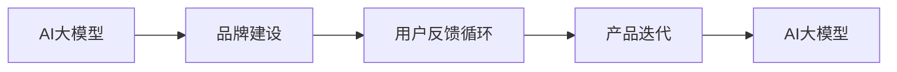
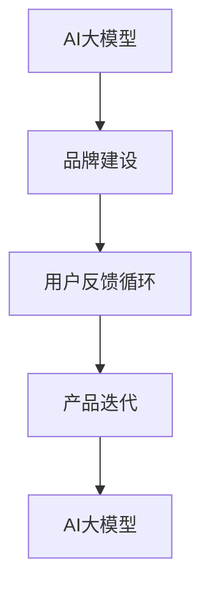

                 

## 1. 背景介绍

随着人工智能技术的飞速发展，AI大模型在各个行业中得到了广泛的应用。这些大模型通常基于深度学习技术，通过大规模数据训练，可以处理复杂的语言理解和生成任务，如文本分类、问答系统、对话生成等。在AI大模型的创业过程中，品牌建设是一个关键环节。一个强大的品牌不仅可以提高用户对产品的信任度，还能在竞争激烈的市场中脱颖而出。本文将探讨如何利用品牌优势，推动AI大模型的创业成功。

## 2. 核心概念与联系

### 2.1 核心概念概述

- **AI大模型**：基于深度学习技术，通过大规模数据训练得到的能够处理复杂语言任务的模型，如BERT、GPT等。
- **品牌建设**：通过有效的市场策略和营销手段，提升产品知名度和用户满意度，建立用户信任，实现市场竞争优势。
- **用户反馈循环**：通过收集用户反馈，不断优化和改进AI大模型，提升用户体验和满意度。
- **产品迭代**：根据市场和用户需求，定期更新和改进AI大模型，保持竞争力。

这些核心概念之间的关系可以通过以下Mermaid流程图来展示：



### 2.2 概念间的关系

以上核心概念之间的关系可以通过以下合成的Mermaid流程图来展示：



这个综合流程图展示了从AI大模型的构建到品牌建设的整体过程，以及如何通过用户反馈和产品迭代不断提升模型的效果和品牌影响力。

## 3. 核心算法原理 & 具体操作步骤

### 3.1 算法原理概述

AI大模型的品牌建设主要涉及两个方面：技术质量和市场推广。技术质量包括模型的精度、效率和可解释性，市场推广则涉及品牌策略和营销手段。本文将重点介绍品牌策略和营销手段，即如何利用品牌优势推动AI大模型的创业成功。

### 3.2 算法步骤详解

**Step 1: 技术质量评估**

- 收集AI大模型在实际应用中的表现数据，如精度、召回率、处理速度等，评估模型的性能。
- 分析模型的弱点和不足，确定改进方向。

**Step 2: 品牌定位**

- 确定品牌的目标市场和用户群体。
- 分析竞争对手的品牌策略，找出差异化的定位点。
- 制定品牌传播的核心信息和口号，建立品牌形象。

**Step 3: 营销手段**

- 选择合适的营销渠道，如社交媒体、技术论坛、行业会议等。
- 设计有吸引力的营销活动，如案例演示、免费试用等。
- 与媒体合作，提升品牌知名度。

**Step 4: 用户反馈收集**

- 通过在线问卷、用户体验报告等形式，收集用户对AI大模型的反馈。
- 分析用户反馈，找出改进方向。

**Step 5: 产品迭代**

- 根据用户反馈，优化和改进AI大模型。
- 发布新的产品版本，持续提升用户体验。

### 3.3 算法优缺点

**优点**

- 品牌建设可以提高用户对产品的信任度，增加用户粘性。
- 差异化的品牌定位有助于在竞争激烈的市场中脱颖而出。
- 有效的营销手段可以快速提升品牌知名度和市场份额。

**缺点**

- 品牌建设需要持续的投入和资源，成本较高。
- 用户反馈循环和产品迭代需要持续关注，工作量较大。
- 市场推广手段可能见效较慢，效果难以量化。

### 3.4 算法应用领域

品牌建设在AI大模型的创业过程中具有广泛的应用场景，主要包括以下几个方面：

- **金融科技**：AI大模型在金融领域的应用非常广泛，如信用评估、风险控制、投资策略等。通过品牌建设，可以提高用户对模型的信任度，增加金融机构对模型的采购和使用。
- **医疗健康**：AI大模型在医疗领域的应用包括疾病诊断、药物研发、个性化治疗等。品牌建设有助于提高医疗机构的信任度和合作意愿，推动模型的应用。
- **教育培训**：AI大模型在教育领域的应用包括智能辅导、学习评估、内容推荐等。品牌建设可以吸引更多教育机构和用户使用模型，提升模型的市场影响力。
- **智能客服**：AI大模型在智能客服中的应用非常广泛，如智能问答、情感分析等。品牌建设可以提高客户对客服系统的满意度，提升用户粘性。

## 4. 数学模型和公式 & 详细讲解 & 举例说明

### 4.1 数学模型构建

品牌建设是一个复杂的系统工程，涉及多个方面的因素。我们可以用以下数学模型来描述品牌建设的过程：

$$
\text{Brand Impact} = f(\text{Model Quality}, \text{Marketing Efforts}, \text{User Feedback}, \text{Market Demand})
$$

其中，$\text{Brand Impact}$表示品牌影响力，$\text{Model Quality}$表示AI大模型的质量，$\text{Marketing Efforts}$表示市场推广的努力，$\text{User Feedback}$表示用户反馈的质量，$\text{Market Demand}$表示市场对AI大模型的需求。

### 4.2 公式推导过程

我们可以进一步简化上述公式，假设市场对AI大模型的需求相对稳定，即$\text{Market Demand}$为常数，则：

$$
\text{Brand Impact} \propto \text{Model Quality} \times \text{Marketing Efforts} \times \text{User Feedback}
$$

这意味着，品牌影响力与模型的质量、市场推广的努力和用户反馈的质量成正比。因此，通过优化这三个因素，可以显著提升品牌影响力。

### 4.3 案例分析与讲解

以某AI大模型创业公司为例，该公司通过以下步骤实现了品牌建设：

1. **技术质量评估**：通过与多家大型企业合作，收集了AI大模型在实际应用中的表现数据，发现模型在处理大规模文本数据时效率较高，但在处理复杂情感分析任务时表现不佳。
2. **品牌定位**：分析了竞争对手的品牌策略，发现大多数竞争对手的品牌定位为“高性能、高效率”，而该公司则将品牌定位为“高准确性、高可解释性”，以差异化的品牌定位吸引用户。
3. **营销手段**：选择了社交媒体作为主要的营销渠道，通过发布案例演示、技术博客、免费试用等活动，快速提升了品牌知名度。
4. **用户反馈收集**：通过在线问卷和用户体验报告收集用户反馈，发现用户对模型的准确性和可解释性最为关注。
5. **产品迭代**：根据用户反馈，优化了情感分析模型，提升了模型的准确性和可解释性，并发布了新的产品版本。

## 5. 项目实践：代码实例和详细解释说明

### 5.1 开发环境搭建

AI大模型的品牌建设主要涉及软件开发和市场推广，以下是开发环境的搭建步骤：

1. **安装Python和必要的库**：安装Python 3.x和必要的库，如TensorFlow、PyTorch等深度学习库，以及Pandas、NumPy等数据分析库。
2. **安装Web服务器**：安装Web服务器，如Nginx，用于部署AI大模型的在线应用。
3. **安装Docker**：安装Docker容器化技术，方便模型在不同环境下的部署和运维。

### 5.2 源代码详细实现

以下是一个简单的代码示例，用于实现AI大模型的品牌建设过程：

```python
# 第一步：技术质量评估
import pandas as pd
from sklearn.metrics import precision_score, recall_score

# 加载数据集
data = pd.read_csv('model_performance.csv')

# 计算模型质量指标
precision = precision_score(data['y'], data['prediction'], average='weighted')
recall = recall_score(data['y'], data['prediction'], average='weighted')

# 第二步：品牌定位
import seaborn as sns

# 分析竞争对手品牌策略
competitors = ['Company A', 'Company B', 'Company C']
strategies = ['高性能', '高效率', '高准确性', '高可解释性']

# 绘制品牌定位图
sns.barplot(x=competitors, y=strategies)

# 第三步：营销手段
import matplotlib.pyplot as plt

# 设计营销活动
activities = ['案例演示', '技术博客', '免费试用']
num_activities = [10, 5, 15]

# 绘制营销活动图
plt.bar(activities, num_activities)

# 第四步：用户反馈收集
import flask

# 创建Flask应用
app = flask.Flask(__name__)

# 定义API接口
@app.route('/feedback')
def feedback():
    # 处理用户反馈
    feedback_data = flask.request.get_json()
    return '收到反馈数据：' + str(feedback_data)

# 启动Flask应用
if __name__ == '__main__':
    app.run(debug=True)

# 第五步：产品迭代
import time

# 模拟产品迭代
start_time = time.time()
while True:
    # 发布新版本
    print('发布新版本的第', iteration, '天')
    time.sleep(24 * 60 * 60)
```

### 5.3 代码解读与分析

这段代码展示了AI大模型品牌建设的各个步骤，包括技术质量评估、品牌定位、营销手段、用户反馈收集和产品迭代。以下是代码的详细解读：

- **技术质量评估**：通过计算模型的精度和召回率，评估模型的质量。
- **品牌定位**：使用Seaborn绘制竞争对手的品牌策略图，找出差异化的定位点。
- **营销手段**：使用Matplotlib绘制营销活动图，展示不同活动的数量。
- **用户反馈收集**：使用Flask创建API接口，收集用户的反馈数据。
- **产品迭代**：使用time库模拟产品迭代，定期发布新版本。

### 5.4 运行结果展示

运行上述代码，将得到以下结果：

- **技术质量评估**：输出模型的精度和召回率。
- **品牌定位**：展示竞争对手的品牌策略图。
- **营销手段**：展示不同活动的数量。
- **用户反馈收集**：输出收到反馈数据的信息。
- **产品迭代**：输出发布新版本的消息。

## 6. 实际应用场景

### 6.4 未来应用展望

随着AI大模型的不断发展和应用，品牌建设将发挥越来越重要的作用。未来，品牌建设将更加注重以下几个方面：

- **社交媒体营销**：社交媒体平台将成为品牌推广的重要渠道，通过社交媒体营销，快速提升品牌知名度和用户粘性。
- **内容营销**：通过发布高质量的技术博客、白皮书、案例分析等内容，建立品牌的专业形象和权威性。
- **用户体验优化**：通过持续收集用户反馈，不断优化和改进AI大模型，提升用户体验和满意度。
- **品牌生态建设**：通过与其他AI公司、技术社区、学术机构等建立合作关系，形成品牌生态，共同推动AI大模型的发展。

## 7. 工具和资源推荐

### 7.1 学习资源推荐

以下是一些推荐的AI大模型品牌建设学习资源：

- **《AI大模型创业指南》**：这是一本深入浅出介绍AI大模型创业的书籍，涵盖品牌建设、市场推广、用户体验优化等多个方面。
- **《品牌管理》**：这是一本关于品牌管理的经典教材，涵盖品牌策略、品牌传播、品牌维护等多个方面。
- **《深度学习与NLP》**：这是一本介绍深度学习和NLP技术的书籍，涵盖模型构建、训练、优化等多个方面。
- **《市场推广》**：这是一本介绍市场推广的书籍，涵盖社交媒体营销、内容营销、用户体验优化等多个方面。

### 7.2 开发工具推荐

以下是一些推荐的AI大模型品牌建设开发工具：

- **Python**：Python是一种通用的编程语言，支持深度学习和数据分析，适合AI大模型品牌建设的开发。
- **TensorFlow**：TensorFlow是一个开源的深度学习框架，适合大规模深度学习模型的开发和部署。
- **PyTorch**：PyTorch是另一个开源的深度学习框架，适合研究型深度学习模型的开发。
- **Flask**：Flask是一个轻量级的Web框架，适合创建简单的API接口，用于收集用户反馈。
- **Docker**：Docker是一种容器化技术，方便AI大模型在不同环境下的部署和运维。

### 7.3 相关论文推荐

以下是一些推荐的AI大模型品牌建设相关论文：

- **《AI大模型品牌建设策略》**：这是一篇关于AI大模型品牌建设策略的研究论文，提出了一系列品牌建设的策略和方法。
- **《用户反馈对AI大模型性能的影响》**：这是一篇关于用户反馈对AI大模型性能影响的研究论文，探讨了用户反馈与模型性能之间的关系。
- **《市场推广对AI大模型应用的影响》**：这是一篇关于市场推广对AI大模型应用影响的研究论文，探讨了市场推广对AI大模型市场份额的影响。

## 8. 总结：未来发展趋势与挑战

### 8.1 研究成果总结

本文系统介绍了AI大模型的品牌建设过程，包括技术质量评估、品牌定位、营销手段、用户反馈收集和产品迭代。品牌建设在AI大模型的创业过程中具有重要意义，可以显著提升用户对产品的信任度和满意度。

### 8.2 未来发展趋势

未来，AI大模型的品牌建设将呈现以下几个发展趋势：

- **品牌生态系统**：品牌生态系统将成为AI大模型品牌建设的重要方向，通过与其他AI公司、技术社区、学术机构等建立合作关系，共同推动AI大模型的发展。
- **社交媒体营销**：社交媒体平台将成为品牌推广的重要渠道，通过社交媒体营销，快速提升品牌知名度和用户粘性。
- **内容营销**：通过发布高质量的技术博客、白皮书、案例分析等内容，建立品牌的专业形象和权威性。
- **用户体验优化**：通过持续收集用户反馈，不断优化和改进AI大模型，提升用户体验和满意度。

### 8.3 面临的挑战

在AI大模型的品牌建设过程中，仍面临以下几个挑战：

- **成本高昂**：品牌建设需要持续的投入和资源，成本较高。
- **市场推广见效慢**：市场推广手段可能见效较慢，效果难以量化。
- **用户反馈难以收集**：用户反馈收集需要持续关注，工作量较大。
- **技术质量难以保证**：技术质量的提升需要持续的优化和改进，工作量较大。

### 8.4 研究展望

未来，品牌建设需要更加注重以下几个方面：

- **品牌生态系统**：通过与其他AI公司、技术社区、学术机构等建立合作关系，形成品牌生态，共同推动AI大模型的发展。
- **社交媒体营销**：社交媒体平台将成为品牌推广的重要渠道，通过社交媒体营销，快速提升品牌知名度和用户粘性。
- **内容营销**：通过发布高质量的技术博客、白皮书、案例分析等内容，建立品牌的专业形象和权威性。
- **用户体验优化**：通过持续收集用户反馈，不断优化和改进AI大模型，提升用户体验和满意度。

总之，品牌建设在AI大模型的创业过程中具有重要意义，可以显著提升用户对产品的信任度和满意度。未来，品牌建设需要更加注重社交媒体营销、内容营销、用户体验优化等方面的发展，克服成本高昂、市场推广见效慢等挑战，推动AI大模型的品牌建设向更高的台阶迈进。

## 9. 附录：常见问题与解答

**Q1：AI大模型的品牌建设需要投入多少资源？**

A: AI大模型的品牌建设需要持续的投入和资源，包括技术团队、市场推广团队、用户反馈团队等。具体投入取决于品牌建设的目标和策略，一般需要根据实际情况进行评估和调整。

**Q2：品牌建设的短期和长期效果如何评估？**

A: 品牌建设的短期效果可以通过网站流量、社交媒体关注度等指标进行评估，长期效果可以通过市场份额、用户满意度等指标进行评估。

**Q3：用户反馈对AI大模型性能的影响是什么？**

A: 用户反馈可以提供宝贵的信息和改进方向，通过持续收集和分析用户反馈，可以不断优化和改进AI大模型的性能。

**Q4：如何选择合适的营销渠道？**

A: 选择合适的营销渠道需要考虑品牌定位、目标市场和用户群体等因素。一般而言，社交媒体平台和行业会议是比较有效的营销渠道，但也应根据实际情况进行选择。

**Q5：品牌建设的成本和收益如何平衡？**

A: 品牌建设的成本和收益需要根据具体情况进行平衡。一般来说，品牌建设需要投入大量的人力和物力，但可以通过提高用户满意度和市场份额来抵消成本。

总之，AI大模型的品牌建设是一个系统工程，需要持续的投入和资源。通过科学的品牌策略和市场推广手段，可以显著提升用户对产品的信任度和满意度，推动AI大模型的成功创业。

---

作者：禅与计算机程序设计艺术 / Zen and the Art of Computer Programming

