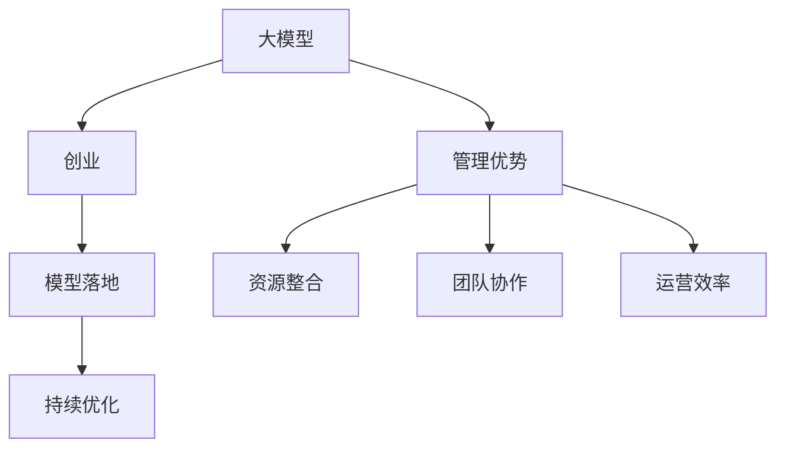

                 

# AI 大模型创业：如何利用管理优势？

## 1. 背景介绍

在AI领域，尤其是大模型创业中，管理优势是至关重要的。随着深度学习技术的不断成熟，越来越多的AI公司开始利用大模型进行创业。这些大模型通常具备强大的数据处理能力和高效的学习速度，但在实际应用中，如何最大化其潜力，提升业务价值，成为创业者需要关注的核心问题。本文将从管理优势的角度，探讨如何利用管理优势，优化大模型创业的成功几率。

## 2. 核心概念与联系

### 2.1 核心概念概述

在大模型创业中，以下几个核心概念尤为关键：

- **大模型**：指通过大规模数据训练得到的深度学习模型，如BERT、GPT、ViT等。这些模型通常具有超强的计算能力和广泛的适用性，能够在多种任务上取得优异的表现。
- **创业**：指利用先进技术，结合创新理念，创立新的业务模式和市场机会。在AI领域，创业通常包括模型开发、产品设计、市场推广等多个环节。
- **管理优势**：指企业利用管理理念和技术手段，最大化模型价值，优化资源配置，提升业务效益的能力。管理优势主要包括资源整合、团队协作、运营效率等方面。
- **模型落地**：指将大模型应用于具体业务场景，进行产品化和市场化，实现商业价值。模型落地需要考虑模型适配、数据处理、系统集成等诸多因素。
- **持续优化**：指在模型落地过程中，通过反馈机制不断调整模型参数和架构，提升模型性能和效率。持续优化是保持模型长期竞争力的重要手段。

这些核心概念之间相互联系，构成大模型创业的关键框架。通过合理利用管理优势，可以更有效地整合资源，优化模型应用，提升创业成功率。

### 2.2 概念间的关系

通过Mermaid流程图，我们可以清晰地展示这些核心概念之间的关系：



这个流程图示意了从大模型到创业，再到模型落地和持续优化的整个过程，其中管理优势起到关键作用。通过资源整合、团队协作和运营效率的提升，可以更好地支持模型的应用和优化，进而推动业务成功。

## 3. 核心算法原理 & 具体操作步骤

### 3.1 算法原理概述

在大模型创业中，管理优势的发挥主要依赖于以下几个核心算法原理：

- **资源整合**：通过科学合理的资源配置，将大模型应用到最合适的业务场景中。资源整合包括硬件资源的配置（如GPU、TPU等）、数据资源的准备（如数据预处理、数据增强等）以及人力资源的优化（如招聘专家、分配任务等）。
- **团队协作**：通过团队建设和管理，确保各环节的高效协作。团队协作包括明确分工、定期沟通、知识共享等，提升团队的整体工作效率。
- **运营效率**：通过流程优化和工具支持，提升模型应用的效率和效果。运营效率包括自动化部署、监控报警、版本管理等，确保模型应用的稳定性和可扩展性。

### 3.2 算法步骤详解

基于上述算法原理，大模型创业的管理优势可以通过以下步骤实现：

1. **需求分析**：明确公司目标和用户需求，选择适合的大模型进行应用。例如，针对文本处理任务，可以选择BERT、GPT等通用模型，针对图像处理任务，可以选择ViT等模型。

2. **资源规划**：根据应用需求，规划所需的计算资源、数据资源和人力资源。例如，对于大规模图像处理任务，可能需要配置多台GPU或TPU设备，存储大量标注数据，招聘具备图像处理经验的工程师等。

3. **团队建设**：组建跨领域的团队，包括数据科学家、工程师、产品经理等，明确团队成员的分工和职责，定期召开沟通会议，分享进展和问题，提升团队的协作效率。

4. **流程优化**：设计和实施高效的模型应用流程，包括数据准备、模型训练、验证、测试、部署和监控等环节。例如，可以引入CI/CD工具链，实现自动化测试和部署，提升效率。

5. **工具支持**：选择和使用合适的开发和运营工具，如Jupyter Notebook、PyTorch、TensorFlow等，确保模型开发和应用的便捷性和高效性。

### 3.3 算法优缺点

利用管理优势进行大模型创业，具有以下优点：

- **高效资源利用**：通过科学规划和优化，确保资源的高效利用，减少资源浪费。
- **团队协作顺畅**：团队建设和管理确保各环节高效协作，提升整体工作效率。
- **运营效率提升**：流程优化和工具支持可以大幅提升模型应用的效率和效果。

同时，也存在以下缺点：

- **初期成本较高**：资源规划和团队建设需要较高的初期投入。
- **管理复杂度高**：管理优势的实现需要一定的专业知识和经验，管理复杂度较高。
- **灵活性受限**：一旦规划完成，部分资源和流程可能难以灵活调整，适应性较差。

### 3.4 算法应用领域

管理优势在大模型创业中的应用领域非常广泛，主要包括以下几个方面：

- **自然语言处理**：如聊天机器人、文本分类、情感分析等。通过科学资源规划和高效团队协作，可以实现模型的高效应用。
- **计算机视觉**：如图像识别、视频分析等。通过合理配置计算资源和数据资源，可以实现模型的快速训练和部署。
- **语音识别**：如智能语音助手、语音翻译等。通过优化流程和支持工具，可以实现模型的高效应用。
- **医疗健康**：如疾病诊断、健康管理等。通过科学管理优势，可以提升模型的精度和可靠性，服务于更多实际需求。
- **金融科技**：如风险评估、智能投顾等。通过高效运营和持续优化，可以实现模型的实时化和精准化。

以上领域只是冰山一角，实际上，管理优势在大模型创业中的应用范围非常广泛，几乎涵盖了所有AI应用场景。

## 4. 数学模型和公式 & 详细讲解  
### 4.1 数学模型构建

为了更好地理解和应用大模型，本节将介绍一些基本的数学模型构建方法。

假设我们有一个预训练的大模型 $M$，应用场景为图像分类任务。模型的输入为 $x$，输出为 $y$，模型的参数为 $\theta$。

定义模型的损失函数为：

$$
L = \frac{1}{N}\sum_{i=1}^N \ell(y_i, M(x_i))
$$

其中，$\ell$ 为损失函数，$N$ 为训练样本数量。常见的损失函数包括交叉熵损失、均方误差损失等。

### 4.2 公式推导过程

以下以交叉熵损失函数为例，推导模型训练的数学公式。

假设模型的输出为 $M(x_i)$，真实标签为 $y_i$，则交叉熵损失函数为：

$$
L_i = -y_i\log M(x_i) - (1-y_i)\log(1-M(x_i))
$$

对所有样本求平均，得到整体损失函数：

$$
L = \frac{1}{N}\sum_{i=1}^N L_i
$$

通过反向传播算法，可以计算出模型参数 $\theta$ 的梯度，更新模型参数。

### 4.3 案例分析与讲解

以Google的BERT模型为例，分析其在自然语言处理领域的应用和效果。

BERT模型通过在大规模无标签文本数据上进行预训练，学习到了丰富的语言知识和语义表示。在具体任务上进行微调时，可以在预训练的基础上，通过添加任务适配层和损失函数，进行有监督的学习。例如，在情感分析任务上，可以在预训练模型的顶层添加一个线性分类器，以二分类任务为例，损失函数为：

$$
L = -(y\log\sigma(M(x)) + (1-y)\log(1-\sigma(M(x))))
$$

其中，$\sigma$ 为Sigmoid函数。通过反向传播算法，可以更新模型参数，优化模型在情感分析任务上的表现。

## 5. 项目实践：代码实例和详细解释说明

### 5.1 开发环境搭建

在进行大模型创业项目实践时，开发环境搭建至关重要。以下是一些推荐的开发环境搭建步骤：

1. **安装Python环境**：
   ```bash
   sudo apt-get update
   sudo apt-get install python3
   ```

2. **安装虚拟环境**：
   ```bash
   python3 -m venv myenv
   source myenv/bin/activate
   ```

3. **安装依赖包**：
   ```bash
   pip install torch torchvision
   pip install numpy scipy pandas scikit-learn
   ```

4. **安装框架和库**：
   ```bash
   pip install transformers
   pip install fastai
   pip install hydra-core
   ```

### 5.2 源代码详细实现

以下是一个简单的Python代码示例，展示了如何使用Transformers库进行BERT模型微调：

```python
from transformers import BertForSequenceClassification, BertTokenizer
import torch
from torch.utils.data import Dataset, DataLoader

# 定义数据集
class MyDataset(Dataset):
    def __init__(self, texts, labels):
        self.tokenizer = BertTokenizer.from_pretrained('bert-base-uncased')
        self.texts = texts
        self.labels = labels
        
    def __len__(self):
        return len(self.texts)
    
    def __getitem__(self, idx):
        text = self.texts[idx]
        label = self.labels[idx]
        encoding = self.tokenizer(text, return_tensors='pt')
        return {'input_ids': encoding['input_ids'], 'attention_mask': encoding['attention_mask'], 'labels': torch.tensor(label)}

# 加载模型和数据
model = BertForSequenceClassification.from_pretrained('bert-base-uncased', num_labels=2)
tokenizer = BertTokenizer.from_pretrained('bert-base-uncased')
train_dataset = MyDataset(train_texts, train_labels)
val_dataset = MyDataset(val_texts, val_labels)
test_dataset = MyDataset(test_texts, test_labels)

# 定义训练参数
batch_size = 32
learning_rate = 2e-5
num_epochs = 3

# 定义优化器
optimizer = torch.optim.AdamW(model.parameters(), lr=learning_rate)

# 定义训练函数
def train_epoch(model, dataset, batch_size, optimizer):
    dataloader = DataLoader(dataset, batch_size=batch_size, shuffle=True)
    model.train()
    epoch_loss = 0
    for batch in dataloader:
        input_ids = batch['input_ids'].to(device)
        attention_mask = batch['attention_mask'].to(device)
        labels = batch['labels'].to(device)
        model.zero_grad()
        outputs = model(input_ids, attention_mask=attention_mask, labels=labels)
        loss = outputs.loss
        epoch_loss += loss.item()
        loss.backward()
        optimizer.step()
    return epoch_loss / len(dataloader)

# 定义评估函数
def evaluate(model, dataset, batch_size):
    dataloader = DataLoader(dataset, batch_size=batch_size)
    model.eval()
    preds, labels = [], []
    with torch.no_grad():
        for batch in dataloader:
            input_ids = batch['input_ids'].to(device)
            attention_mask = batch['attention_mask'].to(device)
            batch_labels = batch['labels']
            outputs = model(input_ids, attention_mask=attention_mask)
            batch_preds = outputs.logits.argmax(dim=1).to('cpu').tolist()
            batch_labels = batch_labels.to('cpu').tolist()
            for pred, label in zip(batch_preds, batch_labels):
                preds.append(pred)
                labels.append(label)
    
    print(classification_report(labels, preds))

# 训练模型
device = torch.device('cuda' if torch.cuda.is_available() else 'cpu')
model.to(device)

for epoch in range(num_epochs):
    train_loss = train_epoch(model, train_dataset, batch_size, optimizer)
    print(f'Epoch {epoch+1}, train loss: {train_loss:.3f}')
    
    evaluate(model, val_dataset, batch_size)

print('Final test results:')
evaluate(model, test_dataset, batch_size)
```

### 5.3 代码解读与分析

以上代码展示了如何使用BERT模型进行二分类任务的微调。具体步骤如下：

1. **数据集定义**：定义了数据集的类，包括文本预处理和编码过程。
2. **模型加载**：加载预训练的BERT模型，并根据任务需求调整输出层和损失函数。
3. **训练参数配置**：定义训练参数，如批大小、学习率等。
4. **优化器定义**：定义优化器，如AdamW等。
5. **训练函数定义**：定义训练函数，包括数据迭代、模型前向传播、反向传播、参数更新等。
6. **评估函数定义**：定义评估函数，包括数据迭代、模型推理、损失计算等。
7. **训练过程**：在训练函数中定义了模型训练的完整流程，包括训练函数、评估函数和训练参数。

## 6. 实际应用场景

### 6.1 自然语言处理

自然语言处理是大模型创业的主要应用场景之一。通过科学管理和优化，可以实现模型的高效应用。例如，可以利用BERT模型进行文本分类、命名实体识别、情感分析等任务，提升模型的准确率和鲁棒性。

### 6.2 计算机视觉

计算机视觉任务，如图像分类、目标检测、图像生成等，也需要大模型的支持。通过合理配置计算资源和数据资源，可以实现模型的快速训练和部署。例如，可以利用ViT模型进行图像分类和目标检测任务。

### 6.3 语音识别

语音识别是大模型创业的另一个重要应用场景。通过优化流程和支持工具，可以实现模型的高效应用。例如，可以利用WaveNet模型进行语音合成和识别任务。

### 6.4 医疗健康

在医疗健康领域，大模型可以帮助医生进行疾病诊断、健康管理等任务。通过科学管理和优化，可以实现模型的高效应用和精准化。例如，可以利用GPT模型进行医学文本分类和知识图谱构建。

### 6.5 金融科技

金融科技领域，大模型可以帮助金融机构进行风险评估、智能投顾等任务。通过高效运营和持续优化，可以实现模型的实时化和精准化。例如，可以利用BERT模型进行金融文本分类和情感分析任务。

## 7. 工具和资源推荐

### 7.1 学习资源推荐

为了帮助开发者更好地掌握大模型创业的技术，以下是一些推荐的学习资源：

1. **《深度学习》教材**：由Ian Goodfellow、Yoshua Bengio和Aaron Courville编写的经典教材，详细介绍了深度学习的基本概念和算法。
2. **《自然语言处理综述》课程**：斯坦福大学的自然语言处理课程，涵盖NLP领域的各个方面，适合初学者和进阶者。
3. **《Transformers》书籍**：由Hugging Face的研究团队编写，全面介绍了Transformer架构和预训练模型的应用。
4. **GitHub开源项目**：如PyTorch、TensorFlow等框架的官方示例代码，适合学习和实践。
5. **在线课程和MOOC平台**：如Coursera、edX、Udacity等平台上的深度学习和NLP课程，适合自学和提升。

### 7.2 开发工具推荐

以下是一些常用的开发工具，可以帮助开发者更高效地进行大模型创业：

1. **Jupyter Notebook**：一个交互式的开发环境，适合数据预处理、模型训练和结果展示。
2. **PyTorch**：一个高效的深度学习框架，支持动态计算图和GPU加速，适合模型开发和训练。
3. **TensorFlow**：一个灵活的深度学习框架，支持分布式训练和生产部署，适合大规模模型应用。
4. **Transformers**：一个基于TensorFlow和PyTorch的NLP库，支持预训练模型和微调，适合模型应用和部署。
5. **Scikit-learn**：一个流行的机器学习库，支持多种算法和模型，适合数据分析和模型评估。

### 7.3 相关论文推荐

以下是一些推荐的相关论文，可以进一步学习和了解大模型创业的技术：

1. **Attention is All You Need**：Google的Transformer架构，标志着深度学习进入自注意力机制时代。
2. **BERT: Pre-training of Deep Bidirectional Transformers for Language Understanding**：Google的BERT模型，展示了预训练和微调在大模型创业中的应用。
3. **Language Models are Unsupervised Multitask Learners**：OpenAI的GPT模型，展示了零样本和少样本学习在大模型创业中的应用。
4. **Parameter-Efficient Transfer Learning for NLP**：Google的Adapter和LoRA方法，展示了参数高效微调在大模型创业中的应用。
5. **AdaLoRA: Adaptive Low-Rank Adaptation for Parameter-Efficient Fine-Tuning**：微软的AdaLoRA方法，展示了低秩适应的微调方法。

## 8. 总结：未来发展趋势与挑战

### 8.1 研究成果总结

在大模型创业中，管理优势的利用是关键。通过科学配置资源、高效团队协作和持续优化，可以实现模型的最大化应用，提升业务效益。具体的研究成果如下：

1. **资源整合**：通过合理配置计算资源和数据资源，确保模型的高效应用。例如，在图像处理任务上，配置多台GPU或TPU设备，存储大量标注数据。
2. **团队协作**：通过明确分工、定期沟通和知识共享，提升团队的协作效率。例如，在自然语言处理任务上，组建跨领域的团队，包括数据科学家、工程师和产品经理。
3. **运营效率**：通过优化流程和支持工具，提升模型应用的效率和效果。例如，在语音识别任务上，引入CI/CD工具链，实现自动化测试和部署。

### 8.2 未来发展趋势

展望未来，大模型创业将继续保持高速发展，呈现以下几个趋势：

1. **算法创新**：深度学习算法将继续发展，新模型和新框架不断涌现，提升模型的性能和效率。
2. **模型规模增大**：预训练模型的规模将继续增大，模型参数和计算资源需求增加，但这也将带来更强大的语言表示能力和更广泛的应用场景。
3. **跨领域应用**：大模型创业将更多地应用于交叉领域，如医疗、金融、教育等，推动跨学科的创新。
4. **数据和算法协同**：大模型创业将更多地关注数据质量和算法优化，提升模型的稳定性和可靠性。
5. **开源生态**：开源社区和协作平台将更多地支持大模型创业，提升模型的可扩展性和可复用性。

### 8.3 面临的挑战

尽管大模型创业前景广阔，但仍面临诸多挑战：

1. **资源需求高**：大规模模型和复杂任务需要大量的计算资源和数据资源，初期投入成本高。
2. **技术壁垒高**：深度学习和NLP技术复杂度高，需要深厚的专业知识和技能。
3. **市场竞争激烈**：大模型创业吸引了众多公司和机构的关注，市场竞争激烈，生存压力大。
4. **数据隐私和伦理**：大规模数据应用可能涉及用户隐私和伦理问题，需要严格的数据管理和隐私保护措施。
5. **模型泛化能力**：模型的泛化能力不足，难以应对未知数据和场景。

### 8.4 研究展望

未来，大模型创业的研究将进一步深入，关注以下几个方向：

1. **跨模态学习**：将视觉、语音、文本等多种模态信息融合，提升模型的多模态理解能力。
2. **元学习**：研究如何通过少量的数据和信息，快速适应新任务和场景，提升模型的迁移学习能力。
3. **因果推断**：研究模型在因果关系中的推理能力，提升模型的决策可解释性和鲁棒性。
4. **可持续性**：研究如何实现模型的持续学习，避免灾难性遗忘和知识退化。
5. **公平性**：研究如何消除模型中的偏见和歧视，提升模型的公平性和可信度。

通过持续的技术创新和优化，大模型创业将取得更多突破，为AI技术的落地应用带来更大的价值。

## 9. 附录：常见问题与解答

### Q1: 大模型创业需要哪些核心资源？

A: 大模型创业需要以下核心资源：

1. **计算资源**：如GPU、TPU等硬件设备，用于模型训练和推理。
2. **数据资源**：如大规模标注数据集，用于模型预训练和微调。
3. **人力资源**：如数据科学家、工程师、产品经理等，进行模型开发、测试和部署。
4. **软件资源**：如深度学习框架（如PyTorch、TensorFlow）和NLP库（如Transformers），支持模型开发和应用。

### Q2: 大模型创业过程中，如何管理团队协作？

A: 管理团队协作主要通过以下几个方面实现：

1. **明确分工**：根据团队成员的技能和兴趣，明确各自的任务和职责。
2. **定期沟通**：定期召开团队会议，分享进展和问题，进行沟通和协调。
3. **知识共享**：建立知识库和共享平台，便于团队成员互相学习和交流。
4. **项目里程碑**：设定明确的项目里程碑和阶段目标，确保项目进度和质量。

### Q3: 如何应对大模型创业中的数据隐私和伦理问题？

A: 应对数据隐私和伦理问题，主要通过以下几个方面实现：

1. **数据脱敏**：对用户数据进行脱敏处理，保护用户隐私。
2. **数据加密**：对数据进行加密存储和传输，防止数据泄露。
3. **隐私保护**：遵守相关法律法规，如GDPR、CCPA等，确保用户数据安全。
4. **透明度和可解释性**：确保模型的决策过程透明，提供可解释的模型输出。

### Q4: 如何提升大模型创业中的运营效率？

A: 提升运营效率主要通过以下几个方面实现：

1. **自动化部署**：引入CI/CD工具链，实现模型的自动化测试和部署，提升效率。
2. **监控报警**：实时监测模型性能和系统状态，设置异常告警阈值，确保系统稳定。
3. **版本管理**：引入版本控制工具，管理模型和代码的版本，便于回滚和迭代。

### Q5: 如何评估大模型创业的成功与否？

A: 评估大模型创业的成功与否，主要通过以下几个方面实现：

1. **市场反馈**：通过用户反馈和市场表现，评估模型的应用效果和用户满意度。
2. **性能指标**：评估模型在精度、速度、鲁棒性等方面的性能指标，确保模型的高效应用。
3. **经济效益**：评估模型的经济价值，包括投资回报率、客户转化率等。

作者：禅与计算机程序设计艺术 / Zen and the Art of Computer Programming

