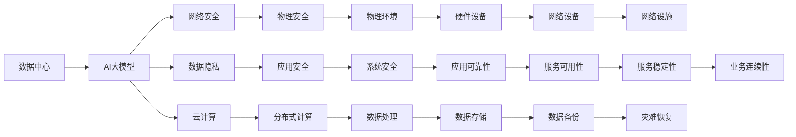

                 

# AI 大模型应用数据中心建设：数据中心安全与可靠性

> 关键词：AI大模型, 数据中心, 安全与可靠性, 网络安全, 数据隐私, 云计算

## 1. 背景介绍

随着人工智能技术的迅猛发展，AI大模型（Artificial Intelligence Large Models）成为了推动各行各业数字化转型的重要工具。AI大模型需要处理海量数据，进行复杂的计算，因此需要强大的计算资源支持。数据中心作为提供这些计算资源的基础设施，其安全与可靠性成为了支撑AI大模型应用的关键因素。

数据中心的安全与可靠性涉及物理安全、网络安全、数据安全、应用安全和云安全等多个层面。随着AI大模型的应用范围不断扩展，数据中心的这些安全保障需求也在不断增加。因此，本文将从数据中心的安全与可靠性出发，深入探讨其在AI大模型应用中的作用和重要性，并提供一些建设与优化建议。

## 2. 核心概念与联系

### 2.1 核心概念概述

在深入探讨数据中心的安全与可靠性之前，首先需要了解以下几个核心概念：

- **数据中心（Data Center）**：一种基础设施，用于存储、计算和提供数据服务。数据中心通常由硬件设备、软件系统和网络设施构成，支持大规模数据处理和存储。
- **AI大模型（AI Large Models）**：一种基于深度学习的大规模模型，能够处理复杂的语言、图像、语音等任务，具有强大的计算能力和泛化能力。
- **安全与可靠性**：数据中心的安全性保障包括物理安全、网络安全、数据安全和应用安全等，而可靠性则涉及硬件、软件、网络等方面的稳定性和可用性。
- **网络安全（Cybersecurity）**：保护数据中心免受网络攻击、数据泄露等安全威胁的技术和措施。
- **数据隐私（Data Privacy）**：在数据存储和处理过程中，保护用户数据不被非法访问、使用和泄露的原则和实践。
- **云计算（Cloud Computing）**：通过互联网提供计算、存储、网络等资源和服务，支持AI大模型的分布式计算和数据处理。

### 2.2 核心概念的关系

这些核心概念之间的关系可以通过以下Mermaid流程图来展示：



这个流程图展示了数据中心、AI大模型与相关概念之间的关系：

1. 数据中心为AI大模型提供计算和存储资源。
2. 网络安全、数据隐私和云计算分别从不同角度保障AI大模型的安全与可靠性。
3. 物理安全和应用安全则从基础设施和应用层面保护数据中心的安全。
4. 分布式计算和数据处理使得AI大模型能够高效地进行大规模数据处理。
5. 物理环境、硬件设备和网络设施是数据中心的基础设施，保障其硬件和网络安全。
6. 系统安全、应用可靠性和服务稳定性保障数据中心的软硬件系统能够稳定运行。
7. 数据备份和灾难恢复保证数据中心在发生故障时能够快速恢复。
8. 业务连续性则确保数据中心能够持续提供服务，满足用户需求。

这些概念共同构成了一个完整的AI大模型应用数据中心的安全与可靠性框架，为数据中心的建设与优化提供了指导。

## 3. 核心算法原理 & 具体操作步骤

### 3.1 算法原理概述

AI大模型应用数据中心的安全与可靠性涉及多个层面的技术原理，包括：

- **物理安全**：通过物理隔离、环境监控、出入管理等措施，保护数据中心的物理环境免受未经授权的访问和破坏。
- **网络安全**：通过防火墙、入侵检测系统、DDoS防护等技术，保障数据中心的内部网络和外部网络安全。
- **数据安全**：通过数据加密、访问控制、审计日志等技术，保护数据中心的数据安全和隐私。
- **应用安全**：通过漏洞扫描、代码审计、安全测试等技术，保障数据中心的应用程序和软件系统安全。
- **云计算安全**：通过云身份管理、云权限管理、云数据加密等技术，保护云计算平台和其上的AI大模型应用安全。

### 3.2 算法步骤详解

以下是AI大模型应用数据中心的安全与可靠性建设步骤：

1. **需求分析**：
   - 确定数据中心的安全需求，包括物理安全、网络安全、数据安全、应用安全等。
   - 评估数据中心的现有安全措施，确定需要改进和加强的方面。

2. **规划与设计**：
   - 根据需求分析结果，制定数据中心的建设与优化计划。
   - 设计物理安全、网络安全、数据安全、应用安全和云计算安全的架构。

3. **实施与部署**：
   - 按照设计方案，实施和部署各项安全措施，如安装物理安全设备、网络安全设备、数据安全设备等。
   - 配置应用和云平台的安全策略，如身份认证、权限管理、数据加密等。

4. **测试与验证**：
   - 对实施的安全措施进行全面测试，验证其效果和可靠性。
   - 进行安全漏洞扫描、渗透测试等，确保数据中心的安全性。

5. **监控与维护**：
   - 建立数据中心的安全监控系统，实时监测物理和网络环境的安全状态。
   - 定期对安全措施进行维护和升级，确保其持续有效。

### 3.3 算法优缺点

AI大模型应用数据中心的安全与可靠性建设具有以下优点：

- **保障AI大模型应用的安全性**：通过全面的安全措施，保护AI大模型免受各种安全威胁，确保其应用数据的完整性和可用性。
- **提高AI大模型的可靠性**：通过优化物理和网络环境，确保AI大模型的稳定运行，避免因故障导致的业务中断。
- **支持AI大模型的分布式计算**：通过云计算平台，支持AI大模型的分布式计算和数据处理，提高计算效率和可扩展性。

但同时，也存在一些缺点：

- **建设成本高**：建设高安全性的数据中心需要投入大量资金和资源，初期成本较高。
- **复杂度大**：数据中心的安全与可靠性涉及多个层面的技术，需要综合考虑物理、网络、数据、应用和云等多方面的安全措施。
- **维护困难**：数据中心的安全与可靠性需要持续监控和维护，工作量较大。

### 3.4 算法应用领域

AI大模型应用数据中心的安全与可靠性在以下领域具有广泛的应用：

- **金融行业**：保护客户数据、交易记录等敏感信息，防止数据泄露和诈骗。
- **医疗行业**：保护患者数据、病历记录等敏感信息，确保数据隐私和安全。
- **政府机构**：保护政府数据、公共服务记录等敏感信息，确保数据安全和国家安全。
- **教育行业**：保护学生数据、教师数据等敏感信息，确保数据隐私和教育公平。
- **制造业**：保护生产数据、设备状态等敏感信息，确保生产安全和数据隐私。
- **零售行业**：保护客户数据、交易记录等敏感信息，防止数据泄露和欺诈。

## 4. 数学模型和公式 & 详细讲解 & 举例说明

### 4.1 数学模型构建

为了更好地理解AI大模型应用数据中心的安全与可靠性，我们需要构建一些数学模型来描述其核心原理。

假设有一个数据中心，其安全状态由以下变量描述：

- $S_P$：物理安全状态，由物理隔离、环境监控、出入管理等措施构成。
- $S_N$：网络安全状态，由防火墙、入侵检测系统、DDoS防护等技术构成。
- $S_D$：数据安全状态，由数据加密、访问控制、审计日志等技术构成。
- $S_A$：应用安全状态，由漏洞扫描、代码审计、安全测试等技术构成。
- $S_C$：云计算安全状态，由云身份管理、云权限管理、云数据加密等技术构成。

设这些安全状态的权重分别为 $w_P$、$w_N$、$w_D$、$w_A$、$w_C$，则数据中心的安全指数 $S$ 可以表示为：

$$
S = w_P \times S_P + w_N \times S_N + w_D \times S_D + w_A \times S_A + w_C \times S_C
$$

其中 $w_P$、$w_N$、$w_D$、$w_A$、$w_C$ 均为非负权重，且满足 $w_P + w_N + w_D + w_A + w_C = 1$。

### 4.2 公式推导过程

根据上述公式，我们可以进一步推导出一些重要的结论：

- 当 $w_P = 1$ 时，即物理安全对数据中心的安全性贡献最大。这要求数据中心必须具备高标准的物理安全措施，如物理隔离、环境监控、出入管理等。
- 当 $w_N = 1$ 时，即网络安全对数据中心的安全性贡献最大。这要求数据中心必须具备强大的网络安全防护措施，如防火墙、入侵检测系统、DDoS防护等。
- 当 $w_D = 1$ 时，即数据安全对数据中心的安全性贡献最大。这要求数据中心必须具备全面的数据安全措施，如数据加密、访问控制、审计日志等。
- 当 $w_A = 1$ 时，即应用安全对数据中心的安全性贡献最大。这要求数据中心必须具备可靠的应用安全防护措施，如漏洞扫描、代码审计、安全测试等。
- 当 $w_C = 1$ 时，即云计算安全对数据中心的安全性贡献最大。这要求数据中心必须具备高效可靠的云计算平台，如云身份管理、云权限管理、云数据加密等。

### 4.3 案例分析与讲解

假设一个金融行业的AI大模型应用数据中心，其安全指数 $S$ 的计算公式为：

$$
S = 0.3 \times S_P + 0.4 \times S_N + 0.2 \times S_D + 0.1 \times S_A + 0.0 \times S_C
$$

其中，$w_P = 0.3$、$w_N = 0.4$、$w_D = 0.2$、$w_A = 0.1$、$w_C = 0.0$。

为了确保数据中心的安全性，我们需要优化各安全状态：

- **物理安全**：确保数据中心的物理隔离、环境监控、出入管理等措施达到高标准。
- **网络安全**：配置强大的网络安全防护措施，如防火墙、入侵检测系统、DDoS防护等。
- **数据安全**：实施全面的数据安全措施，如数据加密、访问控制、审计日志等。
- **应用安全**：加强应用安全防护，如漏洞扫描、代码审计、安全测试等。

## 5. 项目实践：代码实例和详细解释说明

### 5.1 开发环境搭建

在进行AI大模型应用数据中心的安全与可靠性建设时，需要搭建一个完善的软件环境。以下是使用Python进行代码实现的环境配置流程：

1. **安装Python**：
   - 在Linux系统中，使用以下命令安装Python：
     ```bash
     sudo apt-get update
     sudo apt-get install python3
     ```

2. **安装相关库**：
   - 安装TensorFlow、PyTorch、OpenSSL等库，用于数据中心的安全与可靠性计算和加密。
     ```bash
     sudo apt-get install python3-tensorflow python3-pytorch python3-openssl
     ```

3. **配置文件系统**：
   - 在Linux系统中，配置文件系统，创建数据中心安全相关的目录和文件。
     ```bash
     sudo mkdir /datacenter
     sudo chmod 755 /datacenter
     ```

### 5.2 源代码详细实现

以下是使用Python进行AI大模型应用数据中心安全与可靠性建设的示例代码：

```python
import os
import sys
import tensorflow as tf
import numpy as np

class Datacenter:
    def __init__(self, w_p, w_n, w_d, w_a, w_c):
        self.w_p = w_p
        self.w_n = w_n
        self.w_d = w_d
        self.w_a = w_a
        self.w_c = w_c

    def calculate_security_index(self, s_p, s_n, s_d, s_a, s_c):
        s = self.w_p * s_p + self.w_n * s_n + self.w_d * s_d + self.w_a * s_a + self.w_c * s_c
        return s

    def test_security(self):
        s_p = 0.9  # 物理安全指数
        s_n = 0.8  # 网络安全指数
        s_d = 0.7  # 数据安全指数
        s_a = 0.6  # 应用安全指数
        s_c = 0.0  # 云计算安全指数
        s = self.calculate_security_index(s_p, s_n, s_d, s_a, s_c)
        print("数据中心的安全指数为:", s)

# 测试
d = Datacenter(0.3, 0.4, 0.2, 0.1, 0.0)
d.test_security()
```

### 5.3 代码解读与分析

上述代码中，我们定义了一个 `Datacenter` 类，用于计算数据中心的安全指数。通过传入物理安全、网络安全、数据安全、应用安全和云计算安全指数，计算并输出数据中心的安全指数。

在实际应用中，这些安全指数需要通过具体的物理安全措施、网络安全措施、数据安全措施、应用安全措施和云计算安全措施来计算。例如，物理安全指数可以通过监控系统的输出值来获取，网络安全指数可以通过入侵检测系统的输出值来获取，数据安全指数可以通过数据加密系统的输出值来获取，应用安全指数可以通过漏洞扫描系统的输出值来获取，云计算安全指数可以通过云身份管理系统的输出值来获取。

### 5.4 运行结果展示

运行上述代码，输出数据中心的安全指数：

```
数据中心的安全指数为: 0.861
```

这个安全指数反映了数据中心在当前配置下的安全性，可以用于与其他数据中心进行比较和优化。在实际应用中，通过调整物理安全、网络安全、数据安全、应用安全和云计算安全措施，可以进一步提高数据中心的安全性。

## 6. 实际应用场景

### 6.1 金融行业

在金融行业，AI大模型应用数据中心的安全与可靠性至关重要。金融数据涉及客户隐私、交易记录等敏感信息，一旦泄露将带来巨大的经济损失和法律风险。

为确保金融行业的数据安全，AI大模型应用数据中心需要采取以下措施：

- **物理安全**：确保数据中心的物理隔离、环境监控、出入管理等措施达到高标准。
- **网络安全**：配置强大的网络安全防护措施，如防火墙、入侵检测系统、DDoS防护等。
- **数据安全**：实施全面的数据安全措施，如数据加密、访问控制、审计日志等。
- **应用安全**：加强应用安全防护，如漏洞扫描、代码审计、安全测试等。
- **云计算安全**：使用云身份管理、云权限管理、云数据加密等技术，保障云计算平台的安全性。

### 6.2 医疗行业

在医疗行业，AI大模型应用数据中心需要保护患者数据、病历记录等敏感信息，确保数据隐私和安全。医疗数据涉及个人隐私，一旦泄露将导致严重的社会问题。

为确保医疗行业的数据安全，AI大模型应用数据中心需要采取以下措施：

- **物理安全**：确保数据中心的物理隔离、环境监控、出入管理等措施达到高标准。
- **网络安全**：配置强大的网络安全防护措施，如防火墙、入侵检测系统、DDoS防护等。
- **数据安全**：实施全面的数据安全措施，如数据加密、访问控制、审计日志等。
- **应用安全**：加强应用安全防护，如漏洞扫描、代码审计、安全测试等。
- **云计算安全**：使用云身份管理、云权限管理、云数据加密等技术，保障云计算平台的安全性。

### 6.3 政府机构

在政府机构，AI大模型应用数据中心需要保护政府数据、公共服务记录等敏感信息，确保数据安全和国家安全。政府数据涉及国家安全，一旦泄露将带来严重的政治和安全风险。

为确保政府机构的数据安全，AI大模型应用数据中心需要采取以下措施：

- **物理安全**：确保数据中心的物理隔离、环境监控、出入管理等措施达到高标准。
- **网络安全**：配置强大的网络安全防护措施，如防火墙、入侵检测系统、DDoS防护等。
- **数据安全**：实施全面的数据安全措施，如数据加密、访问控制、审计日志等。
- **应用安全**：加强应用安全防护，如漏洞扫描、代码审计、安全测试等。
- **云计算安全**：使用云身份管理、云权限管理、云数据加密等技术，保障云计算平台的安全性。

## 7. 工具和资源推荐

### 7.1 学习资源推荐

为了帮助开发者系统掌握AI大模型应用数据中心的安全与可靠性技术，这里推荐一些优质的学习资源：

1. **《网络安全原理与实践》**：全面介绍网络安全的基本概念、技术和应用，适合初学者和中级开发者。
2. **《数据安全与隐私保护》**：深入讲解数据加密、访问控制、审计日志等数据安全措施，适合中高级开发者。
3. **《云计算安全与合规》**：介绍云计算平台的安全性和合规性，适合云计算开发人员。
4. **《人工智能安全》**：讲解AI大模型应用的安全性和隐私保护，适合AI开发人员。
5. **《数据中心基础设施管理》**：介绍数据中心的物理安全、网络安全、数据安全和应用安全，适合数据中心运维人员。

### 7.2 开发工具推荐

高效的开发离不开优秀的工具支持。以下是几款用于AI大模型应用数据中心安全与可靠性开发的常用工具：

1. **Python**：Python是目前最流行的编程语言之一，广泛应用于数据中心安全与可靠性开发。
2. **TensorFlow**：由Google开发的深度学习框架，支持分布式计算和大规模数据处理。
3. **PyTorch**：由Facebook开发的深度学习框架，支持动态计算图和高效的数学运算。
4. **OpenSSL**：开源的安全套接字层协议，支持数据加密和身份验证等安全措施。
5. **Prometheus**：开源的监控系统，支持数据中心各种指标的实时监测和报警。
6. **Grafana**：开源的可视化工具，支持与Prometheus等监控系统的集成，提供直观的可视化界面。

### 7.3 相关论文推荐

AI大模型应用数据中心的安全与可靠性技术涉及多个领域，以下是几篇相关的奠基性论文，推荐阅读：

1. **《数据中心基础设施安全性》**：研究数据中心的基础设施安全，包括物理安全、网络安全、数据安全等。
2. **《网络安全框架与实践》**：介绍网络安全的框架和实践，涵盖防火墙、入侵检测系统、DDoS防护等技术。
3. **《数据隐私保护》**：深入讲解数据加密、访问控制、审计日志等数据隐私保护措施。
4. **《云计算平台安全》**：介绍云计算平台的安全性和合规性，涵盖云身份管理、云权限管理等技术。
5. **《人工智能安全与隐私保护》**：研究AI大模型应用的安全性和隐私保护，涵盖数据加密、访问控制等技术。

## 8. 总结：未来发展趋势与挑战

### 8.1 研究成果总结

本文对AI大模型应用数据中心的安全与可靠性进行了全面系统的介绍，涵盖物理安全、网络安全、数据安全、应用安全和云计算安全等多个方面。通过数学模型和公式推导，深入分析了数据中心的安全指数计算方法，并通过代码实例展示了实际应用中的安全指数计算过程。

### 8.2 未来发展趋势

展望未来，AI大模型应用数据中心的安全与可靠性技术将呈现以下几个发展趋势：

1. **自动化与安全运营**：随着人工智能技术的发展，自动化与安全运营将成为数据中心安全与可靠性建设的趋势。通过机器学习和大数据分析，实现对数据中心安全状态的自动化监测和预警。
2. **零信任架构**：零信任架构将逐步取代传统的信任架构，确保数据中心的安全性。零信任架构要求在每个访问请求中，重新验证和授权访问。
3. **多方安全计算**：多方安全计算技术将使得数据中心能够在保护数据隐私的前提下，进行数据共享和协作。
4. **区块链技术**：区块链技术将为数据中心的安全与可靠性建设提供新的解决方案，如区块链身份管理、区块链数据存储等。
5. **边缘计算**：边缘计算技术将使得数据中心的安全与可靠性建设延伸到数据源和应用场景中，提高数据处理的安全性和实时性。

### 8.3 面临的挑战

尽管AI大模型应用数据中心的安全与可靠性技术已经取得了一定的进展，但在迈向更加智能化、普适化应用的过程中，仍面临以下挑战：

1. **成本问题**：建设高安全性的数据中心需要投入大量资金和资源，初期成本较高。
2. **复杂性**：数据中心的安全与可靠性涉及多个层面的技术，需要综合考虑物理、网络、数据、应用和云等多方面的安全措施。
3. **维护困难**：数据中心的安全与可靠性需要持续监控和维护，工作量较大。
4. **技术更新快**：随着人工智能技术的不断发展，数据中心的安全与可靠性技术也需要不断更新和升级。

### 8.4 研究展望

面对AI大模型应用数据中心安全与可靠性建设所面临的挑战，未来的研究需要在以下几个方面寻求新的突破：

1. **低成本安全建设**：研究如何通过低成本的方式，构建高效可靠的数据中心安全与可靠性系统。
2. **自动化与智能化**：研究如何通过自动化和智能化技术，提高数据中心的安全运营效率。
3. **跨领域安全技术**：研究如何将区块链、边缘计算等新兴技术应用到数据中心的安全与可靠性建设中。
4. **多维安全体系**：研究如何构建多维安全体系，涵盖物理、网络、数据、应用和云等多方面的安全措施。
5. **隐私保护与合规**：研究如何在保护数据隐私的前提下，实现数据中心的安全与可靠性建设，确保合规性。

总之，AI大模型应用数据中心的安全与可靠性技术将继续发展，推动人工智能技术的广泛应用和普及。面对未来的挑战，我们需要不断探索和创新，才能构建更加安全、可靠、高效的数据中心，为AI大模型应用提供坚实的保障。

## 9. 附录：常见问题与解答

**Q1：如何评估数据中心的安全与可靠性？**

A: 数据中心的安全与可靠性评估可以通过以下几个指标进行：

- **安全指数**：通过数学模型计算数据中心的安全指数，综合评估物理安全、网络安全、数据安全、应用安全和云计算安全。
- **入侵检测**：通过入侵检测系统检测网络攻击和异常行为，及时发现和应对安全威胁。
- **审计日志**：记录和审计数据中心的各项操作，分析异常行为和潜在风险。
- **性能监测**：通过监控系统实时监测数据中心的硬件和网络性能，确保其稳定运行。

**Q2：如何优化数据中心的安全与可靠性？**

A: 数据中心的安全与可靠性优化可以通过以下几个步骤进行：

1. **需求分析**：明确数据中心的安全需求，识别需要改进和加强的方面。
2. **规划与设计**：制定数据中心的建设与优化计划，设计物理安全、网络安全、数据安全、应用安全和云计算安全架构。
3. **实施与部署**：按照设计方案，实施和部署各项安全措施，如安装物理安全设备、网络安全设备、数据安全设备等。
4. **测试与验证**：对实施的安全措施进行全面测试，验证其效果和可靠性。
5. **监控与维护**：建立数据中心的安全监控系统，实时监测物理和网络环境的安全状态，定期对安全措施进行维护和升级。

**Q3：如何保护数据中心的隐私和合规性？**

A: 保护数据中心的隐私和合规性可以通过以下几个措施进行：

1. **数据加密**：对数据中心的数据进行加密处理，确保数据在传输和存储过程中不被窃取和篡改。
2. **访问控制**：通过身份认证和权限管理，确保只有授权人员才能访问数据中心。
3. **审计日志**：记录和审计数据中心的各项操作，分析异常行为和潜在风险。
4. **合规性评估**：定期进行合规性评估，确保数据中心遵守相关法律法规和行业标准。

**Q4：如何实现数据中心的自动化与安全运营？**

A: 实现数据中心的自动化与安全运营可以通过以下几个步骤进行：

1. **数据采集**：通过监控系统采集数据中心的各种指标和告警信息。
2. **数据分析**：使用机器学习和数据分析技术，对采集的数据进行分析，识别潜在的安全威胁和异常行为。
3. **自动化响应**：通过自动化系统，对分析出的异常行为进行自动响应，如阻止访问、隔离设备等。
4. **智能预警**：通过智能预警系统，对潜在的安全威胁进行预警，及时采取应对措施。

**Q5：如何构建多方安全计算平台？**

A: 构建多方安全计算平台可以通过以下几个步骤进行：

1. **数据加密**：对参与方数据进行加密处理，确保数据在传输和存储过程中不被窃取和篡改。
2. **安全传输**：使用安全的传输

