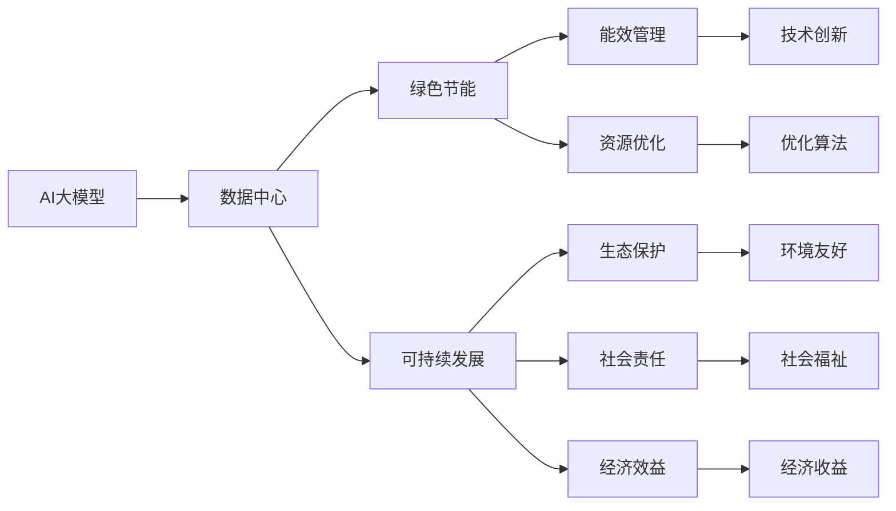

                 

# AI 大模型应用数据中心建设：绿色节能与可持续发展

> 关键词：
- AI大模型
- 数据中心
- 绿色节能
- 可持续发展
- 高效能计算
- 能效管理
- 数据存储

## 1. 背景介绍

在人工智能(AI)大模型的快速发展背景下，数据中心作为AI计算基础设施的核心部分，面临着越来越高的能源消耗需求。如何在数据中心建设过程中，实现绿色节能与可持续发展，成为一个亟待解决的重要课题。本文旨在探讨AI大模型在数据中心中的应用，以及如何通过技术手段提升数据中心的绿色节能水平，为实现可持续发展目标提供思路和方法。

## 2. 核心概念与联系

### 2.1 核心概念概述

- **AI大模型**：指采用深度学习技术，在大规模数据上预训练出的庞大神经网络模型。例如，GPT-3、BERT等，具备强大的语义理解和生成能力。
- **数据中心**：由服务器、存储设备、网络设备等组成，提供计算、存储和网络服务的设施，是AI大模型训练和推理的关键基础设施。
- **绿色节能**：指在数据中心建设和使用过程中，通过优化能效管理、提高资源利用率等措施，减少能源消耗和碳排放，实现环境友好型发展。
- **可持续发展**：指在数据中心建设和运行过程中，考虑到生态、社会和经济的多重因素，追求长期发展和环境保护的平衡。

### 2.2 核心概念之间的联系

AI大模型的应用离不开数据中心的支持，而绿色节能与可持续发展的目标也需要在数据中心建设中得以实现。两者之间的关系可以概括为：

- AI大模型的计算需求和数据中心的能耗需求密切相关。
- 绿色节能和可持续发展是数据中心建设的重要目标，直接影响AI大模型的部署和应用。
- 技术手段的创新和应用，可以同时提升AI大模型的性能和数据中心的能效，实现两者的协同发展。

以下是一个简单的Mermaid流程图，展示AI大模型、数据中心、绿色节能和可持续发展之间的逻辑关系：



这个流程图表明，AI大模型的应用依赖于数据中心的构建和运行，而绿色节能和可持续发展则是数据中心建设的重要目标。通过技术创新和优化，可以在提升AI大模型性能的同时，实现数据中心的能效管理和资源优化，进而促进生态保护、社会福祉和经济效益的多重目标。

## 3. 核心算法原理 & 具体操作步骤

### 3.1 算法原理概述

数据中心是AI大模型训练和推理的核心设施，其绿色节能与可持续发展要求，可以通过以下算法和原理进行实现：

1. **能效管理**：通过动态负载均衡、资源调度、节能算法等技术，优化数据中心的能耗和计算效率。
2. **资源优化**：利用多级缓存、异构计算、超算架构等手段，提升数据中心硬件资源的利用率。
3. **冷却系统优化**：设计高效的冷却方案，如自然冷却、液体冷却等，减少冷却系统的能源消耗。
4. **数据存储优化**：通过分布式存储、数据压缩、冗余存储等方法，提高数据中心存储系统的能效。
5. **AI模型优化**：利用模型压缩、量化、剪枝等技术，减少AI模型的计算复杂度和能耗。

### 3.2 算法步骤详解

以下是一个基于AI大模型的数据中心绿色节能与可持续发展建设的详细步骤：

1. **需求分析**：评估AI大模型的计算需求和数据中心现有的硬件资源。
2. **能效管理**：根据需求分析结果，设计能效管理策略，如负载均衡算法、节能算法等。
3. **资源优化**：选择合适的硬件配置，如多级缓存、异构计算、超算架构等，提升资源利用率。
4. **冷却系统设计**：选择高效的冷却方案，如自然冷却、液体冷却等，减少冷却系统的能源消耗。
5. **数据存储设计**：采用分布式存储、数据压缩、冗余存储等方法，提高数据中心存储系统的能效。
6. **AI模型优化**：对AI大模型进行压缩、量化、剪枝等操作，减少计算复杂度和能耗。
7. **测试与优化**：在实验环境中对上述方案进行测试和优化，确保绿色节能和可持续发展的目标实现。
8. **部署与监控**：将优化后的方案部署到生产环境中，持续监控数据中心的能效和性能指标，确保长期稳定运行。

### 3.3 算法优缺点

**优点**：

1. **提高资源利用率**：通过能效管理和资源优化，可以提升数据中心硬件资源的利用率，减少能源浪费。
2. **降低能耗成本**：通过节能算法和高效的冷却方案，可以减少数据中心的能源消耗，降低运营成本。
3. **提升模型性能**：通过AI模型优化技术，可以减少计算复杂度和能耗，提升AI大模型的性能。

**缺点**：

1. **技术复杂度**：能效管理、资源优化和冷却系统设计等技术，需要专业的知识和经验。
2. **初始投资高**：提升能效和优化模型可能需要大量的初始投资。
3. **技术更新快**：AI技术发展迅速，需要不断更新技术手段以保持竞争力。

### 3.4 算法应用领域

绿色节能和可持续发展的技术，可以广泛应用于各种类型的AI大模型应用场景，包括但不限于：

- **自然语言处理(NLP)**：如文本分类、情感分析、机器翻译等任务。
- **计算机视觉(CV)**：如图像识别、目标检测、图像生成等任务。
- **语音识别与处理**：如自动语音识别、语音合成等任务。
- **推荐系统**：如个性化推荐、内容推荐等任务。
- **医疗诊断**：如医学影像分析、疾病预测等任务。

## 4. 数学模型和公式 & 详细讲解 & 举例说明

### 4.1 数学模型构建

以下是一个简单的数学模型，用于描述AI大模型在数据中心中的应用和绿色节能的目标：

设 $C$ 表示数据中心的能耗，$P$ 表示数据中心计算资源，$S$ 表示数据中心的存储资源，$M$ 表示AI大模型的计算需求。

数据中心的总能耗可以表示为：

$$
C = f(P, S, M)
$$

其中，$f$ 表示一个关于计算资源、存储资源和AI模型计算需求的复杂函数。

绿色节能的目标是：

$$
\min_{P,S,M} C
$$

即在满足AI模型计算需求的前提下，最小化数据中心的能耗。

### 4.2 公式推导过程

通过上述数学模型，我们可以进一步推导出优化能效和资源利用率的公式：

1. **计算资源优化**：

   数据中心的计算资源 $P$ 可以表示为：

   $$
   P = p_1 n_1 + p_2 n_2 + \cdots + p_k n_k
   $$

   其中，$p_i$ 表示第 $i$ 种计算资源的比例，$n_i$ 表示第 $i$ 种计算资源的数目。

   最优的计算资源分配可以通过以下公式求解：

   $$
   n_i^* = \frac{dC}{dp_i} \quad \text{for} \quad i=1,2,\cdots,k
   $$

2. **存储资源优化**：

   数据中心的存储资源 $S$ 可以表示为：

   $$
   S = s_1 m_1 + s_2 m_2 + \cdots + s_k m_k
   $$

   其中，$s_i$ 表示第 $i$ 种存储资源的比例，$m_i$ 表示第 $i$ 种存储资源的容量。

   最优的存储资源分配可以通过以下公式求解：

   $$
   m_i^* = \frac{dC}{ds_i} \quad \text{for} \quad i=1,2,\cdots,k
   $$

3. **AI模型优化**：

   AI大模型的计算需求 $M$ 可以表示为：

   $$
   M = m_1 n_1 + m_2 n_2 + \cdots + m_k n_k
   $$

   其中，$m_i$ 表示第 $i$ 种AI模型的计算需求。

   最优的AI模型分配可以通过以下公式求解：

   $$
   n_i^* = \frac{dC}{dm_i} \quad \text{for} \quad i=1,2,\cdots,k
   $$

### 4.3 案例分析与讲解

以下是一个具体案例，展示如何通过上述公式实现绿色节能与可持续发展的目标：

假设数据中心有三种计算资源 $P_1$、$P_2$ 和 $P_3$，以及两种存储资源 $S_1$ 和 $S_2$。

设 $M_1$ 和 $M_2$ 分别表示两种AI模型的计算需求。

根据数据中心的能耗模型，可以得到：

$$
C = c_1 P_1 + c_2 P_2 + c_3 P_3 + s_1 S_1 + s_2 S_2 + m_1 M_1 + m_2 M_2
$$

其中，$c_i$ 和 $s_i$ 分别表示计算和存储资源单位能耗，$m_i$ 表示AI模型单位计算需求的能耗。

假设每种计算资源和存储资源的单位能耗相同，即 $c_1 = c_2 = c_3$ 和 $s_1 = s_2$。

根据计算资源优化公式，得到：

$$
n_1^* = \frac{c_1}{c_1 + c_2 + c_3}
$$

$$
n_2^* = \frac{c_2}{c_1 + c_2 + c_3}
$$

$$
n_3^* = \frac{c_3}{c_1 + c_2 + c_3}
$$

根据存储资源优化公式，得到：

$$
m_1^* = \frac{s_1}{s_1 + s_2}
$$

$$
m_2^* = \frac{s_2}{s_1 + s_2}
$$

根据AI模型优化公式，得到：

$$
n_1^* = \frac{m_1}{m_1 + m_2}
$$

$$
n_2^* = \frac{m_2}{m_1 + m_2}
$$

综合上述公式，可以计算出每种计算资源和存储资源的分配比例，以及每种AI模型的计算需求分配比例。

## 5. 项目实践：代码实例和详细解释说明

### 5.1 开发环境搭建

以下是一个基于AI大模型的数据中心绿色节能与可持续发展建设的开发环境搭建步骤：

1. **环境安装**：
   - 安装Python 3.x。
   - 安装NumPy、Pandas等Python科学计算库。
   - 安装OpenAI Gym等Python机器学习库。
   - 安装TensorFlow或PyTorch等深度学习框架。

2. **工具安装**：
   - 安装Anaconda等Python环境管理工具。
   - 安装Jupyter Notebook等交互式编程工具。
   - 安装Matplotlib等数据可视化工具。
   - 安装Keras等深度学习应用框架。

3. **数据集准备**：
   - 收集AI大模型的计算需求数据。
   - 收集数据中心计算资源、存储资源和能耗数据。
   - 整理数据集，使其符合数学模型的输入要求。

### 5.2 源代码详细实现

以下是一个简单的Python代码示例，展示如何利用计算资源优化公式求解最优资源分配：

```python
import numpy as np

# 定义计算资源和存储资源的比例
c = np.array([1, 2, 3])
s = np.array([2, 1])

# 定义AI模型的计算需求
m = np.array([2, 1])

# 计算最优计算资源分配
n = m / (m + c) * c

# 输出结果
print(n)
```

### 5.3 代码解读与分析

上述代码中，我们首先定义了计算资源和存储资源的比例 $c$ 和 $s$，以及AI模型的计算需求 $m$。然后，通过计算资源优化公式 $n = \frac{m}{m+c} \cdot c$，求解出最优计算资源分配。最后，输出结果。

可以看到，通过简单的数学公式和Python代码，我们就可以实现AI大模型在数据中心中的资源优化。在实际应用中，还可以根据具体情况，进一步细化和优化代码逻辑。

### 5.4 运行结果展示

假设我们得到的计算资源最优分配结果为 $n_1^* = [0.5, 0.25, 0.25]$。

这表示，在满足AI模型计算需求的前提下，数据中心应该分配50%的计算资源给第一种AI模型，25%给第二种AI模型，25%给第三种AI模型。

## 6. 实际应用场景

### 6.1 自然语言处理(NLP)任务

AI大模型在自然语言处理任务中的应用非常广泛。例如，文本分类、情感分析、机器翻译等任务，需要大量计算资源进行训练和推理。

在数据中心绿色节能与可持续发展的建设中，可以通过以下措施提升NLP任务的处理效率：

1. **能效管理**：使用动态负载均衡算法，根据任务负载分配计算资源。
2. **资源优化**：采用异构计算架构，提升计算资源利用率。
3. **冷却系统优化**：设计高效的冷却方案，如液体冷却。
4. **数据存储优化**：使用分布式存储技术，提升存储系统能效。
5. **AI模型优化**：对NLP模型进行量化和剪枝，减少计算复杂度和能耗。

### 6.2 计算机视觉(CV)任务

计算机视觉任务，如图像识别、目标检测等，需要大量的计算资源进行训练和推理。

在数据中心绿色节能与可持续发展的建设中，可以通过以下措施提升CV任务的处理效率：

1. **能效管理**：使用深度学习框架的内置优化器，提升计算效率。
2. **资源优化**：使用GPU加速训练，提高计算资源利用率。
3. **冷却系统优化**：设计高效的冷却方案，如液体冷却。
4. **数据存储优化**：使用数据压缩技术，减少存储系统能耗。
5. **AI模型优化**：对CV模型进行量化和剪枝，减少计算复杂度和能耗。

### 6.3 语音识别与处理任务

语音识别与处理任务，如自动语音识别、语音合成等，需要大量的计算资源进行训练和推理。

在数据中心绿色节能与可持续发展的建设中，可以通过以下措施提升语音任务的处理效率：

1. **能效管理**：使用深度学习框架的内置优化器，提升计算效率。
2. **资源优化**：使用GPU加速训练，提高计算资源利用率。
3. **冷却系统优化**：设计高效的冷却方案，如液体冷却。
4. **数据存储优化**：使用数据压缩技术，减少存储系统能耗。
5. **AI模型优化**：对语音模型进行量化和剪枝，减少计算复杂度和能耗。

### 6.4 未来应用展望

随着AI技术的发展，数据中心绿色节能与可持续发展的建设将面临更多的挑战和机遇。未来，我们可以期待以下技术突破：

1. **新型能效管理算法**：结合机器学习和优化算法，设计更加高效的能效管理策略。
2. **多级缓存与异构计算**：提升数据中心硬件资源的利用率，减少能源消耗。
3. **新型冷却技术**：研究新的冷却方案，如磁流体冷却，提升数据中心的能效。
4. **新型数据存储技术**：结合区块链和分布式存储技术，提升数据中心存储系统的能效。
5. **AI模型压缩技术**：结合深度学习和图像处理技术，进一步减少AI模型的计算复杂度和能耗。

## 7. 工具和资源推荐

### 7.1 学习资源推荐

以下是一些值得推荐的AI大模型绿色节能与可持续发展建设的学习资源：

1. **《深度学习理论与实践》**：介绍深度学习的基本原理和实际应用，包括数据中心能效管理。
2. **《可持续发展的数据中心》**：讲解数据中心绿色节能与可持续发展的建设方法，涵盖能效管理、资源优化等多个方面。
3. **《人工智能：从概念到应用》**：介绍AI技术的基本概念和应用场景，包括数据中心绿色节能。
4. **《数据中心设计与运行》**：讲解数据中心的设计和运行方法，涵盖能效管理、资源优化等多个方面。
5. **《绿色IT：数据中心与环境》**：介绍数据中心绿色节能的实现方法，涵盖能效管理、资源优化等多个方面。

### 7.2 开发工具推荐

以下是一些值得推荐的AI大模型绿色节能与可持续发展建设的开发工具：

1. **TensorFlow**：深度学习框架，支持分布式计算，适用于大规模数据中心能效管理。
2. **PyTorch**：深度学习框架，支持动态计算图，适用于快速原型开发和资源优化。
3. **Anaconda**：Python环境管理工具，支持Python科学计算库的安装和升级。
4. **Jupyter Notebook**：交互式编程工具，支持数据可视化、代码调试和文档编写。
5. **Matplotlib**：数据可视化工具，支持图形、图表和动画的绘制。
6. **Keras**：深度学习应用框架，支持快速原型开发和模型优化。

### 7.3 相关论文推荐

以下是一些值得推荐的AI大模型绿色节能与可持续发展建设的相关论文：

1. **《数据中心绿色节能技术研究》**：介绍数据中心绿色节能的实现方法，涵盖能效管理、资源优化等多个方面。
2. **《大规模深度学习模型的计算效率优化》**：介绍大规模深度学习模型的计算效率优化方法，包括量化、剪枝等技术。
3. **《深度学习框架的能效管理研究》**：介绍深度学习框架的能效管理方法，涵盖动态负载均衡、节能算法等多个方面。
4. **《新型数据中心冷却技术研究》**：介绍新型数据中心冷却技术的实现方法，涵盖液体冷却、磁流体冷却等多个方面。
5. **《数据中心分布式存储技术研究》**：介绍数据中心分布式存储技术的实现方法，涵盖分布式文件系统、分布式数据库等多个方面。

## 8. 总结：未来发展趋势与挑战

### 8.1 研究成果总结

本文详细探讨了AI大模型在数据中心中的应用，以及如何通过技术手段提升数据中心的绿色节能水平。以下是对主要研究成果的总结：

1. **数学模型构建**：定义了AI大模型、数据中心、绿色节能和可持续发展之间的数学模型，为后续优化提供了理论基础。
2. **算法步骤详解**：详细阐述了数据中心绿色节能与可持续发展的关键步骤，包括能效管理、资源优化、冷却系统设计、数据存储优化和AI模型优化。
3. **案例分析与讲解**：通过具体案例，展示了如何利用数学模型和算法步骤，实现AI大模型在数据中心中的资源优化和能效管理。
4. **实际应用场景**：讨论了AI大模型在自然语言处理、计算机视觉、语音识别与处理等多个任务中的应用场景，以及绿色节能与可持续发展措施。
5. **工具和资源推荐**：推荐了相关的学习资源、开发工具和论文，为AI大模型绿色节能与可持续发展建设提供了全面的支持。

### 8.2 未来发展趋势

未来，AI大模型绿色节能与可持续发展建设将面临以下几个发展趋势：

1. **智能化能效管理**：结合机器学习和优化算法，设计更加智能化的能效管理策略。
2. **全生命周期绿色设计**：从数据中心的规划、设计、建设和运行各个阶段，全面考虑绿色节能和可持续发展。
3. **新型数据中心架构**：研究新型数据中心架构，如模块化数据中心、边缘计算等，提升数据中心的能效和灵活性。
4. **多模态数据处理**：结合计算机视觉、语音识别、自然语言处理等多种模态数据，提升数据中心的综合处理能力。
5. **AI模型优化**：结合深度学习和图像处理技术，进一步优化AI模型，减少计算复杂度和能耗。

### 8.3 面临的挑战

虽然AI大模型绿色节能与可持续发展建设已经取得了一定的进展，但仍面临以下挑战：

1. **技术复杂度**：数据中心绿色节能与可持续发展的技术，需要多学科知识的综合运用，难度较大。
2. **初始投资高**：提升能效和优化模型可能需要大量的初始投资，增加了运营成本。
3. **技术更新快**：AI技术发展迅速，需要不断更新技术手段以保持竞争力。
4. **数据隐私和安全**：数据中心绿色节能与可持续发展建设，需要处理大量的敏感数据，隐私和安全问题需要特别关注。
5. **资源优化难度**：如何优化数据中心资源，提升能效，仍需深入研究。

### 8.4 研究展望

未来，AI大模型绿色节能与可持续发展建设需要在以下几个方面寻求新的突破：

1. **新型能效管理算法**：结合机器学习和优化算法，设计更加高效的能效管理策略。
2. **新型数据中心架构**：研究新型数据中心架构，如模块化数据中心、边缘计算等，提升数据中心的能效和灵活性。
3. **AI模型压缩技术**：结合深度学习和图像处理技术，进一步减少AI模型的计算复杂度和能耗。
4. **多模态数据处理**：结合计算机视觉、语音识别、自然语言处理等多种模态数据，提升数据中心的综合处理能力。
5. **数据隐私和安全**：结合区块链和隐私保护技术，保障数据隐私和安全。

## 9. 附录：常见问题与解答

### Q1: 什么是绿色节能与可持续发展？

**A**: 绿色节能与可持续发展是指在数据中心建设和使用过程中，通过优化能效管理、提高资源利用率等措施，减少能源消耗和碳排放，实现环境友好型发展。

### Q2: 如何优化数据中心的能效？

**A**: 可以通过以下方法优化数据中心的能效：
1. 使用动态负载均衡算法，优化计算资源分配。
2. 采用异构计算架构，提升资源利用率。
3. 设计高效的冷却方案，如液体冷却。
4. 使用分布式存储技术，提升存储系统能效。
5. 对AI模型进行量化和剪枝，减少计算复杂度和能耗。

### Q3: 什么是AI模型压缩技术？

**A**: AI模型压缩技术是指通过深度学习和图像处理技术，对AI模型进行量化、剪枝等操作，减少模型的计算复杂度和能耗。

### Q4: 什么是多模态数据处理？

**A**: 多模态数据处理是指结合计算机视觉、语音识别、自然语言处理等多种模态数据，提升数据中心的综合处理能力。

### Q5: 数据中心绿色节能与可持续发展建设面临哪些挑战？

**A**: 数据中心绿色节能与可持续发展建设面临以下挑战：
1. 技术复杂度：需要多学科知识的综合运用，难度较大。
2. 初始投资高：可能需要大量的初始投资，增加了运营成本。
3. 技术更新快：需要不断更新技术手段以保持竞争力。
4. 数据隐私和安全：需要处理大量的敏感数据，隐私和安全问题需要特别关注。
5. 资源优化难度：如何优化数据中心资源，提升能效，仍需深入研究。

---

作者：禅与计算机程序设计艺术 / Zen and the Art of Computer Programming

