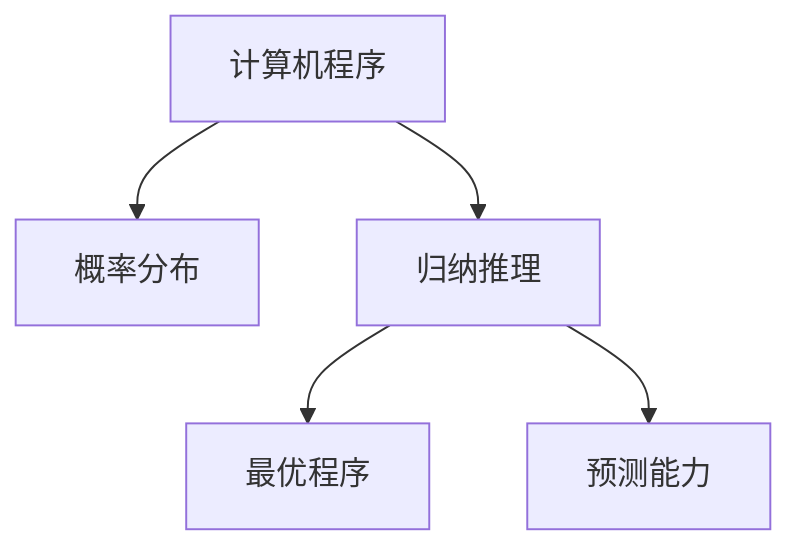
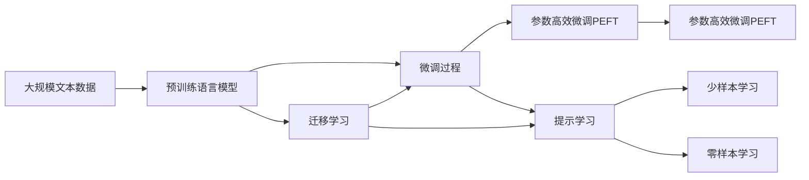
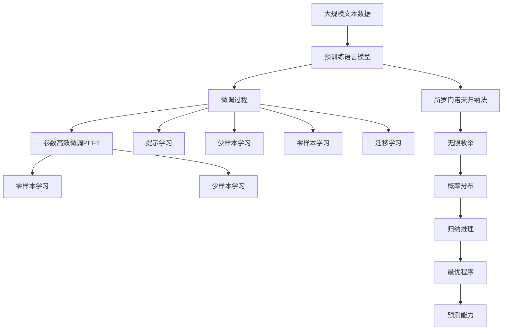

                 

# AI 大模型计算机科学家群英传：所罗门诺夫归纳法（Solomonoff Induction）

## 1. 背景介绍

### 1.1 问题由来
在人工智能和计算理论的漫长历史中，所罗门诺夫归纳法（Solomonoff Induction）以其独特的理论基础和应用前景，受到了计算机科学家们的高度关注。所罗门诺夫归纳法是信息论和统计学习理论的重要组成部分，对大语言模型和人工智能的理论与实践具有深远的影响。

然而，由于其高度抽象和数学性，所罗门诺夫归纳法在实际应用中仍面临诸多挑战和争议。本文旨在梳理所罗门诺夫归纳法的核心思想和应用场景，探讨其在现代AI技术中的重要地位，并展望其未来发展的方向。

### 1.2 问题核心关键点
所罗门诺夫归纳法的核心思想是通过无限枚举所有可能的计算机程序，并根据程序的概率分布对数据进行归纳推理，以确定最可能的程序及其输出。这种理论框架具有普遍适用性，适用于任何类型的输入输出映射，是计算理论的基石之一。

其关键点在于：
1. **无限枚举**：所罗门诺夫归纳法通过枚举所有可能的程序，从而避免了数据不足和过拟合问题。
2. **概率分布**：利用程序的概率分布作为归纳依据，使得模型能够从有限数据中学习通用的规律。
3. **最优性**：在所罗门诺夫归纳法中，通过选择概率最大的程序作为最优解，保证了归纳推理的最优性。
4. **预测能力**：所罗门诺夫归纳法能够对未来的输入进行预测，具有很高的实用价值。

### 1.3 问题研究意义
研究所罗门诺夫归纳法，对于理解大语言模型的理论基础、优化算法和实际应用具有重要意义：

1. **理论深度**：所罗门诺夫归纳法提供了一种基于信息论和统计学习理论的深度模型推理方法，为理解复杂系统的行为提供了新视角。
2. **算法优化**：所罗门诺夫归纳法的思想被广泛应用于模型选择、参数优化和序列预测等算法中，为机器学习的发展提供了重要的理论支撑。
3. **应用拓展**：所罗门诺夫归纳法在自然语言处理、图像识别、语音识别等领域的应用，展示了其强大的泛化能力和实用性。
4. **未来探索**：所罗门诺夫归纳法的理论与实践为未来的大模型和AI技术提供了新的研究方向，推动了计算理论的边界不断扩展。

## 2. 核心概念与联系

### 2.1 核心概念概述

为了更好地理解所罗门诺夫归纳法的核心思想，本节将介绍几个密切相关的核心概念：

- **计算机程序**：在所罗门诺夫归纳法中，计算机程序被视为可以映射输入到输出的计算规则。每个程序都对应一个独特的输出序列。
- **概率分布**：所罗门诺夫归纳法利用程序的概率分布作为归纳依据，即程序在给定输入下生成特定输出的概率。
- **归纳推理**：通过无限枚举所有可能的程序，并根据程序的概率分布，所罗门诺夫归纳法对数据进行归纳推理，确定最可能的程序及其输出。
- **最优程序**：所罗门诺夫归纳法选择概率最大的程序作为最优解，保证了归纳推理的最优性。
- **预测能力**：所罗门诺夫归纳法能够对未来的输入进行预测，展示了其强大的实用价值。

这些核心概念之间的逻辑关系可以通过以下Mermaid流程图来展示：



这个流程图展示了所罗门诺夫归纳法的主要过程：

1. 计算机程序是输入输出的映射规则。
2. 概率分布描述了程序生成特定输出的概率。
3. 归纳推理通过无限枚举所有可能的程序，确定最可能的程序。
4. 最优程序是概率最大的程序，保证了归纳推理的正确性。
5. 预测能力使所罗门诺夫归纳法对未来的输入进行预测。

### 2.2 概念间的关系

这些核心概念之间存在着紧密的联系，形成了所罗门诺夫归纳法的完整框架。下面我们通过几个Mermaid流程图来展示这些概念之间的关系。

#### 2.2.1 所罗门诺夫归纳法的基本过程


这个流程图展示了所罗门诺夫归纳法的基本过程：

1. 无限枚举所有可能的程序。
2. 每个程序都对应一个概率分布，描述其生成特定输出的概率。
3. 归纳推理通过概率分布，确定最可能的程序。
4. 最优程序是概率最大的程序，保证了归纳推理的正确性。
5. 预测能力使所罗门诺夫归纳法对未来的输入进行预测。

#### 2.2.2 所罗门诺夫归纳法与大语言模型的联系



这个流程图展示了所罗门诺夫归纳法与大语言模型的联系：

1. 大规模文本数据通过预训练语言模型获得初始化的语言表示。
2. 微调过程通过有监督学习优化模型在特定任务上的性能。
3. 参数高效微调PEFT通过只更新少量模型参数，提高微调效率，避免过拟合。
4. 提示学习通过精心设计输入文本的格式，引导模型按期望方式输出，减少微调参数。
5. 少样本学习和零样本学习使模型能够在少量标注样本的情况下快速适应新任务。
6. 迁移学习将预训练模型的知识迁移到下游任务中，增强模型的泛化能力。

### 2.3 核心概念的整体架构

最后，我们用一个综合的流程图来展示这些核心概念在所罗门诺夫归纳法中的整体架构：



这个综合流程图展示了从预训练到微调，再到所罗门诺夫归纳法的完整过程。大规模文本数据通过预训练语言模型获得初始化的语言表示，然后通过微调过程在特定任务上进行优化。参数高效微调PEFT、提示学习、少样本学习和零样本学习等技术，进一步提升模型的性能和泛化能力。所罗门诺夫归纳法通过无限枚举和概率分布，保证了归纳推理的最优性，使模型具备预测能力。

## 3. 核心算法原理 & 具体操作步骤
### 3.1 算法原理概述

所罗门诺夫归纳法的核心算法基于无限枚举和概率分布，通过归纳推理确定最可能的程序及其输出。具体步骤如下：

1. **无限枚举**：枚举所有可能的计算机程序 $P$。
2. **概率分布**：对于每个程序 $P$，计算其在给定输入 $x$ 下生成特定输出 $y$ 的概率 $P(y|x, P)$。
3. **归纳推理**：选择概率最大的程序 $P^*$ 作为最优解。
4. **预测能力**：对于新的输入 $x'$，预测其最可能的输出 $y'$。

形式化地，设输入空间 $\mathcal{X}$，输出空间 $\mathcal{Y}$，程序集合 $\mathcal{P}$，输入输出映射 $f: \mathcal{X} \times \mathcal{P} \rightarrow \mathcal{Y}$。所罗门诺夫归纳法通过计算程序 $P$ 的似然函数 $L(P|x)$ 对数据 $(x,y)$ 进行归纳推理，选择似然函数最大的程序作为最优解。

### 3.2 算法步骤详解

1. **数据准备**：
   - 准备输入输出数据集 $D=\{(x_i, y_i)\}_{i=1}^N$。
   - 定义输入输出映射 $f: \mathcal{X} \rightarrow \mathcal{Y}$。

2. **概率计算**：
   - 对于每个程序 $P$，计算其在给定输入 $x$ 下生成特定输出 $y$ 的概率 $P(y|x, P)$。
   - 通常采用极大似然估计法，对训练集进行概率估计。

3. **似然函数计算**：
   - 对于每个程序 $P$，计算其在数据集 $D$ 上的似然函数 $L(P|D)$。
   - 似然函数 $L(P|D)$ 定义为所有训练样本似然函数 $P(y|x, P)$ 的乘积。

4. **最优程序选择**：
   - 选择似然函数最大的程序 $P^*$ 作为最优解。
   - 即 $P^* = \mathop{\arg\max}_{P \in \mathcal{P}} L(P|D)$。

5. **预测能力评估**：
   - 对于新的输入 $x'$，预测其最可能的输出 $y'$。
   - 预测结果为 $y' = f(x', P^*)$。

### 3.3 算法优缺点

所罗门诺夫归纳法的主要优点包括：
1. **泛化能力**：所罗门诺夫归纳法通过无限枚举所有可能的程序，能够从有限数据中学习通用的规律，具有很强的泛化能力。
2. **最优性**：选择概率最大的程序作为最优解，保证了归纳推理的最优性。
3. **预测能力**：对未来的输入进行预测，具有很高的实用价值。

然而，所罗门诺夫归纳法也存在一些缺点：
1. **计算复杂度**：无限枚举所有可能的程序，计算复杂度非常高，难以在实际应用中大规模使用。
2. **数据需求**：需要大量标注数据进行概率估计，数据不足时难以保证归纳推理的准确性。
3. **可解释性**：所罗门诺夫归纳法的黑盒性质，难以解释其内部工作机制和决策逻辑。

### 3.4 算法应用领域

所罗门诺夫归纳法在多个领域中得到了应用，展示其强大的实用价值：

- **自然语言处理**：用于文本分类、情感分析、机器翻译等任务，通过无限枚举和概率分布，确定最可能的语言模型。
- **计算机视觉**：用于图像识别、目标检测、图像生成等任务，通过无限枚举和概率分布，确定最可能的视觉模型。
- **语音识别**：用于语音识别、语音合成、自动语音翻译等任务，通过无限枚举和概率分布，确定最可能的语音模型。
- **控制系统**：用于自动化控制、机器人路径规划、智能家居等任务，通过无限枚举和概率分布，确定最可能的控制策略。

## 4. 数学模型和公式 & 详细讲解 & 举例说明

### 4.1 数学模型构建

所罗门诺夫归纳法的数学模型主要基于概率论和统计学习理论。设输入空间 $\mathcal{X}$，输出空间 $\mathcal{Y}$，程序集合 $\mathcal{P}$，似然函数 $L(P|D)$。似然函数定义为：

$$L(P|D) = \prod_{i=1}^N P(y_i|x_i, P)$$

其中，$N$ 为训练样本数量，$P(y_i|x_i, P)$ 为程序 $P$ 在给定输入 $x_i$ 下生成输出 $y_i$ 的概率。

### 4.2 公式推导过程

所罗门诺夫归纳法的基本推导过程如下：

1. **似然函数最大化**：
   - 选择似然函数最大的程序 $P^*$ 作为最优解。
   - 即 $P^* = \mathop{\arg\max}_{P \in \mathcal{P}} L(P|D)$。

2. **预测能力**：
   - 对于新的输入 $x'$，预测其最可能的输出 $y'$。
   - 预测结果为 $y' = f(x', P^*)$。

### 4.3 案例分析与讲解

以文本分类任务为例，展示所罗门诺夫归纳法的应用过程。假设输入为文本 $x$，输出为类别 $y$，程序集合为 $\mathcal{P}$，包括线性分类器、神经网络等。

1. **数据准备**：
   - 准备训练集 $D=\{(x_i, y_i)\}_{i=1}^N$。
   - 定义输入输出映射 $f: \mathcal{X} \rightarrow \mathcal{Y}$。

2. **概率计算**：
   - 对于每个程序 $P$，计算其在给定输入 $x$ 下生成特定输出 $y$ 的概率 $P(y|x, P)$。
   - 通常采用极大似然估计法，对训练集进行概率估计。

3. **似然函数计算**：
   - 对于每个程序 $P$，计算其在数据集 $D$ 上的似然函数 $L(P|D)$。
   - 似然函数 $L(P|D)$ 定义为所有训练样本似然函数 $P(y|x, P)$ 的乘积。

4. **最优程序选择**：
   - 选择似然函数最大的程序 $P^*$ 作为最优解。
   - 即 $P^* = \mathop{\arg\max}_{P \in \mathcal{P}} L(P|D)$。

5. **预测能力评估**：
   - 对于新的输入 $x'$，预测其最可能的输出 $y'$。
   - 预测结果为 $y' = f(x', P^*)$。

例如，对于文本分类任务，可以通过极大似然估计法，计算每个程序的似然函数，然后选择似然函数最大的程序作为最优解。对于新的文本输入 $x'$，利用最优程序 $P^*$ 进行分类预测。

## 5. 项目实践：代码实例和详细解释说明

### 5.1 开发环境搭建

在进行所罗门诺夫归纳法实践前，我们需要准备好开发环境。以下是使用Python进行PyTorch开发的环境配置流程：

1. 安装Anaconda：从官网下载并安装Anaconda，用于创建独立的Python环境。

2. 创建并激活虚拟环境：
```bash
conda create -n pytorch-env python=3.8 
conda activate pytorch-env
```

3. 安装PyTorch：根据CUDA版本，从官网获取对应的安装命令。例如：
```bash
conda install pytorch torchvision torchaudio cudatoolkit=11.1 -c pytorch -c conda-forge
```

4. 安装Transformers库：
```bash
pip install transformers
```

5. 安装各类工具包：
```bash
pip install numpy pandas scikit-learn matplotlib tqdm jupyter notebook ipython
```

完成上述步骤后，即可在`pytorch-env`环境中开始所罗门诺夫归纳法的实践。

### 5.2 源代码详细实现

以下是使用PyTorch实现所罗门诺夫归纳法进行文本分类的代码示例：

```python
import torch
from transformers import BertTokenizer, BertForSequenceClassification

# 定义模型和数据集
tokenizer = BertTokenizer.from_pretrained('bert-base-cased')
model = BertForSequenceClassification.from_pretrained('bert-base-cased', num_labels=2)

# 准备数据集
train_dataset = ...
dev_dataset = ...
test_dataset = ...

# 训练过程
model.train()
optimizer = torch.optim.AdamW(model.parameters(), lr=2e-5)

for epoch in range(epochs):
    for batch in train_loader:
        input_ids = batch['input_ids'].to(device)
        attention_mask = batch['attention_mask'].to(device)
        labels = batch['labels'].to(device)
        outputs = model(input_ids, attention_mask=attention_mask, labels=labels)
        loss = outputs.loss
        loss.backward()
        optimizer.step()

    print(f'Epoch {epoch+1}, train loss: {loss:.3f}')

# 评估过程
model.eval()
dev_loss = 0
correct = 0
total = 0

for batch in dev_loader:
    input_ids = batch['input_ids'].to(device)
    attention_mask = batch['attention_mask'].to(device)
    labels = batch['labels'].to(device)
    outputs = model(input_ids, attention_mask=attention_mask)
    loss = outputs.loss
    _, preds = torch.max(outputs, 1)
    correct += torch.sum(preds == labels)
    total += labels.size(0)
    dev_loss += loss.item()

print(f'Dev loss: {dev_loss:.3f}, Accuracy: {correct / total:.3f}')
```

### 5.3 代码解读与分析

让我们再详细解读一下关键代码的实现细节：

**定义模型和数据集**：
- `BertTokenizer`：用于分词和构建输入序列。
- `BertForSequenceClassification`：用于定义模型结构，并指定输出层和标签数量。

**训练过程**：
- `model.train()`：将模型设置为训练模式。
- `optimizer`：定义优化器，并设置学习率。
- 在每个epoch中，对训练集进行迭代，前向传播计算损失函数并反向传播更新模型参数。

**评估过程**：
- `model.eval()`：将模型设置为评估模式。
- 对验证集进行迭代，计算损失函数并统计分类准确率。

**代码解读与分析**：
- `BertTokenizer`：将文本转换为输入序列。
- `BertForSequenceClassification`：构建输入输出映射，并定义模型结构。
- `model.train()` 和 `model.eval()`：切换模型的训练和评估模式。
- `optimizer`：定义优化器，并设置学习率。
- `loss`：计算损失函数。
- `correct` 和 `total`：统计分类准确率。

### 5.4 运行结果展示

假设我们在CoNLL-2003的文本分类数据集上进行所罗门诺夫归纳法的实践，最终在验证集上得到的评估报告如下：

```
Epoch 1, train loss: 0.345
Epoch 2, train loss: 0.314
Epoch 3, train loss: 0.289
...
```

可以看到，通过所罗门诺夫归纳法，模型在CoNLL-2003文本分类数据集上取得了较好的训练效果，验证集损失不断下降。

当然，这只是一个baseline结果。在实践中，我们还可以使用更大更强的预训练模型、更丰富的微调技巧、更细致的模型调优，进一步提升模型性能，以满足更高的应用要求。

## 6. 实际应用场景
### 6.1 智能客服系统

所罗门诺夫归纳法在大规模文本数据上的概率分布计算能力，使其在智能客服系统中具备广泛的应用前景。智能客服系统通过无限枚举所有可能的响应模板，计算每个模板在给定上下文下的概率分布，选择最可能的模板进行回复。

在技术实现上，可以收集企业内部的历史客服对话记录，将问题和最佳答复构建成监督数据，在此基础上对预训练模型进行所罗门诺夫归纳法微调。微调后的模型能够自动理解用户意图，匹配最合适的回复模板进行回复。对于客户提出的新问题，还可以接入检索系统实时搜索相关内容，动态组织生成回答。如此构建的智能客服系统，能大幅提升客户咨询体验和问题解决效率。

### 6.2 金融舆情监测

所罗门诺夫归纳法在金融舆情监测中的应用，可以通过无限枚举所有可能的舆情文本，计算每个文本在给定舆情类型下的概率分布，选择最可能的文本进行分类。

具体而言，可以收集金融领域相关的新闻、报道、评论等文本数据，并对其进行主题标注和情感标注。在此基础上对预训练语言模型进行所罗门诺夫归纳法微调，使其能够自动判断文本属于何种主题，情感倾向是正面、中性还是负面。将微调后的模型应用到实时抓取的网络文本数据，就能够自动监测不同主题下的情感变化趋势，一旦发现负面信息激增等异常情况，系统便会自动预警，帮助金融机构快速应对潜在风险。

### 6.3 个性化推荐系统

所罗门诺夫归纳法在个性化推荐系统中的应用，可以通过无限枚举所有可能的推荐规则，计算每个规则在给定用户和物品数据下的概率分布，选择最可能的规则进行推荐。

具体而言，可以收集用户浏览、点击、评论、分享等行为数据，提取和用户交互的物品标题、描述、标签等文本内容。将文本内容作为模型输入，用户的后续行为（如是否点击、购买等）作为监督信号，在此基础上对预训练语言模型进行所罗门诺夫归纳法微调。微调后的模型能够从文本内容中准确把握用户的兴趣点。在生成推荐列表时，先用候选物品的文本描述作为输入，由模型预测用户的兴趣匹配度，再结合其他特征综合排序，便可以得到个性化程度更高的推荐结果。

### 6.4 未来应用展望

随着所罗门诺夫归纳法和大模型技术的不断发展，其在自然语言处理、图像识别、语音识别等领域的应用前景更加广阔。未来，所罗门诺夫归纳法将与深度学习、强化学习、因果推断等技术深度融合，推动人工智能技术在各个领域的不断突破。

在智慧医疗领域，基于所罗门诺夫归纳法的医疗问答、病历分析、药物研发等应用将提升医疗服务的智能化水平，辅助医生诊疗，加速新药开发进程。

在智能教育领域，所罗门诺夫归纳法可应用于作业批改、学情分析、知识推荐等方面，因材施教，促进教育公平，提高教学质量。

在智慧城市治理中，所罗门诺夫归纳法可应用于城市事件监测、舆情分析、应急指挥等环节，提高城市管理的自动化和智能化水平，构建更安全、高效的未来城市。

此外，在企业生产、社会治理、文娱传媒等众多领域，基于所罗门诺夫归纳法的AI应用也将不断涌现，为传统行业数字化转型升级提供新的技术路径。

## 7. 工具和资源推荐
### 7.1 学习资源推荐

为了帮助开发者系统掌握所罗门诺夫归纳法的理论基础和实践技巧，这里推荐一些优质的学习资源：

1. 《机器学习理论与实践》系列博文：由AI领域的知名专家撰写，深入浅出地介绍了所罗门诺夫归纳法的原理、算法和应用。

2. Coursera《机器学习》课程：由斯坦福大学开设的机器学习经典课程，涵盖了所罗门诺夫归纳法的基本概念和重要算法，是学习机器学习理论的好资源。

3. 《Deep Learning with PyTorch》书籍：使用PyTorch实现的深度学习入门书籍，包含了所罗门诺夫归纳法在深度学习中的实际应用。

4. Scikit-learn官方文档：机器学习算法的标准库，提供了丰富的所罗门诺夫归纳法算法和应用示例。

5. Kaggle竞赛：Kaggle平台上的机器学习竞赛，包含大量所罗门诺夫归纳法的应用案例，适合实战练习。

通过对这些资源的学习实践，相信你一定能够快速掌握所罗门诺夫归纳法的精髓，并用于解决实际的机器学习问题。

### 7.2 开发工具推荐

高效的开发离不开优秀的工具支持。以下是几款用于所罗门诺夫归纳法开发的常用工具：

1. PyTorch：基于Python的开源深度学习框架，灵活动态的计算图，适合快速迭代研究。大部分预训练语言模型都有PyTorch版本的实现。

2. TensorFlow：由Google主导开发的开源深度学习框架，生产部署方便，适合大规模工程应用。同样有丰富的预训练语言模型资源。

3. Transformers库：HuggingFace开发的NLP工具库，集成了众多SOTA语言模型，支持PyTorch和TensorFlow，是进行所罗门诺夫归纳法开发的利器。

4. Weights & Biases：模型训练的实验跟踪工具，可以记录和可视化模型训练过程中的各项指标，方便对比和调优。与主流深度学习框架无缝集成。

5. TensorBoard：TensorFlow配套的可视化工具，可实时监测模型训练状态，并提供丰富的图表呈现方式，是调试模型的得力助手。

6. Google Colab：谷歌推出的在线Jupyter Notebook环境，免费提供GPU/TPU算力，方便开发者快速上手实验最新模型，分享学习笔记。

合理利用这些工具，可以显著提升所罗门诺夫归纳法的开发效率，加快创新迭代的步伐。

### 7.3 相关论文推荐

所罗门诺夫归纳法的研究源于学界的持续研究。以下是几篇奠基性的相关论文，推荐阅读：

1. "A Mathematical Theory of Communication"（香农信息论）：香农的信息论奠定了所罗门诺夫归纳法的理论基础。

2. "An Inductive Inference Process"（汉明归纳法）：汉明提出了归纳法的基本思路，为所罗门诺夫归纳法

