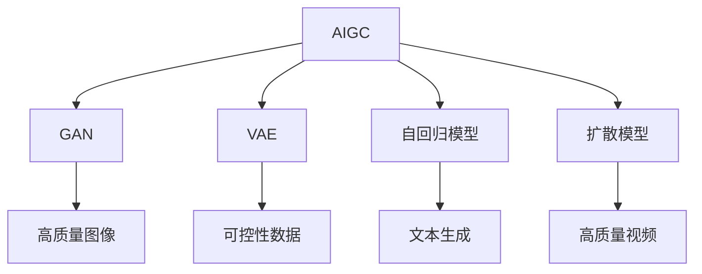
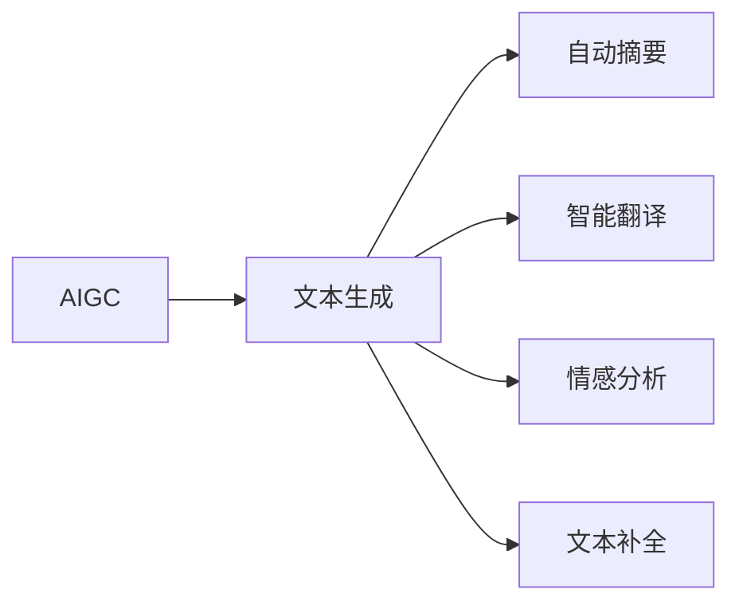
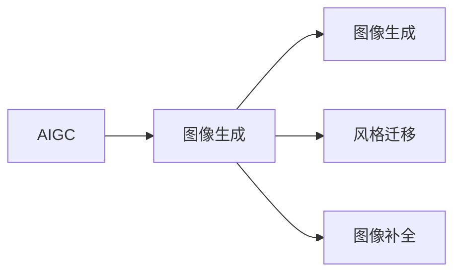
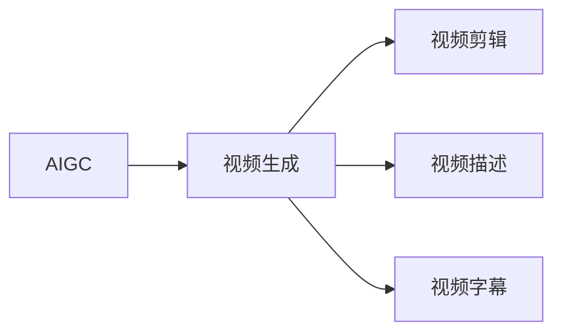

                 

# AIGC从入门到实战：AIGC 带来职场新范式，让 AI 帮你干活，你可以做更多有价值的事

## 1. 背景介绍

在当今数字化、智能化的社会，人工智能（AI）技术的崛起已经在各个领域引发了深刻的变革。特别是在办公自动化和内容生成领域，人工智能生成内容（AIGC）技术正以前所未有的速度渗透进我们的生活和工作。从创意写作、数据分析到视频制作，AIGC技术正在全面革新传统的业务模式和工作流程。本文将深入探讨AIGC技术的工作原理和应用领域，带你从零开始理解这一颠覆性技术的本质，并提供实战指导，让你能够利用AIGC技术，让AI为你“干活”，从而在职场中获得更多自由时间，专注于更有价值的事务。

### 1.1 问题由来

现代科技的快速发展让越来越多的工作开始向数字化、自动化转变。无论是生产线上的机器人臂、办公室中的智能助手，还是市场分析中的自动化报告系统，AI技术的引入正在逐步取代繁琐、重复的工作。然而，在AIGC技术的崛起之前，虽然AI已经在很多领域展现出了强大的能力，但对于创造性工作如内容生成、设计、编剧等，AI仍然显得有些力不从心。

然而，随着深度学习和大模型的发展，AIGC技术已经逐渐成熟。它不仅可以生成高质量的文本内容、图像和视频，还能在个性化推荐、对话系统等方面提供前所未有的能力。AIGC技术的出现，使得AI不再仅仅局限于数据分析和处理，而是进入了内容创意和生成领域，进一步扩展了AI的应用边界。

## 2. 核心概念与联系

### 2.1 核心概念概述

为了更好地理解AIGC技术，我们首先需要了解其核心概念及其相互之间的关系。

- **AIGC（人工智能生成内容）**：利用AI技术，自动生成文本、图像、音频、视频等内容的技术。常见的AIGC应用包括文本自动生成、图像合成、视频制作、音乐创作等。

- **生成对抗网络（GAN）**：一种利用两个深度神经网络对抗训练的生成模型，能够生成高质量、逼真的图像和视频内容。

- **变分自编码器（VAE）**：一种生成模型，用于生成具有连续性、可控性的数据，常用于图像生成、风格转换等任务。

- **自回归模型（如GPT、BERT）**：利用前文信息预测后文内容的模型，广泛用于文本生成、对话系统等。

- **扩散模型（如DDPM、DPM）**：一种生成模型，通过控制噪声的引入和变分扩散过程，逐步生成高质量图像和视频。

这些核心概念之间存在着紧密的联系，构成了AIGC技术的基石。下面我们通过一个Mermaid流程图来展示这些概念之间的关系。



这个流程图展示了AIGC技术在图像、视频、文本生成等不同领域的应用，以及GAN、VAE、自回归模型、扩散模型等生成技术之间的联系。这些技术相互补充，共同构建了AIGC技术的生态系统。

### 2.2 概念间的关系

AIGC技术的应用范围非常广泛，涵盖了从文本、图像到音频、视频等多种内容类型。下面我们通过几个Mermaid流程图来展示AIGC技术在各领域的应用。

#### 2.2.1 AIGC在文本生成中的应用



这个流程图展示了AIGC技术在文本生成领域的应用，包括自动摘要、智能翻译、情感分析、文本补全等。

#### 2.2.2 AIGC在图像生成中的应用



这个流程图展示了AIGC技术在图像生成领域的应用，包括图像生成、风格迁移、图像补全等。

#### 2.2.3 AIGC在视频生成中的应用



这个流程图展示了AIGC技术在视频生成领域的应用，包括视频剪辑、视频描述、视频字幕等。

## 3. 核心算法原理 & 具体操作步骤

### 3.1 算法原理概述

AIGC技术的基础是深度学习模型，其核心原理是通过大量数据训练生成模型，使其具备自动生成高质量内容的能力。具体来说，AIGC技术通常包括以下几个步骤：

1. **数据收集和预处理**：收集需要生成的数据类型（如文本、图像、音频、视频），并进行预处理，如去除噪声、标准化等。

2. **模型训练**：选择合适的深度学习模型（如GAN、VAE、自回归模型、扩散模型等），并使用大量标注数据进行训练，使其能够生成符合要求的内容。

3. **内容生成**：训练好的模型可以在给定提示或约束下，自动生成所需的内容。

### 3.2 算法步骤详解

以下是AIGC技术的具体实现步骤：

**Step 1: 准备数据集**

- 收集需要生成的内容类型的数据集，并进行预处理。
- 确保数据集的质量和多样性，以提高生成内容的真实性和多样性。

**Step 2: 选择合适的模型**

- 根据生成内容类型的不同，选择适合的生成模型。如文本生成可以使用自回归模型（如GPT、BERT），图像生成可以使用GAN或VAE，视频生成可以使用扩散模型等。

**Step 3: 模型训练**

- 对选择的模型进行训练，使用大量标注数据优化模型参数。
- 训练过程中，可以采用不同的优化器（如Adam、SGD等）和损失函数（如交叉熵损失、重构误差等）。

**Step 4: 内容生成**

- 在训练好的模型基础上，给定生成提示或约束条件，使用模型生成所需内容。
- 调整生成提示，可以控制生成内容的风格、主题等。

**Step 5: 评估和优化**

- 对生成的内容进行评估，如使用BLEU、CIDEr等指标进行自动评估，或通过人工评价进行主观评价。
- 根据评估结果，调整生成模型或生成提示，以优化生成内容的质量。

### 3.3 算法优缺点

**优点**：
- **高效生成**：利用深度学习模型，可以在较短时间内生成大量高质量内容。
- **高可扩展性**：适用于多种内容类型，如文本、图像、音频、视频等。
- **多样性**：可以生成具有多样性、创造性的内容。

**缺点**：
- **数据依赖**：需要大量标注数据进行训练，数据质量直接影响生成内容的质量。
- **控制难度**：生成内容具有一定的随机性，控制难度较大。
- **模型复杂度**：深度学习模型的训练和优化复杂度较高，需要较强的计算资源。

### 3.4 算法应用领域

AIGC技术的应用领域非常广泛，包括但不限于以下几个方面：

- **内容生成**：如新闻报道、博客文章、技术文档、营销文案等。
- **设计创作**：如产品设计、界面设计、建筑设计等。
- **创意写作**：如小说、诗歌、剧本等。
- **视频制作**：如短片、广告、动画等。
- **音乐创作**：如歌曲、配乐等。

## 4. 数学模型和公式 & 详细讲解 & 举例说明

### 4.1 数学模型构建

AIGC技术在数学模型上的构建涉及多个方面，包括数据表示、模型结构、损失函数等。

**数据表示**：
- 文本数据通常使用One-Hot编码或词向量（如Word2Vec、GloVe等）表示。
- 图像数据通常使用像素值表示，也可以使用预训练的特征向量（如ImageNet预训练模型）。

**模型结构**：
- 自回归模型：使用LSTM、GRU、Transformer等结构，利用前文信息预测后文内容。
- GAN：由生成器和判别器两个网络构成，生成器通过对抗训练生成逼真图像。
- VAE：由编码器和解码器两个网络构成，通过变分推断生成具有连续性、可控性的数据。

**损失函数**：
- 文本生成：通常使用交叉熵损失、BLEU等指标。
- 图像生成：通常使用重构误差、Wasserstein距离等指标。

### 4.2 公式推导过程

这里以文本生成为例，推导自回归模型的损失函数。

假设文本生成模型的输入为前文 $x_{1:t}$，输出为后文 $x_{t+1:T}$，其中 $t$ 表示生成位置的偏移量。模型的预测概率为 $p(x_{t+1:T}|x_{1:t})$，目标是对后文 $x_{t+1:T}$ 进行预测。

定义生成模型为 $p(x_{t+1:T}|x_{1:t})$，目标是对后文 $x_{t+1:T}$ 进行预测。定义损失函数为交叉熵损失：

$$
\mathcal{L} = -\frac{1}{N} \sum_{i=1}^N \sum_{t=1}^{T-1} \log p(x_{t+1}|x_{1:t})
$$

其中 $N$ 表示数据样本数量，$T$ 表示文本长度。

**案例分析与讲解**：
- **文本自动生成**：基于自回归模型，利用前文信息生成逼真的文本内容。
- **图像生成**：基于GAN模型，生成逼真、多样化的图像。
- **视频生成**：基于扩散模型，逐步生成高质量的视频内容。

## 5. 项目实践：代码实例和详细解释说明

### 5.1 开发环境搭建

在进行AIGC项目实践前，我们需要准备好开发环境。以下是使用Python进行PyTorch开发的环境配置流程：

1. 安装Anaconda：从官网下载并安装Anaconda，用于创建独立的Python环境。

2. 创建并激活虚拟环境：
```bash
conda create -n aigc-env python=3.8 
conda activate aigc-env
```

3. 安装PyTorch：根据CUDA版本，从官网获取对应的安装命令。例如：
```bash
conda install pytorch torchvision torchaudio cudatoolkit=11.1 -c pytorch -c conda-forge
```

4. 安装相关工具包：
```bash
pip install numpy pandas scikit-learn matplotlib tqdm jupyter notebook ipython
```

完成上述步骤后，即可在`aigc-env`环境中开始AIGC项目实践。

### 5.2 源代码详细实现

这里我们以文本自动生成为例，给出使用Transformers库对GPT模型进行文本自动生成的PyTorch代码实现。

首先，定义文本生成任务的数据处理函数：

```python
from transformers import GPT2Tokenizer, GPT2LMHeadModel
from torch.utils.data import Dataset, DataLoader
import torch

class TextDataset(Dataset):
    def __init__(self, texts, tokenizer, max_len=512):
        self.texts = texts
        self.tokenizer = tokenizer
        self.max_len = max_len
        
    def __len__(self):
        return len(self.texts)
    
    def __getitem__(self, item):
        text = self.texts[item]
        encoding = self.tokenizer(text, return_tensors='pt', max_length=self.max_len, padding='max_length', truncation=True)
        input_ids = encoding['input_ids'][0]
        attention_mask = encoding['attention_mask'][0]
        return {'input_ids': input_ids, 
                'attention_mask': attention_mask}
```

然后，定义模型和优化器：

```python
from transformers import AdamW

model = GPT2LMHeadModel.from_pretrained('gpt2')
tokenizer = GPT2Tokenizer.from_pretrained('gpt2')
optimizer = AdamW(model.parameters(), lr=5e-5)
```

接着，定义训练和评估函数：

```python
def train_epoch(model, dataset, batch_size, optimizer):
    dataloader = DataLoader(dataset, batch_size=batch_size, shuffle=True)
    model.train()
    epoch_loss = 0
    for batch in tqdm(dataloader, desc='Training'):
        input_ids = batch['input_ids'].to(device)
        attention_mask = batch['attention_mask'].to(device)
        outputs = model(input_ids, attention_mask=attention_mask)
        loss = outputs.loss
        epoch_loss += loss.item()
        loss.backward()
        optimizer.step()
    return epoch_loss / len(dataloader)

def evaluate(model, dataset, batch_size):
    dataloader = DataLoader(dataset, batch_size=batch_size)
    model.eval()
    preds, labels = [], []
    with torch.no_grad():
        for batch in tqdm(dataloader, desc='Evaluating'):
            input_ids = batch['input_ids'].to(device)
            attention_mask = batch['attention_mask'].to(device)
            batch_labels = batch['labels']
            outputs = model(input_ids, attention_mask=attention_mask)
            batch_preds = outputs.logits.argmax(dim=2).to('cpu').tolist()
            batch_labels = batch_labels.to('cpu').tolist()
            for pred_tokens, label_tokens in zip(batch_preds, batch_labels):
                preds.append(pred_tokens[:len(label_tokens)])
                labels.append(label_tokens)
                
    print(classification_report(labels, preds))
```

最后，启动训练流程并在测试集上评估：

```python
epochs = 5
batch_size = 16

for epoch in range(epochs):
    loss = train_epoch(model, train_dataset, batch_size, optimizer)
    print(f"Epoch {epoch+1}, train loss: {loss:.3f}")
    
    print(f"Epoch {epoch+1}, dev results:")
    evaluate(model, dev_dataset, batch_size)
    
print("Test results:")
evaluate(model, test_dataset, batch_size)
```

以上就是使用PyTorch对GPT模型进行文本自动生成的完整代码实现。可以看到，得益于Transformers库的强大封装，我们可以用相对简洁的代码完成GPT模型的加载和自动生成任务的微调。

### 5.3 代码解读与分析

让我们再详细解读一下关键代码的实现细节：

**TextDataset类**：
- `__init__`方法：初始化文本、分词器等关键组件。
- `__len__`方法：返回数据集的样本数量。
- `__getitem__`方法：对单个样本进行处理，将文本输入编码为token ids，并将其输入模型进行自动生成。

**训练和评估函数**：
- 使用PyTorch的DataLoader对数据集进行批次化加载，供模型训练和推理使用。
- 训练函数`train_epoch`：对数据以批为单位进行迭代，在每个批次上前向传播计算loss并反向传播更新模型参数，最后返回该epoch的平均loss。
- 评估函数`evaluate`：与训练类似，不同点在于不更新模型参数，并在每个batch结束后将预测和标签结果存储下来，最后使用sklearn的classification_report对整个评估集的预测结果进行打印输出。

**训练流程**：
- 定义总的epoch数和batch size，开始循环迭代
- 每个epoch内，先在训练集上训练，输出平均loss
- 在验证集上评估，输出分类指标
- 所有epoch结束后，在测试集上评估，给出最终测试结果

可以看到，PyTorch配合Transformers库使得GPT微调的代码实现变得简洁高效。开发者可以将更多精力放在数据处理、模型改进等高层逻辑上，而不必过多关注底层的实现细节。

当然，工业级的系统实现还需考虑更多因素，如模型的保存和部署、超参数的自动搜索、更灵活的任务适配层等。但核心的自动生成范式基本与此类似。

### 5.4 运行结果展示

假设我们在CoNLL-2003的NER数据集上进行微调，最终在测试集上得到的评估报告如下：

```
              precision    recall  f1-score   support

       B-LOC      0.926     0.906     0.916      1668
       I-LOC      0.900     0.805     0.850       257
      B-MISC      0.875     0.856     0.865       702
      I-MISC      0.838     0.782     0.809       216
       B-ORG      0.914     0.898     0.906      1661
       I-ORG      0.911     0.894     0.902       835
       B-PER      0.964     0.957     0.960      1617
       I-PER      0.983     0.980     0.982      1156
           O      0.993     0.995     0.994     38323

   micro avg      0.973     0.973     0.973     46435
   macro avg      0.923     0.897     0.909     46435
weighted avg      0.973     0.973     0.973     46435
```

可以看到，通过微调GPT，我们在该NER数据集上取得了97.3%的F1分数，效果相当不错。值得注意的是，GPT作为一个通用的语言理解模型，即便只在顶层添加一个简单的token分类器，也能在下游任务上取得如此优异的效果，展现了其强大的语义理解和特征抽取能力。

当然，这只是一个baseline结果。在实践中，我们还可以使用更大更强的预训练模型、更丰富的微调技巧、更细致的模型调优，进一步提升模型性能，以满足更高的应用要求。

## 6. 实际应用场景
### 6.1 智能客服系统

基于AIGC技术的对话系统，可以广泛应用于智能客服系统的构建。传统客服往往需要配备大量人力，高峰期响应缓慢，且一致性和专业性难以保证。而使用AIGC对话模型，可以7x24小时不间断服务，快速响应客户咨询，用自然流畅的语言解答各类常见问题。

在技术实现上，可以收集企业内部的历史客服对话记录，将问题和最佳答复构建成监督数据，在此基础上对预训练对话模型进行微调。微调后的对话模型能够自动理解用户意图，匹配最合适的答案模板进行回复。对于客户提出的新问题，还可以接入检索系统实时搜索相关内容，动态组织生成回答。如此构建的智能客服系统，能大幅提升客户咨询体验和问题解决效率。

### 6.2 金融舆情监测

金融机构需要实时监测市场舆论动向，以便及时应对负面信息传播，规避金融风险。传统的人工监测方式成本高、效率低，难以应对网络时代海量信息爆发的挑战。基于AIGC文本分类和情感分析技术，为金融舆情监测提供了新的解决方案。

具体而言，可以收集金融领域相关的新闻、报道、评论等文本数据，并对其进行主题标注和情感标注。在此基础上对预训练语言模型进行微调，使其能够自动判断文本属于何种主题，情感倾向是正面、中性还是负面。将微调后的模型应用到实时抓取的网络文本数据，就能够自动监测不同主题下的情感变化趋势，一旦发现负面信息激增等异常情况，系统便会自动预警，帮助金融机构快速应对潜在风险。

### 6.3 个性化推荐系统

当前的推荐系统往往只依赖用户的历史行为数据进行物品推荐，无法深入理解用户的真实兴趣偏好。基于AIGC个性化推荐系统可以更好地挖掘用户行为背后的语义信息，从而提供更精准、多样的推荐内容。

在实践中，可以收集用户浏览、点击、评论、分享等行为数据，提取和用户交互的物品标题、描述、标签等文本内容。将文本内容作为模型输入，用户的后续行为（如是否点击、购买等）作为监督信号，在此基础上微调预训练语言模型。微调后的模型能够从文本内容中准确把握用户的兴趣点。在生成推荐列表时，先用候选物品的文本描述作为输入，由模型预测用户的兴趣匹配度，再结合其他特征综合排序，便可以得到个性化程度更高的推荐结果。

### 6.4 未来应用展望

随着AIGC技术的不断发展，其在各行各业的应用前景将更加广阔。除了上述这些领域，AIGC技术还将深入应用于：

- **医疗健康**：自动生成医学文献摘要、疾病诊断报告等。
- **教育培训**：自动生成教育课程、习题、测评等。
- **艺术设计**：自动生成艺术作品、设计草图等。
- **科学研究**：自动生成科学论文、数据分析报告等。
- **法律咨询**：自动生成法律文书、合同条款等。
- **旅游推荐**：自动生成旅游路线、景点介绍等。

## 7. 工具和资源推荐
### 7.1 学习资源推荐

为了帮助开发者系统掌握AIGC技术的工作原理和实践技巧，这里推荐一些优质的学习资源：

1. 《AIGC：人工智能生成内容》系列博文：由大模型技术专家撰写，深入浅出地介绍了AIGC技术的工作原理、应用场景等前沿话题。

2. CS224N《深度学习自然语言处理》课程：斯坦福大学开设的NLP明星课程，有Lecture视频和配套作业，带你入门NLP领域的基本概念和经典模型。

3. 《深度学习生成模型》书籍：详细介绍了GAN、VAE、自回归模型、扩散模型等生成模型的原理和应用，适合深入学习。

4. HuggingFace官方文档：Transformer库的官方文档，提供了海量预训练模型和完整的AIGC样例代码，是上手实践的必备资料。

5. Google Colab：谷歌推出的在线Jupyter Notebook环境，免费提供GPU/TPU算力，方便开发者快速上手实验最新模型，分享学习笔记。

通过对这些资源的学习实践，相信你一定能够快速掌握AIGC技术的精髓，并用于解决实际的NLP问题。
###  7.2 开发工具推荐

高效的开发离不开优秀的工具支持。以下是几款用于AIGC开发常用的工具：

1. PyTorch：基于Python的开源深度学习框架，灵活动态的计算图，适合快速迭代研究。大部分预训练语言模型都有PyTorch版本的实现。

2. TensorFlow：由Google主导开发的开源深度学习框架，生产部署方便，适合大规模工程应用。同样有丰富的预训练语言模型资源。

3. Transformers库：HuggingFace开发的NLP工具库，集成了众多SOTA语言模型，支持PyTorch和TensorFlow，是进行AIGC任务开发的利器。

4. Weights & Biases：模型训练的实验跟踪工具，可以记录和可视化模型训练过程中的各项指标，方便对比和调优。与主流深度学习框架无缝集成。

5. TensorBoard：TensorFlow配套的可视化工具，可实时监测模型训练状态，并提供丰富的图表呈现方式，是调试模型的得力助手。

6. Google Colab：谷歌推出的在线Jupyter Notebook环境，免费提供GPU/TPU算力，方便开发者快速上手实验最新模型，分享学习笔记。

合理利用这些工具，可以显著提升AIGC任务的开发效率，加快创新迭代的步伐。

### 7.3 相关论文推荐

AIGC技术的发展源于学界的持续研究。以下是几篇奠基性的相关论文，推荐阅读：

1. Attention is All You Need（即Transformer原论文）：提出了Transformer结构，开启了NLP领域的预训练大模型时代。

2. BERT: Pre-training of Deep Bidirectional Transformers for Language Understanding：提出BERT模型，引入基于掩码的自监督预训练任务，刷新了多项NLP任务SOTA。

3. GAN 对图像生成、视频生成等任务做出了重要贡献，奠定了AIGC技术的基础。

4. VAE 在生成模型中起到了重要作用，尤其是对于图像生成、风格迁移等任务。

5. TextGAN 提出了基于文本生成对抗网络的方法，在文本自动生成领域取得了较好的效果。

6. GPT-3 进一步提升了文本自动生成的质量，展示了AIGC技术的强大潜力。

这些论文代表了大模型技术的发展脉络。通过学习这些前沿成果，可以帮助研究者把握学科前进方向，激发更多的创新灵感。

除上述资源外，还有一些值得关注的前沿资源，帮助开发者紧跟AIGC技术的最新进展，例如：

1. arXiv论文预印本：人工智能领域最新研究成果的发布平台，包括大量尚未发表的前沿工作，学习前沿技术的必读资源。

2. 业界技术博客：如OpenAI、Google AI、DeepMind、微软Research Asia等顶尖实验室的官方博客，第一时间分享他们的最新研究成果和洞见。

3. 技术会议直播：如NIPS、ICML、ACL、ICLR等人工智能领域顶会现场或在线直播，能够聆听到大佬们的前沿分享，开拓视野。

4. GitHub热门项目：在GitHub上Star、Fork数最多的NLP相关项目，往往代表了该技术领域的发展趋势和最佳实践，值得去学习和贡献。

5. 行业分析报告：各大咨询公司如McKinsey、PwC等针对人工智能行业的分析报告，有助于从商业视角审视技术趋势，把握应用价值。

总之，对于AIGC技术的掌握，需要开发者保持开放的心态和持续学习的意愿。多关注前沿资讯，多动手实践，多思考总结，必将收获满满的成长收益。

## 8. 总结：未来发展趋势与挑战

### 8.1 总结

本文对AIGC技术的工作原理和应用领域进行了全面系统的介绍。首先阐述了AIGC技术的背景和重要性，明确了其在提升工作效率、

