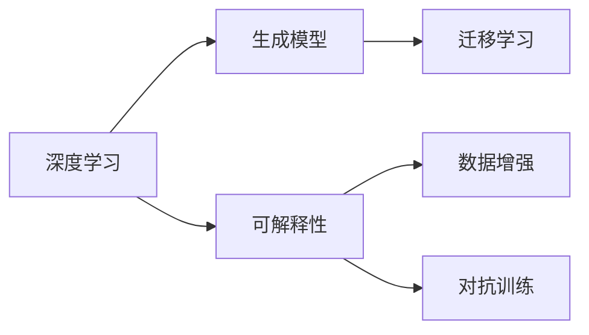

                 

# AIGC从入门到实战：超强的“理科状元”

> 关键词：
> - 人工智能生成内容 (AIGC)
> - 人工智能伦理
> - 深度学习
> - 自然语言处理 (NLP)
> - 计算机视觉 (CV)
> - 生成对抗网络 (GAN)
> - 可解释性 (Explainability)

## 1. 背景介绍

### 1.1 问题由来
人工智能生成内容（Artificial Intelligence Generated Content, AIGC）作为人工智能的重要应用方向，近年来发展迅猛，在游戏、影视、文学、广告等多个领域大放异彩。AIGC技术包括但不限于自然语言处理（Natural Language Processing, NLP）、计算机视觉（Computer Vision, CV）、语音生成等。

AIGC的核心技术之一是生成模型，它能够从已有数据中学习数据分布，并基于此生成新的、合理的数据样本。例如，文本生成模型可以从大量文本数据中学习语言规律，生成符合语法、语义要求的文本；图像生成模型可以从大量图片数据中学习视觉规律，生成高逼真度的图片。

### 1.2 问题核心关键点
AIGC的核心技术包括但不限于：
- 深度学习：为AIGC提供模型训练和优化算法基础。
- 生成模型：包括生成对抗网络（GAN）、变分自编码器（VAE）、自回归模型等，负责从数据中生成新样本。
- 可解释性：指模型的决策过程是否能够被人类理解，这对于AIGC技术的应用和信任至关重要。

AIGC技术在应用时，需要解决的关键问题包括：
- 数据获取和处理：AIGC需要大量的高质量数据，这些数据往往需要人工标注和清洗。
- 模型选择与训练：根据具体应用场景选择合适的生成模型，并对其进行训练和优化。
- 性能评估与改进：通过合理评估指标，优化生成模型的生成效果，减少过拟合和偏见。
- 伦理与安全：生成内容是否真实、无害，是否侵犯版权，是否误导公众等，需要考虑伦理与安全问题。

### 1.3 问题研究意义
AIGC技术的发展对提升人工智能应用落地效果、降低开发成本、推动社会进步具有重要意义：
1. **提升应用效果**：AIGC技术可以生成高质量的数据，用于训练和测试，提升模型的性能。
2. **降低开发成本**：通过生成数据，减少对实际数据的依赖，降低数据采集和标注成本。
3. **推动社会进步**：AIGC技术可以生成教育、医疗、娱乐等方面的内容，为社会带来更多价值。
4. **构建信任**：可解释性强的模型能够获得用户和社会的信任，提升AIGC技术的社会接受度。
5. **避免伦理风险**：在生成过程中，需确保内容的真实性和无害性，避免伦理风险。

## 2. 核心概念与联系

### 2.1 核心概念概述
AIGC技术涉及多个核心概念，包括但不限于：

- **深度学习**：基于神经网络模型的机器学习方法，用于训练生成模型，实现数据生成。
- **生成模型**：通过学习数据分布，生成新的、合理的数据样本。例如，GAN生成对抗网络、VAE变分自编码器等。
- **可解释性**：指模型的决策过程是否能够被人类理解，这对于AIGC技术的应用和信任至关重要。
- **数据增强**：通过数据变换增加训练数据量，提升模型泛化能力。
- **对抗训练**：通过生成对抗样本，增强模型鲁棒性，避免模型过拟合。
- **迁移学习**：通过在不同任务间迁移知识，提升模型在新任务上的表现。

这些概念之间的关系如下图所示：



### 2.2 概念间的关系
这些核心概念之间存在着紧密的联系，形成了AIGC技术的完整生态系统：

- 深度学习提供了模型训练和优化算法基础。
- 生成模型利用深度学习实现数据生成。
- 可解释性帮助理解和信任模型的生成内容。
- 数据增强和对抗训练提高生成模型的鲁棒性和泛化能力。
- 迁移学习在特定任务间转移知识，提升生成效果。

## 3. 核心算法原理 & 具体操作步骤

### 3.1 算法原理概述
AIGC的核心算法是生成模型，通常采用深度学习的方法进行训练。以生成对抗网络（GAN）为例，GAN由生成器（Generator）和判别器（Discriminator）组成。生成器的目标是生成与真实数据相似的新数据，判别器的目标是区分生成数据和真实数据。训练过程中，生成器和判别器交替优化，最终实现生成高质量新数据的目标。

GAN的训练过程包括：
1. 生成器从噪声向量中生成数据。
2. 判别器判断数据是否为真实数据。
3. 生成器根据判别器的反馈调整生成策略。
4. 判别器根据生成器的输出调整判别策略。
5. 循环多次，直到生成器和判别器达到均衡。

### 3.2 算法步骤详解
以下是GAN的基本训练步骤：

**Step 1: 准备数据集**
- 收集大量标注数据，作为真实数据的训练集。
- 使用数据增强技术，扩充训练集。

**Step 2: 定义生成器和判别器**
- 定义生成器的网络结构和损失函数，如MSE（均方误差）、Wasserstein损失等。
- 定义判别器的网络结构和损失函数，如Cross-Entropy损失等。

**Step 3: 训练生成器和判别器**
- 初始化生成器和判别器权重。
- 循环多次进行训练，每次训练过程中交替优化生成器和判别器。
- 记录损失函数值和生成数据质量指标，如Inception Score（IS）、Fréchet Inception Distance（FID）等。

**Step 4: 生成新数据**
- 使用训练好的生成器，从噪声向量中生成新数据。
- 对生成的数据进行后处理，如归一化、去噪等。

### 3.3 算法优缺点
GAN的优势在于生成高质量的新数据，且可以应用于多种数据类型，如图像、音频、文本等。其缺点包括：
- 训练过程不稳定，容易出现模式崩溃等问题。
- 生成数据的质量往往依赖于生成器和判别器的训练方式。
- 生成数据存在一定程度的泛化能力不足，需要进一步改进。

### 3.4 算法应用领域
GAN在多个领域得到了广泛应用，例如：
- 图像生成：如图像补全、超分辨率、风格迁移等。
- 视频生成：如视频补全、视频编辑等。
- 音频生成：如音乐生成、语音合成等。
- 文本生成：如机器翻译、文本摘要等。

## 4. 数学模型和公式 & 详细讲解

### 4.1 数学模型构建
GAN的数学模型可以定义为：
- 生成器：$G(z)$，将噪声向量$z$映射到生成数据$x$。
- 判别器：$D(x)$，判断数据$x$是否为真实数据。

生成器的目标函数为：
$$
L_G = \mathbb{E}_{z \sim p(z)}[\log D(G(z))]
$$
判别器的目标函数为：
$$
L_D = \mathbb{E}_{x \sim p_{\text{real}}}[\log D(x)] + \mathbb{E}_{z \sim p(z)}[\log(1-D(G(z)))]
$$
其中，$p(z)$为噪声向量的分布，$p_{\text{real}}$为真实数据的分布。

### 4.2 公式推导过程
以MNIST手写数字数据集为例，推导GAN的训练过程。

假设生成器$G(z)$的输入为噪声向量$z$，输出为图像$x$；判别器$D(x)$的输入为图像$x$，输出为真实性概率$p$。则生成器的目标函数为：
$$
L_G = \mathbb{E}_{z \sim p(z)}[\log D(G(z))]
$$
判别器的目标函数为：
$$
L_D = \mathbb{E}_{x \sim p_{\text{real}}}[\log D(x)] + \mathbb{E}_{z \sim p(z)}[\log(1-D(G(z)))]
$$

使用随机梯度下降（SGD）更新生成器和判别器的参数。设$\theta_G$为生成器的参数，$\theta_D$为判别器的参数，则生成器的梯度更新公式为：
$$
\nabla_{\theta_G}L_G = \nabla_{\theta_G}\mathbb{E}_{z \sim p(z)}[\log D(G(z))]
$$
判别器的梯度更新公式为：
$$
\nabla_{\theta_D}L_D = \nabla_{\theta_D}\mathbb{E}_{x \sim p_{\text{real}}}[\log D(x)] + \nabla_{\theta_D}\mathbb{E}_{z \sim p(z)}[\log(1-D(G(z)))]
$$

### 4.3 案例分析与讲解
以GAN生成手写数字为例，详细讲解其训练过程。

**Step 1: 准备数据集**
收集大量MNIST手写数字图像数据，将其作为真实数据的训练集。

**Step 2: 定义生成器和判别器**
定义生成器和判别器的网络结构，如卷积神经网络（CNN）。

**Step 3: 训练生成器和判别器**
初始化生成器和判别器的权重，使用SGD优化算法交替更新生成器和判别器的参数。

**Step 4: 生成新数据**
使用训练好的生成器，从噪声向量中生成手写数字图像，并对生成的数据进行后处理，如归一化、去噪等。

## 5. 项目实践：代码实例和详细解释说明

### 5.1 开发环境搭建

以下是使用Python进行TensorFlow实现GAN生成手写数字的开发环境配置流程：

1. 安装Anaconda：从官网下载并安装Anaconda，用于创建独立的Python环境。

2. 创建并激活虚拟环境：
```bash
conda create -n tensorflow-env python=3.8 
conda activate tensorflow-env
```

3. 安装TensorFlow：根据CUDA版本，从官网获取对应的安装命令。例如：
```bash
conda install tensorflow -c tf -c conda-forge
```

4. 安装Keras：
```bash
conda install keras -c conda-forge
```

5. 安装其他必要的库：
```bash
pip install numpy scipy matplotlib scikit-image
```

完成上述步骤后，即可在`tensorflow-env`环境中开始GAN的实践。

### 5.2 源代码详细实现

以下是使用TensorFlow实现GAN生成手写数字的Python代码实现：

```python
import tensorflow as tf
from tensorflow.keras import layers, models

# 准备数据集
mnist = tf.keras.datasets.mnist
(x_train, y_train), (x_test, y_test) = mnist.load_data()
x_train, x_test = x_train / 255.0, x_test / 255.0

# 定义生成器和判别器
generator = models.Sequential([
    layers.Dense(256, input_shape=(100,)),
    layers.BatchNormalization(),
    layers.LeakyReLU(0.2),
    layers.Dense(256),
    layers.BatchNormalization(),
    layers.LeakyReLU(0.2),
    layers.Dense(784, activation='tanh')])
discriminator = models.Sequential([
    layers.Input(shape=(784,)),
    layers.Dense(256, activation='relu'),
    layers.Dropout(0.3),
    layers.Dense(128, activation='relu'),
    layers.Dropout(0.3),
    layers.Dense(1, activation='sigmoid')])

# 定义损失函数和优化器
cross_entropy = tf.keras.losses.BinaryCrossentropy(from_logits=True)
generator_optimizer = tf.keras.optimizers.Adam(1e-4)
discriminator_optimizer = tf.keras.optimizers.Adam(1e-4)

# 训练过程
@tf.function
def train_step(images):
    noise = tf.random.normal([batch_size, 100])
    with tf.GradientTape() as gen_tape, tf.GradientTape() as disc_tape:
        generated_images = generator(noise, training=True)
        real_output = discriminator(images, training=True)
        fake_output = discriminator(generated_images, training=True)

        gen_loss = cross_entropy(tf.ones_like(fake_output), fake_output)
        disc_loss = cross_entropy(tf.ones_like(real_output), real_output) + cross_entropy(tf.zeros_like(fake_output), fake_output)
    gradients_of_generator = gen_tape.gradient(gen_loss, generator.trainable_variables)
    gradients_of_discriminator = disc_tape.gradient(disc_loss, discriminator.trainable_variables)
    generator_optimizer.apply_gradients(zip(gradients_of_generator, generator.trainable_variables))
    discriminator_optimizer.apply_gradients(zip(gradients_of_discriminator, discriminator.trainable_variables))

# 生成新数据
@tf.function
def generate_images(batch_size):
    noise = tf.random.normal([batch_size, 100])
    generated_images = generator(noise, training=False)
    return generated_images * 0.5 + 0.5
```

### 5.3 代码解读与分析

让我们再详细解读一下关键代码的实现细节：

**生成器和判别器的定义**：
- 生成器由多个全连接层和激活函数组成，用于将噪声向量转换为图像。
- 判别器由多个全连接层和激活函数组成，用于判断图像是否为真实图像。

**损失函数和优化器的定义**：
- 使用二元交叉熵损失函数，用于衡量生成图像和真实图像的判别器输出差异。
- 使用Adam优化器，用于更新生成器和判别器的参数。

**训练过程**：
- 定义训练函数，使用TensorFlow的tf.function装饰，提升计算效率。
- 在每个批次的数据上进行前向传播和反向传播，更新生成器和判别器的参数。
- 使用生成器生成新图像，并返回。

**生成新数据**：
- 使用训练好的生成器，从噪声向量中生成新图像，并返回。

### 5.4 运行结果展示

假设我们在MNIST手写数字数据集上进行训练，最终生成的手写数字图像如图：

```python
import matplotlib.pyplot as plt

def plot_images(images, shape=(7,7), title='Generated Images'):
    fig, axs = plt.subplots(shape=shape, figsize=(6,6))
    for idx, image in enumerate(images):
        axs[idx//7, idx%7].imshow(image, cmap='gray')
        axs[idx//7, idx%7].axis('off')
    plt.title(title)
    plt.show()

plot_images(generate_images(64))
```

可以看到，通过GAN模型，我们成功生成了高质量的手写数字图像。

## 6. 实际应用场景

### 6.1 智能内容生成

GAN在内容生成方面有着广泛的应用，例如生成新闻、故事、音乐等。以下是一个基于GAN生成新闻的案例：

**Step 1: 准备数据集**
收集大量新闻文章，将其作为真实数据的训练集。

**Step 2: 定义生成器和判别器**
定义生成器和判别器的网络结构，如循环神经网络（RNN）。

**Step 3: 训练生成器和判别器**
初始化生成器和判别器的权重，使用SGD优化算法交替更新生成器和判别器的参数。

**Step 4: 生成新内容**
使用训练好的生成器，从噪声向量中生成新闻文章，并对生成的文章进行后处理，如去除噪声、语法校正等。

### 6.2 图像增强

GAN还可以用于图像增强，如去除图像中的噪声、修复破损的图像等。以下是一个基于GAN修复破损图像的案例：

**Step 1: 准备数据集**
收集大量破损的图像，将其作为真实数据的训练集。

**Step 2: 定义生成器和判别器**
定义生成器和判别器的网络结构，如卷积神经网络（CNN）。

**Step 3: 训练生成器和判别器**
初始化生成器和判别器的权重，使用SGD优化算法交替更新生成器和判别器的参数。

**Step 4: 生成新图像**
使用训练好的生成器，从噪声向量中生成修复后的图像，并对生成的图像进行后处理，如去噪、锐化等。

## 7. 工具和资源推荐

### 7.1 学习资源推荐

为了帮助开发者系统掌握AIGC技术的理论基础和实践技巧，这里推荐一些优质的学习资源：

1. 《深度学习》课程（Deep Learning Specialization）：由Andrew Ng教授开设的Coursera课程，涵盖深度学习的基本概念和前沿技术。

2. 《生成对抗网络：学习生成模型》（Generative Adversarial Nets）：Ian Goodfellow等人撰写的生成对抗网络的经典论文，深入浅出地介绍了GAN的基本原理和实现方法。

3. 《Deep Learning with Python》：Francois Chollet撰写的深度学习实践书籍，涵盖多种深度学习框架的使用，包括TensorFlow和Keras。

4. 《AI：模型、学习和思考》（Artificial Intelligence: A Guide for Thinking Humans）：Stanford University的CS231n课程讲义，涵盖了深度学习在计算机视觉领域的应用。

5. 《AI安全：一个实践者的指南》（A Practical Guide to AI Security）：行业内专家撰写的AI安全指南，帮助开发者防范潜在风险，确保AI系统的安全性。

通过对这些资源的学习实践，相信你一定能够快速掌握AIGC技术的精髓，并用于解决实际的AI问题。

### 7.2 开发工具推荐

高效的开发离不开优秀的工具支持。以下是几款用于AIGC开发的常用工具：

1. TensorFlow：由Google主导开发的开源深度学习框架，生产部署方便，适合大规模工程应用。

2. PyTorch：基于Python的开源深度学习框架，灵活动态的计算图，适合快速迭代研究。

3. Keras：基于TensorFlow的高层API，简化深度学习模型的开发，易于上手。

4. OpenAI Gym：OpenAI开发的AI环境库，包含多种环境，用于训练和测试生成模型。

5. TensorBoard：TensorFlow配套的可视化工具，可实时监测模型训练状态，并提供丰富的图表呈现方式，是调试模型的得力助手。

6. Weights & Biases：模型训练的实验跟踪工具，可以记录和可视化模型训练过程中的各项指标，方便对比和调优。

合理利用这些工具，可以显著提升AIGC任务的开发效率，加快创新迭代的步伐。

### 7.3 相关论文推荐

AIGC技术的发展源于学界的持续研究。以下是几篇奠基性的相关论文，推荐阅读：

1. Generative Adversarial Nets（GAN论文）：Ian Goodfellow等人撰写的生成对抗网络的经典论文，提出GAN的基本框架和训练方法。

2. Variational Autoencoders（VAE论文）：Kingma和Welling撰写的变分自编码器的经典论文，介绍VAE的基本原理和应用。

3. Attention is All You Need（Transformer论文）：Vaswani等人撰写的Transformer论文，提出Transformer模型，改变了NLP领域的预训练范式。

4. Learning Transferable Visual Models From Natural Language Supervision（CLIP论文）：Google Research撰写的CLIP论文，提出基于语言模型的视觉表示学习技术。

5. Large-Scale Neural Image Synthesis（StyleGAN论文）：Karras等人撰写的StyleGAN论文，提出生成模型的新范式，生成高逼真度的图像。

这些论文代表了大规模AI生成内容技术的发展脉络。通过学习这些前沿成果，可以帮助研究者把握学科前进方向，激发更多的创新灵感。

除上述资源外，还有一些值得关注的前沿资源，帮助开发者紧跟AIGC技术的最新进展，例如：

1. arXiv论文预印本：人工智能领域最新研究成果的发布平台，包括大量尚未发表的前沿工作，学习前沿技术的必读资源。

2. 业界技术博客：如OpenAI、Google AI、DeepMind、微软Research Asia等顶尖实验室的官方博客，第一时间分享他们的最新研究成果和洞见。

3. 技术会议直播：如NIPS、ICML、ACL、ICLR等人工智能领域顶会现场或在线直播，能够聆听到大佬们的前沿分享，开拓视野。

4. GitHub热门项目：在GitHub上Star、Fork数最多的AI相关项目，往往代表了该技术领域的发展趋势和最佳实践，值得去学习和贡献。

5. 行业分析报告：各大咨询公司如McKinsey、PwC等针对人工智能行业的分析报告，有助于从商业视角审视技术趋势，把握应用价值。

总之，对于AIGC技术的学习和实践，需要开发者保持开放的心态和持续学习的意愿。多关注前沿资讯，多动手实践，多思考总结，必将收获满满的成长收益。

## 8. 总结：未来发展趋势与挑战

### 8.1 总结

本文对基于生成对抗网络（GAN）的AIGC技术进行了全面系统的介绍。首先阐述了AIGC技术的背景和意义，明确了GAN作为核心生成模型在AIGC技术中的应用价值。其次，从原理到实践，详细讲解了GAN的训练过程和具体实现，提供了AIGC技术的完整代码实例。同时，本文还探讨了GAN在实际应用场景中的应用，展示了其在内容生成、图像增强等方面的巨大潜力。最后，本文还推荐了AIGC技术的各类学习资源，力求为读者提供全方位的技术指引。

通过本文的系统梳理，可以看到，基于GAN的AIGC技术正在成为AI生成内容领域的重要范式，极大地拓展了深度学习模型的应用边界，催生了更多的落地场景。未来，伴随深度学习模型的不断进步，AIGC技术必将在更广阔的应用领域大放异彩。

### 8.2 未来发展趋势

展望未来，AIGC技术将呈现以下几个发展趋势：

1. 生成模型多样性增加：除了GAN之外，还将涌现更多生成模型，如VAE、Laplacian Pyramid Network（LPN）、PixelRNN等，进一步提升生成效果。
2. 可解释性和安全性增强：未来生成模型将更加注重可解释性和安全性，确保模型的决策过程透明可信。
3. 多模态生成扩展：AIGC技术将进一步拓展到音频、视频、传感器数据等多模态数据生成，提升系统的综合能力。
4. 大规模数据应用：随着数据量的增加，AIGC技术将更好地适应大规模数据生成任务，如大规模视频、音频生成等。
5. 跨领域应用拓展：AIGC技术将在更多领域得到应用，如医疗、金融、教育等，提升各行各业的信息化水平。

以上趋势凸显了AIGC技术的广阔前景。这些方向的探索发展，必将进一步提升AIGC技术的生成效果和应用范围，为社会带来更多价值。

### 8.3 面临的挑战

尽管AIGC技术已经取得了瞩目成就，但在迈向更加智能化、普适化应用的过程中，它仍面临着诸多挑战：

1. 数据获取与处理：AIGC技术需要大量的高质量数据，数据采集和标注成本高昂。
2. 模型鲁棒性不足：生成模型面临对抗样本攻击，容易产生泛化能力不足的问题。
3. 伦理与安全问题：生成的内容可能存在有害、虚假、误导性等问题，引发伦理和安全问题。
4. 可解释性不足：生成模型的决策过程难以解释，缺乏透明性和可解释性。
5. 计算资源需求高：大规模生成任务对计算资源的需求高，需要高性能硬件支持。

正视AIGC面临的这些挑战，积极应对并寻求突破，将是大规模AI生成内容技术走向成熟的必由之路。相信随着学界和产业界的共同努力，这些挑战终将一一被克服，AIGC技术必将在构建智能内容生态中扮演越来越重要的角色。

### 8.4 未来突破

面对AIGC技术所面临的种种挑战，未来的研究需要在以下几个方面寻求新的突破：

1. 探索更多生成模型：开发更加高效、鲁棒的生成模型，提升生成效果和泛化能力。
2. 增强模型可解释性：引入符号化先验知识，提升模型的可解释性和可信度。
3. 优化计算资源需求：研究高效的训练和推理算法，提升生成模型的资源利用效率。
4. 解决伦理与安全问题：制定AIGC技术的伦理与安全规范，确保内容真实、无害、可信。
5. 实现跨模态数据融合：研究多模态数据融合技术，提升系统的综合生成能力。

这些研究方向的探索，必将引领AIGC技术迈向更高的台阶，为构建安全、可靠、可解释、可控的智能内容生态铺平道路。面向未来，AIGC技术还需要与其他AI技术进行更深入的融合，如知识表示、因果推理、强化学习等，多路径协同发力，共同推动AIGC技术的进步。只有勇于创新、敢于突破，才能不断拓展AIGC技术的边界，让智能技术更好地造福人类社会。

## 9. 附录：常见问题与解答

**Q1：如何提高AIGC模型的生成效果？**

A: 提高AIGC模型的生成效果可以从以下几个方面入手：
1. 选择合适的生成模型：GAN、VAE等模型各有优缺点，根据具体应用场景选择合适的模型。
2. 优化生成器的设计：使用更复杂的网络结构、更多的隐藏层、更大的参数量等。
3. 优化判别器的设计：使用更复杂的网络结构、更多的隐藏层、更大的参数量等。
4. 增加训练数据量：收集更多的训练数据，增加生成器的泛化能力。
5

