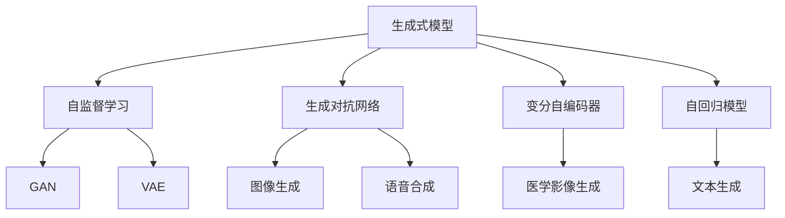
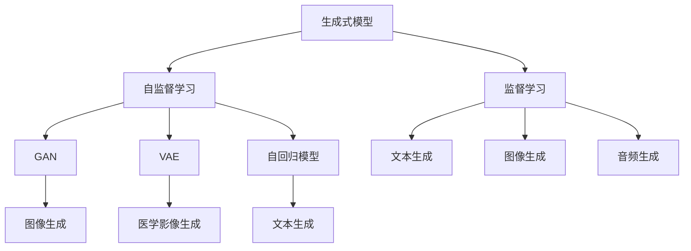
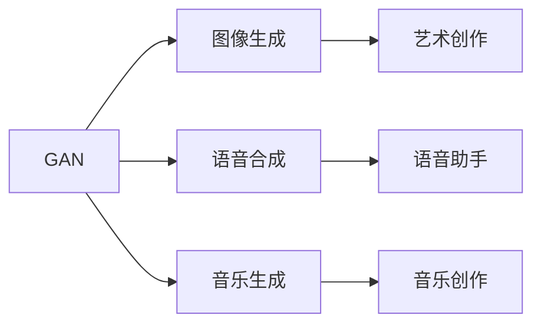
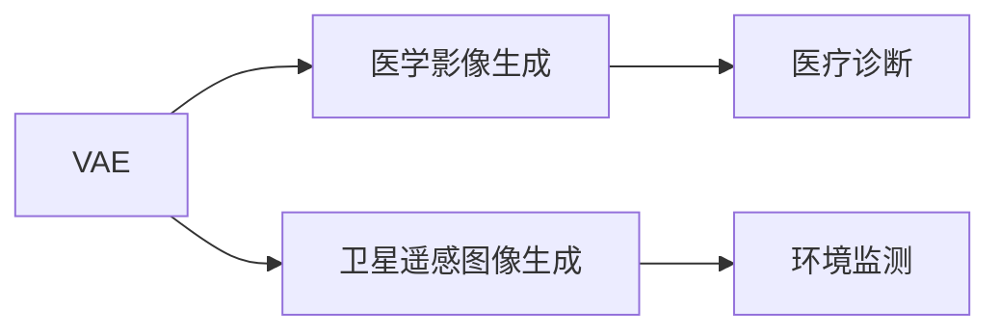
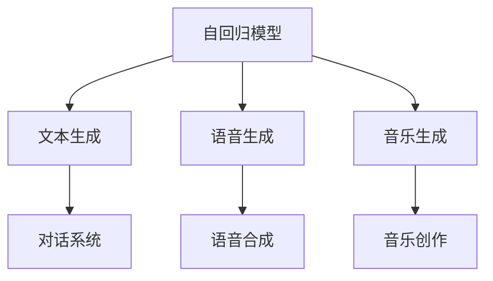
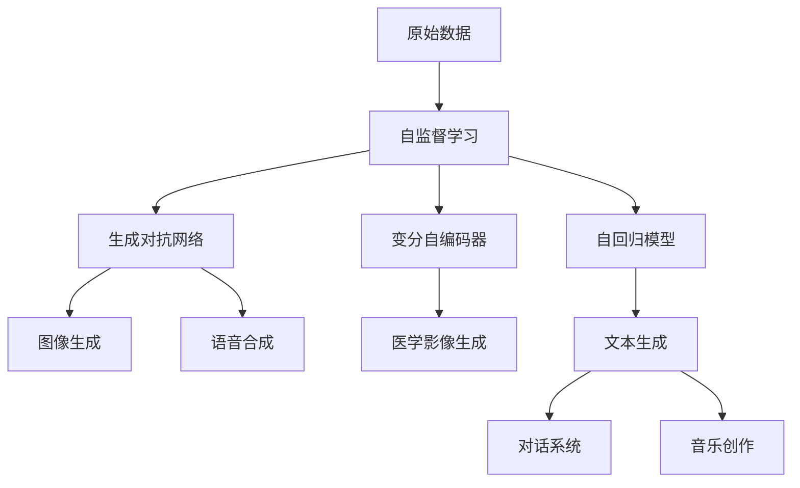

                 

# AIGC：未来已来，如何拥抱生成式AI时代？

## 1. 背景介绍

### 1.1 问题由来
随着深度学习技术和大规模数据集的不断涌现，人工智能(AI)领域迎来了新的突破——生成式人工智能（AIGC，Generative AI）。相比于传统的基于数据驱动的机器学习（ML）和基于规则的人工智能（AI），生成式AI能够通过复杂的模型学习数据分布，生成全新的、高质量的输出。

生成式AI在图像、语音、文本等领域都有广泛的应用。如文本生成（如对话系统、内容创作）、图像生成（如艺术创作、增强现实）、音频生成（如语音合成、音乐生成）等。其核心思想是通过训练生成模型，使其能够从原始数据中学习规律，并根据这些规律生成新的数据。

生成式AI技术在各行各业得到广泛应用，极大地推动了产业的数字化转型，如图文创作、医疗影像分析、自动驾驶、虚拟人、游戏设计等。然而，生成式AI技术的快速发展，也带来了许多挑战和疑问，如何高效、安全、负责任地应用生成式AI技术，成为了当前人工智能领域的重要课题。

### 1.2 问题核心关键点
当前生成式AI技术主要分为两类：基于规则和基于生成模型。其中，生成模型基于深度学习，通过自监督学习或监督学习训练，生成与训练数据相似的新数据。这类方法包括变分自编码器（VAE）、生成对抗网络（GAN）、自回归模型（如LSTM、RNN、Transformer等）和自编码器（AE）等。

生成式AI技术的核心挑战包括：
1. 如何高效地训练和优化生成模型，使其能够产生高质量的输出？
2. 如何评估生成模型的性能，选择合适的损失函数和优化策略？
3. 如何降低生成模型的过拟合风险，避免生成伪造数据？
4. 如何平衡生成模型的创造力和准确性，避免过于机械或过于离奇的生成？
5. 如何确保生成式AI的伦理安全，避免有害信息的生成和传播？

生成式AI技术的应用领域非常广泛，涉及医疗、教育、游戏、媒体、金融等多个行业。其核心优势在于能够利用海量的数据，创造出全新的、具备创意的、符合用户需求的内容，从而提升用户体验和业务价值。

### 1.3 问题研究意义
研究生成式AI技术，对于推动人工智能技术的发展，提升各行各业的信息化水平，具有重要意义：

1. 降低内容创作成本。生成式AI技术能够自动生成高质量文本、图像、音频等，大大减少了人类创作者的工作量。
2. 提升创意产出效率。生成式AI能够快速生成大量创意内容，帮助创作者在短时间内产生更多高质量作品。
3. 促进创新研发。生成式AI在生成新颖、独特内容的同时，可以激发人类的创新思维，提升科学研究的效率和质量。
4. 增强用户体验。生成式AI技术可以应用于智能客服、个性化推荐、虚拟形象等场景，提升用户体验。
5. 推动产业升级。生成式AI在多个行业中得到应用，提升了业务流程的自动化和智能化水平，加速产业转型升级。

## 2. 核心概念与联系

### 2.1 核心概念概述

为更好地理解生成式AI技术的核心概念，本节将介绍几个密切相关的核心概念：

- **生成式模型（Generative Model）**：指能够从原始数据中学习到数据分布，并生成新数据样本的模型。例如，生成对抗网络（GAN）、变分自编码器（VAE）、自回归模型等。
- **自监督学习（Self-supervised Learning）**：指利用数据自身的结构信息进行无监督学习，不依赖于标注数据，能够学习到数据的潜在表示。例如，语言模型预训练（如BERT）、对比预测（如SimCLR）。
- **生成对抗网络（GAN）**：由生成器和判别器组成的一种生成模型，通过对抗训练的方式，生成高质量的新数据。GAN在图像生成、语音合成、音乐生成等领域表现优异。
- **变分自编码器（VAE）**：一种生成模型，通过学习数据分布的概率密度函数，生成新数据。VAE特别适用于数据噪声较多的领域，如医学影像、卫星遥感图像等。
- **自回归模型（Autoregressive Model）**：指通过先预测一个变量，再根据该变量的预测结果预测下一个变量，从而生成新数据序列。例如，LSTM、RNN、Transformer等。

这些核心概念之间的逻辑关系可以通过以下Mermaid流程图来展示：



这个流程图展示了生成式模型的核心概念及其之间的关系：

1. 生成式模型包括自监督学习、生成对抗网络、变分自编码器、自回归模型等多种类型。
2. 自监督学习是生成式模型的一种重要训练方式，能够从数据自身中学习到数据分布。
3. 生成对抗网络、变分自编码器、自回归模型都是生成式模型的具体实现方式。
4. 这些生成式模型在图像、语音、文本等领域都有广泛的应用。

### 2.2 概念间的关系

这些核心概念之间存在着紧密的联系，形成了生成式AI技术的完整生态系统。下面我们通过几个Mermaid流程图来展示这些概念之间的关系。

#### 2.2.1 生成式模型的学习范式



这个流程图展示了生成式模型的两种主要学习范式：自监督学习和监督学习。生成式模型可以通过自监督学习（如语言模型预训练）或监督学习（如文本生成任务）进行训练。自监督学习通过利用数据自身的结构信息进行学习，能够学习到数据的潜在表示，适用于没有标注数据的情况。监督学习则通过有标注数据进行训练，能够生成与训练数据相似的新数据。

#### 2.2.2 生成对抗网络（GAN）的应用



这个流程图展示了GAN在图像生成、语音合成、音乐生成等领域的典型应用。GAN通过生成器和判别器的对抗训练，生成高质量的新数据，广泛应用于艺术创作、音乐生成、语音合成等需要创造性的领域。

#### 2.2.3 变分自编码器（VAE）的应用



这个流程图展示了VAE在医学影像生成、卫星遥感图像生成等领域的典型应用。VAE通过学习数据分布的概率密度函数，生成新数据，特别适用于数据噪声较多的领域，能够帮助解决数据质量问题，提升数据处理效果。

#### 2.2.4 自回归模型的应用



这个流程图展示了自回归模型在文本生成、语音生成、音乐生成等领域的典型应用。自回归模型通过预测下一个变量，生成新数据序列，广泛应用于文本生成、语音生成、音乐生成等需要连续输出的领域。

### 2.3 核心概念的整体架构

最后，我们用一个综合的流程图来展示这些核心概念在生成式AI技术中的整体架构：



这个综合流程图展示了从原始数据到生成式模型的完整过程。生成式AI技术首先利用自监督学习从数据中学习到数据分布，然后通过生成对抗网络、变分自编码器、自回归模型等多种生成模型进行训练，生成高质量的新数据，最终应用于图像生成、语音合成、文本生成等多种领域。

## 3. 核心算法原理 & 具体操作步骤
### 3.1 算法原理概述

生成式AI技术的核心在于生成模型的训练，其基本思想是通过学习数据分布，生成与训练数据相似的新数据。以下是几种常见的生成式AI技术及其算法原理：

- **生成对抗网络（GAN）**：由生成器和判别器组成，生成器和判别器通过对抗训练，生成高质量的新数据。具体地，生成器从噪声中生成样本，判别器判断样本是否为真实样本，两个模型交替训练，逐步提升生成器的生成能力。
- **变分自编码器（VAE）**：通过学习数据分布的概率密度函数，生成新数据。VAE包括编码器和解码器两个部分，编码器将输入数据映射到潜在空间，解码器从潜在空间生成新数据。通过最小化重构误差和潜在空间的先验分布的约束，训练VAE模型。
- **自回归模型（Autoregressive Model）**：通过预测下一个变量，生成新数据序列。自回归模型包括LSTM、RNN、Transformer等，通过预测当前变量的条件概率，生成新数据序列。

### 3.2 算法步骤详解

生成式AI技术的核心在于生成模型的训练。以下是几种常见生成式模型的训练步骤：

**生成对抗网络（GAN）的训练步骤：**

1. **初始化模型**：随机初始化生成器和判别器的参数。
2. **生成器训练**：固定判别器的参数，更新生成器的参数，使其生成样本尽可能接近真实样本。
3. **判别器训练**：固定生成器的参数，更新判别器的参数，使其尽可能准确地判断样本是否为真实样本。
4. **交替训练**：交替进行生成器和判别器的训练，逐步提升生成器的生成能力和判别器的判别能力。
5. **模型优化**：在生成器和判别器交替训练后，优化整个模型，使其生成高质量的新数据。

**变分自编码器（VAE）的训练步骤：**

1. **初始化模型**：随机初始化编码器和解码器的参数。
2. **编码器训练**：通过最小化重构误差，训练编码器将输入数据映射到潜在空间。
3. **解码器训练**：通过最小化潜在空间的先验分布的约束，训练解码器从潜在空间生成新数据。
4. **模型优化**：同时优化编码器和解码器的参数，使其生成高质量的新数据。

**自回归模型（Autoregressive Model）的训练步骤：**

1. **初始化模型**：随机初始化模型的参数。
2. **预测下一个变量**：通过预测当前变量的条件概率，生成新数据序列。
3. **模型优化**：通过最小化生成数据的误差，优化模型参数，使其生成高质量的新数据序列。

### 3.3 算法优缺点

生成式AI技术具有以下优点：

1. **生成高质量的数据**：生成式AI技术能够生成高质量、符合分布的新数据，广泛应用于图像、语音、文本等领域。
2. **应用场景广泛**：生成式AI技术在医疗、教育、游戏、媒体、金融等多个行业都有广泛应用，推动了各行各业的数字化转型。
3. **数据驱动**：生成式AI技术通过数据驱动的方式，能够自动生成新数据，降低了人工创作的工作量，提升了创意产出的效率。

同时，生成式AI技术也存在一些缺点：

1. **数据质量依赖**：生成式AI技术需要大量的高质量数据进行训练，如果训练数据质量较差，模型的生成效果也会受到影响。
2. **模型复杂度高**：生成式AI模型通常需要大量的参数进行训练，计算资源需求高，训练时间长。
3. **生成结果多样性**：生成式AI模型生成的结果可能存在多样性，有时无法满足用户的具体需求。
4. **生成结果可控性差**：生成式AI模型的生成结果可能存在一定的随机性，难以完全控制生成内容的风格和质量。

### 3.4 算法应用领域

生成式AI技术在多个领域都有广泛的应用，以下是几个典型的应用场景：

- **图像生成**：生成对抗网络（GAN）在图像生成领域表现优异，广泛应用于艺术创作、虚拟现实、游戏设计等。
- **语音合成**：生成对抗网络（GAN）在语音合成领域也有广泛应用，能够生成自然流畅的语音，广泛应用于语音助手、客服机器人等。
- **文本生成**：自回归模型（如LSTM、RNN、Transformer等）在文本生成领域表现优异，广泛应用于对话系统、内容创作、摘要生成等。
- **音乐生成**：生成对抗网络（GAN）在音乐生成领域也有应用，能够生成高质量的音乐，广泛应用于音乐创作、虚拟现实等。
- **医学影像生成**：变分自编码器（VAE）在医学影像生成领域表现优异，能够生成高质量的医学影像，广泛应用于医学诊断、医疗培训等。

除了上述这些领域，生成式AI技术还在视频生成、推荐系统、智能客服等多个领域得到了应用，为各行各业带来了新的创新和突破。

## 4. 数学模型和公式 & 详细讲解  
### 4.1 数学模型构建

生成式AI技术的核心在于生成模型的训练，其数学模型通常基于生成概率模型，通过对数据分布的学习，生成高质量的新数据。以下是几种常见生成式AI技术的数学模型：

- **生成对抗网络（GAN）**：通过生成器和判别器的对抗训练，生成高质量的新数据。其数学模型如下：

$$
G(z) = \mu(z) + \sigma(z) \epsilon, \quad D(x) = \log\big(\frac{1}{1+\exp(-\alpha(x-\mu(z)))}\big), \quad \log\big(\frac{1}{1+\exp(-\alpha(x-\mu(z)))}\big)
$$

其中，$G(z)$ 表示生成器生成的样本，$D(x)$ 表示判别器对样本的判别结果，$z$ 为噪声向量。

- **变分自编码器（VAE）**：通过学习数据分布的概率密度函数，生成新数据。其数学模型如下：

$$
p(x|\mu(z)) = \mathcal{N}(x|\mu(z), \sigma^2(z)), \quad p(z) = \mathcal{N}(z|0, I)
$$

其中，$\mu(z)$ 和 $\sigma(z)$ 分别表示编码器生成的潜在变量和方差，$p(x|\mu(z))$ 表示解码器生成的样本分布，$p(z)$ 表示潜在变量的先验分布。

- **自回归模型（Autoregressive Model）**：通过预测下一个变量，生成新数据序列。其数学模型如下：

$$
p(x_1|x_0) = f(x_0), \quad p(x_2|x_1) = g(x_1), \quad \ldots, \quad p(x_t|x_{t-1}) = h(x_{t-1})
$$

其中，$f(x_0)$、$g(x_1)$、$h(x_{t-1})$ 分别表示自回归模型的预测函数。

### 4.2 公式推导过程

以下是生成式AI技术的几个核心数学模型的推导过程：

**生成对抗网络（GAN）的推导**：

1. **生成器的定义**：

$$
G(z) = \mu(z) + \sigma(z) \epsilon
$$

其中，$G(z)$ 表示生成器生成的样本，$z$ 为噪声向量，$\mu(z)$ 和 $\sigma(z)$ 分别表示生成器的输出均值和方差。

2. **判别器的定义**：

$$
D(x) = \log\big(\frac{1}{1+\exp(-\alpha(x-\mu(z)))}\big)
$$

其中，$D(x)$ 表示判别器对样本的判别结果，$x$ 表示样本，$\alpha$ 为判别器的学习率。

3. **对抗训练**：

$$
L_G = -\mathbb{E}_{z\sim p(z)}\log D(G(z)), \quad L_D = -\mathbb{E}_{x\sim p(x)}\log D(x) + \mathbb{E}_{z\sim p(z)}\log(1-D(G(z)))
$$

其中，$L_G$ 和 $L_D$ 分别表示生成器和判别器的损失函数，$p(z)$ 表示噪声向量的分布，$p(x)$ 表示数据的分布。

**变分自编码器（VAE）的推导**：

1. **编码器的定义**：

$$
\mu(z) = W_1x + b_1, \quad \sigma(z) = W_2x + b_2
$$

其中，$\mu(z)$ 和 $\sigma(z)$ 分别表示编码器生成的潜在变量和方差，$W_1$、$W_2$、$b_1$、$b_2$ 分别表示编码器的权重和偏置。

2. **解码器的定义**：

$$
x = W_3z + b_3, \quad \sigma(z) = W_4z + b_4
$$

其中，$x$ 表示解码器生成的样本，$z$ 表示潜在变量，$W_3$、$W_4$、$b_3$、$b_4$ 分别表示解码器的权重和偏置。

3. **损失函数的定义**：

$$
L = -\mathbb{E}_{x\sim p(x)}\log p(x|\mu(z)) + \frac{\beta}{2}\mathbb{E}_{z\sim q(z)}\|\mu(z)\|^2
$$

其中，$L$ 表示VAE的损失函数，$p(x|\mu(z))$ 表示解码器生成的样本分布，$q(z)$ 表示潜在变量的分布，$\beta$ 为VAE的超参数，用于控制潜在变量的先验分布的强度。

**自回归模型的推导**：

1. **预测函数的定义**：

$$
f(x_0) = W_1x_0 + b_1, \quad g(x_1) = W_2x_1 + b_2, \quad h(x_{t-1}) = W_{t-1}x_{t-1} + b_{t-1}
$$

其中，$f(x_0)$、$g(x_1)$、$h(x_{t-1})$ 分别表示自回归模型的预测函数，$W_1$、$W_2$、$b_1$、$b_2$ 分别表示自回归模型的权重和偏置。

2. **生成数据的定义**：

$$
x_t = f(x_{t-1}), \quad x_{t+1} = g(x_t), \quad \ldots, \quad x_{t+n} = h(x_{t+n-1})
$$

其中，$x_t$ 表示生成数据，$n$ 表示序列的长度。

3. **损失函数的定义**：

$$
L = -\sum_{t=1}^n\log p(x_t|x_{t-1})
$$

其中，$L$ 表示自回归模型的损失函数，$x_t$ 表示生成数据，$p(x_t|x_{t-1})$ 表示生成数据的概率分布。

## 5. 项目实践：代码实例和详细解释说明
### 5.1 开发环境搭建

在进行生成式AI模型训练和推理前，我们需要准备好开发环境。以下是使用Python进行PyTorch开发的环境配置流程：

1. 安装Anaconda：从官网下载并安装Anaconda，用于创建独立的Python环境。

2. 创建并激活虚拟环境：
```bash
conda create -n pytorch-env python=3.8 
conda activate pytorch-env
```

3. 安装PyTorch：根据CUDA版本，从官网获取对应的安装命令。例如：
```bash
conda install pytorch torchvision torchaudio cudatoolkit=11.1 -c pytorch -c conda-forge
```

4. 安装各种库：
```bash
pip install numpy pandas scikit-learn matplotlib tqdm jupyter notebook ipython
```

完成上述步骤后，即可在`pytorch-env`环境中开始生成式AI模型训练和推理的实践。

### 5.2 源代码详细实现

下面我们以生成对抗网络（GAN）为例，给出使用PyTorch库进行图像生成任务的代码实现。

首先，定义GAN模型的类：

```python
import torch
import torch.nn as nn
import torch.nn.functional as F

class Generator(nn.Module):
    def __init__(self):
        super(Generator, self).__init__()
        self.fc1 = nn.Linear(100, 256)
        self.fc2 = nn.Linear(256, 512)
        self.fc3 = nn.Linear(512, 1024)
        self.fc4 = nn.Linear(1024, 784)

    def forward(self, x):
        x = self.fc1(x)
        x = F.leaky_relu(x)
        x = self.fc2(x)
        x = F.leaky_relu(x)
        x = self.fc3(x)
        x = F.leaky_relu(x)
        x = self.fc4(x)
        x = torch.tanh(x)
        return x

class Discriminator(nn.Module):
    def __init__(self):
        super(Discriminator, self).__init__()
        self.fc1 = nn.Linear(784, 1024)
        self.fc2 = nn.Linear(1024, 512)
        self.fc3 = nn.Linear(512, 256)
        self.fc4 = nn.Linear(256, 1)

    def forward(self, x):
        x = self.fc1(x)
        x = F.leaky_relu(x)
        x = self.fc2(x)
        x = F.leaky_relu(x)
        x = self.fc3(x)
        x = F.leaky_relu(x)
        x = self.fc4(x)
        x = torch.sigmoid(x)
        return x
```

然后，定义训练函数：

```python
def train_gan(generator, discriminator, dataloader, batch_size, lr, epochs):
    criterion = nn.BCELoss()
    for epoch in range(epochs):
        for i, (real_images, _) in enumerate(dataloader):
            real_images = real_images.view(-1, 784)
            real_labels = torch.ones_like(real_images)
            fake_labels = torch.zeros_like(real_images)

            # 生成器训练
            generator.zero_grad()
            with torch.no_grad():
                noise = torch.randn(batch_size, 100)
                fake_images = generator(noise)
                generator_loss = criterion(discriminator(fake_images), fake_labels)
            generator_loss.backward()
            generator_optimizer.step()

            # 判别器训练
            discriminator.zero_grad()
            real_images = real_images.view(-1, 784)
            real_labels = torch.ones_like(real_images)
            fake_images = generator(noise)
            discriminator_loss = criterion(discriminator(real_images), real_labels) + criterion(discriminator(fake_images), fake_labels)
            discriminator_loss.backward()
            discriminator_optimizer.step()

            if i % 100 == 0:
                print(f'Epoch {epoch+1}, Batch {i+1}/{len(dataloader)}, Generator Loss: {generator_loss.item()}, Discriminator Loss: {discriminator_loss.item()}')
```

最后，启动训练流程：

```python
# 加载数据集
mnist = datasets.MNIST(root='data', train=True, transform=transforms.ToTensor(), download=True)
dataloader = torch.utils.data.DataLoader(mnist, batch_size=64, shuffle=True)

# 初始化模型和优化器
generator = Generator()
discriminator = Discriminator()
generator_optimizer = torch.optim.Adam(generator.parameters(), lr=0.0002)
discriminator_optimizer = torch.optim.Adam(discriminator.parameters(), lr=0.0002)

# 训练模型
train_gan(generator, discriminator, dataloader, batch_size=64, lr=0.0002, epochs=100)
```

以上就是使用PyTorch库进行GAN图像生成任务训练的完整代码实现。可以看到，利用PyTorch框架，我们能够非常方便地定义模型、编写训练代码、调整超参数，实现高效的生成式AI模型训练和推理。

### 5.3 代码解读与分析

让我们再详细解读一下关键代码的实现细节：

**GAN模型类定义**：
- `Generator`类：定义生成器的网络结构，包括线性层和激活函数，最终输出生成图像。
- `Discriminator`类：定义判别器的网络结构，包括线性层和激活函数，最终输出判别结果。

**训练函数定义**：
- 定义训练函数`train_gan`，输入包括生成器和判别器的模型、数据加载器、批量大小、学习率、迭代轮数等参数。
- 在每个epoch中，对生成器和判别器交替进行

