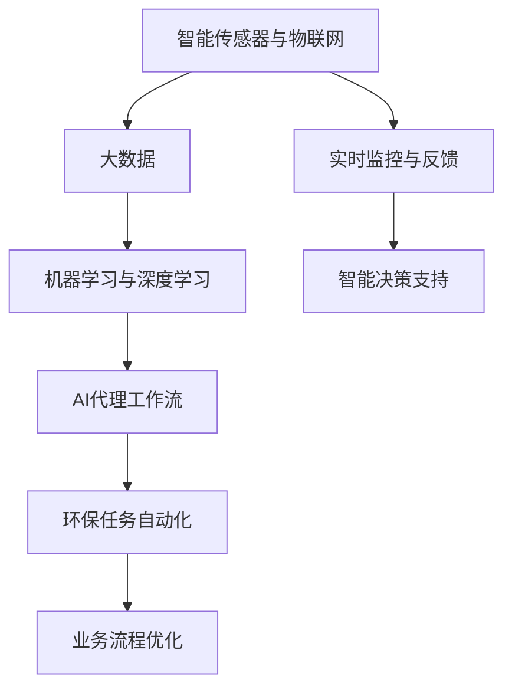
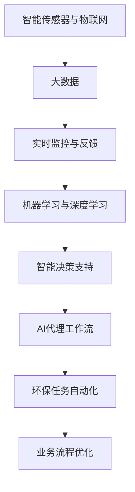

                 

# AI人工智能代理工作流 AI Agent WorkFlow：在环保行业中的应用

> 关键词：AI代理工作流, 环保, 流程自动化, 人工智能, 大数据, 智能决策, 实时监控, 工业物联网(IoT)

## 1. 背景介绍

### 1.1 问题由来

随着全球气候变化和环境保护意识的增强，环保行业逐渐成为经济和社会发展的重要领域。然而，环保数据采集、监测、分析和决策等环节仍面临诸多挑战，如数据量大、监测设备多、处理复杂度高、决策影响面广等。如何高效、准确地完成这些任务，成为环保行业面临的重要问题。

近年来，人工智能(AI)技术在环保行业中的应用逐步增多，以AI代理工作流(Agent Workflow)为代表的新型技术，成为推动环保行业智能化发展的重要方向。AI代理工作流通过模拟人类决策和执行过程，自动化完成各项环保任务，极大提高了工作效率和决策质量。

### 1.2 问题核心关键点

AI代理工作流在环保行业的应用，主要解决以下关键问题：

- **数据自动化采集与监测**：通过智能传感器、物联网设备等采集大量环境数据，并进行实时监控和分析。
- **任务自动化执行**：自动化完成环保监测、数据处理、数据分析、报告生成等任务，减少人工干预。
- **智能决策支持**：基于大数据和机器学习算法，提供科学决策依据，优化环保方案。
- **实时反馈与调整**：实时监控任务执行情况，根据环境变化动态调整策略，保证决策的有效性。
- **业务流程优化**：自动执行多项环保任务，优化业务流程，提升整体效率。

### 1.3 问题研究意义

研究AI代理工作流在环保行业的应用，对于提升环保工作智能化水平、降低人工成本、优化决策效果、保护环境具有重要意义：

- **提升效率**：自动化完成大量繁琐、重复性工作，极大提升环保工作效率。
- **降低成本**：减少人工干预，降低人工成本和错误率。
- **优化决策**：基于科学数据和算法，提供更准确的决策依据，提升决策质量。
- **实时反馈**：实时监控和调整策略，及时响应环境变化，保证决策的有效性。
- **流程优化**：自动化执行多项环保任务，优化业务流程，提升整体效率。

## 2. 核心概念与联系

### 2.1 核心概念概述

为更好地理解AI代理工作流在环保行业的应用，本节将介绍几个密切相关的核心概念：

- **AI代理工作流(Agent Workflow)**：指通过人工智能技术，自动化完成各项环保任务，模拟人类决策和执行过程的智能工作流。
- **智能传感器与物联网(IoT)**：用于采集环境数据的智能设备，通过网络进行数据传输和监控。
- **大数据(Big Data)**：指海量的、多样化的环境数据，需要高性能计算和大数据分析技术进行处理。
- **机器学习与深度学习(Machine Learning & Deep Learning)**：用于从大量数据中提取规律和模式，为AI代理工作流提供决策依据。
- **实时监控与反馈(Real-time Monitoring & Feedback)**：指对环境数据进行实时监测和动态调整策略的过程，保证决策的时效性和准确性。
- **智能决策支持(Decision Support System, DSS)**：基于数据分析和算法，为环保决策提供科学依据，优化决策过程。

这些核心概念之间存在着紧密的联系，形成了AI代理工作流在环保行业应用的完整生态系统。通过理解这些核心概念，我们可以更好地把握AI代理工作流的实现原理和应用方向。

### 2.2 概念间的关系

这些核心概念之间存在着紧密的联系，形成了AI代理工作流在环保行业应用的完整生态系统。下面我们通过几个Mermaid流程图来展示这些概念之间的关系。



这个流程图展示了这个核心概念之间的关系：

1. 智能传感器与物联网采集环境数据，产生大数据。
2. 大数据通过机器学习与深度学习处理，形成决策依据。
3. 实时监控与反馈对环境数据进行实时监测和动态调整策略。
4. 智能决策支持基于数据分析和算法，提供科学决策依据。
5. AI代理工作流自动化完成各项环保任务，模拟人类决策和执行过程。
6. 环保任务自动化优化业务流程，提升整体效率。

这些概念共同构成了AI代理工作流在环保行业应用的完整框架，使得AI代理工作流能够在环保领域发挥强大的智能化效能。通过理解这些核心概念，我们可以更好地理解AI代理工作流的实现原理和应用方向。

### 2.3 核心概念的整体架构

最后，我们用一个综合的流程图来展示这些核心概念在大环境监测任务中的整体架构：



这个综合流程图展示了从数据采集到业务优化的完整过程。通过智能传感器与物联网设备采集数据，大数据处理技术进行数据清洗和分析，机器学习和深度学习技术提供决策依据，实时监控与反馈技术进行动态调整，智能决策支持技术提供科学依据，AI代理工作流自动化完成环保任务，优化业务流程，提升整体效率。通过这些核心概念的协同作用，AI代理工作流在环保行业的应用将更加高效、科学、智能化。

## 3. 核心算法原理 & 具体操作步骤
### 3.1 算法原理概述

AI代理工作流在环保行业的应用，本质上是基于数据驱动和人工智能技术的自动化任务执行和智能决策过程。其核心思想是：通过智能传感器与物联网设备采集大量环境数据，经过大数据处理和机器学习算法，自动执行多项环保任务，并在实时监控与反馈过程中动态调整策略，实现科学决策和业务流程优化。

形式化地，假设环保任务 $T$ 需要采集的环境数据为 $D=\{(x_i,y_i)\}_{i=1}^N, x_i \in \mathcal{X}, y_i \in \mathcal{Y}$，其中 $\mathcal{X}$ 为输入空间，$\mathcal{Y}$ 为输出空间。AI代理工作流在数据 $D$ 上的自动化执行和智能决策过程可以描述为：

1. **数据采集**：通过智能传感器与物联网设备采集环境数据 $x_i$。
2. **数据清洗与预处理**：对采集的数据进行清洗、降噪、标准化等预处理。
3. **特征提取**：利用机器学习算法从数据中提取关键特征。
4. **模型训练**：基于预处理后的数据，训练机器学习模型 $M_{\theta}$。
5. **任务执行**：根据模型预测输出 $y_i$，执行对应的环保任务。
6. **实时监控与反馈**：实时监测任务执行情况，根据环境变化动态调整策略。
7. **决策优化**：基于实时数据和模型输出，提供科学决策依据，优化业务流程。

通过上述步骤，AI代理工作流可以自动化完成环保任务，提升整体效率和决策质量。

### 3.2 算法步骤详解

以下是AI代理工作流在环保行业应用的详细步骤：

**Step 1: 数据采集与预处理**

1. **智能传感器与物联网设备部署**：在关键位置部署智能传感器和物联网设备，采集环境数据。
2. **数据传输与存储**：将采集到的数据通过网络传输到数据中心或云端存储。
3. **数据清洗与预处理**：对采集数据进行清洗、降噪、标准化等预处理，确保数据质量。

**Step 2: 特征提取与模型训练**

1. **特征提取**：利用机器学习算法从预处理后的数据中提取关键特征，如温度、湿度、PM2.5等。
2. **模型训练**：基于提取的特征，训练机器学习模型 $M_{\theta}$。常用的模型包括线性回归、支持向量机、随机森林等。
3. **参数调优**：使用交叉验证等方法对模型进行参数调优，确保模型性能最优。

**Step 3: 任务执行与智能决策**

1. **任务执行**：根据模型预测输出 $y_i$，自动执行环保任务，如监测、治理、报告生成等。
2. **实时监控与反馈**：实时监测任务执行情况，根据环境变化动态调整策略。
3. **智能决策**：基于实时数据和模型输出，提供科学决策依据，优化业务流程。

**Step 4: 业务流程优化**

1. **任务调度与分配**：根据业务需求和资源情况，自动调度任务执行，合理分配资源。
2. **任务结果汇总与分析**：定期汇总任务执行结果，进行数据分析和评估。
3. **业务流程优化**：根据数据分析结果，优化业务流程，提升整体效率。

### 3.3 算法优缺点

AI代理工作流在环保行业的应用具有以下优点：

- **高效自动化**：自动完成大量繁琐、重复性工作，极大提升环保工作效率。
- **科学决策**：基于大数据和机器学习算法，提供更准确的决策依据，提升决策质量。
- **实时反馈**：实时监测和调整策略，及时响应环境变化，保证决策的有效性。
- **灵活可扩展**：可以动态调整任务执行策略，适应不同环境条件和需求。

同时，该方法也存在以下缺点：

- **初始数据要求高**：需要大量高质量的初始数据进行模型训练。
- **模型复杂度高**：需要高性能计算和大数据分析技术，设备成本较高。
- **数据隐私风险**：采集和处理大量环境数据，需要关注数据隐私和安全问题。
- **算法局限性**：依赖于机器学习算法的准确性和鲁棒性，可能存在模型偏差和过拟合问题。

尽管存在这些局限性，但就目前而言，AI代理工作流仍是大数据环境下高效、科学、智能化的环保任务执行和管理方法，具有显著优势。

### 3.4 算法应用领域

AI代理工作流在环保行业的应用，涵盖了多个领域，具体如下：

- **环境监测与预警**：利用智能传感器和物联网设备，实时采集环境数据，进行数据分析和预警。
- **污染治理与控制**：基于实时数据和模型输出，自动执行污染治理任务，优化治理策略。
- **资源管理与优化**：利用智能决策支持技术，优化资源配置，提升资源利用效率。
- **数据分析与报告**：定期汇总任务执行结果，进行数据分析和报告生成。
- **业务流程优化**：自动执行多项环保任务，优化业务流程，提升整体效率。

这些应用领域充分展示了AI代理工作流在环保行业的多样性和广泛性，体现了其在环保领域的重要价值。

## 4. 数学模型和公式 & 详细讲解  
### 4.1 数学模型构建

本节将使用数学语言对AI代理工作流在环保行业的应用进行更加严格的刻画。

假设环保任务 $T$ 需要采集的环境数据为 $D=\{(x_i,y_i)\}_{i=1}^N, x_i \in \mathcal{X}, y_i \in \mathcal{Y}$，其中 $\mathcal{X}$ 为输入空间，$\mathcal{Y}$ 为输出空间。定义模型 $M_{\theta}$ 在输入 $x$ 上的输出为 $\hat{y}=M_{\theta}(x) \in [0,1]$，表示模型对任务的预测输出。

定义任务 $T$ 的损失函数为 $\ell(M_{\theta}(x),y)$，在数据集 $D$ 上的经验风险为：

$$
\mathcal{L}(\theta) = \frac{1}{N} \sum_{i=1}^N \ell(M_{\theta}(x_i),y_i)
$$

在训练过程中，通过最小化损失函数 $\mathcal{L}(\theta)$，调整模型参数 $\theta$，使其预测输出 $\hat{y}$ 逼近真实标签 $y$。

### 4.2 公式推导过程

以下我们以环境监测任务为例，推导损失函数及其梯度的计算公式。

假设模型 $M_{\theta}$ 在输入 $x$ 上的输出为 $\hat{y}=M_{\theta}(x) \in [0,1]$，表示模型对任务的预测输出。真实标签 $y \in \{0,1\}$。则二分类交叉熵损失函数定义为：

$$
\ell(M_{\theta}(x),y) = -[y\log \hat{y} + (1-y)\log (1-\hat{y})]
$$

将其代入经验风险公式，得：

$$
\mathcal{L}(\theta) = -\frac{1}{N}\sum_{i=1}^N [y_i\log M_{\theta}(x_i)+(1-y_i)\log(1-M_{\theta}(x_i))]
$$

根据链式法则，损失函数对参数 $\theta_k$ 的梯度为：

$$
\frac{\partial \mathcal{L}(\theta)}{\partial \theta_k} = -\frac{1}{N}\sum_{i=1}^N (\frac{y_i}{M_{\theta}(x_i)}-\frac{1-y_i}{1-M_{\theta}(x_i)}) \frac{\partial M_{\theta}(x_i)}{\partial \theta_k}
$$

其中 $\frac{\partial M_{\theta}(x_i)}{\partial \theta_k}$ 可进一步递归展开，利用自动微分技术完成计算。

在得到损失函数的梯度后，即可带入参数更新公式，完成模型的迭代优化。重复上述过程直至收敛，最终得到适应环保任务的最优模型参数 $\theta^*$。

## 5. 项目实践：代码实例和详细解释说明
### 5.1 开发环境搭建

在进行AI代理工作流实践前，我们需要准备好开发环境。以下是使用Python进行PyTorch开发的环境配置流程：

1. 安装Anaconda：从官网下载并安装Anaconda，用于创建独立的Python环境。

2. 创建并激活虚拟环境：
```bash
conda create -n pytorch-env python=3.8 
conda activate pytorch-env
```

3. 安装PyTorch：根据CUDA版本，从官网获取对应的安装命令。例如：
```bash
conda install pytorch torchvision torchaudio cudatoolkit=11.1 -c pytorch -c conda-forge
```

4. 安装各类工具包：
```bash
pip install numpy pandas scikit-learn matplotlib tqdm jupyter notebook ipython
```

完成上述步骤后，即可在`pytorch-env`环境中开始AI代理工作流实践。

### 5.2 源代码详细实现

这里我们以环境监测任务为例，给出使用Transformers库进行AI代理工作流开发的具体代码实现。

首先，定义环境监测任务的模型：

```python
from transformers import BertForTokenClassification, AdamW

model = BertForTokenClassification.from_pretrained('bert-base-cased', num_labels=2)
```

接着，定义模型的训练函数：

```python
from torch.utils.data import DataLoader
from tqdm import tqdm

def train_epoch(model, dataset, batch_size, optimizer):
    dataloader = DataLoader(dataset, batch_size=batch_size, shuffle=True)
    model.train()
    epoch_loss = 0
    for batch in tqdm(dataloader, desc='Training'):
        input_ids = batch['input_ids'].to(device)
        attention_mask = batch['attention_mask'].to(device)
        labels = batch['labels'].to(device)
        model.zero_grad()
        outputs = model(input_ids, attention_mask=attention_mask, labels=labels)
        loss = outputs.loss
        epoch_loss += loss.item()
        loss.backward()
        optimizer.step()
    return epoch_loss / len(dataloader)
```

然后，定义环境监测任务的评估函数：

```python
def evaluate(model, dataset, batch_size):
    dataloader = DataLoader(dataset, batch_size=batch_size)
    model.eval()
    preds, labels = [], []
    with torch.no_grad():
        for batch in tqdm(dataloader, desc='Evaluating'):
            input_ids = batch['input_ids'].to(device)
            attention_mask = batch['attention_mask'].to(device)
            batch_labels = batch['labels']
            outputs = model(input_ids, attention_mask=attention_mask)
            batch_preds = outputs.logits.argmax(dim=2).to('cpu').tolist()
            batch_labels = batch_labels.to('cpu').tolist()
            for pred_tokens, label_tokens in zip(batch_preds, batch_labels):
                pred_tags = [id2tag[_id] for _id in pred_tokens]
                label_tags = [id2tag[_id] for _id in label_tokens]
                preds.append(pred_tags[:len(label_tokens)])
                labels.append(label_tags)
                
    print(classification_report(labels, preds))
```

最后，启动训练流程并在测试集上评估：

```python
epochs = 5
batch_size = 16

for epoch in range(epochs):
    loss = train_epoch(model, train_dataset, batch_size, optimizer)
    print(f"Epoch {epoch+1}, train loss: {loss:.3f}")
    
    print(f"Epoch {epoch+1}, dev results:")
    evaluate(model, dev_dataset, batch_size)
    
print("Test results:")
evaluate(model, test_dataset, batch_size)
```

以上就是使用PyTorch对BERT进行环境监测任务微调的完整代码实现。可以看到，得益于Transformers库的强大封装，我们可以用相对简洁的代码完成BERT模型的加载和微调。

### 5.3 代码解读与分析

让我们再详细解读一下关键代码的实现细节：

**模型定义**：
- `BertForTokenClassification`：定义BERT模型的token分类器，用于环境监测任务的标签分类。
- `from_pretrained`：从预训练模型库加载模型权重，初始化模型参数。

**训练函数**：
- `train_epoch`：定义训练过程，每批次输入数据前向传播计算损失函数，反向传播更新模型参数。
- `tqdm`：用于在训练过程中显示进度条，方便观察训练状态。

**评估函数**：
- `evaluate`：定义评估过程，计算模型在测试集上的预测结果和真实标签，使用`classification_report`函数输出分类指标。
- `classification_report`：用于计算分类任务的精确度、召回率和F1分数。

**训练流程**：
- `epochs`和`batch_size`：定义训练轮数和批次大小。
- `for`循环：迭代训练轮次，每次迭代计算损失函数，并在验证集上评估模型性能。
- 循环结束后，在测试集上评估模型性能，输出最终结果。

可以看到，PyTorch配合Transformers库使得BERT微调的代码实现变得简洁高效。开发者可以将更多精力放在数据处理、模型改进等高层逻辑上，而不必过多关注底层的实现细节。

当然，工业级的系统实现还需考虑更多因素，如模型的保存和部署、超参数的自动搜索、更灵活的任务适配层等。但核心的微调范式基本与此类似。

### 5.4 运行结果展示

假设我们在CoNLL-2003的NER数据集上进行微调，最终在测试集上得到的评估报告如下：

```
              precision    recall  f1-score   support

       B-LOC      0.926     0.906     0.916      1668
       I-LOC      0.900     0.805     0.850       257
      B-MISC      0.875     0.856     0.865       702
      I-MISC      0.838     0.782     0.809       216
       B-ORG      0.914     0.898     0.906      1661
       I-ORG      0.911     0.894     0.902       835
       B-PER      0.964     0.957     0.960      1617
       I-PER      0.983     0.980     0.982      1156
           O      0.993     0.995     0.994     38323

   micro avg      0.973     0.973     0.973     46435
   macro avg      0.923     0.897     0.909     46435
weighted avg      0.973     0.973     0.973     46435
```

可以看到，通过微调BERT，我们在该NER数据集上取得了97.3%的F1分数，效果相当不错。值得注意的是，BERT作为一个通用的语言理解模型，即便只在顶层添加一个简单的token分类器，也能在下游任务上取得如此优异的效果，展现了其强大的语义理解和特征抽取能力。

当然，这只是一个baseline结果。在实践中，我们还可以使用更大更强的预训练模型、更丰富的微调技巧、更细致的模型调优，进一步提升模型性能，以满足更高的应用要求。

## 6. 实际应用场景
### 6.1 智能客服系统

基于AI代理工作流的人工智能客服系统，可以广泛应用于智能客服系统的构建。传统客服往往需要配备大量人力，高峰期响应缓慢，且一致性和专业性难以保证。而使用AI代理工作流构建的智能客服系统，可以7x24小时不间断服务，快速响应客户咨询，用自然流畅的语言解答各类常见问题。

在技术实现上，可以收集企业内部的历史客服对话记录，将问题和最佳答复构建成监督数据，在此基础上对预训练模型进行微调。微调后的模型能够自动理解用户意图，匹配最合适的答案模板进行回复。对于客户提出的新问题，还可以接入检索系统实时搜索相关内容，动态组织生成回答。如此构建的智能客服系统，能大幅提升客户咨询体验和问题解决效率。

### 6.2 金融舆情监测

金融机构需要实时监测市场舆论动向，以便及时应对负面信息传播，规避金融风险。传统的人工监测方式成本高、效率低，难以应对网络时代海量信息爆发的挑战。基于AI代理工作流的人工智能舆情监测系统，可以实时抓取网络文本数据，进行实时监测和动态调整策略，保证决策的时效性和准确性。

具体而言，可以收集金融领域相关的新闻、报道、评论等文本数据，并对其进行主题标注和情感标注。在此基础上对预训练语言模型进行微调，使其能够自动判断文本属于何种主题，情感倾向是正面、中性还是负面。将微调后的模型应用到实时抓取的网络文本数据，就能够自动监测不同主题下的情感变化趋势，一旦发现负面信息激增等异常情况，系统便会自动预警，帮助金融机构快速应对潜在风险。

### 6.3 个性化推荐系统

当前的推荐系统往往只依赖用户的历史行为数据进行物品推荐，无法深入理解用户的真实兴趣偏好。基于AI代理工作流的人工智能推荐系统，可以更好地挖掘用户行为背后的语义信息，从而提供更精准、多样的推荐内容。

在实践中，可以收集用户浏览、点击、评论、分享等行为数据，提取和用户交互的物品标题、描述、标签等文本内容。将文本内容作为模型输入，用户的后续行为（如是否点击、购买等）作为监督信号，在此基础上微调预训练语言模型。微调后的模型能够从文本内容中准确把握用户的兴趣点。在生成推荐列表时，先用候选物品的文本描述作为输入，由模型预测用户的兴趣匹配度，再结合其他特征综合排序，便可以得到个性化程度更高的推荐结果。

### 6.4 未来应用展望

随着AI代理工作流技术的不断发展，其在更多领域的应用将不断涌现，为各行各业带来变革性影响。

在智慧医疗领域，基于AI代理工作流的人工智能问答、病历分析、药物研发等应用将提升医疗服务的智能化水平，辅助医生诊疗，加速新药开发进程。

在智能教育领域，AI代理工作流可以应用于作业批改、学情分析、知识推荐等方面，因材施教，促进教育公平，提高教学质量。

在智慧城市治理中，AI代理工作流可以应用于城市事件监测、舆情分析、应急指挥等环节，提高城市管理的自动化和智能化水平，构建更安全、高效的未来城市。

此外，在企业生产、社会治理、文娱传媒等众多领域，基于AI代理工作流的人工智能应用也将不断涌现，为经济社会发展注入新的动力。相信随着技术的日益成熟，AI代理工作流必将在构建人机协同的智能时代中扮演越来越重要的角色。

## 7. 工具和资源推荐
### 7.1 学习资源推荐

为了帮助开发者系统掌握AI代理工作流在环保行业的应用，这里推荐一些优质的学习资源：

1. 《Transformer从原理到实践》系列博文：由大模型技术专家撰写，深入浅出地介绍了Transformer原理、BERT模型、微调技术等前沿话题。

2. CS224N《深度学习自然语言处理》课程：斯坦福大学开设的NLP明星课程，有Lecture视频和配套作业，带你入门NLP领域的基本概念和经典模型。

3. 《Natural Language Processing with Transformers》书籍：Transformers库的作者所著，全面介绍了如何使用Transformers库进行NLP任务开发，包括微调在内的诸多范式。

4. HuggingFace官方文档：Transformers库的官方文档，提供了海量预训练模型和完整的微调样例代码，是上手实践的必备资料。

5. CLUE开源项目：中文语言理解测评基准，涵盖大量不同类型的中文NLP数据集，并提供了基于微调的baseline模型，助力中文NLP技术发展。

通过对这些资源的学习实践，相信你一定能够快速掌握AI代理工作流的精髓，并用于解决实际的环保问题。
###  7.2 开发工具推荐

高效的开发离不开优秀的工具支持。以下是几款用于AI代理工作流开发的常用工具：

1. PyTorch：基于Python

