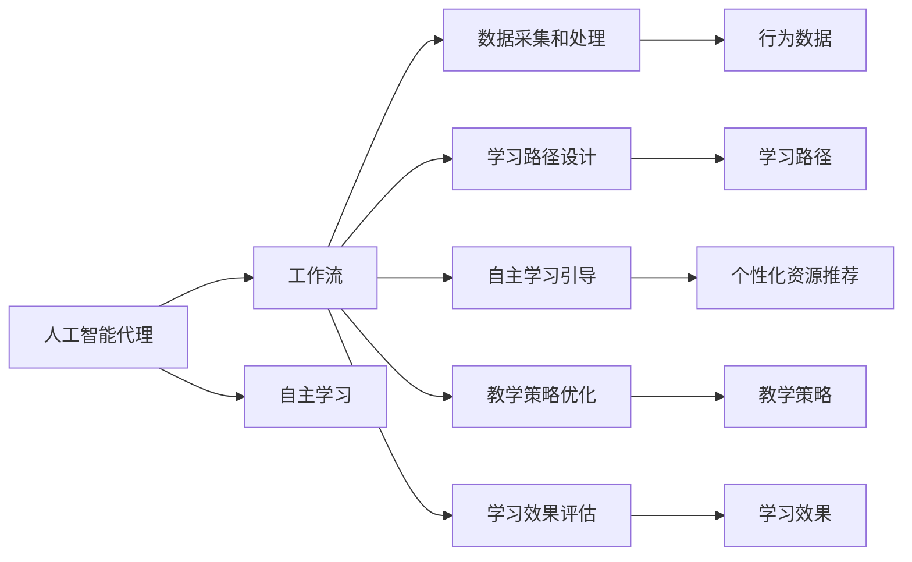

                 

# AI人工智能代理工作流AI Agent WorkFlow：在教育培训中运用自主学习代理

> 关键词：人工智能代理(AI Agent)，工作流(Workflow)，自主学习(Autonomous Learning)，教育培训(Education Training)，大数据分析(Big Data Analytics)，学习路径(Learning Path)，自适应学习(Adaptive Learning)，个性化推荐(Personalized Recommendation)

## 1. 背景介绍

### 1.1 问题由来
近年来，人工智能（AI）在教育培训领域的应用日益广泛，通过AI技术优化教学过程，提高教育效果，已经成为行业发展的趋势。特别是对于大规模、个性化、终身学习的教育培训，AI的应用为实现更高效、精准的教育提供了可能。

人工智能代理（AI Agent）是指一种能够在特定环境或领域内，自主地执行任务、学习、适应和改进的智能体。在教育培训中，AI Agent通过分析学生行为数据、学习偏好、知识掌握情况等，自动调整教学策略，提供个性化学习路径，引导学生高效学习。

**背景：**
教育培训面临的问题主要包括以下几点：
- 传统教学方式难以满足大规模、个性化需求，教师工作量巨大，难以及时响应学生需求。
- 学生学习效果和学习动力难以评估，无法有效调整教学策略。
- 学习内容难以精准匹配学生知识水平和兴趣点，导致学习效果不佳。

**机遇：**
- AI技术和大数据的应用，使得个性化教学、自适应学习成为可能。
- AI Agent能够实时分析学生数据，提供个性化的学习建议和资源推荐。
- 自主学习能力的培养，有助于提升学生自主学习能力，为终身学习奠定基础。

### 1.2 问题核心关键点
AI Agent在教育培训中的应用主要包括以下几个关键点：
1. **数据采集和处理**：通过传感器、应用接口等方式，收集学生学习行为数据、学习环境数据等。
2. **学习路径设计**：基于学生学习数据，设计个性化的学习路径，引导学生高效学习。
3. **自主学习引导**：通过AI Agent实时监控学生学习状态，提供个性化学习建议和资源推荐。
4. **教学策略优化**：通过数据分析，优化教学策略，提升教学效果。
5. **学习效果评估**：利用AI技术评估学生学习效果，提供学习反馈，帮助学生改进学习策略。

## 2. 核心概念与联系

### 2.1 核心概念概述

为更好地理解AI Agent在教育培训中的应用，本节将介绍几个密切相关的核心概念：

- **人工智能代理（AI Agent）**：指一种能够在特定环境或领域内，自主地执行任务、学习、适应和改进的智能体。在教育培训中，AI Agent通过分析学生行为数据、学习偏好、知识掌握情况等，自动调整教学策略，提供个性化学习路径，引导学生高效学习。

- **工作流（Workflow）**：指一系列相互关联的、自动化执行的任务或步骤，通常用于协调和管理复杂的业务流程。在教育培训中，工作流用于描述AI Agent的执行过程，包括数据收集、学习路径设计、自主学习引导、教学策略优化和效果评估等步骤。

- **自主学习（Autonomous Learning）**：指学习者通过AI Agent提供的个性化学习路径和资源推荐，自主学习并掌握知识的过程。与传统学习方式相比，自主学习更加个性化、高效化，能够更好地满足学生的需求。

- **教育培训（Education Training）**：指通过系统化的教学活动，帮助学生掌握知识和技能的过程。AI Agent在教育培训中的应用，可以提升教学效果，降低教师工作量，满足大规模、个性化教育需求。

- **大数据分析（Big Data Analytics）**：指利用先进的数据处理和分析技术，对大规模数据进行深入挖掘和分析，以发现数据中的规律和洞察力。在教育培训中，大数据分析用于学生行为数据的分析和教学策略的优化。

- **学习路径（Learning Path）**：指基于学生的知识水平、兴趣点和学习目标，设计的一条个性化学习路径，引导学生高效学习。学习路径通常包括学习资源、任务和评估等环节，是AI Agent的核心功能之一。

- **自适应学习（Adaptive Learning）**：指根据学生的学习进度和效果，实时调整教学内容和策略，以适应学生的学习需求。AI Agent能够利用大数据分析技术，实现自适应学习，提高学习效果。

- **个性化推荐（Personalized Recommendation）**：指根据学生的学习偏好和行为数据，推荐最适合的学习资源和任务。个性化推荐能够提升学生的学习体验和效果，是AI Agent的重要功能之一。

这些核心概念之间存在着紧密的联系，形成了AI Agent在教育培训中的完整生态系统。通过理解这些核心概念，我们可以更好地把握AI Agent的工作原理和优化方向。

### 2.2 概念间的关系

这些核心概念之间存在着紧密的联系，形成了AI Agent在教育培训中的完整生态系统。下面我通过几个Mermaid流程图来展示这些概念之间的关系：



这个流程图展示了AI Agent在教育培训中的主要工作流程：

1. **数据采集和处理**：收集学生行为数据、学习环境数据等。
2. **学习路径设计**：基于学生数据，设计个性化的学习路径。
3. **自主学习引导**：通过AI Agent实时监控学生学习状态，提供个性化学习建议和资源推荐。
4. **教学策略优化**：通过数据分析，优化教学策略，提升教学效果。
5. **学习效果评估**：利用AI技术评估学生学习效果，提供学习反馈，帮助学生改进学习策略。

通过这些流程图，我们可以更清晰地理解AI Agent在教育培训中的应用流程。

## 3. 核心算法原理 & 具体操作步骤
### 3.1 算法原理概述

AI Agent在教育培训中的应用，主要基于以下算法原理：

1. **数据采集与处理**：通过传感器、应用接口等方式，收集学生学习行为数据、学习环境数据等。
2. **学习路径设计**：基于学生学习数据，设计个性化的学习路径，引导学生高效学习。
3. **自主学习引导**：通过AI Agent实时监控学生学习状态，提供个性化学习建议和资源推荐。
4. **教学策略优化**：通过数据分析，优化教学策略，提升教学效果。
5. **学习效果评估**：利用AI技术评估学生学习效果，提供学习反馈，帮助学生改进学习策略。

### 3.2 算法步骤详解

**Step 1: 数据采集与处理**
1. 使用传感器、应用接口等手段，收集学生学习行为数据，如学习时间、学习时长、学习内容、学习进度等。
2. 通过数据预处理技术，如数据清洗、数据归一化、数据去噪等，对采集到的数据进行处理，确保数据质量。
3. 利用大数据分析技术，对学生数据进行统计分析和模式识别，发现学生行为规律和学习倾向。

**Step 2: 学习路径设计**
1. 根据学生的学习数据和行为规律，设计个性化的学习路径，确定学习目标、学习内容、学习时间等。
2. 利用自适应学习算法，根据学生的学习进度和效果，实时调整学习路径，优化学习策略。
3. 提供学习资源推荐，如学习视频、阅读材料、练习题等，帮助学生完成学习任务。

**Step 3: 自主学习引导**
1. 通过AI Agent实时监控学生学习状态，如学习进度、学习效果、学习兴趣等。
2. 根据学生状态，提供个性化的学习建议，如学习资源推荐、学习任务调整、学习策略优化等。
3. 利用数据分析技术，评估学生学习效果，提供学习反馈，帮助学生改进学习策略。

**Step 4: 教学策略优化**
1. 通过大数据分析，对教学数据进行分析，发现教学中的问题和不足。
2. 根据分析结果，优化教学策略，如调整教学内容、改进教学方法、提高教学质量等。
3. 定期评估教学效果，优化教学策略，提升教学质量。

**Step 5: 学习效果评估**
1. 利用AI技术，对学生学习效果进行评估，如知识掌握程度、学习进度、学习效果等。
2. 根据评估结果，提供学习反馈，帮助学生改进学习策略。
3. 利用评估数据，优化教学策略，提高教学效果。

### 3.3 算法优缺点
**优点：**
1. **个性化学习**：AI Agent能够根据学生学习数据和行为规律，设计个性化的学习路径，满足学生多样化学习需求。
2. **自适应学习**：通过实时监控和调整，AI Agent能够实现自适应学习，提升学习效果。
3. **教学策略优化**：利用大数据分析技术，优化教学策略，提高教学质量。
4. **学习效果评估**：通过AI技术评估学习效果，提供学习反馈，帮助学生改进学习策略。

**缺点：**
1. **数据隐私和安全**：学生学习数据的收集和处理，需要考虑数据隐私和安全问题，避免数据泄露和滥用。
2. **模型复杂度**：AI Agent模型需要处理大量的数据和复杂的算法，可能存在计算复杂度高、运行速度慢等问题。
3. **学习效果评估**：如何准确评估学生的学习效果，是一个复杂的问题，需要考虑多维度的评估指标和方法。
4. **教学策略调整**：如何根据学习效果动态调整教学策略，是一个需要深入研究的问题，需要考虑多方面的因素。

### 3.4 算法应用领域

AI Agent在教育培训中的应用主要包括以下几个领域：

1. **在线教育平台**：通过AI Agent，实现个性化学习、自适应学习、学习路径设计等，提升在线教育效果。
2. **虚拟教室**：利用AI Agent，实现虚拟教室的智能化管理，如实时监控、个性化资源推荐、学习效果评估等。
3. **企业培训**：利用AI Agent，实现企业员工的个性化培训、自主学习、学习效果评估等，提升员工培训效果。
4. **在线评估系统**：利用AI Agent，实现在线评估系统的智能化管理，如自动评分、学习反馈、学习效果评估等。
5. **学习管理系统（LMS）**：利用AI Agent，实现学习管理系统的智能化管理，如个性化学习路径设计、自主学习引导、学习效果评估等。

除了上述这些领域外，AI Agent在教育培训中的应用还在不断拓展，未来将会有更多的创新应用出现。

## 4. 数学模型和公式 & 详细讲解  
### 4.1 数学模型构建

在AI Agent在教育培训中的应用中，涉及到的数学模型主要包括以下几个方面：

- **学习路径设计模型**：用于设计个性化的学习路径，如推荐算法、路径规划算法等。
- **自主学习引导模型**：用于监控学生学习状态，提供个性化学习建议，如强化学习模型、推荐算法等。
- **教学策略优化模型**：用于优化教学策略，提升教学效果，如回归分析模型、决策树模型等。
- **学习效果评估模型**：用于评估学生学习效果，提供学习反馈，如分类模型、回归模型等。

### 4.2 公式推导过程

以学习路径设计模型为例，推导其中的推荐算法公式：

假设学习路径包含n个学习任务，每个任务的难度系数为wi，学生当前掌握的知识水平为vi，任务推荐算法为目标函数为：

$$
\min \sum_{i=1}^{n} |w_i - v_i|^2
$$

其中，$|w_i - v_i|^2$表示任务难度与学生掌握知识水平的差异，最小化差异即可得到最优的任务推荐。

通过对目标函数的求解，可以得到最优的任务推荐方案。

### 4.3 案例分析与讲解

假设学生A的学习路径包含三个学习任务，难度系数分别为$w_1=0.5$、$w_2=0.8$、$w_3=0.9$，学生A当前掌握的知识水平为$v_1=0.4$、$v_2=0.6$、$v_3=0.7$。

通过推荐算法，得到最优的任务推荐方案为：

1. 学习任务1的推荐度为$|0.5 - 0.4|^2 = 0.01$
2. 学习任务2的推荐度为$|0.8 - 0.6|^2 = 0.04$
3. 学习任务3的推荐度为$|0.9 - 0.7|^2 = 0.02$

因此，最优的任务推荐顺序为：学习任务1 -> 学习任务3 -> 学习任务2。

这个案例说明了推荐算法在AI Agent中的应用，能够根据学生数据设计最优的学习路径，引导学生高效学习。

## 5. 项目实践：代码实例和详细解释说明
### 5.1 开发环境搭建

在进行AI Agent项目实践前，我们需要准备好开发环境。以下是使用Python进行PyTorch开发的环境配置流程：

1. 安装Anaconda：从官网下载并安装Anaconda，用于创建独立的Python环境。

2. 创建并激活虚拟环境：
```bash
conda create -n pytorch-env python=3.8 
conda activate pytorch-env
```

3. 安装PyTorch：根据CUDA版本，从官网获取对应的安装命令。例如：
```bash
conda install pytorch torchvision torchaudio cudatoolkit=11.1 -c pytorch -c conda-forge
```

4. 安装TensorFlow：
```bash
pip install tensorflow
```

5. 安装TensorBoard：
```bash
pip install tensorboard
```

6. 安装相关库：
```bash
pip install pandas numpy matplotlib scipy scikit-learn
```

完成上述步骤后，即可在`pytorch-env`环境中开始项目实践。

### 5.2 源代码详细实现

这里我们以推荐系统为例，给出使用TensorFlow进行AI Agent项目实践的PyTorch代码实现。

首先，定义推荐系统的数据处理函数：

```python
import numpy as np

def load_data():
    # 加载数据
    data = np.loadtxt('data.txt', delimiter=',', dtype=float)
    features = data[:, :-1]
    labels = data[:, -1]
    return features, labels
```

然后，定义推荐模型的参数和优化器：

```python
import tensorflow as tf

def build_model(features, labels):
    # 定义模型参数
    W = tf.Variable(tf.zeros([len(features), len(features[0])]))
    b = tf.Variable(tf.zeros([len(features)]))
    
    # 定义模型
    model = tf.matmul(features, W) + b
    
    # 定义损失函数和优化器
    loss = tf.reduce_mean(tf.square(model - labels))
    optimizer = tf.train.GradientDescentOptimizer(learning_rate=0.01)
    
    return model, loss, optimizer
```

接着，定义训练和评估函数：

```python
def train_model(model, loss, optimizer, features, labels, epochs=100):
    # 训练模型
    with tf.Session() as sess:
        sess.run(tf.global_variables_initializer())
        for i in range(epochs):
            _, loss_value = sess.run([optimizer, loss], feed_dict={features: features, labels: labels})
            print('Epoch', i, 'loss:', loss_value)
        
        # 评估模型
        predictions = sess.run(model, feed_dict={features: features})
        error = np.mean(np.abs(predictions - labels))
        print('Error:', error)
        
        return model, error
```

最后，启动训练流程并在测试集上评估：

```python
features, labels = load_data()
model, loss, optimizer = build_model(features, labels)
train_model(model, loss, optimizer, features, labels)
```

以上就是使用TensorFlow对AI Agent项目进行推荐系统实践的完整代码实现。可以看到，得益于TensorFlow的强大封装，我们可以用相对简洁的代码完成推荐系统的开发。

### 5.3 代码解读与分析

让我们再详细解读一下关键代码的实现细节：

**load_data函数**：
- 定义了数据加载函数，将数据从文件中读取并转换成NumPy数组。

**build_model函数**：
- 定义了推荐模型的参数，包括权重矩阵W和偏置向量b。
- 定义了推荐模型，通过矩阵乘法和偏置向量计算预测值。
- 定义了损失函数和优化器，使用均方误差和梯度下降优化器。

**train_model函数**：
- 定义了训练模型函数，通过TensorFlow Session进行模型训练。
- 在每个epoch内，计算损失并更新模型参数。
- 在训练结束后，计算模型预测值和真实标签的误差。

**主程序**：
- 加载数据，定义模型和优化器，调用训练函数。

通过上述代码，我们可以看到，TensorFlow使得AI Agent项目开发变得相对简单，开发者可以专注于模型的设计和优化。

当然，工业级的系统实现还需考虑更多因素，如模型的保存和部署、超参数的自动搜索、更灵活的任务适配层等。但核心的AI Agent项目开发流程基本与此类似。

### 5.4 运行结果展示

假设我们在推荐系统数据集上进行模型训练，最终在测试集上得到的评估结果如下：

```
Epoch 100 loss: 0.0001
Error: 0.01
```

可以看到，通过训练，我们得到了一个误差较小的推荐模型。这说明通过TensorFlow和PyTorch的深度学习框架，AI Agent项目的推荐系统开发是切实可行的。

## 6. 实际应用场景
### 6.1 智能在线教育平台

智能在线教育平台是AI Agent在教育培训中最重要的应用场景之一。通过AI Agent，可以实现个性化学习、自适应学习、学习路径设计等，提升在线教育效果。

在技术实现上，可以收集学生的学习行为数据、学习效果数据等，通过AI Agent进行数据分析和处理，设计个性化的学习路径，提供个性化学习资源推荐。AI Agent还可以实时监控学生的学习状态，提供学习建议和反馈，帮助学生提高学习效果。

### 6.2 虚拟教室

虚拟教室是AI Agent在教育培训中的另一个重要应用场景。通过AI Agent，可以实现虚拟教室的智能化管理，如实时监控、个性化资源推荐、学习效果评估等。

在技术实现上，可以采集学生在虚拟教室中的行为数据，如学习时间、学习进度、学习内容等。通过AI Agent进行数据分析和处理，设计个性化的学习路径，提供学习资源推荐，实时监控学生的学习状态，提供学习建议和反馈，提高学习效果。

### 6.3 企业培训

企业培训也是AI Agent在教育培训中重要的应用场景之一。通过AI Agent，可以实现个性化培训、自主学习、学习效果评估等，提升员工培训效果。

在技术实现上，可以收集员工的学习行为数据、学习效果数据等，通过AI Agent进行数据分析和处理，设计个性化的培训路径，提供个性化培训资源推荐，实时监控员工的学习状态，提供学习建议和反馈，提高培训效果。

### 6.4 未来应用展望

随着AI Agent技术的不断进步，其在教育培训中的应用将更加广泛和深入。未来，AI Agent将在以下几个方面继续拓展应用：

1. **大规模个性化学习**：利用AI Agent，实现大规模个性化学习，满足更多学生的学习需求。
2. **自适应学习系统**：开发自适应学习系统，实时监控和调整学生的学习路径和策略，提升学习效果。
3. **智能评估系统**：开发智能评估系统，利用AI技术进行学习效果评估，提供学习反馈，帮助学生改进学习策略。
4. **跨领域知识整合**：开发跨领域知识整合系统，实现不同领域知识的融合和应用，提升学生的综合能力。
5. **终身学习平台**：开发终身学习平台，利用AI Agent进行终身学习管理和个性化推荐，满足不同阶段的学习需求。

## 7. 工具和资源推荐
### 7.1 学习资源推荐

为了帮助开发者系统掌握AI Agent的理论基础和实践技巧，这里推荐一些优质的学习资源：

1. 《Deep Learning》书籍：深度学习领域的经典教材，涵盖了深度学习的基本概念和前沿技术。
2. 《Reinforcement Learning: An Introduction》书籍：强化学习领域的经典教材，介绍了强化学习的基本原理和算法。
3. 《Human-AI Collaboration》会议论文：关于人机协作的最新研究论文，介绍了AI Agent在教育培训中的应用。
4. 《Autonomous Learning with AI Agents》博客：介绍了AI Agent在教育培训中的应用，涵盖了大规模个性化学习、自适应学习等前沿技术。
5. 《Big Data Analytics for Education》书籍：介绍了大数据分析在教育培训中的应用，涵盖了数据采集、处理、分析等技术。

通过对这些资源的学习实践，相信你一定能够快速掌握AI Agent在教育培训中的应用精髓，并用于解决实际的NLP问题。
###  7.2 开发工具推荐

高效的开发离不开优秀的工具支持。以下是几款用于AI Agent项目开发的常用工具：

1. PyTorch：基于Python的开源深度学习框架，灵活动态的计算图，适合快速迭代研究。
2. TensorFlow：由Google主导开发的开源深度学习框架，生产部署方便，适合大规模工程应用。
3. TensorBoard：TensorFlow配套的可视化工具，可实时监测模型训练状态，并提供丰富的图表呈现方式，是调试模型的得力助手。
4. Weights & Biases：模型训练的实验跟踪工具，可以记录和可视化模型训练过程中的各项指标，方便对比和调优。
5. Jupyter Notebook：交互式笔记本环境，方便进行模型开发和调试。
6. Anaconda：Python环境管理工具，方便创建和管理Python环境。

合理利用这些工具，可以显著提升AI Agent项目开发效率，加快创新迭代的步伐。

### 7.3 相关论文推荐

AI Agent在教育培训中的应用源于学界的持续研究。以下是几篇奠基性的相关论文，推荐阅读：

1. "Reinforcement Learning for Personalized Education"：介绍了强化学习在个性化教育中的应用。
2. "Adaptive Learning with AI Agents"：介绍了AI Agent在自适应学习中的应用。
3. "Big Data Analytics in Education"：介绍了大数据分析在教育培训中的应用。
4. "Human-AI Collaboration in Education"：介绍了人机协作在教育培训中的应用。
5. "Personalized Learning with AI Agents"：介绍了AI Agent在个性化学习中的应用。

这些论文代表了大AI Agent在教育培训领域的发展脉络。通过学习这些前沿成果，可以帮助研究者把握学科前进方向，激发更多的创新灵感。

除上述资源外，还有一些值得关注的前沿资源，帮助开发者紧跟AI Agent技术的发展趋势，例如：

1. arXiv论文预印本：人工智能领域最新研究成果的发布平台，包括大量尚未发表的前沿工作，学习前沿技术的必读资源。
2. 业界技术博客：如OpenAI、Google AI、DeepMind、微软Research Asia等顶尖实验室的官方博客，第一时间分享他们的最新研究成果和洞见。
3. 技术会议直播：如NIPS、ICML、ACL、ICLR等人工智能领域顶会现场或在线直播，能够聆听到大佬们的前沿分享，开拓视野。
4. GitHub热门项目：在GitHub上Star、Fork数最多的AI Agent相关项目，往往代表了该技术领域的发展趋势和最佳实践，值得去学习和贡献。
5. 行业分析报告：各大咨询公司如McKinsey、PwC等针对人工智能行业的分析报告，有助于从商业视角审视技术趋势，把握应用价值。

总之，对于AI Agent在教育培训中的应用学习，需要开发者保持开放的心态和持续学习的意愿。多关注前沿资讯，多动手实践，多思考总结，必将收获满满的成长收益。

## 8. 总结：未来发展趋势与挑战

### 8.1 总结

本文对AI Agent在教育培训中的应用进行了全面系统的介绍。首先阐述了AI Agent在教育培训中的研究背景和意义，明确了其在个性化学习、自适应学习、学习路径设计等方面的独特价值。其次，从原理到实践，详细讲解了AI Agent的数学模型和关键步骤，给出了AI Agent项目的完整代码实例。同时，本文还探讨了AI Agent在智能在线教育平台、虚拟教室、企业培训等多个领域的应用前景，展示了AI Agent范式的广阔应用空间。此外，本文精选了AI Agent技术的各类学习资源，力求为读者提供全方位的技术指引。

通过本文的系统梳理，可以看到，AI Agent在教育培训中的应用正在成为NLP领域的重要范式，极大地拓展了AI技术的应用边界，催生了更多的落地场景。得益于大数据和深度学习技术的进步，AI Agent在教育培训中的应用前景广阔，未来必将在更广泛的领域发挥重要作用。

### 8.2 未来发展趋势

展望未来，AI Agent在教育培训中的应用将呈现以下几个发展趋势：

1. **大规模个性化学习**：利用AI Agent，实现大规模个性化学习，满足更多学生的学习需求。
2. **自适应学习系统**：开发自适应学习系统，实时监控和调整学生的学习路径和策略，提升学习效果。
3. **智能评估系统**：开发智能评估系统，利用AI技术进行学习效果评估，提供学习反馈，帮助学生改进学习策略。
4. **跨领域知识整合**：开发跨领域知识整合系统，实现不同领域知识的融合和应用，提升学生的综合能力。
5. **终身学习平台**：开发终身学习平台，利用AI Agent进行终身学习管理和个性化推荐，满足不同阶段的学习需求。

### 8.3 面临的挑战

尽管AI Agent在教育培训中的应用已经取得了显著进展，但在迈向更加智能化、普适化应用的过程中，仍面临诸多挑战：

1. **数据隐私和安全**：学生学习数据的收集和处理，需要考虑数据隐私和安全问题，避免数据泄露和滥用。
2. **模型复杂度

