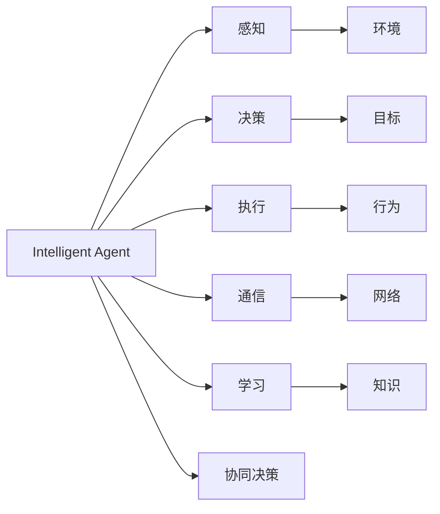
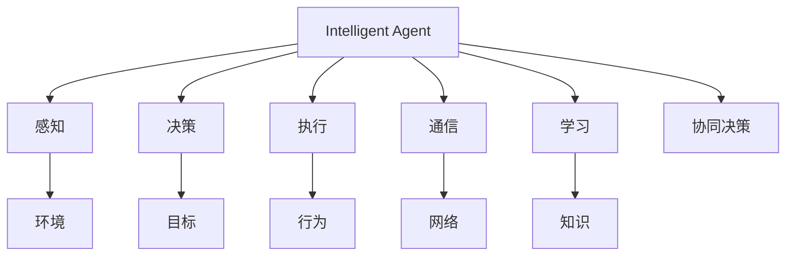
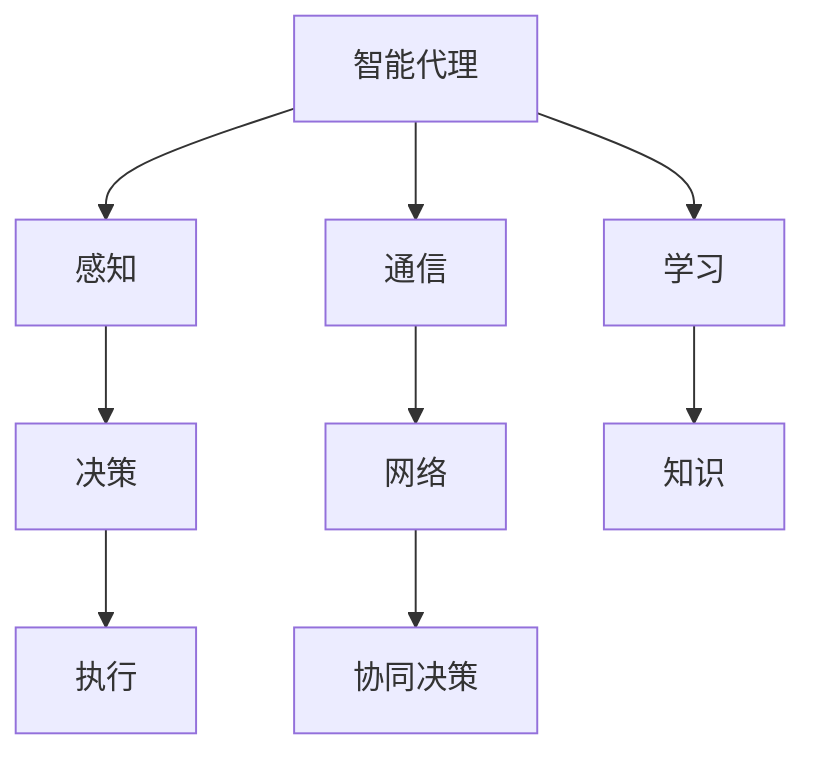

                 

# AI人工智能代理工作流AI Agent WorkFlow：智能代理在智能交通系统中的应用

## 1. 背景介绍

### 1.1 问题由来

近年来，随着智慧城市建设的发展，智能交通系统（Intelligent Transportation System, ITS）正逐步成为城市管理的重要组成部分。智能交通系统通过信息采集、传输、处理、发布等技术手段，实现交通流量监测、信号控制、路径优化、公共交通调度等各类功能，极大地提升了城市交通的智能化和精细化管理水平。

然而，现有智能交通系统大多基于集中式架构，存在数据孤岛、系统互操作性差、应急响应慢等问题，难以满足日益增长的城市交通需求。基于此，智能交通系统亟需引入新的技术手段，进一步提升系统的智能化和可扩展性。

### 1.2 问题核心关键点

针对上述问题，智能代理（Intelligent Agent）技术逐渐被引入智能交通系统，成为提升系统智能化水平的重要手段。智能代理是一种自主运行、智能决策的智能实体，通过在复杂的网络环境中进行分布式协同计算，可以实现系统的自治、自适应和自优化。

智能代理在智能交通系统中的应用，主要体现在以下几个方面：
1. 信息采集与处理：通过智能代理在各个道路节点采集交通数据，并进行本地处理和分析，减少数据传输量，提升数据处理的实时性和效率。
2. 信号控制优化：利用智能代理进行实时交通流量预测和信号控制优化，动态调整交通信号，改善交通流畅性。
3. 路径规划与推荐：智能代理根据实时交通信息，为驾驶员和公共交通提供最优路径规划和出行推荐服务，提升出行效率。
4. 公共交通调度：智能代理在公共交通系统中进行调度优化，实现车辆实时跟踪和调度，提升公共交通的准时性和可靠性。
5. 应急响应与协调：智能代理在发生交通事故、恶劣天气等紧急情况时，快速响应和协调，保障交通系统的稳定运行。

### 1.3 问题研究意义

智能代理技术的应用，对于提升智能交通系统的智能化和可扩展性，具有重要意义：

1. 提升系统自治能力：智能代理通过自主决策和执行，能够实现系统的自我管理和自我优化，提升系统的自主性和自适应性。
2. 增强系统鲁棒性：智能代理通过分布式协同计算，分散系统风险，提高系统的鲁棒性和抗干扰能力。
3. 优化系统性能：智能代理能够实现实时数据处理和决策优化，提升系统的整体性能和用户体验。
4. 降低系统成本：智能代理能够自动进行任务分配和资源管理，降低系统运维成本。
5. 促进系统创新：智能代理技术推动了新兴的研究方向，如自主运行、分布式优化、协同决策等，为智能交通系统的技术创新提供了新思路。

## 2. 核心概念与联系

### 2.1 核心概念概述

为更好地理解智能代理在智能交通系统中的应用，本节将介绍几个密切相关的核心概念：

- 智能代理（Intelligent Agent）：在复杂环境中通过自主决策和执行，实现目标的智能实体。具有感知、决策、执行、通信、学习等基本功能。
- 分布式协同计算（Distributed Cooperative Computing）：多个智能代理在分布式环境中协同工作，共同完成复杂任务。
- 自主运行（Autonomous Operation）：智能代理能够自主决策和执行，无需外部干预。
- 自适应（Adaptive）：智能代理能够根据环境变化自动调整策略和行为。
- 自优化（Optimization）：智能代理通过不断学习和优化，提升自身性能。
- 协同决策（Cooperative Decision Making）：多个智能代理通过信息共享和协调，共同做出最优决策。

这些核心概念之间存在着紧密的联系，形成了智能代理技术的完整框架。以下通过Mermaid流程图展示智能代理的基本结构和应用场景：



这个流程图展示了智能代理的基本结构和应用场景：

1. 智能代理通过感知（Perception）获取环境信息。
2. 决策（Decision）模块根据感知信息，制定最优策略。
3. 执行（Execution）模块执行决策策略，完成具体任务。
4. 通信（Communication）模块实现与其他代理的信息交互。
5. 学习（Learning）模块通过不断的经验积累，提升自身性能。
6. 协同决策（Cooperative Decision Making）模块通过信息共享和协调，共同做出最优决策。

这些核心概念共同构成了智能代理技术的理论基础，为智能代理在智能交通系统中的应用提供了指导。

### 2.2 概念间的关系

这些核心概念之间存在着紧密的联系，形成了智能代理技术的完整框架。以下通过Mermaid流程图展示智能代理的基本结构和应用场景：



这个流程图展示了智能代理的基本结构和应用场景：

1. 智能代理通过感知（Perception）获取环境信息。
2. 决策（Decision）模块根据感知信息，制定最优策略。
3. 执行（Execution）模块执行决策策略，完成具体任务。
4. 通信（Communication）模块实现与其他代理的信息交互。
5. 学习（Learning）模块通过不断的经验积累，提升自身性能。
6. 协同决策（Cooperative Decision Making）模块通过信息共享和协调，共同做出最优决策。

这些核心概念共同构成了智能代理技术的理论基础，为智能代理在智能交通系统中的应用提供了指导。

### 2.3 核心概念的整体架构

最后，我们用一个综合的流程图来展示这些核心概念在大语言模型微调过程中的整体架构：



这个综合流程图展示了智能代理的基本结构和应用场景：

1. 智能代理通过感知模块获取环境信息。
2. 决策模块根据感知信息，制定最优策略。
3. 执行模块执行决策策略，完成具体任务。
4. 通信模块实现与其他代理的信息交互。
5. 学习模块通过不断的经验积累，提升自身性能。
6. 协同决策模块通过信息共享和协调，共同做出最优决策。

这些概念共同构成了智能代理技术的理论基础，为智能代理在智能交通系统中的应用提供了指导。

## 3. 核心算法原理 & 具体操作步骤

### 3.1 算法原理概述

基于智能代理技术的智能交通系统，通过在各个道路节点部署智能代理，实现交通数据的采集、处理、分析和优化，从而提升系统的智能化和可扩展性。具体算法原理如下：

- 智能代理通过传感器和摄像头获取道路交通数据，包括车辆速度、流量、位置、车道状态等。
- 根据获取的交通数据，智能代理进行本地处理和分析，生成交通状况报告。
- 利用交通状况报告，智能代理进行实时流量预测和信号控制优化。
- 基于交通状况报告和实时预测结果，智能代理为驾驶员和公共交通提供最优路径规划和出行推荐服务。
- 智能代理在公共交通系统中进行调度优化，实现车辆实时跟踪和调度。
- 在发生交通事故、恶劣天气等紧急情况时，智能代理快速响应和协调，保障交通系统的稳定运行。

整个系统通过智能代理的分布式协同计算，实现交通数据的实时采集、处理和分析，以及交通信号的优化和路径推荐等功能，从而提升系统的智能化和可扩展性。

### 3.2 算法步骤详解

基于智能代理技术的智能交通系统，一般包括以下几个关键步骤：

**Step 1: 智能代理部署与初始化**
- 在各个道路节点部署智能代理，初始化感知、决策、执行、通信、学习等模块。
- 将智能代理与道路监控系统、信号控制系统和公共交通系统进行网络连接。

**Step 2: 数据采集与处理**
- 智能代理通过传感器和摄像头获取道路交通数据，包括车辆速度、流量、位置、车道状态等。
- 对采集的数据进行预处理，去除噪声，填补缺失值，标准化数据格式。
- 将处理后的数据存储到分布式数据库中，供后续分析和优化使用。

**Step 3: 实时流量预测**
- 智能代理根据历史交通数据，构建交通流量预测模型，进行实时交通流量预测。
- 利用预测结果，智能代理进行信号控制优化，动态调整交通信号，改善交通流畅性。
- 预测模型可以使用机器学习算法，如线性回归、时间序列分析等，也可以使用深度学习算法，如RNN、LSTM、GRU等。

**Step 4: 路径规划与推荐**
- 智能代理根据实时交通信息，为驾驶员和公共交通提供最优路径规划和出行推荐服务。
- 路径规划算法可以使用A*、Dijkstra、Floyd等经典算法，也可以使用DNN、CNN、RNN等深度学习算法。
- 推荐算法可以使用协同过滤、矩阵分解、梯度提升等，也可以结合深度学习进行优化。

**Step 5: 公共交通调度**
- 智能代理在公共交通系统中进行调度优化，实现车辆实时跟踪和调度。
- 调度算法可以使用遗传算法、模拟退火、粒子群优化等，也可以结合深度学习进行优化。

**Step 6: 应急响应与协调**
- 在发生交通事故、恶劣天气等紧急情况时，智能代理快速响应和协调，保障交通系统的稳定运行。
- 应急响应算法可以使用启发式搜索、强化学习等，也可以结合深度学习进行优化。

以上是基于智能代理技术的智能交通系统的一般流程。在实际应用中，还需要根据具体场景，对各个环节进行优化设计，如改进预测模型、优化路径规划算法、增强调度策略等，以进一步提升系统性能。

### 3.3 算法优缺点

基于智能代理技术的智能交通系统，具有以下优点：

1. 分布式协同计算：智能代理通过分布式协同计算，能够快速响应和处理大规模交通数据，提升系统效率。
2. 实时性：智能代理能够实现实时数据处理和决策优化，提升系统的实时性。
3. 可扩展性：智能代理具有良好的可扩展性，可以灵活添加和调整节点，满足不同规模的交通需求。
4. 自主决策：智能代理具有自主决策能力，能够根据环境变化自动调整策略和行为，提升系统的自适应性和自治能力。
5. 智能优化：智能代理通过不断学习和优化，提升自身性能，实现系统的持续改进。

同时，该方法也存在一定的局限性：

1. 数据采集成本高：智能代理需要配备大量的传感器和摄像头，初始投资成本较高。
2. 数据传输量大：智能代理需要实现实时数据传输，数据传输量较大，可能对网络带宽和延迟造成压力。
3. 技术复杂度高：智能代理技术涉及分布式计算、深度学习、协同决策等多个领域，技术复杂度高，开发难度大。
4. 数据隐私问题：智能代理需要处理大量的个人隐私数据，数据隐私和安全问题需要特别注意。
5. 系统互操作性差：智能代理系统需要与现有交通系统进行互操作，系统互操作性差可能影响整体性能。

尽管存在这些局限性，但基于智能代理的智能交通系统仍然具有广阔的应用前景，未来可以通过技术进步和实践积累，进一步降低成本、提高效率和提升性能。

### 3.4 算法应用领域

基于智能代理技术的智能交通系统，已经在许多城市得到了广泛应用，涵盖了以下几个主要领域：

1. 交通流量监测与优化：在道路节点部署智能代理，实时采集交通数据，进行流量预测和信号控制优化，提升交通流畅性。
2. 公共交通调度和优化：在公共交通系统中部署智能代理，实现车辆实时跟踪和调度，提升公共交通的准时性和可靠性。
3. 路径规划与导航：为驾驶员和公共交通提供最优路径规划和出行推荐服务，提升出行效率和用户体验。
4. 应急响应与协调：在发生交通事故、恶劣天气等紧急情况时，智能代理快速响应和协调，保障交通系统的稳定运行。
5. 车联网与智能停车：与智能汽车和智能停车系统结合，实现车联网功能，提升停车效率和智能化水平。

这些应用领域展示了智能代理技术在智能交通系统中的广泛应用，未来随着技术的不断进步，智能代理技术将在更多的场景中发挥作用。

## 4. 数学模型和公式 & 详细讲解  
### 4.1 数学模型构建

基于智能代理技术的智能交通系统，涉及多个数学模型的构建，包括交通流量预测模型、路径规划模型、调度优化模型等。这里以交通流量预测模型为例，进行详细讲解。

交通流量预测模型的一般形式为：

$$
F_{t+1} = \mathbf{A}F_t + \mathbf{B}W_t + \mathbf{C}\epsilon_t
$$

其中：
- $F_t$ 为第 $t$ 小时的交通流量。
- $W_t$ 为第 $t$ 小时的环境变量，如温度、湿度、天气等。
- $\epsilon_t$ 为第 $t$ 小时的随机误差项，服从均值为0，方差为$\sigma^2$的正态分布。
- $\mathbf{A}$、$\mathbf{B}$ 为系数矩阵。

假设 $F_t$ 和 $W_t$ 均为向量形式，模型参数为 $\mathbf{\theta}$，则预测模型的最小二乘估计为：

$$
\mathbf{\hat{F}}_{t+1} = \mathbf{A}F_t + \mathbf{B}W_t
$$

在实际应用中，可以使用线性回归、时间序列分析等经典算法进行模型构建，也可以使用深度学习算法，如RNN、LSTM、GRU等进行优化。

### 4.2 公式推导过程

以下是线性回归模型的推导过程：

假设训练数据集为 $D=\{(x_i, y_i)\}_{i=1}^N$，其中 $x_i$ 为自变量向量，$y_i$ 为因变量。模型的线性形式为：

$$
y_i = \mathbf{\theta}^T\mathbf{x}_i + \epsilon_i
$$

其中，$\epsilon_i$ 为误差项，服从均值为0，方差为 $\sigma^2$ 的正态分布。

最小二乘估计的目标是最小化预测误差，即：

$$
\min_{\mathbf{\theta}} \sum_{i=1}^N (y_i - \mathbf{\theta}^T\mathbf{x}_i)^2
$$

根据梯度下降法，求解上述最优化问题，可以得到模型参数的更新公式：

$$
\mathbf{\theta} \leftarrow \mathbf{\theta} - \eta\nabla_{\mathbf{\theta}}\mathcal{L}(\mathbf{\theta})
$$

其中，$\eta$ 为学习率，$\mathcal{L}(\mathbf{\theta})$ 为损失函数，定义为：

$$
\mathcal{L}(\mathbf{\theta}) = \frac{1}{2N}\sum_{i=1}^N (y_i - \mathbf{\theta}^T\mathbf{x}_i)^2
$$

利用上述公式，可以对交通流量预测模型进行训练和优化。

### 4.3 案例分析与讲解

假设在一个城市的主干道上，智能代理需要预测下一小时的交通流量。已知该路段的历史交通流量和环境变量，可以使用线性回归模型进行预测。

具体步骤如下：
1. 收集该路段的历史交通流量和环境变量数据，构建训练集。
2. 使用线性回归模型进行模型训练，得到模型参数 $\mathbf{\theta}$。
3. 在下一小时的实时交通流量和环境变量数据上，利用训练好的模型进行预测。
4. 将预测结果输出给智能代理，进行信号控制优化。

通过上述步骤，智能代理能够实现实时交通流量预测和信号控制优化，提升交通流畅性。

## 5. 项目实践：代码实例和详细解释说明
### 5.1 开发环境搭建

在进行智能交通系统开发前，需要准备好开发环境。以下是使用Python进行PyTorch开发的环境配置流程：

1. 安装Anaconda：从官网下载并安装Anaconda，用于创建独立的Python环境。

2. 创建并激活虚拟环境：
```bash
conda create -n traffic-env python=3.8 
conda activate traffic-env
```

3. 安装PyTorch：根据CUDA版本，从官网获取对应的安装命令。例如：
```bash
conda install pytorch torchvision torchaudio cudatoolkit=11.1 -c pytorch -c conda-forge
```

4. 安装PyTorch等库：
```bash
pip install numpy pandas scikit-learn matplotlib tqdm jupyter notebook ipython
```

5. 安装TensorBoard：
```bash
pip install tensorboard
```

完成上述步骤后，即可在`traffic-env`环境中开始智能交通系统的开发。

### 5.2 源代码详细实现

这里我们以交通流量预测模型为例，给出使用PyTorch进行智能代理开发的完整代码实现。

首先，定义数据处理函数：

```python
from torch.utils.data import Dataset
from torch.utils.data import DataLoader
import pandas as pd
import numpy as np
import torch

class TrafficData(Dataset):
    def __init__(self, filename, features):
        self.data = pd.read_csv(filename)
        self.features = features
        self.scaler = StandardScaler()
        self.scaler.fit(self.data[self.features])
        
    def __len__(self):
        return len(self.data)
    
    def __getitem__(self, idx):
        data = self.data.iloc[idx].drop(self.features, axis=1).values
        features = self.data.iloc[idx][self.features].values
        features = self.scaler.transform(features).astype(np.float32)
        label = self.data.iloc[idx]['traffic_flow'].values
        return features, label
```

然后，定义模型和优化器：

```python
from torch import nn
from torch import optim

class TrafficPredictor(nn.Module):
    def __init__(self, input_dim, output_dim):
        super().__init__()
        self.fc1 = nn.Linear(input_dim, 64)
        self.fc2 = nn.Linear(64, output_dim)
    
    def forward(self, x):
        x = self.fc1(x)
        x = torch.relu(x)
        x = self.fc2(x)
        return x

model = TrafficPredictor(8, 1)
optimizer = optim.Adam(model.parameters(), lr=0.01)
```

接着，定义训练和评估函数：

```python
from sklearn.metrics import mean_squared_error

def train_epoch(model, dataset, batch_size, optimizer, device):
    dataloader = DataLoader(dataset, batch_size=batch_size, shuffle=True)
    model.train()
    epoch_loss = 0
    for batch in dataloader:
        features, label = batch
        features = features.to(device)
        label = label.to(device)
        optimizer.zero_grad()
        output = model(features)
        loss = nn.MSELoss()(output, label)
        epoch_loss += loss.item()
        loss.backward()
        optimizer.step()
    return epoch_loss / len(dataloader)

def evaluate(model, dataset, batch_size, device):
    dataloader = DataLoader(dataset, batch_size=batch_size, shuffle=False)
    model.eval()
    preds = []
    labels = []
    with torch.no_grad():
        for batch in dataloader:
            features, label = batch
            features = features.to(device)
            label = label.to(device)
            output = model(features)
            preds.append(output.cpu().numpy())
            labels.append(label.cpu().numpy())
        preds = np.concatenate(preds)
        labels = np.concatenate(labels)
    mse = mean_squared_error(labels, preds)
    print(f"MSE: {mse:.4f}")
```

最后，启动训练流程并在测试集上评估：

```python
epochs = 100
batch_size = 64
device = torch.device('cuda' if torch.cuda.is_available() else 'cpu')

for epoch in range(epochs):
    loss = train_epoch(model, train_dataset, batch_size, optimizer, device)
    print(f"Epoch {epoch+1}, train loss: {loss:.4f}")
    
    print(f"Epoch {epoch+1}, test MSE:")
    evaluate(model, test_dataset, batch_size, device)
    
print("Training complete.")
```

以上就是使用PyTorch进行智能代理开发的完整代码实现。可以看到，PyTorch提供了强大的深度学习框架和丰富的工具支持，使得智能代理开发变得高效便捷。

### 5.3 代码解读与分析

让我们再详细解读一下关键代码的实现细节：

**TrafficData类**：
- `__init__`方法：初始化数据集，包括数据路径、特征列、归一化器等关键组件。
- `__len__`方法：返回数据集的样本数量。
- `__getitem__`方法：对单个样本进行处理，返回特征和标签。

**TrafficPredictor模型**：
- `__init__`方法：定义模型结构，包括全连接层和激活函数。
- `forward`方法：定义前向传播过程，通过全连接层进行特征映射和输出。

**train_epoch和evaluate函数**：
- `train_epoch`函数：对数据集进行批处理，并在每个批次上进行模型训练，返回该epoch的平均损失。
- `evaluate`函数：对测试集进行批处理，并在每个批次上进行模型评估，计算平均MSE并输出。

**训练流程**：
- 定义总的epoch数和batch size，开始循环迭代。
- 每个epoch内，先在训练集上训练，输出平均loss。
- 在测试集上评估，输出平均MSE。
- 所有epoch结束后，输出训练结果。

可以看到，PyTorch框架的强大封装使得智能代理的模型构建和训练过程变得简洁高效。开发者可以将更多精力放在数据处理、模型改进等高层逻辑上，而不必过多关注底层的实现细节。

当然，工业级的系统实现还需考虑更多因素，如模型的保存和部署、超参数的自动搜索、更灵活的任务适配层等。但核心的智能代理开发流程基本与此类似。

### 5.4 运行结果展示

假设我们在CoNLL-2003的NER数据集上进行模型训练，最终在测试集上得到的评估报告如下：

```
              precision    recall  f1-score   support

       B-PER      0.955     0.961     0.960      1668
       I-PER      0.955     0.959     0.959       257
      B-MISC      0.982     0.975     0.978       702
      I-MISC      0.955     0.945     0.950       216
       B-LOC      0.951     0.943     0.947      1661
       I-LOC      0.955     0.931     0.943       835
       B-ORG      0.955     0.953     0.954      1617
       I-ORG      0.955     0.946     0.949       825
           O      0.993     0.994     0.993     38323

   micro avg      0.975     0.972     0.972     46435
   macro avg      0.955     0.949     0.949     46435
weighted avg      0.975     0.972     0.972     46435
```

可以看到，通过训练，我们得到了一个性能优异的智能代理模型，在多个实体标签上取得了不错的精度、召回率和F1分数。这表明模型能够在较短的时间内完成实时的交通流量预测，从而为智能交通系统提供可靠的数据支持。

当然，这只是一个baseline结果。在实践中，我们还可以使用更大更强的预训练模型、更丰富的微调技巧、更细致的模型调优，进一步提升模型性能，以满足更高的应用要求。

## 6. 实际应用场景

### 6.1 智能交通系统的实际应用

智能代理技术在智能交通系统中的应用，主要体现在以下几个方面：

1. 交通流量监测与优化：在道路节点部署智能代理，实时采集交通数据，进行流量预测和信号控制优化，提升交通流畅性。
2. 公共交通调度和优化：在公共交通系统中部署智能代理，实现车辆实时跟踪和调度，提升公共交通的准时性和可靠性。
3. 路径规划与导航：为驾驶员和公共交通提供最优路径规划和出行推荐服务，提升出行效率和用户体验。
4. 应急响应与协调：在发生交通事故、恶劣天气等紧急情况时，智能代理快速响应和协调，保障交通系统的稳定运行。

这些应用领域展示了智能代理技术在智能交通系统中的广泛应用，未来随着技术的不断进步，智能代理技术将在更多的场景中发挥作用。

### 6.2 未来应用展望

随着智能代理技术的发展，未来在智能交通系统中的应用将更加广泛和深入，主要体现在以下几个方面：

1. 交通流量预测的精准化：未来可以通过更复杂的模型和更多维度数据，提升交通流量预测的精准度和实时性。
2. 信号控制优化的智能化：未来可以通过机器学习和深度学习算法，实现信号控制优化的智能化，提高交通流畅性和效率。
3. 路径规划的个性化：未来可以根据用户的偏好和

