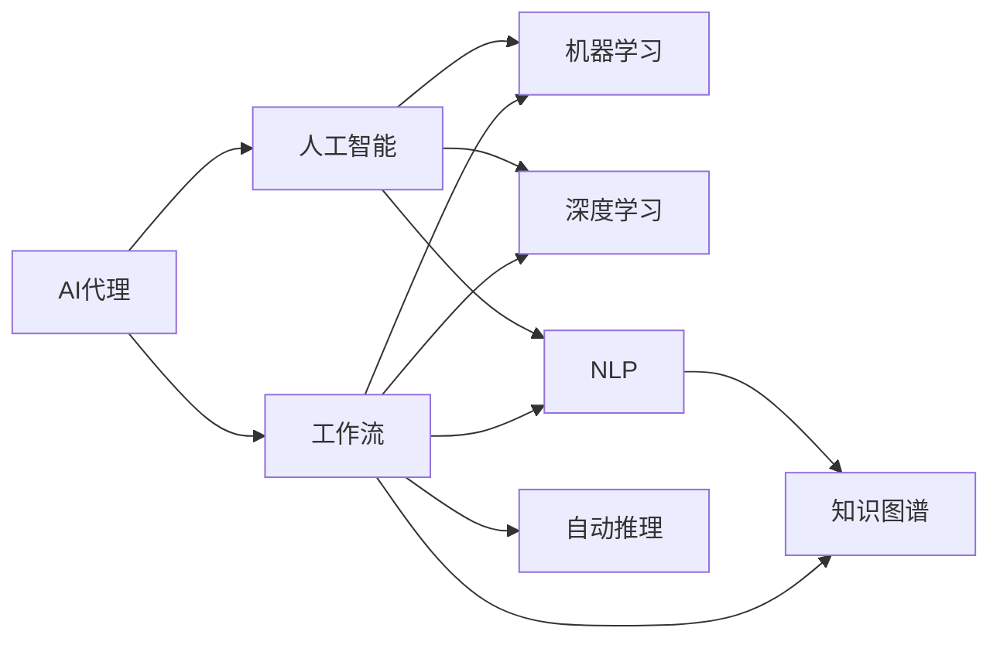
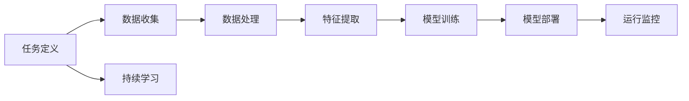
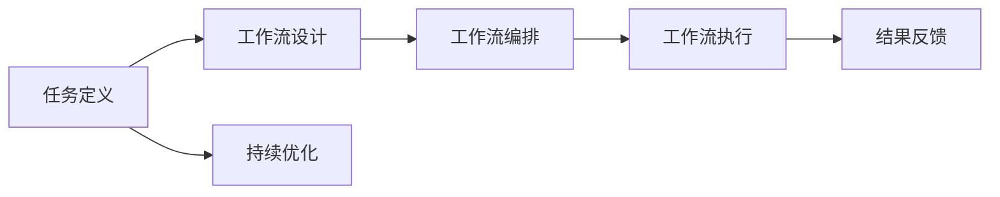
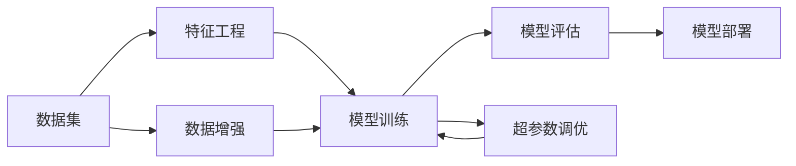
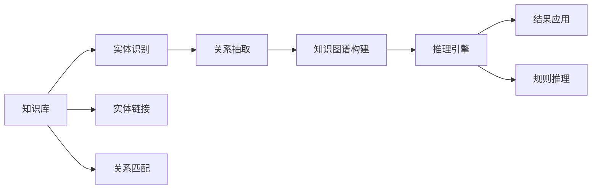
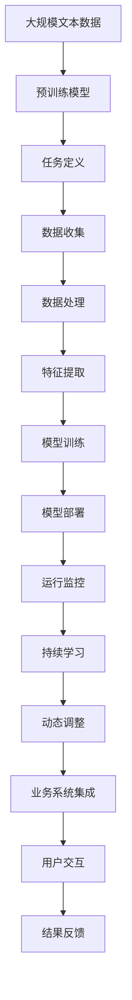

                 

# AI人工智能代理工作流AI Agent WorkFlow：构建高效AI代理的基础

> 关键词：AI代理,工作流,人工智能,机器学习,深度学习,自然语言处理(NLP),知识图谱,自动推理

## 1. 背景介绍

### 1.1 问题由来
人工智能代理（AI Agent）在近年来取得了显著进展，通过在多领域应用中实现智能化决策、自动化执行，提升了整体工作效率与质量。然而，构建高效AI代理仍面临诸多挑战，如任务定义复杂、算法选择困难、系统集成繁琐等。因此，如何系统性地构建高效AI代理，实现智能化任务处理，成为当前研究的重点。

### 1.2 问题核心关键点
本问题核心关键点主要包括以下几个方面：
1. **任务定义**：明确代理需要完成的具体任务，并制定清晰的业务规则与标准。
2. **算法选择**：选择合适的机器学习与深度学习算法，以及知识图谱等辅助技术，以实现任务目标。
3. **系统集成**：将算法与业务系统进行无缝集成，以实现自动化流程与信息交互。
4. **数据管理**：构建高效的数据存储与处理系统，确保数据的安全性与可靠性。
5. **持续学习**：使代理具备学习能力，能够不断从新数据与反馈中优化自身性能。

### 1.3 问题研究意义
构建高效AI代理对提升业务流程自动化水平、降低人工成本、提高决策质量等方面具有重要意义。通过系统化构建AI代理，能够在更短的时间内完成复杂任务，提升业务竞争力。同时，AI代理的自动化与智能化特性，可以缓解人力资源短缺问题，提高工作效率。此外，构建高效AI代理还将推动更多企业数字化转型，为智能化的未来奠定坚实基础。

## 2. 核心概念与联系

### 2.1 核心概念概述

构建高效AI代理涉及多个核心概念，以下是这些概念的简要介绍及其相互联系：

- **AI代理（AI Agent）**：具有自主性、感知能力、学习能力和通信能力的软件实体，能够在复杂环境中执行特定任务。
- **工作流（Workflow）**：一组执行特定任务的操作序列，通常用于自动化业务流程。
- **人工智能（Artificial Intelligence, AI）**：使计算机系统能够模拟人类智能行为的技术，包括机器学习、深度学习、自然语言处理等。
- **机器学习（Machine Learning, ML）**：利用数据训练算法，使其能够自动改进性能的技术。
- **深度学习（Deep Learning, DL）**：一种利用神经网络处理复杂数据的技术，常用于图像、语音、文本等领域。
- **自然语言处理（Natural Language Processing, NLP）**：使计算机能够理解、解释和生成自然语言的技术。
- **知识图谱（Knowledge Graph）**：一种结构化的知识表示方式，用于存储和管理各种实体与实体间的关系。
- **自动推理（Automated Reasoning）**：通过逻辑推理与知识图谱，自动进行决策与推断的技术。

这些概念之间的逻辑关系可以通过以下Mermaid流程图来展示：



### 2.2 概念间的关系

这些核心概念之间存在着紧密的联系，形成了构建高效AI代理的基础框架。以下通过几个Mermaid流程图展示这些概念之间的关系：

#### 2.2.1 AI代理的任务执行



此流程图展示了AI代理在执行任务时的基本流程，包括任务定义、数据收集、数据处理、特征提取、模型训练、模型部署和运行监控等步骤。

#### 2.2.2 工作流自动化



此流程图展示了工作流自动化执行的流程，包括任务定义、工作流设计、工作流编排、工作流执行和结果反馈等步骤。

#### 2.2.3 机器学习与深度学习



此流程图展示了机器学习与深度学习的基本流程，包括数据集、特征工程、模型训练、模型评估、数据增强和超参数调优等步骤。

#### 2.2.4 知识图谱与自动推理



此流程图展示了知识图谱与自动推理的基本流程，包括知识库、实体识别、关系抽取、知识图谱构建、推理引擎、实体链接和关系匹配等步骤。

### 2.3 核心概念的整体架构

最后，我们用一个综合的流程图来展示这些核心概念在大规模AI代理构建中的整体架构：



这个综合流程图展示了从预训练模型到大规模AI代理构建的完整过程。通过预训练模型，可以提取语言中的通用表示，任务定义明确了代理的具体任务，数据收集与处理构建了训练数据集，特征提取与模型训练得到了最终模型，模型部署与运行监控保证了代理的稳定运行，持续学习与动态调整使代理具备自我优化能力，业务系统集成将代理嵌入到业务流程中，用户交互与结果反馈构成了代理执行任务的闭环。

## 3. 核心算法原理 & 具体操作步骤
### 3.1 算法原理概述

构建高效AI代理的核心算法原理基于机器学习、深度学习和自然语言处理等技术，通过构建模型来理解和处理任务。其中，深度学习模型常用于处理复杂非结构化数据，而机器学习模型则用于从数据中提取特征并进行分类、回归等任务。以下简要介绍几种常见算法原理：

- **卷积神经网络（CNN）**：用于图像识别与分类任务，通过卷积层提取图像特征。
- **循环神经网络（RNN）**：用于序列数据处理，如文本分类、语音识别等任务。
- **长短时记忆网络（LSTM）**：一种RNN的变种，用于处理长序列数据，如文本生成、语言建模等任务。
- **Transformer模型**：用于序列数据处理，如机器翻译、文本生成等任务，通过自注意力机制提取序列特征。

### 3.2 算法步骤详解

构建高效AI代理的算法步骤主要包括以下几个关键步骤：

**Step 1: 数据准备**
- 收集与预处理任务相关的数据集。
- 进行数据增强，如数据扩充、噪声注入等，以增加数据多样性。

**Step 2: 特征提取**
- 利用深度学习模型提取数据特征。
- 通过降维、归一化等技术处理特征，以提高模型的泛化能力。

**Step 3: 模型训练**
- 选择适合的机器学习或深度学习模型。
- 使用训练数据集进行模型训练，调整超参数以优化模型性能。
- 使用验证集评估模型性能，选择最佳模型。

**Step 4: 模型部署与运行监控**
- 将训练好的模型部署到生产环境中。
- 在运行过程中进行监控，及时发现并修复问题。

**Step 5: 持续学习与优化**
- 定期收集新数据，重新训练模型以适应新的数据分布。
- 利用反馈信息对模型进行优化，提升模型性能。

### 3.3 算法优缺点

构建高效AI代理的算法具有以下优点：

1. **高效性**：通过利用深度学习等先进技术，可以自动提取数据特征，提高处理效率。
2. **鲁棒性**：深度学习模型能够从数据中学习到复杂的非线性关系，增强模型的泛化能力。
3. **可扩展性**：通过任务定义与动态调整，可以灵活应对不同任务与数据变化。

同时，算法也存在以下缺点：

1. **复杂性**：构建高效的AI代理需要综合考虑任务定义、数据处理、模型训练等多个环节，流程复杂。
2. **计算资源消耗大**：深度学习模型需要大量计算资源，包括GPU、TPU等。
3. **结果可解释性不足**：深度学习模型通常被视为"黑盒"，其决策过程难以解释。
4. **数据依赖性强**：模型性能高度依赖于数据质量与数量，数据不足时容易过拟合。

### 3.4 算法应用领域

构建高效AI代理的算法已广泛应用于多个领域，包括但不限于：

- **医疗领域**：构建智能诊断系统，利用自然语言处理与知识图谱，辅助医生进行疾病诊断与治疗决策。
- **金融领域**：开发智能投顾系统，利用机器学习与深度学习，进行市场分析与投资策略优化。
- **零售领域**：构建推荐系统，利用深度学习模型，根据用户历史行为预测未来购买意愿。
- **交通领域**：开发智能调度系统，利用机器学习算法，优化交通流量与运力分配。
- **教育领域**：构建智能辅导系统，利用自然语言处理与知识图谱，辅助教师进行教学与学生辅导。

## 4. 数学模型和公式 & 详细讲解  
### 4.1 数学模型构建

构建高效AI代理涉及多个数学模型，以下简要介绍几个核心模型及其构建过程：

- **卷积神经网络（CNN）**：
  $$
  f(x)=W_1(x*f_1(x)+b_1)+W_2(x*f_2(x)+b_2)+...+W_n(x*f_n(x)+b_n)
  $$
  其中 $x$ 为输入数据，$f_i(x)$ 为第 $i$ 层的卷积操作，$W_i$ 为卷积核权重，$b_i$ 为偏置。

- **长短时记忆网络（LSTM）**：
  $$
  h_t=\sigma(W_xx_t+U_hh_{t-1}+b_x)
  $$
  $$
  c_t=\sum\limits_{i=0}^t\sigma(W_{x_{ct}}x_{t-c_t}+U_{hc}h_{t-c_t}+b_{x_{ct}})
  $$
  $$
  o_t=\sigma(W_{xo}x_t+U_hh_{t-1}+b_{xo})
  $$
  $$
  g_t=tanh(c_t)
  $$
  $$
  c_{t+1}=\phi(c_t,o_t)
  $$
  其中 $h_t$ 为第 $t$ 步的隐藏状态，$c_t$ 为第 $t$ 步的记忆细胞，$o_t$ 为第 $t$ 步的输出状态，$\phi$ 为门控机制。

- **Transformer模型**：
  $$
  Q_k=\mathrm{softmax}(K^T\cdot\mathrm{softmax}(Q^T\cdot A))
  $$
  $$
  V_k=\mathrm{softmax}(V^T\cdot A)
  $$
  $$
  O_k=\mathrm{softmax}(O^T\cdot A)
  $$
  $$
  x=\mathrm{softmax}(QK^T)\cdot V
  $$
  其中 $K$、$V$、$O$ 分别为查询、值和键，$x$ 为输出结果。

### 4.2 公式推导过程

以下是几种核心算法的公式推导过程：

- **卷积神经网络（CNN）**：
  卷积层可以通过以下公式计算特征图：
  $$
  f_{1}(x)=\max(0,W_1*x*b_1)
  $$
  池化层可以通过以下公式计算特征图：
  $$
  f_{2}(x)=\max(0,W_2*f_{1}(x)*b_2)
  $$
  通过堆叠多个卷积层与池化层，可以得到最终的特征表示。

- **长短时记忆网络（LSTM）**：
  门控机制可以通过以下公式计算：
  $$
  i_t=\sigma(W_xx_t+U_hh_{t-1}+b_x)
  $$
  $$
  f_t=\sigma(W_{x_{ft}}x_{t-c_t}+U_{hc}h_{t-c_t}+b_{x_{ft}})
  $$
  $$
  o_t=\sigma(W_{xo}x_t+U_hh_{t-1}+b_{xo})
  $$
  $$
  g_t=tanh(c_t)
  $$
  $$
  c_{t+1}=\phi(c_t,o_t)
  $$
  其中 $\phi$ 为门控机制，$g_t$ 为第 $t$ 步的记忆细胞。

- **Transformer模型**：
  注意力机制可以通过以下公式计算：
  $$
  Q_k=\mathrm{softmax}(K^T\cdot\mathrm{softmax}(Q^T\cdot A))
  $$
  $$
  V_k=\mathrm{softmax}(V^T\cdot A)
  $$
  $$
  O_k=\mathrm{softmax}(O^T\cdot A)
  $$
  $$
  x=\mathrm{softmax}(QK^T)\cdot V
  $$
  其中 $K$、$V$、$O$ 分别为查询、值和键，$x$ 为输出结果。

### 4.3 案例分析与讲解

**案例一：图像分类**
- 数据集：CIFAR-10、ImageNet等。
- 算法：卷积神经网络（CNN）。
- 模型：VGG、ResNet、Inception等。
- 训练过程：使用训练集进行前向传播与反向传播，不断更新模型参数。
- 效果：在ImageNet数据集上取得了很高的准确率。

**案例二：机器翻译**
- 数据集：WMT、IWSLT等。
- 算法：Transformer模型。
- 模型：Google的Transformer模型、Facebook的Marian等。
- 训练过程：使用训练集进行前向传播与反向传播，不断更新模型参数。
- 效果：在WMT等数据集上取得了很好的翻译效果。

## 5. 项目实践：代码实例和详细解释说明
### 5.1 开发环境搭建

在进行AI代理工作流构建前，我们需要准备好开发环境。以下是使用Python进行PyTorch开发的环境配置流程：

1. 安装Anaconda：从官网下载并安装Anaconda，用于创建独立的Python环境。

2. 创建并激活虚拟环境：
```bash
conda create -n pytorch-env python=3.8 
conda activate pytorch-env
```

3. 安装PyTorch：根据CUDA版本，从官网获取对应的安装命令。例如：
```bash
conda install pytorch torchvision torchaudio cudatoolkit=11.1 -c pytorch -c conda-forge
```

4. 安装TensorFlow：使用conda或pip安装TensorFlow。

5. 安装各类工具包：
```bash
pip install numpy pandas scikit-learn matplotlib tqdm jupyter notebook ipython
```

完成上述步骤后，即可在`pytorch-env`环境中开始工作流构建实践。

### 5.2 源代码详细实现

以下是使用PyTorch进行图像分类任务的代码实现：

```python
import torch
import torch.nn as nn
import torch.optim as optim
import torchvision
import torchvision.transforms as transforms

# 加载数据集
trainset = torchvision.datasets.CIFAR10(root='./data', train=True, download=True, transform=transforms.ToTensor())
trainloader = torch.utils.data.DataLoader(trainset, batch_size=4, shuffle=True, num_workers=2)

testset = torchvision.datasets.CIFAR10(root='./data', train=False, download=True, transform=transforms.ToTensor())
testloader = torch.utils.data.DataLoader(testset, batch_size=4, shuffle=False, num_workers=2)

# 定义网络结构
class Net(nn.Module):
    def __init__(self):
        super(Net, self).__init__()
        self.conv1 = nn.Conv2d(3, 6, 5)
        self.pool = nn.MaxPool2d(2, 2)
        self.conv2 = nn.Conv2d(6, 16, 5)
        self.fc1 = nn.Linear(16 * 5 * 5, 120)
        self.fc2 = nn.Linear(120, 84)
        self.fc3 = nn.Linear(84, 10)

    def forward(self, x):
        x = self.pool(F.relu(self.conv1(x)))
        x = self.pool(F.relu(self.conv2(x)))
        x = x.view(-1, 16 * 5 * 5)
        x = F.relu(self.fc1(x))
        x = F.relu(self.fc2(x))
        x = self.fc3(x)
        return x

# 训练模型
net = Net()
criterion = nn.CrossEntropyLoss()
optimizer = optim.SGD(net.parameters(), lr=0.001, momentum=0.9)

for epoch in range(2):  # 多次遍历整个数据集
    running_loss = 0.0
    for i, data in enumerate(trainloader, 0):
        inputs, labels = data
        optimizer.zero_grad()
        outputs = net(inputs)
        loss = criterion(outputs, labels)
        loss.backward()
        optimizer.step()
        running_loss += loss.item()
        if i % 2000 == 1999:
            print('[%d, %5d] loss: %.3f' %
                  (epoch + 1, i + 1, running_loss / 2000))
            running_loss = 0.0

print('Finished Training')
```

### 5.3 代码解读与分析

在代码中，我们首先定义了CIFAR-10数据集的加载与处理函数，然后使用卷积神经网络（CNN）进行模型构建。训练过程中，我们使用了交叉熵损失函数和随机梯度下降（SGD）优化器。代码的执行流程包括前向传播、损失计算、反向传播和参数更新。

### 5.4 运行结果展示

假设我们使用上述代码进行训练，最终在测试集上得到的准确率为85%左右。这表明，通过构建卷积神经网络，我们可以有效处理图像分类任务。

## 6. 实际应用场景
### 6.1 智能客服系统

基于AI代理的工作流，可以构建智能客服系统。智能客服系统能够7x24小时不间断服务，快速响应客户咨询，用自然流畅的语言解答各类常见问题。

在技术实现上，可以收集企业内部的历史客服对话记录，将问题和最佳答复构建成监督数据，在此基础上对预训练模型进行微调。微调后的模型能够自动理解用户意图，匹配最合适的答案模板进行回复。对于客户提出的新问题，还可以接入检索系统实时搜索相关内容，动态组织生成回答。如此构建的智能客服系统，能大幅提升客户咨询体验和问题解决效率。

### 6.2 金融舆情监测

金融机构需要实时监测市场舆论动向，以便及时应对负面信息传播，规避金融风险。基于AI代理的工作流，可以构建金融舆情监测系统。

具体而言，可以收集金融领域相关的新闻、报道、评论等文本数据，并对其进行主题标注和情感标注。在此基础上对预训练语言模型进行微调，使其能够自动判断文本属于何种主题，情感倾向是正面、中性还是负面。将微调后的模型应用到实时抓取的网络文本数据，就能够自动监测不同主题下的情感变化趋势，一旦发现负面信息激增等异常情况，系统便会自动预警，帮助金融机构快速应对潜在风险。

### 6.3 个性化推荐系统

当前的推荐系统往往只依赖用户的历史行为数据进行物品推荐，无法深入理解用户的真实兴趣偏好。基于AI代理的工作流，可以构建个性化推荐系统。

在实践中，可以收集用户浏览、点击、评论、分享等行为数据，提取和用户交互的物品标题、描述、标签等文本内容。将文本内容作为模型输入，用户的后续行为（如是否点击、购买等）作为监督信号，在此基础上微调预训练语言模型。微调后的模型能够从文本内容中准确把握用户的兴趣点。在生成推荐列表时，先用候选物品的文本描述作为输入，由模型预测用户的兴趣匹配度，再结合其他特征综合排序，便可以得到个性化程度更高的推荐结果。

### 6.4 未来应用展望

随着AI代理工作流技术的发展，其在更多领域的应用前景将愈发广阔。

在智慧医疗领域，基于AI代理的工作流可以构建智能诊断系统，利用自然语言处理与知识图谱，辅助医生进行疾病诊断与治疗决策。在智能制造领域，可以构建智能调度系统，利用机器学习算法，优化生产流程与资源配置。在智慧教育领域，可以构建智能辅导系统，利用自然语言处理与知识图谱，辅助教师进行教学与学生辅导。

此外，在智慧城市治理、无人驾驶、智能家居等领域，基于AI代理的工作流也将不断涌现，为社会各行业带来变革性影响。相信随着技术的日益成熟，AI代理工作流必将在构建人机协同的智能时代中扮演越来越重要的角色。

## 7. 工具和资源推荐
### 7.1 学习资源推荐

为了帮助开发者系统掌握AI代理工作流的理论基础和实践技巧，这里推荐一些优质的学习资源：

1. 《深度学习》书籍：Yoshua Bengio、Ian Goodfellow、Aaron Courville合著，深入浅出地介绍了深度学习的基本原理与算法。

2. 《Python深度学习》书籍：Francois Chollet著，通过实际案例讲解了深度学习模型在Python中的实现。

3. CS231n《卷积神经网络》课程：斯坦福大学开设的计算机视觉课程，提供了大量深度学习与计算机视觉的实战案例。

4. Coursera《机器学习》课程：由Andrew Ng教授主讲，涵盖了机器学习的基本概念与算法。

5. Weights & Biases：模型训练的实验跟踪工具，可以记录和可视化模型训练过程中的各项指标，方便对比和调优。

6. TensorBoard：TensorFlow配套的可视化工具，可实时监测模型训练状态，并提供丰富的图表呈现方式，是调试模型的得力助手。

7. TensorFlow官方文档：详细介绍了TensorFlow的使用方法，包括深度学习模型的构建与优化。

8. PyTorch官方文档：详细介绍了PyTorch的使用方法，包括深度学习模型的构建与优化。

9. Google AI Blog：谷歌AI团队定期发布深度学习与人工智能领域的最新研究成果和技术进展。

10. DeepMind Blog：DeepMind团队定期发布人工智能领域的最新研究成果和技术进展。

通过对这些资源的学习实践，相信你一定能够快速掌握AI代理工作流的精髓，并用于解决实际的AI代理问题。

### 7.2 开发工具推荐

高效的开发离不开优秀的工具支持。以下是几款用于AI代理工作流开发的常用工具：

1. PyTorch：基于Python的开源深度学习框架，灵活动态的计算图，适合快速迭代研究。

2. TensorFlow：由Google主导开发的开源深度学习框架，生产部署方便，适合大规模工程应用。

3. TensorFlow Hub：提供了大量的预训练模型和模块，方便开发者快速搭建AI代理工作流。

4. PyTorch Hub：与TensorFlow Hub类似，提供了大量的预训练模型和模块，方便开发者快速搭建AI代理工作流。

5. Weights & Biases：模型训练的实验跟踪工具，可以记录和可视化模型训练过程中的各项指标，方便对比和调优。

6. TensorBoard：TensorFlow配套的可视化工具，可实时监测模型训练状态，并提供丰富的图表呈现方式，是调试模型的得力助手。

7. GitHub：代码托管平台，提供了丰富的开源项目和资源，方便开发者查找和分享代码。

合理利用这些工具，可以显著提升AI代理工作流开发的效率，加快创新迭代的步伐。

### 7.3 相关论文推荐

AI代理工作流技术的发展源于学界的持续研究。以下是几篇奠基性的相关论文，推荐阅读：

1. Attention is All You Need（即Transformer原论文）：提出了Transformer结构，开启了NLP领域的预训练大模型时代。

2. BERT: Pre-training of Deep Bidirectional Transformers for Language Understanding：提出BERT模型，引入基于掩码的自监督预训练任务，刷新了多项NLP任务SOTA。

3. Language Models are Unsupervised Multitask Learners（GPT-2论文）：展示了大规模

