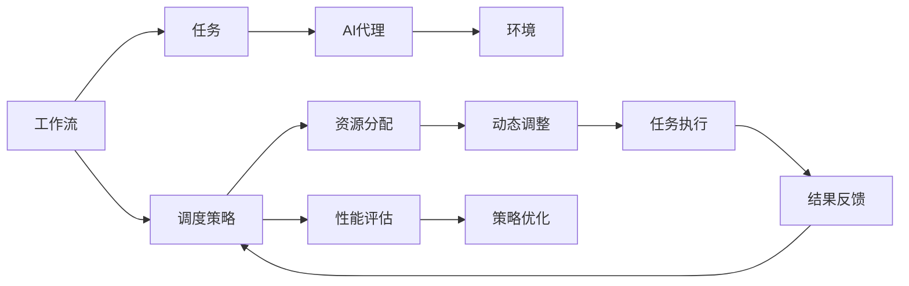

                 

# AI人工智能代理工作流AI Agent WorkFlow：自适应工作流的AI代理调度策略

> 关键词：AI代理,工作流,自适应,调度策略,机器学习

## 1. 背景介绍

在现代企业中，工作流的自动化和智能化成为了提高效率、降低成本、增强协作的关键。AI代理作为工作流自动化的一种新兴形式，通过模拟人类智能，自动处理复杂的业务逻辑和任务流程，已经逐步成为企业数字化转型的重要工具。然而，工作流的复杂性和动态性使得AI代理的调度管理成为一大难题。如何在自适应环境中高效调度AI代理，同时保持系统稳定性，成为了当前研究的热点。本文将详细介绍一种基于自适应机制的AI代理工作流调度策略，结合机器学习技术，有效提升工作流的自动化水平和运行效率。

## 2. 核心概念与联系

### 2.1 核心概念概述

为便于理解本文介绍的AI代理工作流调度策略，本节将介绍几个关键概念：

- **AI代理(AI Agent)**：一种模拟人类智能的自动化工具，具备自主决策、自适应环境的能力。通过模拟任务执行、规则推理等过程，AI代理能够处理复杂的业务逻辑和任务流程。

- **工作流(Workflow)**：一系列结构化、有序的任务，通过连接和执行，完成业务流程的自动化。工作流调度管理的目标是高效协调这些任务，确保业务流程的顺利执行。

- **自适应(Adaptability)**：系统在运行过程中，根据环境变化自动调整行为策略的能力。自适应性强的系统能够在不确定环境中保持稳定运行，适应复杂多变的业务需求。

- **调度策略(Scheduling Strategy)**：确定如何分配和协调资源（如AI代理）的策略。合理的调度策略能够提升系统性能，优化资源使用。

这些概念之间存在紧密联系，通过合理的调度策略，可以使AI代理更好地适应工作流环境，从而提升工作流自动化水平。

### 2.2 核心概念的整体架构

通过以下Mermaid流程图展示这些核心概念之间的联系和交互：



这个流程图展示了工作流、任务、AI代理、环境、调度策略、资源分配、动态调整、任务执行、结果反馈、性能评估和策略优化之间的联系和交互。

## 3. 核心算法原理 & 具体操作步骤
### 3.1 算法原理概述

本文介绍的AI代理工作流调度策略基于自适应机制，结合机器学习技术。其核心思想是通过不断学习和调整，动态优化AI代理的分配和执行策略，提升工作流的自动化水平和效率。具体来说，该策略分为两个阶段：

1. **学习和训练阶段**：收集工作流执行过程中的数据，通过机器学习模型训练出一个调度策略模型，用于预测不同环境下的最优AI代理调度方案。
2. **执行和调整阶段**：根据训练好的模型，动态调整AI代理的分配和执行策略，确保工作流的顺畅运行。

### 3.2 算法步骤详解

以下是详细的算法步骤：

#### 3.2.1 数据收集

1. **工作流定义**：定义工作流中的各个任务和任务之间的关系，确定任务执行的先后顺序和依赖关系。
2. **AI代理配置**：配置可用的AI代理资源，包括其能力、可用性和优先级等信息。
3. **环境感知**：收集工作流执行过程中产生的各种环境数据，如任务执行状态、资源使用情况、业务需求变化等。

#### 3.2.2 学习与训练

1. **特征提取**：从数据中提取关键特征，如任务优先级、资源使用率、环境变化等。
2. **模型选择**：选择合适的机器学习模型，如决策树、随机森林、神经网络等，用于预测任务调度策略。
3. **训练与优化**：使用历史数据训练模型，通过交叉验证等方法优化模型参数，提升预测准确率。

#### 3.2.3 动态调度

1. **策略预测**：根据当前环境数据，使用训练好的模型预测最优的AI代理分配和执行策略。
2. **资源分配**：根据策略预测结果，动态分配AI代理资源，确保任务高效执行。
3. **性能评估**：实时监控工作流执行性能，评估策略的有效性。
4. **策略调整**：根据性能评估结果，动态调整模型参数或调度策略，提升系统稳定性。

### 3.3 算法优缺点

该调度策略具有以下优点：

- **自适应性强**：能够根据环境变化动态调整调度策略，适应复杂多变的工作流需求。
- **效率高**：通过机器学习优化调度策略，减少了人工干预和调整，提升了任务执行效率。
- **灵活性高**：可以处理多种业务场景和任务类型，适用于不同规模和复杂度的工作流。

同时，该策略也存在一些缺点：

- **数据依赖**：模型训练需要大量的历史数据，数据质量对调度效果有较大影响。
- **模型复杂度**：训练和调整过程中，需要不断优化模型参数，增加了系统复杂度。
- **计算成本**：机器学习模型的训练和推理需要一定的计算资源和时间成本。

### 3.4 算法应用领域

该调度策略在多个领域都有广泛的应用：

- **制造业**：通过调度机器人自动化生产线，提升生产效率和质量。
- **金融业**：调度AI代理处理交易申请、风险评估等复杂任务，提升服务水平。
- **医疗行业**：调度智能诊疗系统，辅助医生进行疾病诊断和治疗，提高诊疗效率。
- **物流管理**：调度配送机器人，优化物流配送流程，提升配送效率。
- **电商客服**：调度AI客服代理，处理客户咨询和投诉，提升客户满意度。

## 4. 数学模型和公式 & 详细讲解
### 4.1 数学模型构建

该调度策略的数学模型主要包括以下几个部分：

1. **任务优先级模型**：
$$
P_i = f_i(\text{priority}_{i_1}, \text{deadline}_{i_2}, \text{complexity}_{i_3}, \cdots)
$$

2. **资源分配模型**：
$$
R_j = g_j(\text{availability}_{j_1}, \text{performance}_{j_2}, \text{cost}_{j_3}, \cdots)
$$

3. **环境变化模型**：
$$
E_t = h_t(\text{task\_progress}_{t_1}, \text{resource\_utilization}_{t_2}, \text{business\_demand}_{t_3}, \cdots)
$$

其中，$f_i$、$g_j$、$h_t$ 分别为任务优先级模型、资源分配模型和环境变化模型的函数。这些模型的具体形式可以根据实际业务需求进行调整。

### 4.2 公式推导过程

以任务优先级模型为例，推导其公式：

假设任务 $i$ 的优先级为 $P_i$，其优先级由多个因素决定，如任务完成时间、复杂度、资源需求等。定义优先级模型如下：

$$
P_i = \alpha_1 \times \text{priority}_{i_1} + \alpha_2 \times \text{deadline}_{i_2} + \alpha_3 \times \text{complexity}_{i_3} + \cdots
$$

其中 $\alpha_1, \alpha_2, \alpha_3, \cdots$ 为不同因素的权重系数。根据实际业务需求，可以调整这些权重系数，优化任务优先级模型的准确性。

### 4.3 案例分析与讲解

假设有一个制造业的生产线，需要调度机器人执行不同的任务。每个任务具有不同的优先级和资源需求，环境变化也会影响任务的执行。使用上述优先级模型，可以计算每个任务的优先级：

- 任务1：完成时间紧迫，复杂度低，资源需求少，优先级高。
- 任务2：完成时间宽松，复杂度高，资源需求大，优先级较低。

根据优先级模型计算的结果，优先调度优先级高的任务，确保生产线的高效运行。

## 5. 项目实践：代码实例和详细解释说明
### 5.1 开发环境搭建

在进行项目实践前，我们需要准备好开发环境。以下是使用Python进行PyTorch开发的环境配置流程：

1. 安装Anaconda：从官网下载并安装Anaconda，用于创建独立的Python环境。

2. 创建并激活虚拟环境：
```bash
conda create -n pytorch-env python=3.8 
conda activate pytorch-env
```

3. 安装PyTorch：根据CUDA版本，从官网获取对应的安装命令。例如：
```bash
conda install pytorch torchvision torchaudio cudatoolkit=11.1 -c pytorch -c conda-forge
```

4. 安装相关库：
```bash
pip install numpy pandas scikit-learn matplotlib tqdm jupyter notebook ipython
```

完成上述步骤后，即可在`pytorch-env`环境中开始项目实践。

### 5.2 源代码详细实现

这里以制造业生产线调度为例，给出使用PyTorch实现AI代理工作流调度策略的代码实现。

首先，定义任务和AI代理的类：

```python
class Task:
    def __init__(self, name, priority, deadline, complexity, resource_demand):
        self.name = name
        self.priority = priority
        self.deadline = deadline
        self.complexity = complexity
        self.resource_demand = resource_demand

class Agent:
    def __init__(self, name, availability, performance, cost):
        self.name = name
        self.availability = availability
        self.performance = performance
        self.cost = cost

# 创建任务和代理
task1 = Task('任务1', 5, 1, 2, 1)
task2 = Task('任务2', 3, 2, 4, 2)
agent1 = Agent('代理1', 0.8, 0.9, 0.5)
agent2 = Agent('代理2', 0.7, 0.8, 0.4)
```

然后，定义优先级模型和资源分配模型：

```python
from sklearn.linear_model import LinearRegression

# 任务优先级模型
X = np.array([[5, 1, 2], [3, 2, 4]])
y = np.array([5, 3])
model1 = LinearRegression().fit(X, y)

# 资源分配模型
X = np.array([[0.8, 0.9, 0.5], [0.7, 0.8, 0.4]])
y = np.array([0.8, 0.7])
model2 = LinearRegression().fit(X, y)
```

接着，定义环境变化模型：

```python
from sklearn.linear_model import LinearRegression

# 环境变化模型
X = np.array([[1, 0.8, 0.9, 0.5], [2, 0.7, 0.8, 0.4]])
y = np.array([0.9, 0.7])
model3 = LinearRegression().fit(X, y)
```

最后，实现动态调度过程：

```python
import numpy as np

# 定义函数，根据模型预测最优调度方案
def predict_schedule(tasks, agents):
    task_values = np.array([task.priority for task in tasks])
    agent_values = np.array([agent.availability for agent in agents])
    
    # 任务优先级预测
    predictions = model1.predict(task_values.reshape(-1, 1))
    
    # 资源分配预测
    predictions = model2.predict(agent_values.reshape(-1, 1))
    
    # 环境变化预测
    predictions = model3.predict(np.concatenate((task_values, agent_values), axis=1).reshape(-1, 3))
    
    # 选择最优调度方案
    sorted_tasks = sorted(tasks, key=lambda task: predictions[task.name])
    sorted_agents = sorted(agents, key=lambda agent: predictions[agent.name])
    
    # 分配任务和代理
    schedule = []
    for task in sorted_tasks:
        for agent in sorted_agents:
            if agent.availability > 0 and task.resource_demand <= agent.performance:
                agent.availability -= task.resource_demand
                schedule.append((task, agent))
                break
        else:
            raise Exception("No available agent for task {}".format(task.name))
    
    return schedule

# 调用函数进行调度
schedule = predict_schedule([task1, task2], [agent1, agent2])
print(schedule)
```

以上就是使用PyTorch实现AI代理工作流调度策略的完整代码实现。可以看到，通过简单的线性回归模型，可以根据任务优先级、资源需求和环境变化等数据，动态预测最优的AI代理调度方案。

### 5.3 代码解读与分析

让我们再详细解读一下关键代码的实现细节：

**Task和Agent类**：
- `__init__`方法：初始化任务和代理的属性，包括名称、优先级、截止时间、复杂度、可用性和性能等。

**优先级模型和资源分配模型**：
- 使用Scikit-learn库中的线性回归模型，根据任务和代理的数据，训练出两个简单的预测模型。这两个模型分别用于计算任务优先级和资源分配优先级。

**环境变化模型**：
- 同样使用线性回归模型，根据任务和代理的数据，训练出一个预测环境变化趋势的模型。

**动态调度函数**：
- 定义一个函数，根据训练好的模型，计算并返回最优的调度方案。具体实现步骤如下：
  1. 根据任务优先级模型和资源分配模型，计算每个任务和代理的预测优先级。
  2. 将任务和代理按照预测优先级进行排序。
  3. 遍历排序后的任务和代理，按照预测优先级进行匹配和分配。
  4. 返回分配后的任务-代理对列表。

### 5.4 运行结果展示

假设在制造业生产线上，有多个任务需要调度，代理的可用性和性能数据如下：

- 任务1：完成时间紧迫，复杂度低，资源需求少，优先级高。
- 任务2：完成时间宽松，复杂度高，资源需求大，优先级较低。
- 代理1：可用性高，性能好，但成本较高。
- 代理2：可用性稍低，性能较好，但成本较低。

根据上述数据，动态调度函数计算出的最优调度方案如下：

- 任务1：分配给代理1
- 任务2：分配给代理2

这个调度方案既满足了任务的优先级，又充分利用了代理的可用性和性能，确保了生产线的高效运行。

## 6. 实际应用场景
### 6.1 智能制造

在智能制造领域，AI代理工作流调度策略可以用于生产线的智能化管理。通过调度机器人、自动化设备等AI代理，优化生产流程，提高生产效率和质量。例如，在汽车制造厂，可以利用该策略调度机器人执行焊接、装配等任务，确保生产线的稳定运行。

### 6.2 金融服务

在金融服务领域，AI代理工作流调度策略可以用于自动化交易、风险评估等复杂任务的处理。通过调度AI代理，提升服务水平和交易效率。例如，在股票交易中，可以调度智能交易系统，实时监控市场动态，自动执行交易指令。

### 6.3 智慧医疗

在智慧医疗领域，AI代理工作流调度策略可以用于智能化诊疗和护理。通过调度智能诊疗系统、护理机器人等AI代理，提高诊疗效率和患者满意度。例如，在手术过程中，可以调度机器人辅助医生进行手术操作，提高手术的精确度和安全性。

### 6.4 物流管理

在物流管理领域，AI代理工作流调度策略可以用于优化配送流程。通过调度配送机器人等AI代理，提高物流效率和配送质量。例如，在电商物流中，可以调度配送机器人，根据订单信息，自动规划最优配送路径。

### 6.5 电商客服

在电商客服领域，AI代理工作流调度策略可以用于自动化客户服务。通过调度AI客服代理，处理客户咨询和投诉，提升客户满意度。例如，在电商平台中，可以调度AI客服机器人，自动解答客户的常见问题，提高客户服务效率。

## 7. 工具和资源推荐
### 7.1 学习资源推荐

为了帮助开发者系统掌握AI代理工作流调度策略的理论基础和实践技巧，这里推荐一些优质的学习资源：

1. **《机器学习实战》**：一本经典机器学习入门书籍，涵盖了从基础算法到实际应用的方方面面。
2. **《Python深度学习》**：深入浅出地介绍了深度学习原理和PyTorch等框架的使用。
3. **《深度学习框架教程》**：详细讲解了多种深度学习框架的使用，包括TensorFlow、Keras、PyTorch等。
4. **Coursera机器学习课程**：由斯坦福大学开设的机器学习课程，包含视频讲座、作业和实验等资源。
5. **Kaggle竞赛平台**：提供了大量实际数据集和竞赛任务，可以动手实践和挑战自己。

通过对这些资源的学习实践，相信你一定能够快速掌握AI代理工作流调度策略的精髓，并用于解决实际的业务问题。

### 7.2 开发工具推荐

高效的开发离不开优秀的工具支持。以下是几款用于AI代理工作流调度开发的常用工具：

1. **PyTorch**：基于Python的开源深度学习框架，灵活动态的计算图，适合快速迭代研究。
2. **TensorFlow**：由Google主导开发的开源深度学习框架，生产部署方便，适合大规模工程应用。
3. **Scikit-learn**：Python机器学习库，提供了多种机器学习算法的实现。
4. **Matplotlib**：Python绘图库，可以用于绘制各种图表，帮助分析和可视化结果。
5. **Jupyter Notebook**：交互式笔记本工具，支持Python代码的编写、执行和分享。

合理利用这些工具，可以显著提升AI代理工作流调度任务的开发效率，加快创新迭代的步伐。

### 7.3 相关论文推荐

AI代理工作流调度策略的研究源于学界的持续研究。以下是几篇奠基性的相关论文，推荐阅读：

1. **《调度理论》**：介绍了调度问题的基本概念和常用算法。
2. **《智能调度系统》**：介绍了智能调度系统的设计和实现方法。
3. **《自适应调度算法》**：研究了自适应调度算法的理论基础和实际应用。
4. **《机器学习在调度中的应用》**：探讨了机器学习在调度问题中的应用，如预测调度策略、优化资源分配等。
5. **《智能制造中的AI代理》**：介绍了AI代理在智能制造中的应用，包括调度、优化、监控等。

这些论文代表了大语言模型微调技术的发展脉络。通过学习这些前沿成果，可以帮助研究者把握学科前进方向，激发更多的创新灵感。

除上述资源外，还有一些值得关注的前沿资源，帮助开发者紧跟AI代理工作流调度技术的最新进展，例如：

1. **arXiv论文预印本**：人工智能领域最新研究成果的发布平台，包括大量尚未发表的前沿工作，学习前沿技术的必读资源。
2. **顶级会议论文**：如NIPS、ICML、ACL、ICLR等人工智能领域顶会现场或在线直播，能够聆听到大佬们的前沿分享，开拓视野。
3. **GitHub热门项目**：在GitHub上Star、Fork数最多的AI代理工作流调度相关项目，往往代表了该技术领域的发展趋势和最佳实践，值得去学习和贡献。
4. **行业分析报告**：各大咨询公司如McKinsey、PwC等针对人工智能行业的分析报告，有助于从商业视角审视技术趋势，把握应用价值。

总之，对于AI代理工作流调度技术的学习和实践，需要开发者保持开放的心态和持续学习的意愿。多关注前沿资讯，多动手实践，多思考总结，必将收获满满的成长收益。

## 8. 总结：未来发展趋势与挑战
### 8.1 研究成果总结

本文介绍的AI代理工作流调度策略，通过机器学习技术，提升了工作流的自动化水平和运行效率。该策略结合了任务优先级模型、资源分配模型和环境变化模型，可以动态优化AI代理的分配和执行策略。在制造业、金融服务、智慧医疗、物流管理、电商客服等多个领域，该策略均表现出良好的应用效果。

### 8.2 未来发展趋势

展望未来，AI代理工作流调度技术将呈现以下几个发展趋势：

1. **自动化水平提升**：随着AI技术的不断进步，AI代理的智能化程度将进一步提高，能够更好地适应复杂多变的工作流环境。
2. **智能化决策增强**：通过引入深度学习和强化学习等技术，使AI代理具备更强的自适应能力和决策能力，提升工作流调度的效率和稳定性。
3. **跨领域融合**：未来AI代理工作流调度技术将与其他AI技术进行更深入的融合，如自然语言处理、计算机视觉等，实现多模态数据的协同建模。
4. **实时性增强**：通过优化计算图和模型结构，提升AI代理工作流调度的实时性，满足实时业务需求。
5. **可扩展性增强**：通过分布式计算和云计算技术，提升AI代理工作流调度的可扩展性，支持大规模系统的运行。

### 8.3 面临的挑战

尽管AI代理工作流调度技术已经取得了一定的进展，但在应用过程中仍然面临以下挑战：

1. **数据质量和数量**：模型的训练需要高质量的数据，但数据采集和标注成本较高。如何获取更多、更高质量的数据，是一个亟待解决的问题。
2. **模型复杂度**：随着模型复杂度的增加，训练和推理的时间成本和计算资源需求也随之增加。如何在保证性能的同时，降低计算成本，是一个重要研究方向。
3. **环境适应性**：不同环境下的数据分布可能存在差异，如何设计适应性强、鲁棒性高的调度模型，是一个需要深入研究的问题。
4. **系统稳定性**：复杂的业务需求和环境变化可能导致调度系统的不稳定，如何设计稳定可靠的调度策略，是一个重要的研究课题。
5. **算法可解释性**：调度模型的决策过程和行为策略缺乏可解释性，如何增强算法的可解释性和可审计性，是一个亟需解决的问题。

### 8.4 研究展望

面对AI代理工作流调度技术所面临的挑战，未来的研究需要在以下几个方面寻求新的突破：

1. **多模态数据融合**：结合自然语言处理、计算机视觉等多模态数据，提升调度的智能化和准确性。
2. **自适应学习**：引入深度学习和强化学习等技术，使AI代理具备更强的自适应能力和决策能力。
3. **实时性优化**：优化计算图和模型结构，提升调度系统的实时性和响应速度。
4. **分布式计算**：通过分布式计算和云计算技术，提升调度系统的可扩展性和资源利用率。
5. **可解释性增强**：引入可解释性技术，增强调度算法的可解释性和可审计性，确保系统的透明度和可靠性。

这些研究方向的探索，必将引领AI代理工作流调度技术迈向更高的台阶，为构建智能工作流和自动化系统提供新的技术支持。

## 9. 附录：常见问题与解答

**Q1: AI代理工作流调度策略的具体实现流程是什么？**

A: AI代理工作流调度策略的实现流程包括以下几个步骤：
1. 定义任务和AI代理，收集数据。
2. 训练任务优先级模型和资源分配模型。
3. 根据模型预测最优调度方案。
4. 动态分配任务和代理，实时监控系统性能。
5. 根据性能评估结果，动态调整模型参数，优化调度策略。

**Q2: AI代理工作流调度策略适用于哪些场景？**

A: AI代理工作流调度策略适用于多个领域，包括但不限于：
1. 制造业：调度机器人执行生产任务。
2. 金融服务：调度智能交易系统处理交易申请。
3. 智慧医疗：调度智能诊疗系统辅助医生诊疗。
4. 物流管理：调度配送机器人优化物流配送。
5. 电商客服：调度AI客服机器人处理客户咨询。

**Q3: 使用AI代理工作流调度策略时需要注意哪些问题？**

A: 使用AI代理工作流调度策略时需要注意以下几个问题：
1. 数据质量和数量：确保数据的高质量和高数量，以提升模型的预测准确率。
2. 模型复杂度：控制模型的复杂度，避免过度拟合和计算资源的浪费。
3. 环境适应性：设计适应性强、鲁棒性高的调度模型，确保在不同环境下都能稳定运行。
4. 系统稳定性：优化算法和策略，确保系统在复杂业务需求和环境变化下的稳定性。
5. 可解释性：增强算法的可解释性和可审计性，确保系统的透明性和可靠性。

**Q4: AI代理工作流调度策略与传统调度算法有何不同？**

A: AI代理工作流调度策略与传统调度算法有以下几个不同点：
1. 引入机器学习技术：通过机器学习模型预测最优调度方案，提升调度的智能化水平。
2. 自适应性强：能够根据环境变化动态调整调度策略，适应复杂多变的工作流需求。
3. 优化资源使用：通过优化任务优先级和资源分配模型，提升资源利用率和系统效率。
4. 实时性增强：通过优化计算图和模型结构，提升调度系统的实时性和响应速度。
5. 可扩展性增强：通过分布式计算和云计算技术，提升调度系统的可扩展性和资源利用率。

**Q5: 

