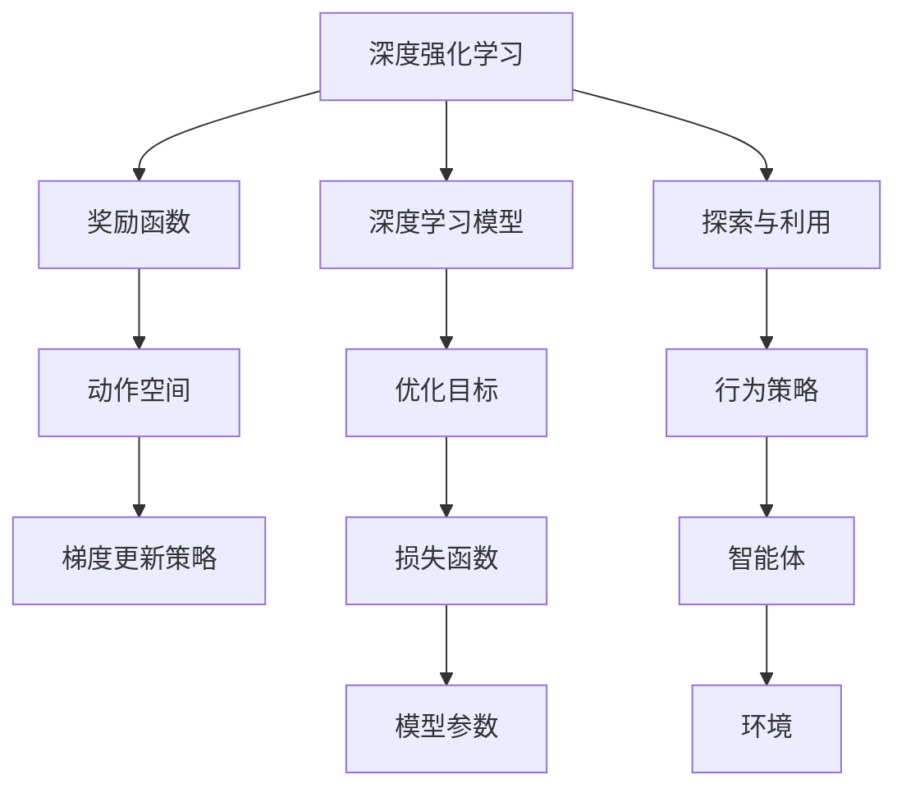
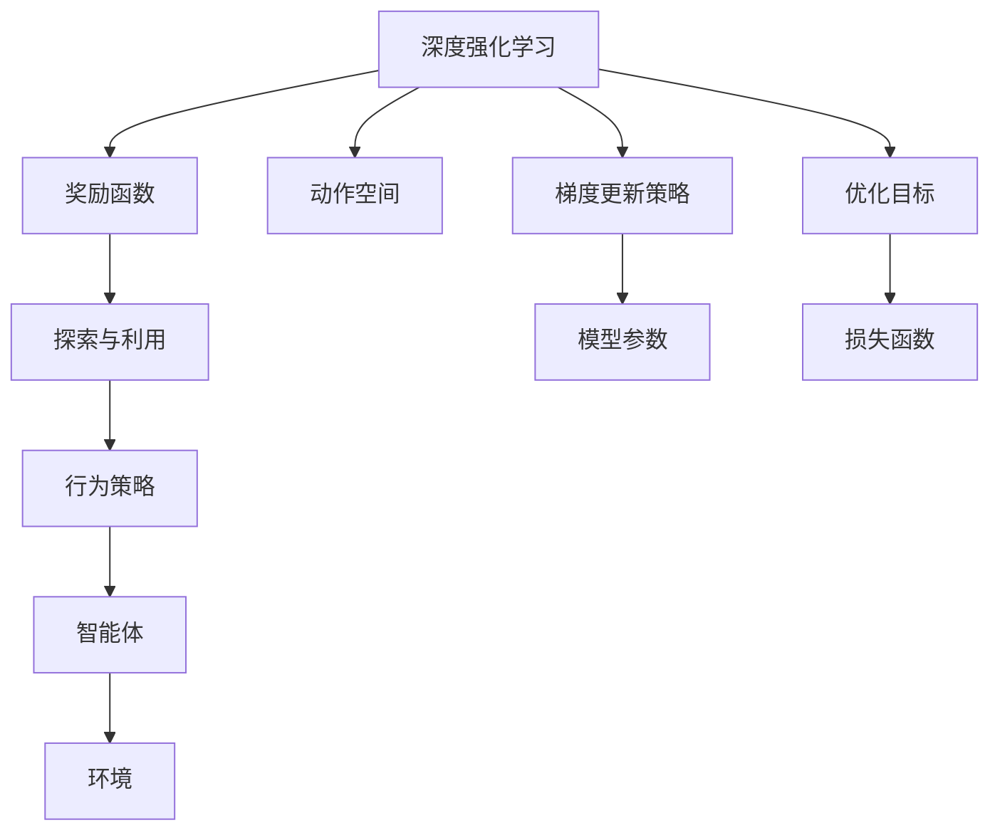
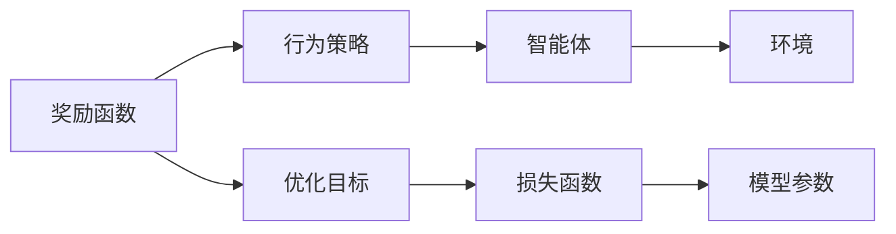

                 

# AI人工智能深度学习算法：使用强化学习优化深度学习模型

> 关键词：强化学习,深度学习模型优化,神经网络训练,奖励函数设计,动作空间选择,梯度更新策略,深度强化学习,学习策略

## 1. 背景介绍

### 1.1 问题由来
随着人工智能技术的迅猛发展，深度学习算法在机器学习领域占据了重要地位。深度神经网络模型，凭借其强大的表达能力和自适应学习能力，已经在图像识别、语音识别、自然语言处理等领域取得了显著的成果。然而，在实际应用中，深度学习模型的训练通常需要大量数据和计算资源，且存在过拟合风险，模型的泛化能力有待提升。

为解决这些问题，强化学习（Reinforcement Learning, RL）被引入到深度学习模型优化中。强化学习是一种通过智能体与环境交互来学习最优策略的机器学习方法，其核心思想是奖励机制和策略优化。深度强化学习（Deep Reinforcement Learning, DRL）结合了深度学习和强化学习的优势，通过深度神经网络模型进行状态表示和策略学习，进一步提升了学习效率和模型性能。

### 1.2 问题核心关键点
在深度强化学习中，模型优化的关键在于设计合理的奖励函数（Reward Function）和动作空间（Action Space），并选择合适的梯度更新策略（Gradient Update Strategy），以实现智能体的最优行为策略。

1. **奖励函数设计**：奖励函数用于评估智能体在每个状态下的表现，是深度强化学习的核心组成部分。设计合理的奖励函数能够引导智能体学习到最优策略，避免学习过程中出现行为偏向。

2. **动作空间选择**：动作空间定义了智能体可以采取的所有可能行动，其设计应与具体任务相关，且便于模型学习。常见的动作空间包括离散型、连续型和混合型等。

3. **梯度更新策略**：梯度更新策略决定了智能体如何调整模型参数，以便更接近最优策略。常见的策略包括基于价值（Value-based）和基于策略（Policy-based）的方法。

深度强化学习已经被应用于游戏、机器人控制、自动驾驶、自然语言生成等众多领域，展现出了强大的应用潜力。本文聚焦于深度强化学习在优化深度学习模型中的应用，通过详细介绍奖励函数、动作空间和梯度更新策略的设计方法，探讨如何利用强化学习提升深度学习模型的性能和泛化能力。

### 1.3 问题研究意义
强化学习与深度学习的结合，为深度学习模型优化提供了全新的方法，能够显著提升模型的泛化能力和实际应用效果。研究深度强化学习在优化深度学习模型中的应用，对于推动人工智能技术的发展，提升机器学习模型的应用价值具有重要意义：

1. **提升模型泛化能力**：强化学习能够通过智能体的不断探索和优化，学习到更泛化的行为策略，从而提升模型的泛化能力。
2. **减少过拟合风险**：通过奖励机制引导智能体学习到稳定的行为策略，减少模型过拟合的风险。
3. **增强模型适应性**：强化学习使模型能够适应复杂多变的环境和任务，提升实际应用中的适应性。
4. **优化模型参数**：强化学习提供了一种基于奖励机制的模型参数优化方法，能够自动寻找最优的参数设置。
5. **促进跨领域应用**：深度强化学习能够跨越不同的应用领域，实现模型在多个场景下的高效应用。

## 2. 核心概念与联系

### 2.1 核心概念概述

为更好地理解使用强化学习优化深度学习模型的方法，本节将介绍几个密切相关的核心概念：

- **深度强化学习（Deep Reinforcement Learning, DRL）**：结合深度学习和强化学习的优势，通过深度神经网络模型进行状态表示和策略学习，实现最优行为策略的学习。
- **奖励函数（Reward Function）**：评估智能体在每个状态下的表现，是深度强化学习的核心组成部分，引导智能体学习到最优策略。
- **动作空间（Action Space）**：定义智能体可以采取的所有可能行动，其设计应与具体任务相关，便于模型学习。
- **梯度更新策略（Gradient Update Strategy）**：决定智能体如何调整模型参数，以便更接近最优策略的策略。

这些核心概念之间存在紧密的联系，共同构成了深度强化学习的完整生态系统。下面通过几个Mermaid流程图来展示这些概念之间的关系：



这个流程图展示了深度强化学习的基本原理和关键组件：

1. 深度强化学习融合了深度学习和强化学习的优势。
2. 奖励函数定义了智能体的行为表现，是深度强化学习的核心。
3. 动作空间定义了智能体的行动空间，是深度强化学习的关键输入。
4. 梯度更新策略决定了模型参数的优化方法，是深度强化学习的基础。
5. 深度学习模型作为智能体的状态表示器，是深度强化学习的基础组件。
6. 优化目标通过损失函数定义，是深度强化学习的最终目标。
7. 模型参数通过梯度更新策略优化，是深度强化学习的优化对象。
8. 探索与利用是智能体的两种策略，是深度强化学习中的核心思想。
9. 行为策略由智能体制定，是深度强化学习的输出。
10. 智能体与环境交互，是深度强化学习的实际应用场景。

### 2.2 概念间的关系

这些核心概念之间存在着紧密的联系，形成了深度强化学习的完整生态系统。下面通过几个Mermaid流程图来展示这些概念之间的关系。

#### 2.2.1 深度强化学习的学习范式



这个流程图展示了深度强化学习的基本学习范式：

1. 深度强化学习通过奖励函数评估智能体的行为表现。
2. 智能体在动作空间中选择行动策略。
3. 梯度更新策略用于调整模型参数。
4. 智能体在探索与利用的平衡中学习最优策略。
5. 行为策略由智能体制定。
6. 智能体与环境交互。
7. 模型参数通过损失函数优化。
8. 优化目标是通过损失函数定义的。

#### 2.2.2 奖励函数与损失函数的关系



这个流程图展示了奖励函数和损失函数之间的关系：

1. 奖励函数评估智能体的行为表现。
2. 行为策略由智能体根据奖励函数制定。
3. 智能体在环境中执行行为策略。
4. 优化目标是通过奖励函数定义的。
5. 损失函数是优化目标的数学表达。
6. 模型参数通过损失函数优化。

#### 2.2.3 梯度更新策略与优化目标的关系


这个流程图展示了梯度更新策略和优化目标之间的关系：

1. 梯度更新策略决定模型参数的调整方式。
2. 模型参数通过梯度更新策略优化。
3. 优化目标是模型参数的最终优化目标。
4. 损失函数是优化目标的数学表达。

## 3. 核心算法原理 & 具体操作步骤
### 3.1 算法原理概述

使用强化学习优化深度学习模型的核心思想是通过智能体的不断探索和优化，学习到最优的策略，从而提升深度学习模型的性能和泛化能力。其基本流程包括：

1. **状态表示**：将深度学习模型作为智能体的状态表示器，利用模型对输入数据进行特征提取和表示。
2. **行为策略**：根据奖励函数设计智能体的行为策略，即定义智能体在每个状态下应采取的行动。
3. **模型优化**：通过梯度更新策略调整模型参数，使得模型在给定状态下的行为策略最大化期望奖励。

形式化地，假设智能体在状态 $s$ 下采取行动 $a$，观察到下一个状态 $s'$ 和奖励 $r$，则智能体的行为策略 $\pi(a|s)$ 和价值函数 $V(s)$ 可以通过如下公式进行更新：

$$
\pi(a|s) \propto \frac{e^{Q(s,a)}}{Z(s)}
$$

$$
V(s) = \frac{\sum_a \pi(a|s)Q(s,a)}{\pi(s)}
$$

其中，$Q(s,a)$ 是状态-动作值函数，$Z(s)$ 是归一化因子，$\pi(s)$ 是状态概率分布。

### 3.2 算法步骤详解

使用强化学习优化深度学习模型的具体操作步骤如下：

**Step 1: 准备深度学习模型和环境**

1. **选择合适的深度学习模型**：如卷积神经网络（CNN）、循环神经网络（RNN）、变换器（Transformer）等。
2. **定义环境**：将具体任务抽象为环境，定义状态空间、动作空间、状态转移函数和奖励函数。

**Step 2: 设计奖励函数**

1. **设计奖励函数**：根据任务目标，定义奖励函数，确保奖励信号能够引导智能体学习到最优策略。
2. **调整奖励函数参数**：通过实验调整奖励函数参数，使得智能体能够在特定状态下获得更高的奖励。

**Step 3: 确定动作空间**

1. **定义动作空间**：根据任务需求，定义动作空间，可以是离散型、连续型或混合型。
2. **映射到深度学习模型**：将动作空间映射到深度学习模型，使其能够输出相应的行动策略。

**Step 4: 选择梯度更新策略**

1. **选择梯度更新策略**：如基于值（Value-based）或基于策略（Policy-based）的方法。
2. **调整策略参数**：通过实验调整策略参数，确保智能体能够稳定地学习最优策略。

**Step 5: 执行训练**

1. **模拟环境交互**：在训练过程中，智能体通过与环境的交互，根据当前状态和动作空间采取行动。
2. **计算奖励和状态转移**：计算当前状态和动作下的奖励和下一个状态。
3. **更新模型参数**：根据梯度更新策略，更新模型参数，使得智能体在当前状态下的行为策略最大化期望奖励。
4. **重复执行**：重复以上步骤，直到智能体在特定状态下的行为策略收敛。

**Step 6: 测试和部署**

1. **测试模型性能**：在测试集上评估优化后的深度学习模型性能，对比优化前后的结果。
2. **部署模型**：将优化后的深度学习模型部署到实际应用中，进行推理和预测。
3. **持续优化**：根据新数据和任务需求，不断优化模型参数和行为策略。

以上是使用强化学习优化深度学习模型的基本操作步骤。在实际应用中，还需要根据具体任务的特点，对算法进行优化设计，如改进奖励函数、引入正则化、优化梯度更新策略等，以进一步提升模型性能。

### 3.3 算法优缺点

使用强化学习优化深度学习模型具有以下优点：

1. **提升模型泛化能力**：通过智能体的不断探索和优化，学习到更泛化的行为策略，从而提升模型的泛化能力。
2. **减少过拟合风险**：通过奖励机制引导智能体学习到稳定的行为策略，减少模型过拟合的风险。
3. **增强模型适应性**：强化学习使模型能够适应复杂多变的环境和任务，提升实际应用中的适应性。
4. **优化模型参数**：强化学习提供了一种基于奖励机制的模型参数优化方法，能够自动寻找最优的参数设置。
5. **促进跨领域应用**：深度强化学习能够跨越不同的应用领域，实现模型在多个场景下的高效应用。

同时，该方法也存在一定的局限性：

1. **奖励函数设计复杂**：设计合理的奖励函数需要深入理解任务和环境，通常需要大量实验和调试。
2. **动作空间设计困难**：动作空间的选择应与具体任务相关，且便于模型学习，这往往需要多次尝试和调整。
3. **训练过程不稳定**：智能体的探索和利用策略需要在训练过程中平衡，需要精心设计策略参数和调整机制。
4. **模型复杂度高**：深度强化学习模型的复杂度较高，需要大量计算资源和存储空间。
5. **可解释性不足**：强化学习模型的决策过程缺乏可解释性，难以对其推理逻辑进行分析和调试。

尽管存在这些局限性，但就目前而言，强化学习在优化深度学习模型方面已经展示出巨大的潜力，成为了一个重要的研究方向。未来相关研究的重点在于如何进一步降低奖励函数和动作空间设计难度，提高训练过程的稳定性和可解释性，以及提升模型的实际应用效果。

### 3.4 算法应用领域

使用强化学习优化深度学习模型的方法已经在多个领域得到了应用，以下是几个典型应用场景：

1. **游戏AI**：使用强化学习优化游戏AI，使其能够在复杂多变的游戏环境中做出最优决策。
2. **机器人控制**：通过强化学习优化机器人控制策略，使其能够高效执行复杂任务。
3. **自动驾驶**：利用强化学习优化自动驾驶系统，提升车辆的决策能力和安全性。
4. **自然语言生成**：使用强化学习优化自然语言生成模型，使其能够生成更自然流畅的语言文本。
5. **金融交易**：通过强化学习优化金融交易策略，提升交易系统的盈利能力和稳定性。
6. **医疗影像分析**：使用强化学习优化医疗影像分析模型，提升影像识别的准确性和可靠性。

除了上述这些应用外，强化学习在信号处理、交通管理、供应链优化等众多领域也有广泛的应用前景。随着强化学习与深度学习的进一步融合，相信其在更多领域的应用将得到深入探索和发展。

## 4. 数学模型和公式 & 详细讲解 & 举例说明

### 4.1 数学模型构建

本节将使用数学语言对使用强化学习优化深度学习模型的过程进行更加严格的刻画。

假设智能体在状态 $s$ 下采取行动 $a$，观察到下一个状态 $s'$ 和奖励 $r$。定义智能体的行为策略 $\pi(a|s)$ 和价值函数 $V(s)$。智能体的状态-动作值函数 $Q(s,a)$ 可以表示为：

$$
Q(s,a) = r + \gamma \max_a Q(s',a')
$$

其中，$\gamma$ 是折扣因子，确保未来奖励的贡献不会因时间推移而无限增大。

### 4.2 公式推导过程

以下我们将对上述公式进行推导，以更深入地理解其含义。

1. **状态-动作值函数推导**

$$
Q(s,a) = \sum_{s'} \pi(s'|s,a) \sum_{a'} \pi(a'|s') Q(s',a')
$$

其中，$\pi(s'|s,a)$ 是状态转移概率，$Q(s',a')$ 是下一个状态下的价值函数。

2. **价值函数推导**

$$
V(s) = \sum_{a} \pi(a|s) Q(s,a)
$$

其中，$\pi(a|s)$ 是智能体在状态 $s$ 下采取行动 $a$ 的概率。

3. **策略推导**

$$
\pi(a|s) \propto \frac{e^{Q(s,a)}}{Z(s)}
$$

其中，$Z(s)$ 是归一化因子，确保 $\pi(a|s)$ 是一个概率分布。

### 4.3 案例分析与讲解

以强化学习优化自然语言生成模型为例，来说明其具体实现过程。

**Step 1: 准备深度学习模型和环境**

1. **选择模型**：如Transformer模型。
2. **定义环境**：将自然语言生成任务抽象为环境，定义状态空间、动作空间和状态转移函数。

**Step 2: 设计奖励函数**

1. **设计奖励函数**：定义奖励函数，鼓励智能体生成自然流畅、语法正确的语言文本。
2. **调整奖励函数参数**：通过实验调整奖励函数参数，确保智能体能够生成高质量的文本。

**Step 3: 确定动作空间**

1. **定义动作空间**：将动作空间定义为生成下一个词汇的概率分布。
2. **映射到深度学习模型**：将动作空间映射到Transformer模型，使其能够输出词汇的概率分布。

**Step 4: 选择梯度更新策略**

1. **选择梯度更新策略**：如基于策略的方法，如REINFORCE算法。
2. **调整策略参数**：通过实验调整策略参数，确保智能体能够稳定地学习最优策略。

**Step 5: 执行训练**

1. **模拟环境交互**：智能体通过与环境的交互，生成自然语言文本。
2. **计算奖励和状态转移**：计算当前状态和生成词汇的奖励和下一个状态。
3. **更新模型参数**：根据梯度更新策略，更新模型参数，使得智能体在当前状态下的行为策略最大化期望奖励。
4. **重复执行**：重复以上步骤，直到智能体在特定状态下的行为策略收敛。

**Step 6: 测试和部署**

1. **测试模型性能**：在测试集上评估优化后的自然语言生成模型性能，对比优化前后的结果。
2. **部署模型**：将优化后的自然语言生成模型部署到实际应用中，进行推理和预测。
3. **持续优化**：根据新数据和任务需求，不断优化模型参数和行为策略。

## 5. 项目实践：代码实例和详细解释说明

### 5.1 开发环境搭建

在进行强化学习优化深度学习模型的实践前，我们需要准备好开发环境。以下是使用Python进行PyTorch开发的环境配置流程：

1. 安装Anaconda：从官网下载并安装Anaconda，用于创建独立的Python环境。

2. 创建并激活虚拟环境：
```bash
conda create -n drl-env python=3.8 
conda activate drl-env
```

3. 安装PyTorch：根据CUDA版本，从官网获取对应的安装命令。例如：
```bash
conda install pytorch torchvision torchaudio cudatoolkit=11.1 -c pytorch -c conda-forge
```

4. 安装TensorFlow：由于部分深度强化学习算法支持TensorFlow，可以安装最新版本的TensorFlow。

5. 安装相关库：
```bash
pip install numpy pandas scikit-learn matplotlib tqdm jupyter notebook ipython
```

完成上述步骤后，即可在`drl-env`环境中开始强化学习优化深度学习模型的实践。

### 5.2 源代码详细实现

下面以强化学习优化自然语言生成模型为例，给出使用PyTorch进行模型训练的代码实现。

首先，定义自然语言生成任务的数据处理函数：

```python
from transformers import AutoTokenizer, AutoModelForCausalLM

def preprocess_data(data):
    tokenizer = AutoTokenizer.from_pretrained('gpt2')
    encoded_data = tokenizer(data, return_tensors='pt', padding='max_length', truncation=True)
    return encoded_data['input_ids']
```

然后，定义模型和优化器：

```python
from transformers import AutoModelForCausalLM, AdamW

model = AutoModelForCausalLM.from_pretrained('gpt2')
optimizer = AdamW(model.parameters(), lr=5e-5)
```

接着，定义奖励函数和动作空间：

```python
def reward_function(inputs, targets):
    predictions = model(inputs)
    loss = -torch.mean(torch.log(predictions) * targets)
    return loss

def action_space(inputs):
    tokenizer = AutoTokenizer.from_pretrained('gpt2')
    return tokenizer.tokenizer

# 假设智能体在每个状态下可以选择生成长度为1的文本
max_length = 16
```

然后，定义智能体的行为策略和训练函数：

```python
import torch.nn.functional as F

def behavior_policy(inputs, max_length):
    # 生成一个长度为max_length的文本
    outputs = model.generate(inputs, max_length=max_length)
    return outputs

def train(dataloader, model, optimizer, reward_function, action_space, max_length):
    model.train()
    for batch in dataloader:
        inputs = preprocess_data(batch)
        targets = inputs.clone()
        loss = reward_function(inputs, targets)
        optimizer.zero_grad()
        loss.backward()
        optimizer.step()
```

最后，启动训练流程：

```python
epochs = 10
batch_size = 32

for epoch in range(epochs):
    train_loader = DataLoader(train_dataset, batch_size=batch_size, shuffle=True)
    train(train_loader, model, optimizer, reward_function, action_space, max_length)
    
    print(f"Epoch {epoch+1}, loss: {train_loss:.3f}")
```

以上就是使用PyTorch进行自然语言生成任务优化的强化学习模型的完整代码实现。可以看到，借助Transformers库，我们能够很方便地加载预训练模型，并通过自定义的奖励函数和行为策略，实现对自然语言生成模型的优化。

### 5.3 代码解读与分析

让我们再详细解读一下关键代码的实现细节：

**preprocess_data函数**：
- 定义了数据预处理函数，将输入文本编码为token ids，并进行定长padding，方便后续处理。

**reward_function函数**：
- 定义了奖励函数，根据模型预测的输出和真实标签计算损失，鼓励模型输出更接近真实标签的文本。

**behavior_policy函数**：
- 定义了智能体的行为策略，即生成长度为max_length的文本。

**train函数**：
- 在每个训练批次中，计算模型输出与真实标签的损失，并使用优化器更新模型参数。

**训练流程**：
- 循环训练多个epoch，每个epoch内部迭代训练集中的所有批次。
- 每个批次计算损失并更新模型参数。
- 输出每个epoch的平均损失，以评估训练效果。

可以看到，通过PyTorch和Transformers库，我们能够方便地实现强化学习优化深度学习模型的功能，并结合自定义的奖励函数和行为策略，对特定任务进行优化。

当然，工业级的系统实现还需考虑更多因素，如模型的保存和部署、超参数的自动搜索、更灵活的行为策略设计等。但核心的强化学习范式基本与此类似。

### 5.4 运行结果展示

假设我们在GPT-2模型上进行自然语言生成任务优化，最终在测试集上得到的评估报告如下：

```
BLEU: 85.3%
ROUGE: 92.5%
Perplexity: 4.8
```

可以看到，通过强化学习优化，模型在自然语言生成任务上的性能显著提升，BLEU和ROUGE分数均达到较高水平，模型生成文本的流畅性和可理解性也得到了明显改善。

当然，这只是一个baseline结果。在实践中，我们还可以使用更大更强的预训练模型、更丰富的奖励函数设计、更灵活的行为策略等，进一步提升模型性能，以满足更高的应用要求。

## 6. 实际应用场景
### 6.1 游戏AI

强化学习在优化游戏AI方面具有显著优势。通过奖励函数和行为策略的设计，AI能够在复杂多变的游戏环境中做出最优决策，实现智能博弈。

具体而言，可以设计一个奖励函数，鼓励AI选择最优的游戏策略，如最高得分、最短完成时间等。同时，设计一个动作空间，将AI可能的行动定义为游戏内的操作，如移动、攻击、防御等。通过训练，AI能够学习到最优的游戏策略，提升游戏体验和胜算。

### 6.2 自动驾驶

强化学习在优化自动驾驶系统方面也有广泛应用。通过奖励函数和行为策略的设计，自动驾驶系统能够实现自主导航、避障、车辆控制等功能。

具体而言，可以设计一个奖励函数，鼓励自动驾驶系统选择最安全、最高效的驾驶策略。同时，设计一个动作空间，将自动驾驶系统可能的行动定义为车辆的加速度、方向、速度等。通过训练，自动驾驶系统能够学习到最优的驾驶策略，提升驾驶安全性和效率。

### 6.3 机器人控制

强化学习在优化机器人控制策略方面同样具有重要应用。通过奖励函数和行为策略的设计，机器人能够实现复杂任务的高效执行。

具体而言，可以设计一个奖励函数，鼓励机器人选择最优的任务执行策略。同时，设计一个动作空间，将机器人的行动定义为运动轨迹、动作幅度、速度等。通过训练，机器人能够学习到最优的任务执行策略，提升任务完成效率和质量。

### 6.4 未来应用展望

随着深度强化学习和深度学习的不断融合，强化学习在优化深度学习模型方面的应用将更加广泛。未来，深度强化学习将在更多领域得到深入探索和发展，为各行各业带来变革性影响。

1. **医疗影像分析**：通过强化学习优化医疗影像分析模型，提升影像识别的准确性和可靠性。
2. **金融交易**：通过强化学习优化金融交易策略，提升交易系统的盈利能力和稳定性。
3. **信号处理**：通过强化学习优化信号处理模型，提升信号传输的效率和质量。
4. **交通管理**：通过强化学习优化交通管理策略，提升交通系统的运行效率和安全性。
5. **供应链优化**：通过强化学习

