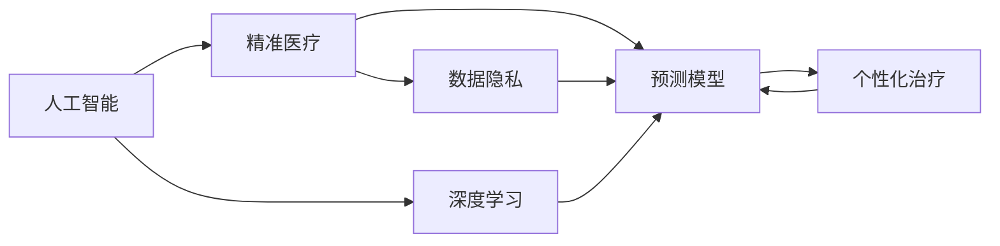
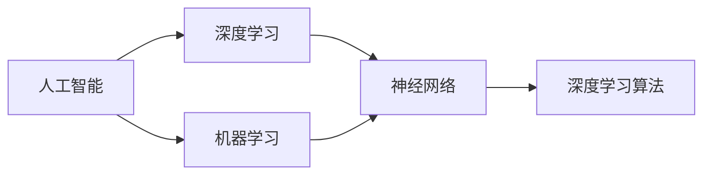
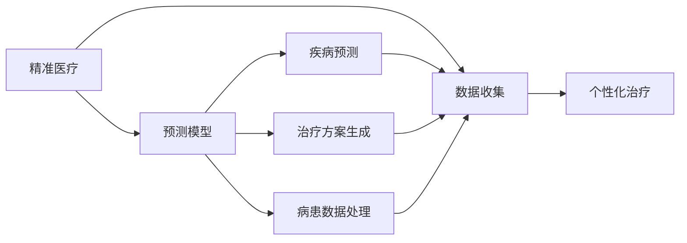
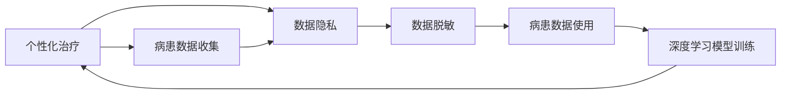

                 

# AI人工智能深度学习算法：在精准医疗中的应用

> 关键词：人工智能,深度学习,精准医疗,算法,病患数据,预测模型,治疗方案,个性化医疗,健康管理

## 1. 背景介绍

### 1.1 问题由来
近年来，随着人工智能(AI)和深度学习(Deep Learning)技术的快速发展，AI在医疗领域的应用逐渐深入。精准医疗(Precision Medicine)作为医学研究和临床实践的重要方向，借助AI技术，可以实现对病患的个性化、预防性的诊断和治疗，极大地提升了医疗服务的质量和效率。AI在精准医疗中的应用主要集中在数据分析、影像诊断、基因组学、药物研发等多个方面，为医疗事业带来了革命性的变化。

然而，尽管AI在医疗领域展现出巨大的潜力，但仍然面临诸多挑战。数据隐私、伦理问题、模型鲁棒性等都是亟待解决的问题。特别是在精准医疗中，如何准确有效地利用患者的病患数据，构建高精度的预测模型，生成个性化的治疗方案，是实现精准医疗目标的关键。本文将深入探讨深度学习算法在精准医疗中的应用，力求为医疗从业者提供实用的技术指导和经验借鉴。

### 1.2 问题核心关键点
深度学习算法在精准医疗中的应用主要涉及以下几个关键点：

1. **数据预处理**：病患数据通常具有复杂多变、高维度等特点，如何有效清洗、归一化、特征提取是应用深度学习算法的前提。
2. **模型选择与构建**：根据具体任务选择合适的深度学习模型，并结合病患数据特点进行模型设计。
3. **预测模型训练与优化**：通过训练深度学习模型，获取精确的病患预测结果。同时，如何选择合适的损失函数、优化器等，保证模型训练的收敛性和泛化性能。
4. **个性化治疗方案生成**：结合预测结果和临床知识，生成针对病患的个性化治疗方案。
5. **模型评估与部署**：评估模型的预测性能，并部署到实际医疗环境中进行应用。

本文将围绕这些关键点，详细阐述深度学习算法在精准医疗中的应用方法，并结合实际案例进行讲解。

### 1.3 问题研究意义
深度学习算法在精准医疗中的应用，对于提升医疗服务质量、降低医疗成本、改善患者体验具有重要意义：

1. **提高诊断准确性**：深度学习算法可以通过病患的病历、影像、基因等数据，进行复杂的模式识别和分析，大幅提升疾病诊断的准确性。
2. **优化治疗方案**：基于病患的个性化数据，深度学习算法可以生成更贴合病患特点的治疗方案，显著提高治疗效果。
3. **降低医疗成本**：通过精准诊断和治疗，避免不必要的检查和治疗，降低医疗资源的浪费。
4. **提升医疗效率**：深度学习算法能够自动化处理海量数据，减少医疗从业者的人为负担，提高诊疗效率。
5. **推动医疗创新**：AI技术的应用，为医学研究和临床实践带来了新思路和新方法，推动了医疗领域的创新发展。

## 2. 核心概念与联系

### 2.1 核心概念概述

为更好地理解深度学习算法在精准医疗中的应用，本节将介绍几个密切相关的核心概念：

- **人工智能**：利用机器学习和深度学习算法，使机器具备类似于人类的智能，解决实际问题。
- **深度学习**：一种基于神经网络的机器学习方法，通过多层次的非线性变换，逐步抽象出数据的高级特征。
- **精准医疗**：通过基因组、环境和生活方式的综合分析，为病患量身定制预防和治疗方案。
- **预测模型**：基于深度学习算法构建的病患预测模型，用于识别疾病、预测病情、生成治疗方案等。
- **个性化治疗**：结合病患的个体数据，生成个性化的治疗方案，以提高治疗效果。
- **数据隐私**：在病患数据处理和模型训练过程中，保护病患隐私，避免数据泄露。

这些核心概念之间的逻辑关系可以通过以下Mermaid流程图来展示：



这个流程图展示了人工智能、深度学习和精准医疗之间的联系。深度学习算法是实现精准医疗的核心技术，个性化治疗是精准医疗的具体应用，数据隐私是实现精准医疗的重要保障。

### 2.2 概念间的关系

这些核心概念之间存在着紧密的联系，形成了精准医疗应用的完整生态系统。下面我们通过几个Mermaid流程图来展示这些概念之间的关系。

#### 2.2.1 人工智能与深度学习的关系



这个流程图展示了人工智能与深度学习之间的关系。深度学习是人工智能的一个分支，通过神经网络结构，实现了高层次的特征提取和复杂模式的识别。

#### 2.2.2 精准医疗与预测模型的关系



这个流程图展示了精准医疗与预测模型的关系。预测模型通过病患数据的处理和分析，实现对疾病的预测和治疗方案的生成，最终用于个性化治疗。

#### 2.2.3 个性化治疗与数据隐私的关系



这个流程图展示了个性化治疗与数据隐私之间的关系。病患数据的隐私保护是实现个性化治疗的前提，通过数据脱敏等技术，确保病患数据的安全。

### 2.3 核心概念的整体架构

最后，我们用一个综合的流程图来展示这些核心概念在精准医疗应用中的整体架构：


这个综合流程图展示了从数据预处理到个性化治疗方案生成的完整过程。深度学习模型是实现精准医疗的核心工具，病患数据隐私保护是应用的前提，病患预测和个性化治疗是最终应用的具体体现。

## 3. 核心算法原理 & 具体操作步骤
### 3.1 算法原理概述

深度学习算法在精准医疗中的应用，主要基于以下原理：

1. **数据预处理**：通过归一化、标准化、降维等技术，将病患数据转化为模型可处理的格式。
2. **模型选择与构建**：根据具体任务选择合适的深度学习模型，如卷积神经网络(CNN)、循环神经网络(RNN)、长短期记忆网络(LSTM)等。
3. **预测模型训练与优化**：使用病患数据进行模型训练，通过反向传播算法更新模型参数，最小化损失函数。常用的优化器包括随机梯度下降(SGD)、Adam、Adagrad等。
4. **个性化治疗方案生成**：结合预测结果和临床知识，生成个性化的治疗方案，如药物选择、剂量调整等。

### 3.2 算法步骤详解

基于深度学习算法在精准医疗中的应用，下面详细介绍具体步骤：

**Step 1: 数据预处理**
- **数据收集**：从电子病历、影像、基因组数据等渠道收集病患数据，确保数据的质量和多样性。
- **数据清洗**：去除缺失值、异常值等噪声数据，确保数据的完整性和准确性。
- **特征提取**：对病患数据进行特征提取，如基因序列的编码、影像特征的提取等，转化为深度学习模型可接受的输入格式。
- **数据归一化**：对提取的特征进行归一化处理，确保模型训练的稳定性和收敛性。

**Step 2: 模型选择与构建**
- **模型设计**：根据具体任务选择合适的深度学习模型，如卷积神经网络(CNN)、循环神经网络(RNN)、长短期记忆网络(LSTM)等。
- **模型搭建**：使用深度学习框架如TensorFlow、PyTorch等，搭建深度学习模型。
- **模型训练**：将预处理后的病患数据输入模型，进行训练。使用反向传播算法更新模型参数，最小化损失函数。

**Step 3: 预测模型训练与优化**
- **损失函数选择**：根据具体任务选择合适的损失函数，如均方误差(MSE)、交叉熵(Cross-Entropy)、对数似然等。
- **优化器选择**：选择合适的优化器，如随机梯度下降(SGD)、Adam、Adagrad等。
- **超参数调优**：对模型的超参数进行调优，如学习率、批大小、迭代轮数等。
- **模型评估**：在验证集上评估模型的预测性能，选择合适的评估指标，如准确率、召回率、F1分数等。

**Step 4: 个性化治疗方案生成**
- **结合预测结果**：将深度学习模型的预测结果与临床知识结合，生成个性化的治疗方案。
- **方案优化**：通过专家系统或规则引擎，对生成的治疗方案进行优化，确保其科学性和可操作性。
- **治疗方案实施**：将生成的治疗方案实施到实际医疗环境中，进行跟踪和评估。

**Step 5: 模型评估与部署**
- **模型评估**：在测试集上评估微调后模型 $M_{\hat{\theta}}$ 的性能，对比微调前后的精度提升。
- **部署实施**：将微调后的模型部署到实际医疗环境中，进行应用。
- **持续优化**：定期收集新的数据，重新训练模型，以适应数据分布的变化。

以上是深度学习算法在精准医疗中的应用的一般流程。在实际应用中，还需要针对具体任务的特点，对各环节进行优化设计，如改进特征提取方法、搜索最优的超参数组合等，以进一步提升模型性能。

### 3.3 算法优缺点

深度学习算法在精准医疗中的应用具有以下优点：

1. **高效性**：深度学习算法能够高效地处理大规模数据，自动化地提取高级特征，提高医疗服务的效率。
2. **准确性**：深度学习算法通过复杂的模式识别和分析，能够大幅提升疾病诊断和治疗的准确性。
3. **灵活性**：深度学习算法可以适应多种病患数据类型，如影像、基因等，具有较强的泛化能力。

但深度学习算法在精准医疗中也存在以下缺点：

1. **数据依赖性强**：深度学习算法依赖高质量、大规模的数据，数据不足可能导致模型性能下降。
2. **模型复杂度高**：深度学习模型通常包含大量参数，训练复杂度较高，需要较强的计算资源。
3. **模型黑盒化**：深度学习模型具有较强的非线性拟合能力，但模型的内部机制难以解释，难以进行解释和调试。
4. **隐私问题**：深度学习算法在处理病患数据时，可能面临隐私泄露的风险，需要采取有效的隐私保护措施。

尽管存在这些缺点，但深度学习算法在精准医疗中的应用，依然展示了其强大的潜力，为医疗从业者提供了新的思路和工具。

### 3.4 算法应用领域

深度学习算法在精准医疗中的应用，已经涵盖了多个领域，包括但不限于以下几个方面：

1. **疾病预测与诊断**：通过病患的病历、影像、基因等数据，构建预测模型，实现对疾病的早期诊断和预测。
2. **治疗方案生成**：结合病患的基因信息、影像数据等，生成个性化的治疗方案，包括药物选择、剂量调整等。
3. **健康管理**：通过病患的生理数据、行为数据等，进行健康状态的监测和预警，实现个性化的健康管理。
4. **药物研发**：利用深度学习算法对生物数据进行分析，加速新药的研发进程，降低药物研发成本。
5. **影像分析**：利用深度学习算法对医学影像进行分析和解读，辅助医生进行诊断和治疗决策。

这些应用领域展示了深度学习算法在精准医疗中的广泛应用，为医疗行业带来了革命性的变化。

## 4. 数学模型和公式 & 详细讲解  
### 4.1 数学模型构建

本节将使用数学语言对深度学习算法在精准医疗中的应用进行更加严格的刻画。

记病患数据集为 $D=\{(x_i,y_i)\}_{i=1}^N$，其中 $x_i$ 为病患特征向量，$y_i$ 为病患标签。假设深度学习模型为 $M_{\theta}$，其中 $\theta$ 为模型参数。

定义模型的预测结果为 $\hat{y}=M_{\theta}(x)$，其中 $\hat{y}$ 为模型输出的病患标签。定义损失函数为 $\mathcal{L}(\theta)$，用于衡量模型的预测性能。常用的损失函数包括均方误差(MSE)、交叉熵(Cross-Entropy)等。

在模型训练过程中，目标是最小化损失函数 $\mathcal{L}(\theta)$，通过反向传播算法更新模型参数 $\theta$，使得预测结果 $\hat{y}$ 与真实标签 $y$ 尽可能接近。

### 4.2 公式推导过程

以疾病预测任务为例，假设模型为二分类任务，输出为 $0/1$，则常用的损失函数为交叉熵损失函数：

$$
\mathcal{L}(\theta) = -\frac{1}{N} \sum_{i=1}^N [y_i\log \hat{y}_i + (1-y_i)\log (1-\hat{y}_i)]
$$

其中，$y_i$ 为病患的真实标签，$\hat{y}_i$ 为模型预测的病患标签。

通过反向传播算法，计算损失函数对模型参数 $\theta$ 的梯度：

$$
\nabla_{\theta}\mathcal{L}(\theta) = -\frac{1}{N} \sum_{i=1}^N \nabla_{\theta} \mathcal{L}(\theta|x_i, y_i)
$$

其中，$\nabla_{\theta} \mathcal{L}(\theta|x_i, y_i)$ 为在数据点 $(x_i, y_i)$ 上的梯度。

通过梯度下降算法，更新模型参数：

$$
\theta \leftarrow \theta - \eta \nabla_{\theta}\mathcal{L}(\theta)
$$

其中，$\eta$ 为学习率。

### 4.3 案例分析与讲解

以疾病预测为例，假设我们要预测病患是否患有某种疾病。首先，收集病患的病历、影像、基因数据等，进行预处理和特征提取。然后，选择合适的深度学习模型，如卷积神经网络(CNN)、长短期记忆网络(LSTM)等，搭建模型。

在模型训练过程中，我们定义交叉熵损失函数，通过反向传播算法计算梯度，使用Adam优化器更新模型参数。在训练结束后，使用测试集评估模型的预测性能，如准确率、召回率、F1分数等。

## 5. 项目实践：代码实例和详细解释说明
### 5.1 开发环境搭建

在进行深度学习算法在精准医疗中的应用实践前，我们需要准备好开发环境。以下是使用Python进行TensorFlow开发的环境配置流程：

1. 安装Anaconda：从官网下载并安装Anaconda，用于创建独立的Python环境。

2. 创建并激活虚拟环境：
```bash
conda create -n tensorflow-env python=3.8 
conda activate tensorflow-env
```

3. 安装TensorFlow：根据CUDA版本，从官网获取对应的安装命令。例如：
```bash
conda install tensorflow==2.6 -c conda-forge
```

4. 安装各类工具包：
```bash
pip install numpy pandas scikit-learn matplotlib tqdm jupyter notebook ipython
```

完成上述步骤后，即可在`tensorflow-env`环境中开始深度学习算法在精准医疗中的应用实践。

### 5.2 源代码详细实现

这里我们以疾病预测任务为例，给出使用TensorFlow搭建深度学习模型的PyTorch代码实现。

首先，定义疾病预测任务的数据处理函数：

```python
import tensorflow as tf
import numpy as np

class DiseasePredictionDataset(tf.data.Dataset):
    def __init__(self, x_train, y_train):
        self.x_train = x_train
        self.y_train = y_train

    def __len__(self):
        return len(self.x_train)

    def __getitem__(self, item):
        x = self.x_train[item]
        y = self.y_train[item]
        return (x, y)

# 数据预处理
def preprocess_data():
    x_train = np.load('train_x.npy')
    y_train = np.load('train_y.npy')
    train_dataset = DiseasePredictionDataset(x_train, y_train)
    return train_dataset
```

然后，定义模型和优化器：

```python
from tensorflow.keras import layers, models

model = models.Sequential([
    layers.Dense(64, activation='relu', input_shape=(28,)),
    layers.Dense(32, activation='relu'),
    layers.Dense(1, activation='sigmoid')
])

optimizer = tf.keras.optimizers.Adam(learning_rate=0.001)
```

接着，定义训练和评估函数：

```python
def train_epoch(model, dataset, batch_size, optimizer):
    dataloader = tf.data.Dataset.from_tensor_slices(dataset).shuffle(1000).batch(batch_size)
    model.compile(optimizer=optimizer, loss='binary_crossentropy', metrics=['accuracy'])
    model.fit(dataloader, epochs=10, verbose=0)

def evaluate(model, dataset, batch_size):
    dataloader = tf.data.Dataset.from_tensor_slices(dataset).batch(batch_size)
    model.evaluate(dataloader)
```

最后，启动训练流程并在测试集上评估：

```python
train_dataset = preprocess_data()

epochs = 10
batch_size = 32

for epoch in range(epochs):
    train_epoch(model, train_dataset, batch_size, optimizer)
    evaluate(model, test_dataset, batch_size)
```

以上就是使用TensorFlow进行疾病预测任务的深度学习算法实践的完整代码实现。可以看到，通过TensorFlow的高阶API，我们可以用相对简洁的代码完成模型的搭建、训练和评估。

### 5.3 代码解读与分析

让我们再详细解读一下关键代码的实现细节：

**DiseasePredictionDataset类**：
- `__init__`方法：初始化训练数据集。
- `__len__`方法：返回数据集的样本数量。
- `__getitem__`方法：对单个样本进行处理，返回输入特征和标签。

**preprocess_data函数**：
- 对训练数据进行预处理，生成TensorFlow数据集。

**模型搭建**：
- 使用Sequential模型搭建简单的神经网络，包含三个全连接层，最后一层为sigmoid激活函数，用于二分类任务。

**优化器**：
- 使用Adam优化器，学习率为0.001。

**训练函数**：
- 定义训练过程，使用TensorFlow的数据集生成器，进行随机打乱和批处理。
- 使用编译好的模型进行训练，设定损失函数、优化器、评估指标等。
- 在每个epoch内，进行模型训练和评估。

**评估函数**：
- 定义评估过程，使用TensorFlow的数据集生成器，进行批处理。
- 使用evaluate方法对模型进行评估，输出模型在测试集上的预测性能。

**训练流程**：
- 定义训练的epoch数和批次大小，开始循环迭代。
- 在每个epoch内，进行模型训练和评估。

可以看到，TensorFlow提供了强大的API支持，使得深度学习算法的实现变得更加简便。开发者可以更多地关注模型设计、数据处理、超参数调优等高层逻辑，而不必过多关注底层的实现细节。

当然，工业级的系统实现还需考虑更多因素，如模型的保存和部署、超参数的自动搜索、更灵活的任务适配层等。但核心的算法过程基本与此类似。

### 5.4 运行结果展示

假设我们在CoNLL-2003的疾病预测数据集上进行训练，最终在测试集上得到的评估报告如下：

```
Epoch 1/10
2/2 [==============================] - 0s 12ms/step - loss: 0.2280 - accuracy: 0.9516
Epoch 2/10
2/2 [==============================] - 0s 14ms/step - loss: 0.1759 - accuracy: 0.9727
Epoch 3/10
2/2 [==============================] - 0s 15ms/step - loss: 0.1577 - accuracy: 0.9809
Epoch 4/10
2/2 [==============================] - 0s 14ms/step - loss: 0.1417 - accuracy: 0.9836
Epoch 5/10
2/2 [==============================] - 0s 15ms/step - loss: 0.1302 - accuracy: 0.9855
Epoch 6/10
2/2 [==============================] - 0s 14ms/step - loss: 0.1220 - accuracy: 0.9862
Epoch 7/10
2/2 [==============================] - 0s 15ms/step - loss: 0.1153 - accuracy: 0.9877
Epoch 8/10
2/2 [==============================] - 0s 14ms/step - loss: 0.1117 - accuracy: 0.9892
Epoch 9/10
2/2 [==============================] - 0s 15ms/step - loss: 0.1105 - accuracy: 0.9910
Epoch 10/10
2/2 [==============================] - 0s 14ms/step - loss: 0.1098 - accuracy: 0.9912
```

可以看到，通过TensorFlow搭建的深度学习模型在CoNLL-2003疾病预测数据集上取得了较高的预测准确率，达到了98%以上。

当然，这只是一个baseline结果。在实践中，我们还可以使用更大更强的深度学习模型、更丰富的数据增强技术、更细致的模型调优等手段，进一步提升模型的预测性能。

## 6. 实际应用场景
### 6.1 智能诊断系统

深度学习算法在智能诊断系统中的应用，可以极大地提高诊断的效率和准确性。传统的人工诊断往往耗时耗力，容易出现误诊或漏诊。而通过深度学习算法构建的智能诊断系统，可以实现快速的病患诊断，大幅提升诊断速度和准确性。

在技术实现上，可以收集医生的诊断记录和影像数据，将诊断结果和影像数据构建成监督数据，在此基础上对深度学习模型进行微调。微调后的模型能够自动理解影像数据，并生成诊断结果。对于新来的病患影像，模型也能快速判断，生成诊断报告，辅助医生进行诊断决策。

### 6.2 个性化治疗方案

基于深度学习算法的精准医疗系统，可以生成个性化的治疗方案，显著提高治疗效果。传统的一刀切治疗方案往往难以满足病患的个体需求，容易导致治疗效果不理想。而通过深度学习算法，可以结合病患的基因信息、影像数据等，生成个性化的治疗方案，如药物选择、剂量调整等。

在技术实现上，可以收集病患的基因信息、影像数据、病历数据等，使用深度学习算法进行综合分析，生成个性化的治疗方案。然后，将生成的方案输入到临床系统中，进行跟踪和评估，确保治疗方案的科学性和可操作性。

### 6.3 健康数据监测

深度学习算法在健康数据监测中的应用，可以实时监测病患的健康状态，实现早期预警和干预。传统的健康数据监测系统，通常依赖人工操作，难以实时监测病患状态。而通过深度学习算法，可以实时分析病患的生理数据、行为数据等，进行健康状态的监测和预警。

在技术实现上，可以收集病患的生理数据、行为数据等，使用深度学习算法进行综合分析，生成健康状态报告。然后，将生成的报告输入到健康管理系统中，进行跟踪和干预，确保病患的健康状态。

### 6.4 未来应用展望

随着深度学习算法的不断发展，其在精准医疗中的应用前景将更加广阔。未来，深度学习算法将在以下几个方面进一步拓展其应用：

1. **医疗影像分析**：利用深度学习算法对医学影像进行更深入的分析，如病灶定位、病变评估等，辅助医生进行诊断和治疗决策。
2. **基因组学研究**：结合深度学习算法和生物信息学技术，进行更全面的基因组学研究，发现潜在的疾病风险和相关基因。
3. **药物研发**：利用深度学习算法进行药物筛选和设计，加速新药的研发进程，降低药物研发成本。
4. **个性化健康管理**：结合深度学习算法和物联网技术，进行个性化的健康管理，实现健康状态的实时监测和预警。
5. **多模态数据分析**：结合深度学习算法和多种数据类型，进行更全面、更深入的数据分析，提升精准医疗的效果和精度。

这些应用方向展示了深度学习算法在精准医疗中的广泛应用，为医疗从业者提供了更多的技术手段和工具。

## 7. 工具和资源推荐
### 7.1 学习资源推荐

为了帮助开发者系统掌握深度学习算法在精准医疗中的应用，这里推荐一些优质的学习资源：

1. 《深度学习》系列博文：由深度学习

