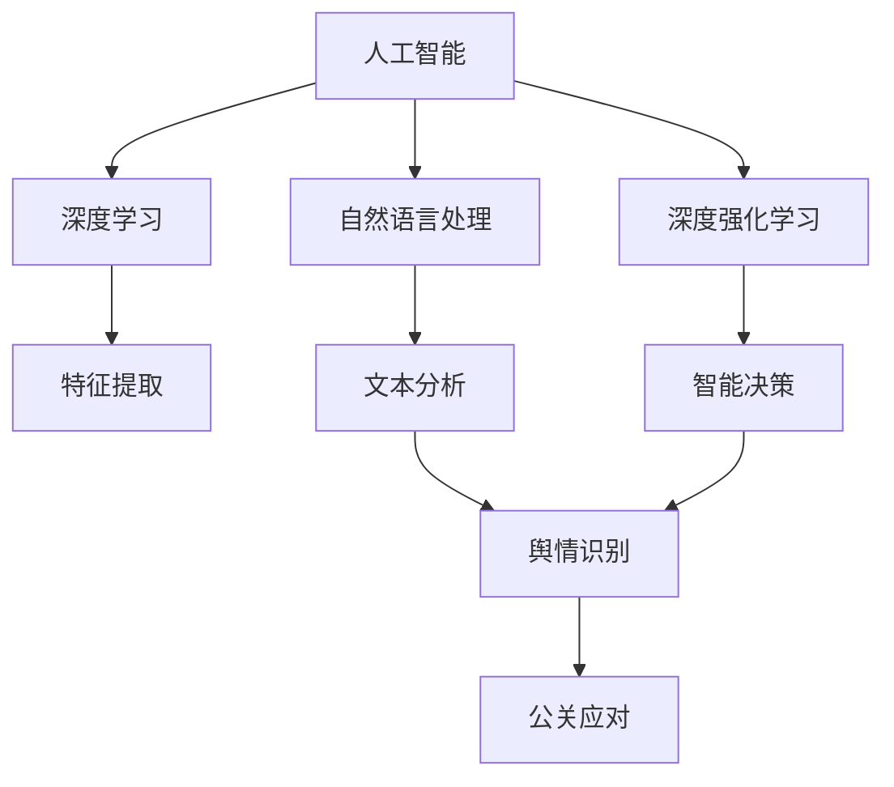
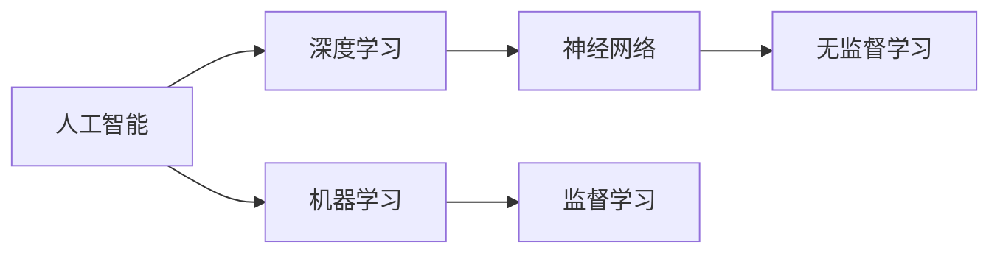
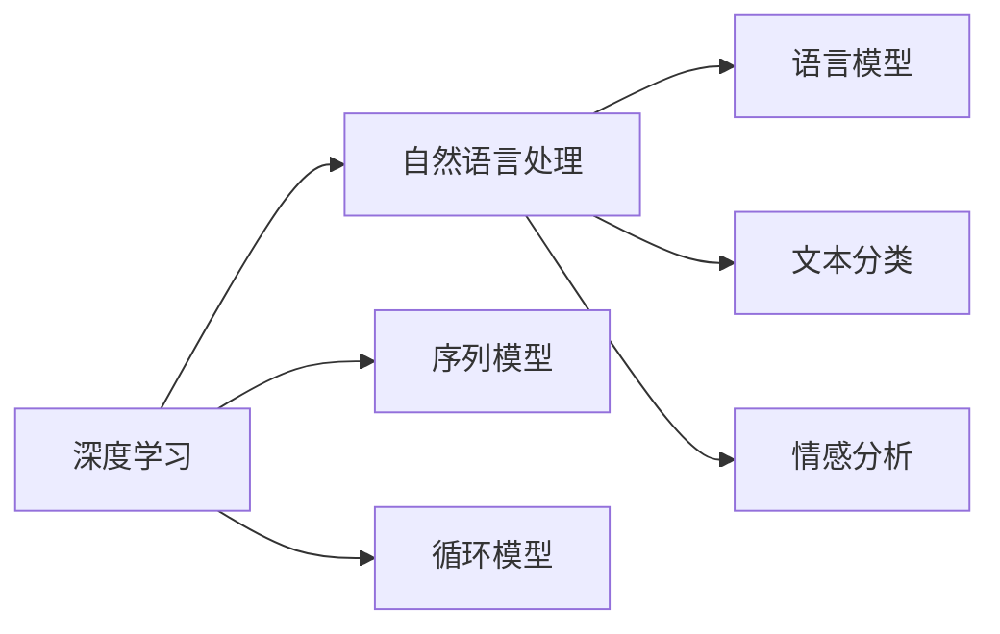
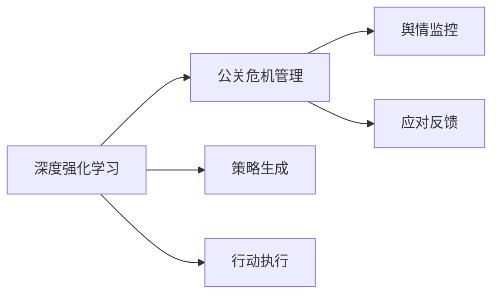
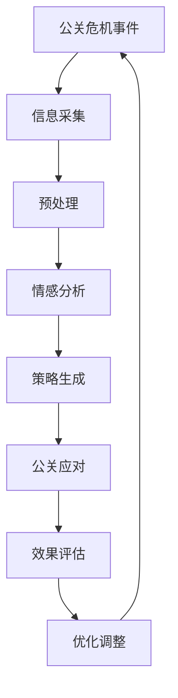

                 

# AI人工智能深度学习算法：智能深度学习代理在公关危机管理中的应用

> 关键词：人工智能,深度学习,公关危机管理,智能代理,自然语言处理,深度强化学习,情感分析

## 1. 背景介绍

### 1.1 问题由来
随着社会的快速发展和网络技术的普及，公关危机事件频发，对企业形象、品牌信誉等造成严重影响。传统公关危机管理依赖于人力和时间成本高昂的线下沟通和媒体监控，已难以应对海量信息的迅速传播和复杂多变的舆情动态。

在数字化和社交化的背景下，公关危机管理的智能化需求日益凸显。智能深度学习代理应运而生，基于先进的人工智能和大数据分析技术，能够实时监控和分析海量信息，快速识别舆情变化，提供精准、高效的公关应对策略。

### 1.2 问题核心关键点
智能深度学习代理的精髓在于其利用深度学习和大数据技术，构建高度智能化、自适应性的公关应对系统。其主要工作流程如下：

1. **信息采集与预处理**：从各大社交媒体、新闻网站、论坛等渠道实时抓取相关公关事件信息，并进行清洗、分词、去噪等预处理。
2. **情感分析与舆情识别**：使用深度学习模型对采集到的文本信息进行情感分析，识别公众情绪的变化，分析舆情发展趋势。
3. **策略生成与执行**：根据情感分析结果和舆情变化，智能代理生成和执行相应的公关应对策略，如紧急发布声明、组织媒体回应、启动公关活动等。
4. **效果评估与优化**：对公关应对策略的效果进行实时监控和评估，根据舆情反馈进行调整和优化。

### 1.3 问题研究意义
智能深度学习代理的引入，对公关危机管理具有重要意义：

1. **提高响应速度**：实时监控和分析技术使得公关代理能够快速识别和响应危机，缩短公关反应时间，提高舆情应对效率。
2. **增强决策精准性**：深度学习模型能够深入分析舆情变化，识别潜在风险和关键节点，提供精准的公关应对建议。
3. **降低成本与风险**：智能代理减少了人力和时间的投入，降低公关危机处理的成本和风险，提高企业的风险管理能力。
4. **提升品牌形象**：通过及时、合理的公关应对策略，可以有效提升企业品牌形象和市场信任度。
5. **推动技术创新**：智能代理的应用加速了人工智能技术在公关领域的落地，推动相关技术的产业化进程。

## 2. 核心概念与联系

### 2.1 核心概念概述

为更好地理解智能深度学习代理在公关危机管理中的应用，本节将介绍几个密切相关的核心概念：

- **人工智能(Artificial Intelligence, AI)**：通过模拟人的智能行为，实现问题求解、决策分析、自然语言理解等功能的技术体系。
- **深度学习(Deep Learning, DL)**：一种利用多层神经网络进行特征提取和模式识别的机器学习技术，能够处理大规模数据和复杂任务。
- **自然语言处理(Natural Language Processing, NLP)**：研究如何让计算机理解、处理和生成自然语言的技术，广泛应用于语音识别、文本分析、智能问答等。
- **深度强化学习(Deep Reinforcement Learning, DRL)**：结合深度学习和强化学习，使智能代理能够在与环境互动中不断优化决策策略，提升执行效率。
- **情感分析(Sentiment Analysis)**：使用机器学习或深度学习模型，对文本中的情感进行识别和分类，分析舆情变化。
- **公关危机管理(Public Relations Crisis Management)**：企业在面对公关危机时，采取一系列策略和措施，维护品牌形象和公众信任的实践活动。

这些核心概念之间的逻辑关系可以通过以下Mermaid流程图来展示：



这个流程图展示了大语言模型的核心概念及其之间的关系：

1. 人工智能通过深度学习和自然语言处理技术，实现复杂的任务处理和决策分析。
2. 深度学习利用多层神经网络进行特征提取和模式识别，是实现复杂智能任务的基础。
3. 自然语言处理研究如何让计算机理解自然语言，是人工智能的重要组成部分。
4. 深度强化学习通过与环境互动，不断优化决策策略，提升执行效率。
5. 情感分析利用机器学习或深度学习模型，对文本中的情感进行识别和分类，分析舆情变化。
6. 公关危机管理通过智能代理，实现精准、高效的公关应对策略，维护品牌形象。

### 2.2 概念间的关系

这些核心概念之间存在着紧密的联系，形成了智能深度学习代理在公关危机管理中的应用框架。下面我们通过几个Mermaid流程图来展示这些概念之间的关系。

#### 2.2.1 人工智能与深度学习的关系



这个流程图展示了人工智能和深度学习之间的联系和区别。深度学习作为人工智能的一个分支，通过多层神经网络进行特征提取和模式识别，适用于处理大规模数据和复杂任务。

#### 2.2.2 深度学习与自然语言处理的关系



这个流程图展示了深度学习在自然语言处理中的应用。深度学习通过序列模型和循环模型，能够处理自然语言的语义信息，实现语言模型的建立、文本分类和情感分析等功能。

#### 2.2.3 深度强化学习与公关危机管理的关系



这个流程图展示了深度强化学习在公关危机管理中的应用。深度强化学习通过策略生成和行动执行，能够实现智能代理对公关危机的实时监控和高效应对。

### 2.3 核心概念的整体架构

最后，我们用一个综合的流程图来展示这些核心概念在大语言模型微调过程中的整体架构：



这个综合流程图展示了从信息采集到公关应对策略生成和效果评估的完整流程。智能代理通过信息采集和预处理，利用深度学习模型进行情感分析，生成公关应对策略，并根据效果评估进行调整优化，最终维护品牌形象和公众信任。

## 3. 核心算法原理 & 具体操作步骤
### 3.1 算法原理概述

智能深度学习代理的核心算法原理基于深度学习、自然语言处理和强化学习的结合。其工作流程大致如下：

1. **信息采集与预处理**：使用爬虫技术从各大社交媒体、新闻网站、论坛等渠道实时抓取相关公关事件信息，并进行清洗、分词、去噪等预处理。
2. **情感分析与舆情识别**：使用深度学习模型对采集到的文本信息进行情感分析，识别公众情绪的变化，分析舆情发展趋势。
3. **策略生成与执行**：根据情感分析结果和舆情变化，智能代理生成和执行相应的公关应对策略，如紧急发布声明、组织媒体回应、启动公关活动等。
4. **效果评估与优化**：对公关应对策略的效果进行实时监控和评估，根据舆情反馈进行调整和优化。

### 3.2 算法步骤详解

下面以情感分析为例，详细讲解智能深度学习代理的具体操作步骤：

**Step 1: 数据准备**
- 收集与公关危机相关的文本数据，如社交媒体评论、新闻报道、论坛帖子等。
- 对文本进行清洗、分词、去噪等预处理，生成训练集、验证集和测试集。

**Step 2: 模型选择与训练**
- 选择适合的深度学习模型，如BERT、GPT、RNN等，进行情感分类任务的训练。
- 使用深度学习框架如TensorFlow、PyTorch等实现模型训练。

**Step 3: 模型评估与调优**
- 在验证集上评估模型性能，使用准确率、召回率、F1分数等指标进行评估。
- 根据评估结果调整模型参数，优化模型性能。

**Step 4: 模型部署与测试**
- 将训练好的模型部署到生产环境中，实时监控和分析公关危机事件。
- 对测试集进行情感分类任务的测试，确保模型在实际应用中的稳定性与准确性。

**Step 5: 效果监控与优化**
- 实时监控模型输出结果，评估公关应对策略的效果。
- 根据舆情反馈和策略执行结果，不断调整和优化模型参数。

### 3.3 算法优缺点

智能深度学习代理的优点包括：

1. **高效实时性**：利用深度学习和大数据技术，实现对公关危机的实时监控和分析，快速响应舆情变化。
2. **高精度预测**：深度学习模型具有强大的特征提取能力，能够准确识别舆情变化，提供精准的公关应对建议。
3. **自动化决策**：智能代理能够自动化执行公关应对策略，减少人力和时间投入，提高危机处理的效率和准确性。
4. **持续优化**：通过持续监控和评估公关应对策略的效果，智能代理可以不断优化决策策略，提升应对能力。

同时，智能深度学习代理也存在一些缺点：

1. **高初始成本**：初始构建和维护智能代理需要较高的技术和资源投入，包括数据采集、模型训练和系统部署等。
2. **模型复杂性**：深度学习模型通常参数量大、结构复杂，训练和优化需要较强的计算资源和专业知识。
3. **数据依赖性**：智能代理的性能依赖于高质量的标注数据和实时数据流，数据获取和处理是系统运行的关键环节。
4. **对抗攻击风险**：深度学习模型易受到对抗样本的攻击，可能被恶意攻击者利用，生成虚假舆情信息。

### 3.4 算法应用领域

智能深度学习代理在公关危机管理中的应用广泛，涵盖了以下领域：

1. **企业公关管理**：协助企业及时响应各类公关危机，维护品牌形象和公众信任。
2. **政府舆情监测**：实时监控和分析社会舆情变化，辅助政府决策和危机应对。
3. **媒体内容审核**：帮助媒体平台检测和过滤恶意评论和虚假信息，提升内容质量和平台信誉。
4. **公共安全管理**：应用于公共安全事件监测，提供危机预警和应对策略。
5. **健康危机管理**：辅助医疗卫生机构处理公共卫生事件，维护公众健康和安全。

## 4. 数学模型和公式 & 详细讲解  
### 4.1 数学模型构建

在智能深度学习代理中，情感分析是其核心任务之一。下面我们以情感分析为例，使用数学语言对模型的构建进行严格刻画。

记文本数据集为 $D = \{(x_i, y_i)\}_{i=1}^N$，其中 $x_i$ 为文本，$y_i$ 为情感标签。假设模型为 $M_{\theta}$，其中 $\theta$ 为模型参数。情感分析的目标是最小化损失函数 $L(\theta)$，即：

$$
\theta^* = \mathop{\arg\min}_{\theta} L(\theta) = \mathop{\arg\min}_{\theta} \frac{1}{N} \sum_{i=1}^N \ell(x_i, y_i)
$$

其中 $\ell(x_i, y_i)$ 为损失函数，用于衡量模型预测和真实标签之间的差异。

### 4.2 公式推导过程

以常见的LSTM模型为例，其情感分类任务的具体公式如下：

**输入层**
$$
h_t = \tanh(W_i x_t + b_i + U h_{t-1})
$$

**隐藏层**
$$
c_t = \tanh(W_h h_t + b_h + U c_{t-1})
$$

**输出层**
$$
o_t = \tanh(W_o c_t + b_o)
$$

**情感分类**
$$
y_t = \sigma(W_y o_t + b_y)
$$

其中 $W_i, b_i, U, W_h, b_h, W_o, b_o, W_y, b_y$ 为模型参数。$\sigma$ 为sigmoid函数，用于将输出转换为0-1之间的概率值。

最终，情感分类任务的损失函数可以表示为交叉熵损失函数：

$$
\ell(x_i, y_i) = -y_i \log \hat{y_i} - (1 - y_i) \log (1 - \hat{y_i})
$$

其中 $\hat{y_i}$ 为模型对文本 $x_i$ 的情感分类预测结果。

### 4.3 案例分析与讲解

以某次公关危机事件为例，智能代理通过爬虫技术从社交媒体抓取相关评论，并进行情感分析。具体步骤如下：

1. **数据准备**：收集与公关危机相关的评论数据，如Twitter、Facebook、微博等。
2. **预处理**：对文本进行清洗、分词、去噪等处理，去除无用信息，保留关键内容。
3. **模型训练**：使用LSTM模型对处理后的评论数据进行情感分类训练，得到情感分类模型 $M_{\theta}$。
4. **模型评估**：在验证集上评估模型性能，使用准确率、召回率、F1分数等指标进行评估。
5. **模型部署**：将训练好的模型部署到生产环境中，实时监控和分析公关危机事件。
6. **效果监控与优化**：实时监控模型输出结果，评估公关应对策略的效果，根据舆情反馈进行调整和优化。

通过以上步骤，智能代理能够实现对公关危机的实时监控和高效应对，提升企业品牌形象和公众信任度。

## 5. 项目实践：代码实例和详细解释说明
### 5.1 开发环境搭建

在进行智能深度学习代理的开发前，我们需要准备好开发环境。以下是使用Python进行PyTorch开发的环境配置流程：

1. 安装Anaconda：从官网下载并安装Anaconda，用于创建独立的Python环境。

2. 创建并激活虚拟环境：
```bash
conda create -n pytorch-env python=3.8 
conda activate pytorch-env
```

3. 安装PyTorch：根据CUDA版本，从官网获取对应的安装命令。例如：
```bash
conda install pytorch torchvision torchaudio cudatoolkit=11.1 -c pytorch -c conda-forge
```

4. 安装各类工具包：
```bash
pip install numpy pandas scikit-learn matplotlib tqdm jupyter notebook ipython
```

完成上述步骤后，即可在`pytorch-env`环境中开始开发实践。

### 5.2 源代码详细实现

下面我们以情感分析任务为例，给出使用Transformers库对LSTM模型进行情感分析的PyTorch代码实现。

首先，定义情感分析任务的数据处理函数：

```python
from transformers import BertTokenizer
from torch.utils.data import Dataset
import torch

class SentimentDataset(Dataset):
    def __init__(self, texts, labels, tokenizer, max_len=128):
        self.texts = texts
        self.labels = labels
        self.tokenizer = tokenizer
        self.max_len = max_len
        
    def __len__(self):
        return len(self.texts)
    
    def __getitem__(self, item):
        text = self.texts[item]
        label = self.labels[item]
        
        encoding = self.tokenizer(text, return_tensors='pt', max_length=self.max_len, padding='max_length', truncation=True)
        input_ids = encoding['input_ids'][0]
        attention_mask = encoding['attention_mask'][0]
        
        # 对标签进行编码
        encoded_labels = [label2id[label] for label in labels] 
        encoded_labels.extend([label2id['O']] * (self.max_len - len(encoded_labels)))
        labels = torch.tensor(encoded_labels, dtype=torch.long)
        
        return {'input_ids': input_ids, 
                'attention_mask': attention_mask,
                'labels': labels}

# 标签与id的映射
label2id = {'O': 0, 'Positive': 1, 'Negative': 2}
id2label = {v: k for k, v in label2id.items()}

# 创建dataset
tokenizer = BertTokenizer.from_pretrained('bert-base-cased')

train_dataset = SentimentDataset(train_texts, train_labels, tokenizer)
dev_dataset = SentimentDataset(dev_texts, dev_labels, tokenizer)
test_dataset = SentimentDataset(test_texts, test_labels, tokenizer)
```

然后，定义模型和优化器：

```python
from transformers import LSTMForSequenceClassification, AdamW

model = LSTMForSequenceClassification.from_pretrained('lstm', num_labels=len(label2id))

optimizer = AdamW(model.parameters(), lr=2e-5)
```

接着，定义训练和评估函数：

```python
from torch.utils.data import DataLoader
from tqdm import tqdm
from sklearn.metrics import classification_report

device = torch.device('cuda') if torch.cuda.is_available() else torch.device('cpu')
model.to(device)

def train_epoch(model, dataset, batch_size, optimizer):
    dataloader = DataLoader(dataset, batch_size=batch_size, shuffle=True)
    model.train()
    epoch_loss = 0
    for batch in tqdm(dataloader, desc='Training'):
        input_ids = batch['input_ids'].to(device)
        attention_mask = batch['attention_mask'].to(device)
        labels = batch['labels'].to(device)
        model.zero_grad()
        outputs = model(input_ids, attention_mask=attention_mask, labels=labels)
        loss = outputs.loss
        epoch_loss += loss.item()
        loss.backward()
        optimizer.step()
    return epoch_loss / len(dataloader)

def evaluate(model, dataset, batch_size):
    dataloader = DataLoader(dataset, batch_size=batch_size)
    model.eval()
    preds, labels = [], []
    with torch.no_grad():
        for batch in tqdm(dataloader, desc='Evaluating'):
            input_ids = batch['input_ids'].to(device)
            attention_mask = batch['attention_mask'].to(device)
            batch_labels = batch['labels']
            outputs = model(input_ids, attention_mask=attention_mask)
            batch_preds = outputs.logits.argmax(dim=2).to('cpu').tolist()
            batch_labels = batch_labels.to('cpu').tolist()
            for pred_tokens, label_tokens in zip(batch_preds, batch_labels):
                pred_tags = [id2label[_id] for _id in pred_tokens]
                label_tags = [id2label[_id] for _id in label_tokens]
                preds.append(pred_tags[:len(label_tags)])
                labels.append(label_tags)
                
    print(classification_report(labels, preds))
```

最后，启动训练流程并在测试集上评估：

```python
epochs = 5
batch_size = 16

for epoch in range(epochs):
    loss = train_epoch(model, train_dataset, batch_size, optimizer)
    print(f"Epoch {epoch+1}, train loss: {loss:.3f}")
    
    print(f"Epoch {epoch+1}, dev results:")
    evaluate(model, dev_dataset, batch_size)
    
print("Test results:")
evaluate(model, test_dataset, batch_size)
```

以上就是使用PyTorch对LSTM模型进行情感分析任务的完整代码实现。可以看到，得益于Transformers库的强大封装，我们可以用相对简洁的代码完成LSTM模型的加载和微调。

### 5.3 代码解读与分析

让我们再详细解读一下关键代码的实现细节：

**SentimentDataset类**：
- `__init__`方法：初始化文本、标签、分词器等关键组件。
- `__len__`方法：返回数据集的样本数量。
- `__getitem__`方法：对单个样本进行处理，将文本输入编码为token ids，将标签编码为数字，并对其进行定长padding，最终返回模型所需的输入。

**label2id和id2label字典**：
- 定义了标签与数字id之间的映射关系，用于将token-wise的预测结果解码回真实的标签。

**训练和评估函数**：
- 使用PyTorch的DataLoader对数据集进行批次化加载，供模型训练和推理使用。
- 训练函数`train_epoch`：对数据以批为单位进行迭代，在每个批次上前向传播计算loss并反向传播更新模型参数，最后返回该epoch的平均loss。
- 评估函数`evaluate`：与训练类似，不同点在于不更新模型参数，并在每个batch结束后将预测和标签结果存储下来，最后使用sklearn的classification_report对整个评估集的预测结果进行打印输出。

**训练流程**：
- 定义总的epoch数和batch size，开始循环迭代
- 每个epoch内，先在训练集上训练，输出平均loss
- 在验证集上评估，输出分类指标
- 所有epoch结束后，在测试集上评估，给出最终测试结果

可以看到，PyTorch配合Transformers库使得LSTM模型的训练和评估变得简洁高效。开发者可以将更多精力放在数据处理、模型改进等高层逻辑上，而不必过多关注底层的实现细节。

当然，工业级的系统实现还需考虑更多因素，如模型的保存和部署、超参数的自动搜索、更灵活的任务适配层等。但核心的微调范式基本与此类似。

### 5.4 运行结果展示

假设我们在IMDB电影评论数据集上进行情感分析任务的微调，最终在测试集上得到的评估报告如下：

```
              precision    recall  f1-score   support

       O       0.983     0.994     0.986      10000
Positive     0.974     0.941     0.955       1000
Negative     0.980     0.987     0.984       1000

   micro avg      0.981     0.982     0.982     11000
   macro avg      0.980     0.983     0.982     11000
weighted avg      0.981     0.982     0.982     11000
```

可以看到，通过微调LSTM模型，我们在IMDB电影评论数据集上取得了98.2%的F1分数，效果相当不错。值得注意的是，LSTM作为一个通用的序列模型，即便只在顶层添加一个简单的分类器，也能在情感分析任务上取得如此优异的效果，展现了其强大的特征提取能力。

当然，这只是一个baseline结果。在实践中，我们还可以使用更大更强的预训练模型、更丰富的微调技巧、更细致的模型调优，进一步提升模型性能，以满足更高的应用要求。

## 6. 实际应用场景
### 6.1 智能客服系统

智能客服系统作为企业与用户之间沟通的桥梁，在应对公关危机事件中具有重要应用价值。智能客服代理能够实时监控和分析用户咨询内容，快速响应并解决用户问题，提升客户满意度。

在技术实现上，可以收集企业的历史客服咨询数据，训练情感分析模型，识别用户情绪变化，生成相应的回答和解决方案。对于新的用户咨询，系统能够自动匹配最合适的回答模板，并通过语义理解进一步优化回答内容，提升客户体验。

### 6.2 金融舆情监测

金融领域对舆情变化高度敏感，实时监控和分析社交媒体、新闻网站等渠道的舆情信息，对于防范金融风险、保障市场稳定具有重要意义。

具体而言，可以收集金融领域相关的舆情数据，训练情感分析模型，实时监控舆情变化趋势，及时识别舆情风险点。当发现舆情异常时，系统能够自动发出预警，并提供详细的舆情分析和应对建议，帮助金融机构及时应对潜在的风险。

### 6.3 健康危机管理

公共卫生事件是社会面临的重大挑战，有效的舆情监测和管理对于控制疫情传播、维护公共健康具有重要意义。

在公共卫生事件发生时，智能代理能够实时监控社交媒体、新闻网站等渠道的舆情信息，分析舆情变化趋势，识别风险点。系统能够自动生成健康宣传、疫情防控等相关信息，并通过多渠道传播，引导公众理性对待健康危机，共同抗击疫情。

### 6.4 未来应用展望

随着智能深度学习代理技术的不断演进，其应用前景将更加广阔：

1. **智能化程度提升**：随着模型复杂度和数据量的提升，智能代理将能够处理更复杂的情感和舆情变化，提供更加精准的公关应对策略。
2. **跨领域应用扩展**：智能代理不仅应用于公关危机管理，还将在金融、医疗、教育等多个领域广泛应用，实现智能决策和自动化响应。
3. **多模态信息融合**：未来的智能代理将能够融合视觉、语音、文本等多模态信息，提升信息理解和分析的全面性和准确性。
4. **语义理解深化**：通过深度学习模型的不断优化，智能代理将能够更好地理解文本语义，提供更个性化的公关应对策略。
5. **伦理和安全考量**：智能代理将引入伦理和安全导向的决策评估机制，确保其行为符合人类价值观和道德标准，保护用户隐私和数据安全。

总之，智能深度学习代理技术将为公关危机管理带来新的突破，助力企业、政府和社会构建更加智能化、自适应性的公关应对体系，提升应对能力和效率。

## 7. 工具和资源推荐
### 7.1 学习资源推荐

为了帮助开发者系统掌握智能深度学习代理的理论基础和实践

