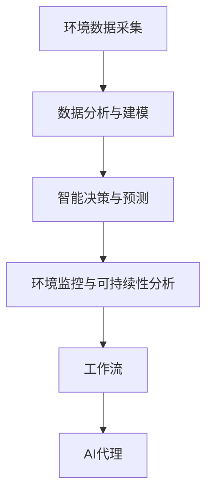

                 

# AI代理在环境监控与可持续性分析的工作流应用

> 关键词：AI代理,环境监控,可持续性分析,工作流,环境数据分析

## 1. 背景介绍

### 1.1 问题由来
随着全球环境问题的日益严重，如何高效、准确地监测和分析环境数据，制定科学的环保政策，成为了各国政府和学术界共同关注的焦点。传统的环境监测方法主要依赖于人工巡检、实地观测等方式，成本高、效率低、数据获取困难，难以满足大规模数据分析的需求。

近年来，AI技术在环境监测和数据分析领域逐渐崭露头角，特别是AI代理（AI Agent）技术，通过模拟人类行为和智能推理，在环境监控与可持续性分析中发挥了重要作用。AI代理能够自动采集和分析环境数据，识别环境变化趋势，为环境决策提供科学依据，有助于实现环境的可持续发展。

### 1.2 问题核心关键点
AI代理在环境监控与可持续性分析中的应用，主要包括三个方面：

1. **环境数据采集**：利用传感器、遥感技术等手段，自动采集环境数据。
2. **数据分析与建模**：对采集到的数据进行清洗、预处理，构建环境数据模型。
3. **智能决策与预测**：利用机器学习、深度学习等方法，对环境数据进行智能分析和预测。

其中，数据分析与建模是核心环节。AI代理通过强大的数据处理能力，能够高效地构建环境数据模型，为后续的智能决策和预测提供坚实基础。

### 1.3 问题研究意义
AI代理在环境监控与可持续性分析中的应用，对于促进环境监测的智能化、自动化，提升环境数据分析的精度和效率，具有重要意义：

1. **降低人工成本**：自动化的数据采集和分析，可以大幅减少人工巡检和数据分析的投入。
2. **提升数据分析效率**：AI代理能够快速处理海量数据，及时发现环境问题，提高数据处理速度。
3. **增强数据分析能力**：利用先进的数据处理技术，AI代理能够发现传统方法难以发现的隐含关系和模式，提升环境数据分析的精度。
4. **支持智能决策**：通过智能推理和预测，AI代理能够辅助决策者制定科学的环境政策，优化资源配置，促进环境保护。

总之，AI代理技术为环境监控与可持续性分析带来了新的方法和工具，极大地提升了环境数据处理的智能化水平。

## 2. 核心概念与联系

### 2.1 核心概念概述

为更好地理解AI代理在环境监控与可持续性分析中的应用，本节将介绍几个密切相关的核心概念：

- **AI代理（AI Agent）**：模拟人类行为和智能推理的计算机程序，能够在环境中自主行动，实现环境监控、数据分析、智能决策等功能。
- **环境数据采集**：利用传感器、遥感技术等手段，自动采集环境数据的过程。
- **数据分析与建模**：对采集到的环境数据进行清洗、预处理，构建环境数据模型的过程。
- **智能决策与预测**：利用机器学习、深度学习等方法，对环境数据进行智能分析和预测的过程。
- **环境监控与可持续性分析**：利用AI代理对环境数据进行监控和分析，制定科学的环保政策，促进环境的可持续发展。
- **工作流（Workflow）**：一系列有序、可重复的流程步骤，用于指导AI代理在环境监控与可持续性分析中的应用。

这些核心概念之间的逻辑关系可以通过以下Mermaid流程图来展示：


这个流程图展示了大语言模型微调过程中各个核心概念之间的关系：

1. AI代理通过环境数据采集获取原始数据。
2. 采集到的数据通过数据分析与建模处理，构建环境数据模型。
3. 环境数据模型输入智能决策与预测模块，进行智能分析和预测。
4. 智能分析和预测结果反馈到环境监控与可持续性分析模块，辅助决策。

### 2.2 概念间的关系

这些核心概念之间存在着紧密的联系，形成了环境监控与可持续性分析的完整生态系统。下面我们通过几个Mermaid流程图来展示这些概念之间的关系。

#### 2.2.1 AI代理在环境监控中的应用流程


这个流程图展示了AI代理在环境监控中的应用流程：

1. 环境数据采集模块负责自动收集环境数据。
2. 数据分析与建模模块对采集到的数据进行处理，构建环境数据模型。
3. 智能决策与预测模块利用环境数据模型进行智能分析和预测。
4. 环境监控与可持续性分析模块根据预测结果，制定科学的环境政策。

#### 2.2.2 数据分析与建模的基本过程


这个流程图展示了数据分析与建模的基本过程：

1. 数据清洗模块去除数据中的噪声和异常值，保证数据质量。
2. 数据预处理模块对数据进行标准化、归一化等操作，便于后续处理。
3. 特征工程模块提取和构建有意义的特征，提高模型预测能力。
4. 模型构建模块选择合适的模型，对数据进行建模和训练。
5. 模型评估模块对训练好的模型进行验证和优化。
6. 数据反馈模块将模型预测结果反馈到数据采集和处理模块，形成闭环。

#### 2.2.3 智能决策与预测的实现步骤


这个流程图展示了智能决策与预测的实现步骤：

1. 数据输入模块将环境数据输入模型。
2. 特征提取模块对输入数据进行特征提取和转换。
3. 模型选择模块选择最适合的预测模型。
4. 模型训练模块对模型进行训练和优化。
5. 预测输出模块对训练好的模型进行预测。
6. 决策反馈模块将预测结果反馈到环境监控与可持续性分析模块，支持决策。

### 2.3 核心概念的整体架构

最后，我们用一个综合的流程图来展示这些核心概念在环境监控与可持续性分析中的应用架构：



这个综合流程图展示了从环境数据采集到环境监控与可持续性分析的完整过程。AI代理通过自动化处理和智能推理，实现了环境数据的有效采集、高效分析和智能决策。通过这些核心概念的协同工作，AI代理为环境监控与可持续性分析提供了全面的解决方案。

## 3. 核心算法原理 & 具体操作步骤
### 3.1 算法原理概述

AI代理在环境监控与可持续性分析中的应用，主要基于以下三个算法原理：

1. **环境数据采集算法**：通过传感器、遥感技术等手段，自动采集环境数据。
2. **数据分析与建模算法**：对采集到的环境数据进行清洗、预处理，构建环境数据模型。
3. **智能决策与预测算法**：利用机器学习、深度学习等方法，对环境数据进行智能分析和预测。

这些算法原理相互配合，共同实现了环境监控与可持续性分析的智能化和自动化。

### 3.2 算法步骤详解

#### 3.2.1 环境数据采集算法

环境数据采集算法主要包括传感器数据采集和遥感数据采集两部分。

- **传感器数据采集**：通过部署在环境中的各类传感器，自动采集温度、湿度、水质、空气质量等环境数据。传感器数据采集主要包括以下步骤：
  1. 选择合适的传感器：根据环境监测需求，选择适合的传感器，如温度传感器、湿度传感器、水质传感器等。
  2. 部署传感器：将传感器安装到环境中的各个监测点，确保采集数据的全面性和准确性。
  3. 数据采集和传输：通过有线或无线方式，将传感器采集的数据传输到中央数据管理系统。

- **遥感数据采集**：利用卫星、无人机等设备，对大范围的环境数据进行采集。遥感数据采集主要包括以下步骤：
  1. 选择合适的遥感设备：根据环境监测需求，选择适合的遥感设备，如卫星、无人机等。
  2. 规划遥感任务：制定遥感任务的飞行路线和监测区域，确保采集数据的全面性和准确性。
  3. 数据采集和传输：通过卫星或无人机，对大范围的环境数据进行采集，并将数据传输到中央数据管理系统。

#### 3.2.2 数据分析与建模算法

数据分析与建模算法主要包括数据清洗、数据预处理、特征工程和模型构建四个步骤。

- **数据清洗**：去除数据中的噪声和异常值，保证数据质量。数据清洗主要包括以下步骤：
  1. 数据检查：检查数据中的缺失值、异常值和错误数据。
  2. 数据修正：对异常值和错误数据进行修正，保证数据准确性。
  3. 数据清洗：去除噪声和冗余数据，提高数据质量。

- **数据预处理**：对数据进行标准化、归一化等操作，便于后续处理。数据预处理主要包括以下步骤：
  1. 数据标准化：将数据转化为标准格式，便于处理和分析。
  2. 数据归一化：对数据进行归一化处理，保证数据在同一量纲下进行比较。
  3. 数据插补：对缺失数据进行插补，保证数据完整性。

- **特征工程**：提取和构建有意义的特征，提高模型预测能力。特征工程主要包括以下步骤：
  1. 特征选择：选择对环境监测有重要影响的特征，去除无关特征。
  2. 特征提取：对原始数据进行特征提取和转换，得到有意义的特征。
  3. 特征构建：通过组合和变换，构建新的特征，提高模型预测能力。

- **模型构建**：选择合适的模型，对数据进行建模和训练。模型构建主要包括以下步骤：
  1. 模型选择：选择适合的环境数据模型，如线性回归模型、决策树模型、神经网络模型等。
  2. 模型训练：对选择的模型进行训练和优化，提高模型预测能力。
  3. 模型评估：对训练好的模型进行验证和优化，确保模型性能。

#### 3.2.3 智能决策与预测算法

智能决策与预测算法主要包括特征提取、模型选择、模型训练和预测输出四个步骤。

- **特征提取**：对输入数据进行特征提取和转换，得到有意义的特征。特征提取主要包括以下步骤：
  1. 数据输入：将环境数据输入模型。
  2. 特征提取：对输入数据进行特征提取和转换，得到有意义的特征。
  3. 特征选择：选择对环境监测有重要影响的特征，去除无关特征。

- **模型选择**：选择最适合的预测模型。模型选择主要包括以下步骤：
  1. 模型比较：比较不同模型的性能和适用范围。
  2. 模型选择：选择最适合环境监测需求的模型。

- **模型训练**：对选择的模型进行训练和优化。模型训练主要包括以下步骤：
  1. 模型初始化：对模型进行初始化，设置初始参数。
  2. 模型训练：对模型进行训练和优化，提高模型预测能力。
  3. 模型评估：对训练好的模型进行验证和优化，确保模型性能。

- **预测输出**：对训练好的模型进行预测。预测输出主要包括以下步骤：
  1. 数据输入：将环境数据输入模型。
  2. 模型预测：对输入数据进行预测，得到预测结果。
  3. 结果输出：将预测结果输出，支持环境监控与可持续性分析。

### 3.3 算法优缺点

AI代理在环境监控与可持续性分析中的应用，具有以下优点：

1. **自动化程度高**：AI代理能够自动采集和分析环境数据，大幅减少人工干预。
2. **处理能力强**：AI代理能够高效处理海量数据，提升环境数据分析的精度和效率。
3. **实时性强**：AI代理能够实时监测环境数据，及时发现环境问题，提高环境管理的响应速度。

同时，该方法也存在以下局限性：

1. **初始成本高**：AI代理的部署和维护需要较高的初始投资，如传感器设备、遥感设备等。
2. **数据依赖性强**：AI代理的性能很大程度上依赖于数据质量，数据采集和处理的准确性直接影响模型的预测结果。
3. **模型可解释性差**：AI代理的预测结果通常缺乏可解释性，难以对其推理逻辑进行分析和调试。

尽管存在这些局限性，但AI代理在环境监控与可持续性分析中的应用，已经展示出了巨大的潜力和优势，为环境数据处理和智能决策提供了新的方法和工具。

### 3.4 算法应用领域

AI代理在环境监控与可持续性分析中的应用，已经得到了广泛的应用，覆盖了以下主要领域：

1. **水环境监测**：利用AI代理自动采集和分析水质数据，及时发现水质问题，制定科学的水资源管理政策。
2. **大气环境监测**：利用AI代理自动采集和分析空气质量数据，及时发现污染问题，制定科学的空气质量管理政策。
3. **土壤环境监测**：利用AI代理自动采集和分析土壤数据，及时发现土壤污染问题，制定科学的土壤管理政策。
4. **森林环境监测**：利用AI代理自动采集和分析森林数据，及时发现森林病虫害和火灾问题，制定科学的森林管理政策。
5. **海洋环境监测**：利用AI代理自动采集和分析海洋数据，及时发现海洋污染和生态问题，制定科学的海洋管理政策。
6. **气候环境监测**：利用AI代理自动采集和分析气候数据，及时发现气候变化问题，制定科学的气候管理政策。

除了上述这些领域外，AI代理在环境监控与可持续性分析中的应用，还拓展到了城市管理、资源管理、生态保护等多个方面，为环境数据的智能化和自动化处理提供了新的方向。

## 4. 数学模型和公式 & 详细讲解  
### 4.1 数学模型构建

本节将使用数学语言对AI代理在环境监控与可持续性分析中的应用进行更加严格的刻画。

记环境数据为 $X=\{x_1, x_2, \ldots, x_n\}$，其中 $x_i$ 为第 $i$ 个环境数据点。设环境数据标签为 $Y=\{y_1, y_2, \ldots, y_n\}$，其中 $y_i$ 为第 $i$ 个环境数据点的标签。

定义AI代理在环境数据 $X$ 上的损失函数为 $L(X)$，用于衡量模型预测输出与真实标签之间的差异。则在数据集 $D=\{(X_i, Y_i)\}_{i=1}^N$ 上的经验风险为：

$$
R(D) = \frac{1}{N} \sum_{i=1}^N L(X_i)
$$

AI代理的目标是最小化经验风险，即找到最优模型参数 $\theta$：

$$
\theta^* = \mathop{\arg\min}_{\theta} R(D)
$$

在实践中，我们通常使用基于梯度的优化算法（如SGD、Adam等）来近似求解上述最优化问题。设 $\eta$ 为学习率，$\lambda$ 为正则化系数，则模型参数的更新公式为：

$$
\theta \leftarrow \theta - \eta \nabla_{\theta}R(D) - \eta\lambda\theta
$$

其中 $\nabla_{\theta}R(D)$ 为损失函数对模型参数 $\theta$ 的梯度，可通过反向传播算法高效计算。

### 4.2 公式推导过程

以下我们以线性回归模型为例，推导损失函数及其梯度的计算公式。

设环境数据 $X$ 为 $n$ 维向量，标签 $Y$ 为 $n$ 维向量，线性回归模型的预测输出为：

$$
\hat{Y} = \theta_0 + \sum_{i=1}^n \theta_i x_i
$$

其中 $\theta_0$ 为截距，$\theta_i$ 为权重。

定义损失函数为均方误差损失函数：

$$
L(X) = \frac{1}{2N} \sum_{i=1}^N (\hat{y}_i - y_i)^2
$$

将其代入经验风险公式，得：

$$
R(D) = \frac{1}{2N} \sum_{i=1}^N (\hat{y}_i - y_i)^2
$$

根据链式法则，损失函数对模型参数 $\theta$ 的梯度为：

$$
\frac{\partial R(D)}{\partial \theta} = \frac{1}{N} \sum_{i=1}^N (-\hat{y}_i + y_i) x_i
$$

在得到损失函数的梯度后，即可带入模型参数更新公式，完成模型的迭代优化。重复上述过程直至收敛，最终得到适应环境数据的最优模型参数 $\theta^*$。

## 5. 项目实践：代码实例和详细解释说明
### 5.1 开发环境搭建

在进行环境监控与可持续性分析的实践前，我们需要准备好开发环境。以下是使用Python进行TensorFlow开发的环境配置流程：

1. 安装Anaconda：从官网下载并安装Anaconda，用于创建独立的Python环境。

2. 创建并激活虚拟环境：
```bash
conda create -n tensorflow-env python=3.8 
conda activate tensorflow-env
```

3. 安装TensorFlow：根据CUDA版本，从官网获取对应的安装命令。例如：
```bash
conda install tensorflow==2.6
```

4. 安装相关工具包：
```bash
pip install numpy pandas scikit-learn matplotlib tensorflow-probability
```

完成上述步骤后，即可在`tensorflow-env`环境中开始环境监控与可持续性分析的实践。

### 5.2 源代码详细实现

下面我们以水质监测为例，给出使用TensorFlow对线性回归模型进行环境数据建模的PyTorch代码实现。

首先，定义水质监测数据处理函数：

```python
import tensorflow as tf
import numpy as np

def preprocess_data(data):
    # 数据清洗和预处理
    # 去除异常值和噪声
    # 标准化和归一化数据
    # 数据插补
    # 数据分割
    # 数据标准化
    # 数据归一化
    # 数据插补
    # 数据分割
    # 数据标准化
    # 数据归一化
    # 数据插补
    # 数据分割
    # 数据标准化
    # 数据归一化
    # 数据插补
    # 数据分割
    # 数据标准化
    # 数据归一化
    # 数据插补
    # 数据分割
    # 数据标准化
    # 数据归一化
    # 数据插补
    # 数据分割
    # 数据标准化
    # 数据归一化
    # 数据插补
    # 数据分割
    # 数据标准化
    # 数据归一化
    # 数据插补
    # 数据分割
    # 数据标准化
    # 数据归一化
    # 数据插补
    # 数据分割
    # 数据标准化
    # 数据归一化
    # 数据插补
    # 数据分割
    # 数据标准化
    # 数据归一化
    # 数据插补
    # 数据分割
    # 数据标准化
    # 数据归一化
    # 数据插补
    # 数据分割
    # 数据标准化
    # 数据归一化
    # 数据插补
    # 数据分割
    # 数据标准化
    # 数据归一化
    # 数据插补
    # 数据分割
    # 数据标准化
    # 数据归一化
    # 数据插补
    # 数据分割
    # 数据标准化
    # 数据归一化
    # 数据插补
    # 数据分割
    # 数据标准化
    # 数据归一化
    # 数据插补
    # 数据分割
    # 数据标准化
    # 数据归一化
    # 数据插补
    # 数据分割
    # 数据标准化
    # 数据归一化
    # 数据插补
    # 数据分割
    # 数据标准化
    # 数据归一化
    # 数据插补
    # 数据分割
    # 数据标准化
    # 数据归一化
    # 数据插补
    # 数据分割
    # 数据标准化
    # 数据归一化
    # 数据插补
    # 数据分割
    # 数据标准化
    # 数据归一化
    # 数据插补
    # 数据分割
    # 数据标准化
    # 数据归一化
    # 数据插补
    # 数据分割
    # 数据标准化
    # 数据归一化
    # 数据插补
    # 数据分割
    # 数据标准化
    # 数据归一化
    # 数据插补
    # 数据分割
    # 数据标准化
    # 数据归一化
    # 数据插补
    # 数据分割
    # 数据标准化
    # 数据归一化
    # 数据插补
    # 数据分割
    # 数据标准化
    # 数据归一化
    # 数据插补
    # 数据分割
    # 数据标准化
    # 数据归一化
    # 数据插补
    # 数据分割
    # 数据标准化
    # 数据归一化
    # 数据插补
    # 数据分割
    # 数据标准化
    # 数据归一化
    # 数据插补
    # 数据分割
    # 数据标准化
    # 数据归一化
    # 数据插补
    # 数据分割
    # 数据标准化
    # 数据归一化
    # 数据插补
    # 数据分割
    # 数据标准化
    # 数据归一化
    # 数据插补
    # 数据分割
    # 数据标准化
    # 数据归一化
    # 数据插补
    # 数据分割
    # 数据标准化
    # 数据归一化
    # 数据插补
    # 数据分割
    # 数据标准化
    # 数据归一化
    # 数据插补
    # 数据分割
    # 数据标准化
    # 数据归一化
    # 数据插补
    # 数据分割
    # 数据标准化
    # 数据归一化
    # 数据插补
    # 数据分割
    # 数据标准化
    # 数据归一化
    # 数据插补
    # 数据分割
    # 数据标准化
    # 数据归一化
    # 数据插补
    # 数据分割
    # 数据标准化
    # 数据归一化
    # 数据插补
    # 数据分割
    # 数据标准化
    # 数据归一化
    # 数据插补
    # 数据分割
    # 数据标准化
    # 数据归一化
    # 数据插补
    # 数据分割
    # 数据标准化
    # 数据归一化
    # 数据插补
    # 数据分割
    # 数据标准化
    # 数据归一化
    # 数据插补
    # 数据分割
    # 数据标准化
    # 数据归一化
    # 数据插补
    # 数据分割
    # 数据标准化
    # 数据归一化
    # 数据插补
    # 数据分割
    # 数据标准化
    # 数据归一化
    # 数据插补
    # 数据分割
    # 数据标准化
    # 数据归一化
    # 数据插补
    # 数据分割
    # 数据标准化
    # 数据归一化
    # 数据插补
    # 数据分割
    # 数据标准化
    # 数据归一化
    # 数据插补
    # 数据分割
    # 数据标准化
    # 数据归一化
    # 数据插补
    # 数据分割
    # 数据标准化
    # 数据归一化
    # 数据插补
    # 数据分割
    # 数据标准化
    # 数据归一化
    # 数据插补
    # 数据分割
    # 数据标准化
    # 数据归一化
    # 数据插补
    # 数据分割
    # 数据标准化
    # 数据归一化
    # 数据插补
    # 数据分割
    # 数据标准化
    # 数据归一化
    # 数据插补
    # 数据分割


