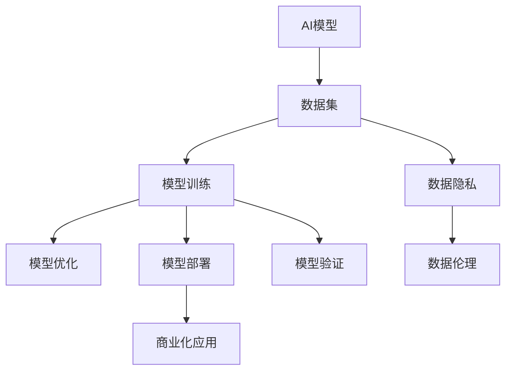

                 

# AI创业中的技术与数据

## 1. 背景介绍

### 1.1 问题由来
随着人工智能技术的不断发展，越来越多的AI初创公司涌现，希望通过AI技术在各行各业中寻找商业机会。然而，技术实施和数据获取往往是创业过程中的两大难题。如何高效利用技术资源，高效获取高质量数据，成为了AI创业的关键挑战。本文将系统性地探讨AI创业中的技术与数据问题，为创业者提供全面的技术指导。

### 1.2 问题核心关键点
在AI创业中，技术与数据的紧密结合是实现成功商业化的基础。核心关键点包括：
- 如何选择与构建合适的AI模型
- 如何高效获取并处理数据
- 如何优化模型的性能和效率
- 如何实现AI技术的商业化应用
- 如何应对数据隐私和伦理挑战

这些关键点贯穿了AI创业的各个环节，对公司的长期发展至关重要。

### 1.3 问题研究意义
深入理解AI创业中的技术与数据问题，对于提升AI创业公司的技术能力和商业价值，推动AI技术在各行业的落地应用具有重要意义：

1. **降低技术实施成本**：帮助创业者更高效地构建和优化AI模型，避免技术选型错误，减少研发投入。
2. **提升数据质量**：提供数据获取和处理的最佳实践，确保数据集的质量和一致性，提升模型性能。
3. **优化模型效率**：指导创业者如何平衡模型复杂度和性能，实现高效推理，提升用户体验。
4. **促进商业化应用**：帮助创业者将AI技术成功应用到实际业务场景中，实现商业化落地，创造价值。
5. **应对伦理挑战**：指导创业者如何处理数据隐私和伦理问题，确保合规运营，树立良好的社会形象。

## 2. 核心概念与联系

### 2.1 核心概念概述

为更好地理解AI创业中的技术与数据问题，本节将介绍几个关键概念：

- **AI模型**：指通过机器学习、深度学习等方法训练得到的算法模型，用于特定任务的处理和预测。常见的AI模型包括卷积神经网络(CNN)、循环神经网络(RNN)、变压器(Transformer)等。
- **数据集**：指用于训练和测试AI模型的数据集合，通常包括标注数据、无标签数据等。数据集的质量直接影响模型的性能。
- **模型优化**：指通过调整模型结构、优化超参数等方法，提升模型在特定任务上的性能和效率。
- **模型部署**：指将训练好的模型应用于实际业务场景的过程，通常需要考虑模型推理速度、资源消耗等实际问题。
- **数据隐私**：指在数据处理和共享过程中，如何保护用户隐私，避免数据泄露和滥用。
- **数据伦理**：指在数据获取和处理过程中，如何遵循伦理原则，确保数据使用的正当性和透明性。

这些核心概念之间的逻辑关系可以通过以下Mermaid流程图来展示：



这个流程图展示了大规模数据在AI创业中的重要性和多方面的应用路径。

### 2.2 概念间的关系

这些核心概念之间存在着紧密的联系，形成了AI创业中技术与数据的完整生态系统。

- **数据与模型的关系**：数据是训练模型的基础，模型的性能和泛化能力直接取决于数据的质量和数量。
- **模型优化与部署的关系**：优化模型不仅提升模型性能，还能减少推理资源消耗，提高模型在实际应用中的效率。
- **数据隐私与伦理的关系**：数据隐私是数据伦理的重要组成部分，两者共同保障了数据使用的正当性和合法性。
- **模型部署与商业化的关系**：模型部署是商业化的关键环节，如何实现高效部署和业务融合，直接影响产品的市场接受度。

这些概念共同构成了AI创业的技术与数据基础，使得AI技术在各行各业中得到广泛应用。

## 3. 核心算法原理 & 具体操作步骤

### 3.1 算法原理概述

在AI创业中，选择和构建合适的AI模型是技术实施的基础。一般而言，AI模型的构建过程包括以下几个步骤：

1. **需求分析**：明确业务需求，确定模型目标任务。
2. **数据收集**：收集并预处理数据集，确保数据的质量和多样性。
3. **模型选择**：根据任务类型选择适合的模型架构，如CNN、RNN、Transformer等。
4. **模型训练**：使用训练集训练模型，调整超参数，优化模型性能。
5. **模型评估**：使用验证集和测试集评估模型性能，确保模型泛化能力。
6. **模型部署**：将训练好的模型部署到实际业务场景，进行推理应用。

### 3.2 算法步骤详解

以下是AI模型构建和优化的详细步骤：

**Step 1: 需求分析**
- 明确业务需求，确定模型的输入、输出和目标任务。
- 根据任务类型选择模型架构，如分类任务选择CNN或RNN，生成任务选择Transformer等。

**Step 2: 数据收集**
- 收集相关的数据集，包括标注数据和无标签数据。
- 预处理数据，如数据清洗、归一化、数据增强等。
- 划分子集，包括训练集、验证集和测试集。

**Step 3: 模型选择**
- 根据任务类型选择适合的模型架构，如CNN用于图像识别，RNN用于序列数据处理，Transformer用于自然语言处理。
- 确定模型的超参数，如学习率、批大小、训练轮数等。

**Step 4: 模型训练**
- 使用训练集训练模型，记录训练日志，如损失函数、准确率等。
- 调整超参数，使用验证集评估模型性能，避免过拟合。
- 选择优化算法，如Adam、SGD等，更新模型参数。

**Step 5: 模型评估**
- 使用测试集评估模型性能，计算各项指标如准确率、召回率、F1分数等。
- 分析模型性能，识别可能的优化点，如模型结构、超参数等。

**Step 6: 模型部署**
- 将训练好的模型部署到实际业务场景，进行推理应用。
- 优化模型推理速度和资源消耗，确保模型的高效运行。
- 进行业务集成，实现与现有系统的无缝对接。

### 3.3 算法优缺点

AI模型的构建和优化过程具有以下优点：
- 灵活性高：可以根据具体任务选择合适的模型架构和超参数，适应不同的业务需求。
- 高效性：通过优化算法调整模型参数，可以显著提升模型性能。
- 泛化能力强：使用大规模数据集进行训练，模型能够泛化到未见过的数据上。

但同时，也存在以下缺点：
- 数据需求高：构建和优化模型需要大量标注数据，数据获取和处理成本较高。
- 模型复杂度高：大规模模型结构复杂，推理速度较慢。
- 模型泛化不稳定：不同数据集上的性能波动较大，需要仔细处理过拟合问题。

### 3.4 算法应用领域

AI模型的构建和优化广泛应用于以下几个领域：

- **自然语言处理(NLP)**：如文本分类、情感分析、机器翻译等。
- **计算机视觉(CV)**：如图像识别、目标检测、人脸识别等。
- **语音识别(SR)**：如语音识别、语音合成等。
- **推荐系统**：如用户行为预测、商品推荐等。
- **金融风控**：如信用评分、风险预测等。
- **医疗诊断**：如疾病诊断、影像分析等。

## 4. 数学模型和公式 & 详细讲解 & 举例说明

### 4.1 数学模型构建

在本节中，我们将以一个简单的分类任务为例，构建一个二分类模型的数学模型。

假设模型 $M_{\theta}(x)$ 将输入 $x$ 映射到输出 $y \in \{0, 1\}$。模型的输出通过一个Sigmoid函数进行归一化，使得输出在 $(0, 1)$ 区间内。

**Step 1: 定义损失函数**
- 交叉熵损失函数定义为：
$$
\ell(M_{\theta}(x),y) = -y \log M_{\theta}(x) - (1-y) \log (1-M_{\theta}(x))
$$

**Step 2: 定义优化目标**
- 模型的优化目标是最小化损失函数：
$$
\mathcal{L}(\theta) = \frac{1}{N} \sum_{i=1}^N \ell(M_{\theta}(x_i),y_i)
$$

**Step 3: 定义优化算法**
- 使用梯度下降算法更新模型参数 $\theta$：
$$
\theta \leftarrow \theta - \eta \nabla_{\theta}\mathcal{L}(\theta)
$$

其中 $\eta$ 为学习率，$\nabla_{\theta}\mathcal{L}(\theta)$ 为损失函数对参数 $\theta$ 的梯度。

### 4.2 公式推导过程

假设模型 $M_{\theta}(x)$ 在输入 $x$ 上的输出为 $\hat{y}=M_{\theta}(x)$，真实标签 $y \in \{0,1\}$。则二分类交叉熵损失函数为：
$$
\ell(M_{\theta}(x),y) = -y\log \hat{y} - (1-y)\log(1-\hat{y})
$$

将其代入经验风险公式，得：
$$
\mathcal{L}(\theta) = -\frac{1}{N}\sum_{i=1}^N [y_i\log M_{\theta}(x_i)+(1-y_i)\log(1-M_{\theta}(x_i))]
$$

根据链式法则，损失函数对参数 $\theta_k$ 的梯度为：
$$
\frac{\partial \mathcal{L}(\theta)}{\partial \theta_k} = -\frac{1}{N}\sum_{i=1}^N (\frac{y_i}{M_{\theta}(x_i)}-\frac{1-y_i}{1-M_{\theta}(x_i)}) \frac{\partial M_{\theta}(x_i)}{\partial \theta_k}
$$

其中 $\frac{\partial M_{\theta}(x_i)}{\partial \theta_k}$ 可进一步递归展开，利用自动微分技术完成计算。

### 4.3 案例分析与讲解

以一个简单的图像分类任务为例，分析模型构建和优化的过程。

**Step 1: 需求分析**
- 明确任务为将图像分类为猫或狗。

**Step 2: 数据收集**
- 收集包含猫和狗的图像数据集，进行数据增强，如旋转、缩放等。
- 划分训练集、验证集和测试集。

**Step 3: 模型选择**
- 选择适合图像分类任务的CNN模型，如VGG、ResNet等。
- 确定超参数，如学习率、批大小等。

**Step 4: 模型训练**
- 使用训练集训练模型，记录损失函数和准确率。
- 调整超参数，使用验证集评估模型性能。
- 使用Adam优化算法更新模型参数。

**Step 5: 模型评估**
- 使用测试集评估模型性能，计算准确率、召回率等指标。
- 分析模型性能，识别可能的优化点。

**Step 6: 模型部署**
- 将训练好的模型部署到实际业务场景，进行推理应用。
- 优化模型推理速度和资源消耗，确保模型的高效运行。

## 5. 项目实践：代码实例和详细解释说明

### 5.1 开发环境搭建

在进行模型构建和优化实践前，我们需要准备好开发环境。以下是使用Python进行TensorFlow开发的开发环境配置流程：

1. 安装Anaconda：从官网下载并安装Anaconda，用于创建独立的Python环境。

2. 创建并激活虚拟环境：
```bash
conda create -n tensorflow-env python=3.8 
conda activate tensorflow-env
```

3. 安装TensorFlow：从官网获取对应的安装命令。例如：
```bash
pip install tensorflow==2.7
```

4. 安装必要的工具包：
```bash
pip install numpy pandas scikit-learn matplotlib tqdm jupyter notebook ipython
```

完成上述步骤后，即可在`tensorflow-env`环境中开始模型构建和优化的实践。

### 5.2 源代码详细实现

以下是一个简单的图像分类任务的TensorFlow代码实现：

```python
import tensorflow as tf
from tensorflow.keras import layers, models
from tensorflow.keras.datasets import mnist
from tensorflow.keras.utils import to_categorical

# 加载MNIST数据集
(x_train, y_train), (x_test, y_test) = mnist.load_data()

# 预处理数据
x_train = x_train.reshape(-1, 28*28).astype('float32') / 255.0
x_test = x_test.reshape(-1, 28*28).astype('float32') / 255.0
y_train = to_categorical(y_train)
y_test = to_categorical(y_test)

# 构建模型
model = models.Sequential([
    layers.Flatten(input_shape=(28, 28)),
    layers.Dense(128, activation='relu'),
    layers.Dense(10, activation='softmax')
])

# 编译模型
model.compile(optimizer='adam', loss='categorical_crossentropy', metrics=['accuracy'])

# 训练模型
model.fit(x_train, y_train, epochs=10, batch_size=32, validation_data=(x_test, y_test))

# 评估模型
loss, accuracy = model.evaluate(x_test, y_test)
print(f'Test accuracy: {accuracy:.2f}')
```

在这个代码中，我们首先加载MNIST数据集，并进行预处理。然后，使用TensorFlow的Keras API构建一个简单的全连接神经网络模型。接着，编译模型，设置优化器、损失函数和评估指标。最后，使用训练集训练模型，并在测试集上评估模型性能。

### 5.3 代码解读与分析

让我们再详细解读一下关键代码的实现细节：

**数据加载和预处理**
- 使用`mnist.load_data()`函数加载MNIST数据集，包含训练集和测试集。
- 对图像数据进行扁平化处理，将其转化为一维向量。
- 将像素值归一化到[0,1]区间内，提高模型收敛速度。
- 使用`to_categorical`函数将标签进行独热编码，适用于多分类任务。

**模型构建**
- 使用`Sequential`模型堆叠多个层，构建一个简单的神经网络。
- 第一层为扁平化层，将图像数据转化为一维向量。
- 第二层为全连接层，使用ReLU激活函数。
- 第三层为输出层，使用Softmax激活函数，适用于多分类任务。

**模型编译**
- 使用`model.compile`函数设置模型的优化器、损失函数和评估指标。
- 优化器使用Adam，学习率默认为0.001。
- 损失函数使用交叉熵损失函数。
- 评估指标使用准确率。

**模型训练**
- 使用`model.fit`函数训练模型，设置训练轮数和批大小。
- 在每个epoch结束时，模型会在验证集上评估性能。
- 使用`validation_data`参数指定验证集。

**模型评估**
- 使用`model.evaluate`函数在测试集上评估模型性能，输出损失函数和准确率。
- 使用`print`函数输出测试集上的准确率。

通过这个代码实例，可以看出TensorFlow的使用非常直观，且易于扩展。开发者可以根据自己的需求，使用更复杂的模型架构和更多的优化技巧，进一步提升模型性能。

## 6. 实际应用场景

### 6.1 智能推荐系统

智能推荐系统是AI创业中的重要应用场景之一。通过分析用户的行为数据，智能推荐系统可以为用户推荐最符合其兴趣的商品、内容等，提升用户体验和满意度。

在实践中，可以使用深度学习模型，如协同过滤、矩阵分解等，对用户和物品进行矩阵表示，计算相似度进行推荐。通过微调模型，可以更好地捕捉用户行为数据中的潜在关联，提升推荐效果。

### 6.2 医疗影像诊断

医疗影像诊断是AI创业中的另一个重要应用场景。通过分析患者的影像数据，智能诊断系统可以帮助医生快速识别疾病，提高诊断的准确性和效率。

在实践中，可以使用卷积神经网络(CNN)对医学影像进行特征提取，通过微调模型，可以更好地学习影像中的关键特征，提升诊断精度。同时，将微调后的模型与医学专家知识结合，可以进一步提高诊断的可靠性。

### 6.3 智能客服系统

智能客服系统通过自然语言处理(NLP)技术，能够自动理解用户的问题，并提供相应的解答，提升客户服务效率和质量。

在实践中，可以使用预训练的对话模型，如GPT-3等，对其进行微调，使其适应特定的业务场景和语境。通过微调，可以更好地捕捉用户意图，提升系统对话的自然流畅性和响应速度。

### 6.4 未来应用展望

随着AI技术的发展，未来AI创业中的技术与数据问题将更加复杂和多样化。以下是一些未来应用展望：

- **AI与多模态数据的融合**：未来AI创业将更多地融合语音、图像、视频等多种模态数据，构建多模态AI系统，提升系统的感知和理解能力。
- **AI与物联网(IoT)的融合**：未来AI创业将更多地应用于物联网领域，通过分析传感器数据，实现智能控制和自动化管理。
- **AI与区块链的融合**：未来AI创业将更多地结合区块链技术，提升数据的安全性和可信度，构建去中心化的AI应用。
- **AI与边缘计算的融合**：未来AI创业将更多地应用于边缘计算领域，提升AI系统的实时性和低延迟性。

总之，未来AI创业中的技术与数据问题将更加多样化和复杂化，需要开发者具备更加全面的技术能力和跨学科的视角。只有不断创新和探索，才能在大数据时代实现商业价值的最大化。

## 7. 工具和资源推荐

### 7.1 学习资源推荐

为了帮助开发者系统掌握AI创业中的技术与数据问题，这里推荐一些优质的学习资源：

1. 《深度学习》（Ian Goodfellow著）：全面介绍了深度学习的基本概念、算法和应用，是深度学习领域的经典教材。
2. 《TensorFlow实战》（Jailing Zhang著）：详细介绍了TensorFlow的API使用和最佳实践，帮助开发者快速上手TensorFlow开发。
3. 《Python机器学习》（Sebastian Raschka著）：介绍了Python在机器学习领域的应用，涵盖了数据预处理、模型训练、模型评估等内容。
4. Kaggle竞赛：参与Kaggle竞赛可以锻炼数据分析和模型优化的能力，积累实战经验。
5. Coursera、edX等在线课程：提供丰富的深度学习和AI课程，帮助开发者系统学习技术知识。

通过学习这些资源，相信你一定能够掌握AI创业中的技术与数据问题，并用于解决实际的商业问题。

### 7.2 开发工具推荐

高效的开发离不开优秀的工具支持。以下是几款用于AI创业开发的常用工具：

1. TensorFlow：由Google主导开发的开源深度学习框架，生产部署方便，适合大规模工程应用。
2. PyTorch：由Facebook主导开发的开源深度学习框架，灵活度高，适合快速迭代研究。
3. Jupyter Notebook：开源的交互式开发环境，支持Python、R等多种语言，适合快速验证算法和模型。
4. Scikit-learn：Python的机器学习库，提供了丰富的算法和工具，适合快速原型开发。
5. Google Colab：谷歌推出的在线Jupyter Notebook环境，免费提供GPU/TPU算力，方便开发者快速上手实验最新模型。

合理利用这些工具，可以显著提升AI创业的开发效率，加快创新迭代的步伐。

### 7.3 相关论文推荐

AI创业中的技术与数据问题涉及广泛的学术研究领域，以下是几篇奠基性的相关论文，推荐阅读：

1. 《ImageNet Classification with Deep Convolutional Neural Networks》（Alex Krizhevsky等著）：提出使用CNN进行图像分类的经典方法，展示了深度学习在图像识别任务中的强大能力。
2. 《Deep Learning》（Ian Goodfellow等著）：全面介绍了深度学习的基本概念和算法，涵盖了神经网络、优化算法、模型架构等内容。
3. 《Attention Is All You Need》（Ashish Vaswani等著）：提出Transformer模型，开启了自然语言处理领域的预训练大模型时代。
4. 《A Survey of Recent Techniques for Scalable Distributed Deep Learning》（Peng Zhang等著）：介绍了分布式深度学习技术，帮助开发者构建高性能的AI系统。
5. 《Distributed TensorFlow》（Cassie Kozyrkov等著）：介绍了TensorFlow的分布式计算框架，帮助开发者构建高性能的AI系统。

这些论文代表了大规模深度学习和AI创业的研究脉络，通过学习这些前沿成果，可以帮助研究者把握学科前进方向，激发更多的创新灵感。

除上述资源外，还有一些值得关注的前沿资源，帮助开发者紧跟AI创业中的技术与数据问题的发展趋势，例如：

1. arXiv论文预印本：人工智能领域最新研究成果的发布平台，包括大量尚未发表的前沿工作，学习前沿技术的必读资源。
2. 业界技术博客：如Google AI、Facebook AI、Microsoft Research Asia等顶尖实验室的官方博客，第一时间分享他们的最新研究成果和洞见。
3. 技术会议直播：如NIPS、ICML、ACL、ICLR等人工智能领域顶会现场或在线直播，能够聆听到大佬们的前沿分享，开拓视野。
4. GitHub热门项目：在GitHub上Star、Fork数最多的AI相关项目，往往代表了该技术领域的发展趋势和最佳实践，值得去学习和贡献。
5. 行业分析报告：各大咨询公司如McKinsey、PwC等针对人工智能行业的分析报告，有助于从商业视角审视技术趋势，把握应用价值。

总之，对于AI创业中的技术与数据问题，需要开发者保持开放的心态和持续学习的意愿。多关注前沿资讯，多动手实践，多思考总结，必将收获满满的成长收益。

## 8. 总结：未来发展趋势与挑战

### 8.1 总结

本文对AI创业中的技术与数据问题进行了全面系统的介绍。首先阐述了AI创业公司的技术选型和数据获取问题，明确了模型构建和优化的重要性。其次，从原理到实践，详细讲解了模型的构建步骤、数据预处理、模型优化和模型部署等关键环节。最后，系统地探讨了AI创业中的技术与数据问题，如数据隐私、数据伦理、模型部署等，为创业者提供了全面的技术指导。

通过本文的系统梳理，可以看到，AI创业中的技术与数据问题复杂多样，需要开发者具备全面的技术能力和跨学科的视角。只有不断创新和探索，才能在大数据时代实现商业价值的最大化。

### 8.2 未来发展趋势

展望未来，AI创业中的技术与数据问题将呈现以下几个发展趋势：

1. **AI与多模态数据的融合**：未来AI创业将更多地融合语音、图像、视频等多种模态数据，构建多模态AI系统，提升系统的感知和理解能力。
2. **AI与物联网(IoT)的融合**：未来AI创业将更多地应用于物联网领域，通过分析传感器数据，实现智能控制和自动化管理。
3. **AI与区块链的融合**：未来AI创业将更多地结合区块链技术，提升数据的安全性和可信度，构建去中心化的AI应用。
4. **AI与边缘计算的融合**：未来AI创业将更多地应用于边缘计算领域，提升AI系统的实时性和低延迟性。
5. **AI与自然语言处理的融合**：未来AI创业将更多地应用于自然语言处理领域，通过深度学习和大模型提升文本理解能力。
6. **AI与机器人技术的融合**：未来AI创业将更多地应用于机器人领域，提升机器人的感知和决策能力。

这些趋势凸显了AI创业的广阔前景，也将推动AI技术在各行业的落地应用。

### 8.3 面临的挑战

尽管AI创业中的技术与数据问题取得了显著进展，但在迈向更加智能化、普适化应用的过程中，仍面临诸多挑战：

1. **数据获取成本高**：高质量标注数据成本高，难以获取足够的训练数据。
2. **数据隐私问题**：用户隐私保护成为一大难题，如何在数据使用和隐私保护之间取得平衡。
3. **模型泛化能力不足**：不同数据集上的模型性能波动较大，需要仔细处理过拟合问题。
4. **模型解释性不足**：深度学习模型通常缺乏可解释性，难以理解和调试。
5. **资源消耗大**：大规模模型的计算资源需求大，如何高效利用资源，降低成本。
6. **跨领域迁移能力弱**：当前模型往往局限于特定领域，难以跨领域迁移。

面对这些挑战，未来的研究需要在数据获取、模型优化、资源利用等方面寻求新的突破。

### 8.4 研究展望

未来的研究需要在以下几个方面寻求新的突破：

1. **无监督和半监督学习**：探索无监督和半监督学习方法，摆脱对大规模标注数据的依赖，利用自监督学习、主动学习等方法，最大限度地利用非结构化数据。
2. **参数高效优化**：开发更加参数高效的优化方法，如Adapter等，在固定大部分预训练参数的情况下，只更新极少量的任务相关参数。
3. **多模态数据融合**：探索多模态数据融合方法，提升系统感知和理解能力。
4. **模型可解释性**：引入因果分析、博弈论等工具，增强模型的可解释性和可控性。
5. **边缘计算优化**：探索边缘计算优化方法，提升AI系统实时性和低延迟性。
6. **分布式

