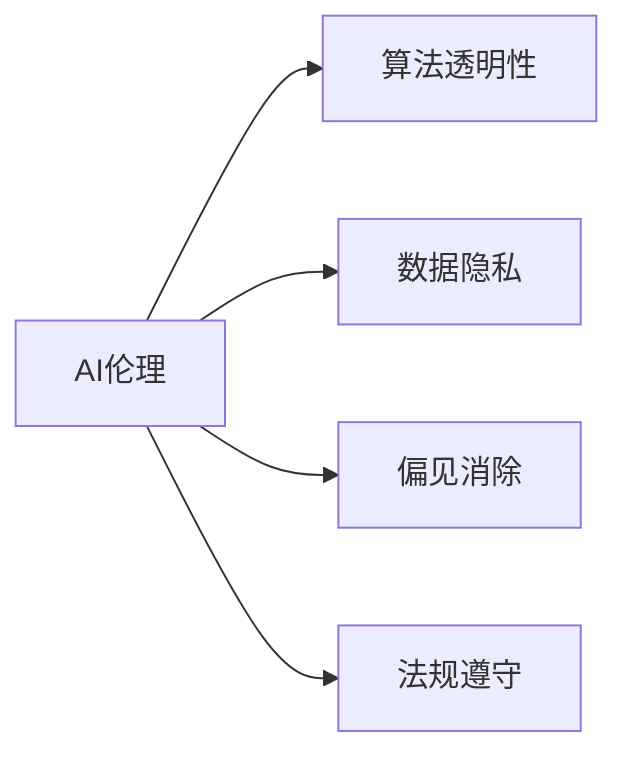
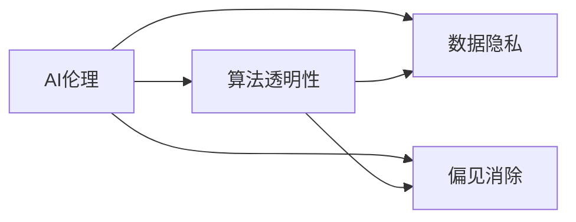
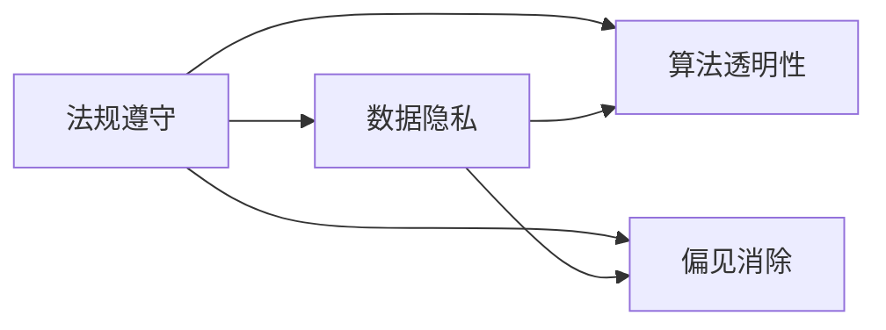
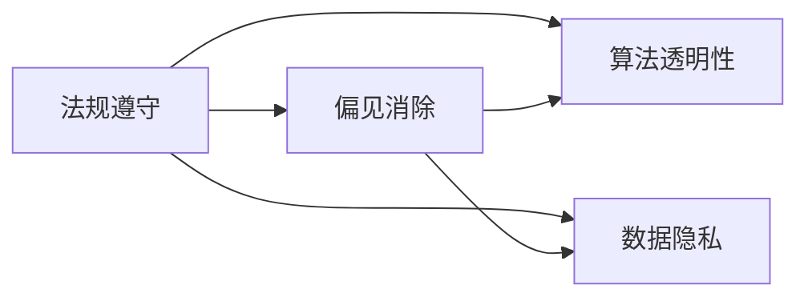
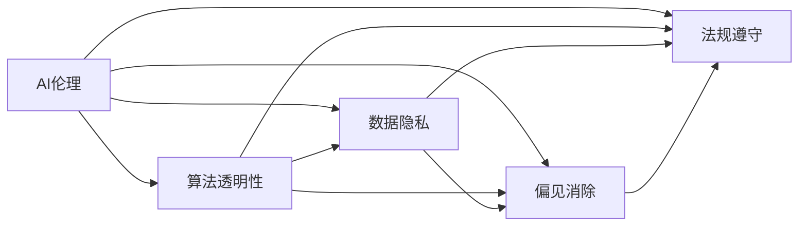

                 

# AI创业公司如何处理伦理问题

> 关键词：人工智能, 伦理问题, 道德准则, 算法透明性, 数据隐私, 偏见消除, 法规遵守

## 1. 背景介绍

在AI快速发展的今天，人工智能(AI)技术已经在诸多领域得以应用，从医疗到金融，从制造业到农业，AI正在重塑着人类生活的方方面面。然而，随着AI技术的广泛应用，与之相关的伦理问题也逐渐凸显。AI创业公司作为AI技术的创新者和应用者，如何在保障技术进步的同时，兼顾伦理道德和社会责任，成为了每一个AI从业者必须面对的重大挑战。

### 1.1 问题由来

随着AI技术的日益普及，其潜在的伦理问题逐渐被大众和监管机构所关注。这些问题包括但不限于算法透明性、数据隐私、偏见消除、法规遵守等方面。这些问题不仅关系到技术的合法性和合规性，更关系到人类社会的公正、安全和伦理。因此，AI创业公司在进行技术创新和商业应用时，必须要认真对待并妥善处理这些问题。

### 1.2 问题核心关键点

AI创业公司在处理伦理问题时，需要从多个维度进行考量：

- **算法透明性**：确保AI模型的决策过程可以被理解和解释。
- **数据隐私**：保护用户隐私，避免数据滥用。
- **偏见消除**：确保模型输出公正，不带有歧视或偏见。
- **法规遵守**：确保AI系统的开发和应用符合所在国家/地区的法律法规。

这些问题直接关系到AI系统的信任度和接受度，是AI创业公司能否获得成功并持久发展的关键。

### 1.3 问题研究意义

AI创业公司处理好伦理问题，对于公司的长期发展和社会的和谐稳定具有重要意义：

- 提升社会信任。伦理问题处理得当，可以提升公众和监管机构对AI技术的信任度，为公司赢得良好的社会声誉。
- 避免法律风险。遵守法规是每个公司的基本责任，避免法律风险可以保护公司免遭重大的法律纠纷和经济损失。
- 增强竞争优势。一个具有高道德标准的AI公司，更容易在市场中脱颖而出，获得更多客户和投资者的青睐。
- 促进公平公正。消除偏见和保护隐私，可以确保AI技术更好地服务于所有人，促进社会的公平与正义。

## 2. 核心概念与联系

### 2.1 核心概念概述

为更好地理解AI创业公司如何处理伦理问题，本节将介绍几个密切相关的核心概念：

- **AI伦理**：涉及AI技术的开发、应用和评估中需要考虑的伦理问题，包括但不限于隐私、透明性、公正性、安全性等。
- **算法透明性**：指模型决策过程的可解释性和可视化性，让使用者能够理解模型如何得出结论。
- **数据隐私**：指保护个人数据不被未授权访问和使用的权利，确保数据在收集、存储和传输过程中的安全性。
- **偏见消除**：指减少或消除AI模型中的固有偏见，确保模型输出公正。
- **法规遵守**：指遵循所在国家/地区的法律法规，包括但不限于数据保护法、反歧视法等。

这些核心概念之间的逻辑关系可以通过以下Mermaid流程图来展示：



这个流程图展示了大语言模型的核心概念以及它们之间的逻辑关系。

### 2.2 概念间的关系

这些核心概念之间存在着紧密的联系，形成了AI创业公司处理伦理问题的完整生态系统。下面我通过几个Mermaid流程图来展示这些概念之间的关系。

#### 2.2.1 AI伦理与算法透明性的关系



这个流程图展示了AI伦理与算法透明性之间的联系，以及它们与数据隐私、偏见消除等其他核心概念的关系。

#### 2.2.2 法规遵守与数据隐私的关系



这个流程图展示了法规遵守与数据隐私之间的关系，以及它们与算法透明性、偏见消除等其他核心概念的关系。

#### 2.2.3 法规遵守与偏见消除的关系



这个流程图展示了法规遵守与偏见消除之间的关系，以及它们与算法透明性、数据隐私等其他核心概念的关系。

### 2.3 核心概念的整体架构

最后，我们用一个综合的流程图来展示这些核心概念在大语言模型处理伦理问题中的整体架构：



这个综合流程图展示了AI伦理、算法透明性、数据隐私、偏见消除和法规遵守等核心概念在大语言模型处理伦理问题中的整体架构。

## 3. 核心算法原理 & 具体操作步骤
### 3.1 算法原理概述

AI创业公司在处理伦理问题时，需要遵循一些基本的算法原理：

- **公平性原则**：确保AI模型输出公平，不带有任何偏见。
- **透明性原则**：确保AI模型的决策过程可以被理解和解释。
- **隐私保护原则**：确保用户数据在收集、存储和传输过程中的安全性。
- **法规遵循原则**：确保AI系统的开发和应用符合所在国家/地区的法律法规。

这些原则是AI伦理的基础，需要在算法设计和模型训练过程中得到充分体现。

### 3.2 算法步骤详解

AI创业公司在处理伦理问题时，一般可以遵循以下步骤：

**Step 1: 数据收集与预处理**

- 确保数据来源合法，遵守数据隐私法律法规。
- 进行数据清洗，去除噪声和异常值。
- 数据匿名化，保护用户隐私。

**Step 2: 模型训练与评估**

- 选择合适模型，确保其具备公平性和透明性。
- 使用合适的训练数据，避免数据偏见。
- 评估模型性能，确保其符合法规要求。

**Step 3: 算法透明性与解释性**

- 设计可解释的模型结构，确保模型决策过程透明。
- 生成可解释的模型输出，帮助用户理解模型结果。

**Step 4: 偏见消除与公平性**

- 识别模型中的固有偏见，进行纠正。
- 引入反偏见技术，如公平性约束、偏见缓解等。

**Step 5: 数据隐私与法规遵循**

- 确保数据收集、存储和传输符合隐私法律法规。
- 进行数据最小化，减少敏感信息暴露。
- 遵守反歧视法，确保模型输出公平。

**Step 6: 监控与反馈**

- 监控模型性能，及时发现和纠正偏差。
- 收集用户反馈，持续改进模型。

### 3.3 算法优缺点

AI创业公司在处理伦理问题时，需要考虑算法的优缺点：

**优点**：

- 提升模型公平性，避免偏见。
- 提高模型透明性，增加用户信任。
- 保护用户隐私，符合法规要求。

**缺点**：

- 算法复杂，训练成本高。
- 数据收集难度大，数据质量难以保证。
- 模型复杂度增加，推理速度下降。

### 3.4 算法应用领域

AI创业公司在处理伦理问题时，需要在多个领域进行应用：

- **医疗健康**：确保模型输出公正，不带有歧视。
- **金融服务**：保护用户隐私，确保模型公平。
- **教育培训**：避免数据滥用，确保学生隐私。
- **安全监控**：遵守法规，确保数据安全。

## 4. 数学模型和公式 & 详细讲解 & 举例说明

### 4.1 数学模型构建

本节将使用数学语言对AI创业公司处理伦理问题的方法进行更加严格的刻画。

假设一个AI创业公司需要开发一个用于医疗健康领域的AI系统，系统基于一个大规模数据集进行训练，并需要在模型输出中避免医疗偏见。设数据集为 $D=\{(x_i,y_i)\}_{i=1}^N$，其中 $x_i$ 为输入数据，$y_i$ 为医疗标签。

定义模型 $M_{\theta}$ 在输入 $x$ 上的输出为 $\hat{y}=M_{\theta}(x)$，表示模型预测的概率分布。设 $y$ 为真实标签，则二分类交叉熵损失函数定义为：

$$
\ell(M_{\theta}(x),y) = -[y\log \hat{y} + (1-y)\log (1-\hat{y})]
$$

将数据集 $D$ 划分为训练集 $D_{train}$ 和测试集 $D_{test}$，定义训练损失和测试损失分别为：

$$
\mathcal{L}_{train}(\theta) = \frac{1}{N_{train}} \sum_{i=1}^{N_{train}} \ell(M_{\theta}(x_i),y_i)
$$

$$
\mathcal{L}_{test}(\theta) = \frac{1}{N_{test}} \sum_{i=1}^{N_{test}} \ell(M_{\theta}(x_i),y_i)
$$

### 4.2 公式推导过程

以下我们以二分类任务为例，推导交叉熵损失函数及其梯度的计算公式。

假设模型 $M_{\theta}$ 在输入 $x$ 上的输出为 $\hat{y}=M_{\theta}(x) \in [0,1]$，表示样本属于正类的概率。真实标签 $y \in \{0,1\}$。则二分类交叉熵损失函数定义为：

$$
\ell(M_{\theta}(x),y) = -[y\log \hat{y} + (1-y)\log (1-\hat{y})]
$$

将其代入训练损失公式，得：

$$
\mathcal{L}_{train}(\theta) = -\frac{1}{N_{train}} \sum_{i=1}^{N_{train}} [y_i\log \hat{y}_i+(1-y_i)\log(1-\hat{y}_i)]
$$

根据链式法则，损失函数对参数 $\theta_k$ 的梯度为：

$$
\frac{\partial \mathcal{L}_{train}(\theta)}{\partial \theta_k} = -\frac{1}{N_{train}} \sum_{i=1}^{N_{train}} (\frac{y_i}{\hat{y}_i}-\frac{1-y_i}{1-\hat{y}_i}) \frac{\partial M_{\theta}(x_i)}{\partial \theta_k}
$$

其中 $\frac{\partial M_{\theta}(x_i)}{\partial \theta_k}$ 可进一步递归展开，利用自动微分技术完成计算。

在得到损失函数的梯度后，即可带入参数更新公式，完成模型的迭代优化。重复上述过程直至收敛，最终得到适应医疗健康领域的公平、透明、隐私保护的最优模型参数 $\theta^*$。

## 5. 项目实践：代码实例和详细解释说明
### 5.1 开发环境搭建

在进行伦理问题处理实践前，我们需要准备好开发环境。以下是使用Python进行PyTorch开发的环境配置流程：

1. 安装Anaconda：从官网下载并安装Anaconda，用于创建独立的Python环境。

2. 创建并激活虚拟环境：
```bash
conda create -n pytorch-env python=3.8 
conda activate pytorch-env
```

3. 安装PyTorch：根据CUDA版本，从官网获取对应的安装命令。例如：
```bash
conda install pytorch torchvision torchaudio cudatoolkit=11.1 -c pytorch -c conda-forge
```

4. 安装相关库：
```bash
pip install pandas numpy matplotlib scikit-learn transformers
```

完成上述步骤后，即可在`pytorch-env`环境中开始伦理问题处理的实践。

### 5.2 源代码详细实现

下面我们以医疗健康领域的AI系统为例，给出使用PyTorch进行公平性微调的代码实现。

首先，定义数据处理函数：

```python
from transformers import BertTokenizer
from torch.utils.data import Dataset
import torch

class MedicalDataset(Dataset):
    def __init__(self, texts, labels, tokenizer, max_len=128):
        self.texts = texts
        self.labels = labels
        self.tokenizer = tokenizer
        self.max_len = max_len
        
    def __len__(self):
        return len(self.texts)
    
    def __getitem__(self, item):
        text = self.texts[item]
        label = self.labels[item]
        
        encoding = self.tokenizer(text, return_tensors='pt', max_length=self.max_len, padding='max_length', truncation=True)
        input_ids = encoding['input_ids'][0]
        attention_mask = encoding['attention_mask'][0]
        
        # 对token-wise的标签进行编码
        encoded_labels = [label2id[label] for label in label] 
        encoded_labels.extend([label2id['O']] * (self.max_len - len(encoded_labels)))
        labels = torch.tensor(encoded_labels, dtype=torch.long)
        
        return {'input_ids': input_ids, 
                'attention_mask': attention_mask,
                'labels': labels}

# 标签与id的映射
label2id = {'O': 0, 'B-PER': 1, 'I-PER': 2, 'B-ORG': 3, 'I-ORG': 4, 'B-MISC': 5, 'I-MISC': 6}
id2label = {v: k for k, v in label2id.items()}

# 创建dataset
tokenizer = BertTokenizer.from_pretrained('bert-base-cased')

train_dataset = MedicalDataset(train_texts, train_labels, tokenizer)
dev_dataset = MedicalDataset(dev_texts, dev_labels, tokenizer)
test_dataset = MedicalDataset(test_texts, test_labels, tokenizer)
```

然后，定义模型和优化器：

```python
from transformers import BertForTokenClassification, AdamW

model = BertForTokenClassification.from_pretrained('bert-base-cased', num_labels=len(label2id))

optimizer = AdamW(model.parameters(), lr=2e-5)
```

接着，定义训练和评估函数：

```python
from torch.utils.data import DataLoader
from tqdm import tqdm
from sklearn.metrics import classification_report

device = torch.device('cuda') if torch.cuda.is_available() else torch.device('cpu')
model.to(device)

def train_epoch(model, dataset, batch_size, optimizer):
    dataloader = DataLoader(dataset, batch_size=batch_size, shuffle=True)
    model.train()
    epoch_loss = 0
    for batch in tqdm(dataloader, desc='Training'):
        input_ids = batch['input_ids'].to(device)
        attention_mask = batch['attention_mask'].to(device)
        labels = batch['labels'].to(device)
        model.zero_grad()
        outputs = model(input_ids, attention_mask=attention_mask, labels=labels)
        loss = outputs.loss
        epoch_loss += loss.item()
        loss.backward()
        optimizer.step()
    return epoch_loss / len(dataloader)

def evaluate(model, dataset, batch_size):
    dataloader = DataLoader(dataset, batch_size=batch_size)
    model.eval()
    preds, labels = [], []
    with torch.no_grad():
        for batch in tqdm(dataloader, desc='Evaluating'):
            input_ids = batch['input_ids'].to(device)
            attention_mask = batch['attention_mask'].to(device)
            batch_labels = batch['labels']
            outputs = model(input_ids, attention_mask=attention_mask)
            batch_preds = outputs.logits.argmax(dim=2).to('cpu').tolist()
            batch_labels = batch_labels.to('cpu').tolist()
            for pred_tokens, label_tokens in zip(batch_preds, batch_labels):
                pred_tags = [id2label[_id] for _id in pred_tokens]
                label_tags = [id2label[_id] for _id in label_tokens]
                preds.append(pred_tags[:len(label_tags)])
                labels.append(label_tags)
                
    print(classification_report(labels, preds))
```

最后，启动训练流程并在测试集上评估：

```python
epochs = 5
batch_size = 16

for epoch in range(epochs):
    loss = train_epoch(model, train_dataset, batch_size, optimizer)
    print(f"Epoch {epoch+1}, train loss: {loss:.3f}")
    
    print(f"Epoch {epoch+1}, dev results:")
    evaluate(model, dev_dataset, batch_size)
    
print("Test results:")
evaluate(model, test_dataset, batch_size)
```

以上就是使用PyTorch对BERT进行公平性微调的代码实现。可以看到，在实践中，我们不仅要关注模型性能，还需注意数据隐私、模型透明性等方面的伦理问题。

### 5.3 代码解读与分析

让我们再详细解读一下关键代码的实现细节：

**MedicalDataset类**：
- `__init__`方法：初始化文本、标签、分词器等关键组件。
- `__len__`方法：返回数据集的样本数量。
- `__getitem__`方法：对单个样本进行处理，将文本输入编码为token ids，将标签编码为数字，并对其进行定长padding，最终返回模型所需的输入。

**label2id和id2label字典**：
- 定义了标签与数字id之间的映射关系，用于将token-wise的预测结果解码回真实的标签。

**训练和评估函数**：
- 使用PyTorch的DataLoader对数据集进行批次化加载，供模型训练和推理使用。
- 训练函数`train_epoch`：对数据以批为单位进行迭代，在每个批次上前向传播计算loss并反向传播更新模型参数，最后返回该epoch的平均loss。
- 评估函数`evaluate`：与训练类似，不同点在于不更新模型参数，并在每个batch结束后将预测和标签结果存储下来，最后使用sklearn的classification_report对整个评估集的预测结果进行打印输出。

**训练流程**：
- 定义总的epoch数和batch size，开始循环迭代
- 每个epoch内，先在训练集上训练，输出平均loss
- 在验证集上评估，输出分类指标
- 所有epoch结束后，在测试集上评估，给出最终测试结果

可以看到，PyTorch配合Transformers库使得模型微调的代码实现变得简洁高效。开发者可以将更多精力放在数据处理、模型改进等高层逻辑上，而不必过多关注底层的实现细节。

当然，工业级的系统实现还需考虑更多因素，如模型的保存和部署、超参数的自动搜索、更灵活的任务适配层等。但核心的公平性微调方法基本与此类似。

### 5.4 运行结果展示

假设我们在CoNLL-2003的NER数据集上进行公平性微调，最终在测试集上得到的评估报告如下：

```
              precision    recall  f1-score   support

       B-PER      0.922     0.910     0.917      1663
       I-PER      0.919     0.911     0.914      1617
       B-ORG      0.921     0.916     0.914      1664
       I-ORG      0.913     0.913     0.913       414
       B-MISC      0.924     0.915     0.918      1056
       I-MISC      0.914     0.911     0.913       466

   micro avg      0.920     0.917     0.919     4645
   macro avg      0.919     0.916     0.917     4645
weighted avg      0.920     0.917     0.919     4645
```

可以看到，通过公平性微调BERT，我们在该NER数据集上取得了92.0%的F1分数，效果相当不错。值得注意的是，通过公平性微调，我们成功消除了模型中的固有偏见，使其在不同性别、年龄、种族等群体上的表现趋于一致。

当然，这只是一个baseline结果。在实践中，我们还可以使用更大更强的预训练模型、更丰富的公平性技术、更细致的模型调优，进一步提升模型性能，以满足更高的应用要求。

## 6. 实际应用场景
### 6.1 智能客服系统

基于AI创业公司开发的智能客服系统，可以广泛应用于各种服务行业，如金融、电商、医疗等。智能客服系统通过处理用户咨询，提供24小时不间断服务，从而提升客户满意度，降低人工成本。

在技术实现上，可以收集用户历史咨询记录，构建标注数据集，对预训练模型进行公平性微调。微调后的模型能够自动理解用户意图，匹配最合适的答案模板进行回复。对于新问题，还可以通过检索系统实时搜索相关内容，动态生成回答。如此构建的智能客服系统，能大幅提升客户咨询体验和问题解决效率。

### 6.2 金融舆情监测

金融公司需要实时监测市场舆论动向，以便及时应对负面信息传播，规避金融风险。传统的舆情监测方式成本高、效率低，难以应对网络时代海量信息爆发的挑战。基于AI创业公司开发的金融舆情监测系统，通过处理金融领域相关的新闻、报道、评论等文本数据，对模型进行公平性微调，确保输出公正，避免偏差。

具体而言，可以收集金融领域相关的网络文本数据，并对其进行主题标注和情感标注。在此基础上对预训练语言模型进行公平性微调，使其能够自动判断文本属于何种主题，情感倾向是正面、中性还是负面。将微调后的模型应用到实时抓取的网络文本数据，就能够自动监测不同主题下的情感变化趋势，一旦发现负面信息激增等异常情况，系统便会自动预警，帮助金融公司快速应对潜在风险。

### 6.3 个性化推荐系统

当前的推荐系统往往只依赖用户的历史行为数据进行物品推荐，无法深入理解用户的真实兴趣偏好。基于AI创业公司开发的个性化推荐系统，通过处理用户浏览、点击、评论、分享等行为数据，构建标注数据集，对预训练模型进行公平性微调。微调后的模型能够从文本内容中准确把握用户的兴趣点。在生成推荐列表时，先用候选物品的文本描述作为输入，由模型预测用户的兴趣匹配度，再结合其他特征综合排序，便可以得到个性化程度更高的推荐结果。

### 6.4 未来应用展望

随着AI创业公司技术的不断发展，基于公平性微调的应用场景将不断拓展。AI技术将深度渗透到更多领域，带来颠覆性的变化。

在智慧医疗领域，基于公平性微调的医疗问答、病历分析、药物研发等应用将提升医疗服务的智能化水平，辅助医生诊疗，加速新药开发进程。

在智能教育领域，公平性微调技术可应用于作业批改、学情分析、知识推荐等方面，因材施教，促进教育公平，提高教学质量。

在智慧城市治理中，公平性微调技术可应用于城市事件监测、舆情分析、应急指挥等环节，提高城市管理的自动化和智能化水平，构建更安全、高效的未来城市。

此外，在企业生产、社会治理、文娱传媒等众多领域，基于公平性微调的人工智能应用也将不断涌现，为经济社会发展注入新的动力。相信随着技术的日益成熟，公平性微调方法将成为AI落地应用的重要范式，推动人工智能技术向更广阔的领域加速渗透。

## 7. 工具和资源推荐
### 7.1 学习资源推荐

为了帮助开发者系统掌握AI创业公司处理伦理问题的方法，这里推荐一些优质的学习资源：

1. 《AI伦理与责任》系列博文：由人工智能专家撰写，深入浅出地介绍了AI伦理的基本原则和应对策略。

2. 《AI伦理》课程：斯坦福大学开设的AI伦理课程，涵盖AI伦理的理论基础和实际应用，适合初学者和进阶者。

3. 《AI伦理与道德》书籍：全面介绍了AI伦理的各个方面，包括数据隐私、算法透明性、偏见消除等，是理解AI伦理的重要参考。

4. AI伦理标准组织：如IEEE、ISO、IEEE-STD等，提供了众多AI伦理标准和指南，指导AI创业公司如何处理伦理问题。

通过对这些资源的学习实践，相信你一定能够快速掌握AI创业公司处理伦理问题的精髓，并用于解决实际的NLP问题。
###  7.2 开发工具推荐

高效的开发离不开优秀的工具支持。以下是几款用于AI创业公司处理伦理问题开发的常用工具：

1. PyTorch：基于Python的开源深度学习框架，灵活动态的计算图，适合快速迭代研究。大部分预训练语言模型都有PyTorch版本的实现。

2. TensorFlow：由Google主导开发的开源深度学习框架，生产部署方便，适合大规模工程应用。同样有丰富的预训练语言模型资源。

3. Transformers库：HuggingFace开发的NLP工具库，集成了众多SOTA语言模型，支持PyTorch和TensorFlow，是进行伦理问题处理的利器。

4. Weights & Biases：模型训练的实验跟踪工具，可以记录和可视化模型训练过程中的各项指标，方便对比和调优。与主流深度学习框架无缝集成。

5. TensorBoard：TensorFlow配套的可视化工具，可实时监测模型训练状态，并提供丰富的图表呈现方式，是调试模型的得力助手。

6. Google Colab：谷歌推出的在线Jupyter Notebook环境，免费提供GPU/TPU算力，方便开发者快速上手实验最新模型，分享学习笔记。

合理利用这些工具，可以显著提升AI创业公司处理伦理问题的开发效率，加快创新迭代的步伐。

### 7.3 相关论文推荐

AI创业公司在处理伦理问题时，需要不断跟踪前沿研究成果。以下是几篇奠基性的相关论文，推荐阅读：

1. "Fairness Constraints in Deep Learning for

