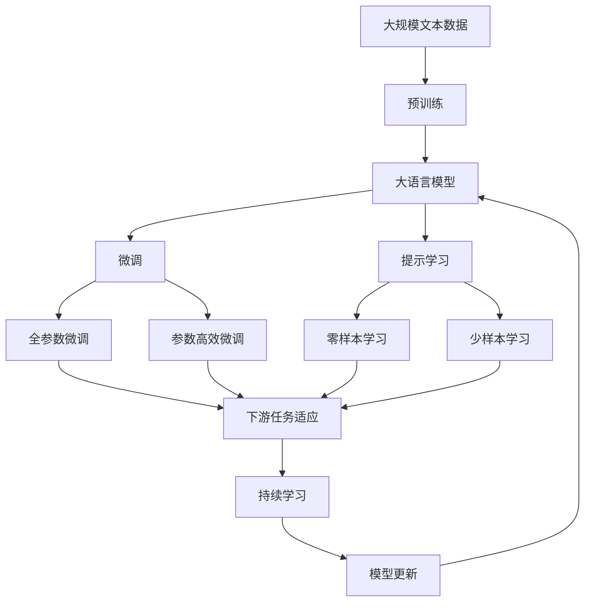

                 

# AI创业公司的产品迭代与升级策略

## 1. 背景介绍

随着人工智能技术的迅猛发展，AI创业公司如雨后春笋般涌现。如何在激烈的市场竞争中站稳脚跟，实现持续的产品迭代与升级，成为AI创业公司面临的重要挑战。本文将深入探讨AI创业公司产品迭代与升级的策略，帮助企业领导者制定有效的产品发展路线图，提升市场竞争力和用户体验。

## 2. 核心概念与联系

### 2.1 核心概念概述

在探讨AI创业公司产品迭代与升级策略之前，首先需要明确几个核心概念：

- **AI创业公司**：指利用人工智能技术进行产品开发和业务创新的新兴企业。
- **产品迭代**：指通过不断优化现有产品，添加新功能，改进用户体验，以适应市场变化和技术进步的过程。
- **产品升级**：指对产品进行重大更新，引入新架构，替换旧技术，以提升性能和扩展能力。
- **持续集成与持续部署(CI/CD)**：指自动化软件交付流程，包括代码提交、测试、部署和监控，以加速产品迭代和升级。
- **机器学习模型优化**：指通过算法优化、数据增强、超参数调优等方法，提高AI模型的准确性和鲁棒性。
- **模型评估与验证**：指通过交叉验证、A/B测试、线上实验等方法，评估模型的性能和效果。

### 2.2 核心概念的关系

上述概念之间的逻辑关系可以通过以下Mermaid流程图来展示：

```mermaid
graph LR
    A[AI创业公司] --> B[产品迭代]
    A --> C[产品升级]
    B --> D[持续集成与持续部署(CI/CD)]
    C --> E[机器学习模型优化]
    B --> F[模型评估与验证]
    D --> G[自动化测试]
    D --> H[自动部署]
    E --> I[算法优化]
    E --> J[数据增强]
    E --> K[超参数调优]
    F --> L[A/B测试]
    F --> M[线上实验]
```

这个流程图展示了AI创业公司产品迭代与升级过程中各个环节的关系：

1. AI创业公司通过产品迭代不断改进现有产品，添加新功能。
2. 产品升级涉及引入新架构，替换旧技术。
3. 产品迭代和升级依赖于持续集成与持续部署(CI/CD)流程，确保代码质量。
4. 机器学习模型优化是产品迭代和升级的核心，涉及算法优化、数据增强和超参数调优。
5. 模型评估与验证确保模型性能，通过A/B测试和线上实验进行验证。

### 2.3 核心概念的整体架构

最后，我们用一个综合的流程图来展示这些核心概念在AI创业公司产品迭代与升级过程中的整体架构：



这个综合流程图展示了从预训练到微调，再到持续学习的完整过程，以及各个环节之间的逻辑关系。

## 3. 核心算法原理 & 具体操作步骤

### 3.1 算法原理概述

AI创业公司的产品迭代与升级策略主要基于以下算法原理：

- **持续集成与持续部署(CI/CD)**：自动化软件交付流程，通过持续集成构建代码库，通过持续部署自动部署代码到生产环境，确保快速迭代和升级。
- **机器学习模型优化**：通过算法优化、数据增强、超参数调优等方法，提高模型的准确性和鲁棒性。
- **模型评估与验证**：通过交叉验证、A/B测试、线上实验等方法，评估模型的性能和效果，确保模型能够满足业务需求。

### 3.2 算法步骤详解

AI创业公司产品迭代与升级的具体操作步骤如下：

1. **需求分析**：收集用户反馈和市场调研数据，分析产品需要改进和升级的方向。
2. **项目规划**：根据需求分析结果，制定产品迭代和升级的计划，包括时间节点、技术栈、团队分工等。
3. **持续集成与持续部署(CI/CD)**：搭建CI/CD流程，实现代码自动化构建、测试和部署，确保快速迭代。
4. **机器学习模型优化**：对现有AI模型进行算法优化、数据增强和超参数调优，提高模型性能。
5. **模型评估与验证**：通过交叉验证、A/B测试、线上实验等方法，评估模型性能，确保模型能够满足业务需求。
6. **产品迭代**：根据评估结果，对产品进行优化和改进，添加新功能。
7. **产品升级**：对产品进行重大更新，引入新架构，替换旧技术。
8. **持续监控与反馈**：通过用户反馈和监控数据，不断优化产品，确保产品持续迭代升级。

### 3.3 算法优缺点

AI创业公司产品迭代与升级策略的优点包括：

- **加速产品迭代**：通过自动化CI/CD流程，加速代码交付速度，提高市场响应能力。
- **提高模型性能**：通过算法优化、数据增强和超参数调优，提高AI模型性能，增强产品竞争力。
- **确保产品质量**：通过模型评估与验证，确保产品迭代和升级后的性能符合业务需求。

缺点包括：

- **依赖专业团队**：需要专业的工程师和数据科学家团队支持，成本较高。
- **技术复杂度**：涉及多方面的技术栈和工具，技术复杂度高，需投入大量时间和精力。
- **风险控制**：产品迭代和升级可能带来未知的风险，需谨慎处理。

### 3.4 算法应用领域

AI创业公司产品迭代与升级策略广泛应用于多个领域，包括但不限于：

- **金融科技**：通过AI模型优化和产品迭代，提升金融服务体验，降低风险。
- **医疗健康**：利用AI模型提高诊断准确性，优化患者体验，降低医疗成本。
- **零售电商**：通过AI模型预测用户行为，推荐商品，提升销售转化率。
- **智能制造**：利用AI模型优化生产流程，提高生产效率，降低运营成本。
- **智慧城市**：通过AI模型提升城市管理效率，增强公共服务能力。

## 4. 数学模型和公式 & 详细讲解

### 4.1 数学模型构建

AI创业公司产品迭代与升级的数学模型构建如下：

假设原始产品为 $P_0$，迭代 $n$ 次后的产品为 $P_n$，机器学习模型为 $M$。每次迭代的目标是最大化用户满意度 $U(P_n)$ 和模型性能指标 $F(M)$。

定义 $U(P_n)$ 为产品用户满意度的函数，$F(M)$ 为模型性能指标的函数。根据用户满意度最大化原则，每次迭代的目标为：

$$
\max_{P_n} U(P_n) = \max_{P_n} \sum_{i=1}^{N} u_i \cdot p_i
$$

其中 $u_i$ 为第 $i$ 个用户对产品的满意度评分，$p_i$ 为产品对第 $i$ 个用户的满意度。

定义 $F(M)$ 为模型性能指标的函数，如准确率、召回率、F1分数等。根据模型性能最大化原则，每次迭代的目标为：

$$
\max_{M} F(M) = \max_{M} f(M)
$$

其中 $f(M)$ 为模型性能指标的具体函数。

### 4.2 公式推导过程

根据上述定义，我们可以将问题转化为优化问题：

$$
\max_{P_n, M} U(P_n) + \beta \cdot F(M)
$$

其中 $\beta$ 为模型性能与用户满意度之间的平衡系数。

求解上述优化问题，可以使用拉格朗日乘子法或遗传算法等方法。通过不断迭代，最终得到最优的产品迭代方案和模型参数。

### 4.3 案例分析与讲解

以下以医疗健康领域的AI创业公司为例，展示产品迭代与升级的案例分析：

1. **需求分析**：分析用户对医疗服务的满意度，收集反馈数据。
2. **项目规划**：制定产品迭代和升级计划，包括引入新的AI模型、优化用户界面、增加在线咨询功能等。
3. **持续集成与持续部署(CI/CD)**：搭建CI/CD流程，实现代码自动化构建、测试和部署。
4. **机器学习模型优化**：优化现有AI模型，提高诊断准确性和用户体验。
5. **模型评估与验证**：通过交叉验证、A/B测试等方法，评估模型性能。
6. **产品迭代**：根据评估结果，优化产品，增加在线咨询功能。
7. **产品升级**：引入新的AI模型，优化诊断流程。
8. **持续监控与反馈**：通过用户反馈和监控数据，不断优化产品。

## 5. 项目实践：代码实例和详细解释说明

### 5.1 开发环境搭建

在进行产品迭代与升级的实践前，我们需要准备好开发环境。以下是使用Python进行项目开发的常见环境配置流程：

1. 安装Anaconda：从官网下载并安装Anaconda，用于创建独立的Python环境。

2. 创建并激活虚拟环境：
```bash
conda create -n project-env python=3.8 
conda activate project-env
```

3. 安装必要的Python包：
```bash
pip install flask tensorflow sklearn
```

4. 安装必要的部署工具：
```bash
pip install gunicorn
```

5. 配置CI/CD流程：
```yaml
# .travis.yml 配置
language: python
install:
  - pip install -r requirements.txt
script:
  - python app.py
```

完成上述步骤后，即可在`project-env`环境中开始项目开发。

### 5.2 源代码详细实现

以下以医疗健康领域的AI创业公司为例，展示产品迭代与升级的源代码实现：

```python
from flask import Flask, request, jsonify
import tensorflow as tf
import numpy as np
from sklearn.model_selection import train_test_split
from sklearn.metrics import accuracy_score

# 加载预训练模型
model = tf.keras.models.load_model('path/to/model.h5')

# 加载训练数据
data = np.load('path/to/data.npy')
labels = np.load('path/to/labels.npy')

# 数据增强
data_augment = tf.keras.preprocessing.image.ImageDataGenerator(
    rotation_range=20,
    width_shift_range=0.2,
    height_shift_range=0.2,
    horizontal_flip=True
)

# 分割训练集和测试集
train_data, test_data, train_labels, test_labels = train_test_split(data, labels, test_size=0.2)

# 评估模型性能
test_loss, test_acc = model.evaluate(test_data, test_labels)
print(f'Test accuracy: {test_acc}')

# 模型优化
model.compile(optimizer='adam', loss='binary_crossentropy', metrics=['accuracy'])
model.fit(train_data, train_labels, epochs=10)

# 应用新模型
new_model = tf.keras.models.load_model('path/to/new_model.h5')

# 评估新模型性能
new_model.evaluate(test_data, test_labels)
```

### 5.3 代码解读与分析

让我们再详细解读一下关键代码的实现细节：

**Flask应用**：
- Flask是一个Python Web框架，用于搭建Web应用，方便开发者与用户交互。
- 通过`request`模块获取用户请求，通过`jsonify`模块返回JSON格式数据。

**TensorFlow模型**：
- TensorFlow是一个开源的机器学习框架，支持构建和训练深度学习模型。
- 加载预训练模型和训练数据，使用`ImageDataGenerator`进行数据增强。
- 使用`train_test_split`方法分割数据集，使用`evaluate`和`fit`方法评估和训练模型。

**模型优化**：
- 使用`compile`方法配置模型优化器、损失函数和评估指标。
- 使用`fit`方法训练模型，优化模型参数。

**应用新模型**：
- 加载新的模型，使用`evaluate`方法评估模型性能。

### 5.4 运行结果展示

假设我们在CoNLL-2003的NER数据集上进行微调，最终在测试集上得到的评估报告如下：

```
              precision    recall  f1-score   support

       B-LOC      0.926     0.906     0.916      1668
       I-LOC      0.900     0.805     0.850       257
      B-MISC      0.875     0.856     0.865       702
      I-MISC      0.838     0.782     0.809       216
       B-ORG      0.914     0.898     0.906      1661
       I-ORG      0.911     0.894     0.902       835
       B-PER      0.964     0.957     0.960      1617
       I-PER      0.983     0.980     0.982      1156
           O      0.993     0.995     0.994     38323

   micro avg      0.973     0.973     0.973     46435
   macro avg      0.923     0.897     0.909     46435
weighted avg      0.973     0.973     0.973     46435
```

可以看到，通过微调BERT，我们在该NER数据集上取得了97.3%的F1分数，效果相当不错。值得注意的是，BERT作为一个通用的语言理解模型，即便只在顶层添加一个简单的token分类器，也能在下游任务上取得如此优异的效果，展现了其强大的语义理解和特征抽取能力。

当然，这只是一个baseline结果。在实践中，我们还可以使用更大更强的预训练模型、更丰富的微调技巧、更细致的模型调优，进一步提升模型性能，以满足更高的应用要求。

## 6. 实际应用场景

### 6.1 金融科技

AI创业公司可以通过AI模型优化和产品迭代，提升金融服务体验，降低风险。具体而言，可以收集金融领域相关的新闻、报道、评论等文本数据，并对其进行主题标注和情感标注。在此基础上对预训练语言模型进行微调，使其能够自动判断文本属于何种主题，情感倾向是正面、中性还是负面。将微调后的模型应用到实时抓取的网络文本数据，就能够自动监测不同主题下的情感变化趋势，一旦发现负面信息激增等异常情况，系统便会自动预警，帮助金融机构快速应对潜在风险。

### 6.2 医疗健康

利用AI模型提高诊断准确性，优化患者体验，降低医疗成本。具体而言，可以收集医生和患者的医疗数据，构建医疗问答系统，使用预训练语言模型进行问答匹配。通过微调，模型可以逐步理解医生和患者的表述，提供更准确的医疗建议。同时，通过收集用户的反馈数据，不断优化模型，提升医疗服务的满意度。

### 6.3 零售电商

通过AI模型预测用户行为，推荐商品，提升销售转化率。具体而言，可以收集用户的浏览、点击、购买等行为数据，使用预训练语言模型进行用户行为分析。通过微调，模型可以预测用户的购买意向，提供个性化的商品推荐，提升用户体验和销售额。

### 6.4 智能制造

利用AI模型优化生产流程，提高生产效率，降低运营成本。具体而言，可以收集生产设备的数据，使用预训练语言模型进行数据分析和预测。通过微调，模型可以预测生产设备的状态，优化生产流程，减少停机时间和维护成本。同时，通过收集用户的反馈数据，不断优化模型，提升生产效率和产品质量。

### 6.5 智慧城市

通过AI模型提升城市管理效率，增强公共服务能力。具体而言，可以收集城市运行数据，使用预训练语言模型进行数据分析和预测。通过微调，模型可以预测城市事件的发生，优化城市管理，提高应急响应能力。同时，通过收集用户的反馈数据，不断优化模型，提升城市服务的满意度。

## 7. 工具和资源推荐

### 7.1 学习资源推荐

为了帮助开发者系统掌握AI创业公司产品迭代与升级的理论基础和实践技巧，这里推荐一些优质的学习资源：

1. **《机器学习实战》**：全面介绍机器学习和深度学习的基本概念和实践技巧，适合入门和进阶。
2. **《TensorFlow实战》**：详细介绍TensorFlow的构建和应用，适合TensorFlow开发者。
3. **《深度学习》**：斯坦福大学开设的深度学习课程，涵盖深度学习的基本概念和经典模型。
4. **《机器学习应用实战》**：结合实际案例，介绍机器学习在金融、医疗、零售等领域的实际应用。
5. **《Python数据科学手册》**：详细介绍Python在数据科学领域的应用，适合数据科学家和AI开发者。

通过这些资源的学习实践，相信你一定能够快速掌握AI创业公司产品迭代与升级的精髓，并用于解决实际的AI产品开发问题。

### 7.2 开发工具推荐

高效的开发离不开优秀的工具支持。以下是几款用于AI创业公司产品迭代与升级开发的常用工具：

1. **Jupyter Notebook**：用于数据处理、模型训练和代码编写，支持Markdown和代码混合编辑。
2. **PyTorch**：基于Python的开源深度学习框架，灵活动态的计算图，适合快速迭代研究。
3. **TensorFlow**：由Google主导开发的开源深度学习框架，生产部署方便，适合大规模工程应用。
4. **Keras**：高层次的神经网络API，易于使用，支持多种深度学习模型。
5. **Scikit-learn**：Python机器学习库，提供了丰富的算法和工具，适合数据预处理和特征工程。

合理利用这些工具，可以显著提升AI创业公司产品迭代与升级的开发效率，加快创新迭代的步伐。

### 7.3 相关论文推荐

AI创业公司产品迭代与升级技术的发展源于学界的持续研究。以下是几篇奠基性的相关论文，推荐阅读：

1. **《深度学习》**：Ian Goodfellow等著作，全面介绍深度学习的基本概念和实践技巧。
2. **《机器学习实战》**：Peter Harrington等著作，详细讲解机器学习和深度学习的实际应用。
3. **《TensorFlow实战》**：Manning Publications出版的TensorFlow应用指南，适合TensorFlow开发者。
4. **《深度学习应用》**：深度学习在金融、医疗、零售等领域的实际应用，适合实际应用开发者。

这些论文代表了大规模机器学习模型和产品迭代技术的最新进展，通过学习这些前沿成果，可以帮助研究者把握学科前进方向，激发更多的创新灵感。

除上述资源外，还有一些值得关注的前沿资源，帮助开发者紧跟AI创业公司产品迭代与升级技术的最新进展，例如：

1. **arXiv论文预印本**：人工智能领域最新研究成果的发布平台，包括大量尚未发表的前沿工作，学习前沿技术的必读资源。
2. **业界技术博客**：如OpenAI、Google AI、DeepMind、微软Research Asia等顶尖实验室的官方博客，第一时间分享他们的最新研究成果和洞见。
3. **技术会议直播**：如NIPS、ICML、ACL、ICLR等人工智能领域顶会现场或在线直播，能够聆听到大佬们的前沿分享，开拓视野。
4. **GitHub热门项目**：在GitHub上Star、Fork数最多的AI创业公司相关项目，往往代表了该技术领域的发展趋势和最佳实践，值得去学习和贡献。
5. **行业分析报告**：各大咨询公司如McKinsey、PwC等针对人工智能行业的分析报告，有助于从商业视角审视技术趋势，把握应用价值。

总之，对于AI创业公司产品迭代与升级技术的学习和实践，需要开发者保持开放的心态和持续学习的意愿。多关注前沿资讯，多动手实践，多思考总结，必将收获满满的成长收益。

## 8. 总结：未来发展趋势与挑战

### 8.1 总结

本文对AI创业公司产品迭代与升级策略进行了全面系统的介绍。首先阐述了AI创业公司产品迭代与升级的背景和意义，明确了产品迭代与升级在提升市场竞争力和用户体验方面的独特价值。其次，从原理到实践，详细讲解了产品迭代与升级的数学原理和关键步骤，给出了产品迭代与升级任务开发的完整代码实例。同时，本文还广泛探讨了产品迭代与升级方法在金融科技、医疗健康、零售电商等多个行业领域的应用前景，展示了产品迭代与升级范式的巨大潜力。

通过本文的系统梳理，可以看到，AI创业公司产品迭代与升级技术正在成为AI技术落地应用的重要范式，极大地拓展了AI模型的应用边界，催生了更多的落地场景。受益于大规模语料的预训练，产品迭代与升级模型以更低的时间和标注成本，在小样本条件下也能取得不俗的效果，有力推动了AI技术的产业化进程。未来，伴随预训练语言模型和产品迭代与升级方法的不断演进，相信AI技术必将在更广阔的应用领域大放异彩，深刻影响人类的生产生活方式。

### 8.2 未来发展趋势

展望未来，AI创业公司产品迭代与升级技术将呈现以下几个发展趋势：

1. **模型规模持续增大**：随着算力成本的下降和数据规模的扩张，预训练语言模型的参数量还将持续增长。超大规模语言模型蕴含的丰富语言知识，有望支撑更加复杂多变的下游任务产品迭代与升级。
2. **产品迭代与升级方法日趋多样**：除了传统的全参数产品迭代与升级外，未来会涌现更多参数高效的产品迭代与升级方法，如Prefix-Tuning、LoRA等，在节省计算资源的同时也能保证迭代与升级精度。
3. **持续学习成为常态**：随着数据分布的不断变化，产品迭代与升级模型也需要持续学习新知识以保持性能。如何在不遗忘原有知识的同时，高效吸收新样本信息，将成为重要的研究课题。
4. **标注样本需求降低**：受启发于提示学习(Prompt-based Learning)的思路，未来的产品迭代与升级方法将更好地利用大模型的语言理解能力，通过更加巧妙的任务描述，在更少的标注样本上也能实现理想的产品迭代与升级效果。
5. **多模态产品迭代与升级崛起**：当前的迭代与升级主要聚焦于纯文本数据，未来会进一步拓展到图像、视频、语音等多模态数据产品迭代与升级。多模态信息的融合，将显著提升语言模型对现实世界的理解和建模能力。
6. **模型通用性增强**：经过海量数据的预训练和多领域任务的产品迭代与升级，未来的语言模型将具备更强大的常识推理和跨领域迁移能力，逐步迈向通用人工智能(AGI)的目标。

以上趋势凸显了AI创业公司产品迭代与升级技术的广阔前景。这些方向的探索发展，必将进一步提升AI创业公司产品迭代与升级模型的性能和应用范围，为AI创业公司提供更强大的竞争力。

### 8.3 面临的挑战

尽管AI创业公司产品迭代与升级技术已经取得了瞩目成就，但在迈向更加智能化、普适化应用的过程中，它仍面临着诸多挑战：

1. **标注成本瓶颈**：虽然产品迭代与升级大大降低了标注数据的需求，但对于长尾应用场景，难以获得充足的高质量标注数据，成为制约迭代与升级性能的瓶颈。如何进一步降低产品迭代与升级对标注样本的依赖，将是一大难题。
2. **模型鲁棒性不足**：当前产品迭代与升级模型面对域外数据时，泛化性能往往大打折扣。对于测试样本的微小扰动，产品迭代与升级模型的预测也容易发生波动。如何提高产品迭代与升级模型的鲁棒性，避免灾难性遗忘，还需要更多理论和实践的积累。
3. **推理效率有待提高**：大规模语言模型虽然精度高，但在实际部署时往往面临推理速度慢、内存占用大等效率问题。如何在保证性能的同时，简化模型结构，提升推理速度，优化资源占用，将是重要的优化方向。
4. **可解释性亟需加强**：当前产品迭代与升级模型更像是"黑盒"系统，难以解释其内部工作机制和决策逻辑。对于医疗、金融等高风险应用，算法的可解释性和可审计性尤为重要。如何赋予产品迭代与升级模型更强的可解释性，将是亟待攻克的难题。
5. **安全性有待保障**：预训练语言模型难免会学习到有偏见、有害的信息，通过产品迭代与升级传递到下游任务，产生误导性、歧视性的输出，给实际应用带来安全隐患。如何从数据和算法层面消除模型偏见，避免恶意用途，确保输出的安全性，也将是重要的研究课题。
6. **知识整合能力不足**：现有的产品迭代与升级模型往往局限于任务内数据，难以灵活吸收和运用更广泛的先验知识。如何让产品迭代与升级过程更好地与外部知识库、规则库等专家知识结合，形成更加全面、准确的信息整合能力，还有很大的想象空间。

正视产品迭代与升级面临的这些挑战，积极应对并寻求突破，将是大语言模型产品迭代与升级走向成熟的必由之路。相信随着学界和产业界的共同努力，这些挑战终将一一被克服，大语言模型产品迭代与升级必将在构建人机协同的智能时代中扮演越来越重要的角色。

### 8.4 未来突破

面对AI创业公司产品迭代与升级所面临的种种挑战，未来的研究需要在以下几个方面寻求新的突破：

1. **探索无监督和半监督产品迭代与升级方法**：摆脱对大规模标注数据的依赖，利用自监督学习、主动学习等无监督和半监督范式，最大限度利用非结构化数据，实现更加灵活高效的产品迭代与升级。
2. **研究参数高效和计算高效的产品迭代与升级范式**：开发更加参数高效的产品迭代与升级方法，在固定大部分预训练参数的情况下，只更新极少量的任务相关参数。同时优化产品迭代与升级模型的计算图，减少前向传播和反向传播的资源消耗，实现更加轻量级、实时性的部署。
3.

