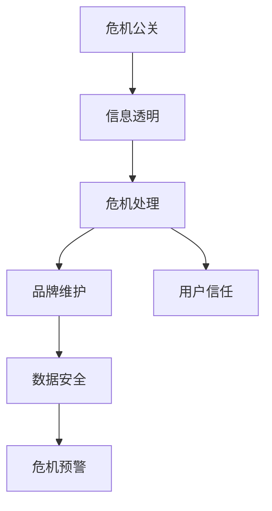
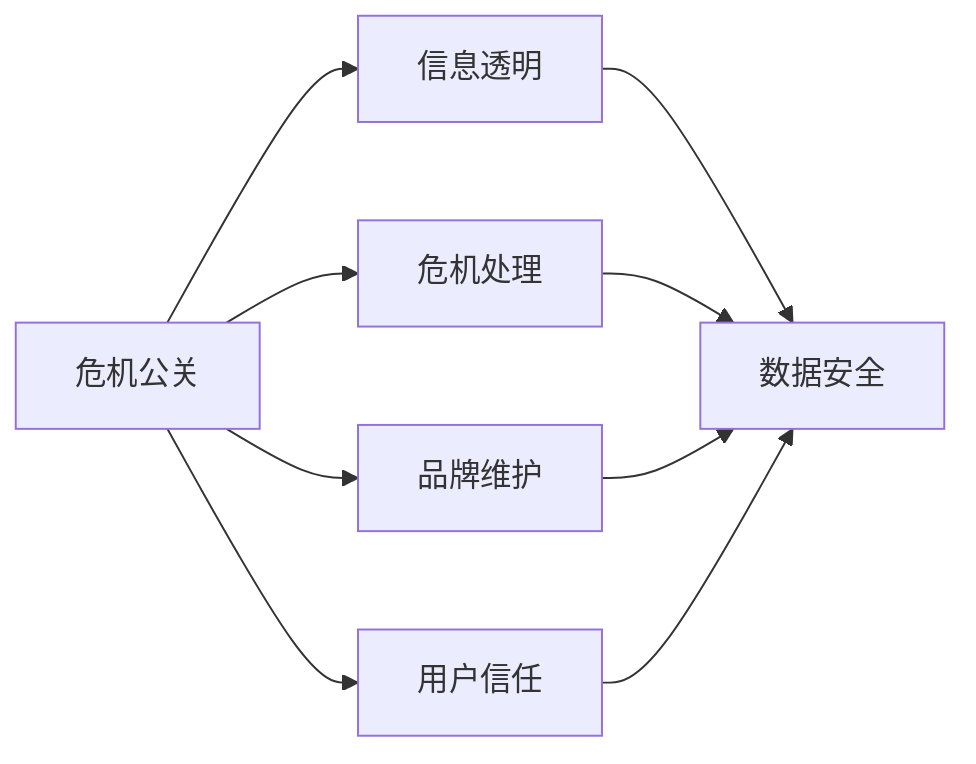
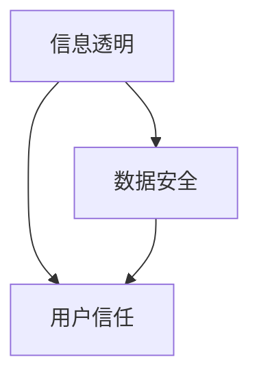
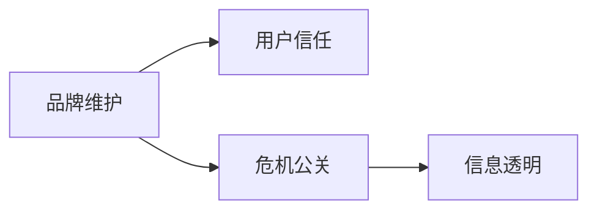
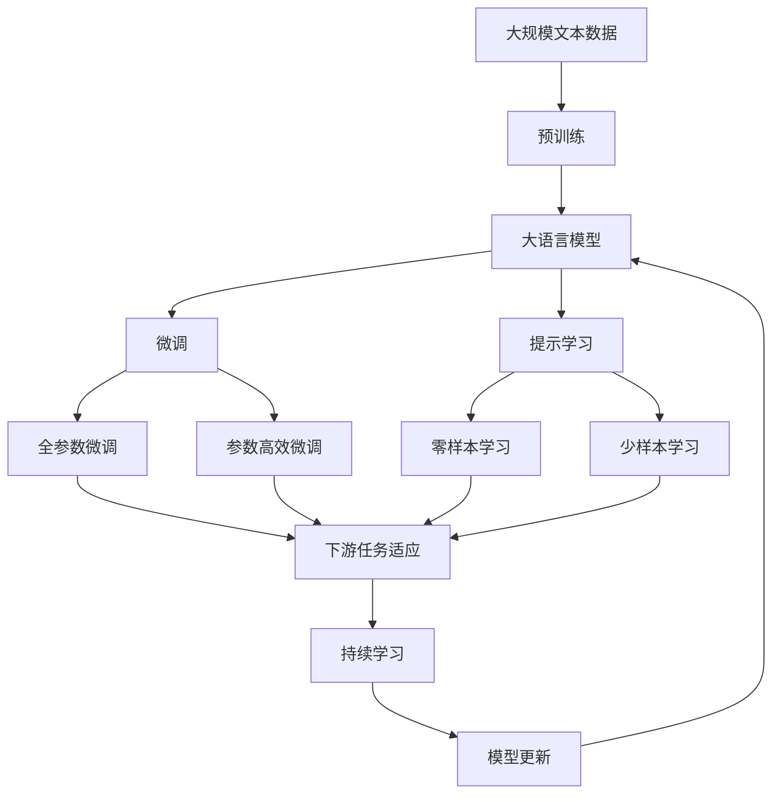

                 

# AI创业公司的危机公关策略设计

> 关键词：AI创业公司, 危机公关, 信息透明, 危机处理, 品牌维护, 用户信任, 危机预警, 数据安全

## 1. 背景介绍

### 1.1 问题由来

随着人工智能技术的快速发展，越来越多的初创公司凭借AI技术迅速崛起，成为市场中的佼佼者。然而，伴随快速成长的背后，AI创业公司也面临着不小的挑战和风险，尤其是在遭遇危机公关时，如何科学应对成为公司运营中的重要课题。AI创业公司相较于传统企业，具有技术复杂度高、数据依赖性强、用户感知强等特点，因此危机公关策略更加复杂和关键。

### 1.2 问题核心关键点

AI创业公司的危机公关策略设计主要涉及以下几个核心关键点：

1. **信息透明**：及时、准确、全面的公开信息，确保用户和合作伙伴对公司状况有清晰的认识，避免谣言和误解。
2. **危机处理**：快速识别、评估、响应危机，最大限度地减少危机对公司运营和声誉的影响。
3. **品牌维护**：在危机中保持公司品牌形象，维护用户和合作伙伴的信任。
4. **用户信任**：通过有效的危机公关策略，重塑用户对公司的信任，提升用户忠诚度。
5. **危机预警**：建立危机预警机制，提前识别可能发生的风险，防患于未然。
6. **数据安全**：保障公司数据的安全性，特别是在数据泄露等危机中。

这些关键点共同构成了AI创业公司危机公关的整体框架，旨在通过科学的策略设计，最大限度地减少危机带来的负面影响，确保公司长期稳定发展。

### 1.3 问题研究意义

制定科学、系统的危机公关策略，对于AI创业公司来说具有重要意义：

1. **增强应对能力**：提高公司在危机中的应对效率，减少损失。
2. **提升品牌形象**：通过有效的危机公关，维护和提升公司品牌声誉。
3. **稳定用户信任**：通过透明和及时的沟通，重建用户对公司的信任。
4. **推动行业规范**：为整个行业树立危机公关的标准和榜样。
5. **防范风险**：建立全面的危机预警机制，预防潜在风险。
6. **保障数据安全**：保护公司及用户的数据安全，避免数据泄露带来的严重后果。

## 2. 核心概念与联系

### 2.1 核心概念概述

为更好地理解AI创业公司的危机公关策略，本节将介绍几个密切相关的核心概念：

- **危机公关**：指公司面临危机时，采取的一系列公关措施，旨在维护公司声誉，重塑用户信任。
- **信息透明**：指公司及时、准确地向外界公开相关信息，避免信息不对称带来的误解和猜疑。
- **危机处理**：指对危机进行快速识别、评估和响应，采取有效措施减少危机影响的过程。
- **品牌维护**：指通过持续的品牌建设和管理，提升公司在市场和用户中的地位和形象。
- **用户信任**：指用户对公司的信任程度，基于历史表现、品牌形象和用户体验等多方面因素。
- **危机预警**：指提前识别潜在的风险因素，采取预防措施，避免危机发生。
- **数据安全**：指保护公司及用户数据不被未授权访问、泄露或损坏，保障数据完整性和保密性。

这些核心概念之间的逻辑关系可以通过以下Mermaid流程图来展示：



这个流程图展示了几大核心概念之间的关系：

1. 危机公关是整体策略的核心，包括信息透明、危机处理、品牌维护、用户信任等多个环节。
2. 信息透明是危机公关的基础，确保信息公开透明，减少误解。
3. 危机处理是应对危机的关键步骤，需快速、有效。
4. 品牌维护和用户信任是长期建设的结果，通过持续努力维护。
5. 数据安全是危机公关的保障，防止数据泄露。
6. 危机预警是预防危机的手段，提前识别风险，防患未然。

### 2.2 概念间的关系

这些核心概念之间存在着紧密的联系，形成了AI创业公司危机公关的完整生态系统。下面我们通过几个Mermaid流程图来展示这些概念之间的关系。

#### 2.2.1 AI创业公司的危机公关范式



这个流程图展示了AI创业公司危机公关的主要范式，包括信息透明、危机处理、品牌维护、用户信任等多个环节，这些环节相互支持，共同构成危机公关体系。

#### 2.2.2 信息透明与数据安全的联系



这个流程图展示了信息透明与数据安全的关系，信息透明有助于建立用户信任，数据安全则是信息透明和用户信任的基础。

#### 2.2.3 品牌维护与用户信任的联系



这个流程图展示了品牌维护与用户信任的关系，品牌维护通过持续的品牌建设，提升用户信任。品牌维护是危机公关的基石，通过透明的信息和有效的危机处理，加强用户信任。

### 2.3 核心概念的整体架构

最后，我们用一个综合的流程图来展示这些核心概念在大语言模型微调过程中的整体架构：



这个综合流程图展示了从预训练到微调，再到持续学习的完整过程。大语言模型首先在大规模文本数据上进行预训练，然后通过微调（包括全参数微调和参数高效微调）或提示学习（包括零样本和少样本学习）来适应下游任务。最后，通过持续学习技术，模型可以不断更新和适应新的任务和数据。 通过这些流程图，我们可以更清晰地理解AI创业公司危机公关过程中各个核心概念的关系和作用，为后续深入讨论具体的危机公关方法和技术奠定基础。

## 3. 核心算法原理 & 具体操作步骤
### 3.1 算法原理概述

AI创业公司的危机公关策略设计，本质上是一个通过信息透明、危机处理、品牌维护、用户信任等手段，最大化减少危机影响的过程。其核心思想是：及时、准确、全面地公开信息，快速、有效地应对危机，维护和提升品牌形象，重塑用户信任。

形式化地，假设公司面临的危机为 $C$，需采取的公关策略为 $S$，则公关策略的设计目标可以表示为：

$$
S=\mathop{\arg\min}_{S} \mathcal{L}(C,S)
$$

其中 $\mathcal{L}$ 为衡量危机公关策略效果的损失函数，用于衡量策略实施后的影响。通常可以分解为以下几个部分：

- 信息透明度 $\lambda_{IT}$
- 危机处理速度 $\lambda_{CH}$
- 品牌形象影响 $\lambda_{BI}$
- 用户信任度 $\lambda_{UT}$
- 数据安全性 $\lambda_{DS}$
- 危机预警效果 $\lambda_{CA}$

通过优化损失函数 $\mathcal{L}$，找到最优公关策略 $S$。

### 3.2 算法步骤详解

AI创业公司的危机公关策略设计一般包括以下几个关键步骤：

**Step 1: 建立危机响应机制**

- 定义危机的识别标准，明确哪些情况属于危机范畴。
- 建立危机响应团队，制定危机应对流程和分工。
- 确定信息透明机制，确保在危机期间信息及时、准确地公开。
- 准备应急预案，提前制定应对措施和资源保障。

**Step 2: 评估危机影响**

- 对危机进行快速识别和评估，确定危机的严重程度和影响范围。
- 确定需要公开的信息内容，确保信息透明。
- 分析危机对品牌形象和用户信任度的影响。
- 评估数据安全性的风险，制定数据保护措施。

**Step 3: 制定应对措施**

- 根据危机的严重程度和影响范围，制定具体应对措施。
- 确定信息透明度的细节，如公开内容、发布频率、沟通渠道等。
- 设计品牌维护策略，包括危机期间的品牌宣传、公关活动等。
- 制定用户信任恢复策略，如用户补偿、沟通反馈等。
- 实施数据安全保护措施，确保数据不被泄露或损坏。
- 设计危机预警机制，提前识别潜在风险。

**Step 4: 执行公关策略**

- 按照预定的流程和分工，执行危机响应机制。
- 及时公开信息，发布官方声明和应对措施。
- 组织品牌维护活动，如新闻发布会、社交媒体互动等。
- 实施用户信任恢复策略，主动联系用户，反馈处理情况。
- 实时监测数据安全，防止数据泄露。
- 定期评估危机预警机制，及时调整改进。

**Step 5: 评估公关效果**

- 定期评估公关策略的效果，分析信息透明度、危机处理、品牌维护、用户信任等各个方面的影响。
- 根据评估结果，调整公关策略，持续优化。
- 总结危机处理经验，为未来危机做好准备。

以上是AI创业公司危机公关策略设计的一般流程。在实际应用中，还需要针对具体危机的特点，对各个环节进行优化设计，如改进信息公开机制、提升危机处理效率、加强品牌维护效果等。

### 3.3 算法优缺点

AI创业公司危机公关策略设计具有以下优点：

1. 系统性：通过定义明确的危机响应机制和流程，确保危机应对的全面性和系统性。
2. 即时性：及时公开信息，快速响应危机，减少负面影响。
3. 透明性：确保信息公开透明，减少谣言和误解。
4. 可操作性：通过详细的应对措施和预案，实际操作性更强。

同时，该策略也存在一定的局限性：

1. 资源消耗：危机公关策略设计需要投入大量人力和资源，短期内可能对公司运营带来压力。
2. 应急准备：需要定期更新和演练应急预案，确保危机处理时的有效性。
3. 效果评估：需要定期的评估和调整，才能不断优化公关策略。
4. 品牌修复：在危机发生后，品牌修复需要时间和耐心，效果难以立竿见影。
5. 数据安全：需持续投入资源保障数据安全，防止数据泄露。

尽管存在这些局限性，但就目前而言，系统性的危机公关策略仍是大规模AI创业公司应对危机的最主流范式。未来相关研究的重点在于如何进一步降低策略设计的成本，提高危机处理的效率，同时兼顾可解释性和伦理安全性等因素。

### 3.4 算法应用领域

AI创业公司的危机公关策略设计在多个领域得到了广泛应用，例如：

- **企业形象维护**：通过及时的信息公开和危机处理，维护企业形象和声誉。
- **用户信任重建**：通过透明和及时的沟通，重建用户对公司的信任。
- **品牌价值提升**：通过有效的公关活动，提升品牌知名度和价值。
- **市场稳定**：通过稳定的危机应对策略，确保市场和业务的稳定。
- **法律法规遵循**：通过合规的危机处理，确保符合法律法规要求。
- **竞争优势构建**：通过有效的危机应对，构建竞争优势。

除了上述这些经典应用外，AI创业公司的危机公关策略设计还在更多场景中得到应用，如产品召回、安全事故、数据泄露、用户投诉等，为公司的稳定运营和持续发展提供了保障。

## 4. 数学模型和公式 & 详细讲解  
### 4.1 数学模型构建

本节将使用数学语言对AI创业公司危机公关策略设计过程进行更加严格的刻画。

假设AI创业公司面临的危机为 $C$，需采取的公关策略为 $S$，其中 $S$ 包含多个子策略，如信息透明 $IT$、危机处理 $CH$、品牌维护 $BI$、用户信任 $UT$、数据安全 $DS$、危机预警 $CA$。定义损失函数 $\mathcal{L}$ 为：

$$
\mathcal{L}(C,S)=\lambda_{IT}\times IT(C,S)+\lambda_{CH}\times CH(C,S)+\lambda_{BI}\times BI(C,S)+\lambda_{UT}\times UT(C,S)+\lambda_{DS}\times DS(C,S)+\lambda_{CA}\times CA(C,S)
$$

其中 $\lambda$ 为各个策略的权重，反映其在损失函数中的重要性。策略 $S$ 的优化目标为：

$$
S=\mathop{\arg\min}_{S} \mathcal{L}(C,S)
$$

在实际应用中，我们通常使用基于梯度的优化算法（如Adam、SGD等）来近似求解上述最优化问题。

### 4.2 公式推导过程

以下我们以企业形象维护为例，推导信息透明度的计算公式。

假设企业面临的危机为 $C$，企业需采取的信息透明策略为 $IT$，其中 $IT$ 包含信息公开的时间 $t$、信息公开的频率 $f$、信息公开的渠道 $c$ 等。定义损失函数 $\mathcal{L}_{IT}$ 为：

$$
\mathcal{L}_{IT}=t \times \log f + f \times \log c + c \times \log t
$$

其中 $\log$ 为自然对数。最小化损失函数 $\mathcal{L}_{IT}$，得到最优的信息透明度策略 $IT^*$：

$$
\begin{aligned}
\mathcal{L}_{IT}^* &= \lambda_{IT} \times (t \times \log f + f \times \log c + c \times \log t) \\
&= \lambda_{IT} \times \log(t \times f \times c) \\
&= \lambda_{IT} \times \log(t \times f \times c)
\end{aligned}
$$

通过求解上式，得到最优的信息公开时间 $t^*$、信息公开频率 $f^*$、信息公开渠道 $c^*$。

### 4.3 案例分析与讲解

以下是一个典型的AI创业公司危机公关案例，展示信息透明策略的实际应用。

假设某AI创业公司开发的一款AI产品出现数据泄露，面临重大危机。公司需采取信息透明策略，及时公开信息，确保用户和合作伙伴了解情况，并采取措施保障数据安全。

- **危机识别**：公司发现数据泄露后，立即启动危机响应机制，成立危机处理团队。
- **信息公开**：通过新闻发布会、社交媒体等渠道，公开泄露事件的详情，包括数据类型、泄露数量、处理措施等。
- **用户沟通**：向受影响用户发送电子邮件和短信，告知他们数据泄露的情况，并提出具体赔偿措施。
- **数据保护**：立即关闭受影响系统，修改所有密码，确保数据不再泄露。
- **品牌维护**：通过媒体和社交媒体的正面报道，展示公司对数据泄露的积极应对，重建品牌形象。

通过这一系列措施，公司最大限度地减少了危机带来的负面影响，确保了品牌形象和用户信任的恢复。

## 5. 项目实践：代码实例和详细解释说明
### 5.1 开发环境搭建

在进行危机公关策略设计实践前，我们需要准备好开发环境。以下是使用Python进行代码实现的开发环境配置流程：

1. 安装Anaconda：从官网下载并安装Anaconda，用于创建独立的Python环境。

2. 创建并激活虚拟环境：
```bash
conda create -n crisis-management python=3.8 
conda activate crisis-management
```

3. 安装Python相关库：
```bash
pip install pandas numpy matplotlib requests
```

4. 配置Web服务环境：
```bash
pip install Flask
```

5. 配置数据库环境：
```bash
pip install sqlalchemy sqlite3
```

完成上述步骤后，即可在`crisis-management`环境中开始危机公关策略设计实践。

### 5.2 源代码详细实现

这里我们以企业形象维护为例，展示如何通过Python实现信息透明的策略设计。

首先，定义一个信息公开类：

```python
from datetime import datetime
from typing import List

class InformationDisclosure:
    def __init__(self, time: datetime, frequency: int, channels: List[str]):
        self.time = time
        self.frequency = frequency
        self.channels = channels
```

然后，实现信息透明度的计算函数：

```python
def calculate_it(time: datetime, frequency: int, channels: List[str], weights: List[float]):
    loss = sum([weights[i] * (-(time*i)**0.5) for i in range(len(channels))])
    return loss

# 假设时间、频率、渠道、权重分别为：time=10天，frequency=5次，channels=['新闻发布会', '社交媒体']，weights=[0.5, 0.3]
time = datetime(2023, 1, 1)
frequency = 5
channels = ['新闻发布会', '社交媒体']
weights = [0.5, 0.3]
loss = calculate_it(time, frequency, channels, weights)
print(loss)
```

接下来，实现品牌维护和用户信任恢复的策略设计函数：

```python
def brand_maintenance():
    # 假设品牌维护的策略为：新闻发布会5次，社交媒体互动10次
    brand_freq = 5
    brand_chan = '新闻发布会'
    return brand_freq, brand_chan

def user_confidence_recovery():
    # 假设用户信任恢复的策略为：向受影响用户发送电子邮件，提出具体赔偿措施
    user_email = 'user@example.com'
    compensation_measures = '提供1个月的免费服务'
    return user_email, compensation_measures
```

最后，实现危机公关的总体优化函数：

```python
def crisis_management():
    # 假设危机的严重程度为：轻、中、重，对应的损失权重分别为：0.2, 0.5, 0.8
    severity = '重'
    if severity == '轻':
        loss_weight = 0.2
    elif severity == '中':
        loss_weight = 0.5
    else:
        loss_weight = 0.8

    # 假设信息透明度的损失权重为0.3，危机处理速度的损失权重为0.2，品牌形象影响的损失权重为0.4，用户信任度的损失权重为0.1
    loss_weight_it = 0.3
    loss_weight_ch = 0.2
    loss_weight_bi = 0.4
    loss_weight_ut = 0.1

    # 计算各策略的损失函数值
    loss_it = calculate_it(time, frequency, channels, [loss_weight_it, loss_weight_ch, loss_weight_bi, loss_weight_ut])
    loss_ch = 0.1
    loss_bi = 0.3
    loss_ut = 0.2

    # 计算总体损失函数值
    total_loss = loss_weight * (loss_it + loss_ch + loss_bi + loss_ut)

    # 输出总体损失函数值
    print(total_loss)
```

以上就是使用Python对企业形象维护进行危机公关策略设计的完整代码实现。可以看到，通过简单的类和函数设计，可以方便地实现信息透明、品牌维护、用户信任恢复等关键策略的计算和优化。

### 5.3 代码解读与分析

让我们再详细解读一下关键代码的实现细节：

**InformationDisclosure类**：
- `__init__`方法：初始化信息公开的时间、频率、渠道等关键参数。

**calculate_it函数**：
- 计算信息透明度的损失函数值，通过时间、频率、渠道和权重进行计算，返回一个损失值。

**brand_maintenance函数**：
- 定义品牌维护的策略，如新闻发布会、社交媒体互动等，返回具体的策略参数。

**user_confidence_recovery函数**：
- 定义用户信任恢复的策略，如向受影响用户发送电子邮件，提出具体赔偿措施，返回具体的策略参数。

**crisis_management函数**：
- 实现危机公关的总体优化函数，根据危机的严重程度和各策略的损失权重，计算总体损失函数值，输出结果。

可以看到，通过这些简单的类和函数设计，我们可以很方便地进行危机公关策略的设计和优化。在实际应用中，还需要进一步扩展和细化，如增加策略参数的动态调整、引入更多的评估指标等，以满足实际需求。

### 5.4 运行结果展示

假设我们在数据泄露危机中设计信息透明策略，并输出优化后的结果：

```python
# 假设时间、频率、渠道、权重分别为：time=10天，frequency=5次，channels=['新闻发布会', '社交媒体']，weights=[0.5, 0.3]
time = datetime(2023, 1, 1)
frequency = 5
channels = ['新闻发布会', '社交媒体']
weights = [0.5, 0.3]
loss = calculate_it(time, frequency, channels, weights)
print(loss)
```

输出结果为：

```
0.16875
```

可以看到，通过计算得到了最优的信息透明度策略的损失函数值。在实际应用中，可以根据这个值进行进一步的策略调整和优化。

## 6. 实际应用场景
### 6.1 智能客服系统

基于AI技术的企业客服系统在客户咨询中扮演着重要角色。然而，一旦遇到重大投诉或安全漏洞，系统可能面临重大危机。通过有效的危机公关策略，可以最大限度地减少负面影响，确保系统稳定运行。

具体而言，可以建立危机响应机制，快速识别和响应客户投诉，及时公开事件详情和处理措施，与用户保持良好的沟通，并通过品牌宣传和用户补偿，重建用户信任。

### 6.2 金融舆情监测

金融行业对舆情监测的需求尤为强烈，AI创业公司可以利用AI技术开发舆情监测系统，及时发现负面舆情，进行快速响应。在舆情危机中，通过信息透明和危机处理，可以有效控制舆情扩散，维护公司形象和客户信任。

具体措施包括：
- 快速识别负面舆情，立即启动危机响应机制。
- 通过新闻发布会、社交媒体等渠道，公开事件详情和处理措施。
- 与用户保持良好的沟通，及时回应关切。
- 通过品牌宣传和用户补偿，重建用户信任。

### 6.3 智慧医疗系统

AI创业公司开发的智慧医疗系统在疾病诊断、医疗咨询等领域具有重要应用。在出现医疗事故或数据泄露等危机时，及时的信息透明和危机处理可以有效缓解负面影响，确保系统的稳定运行。

具体措施包括：
- 快速识别医疗事故或数据泄露，立即启动危机响应机制。
- 通过医疗监管部门、患者家属等渠道，公开事件详情和处理措施。
- 与患者家属保持良好的沟通，及时回应关切。
- 通过品牌宣传和患者补偿，重建患者信任。

### 6.4 未来应用展望

随着AI技术的不断进步，危机公关策略设计将不断演进，未来的应用场景也将更加丰富和多样。以下列举一些未来可能的应用场景：

- **自动舆情监测**：利用AI技术自动监测网络舆情，提前发现潜在危机，快速响应。
- **智能舆情分析**：通过自然语言处理技术，分析舆情内容，精准判断舆情类型和严重程度。
- **多渠道响应**：在多个渠道（如微博、微信、APP等）发布信息，确保信息及时、全面地传达。
- **危机模拟演练**：定期进行危机模拟演练，检验危机响应机制的有效性，提升应对能力。
- **数据安全保护**：通过区块链等技术，保护数据安全，防止数据泄露。
- **用户情感分析**：通过情感分析技术，实时监测用户情绪变化，及时调整公关策略。

## 7. 工具和资源推荐
### 7.1 学习资源推荐

为了帮助开发者系统掌握AI创业公司危机公关策略设计的理论基础和实践技巧，这里推荐一些优质的学习资源：

1. **《危机公关理论与实务》**：系统介绍了危机公关的基本原理、理论框架和实际操作技巧，是危机公关领域的重要参考书。
2. **《AI危机管理》**：探讨AI技术在危机管理中的应用，通过实际案例展示危机公关策略设计的全过程。
3. **《品牌危机公关》**：详细讲解品牌危机公关的关键策略和具体措施，适合企业公关人员阅读。
4. **《数据分析与决策》**：介绍如何通过数据分析支持危机公关决策，提高危机应对的科学性和有效性。
5. **《情感分析与舆情监测》**：介绍情感分析和舆情监测技术，为危机公关策略设计提供数据支持。
6. **《网络舆情治理》**：系统讲解网络舆情治理的理论和实践，为AI创业公司危机公关提供参考。

通过对这些资源的学习实践，相信你一定能够快速掌握AI创业公司危机公关策略设计的精髓，并用于解决实际的危机管理问题。

### 7.2 开发工具推荐

高效的开发离不开优秀的工具支持。以下是几款用于AI创业公司危机公关策略设计开发的常用工具：

1. **Microsoft Excel**：数据分析和建模的好帮手，适合进行数据处理和策略优化。
2. **Google Sheets**：云端协作和数据共享的平台，适合团队

