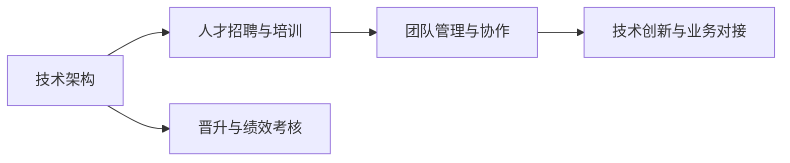
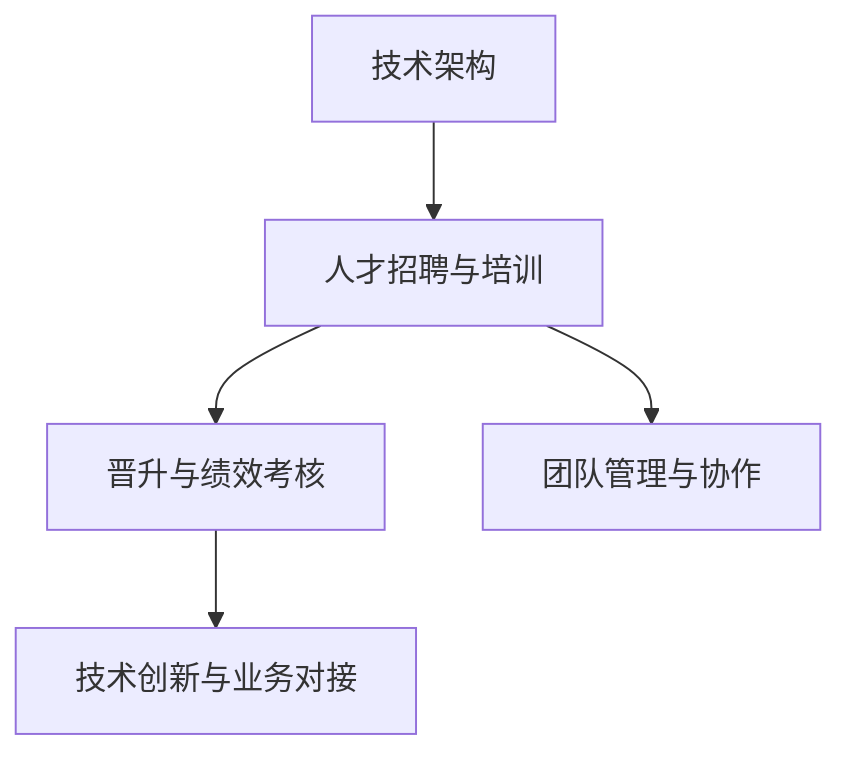

                 

# AI创业公司的技术人才培养与发展体系：培训体系、晋升机制与绩效考核

> 关键词：AI创业公司, 技术人才培养, 培训体系, 晋升机制, 绩效考核, 技术架构, 职业发展, 人才管理, 企业战略

## 1. 背景介绍

### 1.1 问题由来
随着人工智能(AI)技术的迅猛发展，AI创业公司如雨后春笋般涌现。这些公司依赖于技术驱动，其成败往往取决于技术的成熟度和人才的储备。AI创业公司不仅需要拥有强大的技术团队，还需要建立起一套健全的人才培养与发展体系，以确保技术的持续创新和企业的健康成长。

### 1.2 问题核心关键点
AI创业公司在技术人才培养与发展体系建设中面临的关键点包括：
1. **技术架构设计**：构建一个既能支撑现有业务又能扩展未来的技术架构。
2. **人才招聘与培训**：吸引和培养高水平的技术人才，特别是在数据科学、机器学习、深度学习等领域。
3. **晋升与绩效考核**：建立公平、透明的晋升和绩效考核机制，激励技术人才持续提升。
4. **团队管理与协作**：优化团队结构和协作方式，提升团队的凝聚力和工作效率。
5. **技术创新与业务对接**：推动技术创新，并将技术成果转化为实际业务价值。

### 1.3 问题研究意义
对于AI创业公司而言，建立一个健全的技术人才培养与发展体系至关重要，它不仅能帮助公司吸引和保留顶尖人才，还能促进技术的持续发展和业务的快速增长。具体而言：
1. **提升技术竞争力**：通过系统的培训和实战经验积累，提升团队的技术水平和创新能力。
2. **优化人才结构**：通过科学的招聘和晋升机制，优化人才结构，确保团队的多样性和高水平。
3. **增强团队凝聚力**：通过有效的绩效考核和团队管理，增强团队的凝聚力和工作效率。
4. **推动业务发展**：将技术创新成果转化为实际业务价值，加速企业成长。

## 2. 核心概念与联系

### 2.1 核心概念概述

AI创业公司需要构建的技术人才培养与发展体系涉及多个核心概念，包括：

- **技术架构**：指企业为实现其战略目标而构建的技术系统框架，包括云计算、大数据、人工智能、区块链等多个领域的解决方案。
- **人才招聘与培训**：指企业通过招聘和内部培训等方式，吸纳和培养具备技术能力的人才。
- **晋升与绩效考核**：指企业根据员工的绩效和贡献，制定晋升路径和绩效考核标准，激励员工持续提升。
- **团队管理与协作**：指通过有效的团队管理和协作机制，提升团队的工作效率和团队凝聚力。
- **技术创新与业务对接**：指将技术创新成果转化为实际业务价值，推动企业的持续发展。

这些核心概念之间相互关联，共同构成了一个完整的技术人才培养与发展体系。

### 2.2 概念间的关系

这些核心概念之间的关系可以通过以下Mermaid流程图来展示：



这个流程图展示了技术架构与人才招聘、培训、晋升、绩效考核、团队管理、协作、技术创新、业务对接之间的关联关系。

### 2.3 核心概念的整体架构

最后，我们用一个综合的流程图来展示这些核心概念在大技术人才培养与发展体系中的整体架构：



这个综合流程图展示了技术架构、人才招聘与培训、晋升与绩效考核、团队管理与协作、技术创新与业务对接之间的整体架构。

## 3. 核心算法原理 & 具体操作步骤
### 3.1 算法原理概述

AI创业公司的技术人才培养与发展体系构建，需要遵循以下几个关键算法原理：

- **技术架构设计算法**：基于企业战略和技术趋势，设计一个灵活、可扩展的技术架构。
- **人才招聘与培训算法**：利用机器学习、数据分析等技术，评估和选拔人才，并通过定制化的培训计划，提升其技术能力。
- **晋升与绩效考核算法**：建立公平、透明的晋升和绩效考核机制，确保绩效评估的公正性和激励效果的最大化。
- **团队管理与协作算法**：通过团队管理和协作工具，优化团队结构，提升团队的工作效率和团队凝聚力。
- **技术创新与业务对接算法**：将技术创新成果转化为实际业务价值，推动企业的持续发展。

### 3.2 算法步骤详解

**Step 1: 技术架构设计**
- 根据企业战略和技术趋势，设计一个灵活、可扩展的技术架构。
- 采用微服务架构、容器化部署等技术，提升系统的可扩展性和稳定性。
- 引入DevOps文化，自动化测试、部署、监控，提升开发效率和系统可靠性。

**Step 2: 人才招聘与培训**
- 利用机器学习和大数据分析技术，筛选和评估求职者，提升招聘效率和质量。
- 设计定制化的培训计划，涵盖技术技能、软技能、职业发展规划等。
- 提供丰富的内部培训资源，如在线课程、内部讲座、项目实践等。

**Step 3: 晋升与绩效考核**
- 建立公平、透明的晋升和绩效考核机制，确保绩效评估的公正性和激励效果的最大化。
- 定期进行绩效评估，结合量化指标和定性反馈，评估员工表现。
- 根据评估结果，制定晋升路径和激励措施，激励员工持续提升。

**Step 4: 团队管理与协作**
- 优化团队结构，采用扁平化管理或项目制管理，提升团队的工作效率。
- 引入协作工具如Git、Jira、Slack等，促进团队协作和沟通。
- 定期组织团队建设活动，增强团队的凝聚力和归属感。

**Step 5: 技术创新与业务对接**
- 设立专门的技术创新部门或创新基金，支持技术创新。
- 将技术创新成果转化为实际业务价值，推动企业增长。
- 设立跨部门的项目组，促进技术与业务的深度融合。

### 3.3 算法优缺点

**技术架构设计算法的优缺点：**
- 优点：灵活可扩展，能够应对快速变化的技术环境。
- 缺点：设计复杂，需要大量时间和资源。

**人才招聘与培训算法的优缺点：**
- 优点：通过数据分析和机器学习，提升招聘效率和人才质量。
- 缺点：定制化培训资源需求高，需要持续投入。

**晋升与绩效考核算法的优缺点：**
- 优点：公平透明，激励效果显著。
- 缺点：评估复杂，需要大量人力和时间。

**团队管理与协作算法的优缺点：**
- 优点：提高效率和团队凝聚力，促进沟通协作。
- 缺点：需要选择合适的工具和管理方式，实施成本高。

**技术创新与业务对接算法的优缺点：**
- 优点：推动企业增长，提升技术价值。
- 缺点：创新风险高，需要持续投入和支持。

### 3.4 算法应用领域

这些算法原理不仅适用于AI创业公司，也广泛应用于软件开发、互联网服务、大数据分析等多个领域。

## 4. 数学模型和公式 & 详细讲解 & 举例说明
### 4.1 数学模型构建

为了更好地理解技术人才培养与发展体系，我们需要构建数学模型来描述相关流程和指标。

### 4.2 公式推导过程

**技术架构设计数学模型：**

假设企业战略需求为 $S$，当前技术架构为 $A$，市场变化为 $M$，则技术架构设计算法可以表示为：

$$
A_{\text{new}} = f(S, A, M)
$$

其中 $f$ 为设计算法，根据企业战略需求、当前技术架构和市场变化，设计出新的技术架构 $A_{\text{new}}$。

**人才招聘与培训数学模型：**

假设人才招聘数量为 $P$，内部培训投入为 $T$，培训效果为 $E$，则人才招聘与培训算法可以表示为：

$$
E = g(P, T)
$$

其中 $g$ 为培训效果评估算法，根据招聘数量和内部培训投入，评估出培训效果 $E$。

**晋升与绩效考核数学模型：**

假设员工绩效为 $P$，考核指标为 $I$，晋升条件为 $R$，则晋升与绩效考核算法可以表示为：

$$
R = h(P, I)
$$

其中 $h$ 为晋升条件评估算法，根据员工绩效和考核指标，评估出晋升条件 $R$。

**团队管理与协作数学模型：**

假设团队规模为 $T$，协作工具使用频率为 $C$，团队凝聚力为 $B$，则团队管理与协作算法可以表示为：

$$
B = i(T, C)
$$

其中 $i$ 为团队管理算法，根据团队规模和协作工具使用频率，评估出团队凝聚力 $B$。

**技术创新与业务对接数学模型：**

假设技术创新投入为 $I$，创新成果转化为业务价值的程度为 $V$，则技术创新与业务对接算法可以表示为：

$$
V = j(I)
$$

其中 $j$ 为转化算法，根据技术创新投入，评估出创新成果转化为业务价值的程度 $V$。

### 4.3 案例分析与讲解

假设某AI创业公司，战略需求为开发一款新的AI驱动的客户服务平台。

**技术架构设计案例：**

- 当前技术架构：采用传统单体应用架构。
- 市场变化：客户平台需要具备高可用性、可扩展性和安全性。
- 新架构设计：采用微服务架构和容器化部署，引入DevOps文化。
- 架构设计过程：
  1. 分析市场变化和战略需求，确定新架构需具备的特性。
  2. 设计微服务架构，实现业务模块的独立部署和扩展。
  3. 引入Docker和Kubernetes，实现应用的容器化部署和自动化管理。
  4. 引入CI/CD流程，实现自动化测试和部署。

**人才招聘与培训案例：**

- 当前问题：团队缺乏深度学习和大数据人才。
- 招聘数量：每年需招聘10名深度学习和大数据工程师。
- 内部培训投入：每年需投入100万用于内部培训和开发资源。
- 培训效果：培训后，员工技能水平显著提升，项目交付效率提高。
- 培训过程：
  1. 通过数据分析，筛选出具备深度学习和数据处理背景的人才。
  2. 设计定制化的培训计划，涵盖机器学习、大数据技术、项目管理等。
  3. 提供丰富的内部培训资源，如在线课程、内部讲座、项目实践等。
  4. 评估培训效果，确保培训投入的回报。

**晋升与绩效考核案例：**

- 当前问题：团队晋升和绩效考核机制不透明，激励效果不佳。
- 考核指标：包括项目完成度、代码质量、团队协作等。
- 晋升条件：每年根据绩效评估，选拔一定比例的优秀员工晋升。
- 晋升过程：
  1. 设定明确的绩效考核指标，涵盖量化指标和定性反馈。
  2. 定期进行绩效评估，结合量化指标和定性反馈，评估员工表现。
  3. 根据评估结果，制定晋升路径和激励措施，激励员工持续提升。
  4. 确保晋升和绩效考核机制的公平透明，提升员工的满意度和归属感。

**团队管理与协作案例：**

- 当前问题：团队规模大，沟通协作效率低。
- 团队规模：团队规模为50人。
- 协作工具使用频率：每天使用协作工具进行沟通和协作。
- 团队凝聚力：团队凝聚力显著提升，协作效率提高。
- 协作过程：
  1. 引入协作工具如Git、Jira、Slack等，促进团队协作和沟通。
  2. 设立跨部门的项目组，促进技术与业务的深度融合。
  3. 定期组织团队建设活动，增强团队的凝聚力和归属感。
  4. 通过团队管理和协作工具，优化团队结构，提升团队的工作效率和团队凝聚力。

**技术创新与业务对接案例：**

- 当前问题：技术创新成果转化率低。
- 创新投入：每年投入500万用于技术创新。
- 创新成果：成功将机器学习算法应用于客户服务平台，提升平台性能和用户体验。
- 转化过程：
  1. 设立专门的技术创新部门或创新基金，支持技术创新。
  2. 将技术创新成果转化为实际业务价值，推动企业增长。
  3. 设立跨部门的项目组，促进技术与业务的深度融合。
  4. 定期评估技术创新成果的转化情况，确保创新投入的回报。

## 5. 项目实践：代码实例和详细解释说明
### 5.1 开发环境搭建

在进行技术人才培养与发展体系的实践前，我们需要准备好开发环境。以下是使用Python进行开发的环境配置流程：

1. 安装Anaconda：从官网下载并安装Anaconda，用于创建独立的Python环境。

2. 创建并激活虚拟环境：
```bash
conda create -n ai-dev python=3.8 
conda activate ai-dev
```

3. 安装Python开发工具包：
```bash
pip install numpy pandas matplotlib scikit-learn
```

4. 安装数据分析和机器学习工具包：
```bash
pip install scikit-learn pandas matplotlib
```

5. 安装协作工具：
```bash
pip install git jira slack
```

完成上述步骤后，即可在`ai-dev`环境中开始实践。

### 5.2 源代码详细实现

下面我们以技术架构设计为例，给出使用Python和Jinja2模板语言实现技术架构设计的代码实例。

```python
from jinja2 import Template

# 定义技术架构设计函数
def tech_architecture_design(strategic_needs, current_architecture, market_changes):
    # 根据市场需求和当前架构，设计新的技术架构
    new_architecture = current_architecture + market_changes
    
    # 使用Jinja2模板语言生成技术架构报告
    template = Template('新架构设计: {{ new_architecture }}')
    architecture_report = template.render(new_architecture=new_architecture)
    
    return architecture_report

# 调用技术架构设计函数
strategic_needs = '高可用性、可扩展性和安全性'
current_architecture = '单体应用架构'
market_changes = '引入微服务架构和容器化部署，实现自动化测试和部署'

# 生成技术架构报告
architecture_report = tech_architecture_design(strategic_needs, current_architecture, market_changes)
print(architecture_report)
```

以上就是使用Python和Jinja2模板语言实现技术架构设计的代码实例。可以看到，通过Jinja2模板语言，我们可以快速生成技术架构报告，清晰展示设计过程和结果。

### 5.3 代码解读与分析

让我们再详细解读一下关键代码的实现细节：

**Jinja2模板语言**：
- `Template`类：用于加载和渲染模板文件。
- `render`方法：根据模板文件的内容和传入的变量，生成最终的渲染结果。

**技术架构设计函数**：
- `strategic_needs`：市场需求，如高可用性、可扩展性和安全性。
- `current_architecture`：当前架构，如单体应用架构。
- `market_changes`：市场变化，如引入微服务架构和容器化部署。
- `new_architecture`：新架构设计结果，如单体应用架构+市场变化。

**代码运行结果**：
- `新架构设计: 单体应用架构+市场变化`：表示技术架构设计过程和结果。

可以看到，使用Jinja2模板语言，可以简洁高效地生成技术架构报告，清晰展示设计过程和结果。通过不断的迭代优化，可以逐步完善技术架构设计算法，提升企业的技术竞争力。

当然，工业级的系统实现还需考虑更多因素，如系统的可扩展性、稳定性和安全性等。但核心的技术架构设计算法基本与此类似。

## 6. 实际应用场景

### 6.1 智能客服系统

AI创业公司可以利用技术人才培养与发展体系，构建智能客服系统。通过招聘和培训具备自然语言处理、深度学习等技术能力的人才，开发智能客服机器人，提升客户服务效率和客户满意度。

在技术实施方面，可以设计定制化的培训计划，涵盖自然语言处理、深度学习、模型调优等技术内容。通过定期绩效评估和晋升机制，激励技术人才持续提升，推动智能客服系统的不断优化。

### 6.2 金融数据分析平台

金融行业需要大量数据分析和机器学习人才，AI创业公司可以利用技术人才培养与发展体系，构建金融数据分析平台。通过招聘和培训具备数据分析、机器学习等技术能力的人才，开发金融数据分析工具，提升金融数据分析的准确性和效率。

在技术实施方面，可以设计定制化的培训计划，涵盖数据清洗、特征工程、模型训练等技术内容。通过定期绩效评估和晋升机制，激励技术人才持续提升，推动金融数据分析平台的不断优化。

### 6.3 医疗健康管理系统

医疗行业需要大量医疗数据分析和人工智能人才，AI创业公司可以利用技术人才培养与发展体系，构建医疗健康管理系统。通过招聘和培训具备医疗数据分析、人工智能等技术能力的人才，开发医疗健康管理系统，提升医疗数据分析的准确性和效率。

在技术实施方面，可以设计定制化的培训计划，涵盖医疗数据分析、深度学习、模型调优等技术内容。通过定期绩效评估和晋升机制，激励技术人才持续提升，推动医疗健康管理系统的不断优化。

### 6.4 未来应用展望

随着技术人才培养与发展体系的不断完善，AI创业公司将具备更强的技术创新能力和人才储备，进一步推动企业的快速增长和业务的持续发展。

在未来的应用场景中，技术人才培养与发展体系将发挥更重要的作用，涵盖更多技术领域和应用场景。例如：

- 云计算技术：招聘和培训具备云计算技术能力的人才，构建可扩展的云计算平台。
- 大数据技术：招聘和培训具备大数据技术能力的人才，构建高效的数据分析平台。
- 区块链技术：招聘和培训具备区块链技术能力的人才，构建安全的区块链应用。
- 物联网技术：招聘和培训具备物联网技术能力的人才，构建智能物联网系统。

未来，AI创业公司将通过技术人才培养与发展体系，不断吸引和培养高水平的技术人才，推动企业的持续创新和发展，构建更强大的技术竞争力。

## 7. 工具和资源推荐
### 7.1 学习资源推荐

为了帮助开发者系统掌握技术人才培养与发展体系的构建，这里推荐一些优质的学习资源：

1. Coursera《人工智能与机器学习》课程：由斯坦福大学开设，涵盖了AI和机器学习的基础知识和高级应用。
2. Udacity《人工智能工程师》纳米学位：通过实战项目和项目评审，帮助学员掌握AI核心技能。
3. edX《数据科学与机器学习》课程：由哈佛大学、MIT等名校开设，涵盖数据科学和机器学习的基础知识和高级应用。
4. Kaggle：数据科学和机器学习的在线竞赛平台，提供丰富的实战项目和数据集，帮助学员提升技能。
5. GitHub：开源代码托管平台，提供大量开源项目和代码，帮助学员学习优秀代码和最佳实践。

通过对这些资源的学习实践，相信你一定能够快速掌握技术人才培养与发展体系的构建方法，并将其应用于实际项目中。

### 7.2 开发工具推荐

高效的开发离不开优秀的工具支持。以下是几款用于技术人才培养与发展体系开发的常用工具：

1. Git：版本控制系统，支持分布式版本管理，方便团队协作和代码共享。
2. Jira：项目管理工具，支持任务分配、进度跟踪、缺陷管理等功能，提升团队协作效率。
3. Slack：即时通讯工具，支持团队沟通、文件共享、集成第三方应用等功能，提升团队协作效率。
4. Confluence：协作文档工具，支持知识共享、团队协作、文档管理等功能，提升团队知识共享效率。
5. GitHub：开源代码托管平台，支持代码版本管理、协作开发、持续集成等功能，提升代码质量和管理效率。

合理利用这些工具，可以显著提升技术人才培养与发展体系的开发效率，加快创新迭代的步伐。

### 7.3 相关论文推荐

技术人才培养与发展体系的构建需要借鉴学界的最新研究成果。以下是几篇奠基性的相关论文，推荐阅读：

1. "人才供应链管理：构建企业人才发展体系"：探讨了企业人才供应链管理的理论和方法，为企业人才发展体系建设提供了理论基础。
2. "基于人工智能的员工绩效评估与激励机制研究"：研究了基于人工智能的员工绩效评估与激励机制，提出了基于数据驱动的员工绩效评估方法。
3. "数据驱动的人才招聘与培训体系构建"：探讨了数据驱动的人才招聘与培训体系构建方法，提出了基于大数据分析的人才招聘与培训策略。
4. "技术创新与业务对接：AI创业公司的成功之道"：探讨了技术创新与业务对接的方法和策略，提出了基于AI技术的企业创新路径。
5. "基于微服务架构的技术架构设计"：研究了基于微服务架构的技术架构设计方法，提出了微服务架构的设计原则和实践指南。

这些论文代表了大数据驱动的人才培养与发展体系的发展脉络，通过学习这些前沿成果，可以帮助企业快速构建完善的技术人才培养与发展体系。

## 8. 总结：未来发展趋势与挑战
### 8.1 研究成果总结

本文对AI创业公司的技术人才培养与发展体系进行了全面系统的介绍。首先阐述了技术架构设计、人才招聘与培训、晋升与绩效考核、团队管理与协作、技术创新与业务对接等核心概念及其关系。其次，从原理到实践，详细讲解了技术架构设计、人才招聘与培训、晋升与绩效考核、团队管理与协作、技术创新与业务对接等关键流程，并给出了完整的代码实例和详细解释说明。

通过本文的系统梳理，可以看到，技术人才培养与发展体系是大数据驱动AI创业公司成功的关键要素之一。这些体系的构建，不仅能够提升企业的人才质量和技术水平，还能够促进企业的持续创新和发展，构建更强大的技术竞争力。

### 8.2 未来发展趋势

展望未来，AI创业公司的技术人才培养与发展体系将呈现以下几个发展趋势：

1. **数据驱动的招聘与培训**：利用大数据和机器学习技术，提升招聘与培训的效率和质量。
2. **个性化的人才发展路径**：根据员工的技能和职业发展规划，制定个性化的培训计划，提升员工满意度和归属感。
3. **透明的晋升与绩效考核机制**：建立公平、透明的晋升与绩效考核机制，激励员工持续提升。
4. **智能化的人力资源管理**：利用AI技术，提升人力资源管理的效率和质量，如自动化的招聘、培训、绩效评估等。
5. **多层次的人才梯队建设**：构建多层次的人才梯队，培养高水平的技术人才和管理人才，推动企业持续发展。
6. **持续的技术创新与业务对接**：持续推动技术创新，并将技术成果转化为实际业务价值，推动企业的持续增长。

这些趋势凸显了技术人才培养与发展体系的广阔前景。这些方向的探索发展，必将进一步提升AI创业公司的技术竞争力，推动企业的持续创新和发展。

### 8.3 面临的挑战

尽管技术人才培养与发展体系构建取得了显著成效，但在迈向更加智能化、普适化应用的过程中，仍面临诸多挑战：

1. **技术人才短缺**：特别是在深度学习、大数据、区块链等前沿技术领域，高水平人才供不应求，制约了企业的快速发展。
2. **培训资源不足**：特别是在定制化的培训计划和内部培训资源方面，企业投入有限，难以满足技术人才的需求。
3. **绩效考核不透明**：绩效考核机制可能存在主观性、不公平等问题，影响员工的积极性和满意度。
4. **团队协作效率低**：特别是在跨部门协作、项目管理等方面，团队协作效率低下，影响项目的进度和质量。
5. **技术创新风险高**：技术创新的风险较高，需要持续投入和支持，且无法保证创新成果的转化效果。

正视这些挑战，积极应对并寻求突破，将是技术人才培养与发展体系建设的关键。

### 8.4 研究展望

面对技术人才培养与发展体系面临的挑战，未来的研究需要在以下几个方面寻求新的突破：

1. **数据驱动的人才招聘与培训**：进一步利用大数据和机器学习技术，提升招聘与培训的效率和质量，实现数据驱动的人才管理。
2. **个性化的员工发展路径**：根据员工的技能和职业发展规划，制定个性化的培训计划，提升员工满意度和归属感。
3. **透明化的绩效考核机制**：建立公平、透明的绩效考核机制，确保绩效评估的公正性和激励效果的最大化。
4. **智能化的团队协作工具**：引入协作工具如Git、Jira、Slack等，提升团队协作效率和沟通效率。
5. **多样化的技术创新路径**：引入更多的技术创新路径，如开源社区参与、技术合作等，提升技术创新能力。

这些研究方向的探索，必将引领技术人才培养与发展体系迈向更高的台阶，为AI创业公司的持续创新和发展提供坚实的人才保障。

## 9. 附录：常见问题与解答

**Q1：AI创业公司如何构建技术架构？**

A: AI创业公司构建技术架构需要遵循以下几个步骤：
1. 分析市场需求和战略目标，确定技术架构需要具备的特性。
2. 设计灵活、可扩展的技术架构，如微服务架构、容器化部署等。
3. 引入DevOps文化，自动化测试、部署、监控，提升开发效率和系统可靠性。

**Q2：AI创业公司如何吸引和培养技术人才？**

A: AI创业公司吸引和培养技术人才需要遵循以下几个步骤：
1. 利用大数据和机器学习技术，筛选和评估人才，提升招聘效率和质量。
2. 设计定制化的培训计划，涵盖技术技能、软技能、职业发展规划等。
3. 提供丰富的内部培训资源，如在线课程、内部讲座、项目实践等。
4. 定期评估培训效果，确保培训投入的回报

