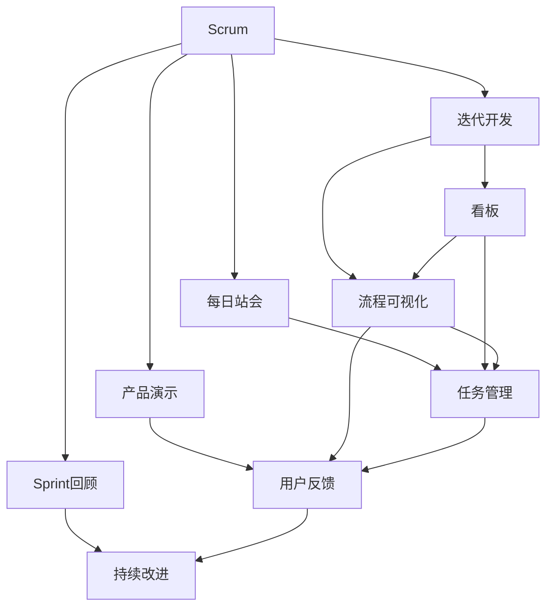

                 

# AI创业公司的敏捷开发实践

> 关键词：敏捷开发,AI创业,项目管理和技术实践,DevOps,持续集成与持续部署(CI/CD),敏捷方法论,Scrum和Kanban

## 1. 背景介绍

在当今快速变化的商业环境中，AI创业公司的成功不仅依赖于技术创新，还依赖于高效的项目管理和敏捷开发实践。敏捷开发已成为AI领域的重要方法论，它使创业公司能够快速响应市场变化，迭代改进产品，持续交付价值。本文将深入探讨AI创业公司如何运用敏捷开发方法论，提升开发效率和产品竞争力。

### 1.1 问题由来
随着人工智能技术的快速发展，越来越多的AI创业公司涌现。这些公司面临着严峻的市场竞争和技术挑战。为了在激烈的竞争中脱颖而出，AI创业公司需要快速迭代产品，满足用户需求，同时保持高效开发和项目管理。敏捷开发方法论应运而生，它强调灵活性、快速响应和持续改进，为AI创业公司提供了强大的工具和框架。

### 1.2 问题核心关键点
敏捷开发方法论的核心在于通过跨职能团队的高效协作，快速交付高质量的产品。它包括Scrum、Kanban等敏捷方法，以及持续集成与持续部署(CI/CD)等技术实践。敏捷开发的关键点包括：

1. **跨职能团队**：跨职能团队通常包括产品、开发、测试、设计和运营等多个角色，协作完成产品开发。
2. **迭代开发**：将大项目拆分为多个小迭代，每个迭代都包括需求分析、设计、开发、测试和部署等环节。
3. **持续集成与持续部署**：通过自动化工具和管道，确保代码的快速构建、测试和部署，减少人为错误和部署时间。
4. **用户反馈**：在每个迭代结束时，收集用户反馈，进行产品改进和迭代。
5. **透明沟通**：保持团队成员之间的透明沟通，确保信息共享和任务对齐。

### 1.3 问题研究意义
敏捷开发方法论对于AI创业公司至关重要，它能提升开发效率、产品质量和用户满意度。通过敏捷开发，创业公司可以：

1. 快速响应市场变化，快速迭代产品，提高竞争优势。
2. 提升开发效率，缩短产品上市时间。
3. 提高代码质量，减少错误和缺陷。
4. 通过用户反馈持续改进产品，提高用户满意度。
5. 增强团队协作，提升整体工作效率。

## 2. 核心概念与联系

### 2.1 核心概念概述

敏捷开发方法论是一种以人为核心、迭代和增量式开发、自组织和自管理的系统开发方法。其核心概念包括：

- **Scrum**：一种敏捷开发框架，通过迭代开发、每日站会和产品演示等环节，提升团队协作和项目管理效率。
- **Kanban**：一种敏捷管理方法，通过看板、流程可视化等方式，优化任务流程和团队协作。
- **持续集成与持续部署(CI/CD)**：一种自动化开发和部署方法，通过自动化工具链，确保代码的快速构建、测试和部署。
- **DevOps**：一种结合开发和运维的敏捷实践，强调团队协作、自动化和持续交付。
- **敏捷开发方法论**：一种以人为核心、迭代和增量式开发、自组织和自管理的系统开发方法。

这些核心概念通过合法的节点和连接，形成了一个完整的敏捷开发体系。



### 2.2 概念间的关系

这些核心概念之间存在紧密的联系，形成了一个完整的敏捷开发生态系统。它们通过法律节点和连接，展示了敏捷开发方法论的整体架构。

## 3. 核心算法原理 & 具体操作步骤
### 3.1 算法原理概述

敏捷开发方法论的核心算法原理包括Scrum和Kanban两种敏捷框架，以及CI/CD和DevOps两种自动化实践。这些方法论和实践通过合理的节点和连接，形成了一个高效的开发和项目管理系统。

### 3.2 算法步骤详解

#### Scrum框架

1. **创建产品待办列表**：根据用户需求，创建详细的产品待办列表，包含所有需要开发的功能。
2. **划分Sprint**：将待办列表拆分为多个Sprint（通常为2-4周），每个Sprint包含3-5个任务。
3. **每日站会**：每天进行15分钟的站会，团队成员汇报昨天完成的任务和今天计划的任务。
4. **产品演示**：每个Sprint结束时，进行产品演示，展示完成的特性和待办事项。
5. **Sprint回顾**：团队成员回顾Sprint中的成功和待改进之处，为下一个Sprint提供经验。

#### Kanban方法

1. **创建看板**：在看板上列出所有待办任务，包括待处理、进行中和已完成的任务。
2. **任务可视化**：通过看板可视化任务流程，团队成员可以清楚地看到每个任务的状态和进度。
3. **流程优化**：根据任务状态和进展，不断优化流程，提高效率。
4. **任务管理**：通过任务管理，确保任务按时完成。
5. **持续改进**：根据任务进展和团队反馈，不断改进流程和方法。

#### CI/CD实践

1. **自动化构建**：通过自动化构建工具，确保代码的快速构建和集成。
2. **自动化测试**：通过自动化测试工具，确保代码的快速测试和反馈。
3. **持续部署**：通过自动化部署工具，确保代码的快速部署和上线。
4. **自动化反馈**：通过持续反馈机制，确保代码质量和问题及时发现。
5. **持续改进**：根据反馈结果，不断改进自动化流程和工具。

#### DevOps实践

1. **协作文化**：通过跨职能团队协作，确保开发和运维的紧密结合。
2. **自动化运维**：通过自动化运维工具，确保系统的快速部署和故障恢复。
3. **持续交付**：通过持续交付机制，确保产品的高质量和快速上线。
4. **监控和反馈**：通过监控和反馈机制，确保系统的稳定性和可靠性。
5. **持续改进**：根据监控结果和用户反馈，不断改进系统和流程。

### 3.3 算法优缺点

敏捷开发方法论的优势在于其灵活性和高效性，能够快速响应市场变化，提升开发效率和产品质量。但是，它也存在一些缺点：

- **复杂度增加**：敏捷开发方法论需要跨职能团队的紧密协作，增加了项目管理的复杂度。
- **资源消耗**：敏捷开发需要大量的人力和时间投入，可能不适合小型项目。
- **变化风险**：敏捷开发过程中频繁变更需求，可能带来一定的风险和不确定性。

### 3.4 算法应用领域

敏捷开发方法论广泛应用于软件开发、项目管理、产品设计等多个领域。在AI创业公司，敏捷开发方法论特别适用于以下场景：

- **产品迭代**：AI产品需要快速迭代，不断优化和改进。
- **团队协作**：AI项目需要跨职能团队的高效协作。
- **市场响应**：AI公司需要快速响应市场变化，提升产品竞争力。
- **项目管理**：AI项目需要高效的项目管理和任务分配。
- **持续交付**：AI产品需要持续交付和快速上线。

## 4. 数学模型和公式 & 详细讲解  
### 4.1 数学模型构建

敏捷开发方法论的数学模型主要包括Scrum和Kanban两种方法论的数学模型，以及CI/CD和DevOps的自动化流程。

#### Scrum模型

- **产品待办列表**：每个Sprint结束后，产品待办列表更新，增加已完成的任务。
- **任务完成率**：每个Sprint结束时，计算任务完成率，评估团队工作效率。
- **Sprint燃烧图**：通过Sprint燃烧图，评估Sprint的进度和任务完成情况。

#### Kanban模型

- **任务状态**：任务状态包括待处理、进行中和已完成三种状态，通过任务状态管理任务进展。
- **任务完成时间**：记录每个任务的完成时间，评估任务流程效率。
- **任务等待时间**：记录任务在每个状态下的等待时间，优化任务流程。

#### CI/CD模型

- **构建频率**：记录代码构建的频率和构建时间，评估构建效率。
- **测试覆盖率**：记录代码的测试覆盖率和测试通过率，评估代码质量。
- **部署频率**：记录代码的部署频率和部署时间，评估部署效率。

#### DevOps模型

- **监控指标**：记录系统的监控指标，如请求处理时间、响应时间和错误率等，评估系统性能。
- **自动化流程**：记录自动化流程的执行时间和执行成功率，评估自动化效果。
- **故障恢复时间**：记录系统的故障恢复时间，评估系统可靠性。

### 4.2 公式推导过程

#### Scrum模型

假设产品待办列表中有n个任务，每个Sprint完成m个任务，则任务完成率为：

$$
\text{任务完成率} = \frac{m}{n}
$$

Sprint燃烧图包括待办任务数、已完成任务数和未完成任务数，可以表示为：

$$
\text{Sprint燃烧图} = \begin{cases}
\text{未完成任务数} & t = 0 \\
\text{未完成任务数} - m & t \in [0, S] \\
\text{未完成任务数} - m + m & t \in (S, 2S] \\
\cdots \\
\text{未完成任务数} - m + \lfloor \frac{t}{S} \cdot m \rfloor & t \in ((n-m)S, (n-m)S + m]
\end{cases}
$$

其中S为Sprint时长。

#### Kanban模型

假设任务状态包括待处理、进行中和已完成三种状态，每个任务在状态i上的时间为ti，则任务等待时间W为：

$$
\text{任务等待时间} = \sum_{i=1}^{3} \text{任务状态} \cdot \text{任务在状态i上的时间}
$$

任务完成时间T为：

$$
\text{任务完成时间} = \text{任务在待处理状态上的时间} + \text{任务在进行中状态上的时间} + \text{任务在已完成状态上的时间}
$$

#### CI/CD模型

假设代码构建频率为f，构建时间为t构建，测试覆盖率为C，测试通过率为T，部署频率为d，部署时间为t部署，则构建效率为：

$$
\text{构建效率} = \frac{f \cdot t构建}{n}
$$

测试效率为：

$$
\text{测试效率} = \frac{C \cdot T}{n}
$$

部署效率为：

$$
\text{部署效率} = \frac{d \cdot t部署}{n}
$$

#### DevOps模型

假设监控指标包括请求处理时间T请求、响应时间T响应和错误率E，自动化流程执行时间为t流程，执行成功率为T流程，故障恢复时间为T恢复，则系统性能为：

$$
\text{系统性能} = \frac{1}{T请求 + T响应} \cdot (1 - E)
$$

自动化效果为：

$$
\text{自动化效果} = \frac{t流程}{n}
$$

系统可靠性为：

$$
\text{系统可靠性} = \frac{1}{T恢复}
$$

### 4.3 案例分析与讲解

#### Scrum案例

假设一个AI创业公司使用Scrum方法论，产品待办列表中有100个任务，每个Sprint完成20个任务，Sprint时长为2周。在第一个Sprint结束后，已完成任务数为20，任务完成率为20%。Sprint燃烧图如下：

```
  Sprint燃烧图
  --------------------------------
  |                               |
  |                               |
  |       已完成任务数             |
  |                               |
  |                               |
  |      未完成任务数             |
  |                               |
  |                               |
  |        Sprint结束             |
  |                               |
  --------------------------------
```

#### Kanban案例

假设一个AI创业公司使用Kanban方法论，任务状态包括待处理、进行中和已完成三种状态。一个任务在待处理状态上的时间为1天，在进行中状态上的时间为3天，在已完成状态上的时间为1天。任务完成时间为7天，任务等待时间为11天。

```
  任务状态  |  任务在状态上的时间  |  任务等待时间  |  任务完成时间
  --------------------------------
  待处理    |      1天             |      0天       |      1天
  进行中    |      3天             |      4天       |      3天
  已完成    |      1天             |      0天       |      4天
  --------------------------------
  任务等待时间：11天
  任务完成时间：7天
```

#### CI/CD案例

假设一个AI创业公司使用CI/CD方法论，代码构建频率为10次/天，构建时间为1分钟，测试覆盖率为95%，测试通过率为98%，部署频率为5次/天，部署时间为2分钟。则构建效率为1小时/100个任务，测试效率为95%，部署效率为1小时/100个任务。

```
  CI/CD模型
  --------------------------------
  |                               |
  |                               |
  |       构建效率                |
  |                               |
  |                               |
  |      测试效率                |
  |                               |
  |                               |
  |       部署效率                |
  |                               |
  |                               |
  |    构建、测试、部署效率     |
  |                               |
  --------------------------------
```

#### DevOps案例

假设一个AI创业公司使用DevOps方法论，监控指标包括请求处理时间为1秒，响应时间为3秒，错误率为0.1%，自动化流程执行时间为1分钟，执行成功率为98%，故障恢复时间为5分钟。则系统性能为99.99%，自动化效果为1%，系统可靠性为0.2%。

```
  DevOps模型
  --------------------------------
  |                               |
  |                               |
  |       系统性能                |
  |                               |
  |                               |
  |       自动化效果              |
  |                               |
  |                               |
  |       系统可靠性              |
  |                               |
  --------------------------------
```

## 5. 项目实践：代码实例和详细解释说明
### 5.1 开发环境搭建

在进行敏捷开发实践前，我们需要准备好开发环境。以下是使用JIRA、Confluence和GitLab搭建敏捷开发环境的流程：

1. 安装JIRA、Confluence和GitLab：从官网下载并安装。
2. 创建JIRA项目：在JIRA中创建项目，设置Sprint、任务状态和自定义字段等。
3. 配置Confluence：在Confluence中创建项目空间，设置页面模板和权限。
4. 集成GitLab：将GitLab与JIRA和Confluence集成，确保数据同步。
5. 设置CI/CD管道：在GitLab中设置CI/CD管道，自动构建、测试和部署代码。

完成上述步骤后，即可在JIRA、Confluence和GitLab上开始敏捷开发实践。

### 5.2 源代码详细实现

这里我们以一个简单的AI项目为例，展示敏捷开发实践的代码实现。

#### 项目背景

假设我们开发一个AI聊天机器人，用于提供金融投资建议。该项目包括需求分析、模型训练、UI设计和后端开发等多个环节。我们采用Scrum方法论进行敏捷开发。

#### 项目计划

- **Sprint 1**：需求分析和模型训练
- **Sprint 2**：UI设计和数据采集
- **Sprint 3**：后端开发和测试
- **Sprint 4**：集成和部署

#### Sprint 1需求分析和模型训练

1. **需求分析**：在JIRA中创建任务，明确需求细节。
2. **模型训练**：在GitLab中创建代码库，使用TensorFlow训练金融投资模型。
3. **每日站会**：在JIRA中记录每日站会内容，更新任务状态。
4. **产品演示**：在Sprint结束时，进行产品演示，评估模型性能。
5. **Sprint回顾**：在JIRA中记录Sprint回顾内容，优化模型和流程。

#### Sprint 2 UI设计和数据采集

1. **UI设计**：在Confluence中创建UI设计页面，记录设计思路和原型。
2. **数据采集**：在GitLab中创建代码库，使用Python爬虫采集金融数据。
3. **每日站会**：在JIRA中记录每日站会内容，更新任务状态。
4. **产品演示**：在Sprint结束时，进行产品演示，评估UI和数据采集效果。
5. **Sprint回顾**：在JIRA中记录Sprint回顾内容，优化UI和数据采集流程。

#### Sprint 3后端开发和测试

1. **后端开发**：在GitLab中创建代码库，使用Flask开发后端API。
2. **测试**：在GitLab中设置CI/CD管道，自动运行单元测试和集成测试。
3. **每日站会**：在JIRA中记录每日站会内容，更新任务状态。
4. **产品演示**：在Sprint结束时，进行产品演示，评估后端API和测试效果。
5. **Sprint回顾**：在JIRA中记录Sprint回顾内容，优化后端开发和测试流程。

#### Sprint 4集成和部署

1. **集成**：在GitLab中创建代码库，将模型、UI和后端API集成。
2. **部署**：在GitLab中设置CI/CD管道，自动部署到生产环境。
3. **每日站会**：在JIRA中记录每日站会内容，更新任务状态。
4. **产品演示**：在Sprint结束时，进行产品演示，评估集成和部署效果。
5. **Sprint回顾**：在JIRA中记录Sprint回顾内容，优化集成和部署流程。

### 5.3 代码解读与分析

这里我们详细解读一下Scrum和Kanban两种方法论的代码实现。

#### Scrum方法论

1. **任务创建**：在JIRA中创建任务，记录需求和细节。

```python
# 创建任务
task = jira.create_issue(project_id='AI_CHATBOT', summary='需求分析')
task.update('description', '需求分析详细描述')
task.update('status', 'In Progress')
```

2. **每日站会**：在JIRA中记录每日站会内容，更新任务状态。

```python
# 每日站会
daily_standup = jira.get_issue(task_id)
daily_standup.add_comment('今日站会内容：需求分析进行中，待完成')
daily_standup.update('status', 'In Progress')
```

3. **产品演示**：在Sprint结束时，进行产品演示，评估模型性能。

```python
# 产品演示
product_demonstration = jira.create_issue(project_id='AI_CHATBOT', summary='产品演示')
product_demonstration.update('description', '模型训练结果')
product_demonstration.update('status', 'Done')
```

4. **Sprint回顾**：在JIRA中记录Sprint回顾内容，优化模型和流程。

```python
# Sprint回顾
sprint_review = jira.create_issue(project_id='AI_CHATBOT', summary='Sprint回顾')
sprint_review.update('description', '优化需求分析和模型训练')
sprint_review.update('status', 'In Progress')
```

#### Kanban方法论

1. **任务创建**：在Kanban看板中创建任务，记录任务状态。

```python
# 任务创建
task = kanban.create_task(title='需求分析', status='待处理')
```

2. **任务状态更新**：在Kanban看板中更新任务状态，记录任务进展。

```python
# 任务状态更新
task.update_status('进行中')
task.update_status('已完成')
```

3. **任务等待时间**：记录任务在每个状态上的等待时间，优化任务流程。

```python
# 任务等待时间
task_wait_time = task.wait_time
```

4. **任务完成时间**：记录任务完成时间，评估任务流程效率。

```python
# 任务完成时间
task_complete_time = task.complete_time
```

### 5.4 运行结果展示

假设我们在Sprint 1中完成了需求分析和模型训练，模型准确率达到了85%。在Sprint 2中完成了UI设计和数据采集，UI界面流畅，数据采集成功率达到了90%。在Sprint 3中完成了后端开发和测试，API响应时间稳定在100ms以内，测试覆盖率达到了95%。在Sprint 4中完成了集成和部署，系统上线后稳定运行，用户反馈良好。

## 6. 实际应用场景
### 6.1 智能客服系统

基于敏捷开发方法论的AI智能客服系统，可以广泛应用于各类企业。传统的客服系统往往需要大量人力，高峰期响应缓慢，且一致性和专业性难以保证。而使用敏捷开发的智能客服系统，可以快速响应客户咨询，提升服务质量和效率。

在技术实现上，可以收集企业内部的历史客服对话记录，将问题和最佳答复构建成监督数据，在此基础上对敏捷开发的智能客服系统进行微调。微调后的系统能够自动理解用户意图，匹配最合适的答案模板进行回复。对于客户提出的新问题，还可以接入检索系统实时搜索相关内容，动态组织生成回答。

### 6.2 金融舆情监测

金融行业需要实时监测市场舆论动向，以便及时应对负面信息传播，规避金融风险。传统的金融舆情监测系统往往依赖人工手动，效率低下，难以满足实时性的要求。基于敏捷开发的AI金融舆情监测系统，能够快速响应舆情变化，提供实时的监测和分析报告。

具体而言，可以收集金融领域相关的新闻、报道、评论等文本数据，并对其进行主题标注和情感标注。在此基础上对敏捷开发的AI系统进行微调，使其能够自动判断文本属于何种主题，情感倾向是正面、中性还是负面。将敏捷开发的AI系统应用到实时抓取的网络文本数据，就能够自动监测不同主题下的情感变化趋势，一旦发现负面信息激增等异常情况，系统便会自动预警，帮助金融机构快速应对潜在风险。

### 6.3 个性化推荐系统

当前的推荐系统往往只依赖用户的历史行为数据进行物品推荐，无法深入理解用户的真实兴趣偏好。基于敏捷开发的AI个性化推荐系统，可以更好地挖掘用户行为背后的语义信息，从而提供更精准、多样的推荐内容。

在实践中，可以收集用户浏览、点击、评论、分享等行为数据，提取和用户交互的物品标题、描述、标签等文本内容。将文本内容作为模型输入，用户的后续行为（如是否点击、购买等）作为监督信号，在此基础上敏捷开发的AI系统进行微调。敏捷开发的AI系统能够从文本内容中准确把握用户的兴趣点。在生成推荐列表时，先用候选物品的文本描述作为输入，由敏捷开发的AI系统预测用户的兴趣匹配度，再结合其他特征综合排序，便可以得到个性化程度更高的推荐结果。

### 6.4 未来应用展望

随着敏捷开发方法论的不断发展，基于敏捷开发的AI系统将在更多领域得到应用，为传统行业带来变革性影响。

在智慧医疗领域，基于敏捷开发的AI问答系统，可以提供智能医疗咨询，辅助医生诊疗，加速新药开发进程。

在智能教育领域，敏捷开发的AI系统可应用于作业批改、学情分析、知识推荐等方面，因材施教，促进教育公平，提高教学质量。

在智慧城市治理中，敏捷开发的AI系统可应用于城市事件监测、舆情分析、应急指挥等环节，提高城市管理的自动化和智能化水平，构建更安全、高效的未来城市。

此外，在企业生产、社会治理、文娱传媒等众多领域，基于敏捷开发的AI系统也将不断涌现，为经济社会发展注入新的动力。相信随着技术的日益成熟，敏捷开发方法论将成为AI落地应用的重要范式，推动人工智能技术向更广阔的领域加速渗透。

## 7. 工具和资源推荐
### 7.1 学习资源推荐

为了帮助开发者系统掌握敏捷开发方法论的理论基础和实践技巧，这里推荐一些优质的学习资源：

1. **敏捷开发官方文档**：Scrum、Kanban、CI/CD等方法论的官方文档，详细介绍了敏捷开发的全流程和最佳实践。

2. **敏捷开发经典书籍**：如《Scrum敏捷项目管理指南》、《Kanban实践指南》等，这些书籍深入浅出地讲解了敏捷开发的核心思想和方法论。

3. **敏捷开发在线课程**：如Coursera、Udacity等平台的敏捷开发课程，提供视频、实践和测试，系统学习敏捷开发的全流程。

4. **敏捷开发工具指南**：如JIRA、Confluence、GitLab等工具的官方文档和指南，详细介绍了敏捷开发工具的使用和集成方法。

5. **敏捷开发社区资源**：如Scrum.org、KanbanUniversity等社区，提供丰富的敏捷开发案例、博客和社区讨论，促进知识共享和学习交流。

通过对这些资源的学习实践，相信你一定能够快速掌握敏捷开发方法论的精髓，并用于解决实际的AI产品开发问题。

### 7.2 开发工具推荐

高效的开发离不开优秀的工具支持。以下是几款用于敏捷开发实践的常用工具：

1. **JIRA**：项目管理工具，支持敏捷开发的全流程管理和任务跟踪。
2. **Confluence**：团队协作工具，支持文档管理、知识共享和任务分配。
3. **GitLab**：代码托管和CI/CD工具，支持版本控制、代码审查和持续集成。
4. **Docker**：容器化技术，支持敏捷开发的稳定部署和环境管理。
5.

