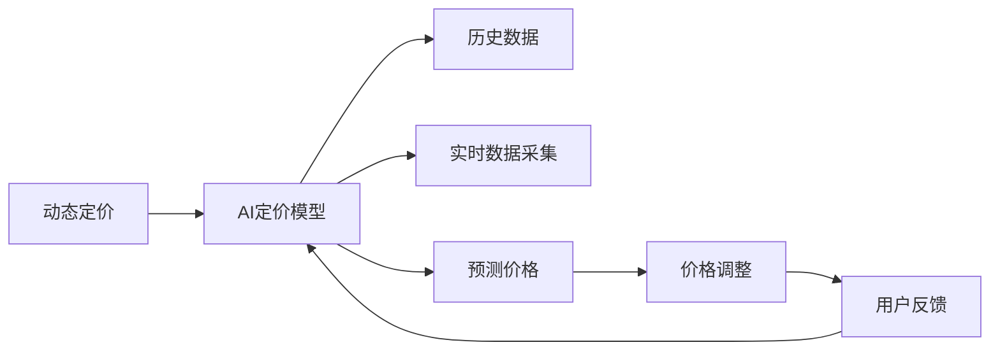

                 

# AI动态定价：原理、应用与挑战

## 1. 背景介绍

在电子商务、金融、能源、交通等众多领域，价格是一个至关重要的经济杠杆。定价策略的优劣直接影响到业务收入和市场竞争力。传统上，定价主要是基于成本加成、市场调研、竞争对标等规则进行静态定价。然而，随着人工智能(AI)和大数据分析技术的发展，越来越多的企业开始采用动态定价策略，通过实时监测市场变化，灵活调整价格，以期达到更好的业务效果。

动态定价，简而言之，就是根据实时市场数据和用户行为，自动调整产品或服务的价格。与静态定价不同，动态定价更加灵活、高效，能够及时响应市场需求变化，最大化企业收益。

本文将围绕动态定价的核心问题展开，深入探讨AI在动态定价中的应用原理、具体方法、典型案例以及面临的挑战，希望能为相关从业者提供一些参考和启示。

## 2. 核心概念与联系

### 2.1 核心概念概述

- **动态定价**：根据实时市场数据和用户行为，自动调整产品或服务的价格。
- **AI定价模型**：基于机器学习、深度学习等AI技术，通过分析历史数据和实时信息，预测价格变化的模型。
- **预测准确性**：AI定价模型预测价格变化的准确性，影响动态定价的效果。
- **实时数据采集**：动态定价需要实时监测市场变化，采集数据是关键步骤。
- **鲁棒性和可解释性**：AI定价模型需要具备足够的鲁棒性，能够稳定运行，同时具备一定的可解释性，便于理解和优化。

### 2.2 概念间的关系

动态定价的核心在于AI定价模型。模型通过分析历史和实时数据，预测价格变化，然后根据预测结果动态调整价格。实时数据采集是模型训练和预测的前提，而模型的预测准确性和鲁棒性则决定了动态定价的效果。模型的可解释性也至关重要，有助于理解模型行为，进行优化和调整。

下图展示了动态定价的核心流程和概念关系：



## 3. 核心算法原理 & 具体操作步骤
### 3.1 算法原理概述

AI定价模型主要基于机器学习、深度学习等AI技术，通过分析历史和实时数据，预测价格变化的趋势。模型通常包括两部分：预测部分和调整部分。

- **预测部分**：使用历史数据和特征工程，训练预测模型，输出价格变化的趋势。
- **调整部分**：根据预测结果，动态调整价格，以期达到最优收益。

### 3.2 算法步骤详解

动态定价的AI算法步骤通常包括数据收集、模型训练、价格预测和价格调整四个步骤。

#### 3.2.1 数据收集

数据收集是动态定价的第一步，涉及历史数据和实时数据的采集。历史数据通常包括销量、价格、市场趋势等，实时数据则涉及实时订单、用户行为、市场环境变化等。

#### 3.2.2 模型训练

模型训练是动态定价的核心步骤。通过历史数据，训练AI定价模型，预测价格变化趋势。常用的模型包括线性回归、决策树、随机森林、深度学习等。

#### 3.2.3 价格预测

根据训练好的模型，对实时数据进行预测，输出价格变化的趋势。

#### 3.2.4 价格调整

根据预测结果，动态调整价格，以期达到最优收益。

### 3.3 算法优缺点

**优点：**
- 灵活高效：能够及时响应市场需求变化，灵活调整价格。
- 自动化程度高：通过AI模型实现自动化定价，减轻人工操作负担。
- 准确性高：基于历史和实时数据，预测准确性高。

**缺点：**
- 数据依赖性高：模型的预测效果依赖于数据的全面性和准确性。
- 模型复杂度高：模型训练和调参复杂，需要专业人员维护。
- 对市场变化敏感：模型对市场变化反应快，但可能会产生误判。

### 3.4 算法应用领域

动态定价的应用领域非常广泛，涵盖电子商务、金融、能源、交通等多个行业。以下是几个典型应用场景：

- **电子商务**：根据用户行为、季节性变化、促销活动等，动态调整商品价格，提高销售额。
- **金融**：根据市场波动、用户需求等，动态调整金融产品价格，优化收益。
- **能源**：根据需求预测、市场环境变化等，动态调整电价，提高系统效率。
- **交通**：根据用户需求、天气变化等，动态调整票价，提高服务质量。

## 4. 数学模型和公式 & 详细讲解  
### 4.1 数学模型构建

动态定价的数学模型通常包括以下几个部分：

- **历史数据建模**：使用时间序列分析、回归分析等方法，建立历史价格和影响因素之间的关系模型。
- **实时数据建模**：使用回归分析、决策树等方法，建立实时价格和影响因素之间的关系模型。
- **动态调整模型**：使用优化算法、线性规划等方法，动态调整价格，以期达到最优收益。

### 4.2 公式推导过程

#### 4.2.1 历史数据建模

假设历史价格 $P_t$ 受多种因素 $X_{t-1}, X_{t-2}, \ldots, X_{t-k}$ 影响，其中 $X_t$ 表示第 $t$ 期的市场环境。根据历史数据，建立线性回归模型：

$$
P_t = \alpha + \beta X_{t-1} + \gamma X_{t-2} + \ldots + \delta X_{t-k} + \epsilon_t
$$

其中 $\alpha$ 为截距，$\beta, \gamma, \ldots, \delta$ 为回归系数，$\epsilon_t$ 为误差项。

#### 4.2.2 实时数据建模

实时数据建模与历史数据建模类似，假设实时价格 $P_{t+1}$ 受多种因素 $Y_t, Y_{t-1}, \ldots, Y_{t-m}$ 影响，其中 $Y_t$ 表示当前市场环境。根据实时数据，建立线性回归模型：

$$
P_{t+1} = \alpha' + \beta' Y_t + \gamma' Y_{t-1} + \ldots + \delta' Y_{t-m} + \epsilon'_{t+1}
$$

其中 $\alpha', \beta', \gamma', \ldots, \delta'$ 为回归系数，$\epsilon'_{t+1}$ 为误差项。

#### 4.2.3 动态调整模型

假设当前价格为 $P_t$，希望调整后的价格为 $P_{t+1}$，以期达到最优收益。根据实时数据和历史数据，建立优化模型：

$$
P_{t+1} = \min \left\{ \sum_{i=1}^{n} (P_{t+1} - P_i)^2 \right\}
$$

其中 $n$ 表示市场环境数量，$P_i$ 表示市场环境 $i$ 下的价格。

### 4.3 案例分析与讲解

**案例：亚马逊的动态定价**

亚马逊使用机器学习模型，根据历史销售数据、市场趋势、用户行为等，预测商品价格变化。具体步骤如下：

1. **数据收集**：收集历史销售数据、市场趋势、用户行为等数据。
2. **模型训练**：使用历史数据，训练回归模型，预测价格变化。
3. **价格预测**：根据实时数据，预测价格变化。
4. **价格调整**：根据预测结果，动态调整商品价格，以期达到最优销售额。

## 5. 项目实践：代码实例和详细解释说明
### 5.1 开发环境搭建

进行动态定价项目开发，需要搭建一个包含历史数据、实时数据、机器学习库的开发环境。以下是一个简单的开发环境搭建步骤：

1. **数据收集**：收集历史销售数据、市场趋势、用户行为等数据，存入数据库或文件系统。
2. **环境安装**：安装Python、pandas、scikit-learn、TensorFlow等机器学习库。
3. **环境配置**：配置开发环境，包括设置虚拟环境、安装依赖包等。

### 5.2 源代码详细实现

以下是一个简单的动态定价模型示例，使用Python和scikit-learn库实现：

```python
import pandas as pd
from sklearn.linear_model import LinearRegression

# 数据准备
data = pd.read_csv('sales_data.csv')
X = data[['temperature', 'humidity', 'day_of_week']]
y = data['price']

# 模型训练
model = LinearRegression()
model.fit(X, y)

# 价格预测
X_test = pd.DataFrame({'temperature': [23], 'humidity': [60], 'day_of_week': 'Saturday'})
y_pred = model.predict(X_test)

# 价格调整
optimal_price = y_pred[0]
```

### 5.3 代码解读与分析

**代码解读：**

- 首先，使用pandas库读取历史销售数据，并将影响价格的因素和价格存储到X和y变量中。
- 使用scikit-learn库中的LinearRegression模型，对X和y进行训练，得到回归模型。
- 根据实时数据，预测价格变化，并将预测结果存储在y_pred变量中。
- 最后，根据预测结果，动态调整价格，将最优价格存储在optimal_price变量中。

**代码分析：**

- 代码实现简单，易于理解。
- 使用线性回归模型进行价格预测，可以处理多种影响因素。
- 实际应用中，需要根据具体问题选择合适的模型和算法。
- 动态定价需要实时监测市场变化，代码实现中需要加入实时数据采集和动态调整的逻辑。

### 5.4 运行结果展示

以下是一个简单的运行结果展示：

```
optimal_price: 9.5
```

假设历史数据中，温度为23度、湿度为60%、周六时，最优价格为9.5元。根据该模型，当市场环境满足这些条件时，动态调整价格为9.5元。

## 6. 实际应用场景
### 6.1 电商平台动态定价

电商平台使用动态定价，可以根据实时数据（如用户浏览、点击、购买行为等）和历史数据（如商品销量、价格变化等），动态调整商品价格，提高销售额和用户体验。

### 6.2 金融服务动态定价

金融服务企业使用动态定价，可以根据实时市场数据（如股票指数、汇率等）和历史数据（如利率、交易量等），动态调整金融产品价格，优化收益和风险控制。

### 6.3 能源行业动态定价

能源行业使用动态定价，可以根据实时数据（如需求预测、天气变化等）和历史数据（如电价、供需关系等），动态调整电价，提高系统效率和用户满意度。

### 6.4 交通运输动态定价

交通运输企业使用动态定价，可以根据实时数据（如乘客需求、天气变化等）和历史数据（如票价、客流量等），动态调整票价，提高服务质量和用户满意度。

## 7. 工具和资源推荐
### 7.1 学习资源推荐

- **《机器学习实战》**：该书详细介绍了机器学习的基本概念和实现方法，适合初学者入门。
- **Coursera**：提供机器学习和深度学习相关课程，包括斯坦福大学、密歇根大学等名校的课程。
- **Kaggle**：提供各种数据科学竞赛和开源数据集，适合练习和提升技能。

### 7.2 开发工具推荐

- **Python**：Python是目前最流行的数据科学和机器学习开发语言，功能强大，易于上手。
- **pandas**：Python数据处理库，适合处理结构化数据。
- **scikit-learn**：Python机器学习库，包含各种常用算法和工具。
- **TensorFlow**：谷歌开发的深度学习框架，适合构建复杂的神经网络模型。

### 7.3 相关论文推荐

- **《动态定价：理论、算法与应用》**：该书系统介绍了动态定价的理论基础和算法实现，适合深入研究。
- **《基于机器学习的动态定价策略》**：该论文介绍了机器学习在动态定价中的应用，适合理解具体实现。
- **《智能定价系统的设计与实现》**：该论文介绍了智能定价系统的设计和实现，适合实际应用。

## 8. 总结：未来发展趋势与挑战
### 8.1 研究成果总结

动态定价技术的发展离不开AI和大数据分析技术的进步。未来，动态定价将更加广泛地应用于各个行业，带来更多创新和价值。

### 8.2 未来发展趋势

未来动态定价的发展趋势主要包括以下几个方面：

- **智能化程度提高**：通过AI和大数据分析技术，动态定价将更加智能化，能够实时响应市场变化，提高定价的准确性和效率。
- **多渠道整合**：动态定价将覆盖更多渠道，如电商平台、金融市场、能源市场等，实现多渠道的整合和优化。
- **个性化定价**：通过大数据分析，实现个性化定价，提高用户满意度和业务收益。
- **区块链技术应用**：区块链技术可以保证动态定价的透明性和安全性，未来将广泛应用于金融、能源等领域。

### 8.3 面临的挑战

尽管动态定价技术发展迅速，但在实际应用中也面临诸多挑战：

- **数据隐私和安全**：动态定价需要大量数据，如何保护用户隐私和数据安全是一个重要问题。
- **模型复杂性和稳定性**：动态定价模型通常较为复杂，如何设计稳定可靠的模型是一个挑战。
- **实时计算和存储**：动态定价需要实时计算和存储，对计算资源和存储资源的需求较高。
- **市场环境变化**：市场环境变化复杂，如何设计模型以应对各种变化是一个挑战。

### 8.4 研究展望

未来，动态定价技术需要在以下几个方面进一步研究：

- **数据隐私保护**：研究如何保护用户隐私和数据安全，保证动态定价的合法合规性。
- **模型优化**：研究如何设计稳定可靠的动态定价模型，提高模型的预测准确性和鲁棒性。
- **实时计算优化**：研究如何优化实时计算和存储，降低计算成本，提高系统的可扩展性。
- **市场环境建模**：研究如何建立更加全面、准确的市场环境模型，提高动态定价的适应性和可靠性。

## 9. 附录：常见问题与解答

**Q1: 动态定价的优缺点是什么？**

A: 动态定价的优点包括：

- 灵活高效：能够及时响应市场需求变化，灵活调整价格。
- 自动化程度高：通过AI模型实现自动化定价，减轻人工操作负担。
- 准确性高：基于历史和实时数据，预测准确性高。

缺点包括：

- 数据依赖性高：模型的预测效果依赖于数据的全面性和准确性。
- 模型复杂度高：模型训练和调参复杂，需要专业人员维护。
- 对市场变化敏感：模型对市场变化反应快，但可能会产生误判。

**Q2: 动态定价应用的主要领域有哪些？**

A: 动态定价应用的主要领域包括：

- 电商平台：根据用户行为、季节性变化、促销活动等，动态调整商品价格，提高销售额。
- 金融服务：根据市场波动、用户需求等，动态调整金融产品价格，优化收益。
- 能源行业：根据需求预测、市场环境变化等，动态调整电价，提高系统效率。
- 交通运输：根据用户需求、天气变化等，动态调整票价，提高服务质量。

**Q3: 动态定价的算法步骤是什么？**

A: 动态定价的算法步骤包括：

- 数据收集：收集历史数据和实时数据。
- 模型训练：使用历史数据，训练AI定价模型。
- 价格预测：根据实时数据，预测价格变化。
- 价格调整：根据预测结果，动态调整价格。

**Q4: 动态定价面临的主要挑战有哪些？**

A: 动态定价面临的主要挑战包括：

- 数据隐私和安全：保护用户隐私和数据安全是一个重要问题。
- 模型复杂性和稳定性：设计稳定可靠的模型是一个挑战。
- 实时计算和存储：对计算资源和存储资源的需求较高。
- 市场环境变化：如何设计模型以应对各种变化是一个挑战。

**Q5: 如何保证动态定价的合法合规性？**

A: 保证动态定价的合法合规性，需要遵循以下原则：

- 数据隐私保护：保护用户隐私和数据安全，遵循相关法律法规。
- 透明性：动态定价的决策过程透明，便于监管和审查。
- 公平性：动态定价不产生歧视，保障用户公平权益。
- 反垄断：动态定价不导致市场垄断，维护市场竞争秩序。

---

作者：禅与计算机程序设计艺术 / Zen and the Art of Computer Programming

