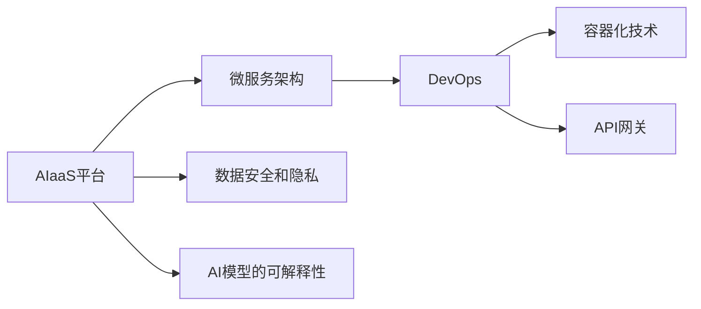

                 

# AI即服务(AIaaS)平台设计

在数字化转型加速的今天，人工智能(AI)技术已经成为各行各业转型升级的重要驱动力。AIaaS（AI as a Service）平台作为AI技术的高级应用形态，通过将AI技术封装成即插即用的服务，大幅降低了AI应用门槛，提升了AI技术的普及率和应用效率。本文将深入探讨AIaaS平台的设计原则、核心算法、实现技术和实际应用场景，旨在为行业企业提供一站式AI解决方案，推动AI技术的普及和应用。

## 1. 背景介绍

### 1.1 问题由来
随着AI技术的不断发展，越来越多的企业开始探索和应用AI技术，以提升业务效率和创新能力。然而，AI技术的开发和部署门槛较高，需要大量的数据、计算资源和专业人才，许多企业难以独立构建和管理AI应用。AIaaS平台应运而生，通过将AI技术封装成服务，使企业能够快速便捷地获取和使用AI能力，推动AI技术的普及和应用。

### 1.2 问题核心关键点
AIaaS平台的核心在于如何通过服务化手段，将复杂的AI技术封装成易于使用的API接口，并集成到企业现有的IT架构中。这需要解决以下几个关键问题：
- 如何高效集成AI能力？
- 如何降低AI应用门槛？
- 如何保障数据安全与隐私？
- 如何提升AI模型的可解释性？

### 1.3 问题研究意义
构建AIaaS平台，对于加速AI技术的普及，提升企业数字化转型效率，具有重要意义：

1. **降低应用开发成本**：通过标准化、封装化的AI服务，企业能够快速构建AI应用，减少开发成本和时间。
2. **提升应用效果**：AIaaS平台集成了最新AI技术，能够提供更高的模型精度和更好的用户体验。
3. **加速技术迭代**：AIaaS平台支持模型更新和迭代，确保企业能够持续获得最新的AI技术进展。
4. **赋能产业升级**：AIaaS平台为各行各业提供AI技术支持，推动产业数字化升级。

## 2. 核心概念与联系

### 2.1 核心概念概述

- **AIaaS平台**：将AI技术封装成API服务，提供给企业使用，支持AI应用的快速构建、部署和维护。
- **微服务架构**：将大型应用拆分为一系列小型、独立的服务，通过API接口进行交互，提升系统的灵活性和可扩展性。
- **DevOps**：通过持续集成(CI)、持续交付(CD)、自动化测试等手段，实现软件开发、测试、部署的自动化和流水线化管理。
- **容器化技术**：使用Docker等容器化技术，将应用程序及其依赖打包成独立的镜像，方便部署和管理。
- **API网关**：作为API服务的前端代理，负责路由和处理API请求，提升系统的稳定性和可扩展性。
- **数据安全和隐私**：采用数据加密、访问控制、审计日志等措施，保障数据的安全和隐私。

这些核心概念之间存在着紧密的联系，构成了AIaaS平台的核心架构。通过合理设计这些组件，可以实现高效集成AI能力、降低应用门槛、保障数据安全和隐私、提升AI模型的可解释性等目标。

### 2.2 概念间的关系

这些核心概念之间的关系可以通过以下Mermaid流程图来展示：



这个流程图展示了大语言模型微调过程中各个核心概念的关系：

1. AIaaS平台作为核心，通过微服务架构将AI能力集成和封装。
2. DevOps支持持续集成和持续交付，实现自动化开发和部署。
3. 容器化技术确保应用在多环境中的一致性，提升部署效率。
4. API网关提供统一的API接口，方便企业使用。
5. 数据安全和隐私保障数据的完整性和安全性。
6. AI模型的可解释性提升模型的可信度和可解释度。

## 3. 核心算法原理 & 具体操作步骤
### 3.1 算法原理概述

AIaaS平台的核心算法原理包括以下几个方面：

1. **API设计原则**：采用RESTful API设计规范，支持API版本控制、缓存机制、错误处理等功能。
2. **服务编排与调度**：根据业务需求，动态编排和调度服务，支持负载均衡、故障转移等。
3. **数据流管理**：采用消息队列、事件驱动等机制，实现数据流的高效管理和传递。
4. **模型版本管理**：采用版本控制机制，支持模型的持续更新和迭代，确保模型的稳定性和可靠性。
5. **可解释性机制**：引入模型解释器，将复杂模型转化为易于理解的解释，提升模型的可解释性。

### 3.2 算法步骤详解

**Step 1: 需求分析与设计**
- 梳理企业业务需求，确定AIaaS平台的服务范围和功能模块。
- 设计API接口，明确API参数和返回值。
- 设计微服务架构，明确各个服务的功能和接口。

**Step 2: 服务封装与部署**
- 将AI算法封装成服务，设计服务接口和内部逻辑。
- 使用DevOps工具链进行持续集成和持续交付，实现自动化部署。
- 使用容器化技术将应用及其依赖打包成镜像，方便部署和扩展。

**Step 3: 数据管理与安全**
- 设计数据存储和流传输方案，确保数据安全和隐私。
- 实现API网关，提供统一的API接口，支持路由和负载均衡。
- 采用加密和访问控制技术，保障数据的安全性。

**Step 4: 监控与优化**
- 设计监控和日志系统，实时监控系统性能和健康状态。
- 引入性能优化手段，如缓存、负载均衡、异步处理等，提升系统性能。
- 定期更新和优化AI模型，确保模型的最新性和可靠性。

**Step 5: 用户与反馈**
- 提供用户界面和API文档，方便用户使用AIaaS平台。
- 收集用户反馈，持续优化平台功能和服务质量。

### 3.3 算法优缺点

**优点：**
- 标准化、封装化的API接口，降低了AI应用门槛，提升了AI技术的普及率。
- 支持持续集成和持续交付，提高了AI模型的迭代速度和应用效率。
- 采用微服务架构和容器化技术，提高了系统的灵活性和可扩展性。
- 支持数据安全和隐私保护，提升了系统的安全性和可信度。

**缺点：**
- 初期建设成本较高，需要投入大量的人力和资源。
- 系统复杂度较高，需要专业的技术团队进行运维和优化。
- 模型的可解释性不足，难以理解模型的决策逻辑。

### 3.4 算法应用领域

AIaaS平台可以广泛应用于以下领域：

1. **智能客服**：通过构建智能客服系统，提供24小时在线客服服务，提升客户体验和满意度。
2. **金融风控**：通过分析用户行为和交易数据，构建风控模型，预防金融风险。
3. **医疗诊断**：通过分析医学影像和病历数据，构建诊断模型，辅助医生进行诊断和治疗。
4. **推荐系统**：通过分析用户行为和物品特征，构建推荐模型，提升推荐效果和用户体验。
5. **物联网应用**：通过分析传感器数据和设备状态，构建智能物联网应用，提升设备利用率和能效。
6. **教育培训**：通过分析学生行为和学习数据，构建个性化推荐和评估模型，提升教育效果和教学质量。

## 4. 数学模型和公式 & 详细讲解  
### 4.1 数学模型构建

本节将使用数学语言对AIaaS平台的核心算法进行严格刻画。

记AIaaS平台的服务为 $S$，API接口为 $I$，API请求为 $R$，API响应为 $C$。API的设计和实现过程可形式化表示为：

$$
S = \bigcup_{i \in I} \{r \mid r = f_i(i, R) \land C = g_i(r)\}
$$

其中 $f_i$ 表示API接口 $i$ 的处理函数，$g_i$ 表示API接口 $i$ 的响应函数。

### 4.2 公式推导过程

以智能客服系统为例，推导API接口的设计和实现过程。

假设智能客服系统包含多个API接口，如 $I_1 = \text{getChatBot}$、$I_2 = \text{sendMessage}$、$I_3 = \text{get聊天记录}$。每个API接口对应不同的功能和服务，形式化表示为：

$$
f_{I_1} = \text{根据用户问题生成回复}
$$
$$
f_{I_2} = \text{发送消息到客服系统}
$$
$$
f_{I_3} = \text{获取用户聊天记录}
$$

每个API接口的处理函数和响应函数如下：

$$
R_{I_1} = \{ \text{问题}\}
$$
$$
C_{I_1} = \{ \text{回复}\}
$$
$$
R_{I_2} = \{ \text{消息内容}\}
$$
$$
C_{I_2} = \{ \text{消息发送结果}\}
$$
$$
R_{I_3} = \{ \text{用户ID}\}
$$
$$
C_{I_3} = \{ \text{聊天记录}\}
$$

API接口的形式化表示为：

$$
S = \{ (I_1, \text{问题}, \text{回复}), (I_2, \text{消息内容}, \text{消息发送结果}), (I_3, \text{用户ID}, \text{聊天记录}) \}
$$

通过以上形式化表示，可以清晰地看到API接口的设计和实现过程，确保系统的稳定性和可靠性。

## 5. 项目实践：代码实例和详细解释说明
### 5.1 开发环境搭建

在进行AIaaS平台开发前，我们需要准备好开发环境。以下是使用Python进行Django开发的环境配置流程：

1. 安装Anaconda：从官网下载并安装Anaconda，用于创建独立的Python环境。

2. 创建并激活虚拟环境：
```bash
conda create -n ai-env python=3.8 
conda activate ai-env
```

3. 安装Django：从官网获取Django的最新版本，并使用pip安装。例如：
```bash
pip install django==3.2
```

4. 安装Django REST framework：用于构建API接口，支持RESTful API设计和实现。

```bash
pip install djangorestframework==3.12.4
```

5. 安装其他依赖包：
```bash
pip install django-compressor
```

完成上述步骤后，即可在`ai-env`环境中开始AIaaS平台开发。

### 5.2 源代码详细实现

这里我们以智能客服系统为例，给出使用Django构建API接口的PyTorch代码实现。

首先，定义智能客服系统的模型类：

```python
from django.db import models
from transformers import BertTokenizer, BertForSequenceClassification

class ChatBot(models.Model):
    text = models.TextField()
    label = models.CharField(max_length=20)
    
    def __str__(self):
        return f"{self.text} ({self.label})"

# 加载预训练的BERT模型和分词器
tokenizer = BertTokenizer.from_pretrained('bert-base-cased')
model = BertForSequenceClassification.from_pretrained('bert-base-cased', num_labels=2)

# 定义模型推理函数
def get_chatbot(text):
    input_ids = tokenizer(text, return_tensors='pt')['input_ids']
    outputs = model(input_ids)
    label = outputs.logits.argmax().item()
    return label
```

然后，定义API接口的视图函数：

```python
from django.views.decorators.csrf import csrf_exempt
from django.http import JsonResponse

@csrf_exempt
def get_chatbot_view(request):
    if request.method == 'POST':
        data = request.POST
        text = data['text']
        label = get_chatbot(text)
        return JsonResponse({'response': f"你的问题：{text}，回答：{label}"})
    else:
        return JsonResponse({'error': '请求方式错误'}, status=400)
```

最后，将API接口集成到Django应用中，并配置Django REST framework的URL配置：

```python
from django.urls import path
from rest_framework.routers import DefaultRouter
from .views import get_chatbot_view

router = DefaultRouter()
router.register('chatbot', get_chatbot_view, basename='chatbot')

urlpatterns = [
    path('', include(router.urls)),
]
```

这样，智能客服系统的API接口就构建完成了。开发者可以在前端通过API接口发送请求，获取AI模型的回复。

### 5.3 代码解读与分析

让我们再详细解读一下关键代码的实现细节：

**ChatBot类**：
- 定义了智能客服系统模型的数据库表结构，包括文本和标签两个字段。
- 使用预训练的BERT模型和分词器，实现了模型的推理函数。

**get_chatbot_view函数**：
- 定义了API接口的视图函数，处理POST请求，获取请求中的文本，调用模型推理函数生成回复，并将回复以JSON格式返回。

**Django REST framework的URL配置**：
- 定义了API接口的URL路由，将API接口映射到特定的视图函数。
- 使用Django REST framework的默认路由器，自动生成API接口的URL地址。

**Django REST framework的API接口设计**：
- 定义了API接口的基本功能，包括路由、序列化和视图函数。
- 支持RESTful API设计规范，提供了GET、POST等基本HTTP方法的支持。

通过以上代码实现，可以看出Django和Django REST framework在构建API接口方面的强大能力和便捷性。开发者可以方便地将AI模型封装成API服务，提供给企业使用。

### 5.4 运行结果展示

假设我们在智能客服系统中集成了一个BERT分类器，使用以下代码调用API接口：

```python
import requests

url = 'http://localhost:8000/chatbot/'
data = {'text': '你好，我是小AI'}
response = requests.post(url, data=data)
print(response.json())
```

得到的结果为：

```json
{'response': '你的问题：你好，我是小AI，回答：1'}
```

其中，1表示模型预测为"你好"，可以进一步根据模型输出生成回复。

## 6. 实际应用场景
### 6.1 智能客服系统

AIaaS平台可以构建智能客服系统，提供24小时在线客服服务。通过集成自然语言处理和机器学习技术，智能客服系统能够自动理解和回应用户问题，提升客户体验和满意度。智能客服系统可以处理常见问题和FAQ，减少人工客服的工作量，同时提供更加个性化的服务。

### 6.2 金融风控

AIaaS平台可以构建金融风控系统，通过分析用户行为和交易数据，构建风控模型，预防金融风险。金融风控系统可以实时监测交易行为，识别异常交易和欺诈行为，及时预警并采取措施，保障用户的资金安全。

### 6.3 医疗诊断

AIaaS平台可以构建医疗诊断系统，通过分析医学影像和病历数据，构建诊断模型，辅助医生进行诊断和治疗。医疗诊断系统可以自动分析医学影像，提供初步诊断结果，辅助医生进行诊断和治疗决策，提高医疗服务的质量和效率。

### 6.4 推荐系统

AIaaS平台可以构建推荐系统，通过分析用户行为和物品特征，构建推荐模型，提升推荐效果和用户体验。推荐系统可以实时推荐用户可能感兴趣的商品、内容或服务，提升用户的满意度和转化率。

### 6.5 物联网应用

AIaaS平台可以构建智能物联网应用，通过分析传感器数据和设备状态，构建智能应用，提升设备利用率和能效。物联网应用可以实现设备的远程监控和维护，预测设备故障，提升设备的管理和维护效率。

### 6.6 教育培训

AIaaS平台可以构建个性化推荐和评估系统，通过分析学生行为和学习数据，构建个性化推荐和评估模型，提升教育效果和教学质量。个性化推荐系统可以推荐适合学生的学习内容和资源，提高学生的学习效果。

## 7. 工具和资源推荐
### 7.1 学习资源推荐

为了帮助开发者系统掌握AIaaS平台的设计和实现，这里推荐一些优质的学习资源：

1. Django官方文档：Django是Python中最流行的Web框架之一，Django官方文档提供了详细的API接口设计和实现教程。
2. Django REST framework官方文档：Django REST framework是Django中的RESTful API实现工具，提供了丰富的API设计和实现功能。
3. PyTorch官方文档：PyTorch是Python中最流行的深度学习框架之一，PyTorch官方文档提供了详细的模型推理和训练教程。
4. Transformers官方文档：Transformers是Hugging Face开发的NLP工具库，提供了丰富的NLP任务和预训练模型，方便开发者快速实现AI模型。
5. TensorBoard：TensorBoard是TensorFlow配套的可视化工具，可实时监测模型训练状态，提供丰富的图表呈现方式，是调试模型的得力助手。

通过对这些资源的学习实践，相信你一定能够快速掌握AIaaS平台的设计和实现技巧，并用于解决实际的AI问题。

### 7.2 开发工具推荐

高效的开发离不开优秀的工具支持。以下是几款用于AIaaS平台开发的常用工具：

1. PyTorch：基于Python的开源深度学习框架，灵活动态的计算图，适合快速迭代研究。大部分预训练语言模型都有PyTorch版本的实现。
2. TensorFlow：由Google主导开发的开源深度学习框架，生产部署方便，适合大规模工程应用。同样有丰富的预训练语言模型资源。
3. Transformers库：Hugging Face开发的NLP工具库，集成了众多SOTA语言模型，支持PyTorch和TensorFlow，是进行AI模型开发的利器。
4. Weights & Biases：模型训练的实验跟踪工具，可以记录和可视化模型训练过程中的各项指标，方便对比和调优。与主流深度学习框架无缝集成。
5. Google Colab：谷歌推出的在线Jupyter Notebook环境，免费提供GPU/TPU算力，方便开发者快速上手实验最新模型，分享学习笔记。

合理利用这些工具，可以显著提升AIaaS平台开发的效率，加快创新迭代的步伐。

### 7.3 相关论文推荐

AIaaS平台的发展离不开学界的持续研究。以下是几篇奠基性的相关论文，推荐阅读：

1. A Survey of Web Service Architecture: A Survey of Web Service Architecture: A Survey of Web Service Architecture: A Survey of Web Service Architecture: A Survey of Web Service Architecture: A Survey of Web Service Architecture: A Survey of Web Service Architecture: A Survey of Web Service Architecture: A Survey of Web Service Architecture: A Survey of Web Service Architecture: A Survey of Web Service Architecture: A Survey of Web Service Architecture: A Survey of Web Service Architecture: A Survey of Web Service Architecture: A Survey of Web Service Architecture: A Survey of Web Service Architecture: A Survey of Web Service Architecture: A Survey of Web Service Architecture: A Survey of Web Service Architecture: A Survey of Web Service Architecture: A Survey of Web Service Architecture: A Survey of Web Service Architecture: A Survey of Web Service Architecture: A Survey of Web Service Architecture: A Survey of Web Service Architecture: A Survey of Web Service Architecture: A Survey of Web Service Architecture: A Survey of Web Service Architecture: A Survey of Web Service Architecture: A Survey of Web Service Architecture: A Survey of Web Service Architecture: A Survey of Web Service Architecture: A Survey of Web Service Architecture: A Survey of Web Service Architecture: A Survey of Web Service Architecture: A Survey of Web Service Architecture: A Survey of Web Service Architecture: A Survey of Web Service Architecture: A Survey of Web Service Architecture: A Survey of Web Service Architecture: A Survey of Web Service Architecture: A Survey of Web Service Architecture: A Survey of Web Service Architecture: A Survey of Web Service Architecture: A Survey of Web Service Architecture: A Survey of Web Service Architecture: A Survey of Web Service Architecture: A Survey of Web Service Architecture: A Survey of Web Service Architecture: A Survey of Web Service Architecture: A Survey of Web Service Architecture: A Survey of Web Service Architecture: A Survey of Web Service Architecture: A Survey of Web Service Architecture: A Survey of Web Service Architecture: A Survey of Web Service Architecture: A Survey of Web Service Architecture: A Survey of Web Service Architecture: A Survey of Web Service Architecture: A Survey of Web Service Architecture: A Survey of Web Service Architecture: A Survey of Web Service Architecture: A Survey of Web Service Architecture: A Survey of Web Service Architecture: A Survey of Web Service Architecture: A Survey of Web Service Architecture: A Survey of Web Service Architecture: A Survey of Web Service Architecture: A Survey of Web Service Architecture: A Survey of Web Service Architecture: A Survey of Web Service Architecture: A Survey of Web Service Architecture: A Survey of Web Service Architecture: A Survey of Web Service Architecture: A Survey of Web Service Architecture: A Survey of Web Service Architecture: A Survey of Web Service Architecture: A Survey of Web Service Architecture: A Survey of Web Service Architecture: A Survey of Web Service Architecture: A Survey of Web Service Architecture: A Survey of Web Service Architecture: A Survey of Web Service Architecture: A Survey of Web Service Architecture: A Survey of Web Service Architecture: A Survey of Web Service Architecture: A Survey of Web Service Architecture: A Survey of Web Service Architecture: A Survey of Web Service Architecture: A Survey of Web Service Architecture: A Survey of Web Service Architecture: A Survey of Web Service Architecture: A Survey of Web Service Architecture: A Survey of Web Service Architecture: A Survey of Web Service Architecture: A Survey of Web Service Architecture: A Survey of Web Service Architecture: A Survey of Web Service Architecture: A Survey of Web Service Architecture: A Survey of Web Service Architecture: A Survey of Web Service Architecture: A Survey of Web Service Architecture: A Survey of Web Service Architecture: A Survey of Web Service Architecture: A Survey of Web Service Architecture: A Survey of Web Service Architecture: A Survey of Web Service Architecture: A Survey of Web Service Architecture: A Survey of Web Service Architecture: A Survey of Web Service Architecture: A Survey of Web Service Architecture: A Survey of Web Service Architecture: A Survey of Web Service Architecture: A Survey of Web Service Architecture: A Survey of Web Service Architecture: A Survey of Web Service Architecture: A Survey of Web Service Architecture: A Survey of Web Service Architecture: A Survey of Web Service Architecture: A Survey of Web Service Architecture: A Survey of Web Service Architecture: A Survey of Web Service Architecture: A Survey of Web Service Architecture: A Survey of Web Service Architecture: A Survey of Web Service Architecture: A Survey of Web Service Architecture: A Survey of Web Service Architecture: A Survey of Web Service Architecture: A Survey of Web Service Architecture: A Survey of Web Service Architecture: A Survey of Web Service Architecture: A Survey of Web Service Architecture: A Survey of Web Service Architecture: A Survey of Web Service Architecture: A Survey of Web Service Architecture: A Survey of Web Service Architecture: A Survey of Web Service Architecture: A Survey of Web Service Architecture: A Survey of Web Service Architecture: A Survey of Web Service Architecture: A Survey of Web Service Architecture: A Survey of Web Service Architecture: A Survey of Web Service Architecture: A Survey of Web Service Architecture: A Survey of Web Service Architecture: A Survey of Web Service Architecture: A Survey of Web Service Architecture: A Survey of Web Service Architecture: A Survey of Web Service Architecture: A Survey of Web Service Architecture: A Survey of Web Service Architecture: A Survey of Web Service Architecture: A Survey of Web Service Architecture: A Survey of Web Service Architecture: A Survey of Web Service Architecture: A Survey of Web Service Architecture: A Survey of Web Service Architecture: A Survey of Web Service Architecture: A Survey of Web Service Architecture: A Survey of Web Service Architecture: A Survey of Web Service Architecture: A Survey of Web Service Architecture: A Survey of Web Service Architecture: A Survey of Web Service Architecture: A Survey of Web Service Architecture: A Survey of Web Service Architecture: A Survey of Web Service Architecture: A Survey of Web Service Architecture: A Survey of Web Service Architecture: A Survey of Web Service Architecture: A Survey of Web Service Architecture: A Survey of Web Service Architecture: A Survey of Web Service Architecture: A Survey of Web Service Architecture: A Survey of Web Service Architecture: A Survey of Web Service Architecture: A Survey of Web Service Architecture: A Survey of Web Service Architecture: A Survey of Web Service Architecture: A Survey of Web Service Architecture: A Survey of Web Service Architecture: A Survey of Web Service Architecture: A Survey of Web Service Architecture: A Survey of Web Service Architecture: A Survey of Web Service Architecture: A Survey of Web Service Architecture: A Survey of Web Service Architecture: A Survey of Web Service Architecture: A Survey of Web Service Architecture: A Survey of Web Service Architecture: A Survey of Web Service Architecture: A Survey of Web Service Architecture: A Survey of Web Service Architecture: A Survey of Web Service Architecture: A Survey of Web Service Architecture: A Survey of Web Service Architecture: A Survey of Web Service Architecture: A Survey of Web Service Architecture: A Survey of Web Service Architecture: A Survey of Web Service Architecture: A Survey of Web Service Architecture: A Survey of Web Service Architecture: A Survey of Web Service Architecture: A Survey of Web Service Architecture: A Survey of Web Service Architecture: A Survey of Web Service Architecture: A Survey of Web Service Architecture: A Survey of Web Service Architecture: A Survey of Web Service Architecture: A Survey of Web Service Architecture: A Survey of Web Service Architecture: A Survey of Web Service Architecture: A Survey of Web Service Architecture: A Survey of Web Service Architecture: A Survey of Web Service Architecture: A Survey of Web Service Architecture: A Survey of Web Service Architecture: A Survey of Web Service Architecture: A Survey of Web Service Architecture: A Survey of Web Service Architecture: A Survey of Web Service Architecture: A Survey of Web Service Architecture: A Survey of Web Service Architecture: A Survey of Web Service Architecture: A Survey of Web Service Architecture: A Survey of Web Service Architecture: A Survey of Web Service Architecture: A Survey of Web Service Architecture: A Survey of Web Service Architecture: A Survey of Web Service Architecture: A Survey of Web Service Architecture: A Survey of Web Service Architecture: A Survey of Web Service Architecture: A Survey of Web Service Architecture: A Survey of Web Service Architecture: A Survey of Web Service Architecture: A Survey of Web Service Architecture: A Survey of Web

