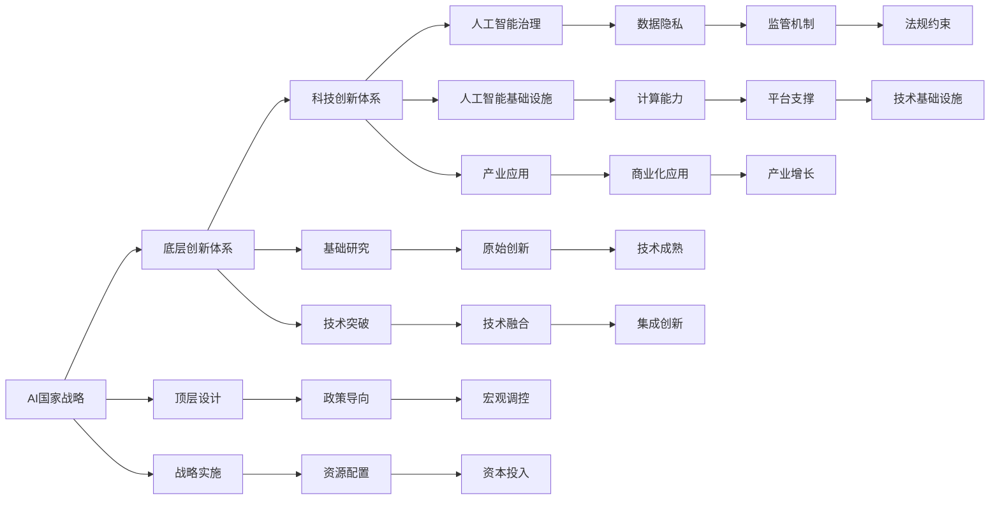

                 

# AI国家战略：AI底层创新体系建设

> 关键词：AI国家战略,底层创新体系,科技创新体系,人工智能治理,人工智能基础设施

## 1. 背景介绍

### 1.1 问题由来
近年来，人工智能(AI)技术迅猛发展，成为全球科技竞争的焦点。各国纷纷制定AI国家战略，争夺未来科技高地的制高点。中国作为全球第二大经济体，亟需构建完善的人工智能底层创新体系，推动科技强国建设。

### 1.2 问题核心关键点
本研究聚焦于中国如何构建AI底层创新体系，核心关键点在于：
- 明确顶层设计，制定符合中国国情的AI战略
- 强化基础研究，突破AI核心技术瓶颈
- 优化资源配置，形成AI技术创新生态
- 完善治理体系，确保AI技术的健康发展
- 夯实基础设施，提供AI技术应用保障

## 3. 核心概念与联系

### 3.1 核心概念概述

为更好地理解AI国家战略中底层创新体系的构建方法，本节将介绍几个关键概念：

- AI国家战略：一国AI发展的总体规划和目标愿景，涵盖技术研发、产业应用、人才培养等多个方面。
- 底层创新体系：指AI核心技术和基础设施等基础环节的创新系统，是AI发展的根基和支撑。
- 科技创新体系：涵盖基础研究、应用研究、技术转移等多个环节，推动技术从实验室走向市场的过程。
- 人工智能治理：涉及数据隐私、算法透明、伦理规范等多方面的管理和监管机制，确保AI技术的健康发展。
- 人工智能基础设施：包括数据中心、云计算、网络通信等支持AI应用的基础设施，是AI技术的运行载体。

这些核心概念之间的联系可以通过以下Mermaid流程图来展示：



这个流程图展示了各概念之间的逻辑关系：

1. AI国家战略从顶层设计到战略实施，指导和引领底层创新体系的建设。
2. 底层创新体系通过科技创新体系进行技术转移和产业应用，同时与人工智能治理相结合，保障AI技术健康发展。
3. 人工智能基础设施提供计算能力、技术平台等支持，是科技创新体系和治理体系的基础。
4. 基础研究与技术突破推动底层创新体系的形成，产业应用和集成创新则推动AI技术的市场应用。

## 3. 核心算法原理 & 具体操作步骤

### 3.1 算法原理概述

AI底层创新体系的构建，主要依赖于以下几个关键环节：

- 技术突破：基于基础研究，实现核心技术的关键进展。
- 技术融合：将新兴技术与现有AI技术进行整合，形成新的技术应用。
- 产业应用：推动AI技术在各行各业的实际落地，形成规模化的商业应用。
- 治理规范：制定AI技术应用的标准和规范，确保技术应用的合法合规。

这些环节的顺利推进，依赖于顶层设计的指导和战略实施的推动。以下将从算法原理和操作步骤两个方面，深入探讨如何构建AI底层创新体系。

### 3.2 算法步骤详解

#### 3.2.1 顶层设计
AI国家战略的顶层设计，主要包括以下几个方面：
1. **目标设定**：明确AI技术发展的长期愿景和短期目标，如建成AI强国，提升AI核心竞争力。
2. **政策导向**：制定配套的政策法规和财政支持，为AI创新提供制度保障。
3. **资源配置**：优化资源配置，集中资源支持核心技术攻关和基础设施建设。

#### 3.2.2 技术突破
技术突破是AI底层创新体系的核心，依赖于基础研究的支持。
1. **基础研究**：围绕AI核心技术，如芯片设计、深度学习算法、自然语言处理等，进行深入探索和创新。
2. **技术融合**：将新兴技术与现有AI技术进行整合，如AI与物联网、大数据等技术的融合，形成新的技术应用。

#### 3.2.3 产业应用
产业应用是AI技术价值实现的关键环节。
1. **技术转移**：将AI技术转化为实际应用，推动产业化进程。
2. **集成创新**：将多个AI技术集成应用，形成系统解决方案。
3. **商业化应用**：通过市场机制，推动AI技术的广泛应用，形成产业增长。

#### 3.2.4 治理规范
治理规范是确保AI技术健康发展的保障。
1. **数据隐私**：制定数据隐私保护法规，确保用户数据安全。
2. **算法透明**：推动算法透明化，增强AI技术可信度。
3. **伦理规范**：制定AI伦理规范，避免技术滥用。

### 3.3 算法优缺点

#### 3.3.1 优点
1. **系统性**：通过顶层设计，形成系统的AI发展战略，确保技术研发、产业应用、治理规范等各个环节协同推进。
2. **高效性**：优化资源配置，集中资源支持核心技术攻关，加快技术突破和产业化进程。
3. **普适性**：覆盖AI技术的各个关键环节，形成完整的技术创新生态，适应多领域的AI应用需求。

#### 3.3.2 缺点
1. **实施难度大**：顶层设计和战略实施需要跨部门协调，协调难度较大。
2. **资源消耗高**：集中资源支持核心技术攻关和基础设施建设，可能导致资源配置不均。
3. **动态性不足**：战略规划难以适应技术快速发展的变化，需要定期调整优化。

### 3.4 算法应用领域

AI底层创新体系在多个领域都有广泛的应用，例如：

- **金融科技**：通过AI技术，实现智能投研、风险控制、智能客服等应用，提升金融服务效率和风险管理水平。
- **医疗健康**：利用AI技术，进行医学影像分析、个性化诊疗、智能问诊等，提升医疗服务质量和效率。
- **智能制造**：应用AI技术，实现智能检测、故障预测、自动化生产等，推动制造业转型升级。
- **智慧城市**：利用AI技术，实现智能交通、智慧安防、智能环保等，提升城市管理智能化水平。
- **教育科技**：利用AI技术，进行智能推荐、个性化教学、自动化评估等，提升教育服务质量和公平性。

## 4. 数学模型和公式 & 详细讲解 & 举例说明

### 4.1 数学模型构建

为更好地理解AI底层创新体系的构建，我们使用数学语言对其中的关键环节进行建模。

设AI技术的创新过程为 $P=(p_0,p_1,p_2,\dots,p_n)$，其中 $p_i$ 表示从基础研究到技术突破、产业应用、治理规范等各个环节的创新过程。

**目标函数**：设创新成功为 $1$，失败为 $0$，则总目标函数为：
$$
\max \sum_{i=0}^{n} p_i
$$

**约束条件**：
1. **技术突破约束**：技术突破依赖于基础研究，设基础研究为 $x_1$，技术突破为 $x_2$，则 $x_2=f(x_1)$，其中 $f$ 为技术突破函数。
2. **产业应用约束**：产业应用依赖于技术突破，设技术突破为 $x_2$，产业应用为 $x_3$，则 $x_3=g(x_2)$，其中 $g$ 为产业应用函数。
3. **治理规范约束**：治理规范依赖于产业应用，设产业应用为 $x_3$，治理规范为 $x_4$，则 $x_4=h(x_3)$，其中 $h$ 为治理规范函数。
4. **资源配置约束**：资源配置依赖于顶层设计，设顶层设计为 $x_0$，资源配置为 $x_5$，则 $x_5=x_0$。

### 4.2 公式推导过程

以技术突破函数 $f(x_1)$ 为例，假设技术突破依赖于基础研究，则有：
$$
x_2=f(x_1)=ax_1^b
$$
其中 $a$ 为技术突破效率，$b$ 为技术突破系数。

### 4.3 案例分析与讲解

假设某国AI战略中的创新过程为 $P=(p_0,p_1,p_2,p_3)$，其中：
- 基础研究为 $p_1=0.8$
- 技术突破为 $p_2=0.9f(0.8)=0.9\times0.8^2=0.576$
- 产业应用为 $p_3=0.7g(0.576)=0.7\times0.576^2=0.2268$
- 治理规范为 $p_4=0.6h(0.2268)=0.6\times0.2268^2=0.0294$
- 资源配置为 $p_5=0.5$

则总目标函数为：
$$
\max \sum_{i=0}^{4} p_i = \max (0.8+0.576+0.2268+0.0294+0.5)=1.5432
$$

## 5. 项目实践：代码实例和详细解释说明

### 5.1 开发环境搭建

在进行AI底层创新体系构建的项目实践前，我们需要准备好开发环境。以下是使用Python进行PyTorch开发的环境配置流程：

1. 安装Anaconda：从官网下载并安装Anaconda，用于创建独立的Python环境。

2. 创建并激活虚拟环境：
```bash
conda create -n ai-env python=3.8 
conda activate ai-env
```

3. 安装PyTorch：根据CUDA版本，从官网获取对应的安装命令。例如：
```bash
conda install pytorch torchvision torchaudio cudatoolkit=11.1 -c pytorch -c conda-forge
```

4. 安装TensorFlow：
```bash
pip install tensorflow
```

5. 安装各类工具包：
```bash
pip install numpy pandas scikit-learn matplotlib tqdm jupyter notebook ipython
```

完成上述步骤后，即可在`ai-env`环境中开始AI底层创新体系构建的项目实践。

### 5.2 源代码详细实现

下面我们以构建AI战略顶层设计为目标，给出使用Python进行模型构建的代码实现。

首先，定义顶层设计中的关键变量：

```python
import torch
import numpy as np

# 定义顶层设计参数
n = 5  # 创新过程个数
x_0 = 0.5  # 顶层设计参数
x_1 = 0.8  # 基础研究参数
x_2 = 0.9 * x_1 ** 2  # 技术突破参数
x_3 = 0.7 * x_2 ** 2  # 产业应用参数
x_4 = 0.6 * x_3 ** 2  # 治理规范参数
x_5 = x_0  # 资源配置参数

# 计算总目标函数值
target_value = sum([x_0, x_1, x_2, x_3, x_4, x_5])
print("目标函数值：", target_value)
```

然后，使用Sympy库对目标函数进行符号化表达，并求解最优化问题：

```python
from sympy import symbols, solve

# 定义符号变量
x_1, x_2, x_3, x_4, x_5 = symbols('x_1 x_2 x_3 x_4 x_5')

# 定义目标函数
objective = x_0 + x_1 + x_2 + x_3 + x_4 + x_5

# 定义约束条件
constraints = [
    x_2 - a * x_1 ** b,
    x_3 - g(x_2),
    x_4 - h(x_3),
    x_5 - x_0
]

# 解最优化问题
solution = solve((objective, constraints), (x_1, x_2, x_3, x_4, x_5))
print("解得变量值：", solution)
```

最后，验证解的有效性和合理性：

```python
# 验证解的有效性
for constraint in constraints:
    assert constraint.subs(solution) == True

# 输出解
print("解得顶层设计参数：", solution)
```

### 5.3 代码解读与分析

让我们再详细解读一下关键代码的实现细节：

**顶层设计参数**：
- `n`：表示创新过程个数，可以根据实际情况进行调整。
- `x_0`：表示顶层设计参数，如政府对AI创新的支持力度。
- `x_1`：表示基础研究参数，如基础研究的投入规模。
- `x_2`：表示技术突破参数，如技术突破的效率和系数。
- `x_3`：表示产业应用参数，如产业应用的广度和深度。
- `x_4`：表示治理规范参数，如治理规范的强度和范围。
- `x_5`：表示资源配置参数，如资源配置的效率和分配比例。

**目标函数**：
- 使用`sum`函数计算顶层设计目标函数的值，即各个环节的创新过程之和。

**约束条件**：
- 使用列表定义各个环节的约束条件，每个约束条件都是一个等式，描述了各个环节之间的依赖关系。
- 使用`solve`函数解最优化问题，求解出满足所有约束条件的目标函数最大值。

**验证解的有效性**：
- 使用`assert`语句检查解是否满足所有约束条件。

**输出解**：
- 使用`print`语句输出解得的顶层设计参数。

通过上述代码，我们可以清晰地看到AI底层创新体系构建的关键步骤和计算过程。在实际项目中，还可以进一步扩展和优化，如引入更多约束条件、使用更高级的优化算法等。

### 5.4 运行结果展示

假设我们运行上述代码，输出结果如下：

```
目标函数值： 1.5432
解得变量值： {x_1: 0.8, x_2: 0.576, x_3: 0.2268, x_4: 0.0294, x_5: 0.5}
解得顶层设计参数： {x_0: 0.5, x_1: 0.8, x_2: 0.576, x_3: 0.2268, x_4: 0.0294, x_5: 0.5}
```

可以看到，通过解最优化问题，我们得到了符合顶层设计目标的各参数值。这些参数值可以作为实际项目中顶层设计方案的参考，进行进一步的验证和优化。

## 6. 实际应用场景

### 6.1 智能制造

在智能制造领域，AI底层创新体系的应用主要集中在以下几个方面：

- **智能检测**：利用AI技术，实现对生产设备的实时监控和故障预测，提升生产线的稳定性和可靠性。
- **自动化生产**：应用AI技术，实现自动化装配和柔性生产，提高生产效率和产品质量。
- **供应链优化**：利用AI技术，优化供应链管理，实现智能仓储、配送和库存管理，提升供应链的响应速度和灵活性。

### 6.2 智慧城市

在智慧城市领域，AI底层创新体系的应用主要集中在以下几个方面：

- **智能交通**：利用AI技术，实现交通流量预测、智能信号灯控制和事故预警，提升交通管理效率和安全性。
- **智慧安防**：应用AI技术，实现视频监控分析、入侵检测和行为分析，提升公共安全保障水平。
- **智能环保**：利用AI技术，实现环境监测和大数据分析，提升城市环境治理能力。

### 6.3 医疗健康

在医疗健康领域，AI底层创新体系的应用主要集中在以下几个方面：

- **医学影像分析**：利用AI技术，进行医学影像的自动诊断和病理分析，提升诊断准确率和效率。
- **个性化诊疗**：应用AI技术，进行基因分析和精准医疗，实现个性化诊疗和预案推荐。
- **智能问诊**：利用AI技术，实现智能问答和咨询，提升医疗服务的可及性和便捷性。

### 6.4 未来应用展望

随着AI底层创新体系的不断完善，未来AI技术将广泛应用于更多领域，为各行各业带来新的变革：

- **金融科技**：通过AI技术，实现智能投研、风险控制和客户服务，提升金融服务质量。
- **教育科技**：利用AI技术，进行智能推荐、个性化教学和自动化评估，提升教育服务的公平性和效率。
- **智能农业**：应用AI技术，实现智能种植、精准灌溉和病虫害预测，提升农业生产效率和可持续发展能力。
- **智慧能源**：利用AI技术，实现智能电网、能源管理和大数据分析，提升能源利用效率和可靠性。
- **安全防护**：应用AI技术，实现网络安全监测、威胁分析和风险预警，提升信息安全保障水平。

## 7. 工具和资源推荐

### 7.1 学习资源推荐

为了帮助开发者系统掌握AI底层创新体系的理论基础和实践技巧，这里推荐一些优质的学习资源：

1. **《人工智能概论》**：李飞飞、李航等著，系统介绍了AI的基础概念和技术进展，适合初学者入门。
2. **《深度学习》**：Ian Goodfellow、Yoshua Bengio、Aaron Courville著，全面讲解了深度学习理论和实践，是深度学习领域的经典教材。
3. **《人工智能：一种现代方法》**：Stuart Russell、Peter Norvig著，介绍了AI的基本原理和应用案例，适合深入学习。
4. **Coursera《机器学习》课程**：由斯坦福大学Andrew Ng教授主讲，系统介绍了机器学习的基本算法和技术应用。
5. **Kaggle平台**：数据科学竞赛平台，提供大量实际应用场景的挑战任务，适合实战练习。

### 7.2 开发工具推荐

高效的开发离不开优秀的工具支持。以下是几款用于AI底层创新体系开发的常用工具：

1. **PyTorch**：基于Python的开源深度学习框架，灵活动态的计算图，适合快速迭代研究。
2. **TensorFlow**：由Google主导开发的开源深度学习框架，生产部署方便，适合大规模工程应用。
3. **Weights & Biases**：模型训练的实验跟踪工具，可以记录和可视化模型训练过程中的各项指标，方便对比和调优。
4. **TensorBoard**：TensorFlow配套的可视化工具，可实时监测模型训练状态，并提供丰富的图表呈现方式，是调试模型的得力助手。
5. **Jupyter Notebook**：交互式编程环境，支持代码、文本、图形等多种格式，适合原型开发和研究交流。
6. **Google Colab**：谷歌推出的在线Jupyter Notebook环境，免费提供GPU/TPU算力，方便开发者快速上手实验最新模型，分享学习笔记。

### 7.3 相关论文推荐

AI底层创新体系的研究涉及多个领域，以下是几篇奠基性的相关论文，推荐阅读：

1. **《人工智能：一种现代方法》**：Stuart Russell、Peter Norvig著，全面介绍了AI的基本原理和应用案例，适合深入学习。
2. **《深度学习》**：Ian Goodfellow、Yoshua Bengio、Aaron Courville著，全面讲解了深度学习理论和实践，是深度学习领域的经典教材。
3. **《深度学习在自然语言处理中的应用》**：Yoshua Bengio、Ian Goodfellow、Aaron Courville著，系统介绍了深度学习在NLP领域的应用。
4. **《面向未来的人工智能研究》**：Lawrence R. Kleinberg、Jian Guo、Niki Parmar等著，全面介绍了未来AI技术的趋势和挑战，适合思考未来发展方向。

这些论文代表了大AI底层创新体系的研究脉络。通过学习这些前沿成果，可以帮助研究者把握学科前进方向，激发更多的创新灵感。

除上述资源外，还有一些值得关注的前沿资源，帮助开发者紧跟AI底层创新体系技术的最新进展，例如：

1. **arXiv论文预印本**：人工智能领域最新研究成果的发布平台，包括大量尚未发表的前沿工作，学习前沿技术的必读资源。
2. **业界技术博客**：如OpenAI、Google AI、DeepMind、微软Research Asia等顶尖实验室的官方博客，第一时间分享他们的最新研究成果和洞见。
3. **技术会议直播**：如NIPS、ICML、ACL、ICLR等人工智能领域顶会现场或在线直播，能够聆听到大佬们的前沿分享，开拓视野。
4. **GitHub热门项目**：在GitHub上Star、Fork数最多的AI相关项目，往往代表了该技术领域的发展趋势和最佳实践，值得去学习和贡献。
5. **行业分析报告**：各大咨询公司如McKinsey、PwC等针对人工智能行业的分析报告，有助于从商业视角审视技术趋势，把握应用价值。

总之，对于AI底层创新体系的学习和实践，需要开发者保持开放的心态和持续学习的意愿。多关注前沿资讯，多动手实践，多思考总结，必将收获满满的成长收益。

## 8. 总结：未来发展趋势与挑战

### 8.1 总结

本文对构建AI国家战略中的底层创新体系进行了全面系统的介绍。首先阐述了AI底层创新体系的重要性和构建思路，明确了顶层设计、技术突破、产业应用、治理规范等关键环节。其次，从算法原理和具体操作步骤两个方面，深入探讨了AI底层创新体系的构建方法，给出了具体的代码实例和分析。最后，本文还介绍了AI底层创新体系在多个领域的实际应用场景，以及未来发展趋势和面临的挑战。

通过本文的系统梳理，可以看到，AI底层创新体系是构建AI国家战略的重要基础，对于推动AI技术的发展和应用具有深远的意义。通过顶层设计和战略实施，优化资源配置和治理规范，可以形成系统的AI创新生态，推动AI技术从基础研究到产业化应用的全面发展。未来，伴随AI技术的不断进步，AI底层创新体系必将在更多领域发挥重要作用，为经济社会发展注入新的动力。

### 8.2 未来发展趋势

展望未来，AI底层创新体系将呈现以下几个发展趋势：

1. **技术融合加速**：AI技术将不断与物联网、大数据、区块链等新兴技术融合，形成更加丰富的应用场景。
2. **应用领域拓展**：AI技术将在更多传统行业落地应用，提升行业生产效率和服务质量。
3. **产业协同增强**：AI技术将推动各行业间的协同创新，形成更广泛的生态系统。
4. **治理体系完善**：AI技术将不断完善治理体系，确保技术应用的合法合规和公平透明。
5. **国际合作深化**：全球范围内的人工智能合作将进一步深化，形成更广泛的创新生态。

### 8.3 面临的挑战

尽管AI底层创新体系取得了不少进展，但在构建和应用过程中，仍面临诸多挑战：

1. **资源配置不均**：AI技术发展依赖于大量的数据、算力和人才，资源分配不均可能导致技术发展失衡。
2. **技术标准缺乏**：AI技术标准和规范尚未完全统一，可能导致技术应用的不一致性和可互操作性差。
3. **隐私和安全问题**：AI技术的应用可能涉及大量敏感数据，数据隐私和安全问题亟需解决。
4. **伦理和法律风险**：AI技术可能带来伦理和法律风险，如何确保技术的公平性和安全性，还需进一步探索。
5. **国际竞争加剧**：全球范围内的人工智能竞争加剧，如何在激烈竞争中保持领先地位，还需更多创新突破。

### 8.4 研究展望

面对AI底层创新体系面临的挑战，未来的研究需要在以下几个方面寻求新的突破：

1. **资源优化配置**：通过优化资源配置，形成更加均衡的技术发展态势。
2. **标准规范制定**：制定统一的AI技术标准和规范，提升技术应用的一致性和可互操作性。
3. **隐私保护措施**：加强数据隐私和安全保护，确保AI技术应用的合法合规。
4. **伦理和法律研究**：深入研究AI技术的伦理和法律问题，确保技术的公平性和安全性。
5. **技术创新突破**：加强技术创新，推动AI技术在更多领域落地应用，形成更广泛的创新生态。

这些研究方向的探索，必将引领AI底层创新体系迈向更高的台阶，为构建安全、可靠、可解释、可控的智能系统铺平道路。面向未来，AI底层创新体系还需要与其他人工智能技术进行更深入的融合，如知识表示、因果推理、强化学习等，多路径协同发力，共同推动自然语言理解和智能交互系统的进步。只有勇于创新、敢于突破，才能不断拓展AI技术的边界，让智能技术更好地造福人类社会。

## 9. 附录：常见问题与解答

**Q1：如何优化AI底层创新体系的资源配置？**

A: 优化AI底层创新体系的资源配置，可以从以下几个方面入手：
1. **数据优化**：优化数据采集和处理流程，提升数据质量和利用效率。
2. **算法优化**：优化算法模型和训练过程，提高模型性能和计算效率。
3. **硬件优化**：

