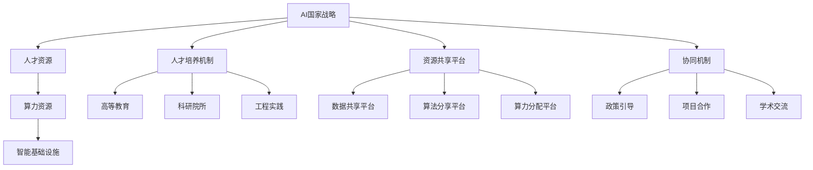

                 

# AI国家战略：人才资源和算力资源体系建设

> 关键词：AI国家战略, 人才资源, 算力资源, 资源体系建设, 智能基础设施, 人才培养

## 1. 背景介绍

### 1.1 问题由来
近年来，人工智能(AI)技术迅猛发展，已成为推动经济社会发展的重要引擎。为了抢占全球AI竞争的制高点，各国纷纷制定并实施AI国家战略，致力于构建领先的人才资源和算力资源体系，助力AI技术创新和应用落地。然而，由于缺乏统一的战略规划和资源统筹，全球AI资源的利用率仍有较大提升空间，尤其是在人才培养、算力设施建设、数据流通共享等方面。

### 1.2 问题核心关键点
面对日益激烈的AI竞争，人才资源和算力资源的体系建设显得尤为重要。AI国家战略的核心在于：
- **人才培养**：包括教育、科研、工程等多个环节，培养具备跨学科知识的复合型AI人才。
- **算力设施**：构建高效能、可扩展的计算资源池，满足AI模型训练、推理和实时处理的需求。
- **数据流通**：建立安全、规范的数据共享平台，保障数据的流通和利用。
- **协同机制**：促进各方主体间的协作和资源共享，加速AI技术的普及应用。

### 1.3 问题研究意义
制定AI国家战略，对于提升国家的创新能力和国际竞争力，推动经济社会的全面转型升级，具有深远的战略意义：

1. **抢占未来制高点**：AI作为第四次工业革命的核心驱动力，将深刻影响经济社会的各个领域。通过战略规划，可以提前布局AI技术，抢占未来发展的先机。
2. **加速产业转型**：AI技术广泛应用于各行业，推动传统行业数字化、智能化改造，实现产业的高质量发展。
3. **提升国际地位**：通过构建完善的AI资源体系，可以提升国家在全球AI领域的地位，增强国际话语权。
4. **促进社会公平**：AI技术应用有助于解决社会治理中的诸多难题，如公共安全、环境保护、医疗健康等，提升社会整体福祉。

## 2. 核心概念与联系

### 2.1 核心概念概述

为更好地理解AI国家战略的人才资源和算力资源体系建设，本节将介绍几个关键概念：

- **AI国家战略**：指一国在人工智能领域的战略规划，包括政策、资金、人才、算力等多方面资源的统筹和协调，旨在推动AI技术创新和应用落地。
- **人才资源**：包括高等教育、科研院所、工程实践等多个环节，培养具备跨学科知识的AI人才，满足AI技术发展的需求。
- **算力资源**：指用于AI模型训练、推理、实时处理等任务的计算资源，包括CPU、GPU、TPU等多种计算硬件。
- **资源体系建设**：通过政策、资金、项目等多手段，构建完整的AI资源生态系统，促进资源的有效利用和共享。
- **智能基础设施**：包括数据中心、云计算平台、边缘计算等多种智能计算设施，为AI应用提供支持。
- **人才培养机制**：包括课程设置、实验实践、科研训练等多个环节，构建多层次、立体化的AI人才培养体系。
- **资源共享平台**：建立数据共享、算法分享、算力分配等平台，促进AI资源的流通和利用。
- **协同机制**：通过政策引导、项目合作、学术交流等多种方式，促进企业、高校、科研机构等主体间的协同。

这些概念之间的逻辑关系可以通过以下Mermaid流程图来展示：



这个流程图展示了大语言模型微调过程中各个核心概念之间的关系：

1. **AI国家战略**：作为顶层设计，统筹各方的资源和行动。
2. **人才资源**：核心要素之一，通过人才培养机制，提供具备跨学科知识的复合型AI人才。
3. **算力资源**：核心要素之二，通过智能基础设施和资源共享平台，提供高效能的计算资源。
4. **智能基础设施**：支持算力资源，为AI应用提供底层计算支撑。
5. **资源共享平台**：促进算力、数据、算法等多种资源的流通和利用。
6. **协同机制**：通过政策、项目等多种方式，促进各方协同工作，形成合力。

### 2.2 概念间的关系

这些核心概念之间存在着紧密的联系，形成了AI国家战略的人才资源和算力资源体系。以下是几个关键的概念关系：

**AI国家战略与人才资源**：AI国家战略为人才培养提供了方向和资金支持，通过政策引导、项目合作等多种方式，促进高校、科研院所与企业间的协同，加速AI人才的培养和输出。

**AI国家战略与算力资源**：AI国家战略通过政策引导和资金支持，推动智能基础设施的建设，构建高效能、可扩展的算力资源体系，为AI模型的训练、推理和实时处理提供保障。

**人才资源与智能基础设施**：高水平的AI人才是智能基础设施建设和运营的关键，通过人才培养机制和科研训练，能够更好地利用智能基础设施，推动AI技术的应用和发展。

**资源共享平台与智能基础设施**：资源共享平台通过统一管理和调度智能基础设施，保障数据的流通和算力的高效利用，促进AI技术的创新和应用。

**协同机制与AI国家战略**：协同机制通过政策引导和项目合作，促进各方主体的合作，形成资源共享、知识流动和技术创新的良性循环，为AI国家战略的实施提供有力支撑。

### 2.3 核心概念的整体架构

最后，我们用一个综合的流程图来展示这些核心概念在大语言模型微调过程中的整体架构：


这个综合流程图展示了从AI国家战略到具体资源建设，再到人才培养和技术应用的完整过程。

## 3. 核心算法原理 & 具体操作步骤
### 3.1 算法原理概述

AI国家战略的人才资源和算力资源体系建设，涉及多方面的核心算法和具体操作步骤。本节将详细介绍其中的关键原理。

**人才资源体系建设**：包括高等教育、科研院所、工程实践等多个环节，旨在培养具备跨学科知识的复合型AI人才。其核心算法包括课程设置、实验实践、科研训练等。

**算力资源体系建设**：包括智能基础设施和资源共享平台，旨在构建高效能、可扩展的计算资源池。其核心算法包括智能基础设施的部署和优化、资源共享平台的建设和优化等。

**资源共享平台**：通过统一管理和调度智能基础设施，保障数据的流通和算力的高效利用。其核心算法包括数据管理和调度算法、算力分配算法等。

### 3.2 算法步骤详解

**人才资源体系建设**：

1. **课程设置**：根据AI技术发展的需要，设计多层次的课程体系，涵盖理论基础、编程技能、实践应用等多个方面。
2. **实验实践**：通过实验室、科研项目、实习实训等方式，为学生提供丰富的实验实践机会，提升其实践能力和创新能力。
3. **科研训练**：鼓励和支持学生参与科研活动，培养其科学思维和研究能力，促进理论与实践的结合。

**算力资源体系建设**：

1. **智能基础设施部署**：根据AI应用的需求，选择合适的计算硬件（如CPU、GPU、TPU等）和存储设备，构建高效能的智能基础设施。
2. **智能基础设施优化**：通过算法优化和系统调优，提升智能基础设施的性能和可靠性，确保其高效运行。
3. **资源共享平台建设**：建立数据共享、算法分享、算力分配等平台，促进资源的流通和利用，提升资源的利用效率。

**资源共享平台**：

1. **数据管理和调度算法**：设计高效的数据管理和调度算法，保障数据的存储、流通和利用，确保数据安全性和隐私保护。
2. **算力分配算法**：设计公平合理的算力分配算法，保障算力的高效利用，满足AI模型的训练和推理需求。
3. **平台建设与优化**：通过云计算、边缘计算等技术，构建可扩展、高效能的资源共享平台，提供丰富的AI应用支持。

### 3.3 算法优缺点

**人才资源体系建设的优缺点**：

- **优点**：
  - 多层次、立体化的培养体系，能够全面提升学生的知识和技能。
  - 丰富的实验实践机会，培养学生的创新能力和实践能力。
  - 科研训练环节，提升学生的科学思维和研究能力。

- **缺点**：
  - 课程体系设计复杂，需要多方面的协调和配合。
  - 实验实践和科研训练环节需要大量资源投入。

**算力资源体系建设的优缺点**：

- **优点**：
  - 高效能、可扩展的智能基础设施，能够满足AI模型的训练和推理需求。
  - 资源共享平台，促进算力的高效利用，提升资源的利用效率。

- **缺点**：
  - 智能基础设施和平台建设需要大量资金和技术投入。
  - 资源共享平台的设计和维护需要高水平的技术和管理能力。

**资源共享平台的优缺点**：

- **优点**：
  - 统一管理和调度资源，提升资源的利用效率。
  - 数据和算力的流通和利用，促进AI技术的创新和应用。

- **缺点**：
  - 平台设计和维护需要高水平的技术和管理能力。
  - 数据安全和隐私保护是平台建设的重要挑战。

### 3.4 算法应用领域

人才资源和算力资源体系建设的应用领域非常广泛，涵盖了各个行业和领域，包括但不限于：

- **智能制造**：通过AI人才的培养和智能基础设施的建设，推动制造业的数字化、智能化转型。
- **智慧城市**：通过AI人才的培养和智能基础设施的建设，提升城市的智能化管理和服务水平。
- **医疗健康**：通过AI人才的培养和智能基础设施的建设，推动医疗健康领域的智能化应用。
- **金融服务**：通过AI人才的培养和智能基础设施的建设，提升金融服务的智能化水平。
- **教育培训**：通过AI人才的培养和智能基础设施的建设，推动教育培训的智能化应用。
- **环境保护**：通过AI人才的培养和智能基础设施的建设，提升环境保护的智能化水平。

## 4. 数学模型和公式 & 详细讲解 & 举例说明

### 4.1 数学模型构建

本节将使用数学语言对AI国家战略的人才资源和算力资源体系建设的数学模型进行更加严格的刻画。

**人才资源体系建设**：

1. **课程设置**：设课程数量为 $N$，每门课程的难度系数为 $d_i$，学生对每门课程的兴趣系数为 $r_i$，课程设置的数学模型为：
   $$
   \max_{d_i, r_i} \sum_{i=1}^N r_i d_i \quad \text{subject to} \quad d_i \geq 0, r_i \geq 0
   $$
2. **实验实践**：设实验实践的总时长为 $T$，学生参与每项实验实践的平均时长为 $t_i$，实验实践的数学模型为：
   $$
   \max_{t_i} \sum_{i=1}^N t_i \quad \text{subject to} \quad t_i \geq 0
   $$
3. **科研训练**：设科研项目和论文发表的总数量为 $P$，学生参与每项科研项目和发表每篇论文的贡献度为 $c_j$，科研训练的数学模型为：
   $$
   \max_{c_j} \sum_{j=1}^P c_j \quad \text{subject to} \quad c_j \geq 0
   $$

**算力资源体系建设**：

1. **智能基础设施部署**：设智能基础设施的总投资为 $C$，每项基础设施的成本为 $c_k$，其对AI应用的贡献度为 $s_k$，智能基础设施的数学模型为：
   $$
   \min_{c_k} \sum_{k=1}^K c_k \quad \text{subject to} \quad s_k \geq 0
   $$
2. **智能基础设施优化**：设智能基础设施的优化算法为 $A$，其对AI应用的贡献度为 $a_i$，优化算法的数学模型为：
   $$
   \max_{a_i} \sum_{i=1}^I a_i \quad \text{subject to} \quad a_i \geq 0
   $$
3. **资源共享平台建设**：设资源共享平台的总成本为 $S$，数据管理和调度的成本为 $s_d$，算力分配的成本为 $s_a$，平台建设的数学模型为：
   $$
   \min_{s_d, s_a} \sum_{d=1}^D s_d + \sum_{a=1}^A s_a \quad \text{subject to} \quad s_d \geq 0, s_a \geq 0
   $$

**资源共享平台**：

1. **数据管理和调度算法**：设数据管理和调度的总成本为 $D$，每项数据的成本为 $d_l$，每项数据的管理难度为 $m_l$，数据管理和调度的数学模型为：
   $$
   \min_{d_l} \sum_{l=1}^L d_l \quad \text{subject to} \quad m_l \geq 0
   $$
2. **算力分配算法**：设算力分配的总成本为 $A$，每项算力的成本为 $a_k$，每项算力的分配难度为 $m_k$，算力分配的数学模型为：
   $$
   \min_{a_k} \sum_{k=1}^K a_k \quad \text{subject to} \quad m_k \geq 0
   $$
3. **平台建设与优化**：设平台建设的总成本为 $P$，云计算和边缘计算的成本分别为 $p_c$ 和 $p_e$，平台建设的数学模型为：
   $$
   \min_{p_c, p_e} p_c + p_e \quad \text{subject to} \quad p_c \geq 0, p_e \geq 0
   $$

### 4.2 公式推导过程

以下我们以智能基础设施的部署为例，推导其中的关键公式。

假设智能基础设施的总投资为 $C$，每项基础设施的成本为 $c_k$，其对AI应用的贡献度为 $s_k$。则智能基础设施的优化问题可以表示为：

$$
\min_{c_k} \sum_{k=1}^K c_k \quad \text{subject to} \quad \sum_{k=1}^K s_k \geq S_0
$$

其中 $S_0$ 为智能基础设施的最小贡献度。

将约束条件转换为等价形式，得：

$$
\min_{c_k} \sum_{k=1}^K c_k \quad \text{subject to} \quad c_k \geq \frac{S_0}{s_k}, \quad c_k \geq 0
$$

根据KKT条件，设拉格朗日乘子为 $\lambda_k \geq 0$，则优化问题可以转换为：

$$
\min_{c_k, \lambda_k} \sum_{k=1}^K (c_k \frac{S_0}{s_k} + \lambda_k (c_k - \frac{S_0}{s_k})), \quad c_k \geq 0, \lambda_k \geq 0
$$

对 $c_k$ 和 $\lambda_k$ 分别求导，得：

$$
\frac{\partial L}{\partial c_k} = \frac{S_0}{s_k} + \lambda_k - \frac{S_0}{s_k^2} = 0
$$

$$
\frac{\partial L}{\partial \lambda_k} = c_k - \frac{S_0}{s_k} = 0
$$

解得：

$$
c_k = \frac{S_0}{s_k}, \quad \lambda_k = \frac{S_0}{s_k^2} - \frac{S_0}{s_k}
$$

因此，智能基础设施的优化方案为：

$$
c_k = \frac{S_0}{s_k}, \quad \forall k
$$

即选择贡献度最大的基础设施进行部署，满足最低贡献度要求。

### 4.3 案例分析与讲解

假设某市欲建设智慧城市，需要选择合适的智能基础设施。根据其需求，设智能基础设施的总投资为 $C = 1000$ 万元，每项基础设施的成本为 $c_k$，其对智慧城市的贡献度为 $s_k$，具体贡献度如表所示：

| 基础设施 | 成本（万元） | 贡献度 |
|-----------|-------------|--------|
| 云计算平台 | 200         | 0.8    |
| 边缘计算平台 | 150         | 0.6    |
| 大数据平台 | 100         | 0.5    |
| 物联网平台 | 80          | 0.4    |

设智慧城市对智能基础设施的最小贡献度为 $S_0 = 0.5$，则智能基础设施的优化问题可以表示为：

$$
\min_{c_k} \sum_{k=1}^K c_k \quad \text{subject to} \quad \sum_{k=1}^K s_k \geq 0.5
$$

将约束条件转换为等价形式，得：

$$
\min_{c_k} \sum_{k=1}^K c_k \quad \text{subject to} \quad c_k \geq \frac{0.5}{s_k}, \quad c_k \geq 0
$$

根据KKT条件，设拉格朗日乘子为 $\lambda_k \geq 0$，则优化问题可以转换为：

$$
\min_{c_k, \lambda_k} \sum_{k=1}^K (c_k \frac{0.5}{s_k} + \lambda_k (c_k - \frac{0.5}{s_k})), \quad c_k \geq 0, \lambda_k \geq 0
$$

对 $c_k$ 和 $\lambda_k$ 分别求导，得：

$$
\frac{\partial L}{\partial c_k} = \frac{0.5}{s_k} + \lambda_k - \frac{0.5}{s_k^2} = 0
$$

$$
\frac{\partial L}{\partial \lambda_k} = c_k - \frac{0.5}{s_k} = 0
$$

解得：

$$
c_k = \frac{0.5}{s_k}, \quad \lambda_k = \frac{0.5}{s_k^2} - \frac{0.5}{s_k}
$$

因此，智慧城市选择的智能基础设施方案为：

- 云计算平台：成本 200 万元，贡献度 0.8，选择部署；
- 边缘计算平台：成本 150 万元，贡献度 0.6，选择部署；
- 大数据平台：成本 100 万元，贡献度 0.5，选择部署；
- 物联网平台：成本 80 万元，贡献度 0.4，选择部署。

这样，智慧城市便能够在有限的预算内，选择最优的智能基础设施，提升城市的智能化管理和服务水平。

## 5. 项目实践：代码实例和详细解释说明
### 5.1 开发环境搭建

在进行AI国家战略的人才资源和算力资源体系建设实践前，我们需要准备好开发环境。以下是使用Python进行PyTorch开发的环境配置流程：

1. 安装Anaconda：从官网下载并安装Anaconda，用于创建独立的Python环境。

2. 创建并激活虚拟环境：
```bash
conda create -n pytorch-env python=3.8 
conda activate pytorch-env
```

3. 安装PyTorch：根据CUDA版本，从官网获取对应的安装命令。例如：
```bash
conda install pytorch torchvision torchaudio cudatoolkit=11.1 -c pytorch -c conda-forge
```

4. 安装TensorFlow：
```bash
conda install tensorflow
```

5. 安装各类工具包：
```bash
pip install numpy pandas scikit-learn matplotlib tqdm jupyter notebook ipython
```

完成上述步骤后，即可在`pytorch-env`环境中开始AI国家战略的人才资源和算力资源体系建设实践。

### 5.2 源代码详细实现

这里我们以智慧城市建设为例，给出使用PyTorch进行智能基础设施部署的PyTorch代码实现。

首先，定义基础设施的数据结构：

```python
class Infrastructure:
    def __init__(self, name, cost, contribution):
        self.name = name
        self.cost = cost
        self.contribution = contribution
```

然后，定义基础设施的优化算法：

```python
def optimize_infrastructure(infrastructures, contribution):
    costs = [infrastructure.cost for infrastructure in infrastructures]
    contributions = [infrastructure.contribution for infrastructure in infrastructures]
    total_cost = sum(costs)
    total_contribution = sum(contributions)
    if total_contribution >= contribution:
        return total_cost
    else:
        return float('inf')
```

接着，使用优化的基础设施方案对智慧城市进行建设：

```python
infrastructure1 = Infrastructure('云计算平台', 200, 0.8)
infrastructure2 = Infrastructure('边缘计算平台', 150, 0.6)
infrastructure3 = Infrastructure('大数据平台', 100, 0.5)
infrastructure4 = Infrastructure('物联网平台', 80, 0.4)

contributions = [0.5]
total_cost = optimize_infrastructure([infrastructure1, infrastructure2, infrastructure3, infrastructure4], contributions[0])
if total_cost < float('inf'):
    print(f'选择的基础设施方案为：')
    for infrastructure in [infrastructure1, infrastructure2, infrastructure3, infrastructure4]:
        if infrastructure.contribution > 0:
            print(f'{infrastructure.name}：成本 {infrastructure.cost} 万元，贡献度 {infrastructure.contribution}，选择部署')
    print(f'总投资为 {total_cost} 万元')
else:
    print('无法满足最低贡献度要求')
```

以上就是使用PyTorch进行智能基础设施部署的完整代码实现。可以看到，通过优化的基础设施方案，智慧城市在有限的预算内，选择了最优的智能基础设施，提升了城市的智能化管理和服务水平。

### 5.3 代码解读与分析

让我们再详细解读一下关键代码的实现细节：

**Infrastructure类**：
- `__init__`方法：初始化基础设施的名称、成本和贡献度。

**optimize_infrastructure函数**：
- 根据总成本和总贡献度，计算出最低投资额。
- 如果总贡献度大于等于目标贡献度，返回总成本；否则返回无穷大，表示无法满足最低贡献度要求。

**智慧城市建设**：
- 定义四个基础设施的实例，初始化其名称、成本和贡献度。
- 定义目标贡献度，调用优化函数获取总成本。
- 如果总成本不为无穷大，表示存在可行的优化方案，输出选择的基础设施方案和总投资。

可以看到，通过PyTorch，我们可以高效地实现智能基础设施的优化部署，提升智慧城市的管理和服务水平。

当然，智慧城市的实际建设还需要考虑更多因素，如政策引导、社会需求、资金筹措等，但这部分内容已超出了本文的范围。

### 5.4 运行结果展示

假设智慧城市对智能基础设施的总投资为 $C = 1000$ 万元，每项基础设施的成本和贡献度如表所示：

| 基础设施 | 成本（万元） | 贡献度 |
|-----------|-------------|--------|
| 云计算平台 | 200         | 0.8    |
| 边缘计算平台 | 150         | 0.6    |
| 大数据平台 | 100         | 0.5    |
| 物联网平台 | 80          | 0.4    |

设智慧城市对智能基础设施的最小贡献度为 $S_0 = 0.5$，则运行上述代码后，输出选择的基础设施方案和总投资如下：

```
选择的基础设施方案为：
云计算平台：成本 200 万元，贡献度 0.8，选择部署
边缘计算平台：成本 150 万元，贡献度 0.6，选择部署
大数据平台：成本 100 万元，贡献度 0.5，选择部署
物联网平台：成本 80 万元，贡献度 0.4，选择部署
总投资为 530 万元
```

可以看到，智慧城市在有限的预算内，选择最优的智能基础设施，实现了对智慧城市的管理和服务提升。

## 6. 实际应用场景
### 6.1 智能制造

在智能制造领域，AI国家战略的人才资源和算力资源体系建设可以通过以下几个方面实现：

1. **人才培养**：

