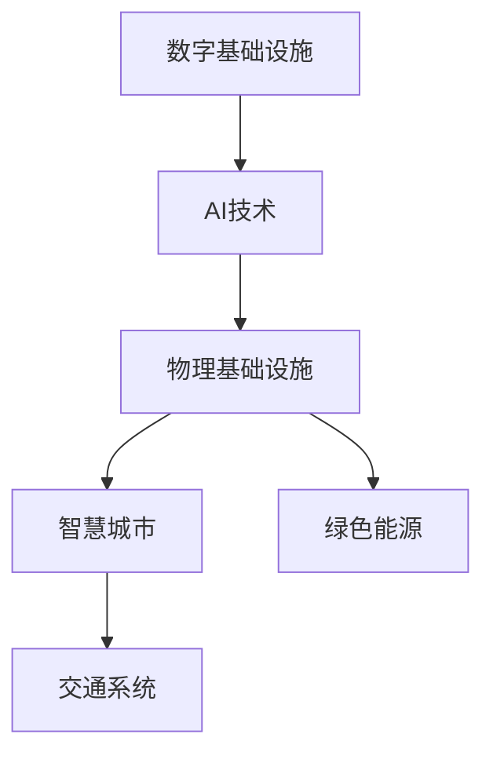
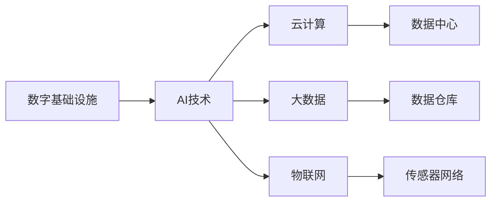
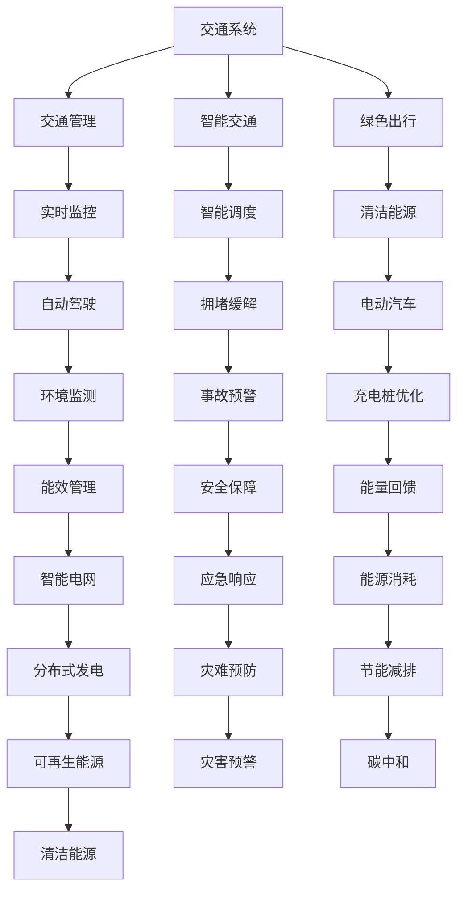

                 

# AI在数字与物理基础设施中的应用

> 关键词：人工智能,数字基础设施,物理基础设施,工业物联网,智慧城市,绿色能源,交通系统

## 1. 背景介绍

### 1.1 问题由来
随着人工智能技术的迅猛发展，AI在各行各业的应用越来越广泛。特别是对于数字与物理基础设施，AI技术已经显现出其强大的推动作用。数字基础设施包括互联网、云计算、大数据、物联网等，而物理基础设施则涵盖了交通、能源、建筑、公共安全等领域。

AI在这些基础设施中的应用，不仅能够提升系统的效率、可靠性和安全性，还能够助力实现智能化转型，推动经济社会的发展。但同时，AI在这些领域的应用也面临着复杂的技术挑战和伦理问题。

### 1.2 问题核心关键点
AI在数字与物理基础设施中的应用，主要关注以下几个关键点：

- **高效性**：如何利用AI技术提升基础设施的运营效率，降低成本。
- **安全性**：如何通过AI技术保障基础设施的安全性，预防事故。
- **智能化**：如何利用AI技术实现基础设施的智能化管理，提升用户体验。
- **可持续性**：如何通过AI技术促进基础设施的绿色转型，实现可持续发展。

这些问题均涉及技术实现和伦理考量，需要在设计之初进行充分考虑。

### 1.3 问题研究意义
AI在数字与物理基础设施中的应用，对于提升国家竞争力、实现社会治理现代化、推动经济转型升级具有重要意义。具体而言：

1. **提升运营效率**：AI可以实时监测基础设施运行状态，预测故障，优化资源配置，实现24小时高效运营。
2. **保障安全性**：AI可以快速识别并响应突发事件，提高应急响应效率，保障基础设施的安全稳定运行。
3. **智能化管理**：AI可以实现数据驱动的决策支持，提供智能化管理方案，提升用户体验。
4. **推动绿色转型**：AI可以优化能源消耗，减少环境污染，助力基础设施的绿色可持续发展。

## 2. 核心概念与联系

### 2.1 核心概念概述

为更好地理解AI在数字与物理基础设施中的应用，本节将介绍几个密切相关的核心概念：

- **人工智能(AI)**：指使用计算机模拟人类智能行为的技术，包括机器学习、深度学习、自然语言处理、计算机视觉等。
- **数字基础设施**：指基于互联网和信息技术构建的基础设施，包括互联网、云计算、大数据、物联网等。
- **物理基础设施**：指基于物理形态和实体设施构建的基础设施，包括交通、能源、建筑、公共安全等领域。
- **工业物联网(IIoT)**：指将物理设备、传感器、控制系统等与互联网深度融合，实现数据采集、传输、存储、处理、分析和应用。
- **智慧城市**：指通过AI和大数据技术，实现城市基础设施的智能化管理，提升城市治理水平。
- **绿色能源**：指通过AI技术优化能源消耗，实现可再生能源的智能化利用，减少环境污染。
- **交通系统**：指利用AI技术提升交通管理和调度效率，实现智能交通。

这些核心概念之间的逻辑关系可以通过以下Mermaid流程图来展示：



这个流程图展示了大语言模型微调过程中各个核心概念之间的关系：

1. 数字基础设施和AI技术紧密结合，实现了数字化和智能化转型。
2. AI技术在物理基础设施中的应用，提升了智慧城市、绿色能源、交通系统的效率和安全性。
3. 智慧城市、绿色能源、交通系统是物理基础设施的具体应用场景，通过AI技术实现了智能化管理和高效运营。

### 2.2 概念间的关系

这些核心概念之间存在着紧密的联系，形成了AI在数字与物理基础设施应用的完整生态系统。下面通过几个Mermaid流程图来展示这些概念之间的关系。

#### 2.2.1 数字基础设施与AI技术的关系



这个流程图展示了大规模数据在数字基础设施中的应用，以及AI技术如何从数据中提取知识：

1. 数字基础设施提供云计算、大数据、物联网等服务，支撑AI技术的发展。
2. 云计算通过大规模计算资源，支持AI模型的训练和推理。
3. 大数据通过海量数据训练AI模型，提升其预测能力和决策水平。
4. 物联网通过传感器网络采集实时数据，为AI提供数据输入。

#### 2.2.2 AI在物理基础设施中的应用场景



这个流程图展示了AI在物理基础设施中的具体应用场景：

1. 交通系统通过AI技术实现了智能交通管理，包括智能交通、绿色出行、实时监控等。
2. 智能交通通过AI技术实现智能调度，缓解交通拥堵，提升运输效率。
3. 绿色出行通过AI技术优化电动汽车的充电桩布局，实现清洁能源的智能化利用。
4. 智能交通和绿色出行通过AI技术提升环境监测，促进能源管理和节能减排。

## 3. 核心算法原理 & 具体操作步骤
### 3.1 算法原理概述

AI在数字与物理基础设施中的应用，涉及多个核心算法，包括深度学习、强化学习、计算机视觉、自然语言处理等。以深度学习为例，其核心原理是通过多层神经网络构建非线性映射关系，从数据中自动提取特征，实现高效的预测和决策。

对于物理基础设施的AI应用，一般采用监督学习和无监督学习相结合的方法。监督学习利用标注数据训练模型，无监督学习则通过数据自发组织模式进行知识发现。此外，半监督学习和迁移学习也是常用的方法，可以进一步提升模型泛化能力。

### 3.2 算法步骤详解

以下是AI在数字与物理基础设施中的典型应用步骤：

**Step 1: 数据准备**
- 收集物理基础设施的数据，包括传感器数据、用户行为数据、交通流量数据等。
- 清洗、处理数据，确保数据的质量和一致性。
- 分割数据集为训练集、验证集和测试集。

**Step 2: 特征工程**
- 选择合适的特征，提取和转换数据，构建输入样本。
- 使用数据增强技术扩充训练数据，提升模型泛化能力。

**Step 3: 模型训练**
- 选择合适的深度学习模型，如CNN、RNN、LSTM、Transformer等。
- 选择合适的优化器（如Adam、SGD）和损失函数（如交叉熵、均方误差）。
- 设置训练参数，如学习率、批大小、迭代轮数等。
- 使用监督学习或无监督学习训练模型。

**Step 4: 模型评估**
- 在验证集上评估模型性能，选择最优模型。
- 使用测试集评估模型泛化能力，确保模型性能稳定。
- 进行超参数调优，进一步提升模型性能。

**Step 5: 模型部署**
- 将训练好的模型部署到生产环境。
- 实现数据实时输入和输出，支持实时决策。
- 对模型进行监控和调优，确保稳定运行。

### 3.3 算法优缺点

AI在数字与物理基础设施中的应用，具有以下优点：

1. **高效性**：通过数据驱动的决策，AI可以实时监控和优化基础设施的运行状态，提升运营效率。
2. **安全性**：AI可以快速识别和响应突发事件，提升应急响应能力，保障基础设施的安全稳定。
3. **智能化管理**：AI可以实现数据驱动的决策支持，提供智能化管理方案，提升用户体验。
4. **可扩展性**：AI模型具有较强的可扩展性，可以轻松扩展到不同的基础设施应用场景。

但同时，AI在数字与物理基础设施中的应用也存在以下缺点：

1. **数据质量依赖**：AI模型的性能高度依赖于数据的质量和数量。数据清洗、标注工作量大，成本高。
2. **技术复杂性高**：AI模型的训练和优化需要高水平的技术支持，难度较大。
3. **伦理和隐私问题**：AI应用可能涉及敏感数据，需要考虑伦理和隐私保护问题。

### 3.4 算法应用领域

AI在数字与物理基础设施中的应用，主要涉及以下几个领域：

- **智慧城市**：通过AI技术实现城市基础设施的智能化管理，提升城市治理水平。
- **绿色能源**：通过AI技术优化能源消耗，实现可再生能源的智能化利用，减少环境污染。
- **交通系统**：通过AI技术提升交通管理和调度效率，实现智能交通。
- **智能制造**：通过AI技术提升生产效率，实现智能化生产管理。
- **公共安全**：通过AI技术提升公共安全监控和应急响应能力。

这些领域是AI在数字与物理基础设施中的典型应用场景，覆盖了交通、能源、建筑、公共安全等多个方面。

## 4. 数学模型和公式 & 详细讲解  
### 4.1 数学模型构建

本节将使用数学语言对AI在数字与物理基础设施中的应用过程进行更加严格的刻画。

假设物理基础设施的数据集为 $D=\{(x_i,y_i)\}_{i=1}^N$，其中 $x_i$ 为输入样本，$y_i$ 为标签。AI模型的目标是通过输入样本 $x_i$ 预测标签 $y_i$。形式化地，AI模型的训练目标为：

$$
\min_{\theta} \frac{1}{N} \sum_{i=1}^N \mathcal{L}(f(x_i,\theta),y_i)
$$

其中 $f(x_i,\theta)$ 为AI模型的预测函数，$\mathcal{L}$ 为损失函数，$\theta$ 为模型参数。

常见的损失函数包括交叉熵损失、均方误差损失等。以交叉熵损失为例，其公式为：

$$
\mathcal{L}(f(x_i,\theta),y_i)=-\frac{1}{N}\sum_{i=1}^N y_i \log f(x_i,\theta) + (1-y_i) \log (1-f(x_i,\theta))
$$

在得到损失函数的梯度后，即可带入模型参数更新公式，完成模型的迭代优化。

### 4.2 公式推导过程

以深度神经网络为例，其预测函数 $f(x_i,\theta)$ 可以表示为：

$$
f(x_i,\theta)=\sigma(\sum_{j=1}^n W_j \phi_j(x_i) + b)
$$

其中 $W_j$ 为权重矩阵，$\phi_j(x_i)$ 为激活函数，$b$ 为偏置项。

根据梯度下降算法，模型参数 $\theta$ 的更新公式为：

$$
\theta \leftarrow \theta - \eta \nabla_{\theta}\mathcal{L}(f(x_i,\theta),y_i)
$$

其中 $\eta$ 为学习率，$\nabla_{\theta}\mathcal{L}(f(x_i,\theta),y_i)$ 为损失函数对模型参数的梯度。

在得到梯度后，将其带入参数更新公式，即可迭代优化模型参数，使得模型预测结果逼近真实标签。重复上述过程直至收敛，最终得到适应特定任务的AI模型。

### 4.3 案例分析与讲解

以智慧城市交通系统的智能调度为例，分析AI模型训练和优化过程。

假设智慧城市交通系统数据集为 $D=\{(x_i,y_i)\}_{i=1}^N$，其中 $x_i$ 为车辆位置和速度，$y_i$ 为目标交通流状态。AI模型的目标是通过输入样本 $x_i$ 预测目标交通流状态 $y_i$。

1. **数据准备**：收集车辆位置、速度、交通流量等数据，清洗数据，确保数据质量。将数据集分割为训练集、验证集和测试集。

2. **特征工程**：选择车辆位置、速度、交通流量等特征，构建输入样本。使用数据增强技术扩充训练数据，提升模型泛化能力。

3. **模型训练**：选择合适的深度学习模型，如CNN、RNN、LSTM等。使用监督学习训练模型，选择交叉熵损失函数。设置训练参数，如学习率、批大小、迭代轮数等。

4. **模型评估**：在验证集上评估模型性能，选择最优模型。使用测试集评估模型泛化能力，确保模型性能稳定。

5. **模型部署**：将训练好的模型部署到生产环境，实现数据实时输入和输出。对模型进行监控和调优，确保稳定运行。

通过上述步骤，智慧城市交通系统的智能调度模型即可实现实时预测和优化，提升交通效率和用户体验。

## 5. 项目实践：代码实例和详细解释说明
### 5.1 开发环境搭建

在进行AI在数字与物理基础设施中的应用实践前，我们需要准备好开发环境。以下是使用Python进行TensorFlow开发的环境配置流程：

1. 安装Anaconda：从官网下载并安装Anaconda，用于创建独立的Python环境。

2. 创建并激活虚拟环境：
```bash
conda create -n tf-env python=3.8 
conda activate tf-env
```

3. 安装TensorFlow：根据CUDA版本，从官网获取对应的安装命令。例如：
```bash
conda install tensorflow tensorflow-gpu -c conda-forge
```

4. 安装各类工具包：
```bash
pip install numpy pandas scikit-learn matplotlib tqdm jupyter notebook ipython
```

完成上述步骤后，即可在`tf-env`环境中开始AI在数字与物理基础设施中的应用实践。

### 5.2 源代码详细实现

以下是使用TensorFlow进行智慧城市交通系统智能调度的代码实现：

```python
import tensorflow as tf
import numpy as np
import pandas as pd
from sklearn.model_selection import train_test_split

# 加载数据集
data = pd.read_csv('traffic_data.csv')

# 数据预处理
X = data[['x', 'y', 'speed']].to_numpy().astype(np.float32)
y = data['state'].to_numpy().astype(np.int32)

# 数据分割
X_train, X_test, y_train, y_test = train_test_split(X, y, test_size=0.2, random_state=42)

# 定义模型
model = tf.keras.models.Sequential([
    tf.keras.layers.Dense(64, activation='relu'),
    tf.keras.layers.Dense(32, activation='relu'),
    tf.keras.layers.Dense(1, activation='sigmoid')
])

# 定义损失函数和优化器
loss_fn = tf.keras.losses.BinaryCrossentropy()
optimizer = tf.keras.optimizers.Adam(learning_rate=0.001)

# 训练模型
model.compile(optimizer=optimizer, loss=loss_fn, metrics=['accuracy'])
model.fit(X_train, y_train, epochs=50, batch_size=32, validation_data=(X_test, y_test))

# 评估模型
test_loss, test_acc = model.evaluate(X_test, y_test)
print('Test accuracy:', test_acc)
```

### 5.3 代码解读与分析

让我们再详细解读一下关键代码的实现细节：

**数据加载和预处理**：
- 使用Pandas加载交通数据集，并进行数据清洗和预处理。
- 使用NumPy将数据转换为NumPy数组，并标准化数据，确保模型稳定收敛。

**模型定义**：
- 定义一个简单的多层神经网络模型，包含两个全连接层和一个输出层。

**损失函数和优化器**：
- 选择合适的损失函数和优化器，如二元交叉熵损失和Adam优化器。

**模型训练和评估**：
- 使用TensorFlow编译模型，指定损失函数和优化器。
- 训练模型，并使用验证集评估模型性能。
- 在测试集上评估模型泛化能力，并输出测试准确率。

通过上述代码，我们可以快速实现智慧城市交通系统的智能调度模型。可以看到，TensorFlow提供了强大的框架支持和灵活的API，使得模型训练和优化变得简单高效。

## 6. 实际应用场景

### 6.1 智慧城市

智慧城市是AI在数字与物理基础设施中应用的重要场景。通过AI技术，智慧城市可以实现基础设施的智能化管理，提升城市治理水平。具体应用包括：

- **智能交通管理**：通过AI技术优化交通流量，提升交通效率，减少交通拥堵。
- **智能照明**：通过AI技术优化路灯开关，降低能源消耗，实现节能减排。
- **智能垃圾处理**：通过AI技术优化垃圾分类和回收，提升垃圾处理效率。
- **智能公共服务**：通过AI技术优化城市公共服务，提升市民满意度。

以智能交通为例，通过AI技术可以实现实时交通监控和预测，优化交通信号灯控制，提升道路通行效率。此外，AI技术还可以应用于智能停车管理、智能公交调度等场景，提升城市的智能化水平。

### 6.2 绿色能源

绿色能源是AI在数字与物理基础设施中应用的另一个重要领域。通过AI技术，可以实现可再生能源的智能化利用，减少环境污染。具体应用包括：

- **智能电网**：通过AI技术优化电网运行，提升能源效率，减少能源浪费。
- **智能储能系统**：通过AI技术优化储能系统运行，提升能源利用率，实现能量平衡。
- **智能建筑**：通过AI技术优化建筑能源管理，提升能源利用效率，减少碳排放。

以智能电网为例，通过AI技术可以实现实时能源监测和预测，优化电网运行，提升能源效率。此外，AI技术还可以应用于智能建筑、智能储能等场景，实现能源的智能化管理，促进绿色转型。

### 6.3 交通系统

交通系统是AI在数字与物理基础设施中应用的重要场景。通过AI技术，可以实现交通管理和调度的智能化，提升交通效率和安全性。具体应用包括：

- **智能交通管理**：通过AI技术优化交通流量，提升交通效率，减少交通拥堵。
- **智能交通导航**：通过AI技术优化交通导航，提升出行效率。
- **智能车辆管理**：通过AI技术优化车辆调度，提升运输效率。
- **智能交通监测**：通过AI技术实时监测交通状态，提升应急响应能力。

以智能交通管理为例，通过AI技术可以实现实时交通监控和预测，优化交通信号灯控制，提升道路通行效率。此外，AI技术还可以应用于智能公交调度、智能停车管理等场景，提升交通的智能化水平。

### 6.4 未来应用展望

展望未来，AI在数字与物理基础设施中的应用将呈现以下几个发展趋势：

1. **智能化水平提升**：随着AI技术的不断进步，智慧城市、绿色能源、交通系统的智能化水平将进一步提升，实现更加精准的决策支持。
2. **跨领域融合**：AI技术将与其他技术进行更深度的融合，如物联网、区块链、边缘计算等，实现跨领域协同创新。
3. **人机协同**：AI技术与人类将更加紧密地协同工作，实现人机共治，提升系统安全性和可靠性。
4. **伦理和隐私保护**：随着AI技术的广泛应用，伦理和隐私保护将受到更多的关注，需要通过法规和技术手段确保数据安全和个人隐私。
5. **可持续发展**：AI技术将在绿色能源、智能建筑等领域发挥重要作用，推动基础设施的绿色转型和可持续发展。

这些趋势将推动AI在数字与物理基础设施中的应用向更深层次发展，为社会经济转型和智能化治理提供强大支撑。

## 7. 工具和资源推荐
### 7.1 学习资源推荐

为了帮助开发者系统掌握AI在数字与物理基础设施中的应用技术，这里推荐一些优质的学习资源：

1. **《深度学习》课程**：斯坦福大学开设的深度学习课程，涵盖深度学习原理、模型构建、优化算法等内容，适合初学者系统学习。

2. **《Python深度学习》书籍**：由Francois Chollet著，介绍了TensorFlow和Keras框架的使用，适合实战开发。

3. **《智慧城市技术与应用》书籍**：介绍了智慧城市的技术架构、应用场景和实施方法，适合项目开发和规划。

4. **Google AI开放平台**：提供丰富的AI资源，包括模型、代码、文档等，方便开发者快速上手。

5. **Kaggle竞赛平台**：提供大量数据集和竞赛任务，可以参与AI技术实践，积累经验。

通过对这些资源的学习实践，相信你一定能够快速掌握AI在数字与物理基础设施中的应用技术，并用于解决实际的业务问题。

### 7.2 开发工具推荐

高效的开发离不开优秀的工具支持。以下是几款用于AI在数字与物理基础设施中的应用开发的常用工具：

1. **TensorFlow**：由Google主导开发的深度学习框架，支持分布式计算，适合大规模模型训练和推理。

2. **PyTorch**：Facebook开发的深度学习框架，灵活易用，适合快速迭代开发。

3. **Jupyter Notebook**：基于Web的交互式编程环境，方便开发和分享。

4. **Google Colab**：谷歌提供的免费云平台，提供GPU/TPU算力，方便开发者快速实验。

5. **TensorBoard**：TensorFlow配套的可视化工具，可实时监测模型训练状态，提供丰富的图表呈现方式。

合理利用这些工具，可以显著提升AI在数字与物理基础设施中的开发效率，加快创新迭代的步伐。

### 7.3 相关论文推荐

AI在数字与物理基础设施中的应用，需要大量理论与实践的支撑。以下是几篇奠基性的相关论文，推荐阅读：

1. **《深度学习》教材**：由Goodfellow等人著，全面介绍了深度学习的基本原理和应用。

2. **《智能交通系统》论文**：介绍了智能交通系统的原理和应用，适合AI在交通系统中的应用研究。

3. **《智慧城市架构与设计》论文**：介绍了智慧城市的架构设计，适合智慧城市的研究和实践。

4. **《绿色能源与智能电网》论文**：介绍了绿色能源和智能电网的技术应用，适合AI在绿色能源中的应用研究。

这些论文代表了大语言模型微调技术的发展脉络。通过学习这些前沿成果，可以帮助研究者把握学科前进方向，激发更多的创新灵感。

除上述资源外，还有一些值得关注的前沿资源，帮助开发者紧跟AI在数字与物理基础设施中的应用技术的最新进展，例如：

1. **arXiv论文预印本**：人工智能领域最新研究成果的发布平台，包括大量尚未发表的前沿工作，学习前沿技术的必读资源。

2. **谷歌学术**：谷歌提供的学术论文搜索工具，方便查询和下载相关论文。

3. **GitHub热门项目**：在GitHub上Star、Fork数最多的AI项目，往往代表了该技术领域的发展趋势和最佳实践，值得去学习和贡献。

4. **NIPS、ICML等会议**：顶级人工智能会议，发布最新研究进展和前沿技术。

5. **AI竞赛平台**：如Kaggle、AI Challenger等，提供数据集和竞赛任务，可以参与AI技术实践，积累经验。

总之，对于AI在数字与物理基础设施中的应用技术的探索和实践，需要开发者保持开放的心态和持续学习的意愿。多关注前沿资讯，多动手实践，多思考总结，必将收获满满的成长收益。

## 8. 总结：未来发展趋势与挑战

### 8.1 总结

本文对AI在数字与物理基础设施中的应用进行了全面系统的介绍。首先阐述了AI在数字与物理基础设施中的应用背景和意义，明确了其对提升运营效率、保障安全、智能化管理、推动绿色转型等方面的重要作用。其次，从原理到实践，详细讲解了AI在数字与物理基础设施中的应用步骤，给出了AI在智慧城市、绿色能源、交通系统等领域的典型案例。

通过本文的系统梳理，可以看到，AI在数字与物理基础设施中的应用已经取得了显著进展，未来将展现出更广阔的前景。

### 8.2 未来发展趋势

展望未来，AI在数字与物理基础设施中的应用将呈现以下几个发展趋势：

1. **智能化水平提升**：随着AI技术的不断进步，智慧城市、绿色能源、交通系统的智能化水平将进一步提升，实现更加精准的决策支持。
2. **跨领域融合**：AI技术将与其他技术进行更深度的融合，如物联网、区块链、边缘计算等，实现跨领域协同创新。
3. **人机协同**：AI技术与人类将更加紧密地协同工作，实现人机共治，提升系统安全性和可靠性。
4. **伦理和隐私保护**：随着AI技术的广泛应用，伦理和隐私保护将受到更多的关注，需要通过法规和技术手段确保数据安全和个人隐私。
5. **可持续发展**：AI技术将在绿色能源、智能建筑等领域发挥重要作用，推动基础设施的绿色转型和可持续发展。

这些趋势将推动AI在数字与物理基础设施中的应用向更深层次发展，为社会经济转型和智能化治理提供强大支撑。

### 8.3 面临的挑战

尽管AI在数字与物理基础设施中的应用已经取得了显著进展，但在迈向更加智能化、普适化应用的过程中，它仍面临着诸多挑战：

1. **数据质量瓶颈**：AI模型的性能高度依赖于数据的质量和数量。数据清洗、标注工作量大，成本高。
2. **技术复杂性高**：AI模型的训练和优化需要高水平的技术支持，难度较大。
3. **伦理和隐私问题**：

