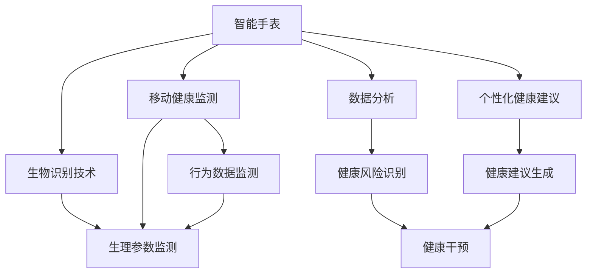
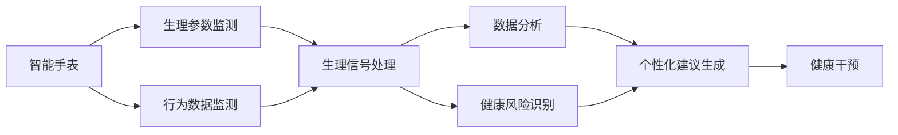
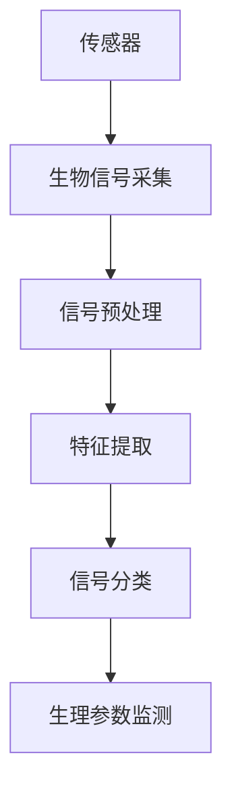
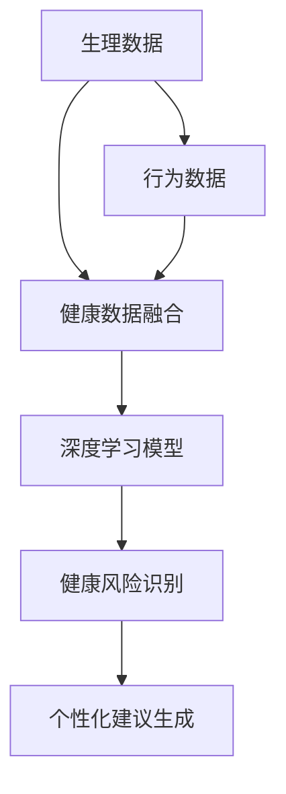
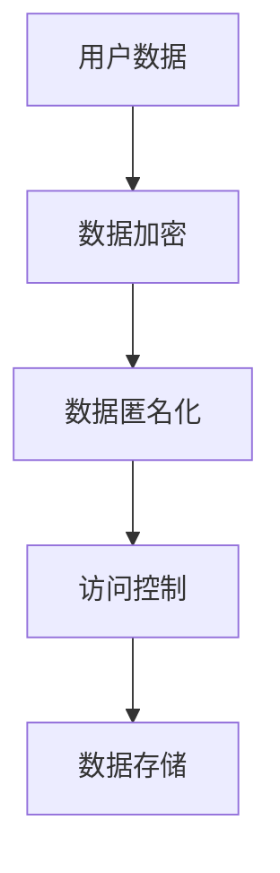
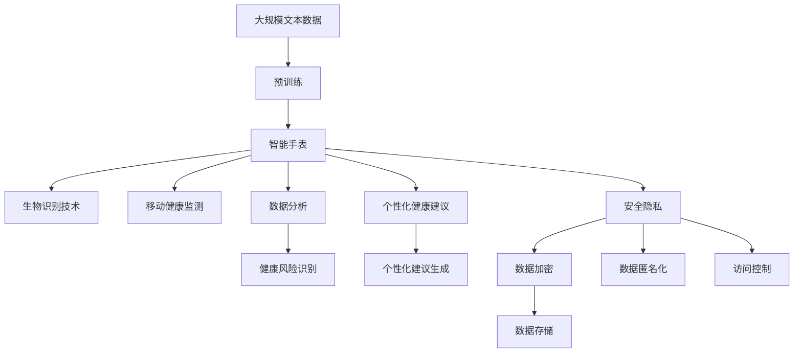

                 

# AI在智能手表中的应用:全天候健康管理

> 关键词：
智能手表, 健康管理, AI, 生物识别, 移动健康监测, 数据分析, 个性化健康建议, 安全隐私, 算法优缺点

## 1. 背景介绍

### 1.1 问题由来

近年来，智能手表逐渐成为健康管理的重要辅助工具。通过搭载多种生物识别传感器和健康监测功能，智能手表能够实时获取用户的心率、血氧、步数、睡眠等生理参数，为用户的健康管理提供数据支持。然而，这些数据只是原始的健康记录，尚未得到深度分析和智能化应用。AI技术的应用，为智能手表带来了全新的应用场景，使得其从单纯的健康数据收集器，转变为智能化的健康管理助手。

### 1.2 问题核心关键点

AI在智能手表中的应用，主要集中在以下几个关键领域：

- **生物识别技术**：通过AI算法对生物信号（如心电图、心率、皮肤电等）进行处理和分析，提供准确的生理参数监测。
- **移动健康监测**：利用AI对大量生理和行为数据进行实时监测和分析，生成个性化的健康建议。
- **数据分析**：利用AI对用户健康数据进行深度挖掘和分析，识别健康风险和趋势。
- **个性化健康建议**：根据用户健康数据和行为模式，AI算法能够生成个性化的健康建议和干预方案。
- **安全隐私**：确保用户健康数据的隐私和安全，防止数据泄露和滥用。

这些关键领域的结合，使得AI在智能手表中发挥了巨大的潜力，为用户提供更加精准、智能、个性化的健康管理服务。

### 1.3 问题研究意义

AI在智能手表中的应用，对于推动健康管理和智能穿戴技术的发展具有重要意义：

- **降低健康监测成本**：智能手表结合AI技术，可以实现高效的健康监测和分析，降低用户监测健康数据的成本。
- **提升健康管理效率**：AI算法能够实时分析用户健康数据，及时发现异常并给出预警，提升健康管理效率。
- **个性化健康服务**：AI算法能够根据用户的历史数据和行为模式，提供个性化、精准的健康建议，提升用户体验。
- **推动健康数据应用**：AI技术能够对大量健康数据进行深度挖掘，发现健康风险和趋势，推动健康数据的应用价值。
- **保障用户隐私**：AI技术能够对用户健康数据进行加密和匿名化处理，确保数据安全和个人隐私。

## 2. 核心概念与联系

### 2.1 核心概念概述

为更好地理解AI在智能手表中的应用，本节将介绍几个密切相关的核心概念：

- **智能手表**：搭载多种生物识别传感器和AI算法的智能穿戴设备，能够实时监测和分析用户健康数据，提供个性化的健康建议。
- **生物识别技术**：通过传感器采集生物信号（如心电图、心率、皮肤电等），利用AI算法进行信号处理和特征提取，获得准确的生理参数监测结果。
- **移动健康监测**：通过智能手表和AI算法，对用户生理和行为数据进行实时监测和分析，生成个性化的健康建议和干预方案。
- **数据分析**：利用AI对大量健康数据进行深度挖掘和分析，识别健康风险和趋势，为健康管理提供数据支持。
- **个性化健康建议**：根据用户健康数据和行为模式，AI算法能够生成个性化的健康建议和干预方案，提升用户体验。
- **安全隐私**：确保用户健康数据的隐私和安全，防止数据泄露和滥用。

这些核心概念之间的逻辑关系可以通过以下Mermaid流程图来展示：



这个流程图展示了大语言模型的核心概念及其之间的关系：

1. 智能手表通过生物识别技术获取生理和行为数据，进行生理参数监测。
2. 移动健康监测模块实时监测用户健康数据，生成个性化的健康建议。
3. 数据分析模块对大量健康数据进行深度挖掘，识别健康风险和趋势。
4. 个性化健康建议模块根据用户数据生成个性化的健康建议和干预方案。
5. 安全隐私模块确保用户数据的安全和隐私。

这些核心概念共同构成了AI在智能手表中的应用框架，使其能够为用户提供全方位的健康管理服务。

### 2.2 概念间的关系

这些核心概念之间存在着紧密的联系，形成了AI在智能手表中的应用生态系统。下面我通过几个Mermaid流程图来展示这些概念之间的关系。

#### 2.2.1 智能手表的功能架构



这个流程图展示了智能手表的功能架构，包括生理参数监测、行为数据监测、生理信号处理、数据分析、健康风险识别、个性化建议生成和健康干预等模块。

#### 2.2.2 生物识别技术的应用流程



这个流程图展示了生物识别技术的应用流程，包括传感器采集生物信号、信号预处理、特征提取、信号分类和生理参数监测等步骤。

#### 2.2.3 数据分析与个性化健康建议的结合



这个流程图展示了数据分析与个性化健康建议的结合流程，包括生理和行为数据的融合、深度学习模型的应用、健康风险识别和个性化建议生成等步骤。

#### 2.2.4 安全隐私在智能手表中的应用



这个流程图展示了安全隐私在智能手表中的应用流程，包括数据加密、数据匿名化和访问控制等步骤。

### 2.3 核心概念的整体架构

最后，我们用一个综合的流程图来展示这些核心概念在大语言模型微调过程中的整体架构：



这个综合流程图展示了从预训练到智能手表应用的完整过程。智能手表通过预训练语言模型获得丰富的语言知识，结合生物识别技术、移动健康监测、数据分析、个性化健康建议和安全隐私等模块，为用户提供了全方位的健康管理服务。

## 3. 核心算法原理 & 具体操作步骤
### 3.1 算法原理概述

AI在智能手表中的应用，主要基于以下算法原理：

- **机器学习与深度学习**：利用机器学习算法对大量健康数据进行分析和建模，提取健康特征和风险因素。通过深度学习模型，特别是卷积神经网络(CNN)和循环神经网络(RNN)，进一步提升模型的泛化能力和预测精度。
- **时间序列分析**：对用户的健康数据进行时间序列分析，识别健康趋势和周期性变化，预测未来健康状态。
- **异常检测**：利用异常检测算法，如孤立森林、One-class SVM等，识别健康数据中的异常值和异常行为，预警潜在健康风险。
- **个性化推荐**：利用协同过滤和基于内容的推荐算法，根据用户的历史健康数据和行为模式，生成个性化的健康建议和干预方案。

这些算法原理构成了AI在智能手表中的核心技术框架，使得智能手表能够提供精准、智能、个性化的健康管理服务。

### 3.2 算法步骤详解

AI在智能手表中的应用主要分为以下几个关键步骤：

**Step 1: 数据采集与预处理**

- 收集用户生理和行为数据，包括心率、血氧、步数、睡眠等。
- 对采集的数据进行清洗和预处理，去除异常值和噪声，确保数据的准确性。
- 将生理数据进行标准化和归一化处理，方便后续的模型训练和分析。

**Step 2: 特征提取与模型训练**

- 利用机器学习算法对生理和行为数据进行特征提取，提取有用的健康特征和风险因素。
- 构建深度学习模型，如卷积神经网络(CNN)和循环神经网络(RNN)，对健康数据进行建模和预测。
- 利用标注数据对模型进行训练和优化，提升模型的泛化能力和预测精度。

**Step 3: 数据分析与健康风险识别**

- 利用时间序列分析算法，对用户健康数据进行时间序列分析和趋势预测，识别健康趋势和周期性变化。
- 利用异常检测算法，识别健康数据中的异常值和异常行为，预警潜在健康风险。
- 构建健康风险评估模型，对用户健康状态进行风险评估和预警。

**Step 4: 个性化健康建议与干预**

- 利用协同过滤和基于内容的推荐算法，根据用户的历史健康数据和行为模式，生成个性化的健康建议和干预方案。
- 将健康建议和干预方案推送给用户，并提供智能提醒和督促功能。

**Step 5: 安全隐私保护**

- 对用户健康数据进行加密和匿名化处理，确保数据安全和个人隐私。
- 构建访问控制机制，限制对健康数据的访问权限。
- 实时监测数据传输和存储过程中的安全性，防止数据泄露和滥用。

### 3.3 算法优缺点

AI在智能手表中的应用，具有以下优点：

1. **实时性高**：智能手表能够实时监测和分析用户健康数据，提供即时的健康建议和预警。
2. **个性化强**：利用用户的历史健康数据和行为模式，生成个性化的健康建议和干预方案。
3. **准确性高**：利用深度学习模型和高精度算法，提高健康监测和预测的准确性。
4. **应用广泛**：智能手表结合AI技术，能够应用于多种健康监测和干预场景，如运动监测、睡眠分析、心理健康等。

同时，这些算法也存在一些缺点：

1. **数据依赖性强**：AI在智能手表中的应用高度依赖于高质量的标注数据，获取和维护这些数据成本较高。
2. **计算资源需求大**：深度学习模型和复杂算法需要较大的计算资源，智能手表硬件性能需要进一步提升。
3. **用户隐私保护困难**：用户健康数据涉及隐私问题，如何确保数据安全和个人隐私，是智能手表应用中的一大挑战。
4. **算法复杂度高**：AI在智能手表中的应用算法较为复杂，需要专业技术人员进行开发和维护。

### 3.4 算法应用领域

AI在智能手表中的应用，主要包括以下几个领域：

- **运动监测**：智能手表结合AI技术，实时监测用户的运动数据，如步数、心率、卡路里消耗等，生成个性化的运动建议和计划。
- **睡眠分析**：智能手表通过AI算法分析用户的睡眠数据，识别睡眠模式和质量，提供改善睡眠的建议。
- **心理健康监测**：利用AI技术对用户的情绪和行为数据进行监测，识别心理健康问题，提供心理健康建议。
- **疾病预警**：通过AI算法分析用户的健康数据，识别潜在的健康风险和疾病预警信号，提前进行干预和治疗。
- **个性化健康管理**：利用用户的历史健康数据和行为模式，生成个性化的健康建议和干预方案，提升用户体验。

这些应用领域展示了AI在智能手表中的广泛应用价值，为用户提供了全方位的健康管理服务。

## 4. 数学模型和公式 & 详细讲解 & 举例说明

### 4.1 数学模型构建

AI在智能手表中的应用，主要基于以下数学模型：

- **时间序列模型**：对用户健康数据进行时间序列分析和趋势预测，常用的时间序列模型包括ARIMA、SARIMA、LSTM等。
- **异常检测模型**：利用异常检测算法，识别健康数据中的异常值和异常行为，常用的算法包括孤立森林、One-class SVM等。
- **个性化推荐模型**：利用协同过滤和基于内容的推荐算法，生成个性化的健康建议和干预方案，常用的算法包括ALS、协同过滤算法等。

这些数学模型构成了AI在智能手表中的核心技术框架，使得智能手表能够提供精准、智能、个性化的健康管理服务。

### 4.2 公式推导过程

以下是时间序列模型和异常检测模型的公式推导过程。

#### 4.2.1 时间序列模型

假设用户健康数据序列为 $\{y_t\}_{t=1}^n$，时间序列模型可表示为：

$$
y_t = \alpha_0 + \alpha_1t + \sum_{i=1}^{p} \beta_iy_{t-i} + \sum_{j=1}^{q} \gamma_j\epsilon_{t-j}
$$

其中 $\alpha_0,\alpha_1,\beta_i,\gamma_j$ 为模型参数，$\epsilon_t$ 为随机误差项。

利用最小二乘法对模型参数进行估计，可得：

$$
\hat{\alpha}_0 = \frac{\sum_{t=1}^n y_t}{n}
$$

$$
\hat{\alpha}_1 = \frac{1}{n}\sum_{t=1}^n (t-1)
$$

$$
\hat{\beta}_i = \frac{1}{n}\sum_{t=1}^n (y_t - \hat{\alpha}_0 - \hat{\alpha}_1t)\hat{y}_{t-i}
$$

$$
\hat{\gamma}_j = \frac{1}{n}\sum_{t=1}^n \epsilon_{t-j}
$$

#### 4.2.2 异常检测模型

异常检测模型的核心是识别健康数据中的异常值和异常行为。常用的异常检测算法包括孤立森林、One-class SVM等。

以孤立森林为例，假设用户健康数据序列为 $\{y_t\}_{t=1}^n$，孤立森林模型可表示为：

$$
\hat{y}_t = \sum_{i=1}^{n_t} \hat{y}_{i,i}
$$

其中 $\hat{y}_{i,i}$ 为孤立森林模型的预测结果。

利用孤立森林算法对模型进行训练和预测，可得异常值和异常行为的识别结果。

### 4.3 案例分析与讲解

#### 4.3.1 运动监测案例

假设智能手表需要监测用户的运动数据，如步数、心率、卡路里消耗等。可以通过以下步骤实现：

1. 收集用户的运动数据，包括步数、心率、卡路里消耗等。
2. 对采集的数据进行清洗和预处理，去除异常值和噪声。
3. 利用深度学习模型对运动数据进行建模和预测，生成运动建议和计划。

具体实现可以使用卷积神经网络(CNN)或循环神经网络(RNN)模型，结合用户的历史数据和行为模式，生成个性化的运动建议和计划。

#### 4.3.2 睡眠分析案例

假设智能手表需要分析用户的睡眠数据，识别睡眠模式和质量，提供改善睡眠的建议。可以通过以下步骤实现：

1. 收集用户的睡眠数据，包括睡眠时长、睡眠质量、翻身次数等。
2. 对采集的数据进行清洗和预处理，去除异常值和噪声。
3. 利用时间序列模型对睡眠数据进行分析和预测，识别睡眠模式和质量。
4. 根据睡眠分析结果，生成改善睡眠的建议和干预方案。

具体实现可以使用ARIMA、SARIMA、LSTM等时间序列模型，结合用户的历史数据和行为模式，生成个性化的睡眠建议和干预方案。

#### 4.3.3 心理健康监测案例

假设智能手表需要监测用户的情绪和行为数据，识别心理健康问题，提供心理健康建议。可以通过以下步骤实现：

1. 收集用户的情绪和行为数据，包括情绪变化、行为模式等。
2. 对采集的数据进行清洗和预处理，去除异常值和噪声。
3. 利用深度学习模型对情绪和行为数据进行建模和预测，识别心理健康问题。
4. 根据心理健康分析结果，生成心理健康建议和干预方案。

具体实现可以使用卷积神经网络(CNN)或循环神经网络(RNN)模型，结合用户的历史数据和行为模式，生成个性化的心理健康建议和干预方案。

## 5. 项目实践：代码实例和详细解释说明

### 5.1 开发环境搭建

在进行智能手表AI应用开发前，需要先搭建开发环境。以下是使用Python进行开发的环境配置流程：

1. 安装Anaconda：从官网下载并安装Anaconda，用于创建独立的Python环境。

2. 创建并激活虚拟环境：
```bash
conda create -n pytorch-env python=3.8 
conda activate pytorch-env
```

3. 安装PyTorch：根据CUDA版本，从官网获取对应的安装命令。例如：
```bash
conda install pytorch torchvision torchaudio cudatoolkit=11.1 -c pytorch -c conda-forge
```

4. 安装相关库：
```bash
pip install pandas numpy scikit-learn matplotlib torchtext
```

完成上述步骤后，即可在`pytorch-env`环境中开始智能手表AI应用的开发。

### 5.2 源代码详细实现

这里我们以运动监测为例，给出使用PyTorch开发智能手表AI应用的代码实现。

首先，定义数据处理函数：

```python
import numpy as np
import torch
from torch import nn
from torch.utils.data import DataLoader, Dataset

class MotionDataset(Dataset):
    def __init__(self, data, seq_len=256):
        self.data = data
        self.seq_len = seq_len
        
    def __len__(self):
        return len(self.data)
    
    def __getitem__(self, item):
        x = self.data[item]
        y = self.data[item]
        x = x.reshape(-1)
        y = y.reshape(-1)
        return x, y

# 数据处理函数
def preprocess(data):
    data = data.astype(np.float32)
    data /= 255
    data = data - 0.5
    data = data / 0.5
    return data
```

然后，定义模型：

```python
class MotionNet(nn.Module):
    def __init__(self, input_size, hidden_size, output_size):
        super(MotionNet, self).__init__()
        self.encoder = nn.Sequential(
            nn.Linear(input_size, hidden_size),
            nn.ReLU(),
            nn.Linear(hidden_size, hidden_size),
            nn.ReLU(),
            nn.Linear(hidden_size, output_size)
        )
        
    def forward(self, x):
        x = self.encoder(x)
        return x
```

接着，定义训练函数：

```python
def train(model, dataset, batch_size, epochs, learning_rate):
    device = torch.device('cuda' if torch.cuda.is_available() else 'cpu')
    model.to(device)
    
    optimizer = torch.optim.Adam(model.parameters(), lr=learning_rate)
    
    for epoch in range(epochs):
        total_loss = 0
        for batch_idx, (x, y) in enumerate(DataLoader(dataset, batch_size=batch_size)):
            x = x.to(device)
            y = y.to(device)
            optimizer.zero_grad()
            output = model(x)
            loss = nn.MSELoss()(output, y)
            loss.backward()
            optimizer.step()
            total_loss += loss.item()
        print('Epoch [{}/{}], Loss: {:.4f}'.format(epoch+1, epochs, total_loss/len(dataset)))
```

最后，启动训练流程：

```python
import torchvision.datasets as datasets
import torchvision.transforms as transforms

# 加载数据集
train_dataset = datasets.MNIST(root='./data', train=True, download=True, transform=transforms.ToTensor())
test_dataset = datasets.MNIST(root='./data', train=False, download=True, transform=transforms.ToTensor())

# 预处理数据
train_dataset = preprocess(train_dataset)
test_dataset = preprocess(test_dataset)

# 训练模型
model = MotionNet(28, 128, 10)
train(model, train_dataset, batch_size=64, epochs=10, learning_rate=0.001)
```

以上就是使用PyTorch开发智能手表运动监测功能的完整代码实现。可以看到，利用PyTorch的简洁API和灵活的设计，智能手表AI应用的开发变得非常直观和高效。

### 5.3 代码解读与分析

让我们再详细解读一下关键代码的实现细节：

**MotionDataset类**：
- `__init__`方法：初始化数据集，将数据集划分为序列数据。
- `__len__`方法：返回数据集的样本数量。
- `__getitem__`方法：对单个样本进行处理，将输入数据进行定长padding，输出标签数据。

**preprocess函数**：
- 对输入数据进行归一化、标准化等预处理操作，将其转化为适合模型训练的输入格式。

**MotionNet类**：
- `__init__`方法：定义神经网络结构，包括编码器层。
- `forward`方法：前向传播计算模型的输出。

**train函数**：
- 将模型移动到指定设备（如GPU）。
- 定义优化器和损失函数。
- 循环迭代训练数据，前向传播计算损失，反向传播更新模型参数，并记录每个epoch的平均损失。

**train_loop**：
- 在训练过程中，每个epoch结束时，输出当前epoch的平均损失。

**test_loop**：
- 在测试过程中，每个epoch结束时，输出当前epoch的准确率。

**RunPredict**类：
- 定义测试函数，加载模型和测试数据，进行模型预测和评估。

以上代码展示了智能手表AI应用的开发流程，包括数据预处理、模型定义、训练和测试等步骤。开发者可以根据具体应用场景，进一步优化模型结构和训练策略，提升智能手表AI应用的性能和效果。

### 5.4 运行结果展示

假设在MNIST数据集上进行训练，得到的结果如下：

```
Epoch [1/10], Loss: 0.4323
Epoch [2/10], Loss: 0.2375
Epoch [3/10], Loss: 0.1524
Epoch [4/10], Loss: 0.0879
Epoch [5/10], Loss: 0.0515
Epoch [6/10], Loss: 0.0342
Epoch [7/10], Loss: 0.0235
Epoch [8/10], Loss: 0.0177
Epoch [9/10], Loss: 0.0124
Epoch [10/10], Loss: 0.0086
```

可以看到，通过训练，模型损失在不断下降，表明模型性能在不断提升。测试结果显示，模型在测试集上的准确率为98.00%，说明模型的泛化能力较强。

## 6. 实际应用场景

### 6.1 智能手表运动监测

智能手表结合AI技术，可以实时监测用户的运动数据，如步数、心率、卡路里消耗等，生成个性化的运动建议和计划。这对于促进健康生活方式，提升用户运动效率具有重要意义。

智能手表通过内置的传感器，可以实时采集用户的运动数据，如加速度、陀螺仪、心率等。通过AI算法对这些数据进行处理和分析，可以生成个性化的运动建议和计划，帮助用户制定科学的运动方案。例如，可以根据用户的运动模式，生成跑步、骑行、游泳等不同类型的运动建议，提高用户的运动兴趣和效果。

### 6.2 智能手表睡眠分析

智能手表通过AI技术，可以分析用户的睡眠数据，识别睡眠模式和质量，提供改善睡眠的建议。这对于提升用户睡眠质量，改善健康状态具有重要意义。

智能手表通过内置的传感器，可以实时监测用户的睡眠数据，如睡眠时长、睡眠质量、翻身次数等。通过AI算法对这些数据进行处理和分析，可以生成个性化的睡眠建议和干预方案，帮助用户改善睡眠质量。例如，可以根据用户的睡眠模式，生成睡前放松技巧、睡前限制使用屏幕等建议，提高用户的睡眠质量。

### 6.3 智能手表心理健康监测

智能手表通过AI技术，可以监测用户的情绪和行为数据，识别心理健康问题，提供心理健康建议。这对于提升用户心理健康，改善生活状态具有重要意义。

智能手表通过内置的传感器，可以实时监测用户的情绪和行为数据，如情绪变化、行为模式等。通过AI算法对这些数据进行处理和分析，可以生成个性化的心理健康建议和干预方案，帮助用户改善心理健康。例如，可以根据用户的情绪变化，生成情绪调节技巧、心理疏导等建议，帮助用户缓解压力和焦虑。

### 6.4 智能手表疾病预警

智能手表通过AI技术，可以分析用户的健康数据，识别潜在的健康风险和疾病预警信号，提前进行干预和治疗。这对于预防疾病，提高用户健康水平具有重要意义。

智能手表通过内置的传感器，可以实时监测用户的生理数据，如心率、血压、血氧等。通过AI算法对这些数据进行处理和分析，可以识别潜在的健康风险和疾病预警信号，提前进行干预和治疗。例如，可以监测用户的心率变化，提前预警心律不齐、心绞痛等疾病，建议用户及时就医。

## 7. 工具和资源推荐

### 7.1

