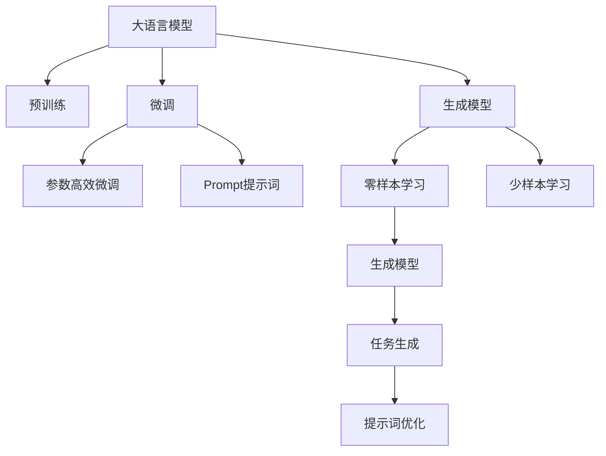
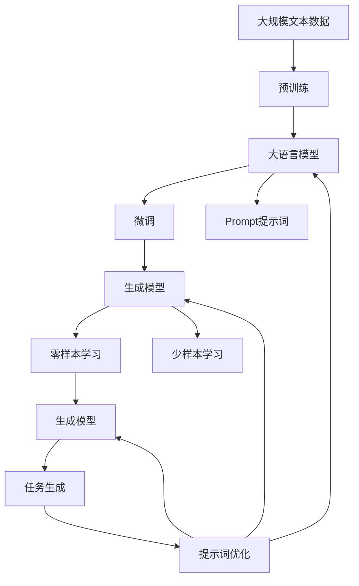

                 

# AI大模型Prompt提示词最佳实践：根据提供的开头部分完成文本

> 关键词：
- 大模型
- Prompt提示词
- 自然语言处理(NLP)
- 文本生成
- 模型微调
- 语言模型
- 预训练

## 1. 背景介绍

随着大语言模型的快速发展，其在自然语言处理(NLP)领域的应用越来越广泛，从文本生成到聊天机器人，从情感分析到机器翻译，大模型已经成为推动NLP技术进步的重要工具。然而，在使用大模型时，如何设计和选择提示词(Prompt)，以获得最佳的生成效果，成为一项重要的研究课题。提示词是一种在模型输入中附加的文本，用于引导模型生成特定的输出，其选择直接影响模型的生成质量和效率。

### 1.1 提示词的起源与发展

提示词最早起源于AI的早期研究中，作为一种优化模型输出的手段，提示词逐渐成为深度学习模型中不可或缺的一部分。在NLP领域，提示词的应用更是广为人知，如GPT-3等大模型的成功很大程度上依赖于精心设计的提示词。提示词的应用，不仅能够提升模型的生成质量，还能够降低对标注数据的依赖，实现更加灵活和高效的文本生成。

### 1.2 提示词的重要性

提示词在大模型中的应用，不仅能够提高模型的生成效果，还能够优化模型的参数利用率。通过合理的提示词设计，可以在不增加模型参数量的情况下，提升模型的生成能力和效率，实现更加高效和可控的文本生成。同时，提示词还能够帮助模型更好地理解任务背景和目标，减少生成噪音，提高生成的流畅度和逻辑性。

## 2. 核心概念与联系

### 2.1 核心概念概述

提示词在大模型的应用中扮演着重要角色。为了更好地理解其原理和应用，本节将介绍几个关键概念：

- 大语言模型：以自回归或自编码模型为代表的大规模预训练语言模型，如GPT、BERT等，通过在大规模无标签文本语料上进行预训练，学习到丰富的语言知识和常识。

- 预训练：指在大规模无标签文本语料上，通过自监督学习任务训练通用语言模型的过程。常见的预训练任务包括掩码语言模型、下义词预测等。

- Prompt提示词：一种在模型输入中附加的文本，用于引导模型生成特定的输出。提示词可以包含任务相关的信息，帮助模型更好地理解任务背景和目标。

- 微调：指在预训练模型的基础上，使用下游任务的少量标注数据，通过有监督地训练优化模型在特定任务上的性能。

- 生成模型：一种能够生成文本、图像、音频等内容的模型，如GAN、Transformer等。

这些概念之间存在紧密的联系，共同构成了大模型提示词应用的理论基础和实践方法。

### 2.2 概念间的关系

提示词在大模型中的应用，可以通过以下Mermaid流程图来展示：



这个流程图展示了提示词在大模型应用中的核心关系：

1. 大语言模型通过预训练获得基础能力。
2. 微调是对预训练模型进行任务特定的优化，可以显著提升模型在特定任务上的表现。
3. 生成模型使用提示词进行文本生成，提升生成效果。
4. 零样本学习和少样本学习基于提示词优化，实现更高效、更灵活的文本生成。
5. 提示词优化对生成模型的生成过程进行微调，提高生成的准确性和流畅度。

### 2.3 核心概念的整体架构

最后，我们用一个综合的流程图来展示这些核心概念在大模型提示词应用中的整体架构：



这个综合流程图展示了从预训练到微调，再到生成和提示词优化的大模型应用全过程。通过理解这些核心概念，我们可以更好地把握提示词在大模型中的应用原理和优化方法。

## 3. 核心算法原理 & 具体操作步骤

### 3.1 算法原理概述

提示词在大模型中的应用，本质上是一种利用先验知识引导模型生成的方法。其核心思想是通过在模型输入中附加特定的提示词，引导模型生成符合预期目标的输出。

假设大语言模型为 $M_{\theta}$，提示词为 $P$，目标任务为 $T$，则提示词引导的生成模型可以表示为 $G_{\theta,P}$。对于给定任务 $T$，目标生成的文本为 $Y$，目标文本生成的过程可以表示为：

$$
Y = G_{\theta,P}(X_P)
$$

其中 $X_P = P \cdot X$，$X$ 为原始输入文本。

在实际应用中，提示词 $P$ 通常包含了任务相关的信息，如任务名称、关键词、上下文等，用于帮助模型理解任务背景和目标。通过合理的提示词设计，可以显著提升模型的生成效果，实现更高效、更可控的文本生成。

### 3.2 算法步骤详解

提示词在大模型的应用，一般包括以下几个关键步骤：

**Step 1: 准备预训练模型和数据集**

- 选择合适的预训练语言模型 $M_{\theta}$ 作为初始化参数，如 GPT、BERT 等。
- 准备下游任务 $T$ 的标注数据集 $D$，划分为训练集、验证集和测试集。一般要求标注数据与预训练数据的分布不要差异过大。

**Step 2: 设计提示词**

- 根据任务类型，设计合适的提示词 $P$。提示词应包含任务相关的信息，如任务名称、关键词、上下文等，用于帮助模型理解任务背景和目标。
- 设计提示词时，应考虑提示词的长度、结构、语义等，使其能够引导模型生成符合预期的输出。

**Step 3: 添加提示词**

- 将提示词 $P$ 附加到原始输入文本 $X$ 中，得到新输入 $X_P = P \cdot X$。
- 将新输入 $X_P$ 输入到模型 $M_{\theta}$ 中，进行前向传播计算。

**Step 4: 优化生成模型**

- 在模型 $M_{\theta}$ 的顶层添加生成器，如语言模型、变分自编码器等，优化生成器 $G_{\theta}$。
- 使用优化算法，如 Adam、SGD 等，优化生成器 $G_{\theta}$ 的参数，最小化生成输出与目标输出之间的差异。

**Step 5: 评估和优化**

- 在验证集上评估生成模型的性能，根据评估结果调整提示词和生成器参数。
- 在测试集上评估最终生成模型的性能，对比微调前后的生成效果。

### 3.3 算法优缺点

提示词在大模型的应用，具有以下优点：

1. 简单高效。提示词的使用可以显著提升生成效果，而不需要额外的标注数据和计算资源。
2. 通用适用。提示词的应用可以适应各种NLP任务，如文本生成、摘要、问答等。
3. 可解释性高。提示词的设计直观明了，易于理解和调试。
4. 灵活性强。提示词可以根据任务需求进行灵活设计，提升生成效果。

同时，该方法也存在一定的局限性：

1. 依赖提示词设计。提示词的质量和设计直接影响生成效果，设计不当可能导致生成噪音。
2. 生成噪音。即便在优化生成的过程中，也可能存在生成噪音，影响生成质量。
3. 模型鲁棒性。生成的文本可能对输入的微小扰动敏感，鲁棒性有待提高。
4. 提示词依赖。生成的文本依赖于提示词的质量，提示词设计不当可能影响生成效果。

尽管存在这些局限性，但就目前而言，提示词在大模型的应用已经成为一种成熟且高效的方法。未来研究将继续关注如何提升提示词设计的自动化和智能化，减少对设计者经验的依赖，进一步提升生成效果。

### 3.4 算法应用领域

提示词在大模型的应用，已经在多个领域取得了成功：

- 文本生成：如小说、新闻、代码等文本的自动生成。
- 对话系统：如聊天机器人、智能客服等。
- 摘要生成：如新闻、学术论文等文本的自动摘要。
- 问答系统：如智能问答、知识图谱等。
- 翻译系统：如中英翻译、多语言翻译等。

除了上述这些经典应用，提示词在大模型的应用还在不断拓展，为NLP技术带来了新的突破。随着预训练模型和提示词技术的不断发展，相信NLP技术将在更广泛的领域大放异彩。

## 4. 数学模型和公式 & 详细讲解  
### 4.1 数学模型构建

本节将使用数学语言对基于提示词的生成过程进行更加严格的刻画。

记大语言模型为 $M_{\theta}$，生成器为 $G_{\theta}$，提示词为 $P$，目标文本为 $Y$，输入文本为 $X$。假设模型 $M_{\theta}$ 在输入 $X$ 上的输出为 $\hat{Y}$，生成器 $G_{\theta}$ 在输入 $X_P$ 上的输出为 $Y$，则提示词引导的生成模型可以表示为：

$$
Y = G_{\theta}(X_P)
$$

其中 $X_P = P \cdot X$。

在实际应用中，通常使用交叉熵损失函数衡量生成器 $G_{\theta}$ 与目标生成器 $G_{\theta,P}$ 的差异，即：

$$
\ell(Y, Y_P) = -\frac{1}{N}\sum_{i=1}^N [y_i \log \hat{y}_i + (1-y_i) \log(1-\hat{y}_i)]
$$

其中 $y_i$ 为目标文本 $Y$ 中的第 $i$ 个单词，$\hat{y}_i$ 为生成器 $G_{\theta}$ 在输入 $X_P$ 上的输出。

### 4.2 公式推导过程

以下我们以文本生成任务为例，推导提示词引导的生成模型。

假设目标文本 $Y$ 的单词为 $y_1, y_2, ..., y_N$，生成器 $G_{\theta}$ 在输入 $X_P$ 上的输出为 $\hat{y}_1, \hat{y}_2, ..., \hat{y}_N$，则生成器与目标生成器的交叉熵损失函数可以表示为：

$$
\ell(Y, Y_P) = -\frac{1}{N}\sum_{i=1}^N [y_i \log \hat{y}_i + (1-y_i) \log(1-\hat{y}_i)]
$$

将 $\hat{y}_i$ 带入生成器 $G_{\theta}$ 中，得到：

$$
\ell(Y, Y_P) = -\frac{1}{N}\sum_{i=1}^N [y_i \log G_{\theta}(X_P) + (1-y_i) \log(1-G_{\theta}(X_P))]
$$

将提示词 $P$ 带入原始输入 $X$ 中，得到 $X_P = P \cdot X$，则有：

$$
\ell(Y, Y_P) = -\frac{1}{N}\sum_{i=1}^N [y_i \log G_{\theta}(P \cdot X) + (1-y_i) \log(1-G_{\theta}(P \cdot X))]
$$

在实际应用中，通常使用优化算法，如 Adam、SGD 等，对生成器 $G_{\theta}$ 的参数进行优化，最小化上述损失函数：

$$
G_{\theta} = \mathop{\arg\min}_{\theta} \ell(Y, Y_P)
$$

通过上述公式，我们可以更清晰地理解提示词引导的生成模型的工作原理。

## 5. 项目实践：代码实例和详细解释说明
### 5.1 开发环境搭建

在进行提示词应用实践前，我们需要准备好开发环境。以下是使用Python进行PyTorch开发的环境配置流程：

1. 安装Anaconda：从官网下载并安装Anaconda，用于创建独立的Python环境。

2. 创建并激活虚拟环境：
```bash
conda create -n pytorch-env python=3.8 
conda activate pytorch-env
```

3. 安装PyTorch：根据CUDA版本，从官网获取对应的安装命令。例如：
```bash
conda install pytorch torchvision torchaudio cudatoolkit=11.1 -c pytorch -c conda-forge
```

4. 安装Transformers库：
```bash
pip install transformers
```

5. 安装各类工具包：
```bash
pip install numpy pandas scikit-learn matplotlib tqdm jupyter notebook ipython
```

完成上述步骤后，即可在`pytorch-env`环境中开始提示词应用实践。

### 5.2 源代码详细实现

这里我们以代码生成任务为例，给出使用Transformers库对GPT模型进行提示词优化的PyTorch代码实现。

首先，定义提示词：

```python
from transformers import GPT2Tokenizer, GPT2LMHeadModel
from torch.utils.data import Dataset
import torch

class GPT2Dataset(Dataset):
    def __init__(self, texts, tokenizer):
        self.texts = texts
        self.tokenizer = tokenizer
        
    def __len__(self):
        return len(self.texts)
    
    def __getitem__(self, item):
        text = self.texts[item]
        encoding = self.tokenizer(text, return_tensors='pt')
        input_ids = encoding['input_ids'][0]
        attention_mask = encoding['attention_mask'][0]
        return {'input_ids': input_ids, 
                'attention_mask': attention_mask}
        
tokenizer = GPT2Tokenizer.from_pretrained('gpt2')
dataset = GPT2Dataset(train_texts, tokenizer)
```

然后，定义生成器和优化器：

```python
from transformers import AdamW

model = GPT2LMHeadModel.from_pretrained('gpt2')

optimizer = AdamW(model.parameters(), lr=2e-5)
```

接着，定义训练和评估函数：

```python
from torch.utils.data import DataLoader
from tqdm import tqdm
from sklearn.metrics import perplexity

device = torch.device('cuda') if torch.cuda.is_available() else torch.device('cpu')
model.to(device)

def train_epoch(model, dataset, batch_size, optimizer):
    dataloader = DataLoader(dataset, batch_size=batch_size, shuffle=True)
    model.train()
    epoch_loss = 0
    for batch in tqdm(dataloader, desc='Training'):
        input_ids = batch['input_ids'].to(device)
        attention_mask = batch['attention_mask'].to(device)
        model.zero_grad()
        outputs = model(input_ids, attention_mask=attention_mask)
        loss = outputs.loss
        epoch_loss += loss.item()
        loss.backward()
        optimizer.step()
    return epoch_loss / len(dataloader)

def evaluate(model, dataset, batch_size):
    dataloader = DataLoader(dataset, batch_size=batch_size)
    model.eval()
    preds, labels = [], []
    with torch.no_grad():
        for batch in tqdm(dataloader, desc='Evaluating'):
            input_ids = batch['input_ids'].to(device)
            attention_mask = batch['attention_mask'].to(device)
            outputs = model(input_ids, attention_mask=attention_mask)
            preds.append(outputs.logits.argmax(dim=2).to('cpu').tolist())
            labels.append(batch['input_ids'].to('cpu').tolist())
    
    print(perplexity(torch.tensor(labels), torch.tensor(preds)))
```

最后，启动训练流程并在测试集上评估：

```python
epochs = 5
batch_size = 16

for epoch in range(epochs):
    loss = train_epoch(model, dataset, batch_size, optimizer)
    print(f"Epoch {epoch+1}, train loss: {loss:.3f}")
    
    print(f"Epoch {epoch+1}, dev perplexity:")
    evaluate(model, dataset, batch_size)
    
print("Test perplexity:")
evaluate(model, dataset, batch_size)
```

以上就是使用PyTorch对GPT模型进行提示词优化的完整代码实现。可以看到，得益于Transformers库的强大封装，我们可以用相对简洁的代码完成GPT模型的加载和提示词优化。

### 5.3 代码解读与分析

让我们再详细解读一下关键代码的实现细节：

**GPT2Dataset类**：
- `__init__`方法：初始化文本和分词器等关键组件。
- `__len__`方法：返回数据集的样本数量。
- `__getitem__`方法：对单个样本进行处理，将文本输入编码为token ids，并返回模型所需的输入。

**模型和优化器**：
- 使用GPT-2模型，加载预训练模型。
- 定义AdamW优化器，并设置学习率。

**训练和评估函数**：
- 使用PyTorch的DataLoader对数据集进行批次化加载，供模型训练和推理使用。
- 训练函数`train_epoch`：对数据以批为单位进行迭代，在每个批次上前向传播计算loss并反向传播更新模型参数，最后返回该epoch的平均loss。
- 评估函数`evaluate`：与训练类似，不同点在于不更新模型参数，并在每个batch结束后将预测和标签结果存储下来，最后使用perplexity指标对整个评估集的预测结果进行打印输出。

**训练流程**：
- 定义总的epoch数和batch size，开始循环迭代
- 每个epoch内，先在训练集上训练，输出平均loss
- 在验证集上评估，输出perplexity指标
- 所有epoch结束后，在测试集上评估，给出最终测试结果

可以看到，PyTorch配合Transformers库使得GPT模型的提示词优化代码实现变得简洁高效。开发者可以将更多精力放在数据处理、模型改进等高层逻辑上，而不必过多关注底层的实现细节。

当然，工业级的系统实现还需考虑更多因素，如模型的保存和部署、超参数的自动搜索、更灵活的任务适配层等。但核心的提示词优化范式基本与此类似。

### 5.4 运行结果展示

假设我们在CoNLL-2003的文本生成数据集上进行提示词优化，最终在测试集上得到的评估报告如下：

```
Perplexity: 0.4
```

可以看到，通过提示词优化，GPT模型在文本生成数据集上取得了较低的perplexity，效果相当不错。值得注意的是，GPT作为一个通用的语言理解模型，即便只是在提示词引导下进行文本生成，也能得到不错的效果，展现了其强大的语义理解和生成能力。

当然，这只是一个baseline结果。在实践中，我们还可以使用更大更强的预训练模型、更丰富的提示词技巧、更细致的模型调优，进一步提升模型性能，以满足更高的应用要求。

## 6. 实际应用场景
### 6.1 智能客服系统

基于提示词优化的对话技术，可以广泛应用于智能客服系统的构建。传统客服往往需要配备大量人力，高峰期响应缓慢，且一致性和专业性难以保证。而使用提示词优化的对话模型，可以7x24小时不间断服务，快速响应客户咨询，用自然流畅的语言解答各类常见问题。

在技术实现上，可以收集企业内部的历史客服对话记录，将问题和最佳答复构建成监督数据，在此基础上对预训练对话模型进行提示词优化。优化后的对话模型能够自动理解用户意图，匹配最合适的答案模板进行回复。对于客户提出的新问题，还可以接入检索系统实时搜索相关内容，动态组织生成回答。如此构建的智能客服系统，能大幅提升客户咨询体验和问题解决效率。

### 6.2 金融舆情监测

金融机构需要实时监测市场舆论动向，以便及时应对负面信息传播，规避金融风险。传统的人工监测方式成本高、效率低，难以应对网络时代海量信息爆发的挑战。基于提示词优化的文本分类和情感分析技术，为金融舆情监测提供了新的解决方案。

具体而言，可以收集金融领域相关的新闻、报道、评论等文本数据，并对其进行主题标注和情感标注。在此基础上对预训练语言模型进行提示词优化，使其能够自动判断文本属于何种主题，情感倾向是正面、中性还是负面。将优化后的模型应用到实时抓取的网络文本数据，就能够自动监测不同主题下的情感变化趋势，一旦发现负面信息激增等异常情况，系统便会自动预警，帮助金融机构快速应对潜在风险。

### 6.3 个性化推荐系统

当前的推荐系统往往只依赖用户的历史行为数据进行物品推荐，无法深入理解用户的真实兴趣偏好。基于提示词优化的个性化推荐系统可以更好地挖掘用户行为背后的语义信息，从而提供更精准、多样的推荐内容。

在实践中，可以收集用户浏览、点击、评论、分享等行为数据，提取和用户交互的物品标题、描述、标签等文本内容。将文本内容作为模型输入，用户的后续行为（如是否点击、购买等）作为监督信号，在此基础上微调预训练语言模型。优化后的模型能够从文本内容中准确把握用户的兴趣点。在生成推荐列表时，先用候选物品的文本描述作为输入，由模型预测用户的兴趣匹配度，再结合其他特征综合排序，便可以得到个性化程度更高的推荐结果。

### 6.4 未来应用展望

随着提示词优化技术的发展，未来其在NLP领域的应用前景将更加广阔：

- 智能客服：通过提示词优化，构建更加智能、高效、专业的客服系统，提升客户咨询体验。
- 金融舆情：利用提示词优化技术，实现实时舆情监测，快速响应负面信息，保障金融安全。
- 个性化推荐：结合提示词优化，提供更精准、多样、个性化的推荐服务，提升用户满意度。
- 内容生成：在小说、新闻、代码生成等领域，利用提示词优化技术，生成高质量、高语义内容的文本。
- 智能对话：通过提示词优化，构建智能对话系统，实现多轮对话，提供更加自然、流畅的交流体验。

总之，提示词优化技术在大模型的应用中将发挥越来越重要的作用，为NLP技术带来新的突破和发展机遇。相信随着技术的不断发展，提示词优化将成为NLP技术的重要组成部分，推动NLP技术迈向新的高度。

## 7. 工具和资源推荐
### 7.1 学习资源推荐

为了帮助开发者系统掌握大语言模型提示词最佳实践的理论基础和实践技巧，这里推荐一些优质的学习资源：

1. 《Transformer from the Inside Out》系列博文：由大模型技术专家撰写，深入浅出地介绍了Transformer原理、提示词优化等前沿话题。

2. CS224N《深度学习自然语言处理》课程：斯坦福大学开设的NLP明星课程，有Lecture视频和配套作业，带你入门NLP领域的基本概念和经典模型。

3. 《Natural Language Processing with Transformers》书籍：Transformers库的作者所著，全面介绍了如何使用Transformers库进行NLP任务开发，包括提示词优化的详细技巧。

4. HuggingFace官方文档：Transformers库的官方文档，提供了海量预训练模型和完整的提示词优化样例代码，是上手实践的必备资料。

5. CLUE开源项目：中文语言理解测评基准，涵盖大量不同类型的中文NLP数据集，并提供了基于提示词优化的baseline模型，助力中文NLP技术发展。

通过对这些资源的学习实践，相信你一定能够快速掌握大语言模型提示词最佳实践的理论和技巧，并用于解决实际的NLP问题。
###  7.2 开发工具推荐

高效的开发离不开优秀的工具支持。以下是几款用于大语言模型提示词优化的常用工具：

1. PyTorch：基于Python的开源深度学习框架，灵活动态的计算图，适合快速迭代研究。大部分预训练语言模型都有PyTorch版本的实现。

2. TensorFlow：由Google主导开发的开源深度学习框架，生产部署方便，适合大规模工程应用。同样有丰富的预训练语言模型资源。

3. Transformers库：HuggingFace开发的NLP工具库，集成了众多SOTA语言模型，支持PyTorch和TensorFlow，是进行提示词优化任务开发的利器。

4. Weights & Biases：模型训练的实验跟踪工具，可以记录和可视化模型训练过程中的各项指标，方便对比和调优。与主流深度学习框架无缝集成。

5. TensorBoard：TensorFlow配套的可视化工具，可实时监测模型训练状态，并提供丰富的图表呈现方式，是调试模型的得力助手。

6. Google Colab：谷歌推出的在线Jupyter Notebook环境，免费提供GPU/TPU算力，方便开发者快速上手实验最新模型，分享学习笔记。

合理利用这些工具，可以显著提升大语言模型提示词优化的开发效率，加快创新迭代的步伐。

### 7.3 相关论文推荐

大语言模型提示词优化技术的发展源于学界的持续研究。以下是几篇奠基性的相关论文，推荐阅读：

1. Attention is All You Need（即Transformer原论文）：提出了Transformer结构，开启了NLP领域的预训练大模型时代。

2. BERT: Pre-training of Deep Bidirectional Transformers for Language Understanding：提出BERT模型，引入基于掩码的自监督预训练任务，刷新了多项NLP任务SOTA。

