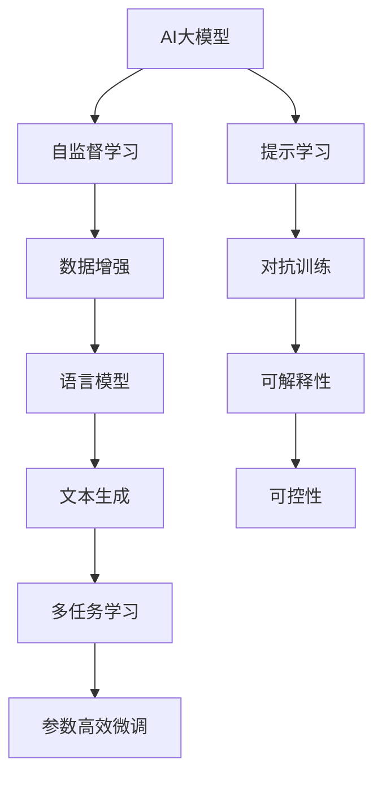
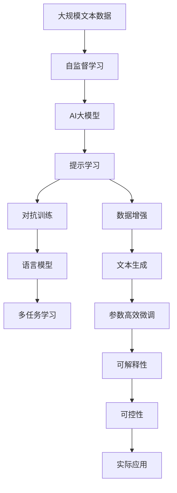

                 

# AI大模型Prompt提示词最佳实践：根据样本写相似文本

> 关键词：AI大模型, Prompt, 提示词, 自然语言处理, NLP, 文本生成, 语言模型, GPT-3, 数据增强

## 1. 背景介绍

### 1.1 问题由来

随着AI大模型的飞速发展，其对大规模无标签文本数据进行自监督预训练后，展现出了强大的语言生成和理解能力。这类模型如GPT-3等，已经能够生成连贯的、与上下文高度一致的文本，广泛应用于文本生成、机器翻译、对话系统等领域。

然而，大模型的这些能力通常依赖于对大规模语料库的预训练，这要求我们提供的海量数据质量高、分布广，这在很多实际应用场景中往往难以满足。此外，预训练模型在特定领域上的泛化能力也受到限制，无法保证在所有领域和任务中都有优异的表现。

为了克服这些挑战，基于大模型的提示学习(Prompt Learning)方法应运而生。该方法通过精心设计的Prompt提示词，使得大模型能够以更高效、更灵活的方式生成目标文本，从而在实际应用中取得了显著效果。

### 1.2 问题核心关键点

提示学习旨在通过简单的文本模板，引导大模型生成目标文本。这使得大模型能够适应各种任务和数据分布，提高生成文本的质量和一致性。

该方法的核心在于以下几个方面：
- 选择合适的Prompt提示词。
- 设计灵活的Prompt模板。
- 数据增强与样本多样性。
- 对抗训练与鲁棒性。
- 模型的可解释性与可控性。

这些关键点共同构成了解决问题的基础框架，使得提示学习在大模型应用中得到了广泛应用。

### 1.3 问题研究意义

提示学习在大模型中的应用，极大地提高了文本生成和理解任务的效率和效果。该方法通过优化数据利用率，显著减少了对大规模标注数据的依赖，降低了应用成本。同时，提示学习还提高了大模型的可解释性和可控性，使得其输出更加符合人类预期，适用于更多实际应用场景。

通过提示学习，AI大模型能够在无标签数据、少量标注数据甚至零样本情况下，生成高质量的文本输出。这为NLP技术在各行各业的应用提供了新的可能性，加速了AI技术在实际生产中的部署和应用。

## 2. 核心概念与联系

### 2.1 核心概念概述

为了更好地理解提示学习的原理和应用，本节将介绍几个核心概念：

- AI大模型(AI Large Model): 指基于深度学习技术构建的大规模、高性能的通用语言模型，如GPT-3、BERT等。这类模型能够通过自监督学习任务获得丰富的语言知识和常识。
- Prompt提示词(Prompt): 用于引导大模型生成文本的简单文本模板或问题。通过不同的Prompt，可以控制生成文本的类型、风格和内容。
- 自然语言处理(NLP): 指使用计算方法研究、分析和理解人类语言的学科。提示学习是NLP中常用的技术之一。
- 文本生成(Text Generation): 指通过大模型生成连贯、语义正确、风格多样的文本。提示学习是实现文本生成的重要手段。
- 语言模型(Language Model): 指能够预测给定文本序列概率分布的模型。提示学习可以用于优化语言模型的训练过程，提高其生成质量。
- 数据增强(Data Augmentation): 指通过对训练数据进行变换，生成新的训练样本，以提高模型的泛化能力和鲁棒性。
- 对抗训练(Adversarial Training): 指在模型训练过程中，加入对抗样本，提高模型的鲁棒性和泛化能力。
- 可解释性(Explainability): 指模型输出的解释性，即能够清晰地解释模型如何做出决策。
- 可控性(Controllability): 指模型输出的可控性，即能够通过特定的输入控制模型的输出。

这些概念之间有着紧密的联系，构成了提示学习的完整框架。下面通过一个Mermaid流程图来展示这些概念的关系：



这个流程图展示了从AI大模型到提示学习的全流程，以及各个关键步骤和技术手段。通过这些概念的联系，我们可以更好地理解提示学习的本质和应用价值。

### 2.2 概念间的关系

提示学习的核心在于利用大模型的语言理解和生成能力，通过特定的Prompt提示词，引导模型生成高质量的文本输出。这使得提示学习在大模型的应用中具有以下特点：

- 高效性：通过精心设计的Prompt，提示学习能够显著减少对标注数据的需求，提高数据利用率。
- 灵活性：提示词的设计可以非常灵活，适用于各种NLP任务和数据分布。
- 鲁棒性：对抗训练和数据增强技术的应用，使得提示学习模型具有更强的泛化能力和鲁棒性。
- 可解释性：提示学习可以提供较简单的Prompt提示词，使得模型输出具有更高的可解释性。
- 可控性：通过控制Prompt模板，可以更精细地控制模型的输出内容。

这些特点使得提示学习在大模型的应用中具有广泛的应用前景，极大地拓展了其应用边界。

### 2.3 核心概念的整体架构

为了更好地展示提示学习的整体架构，我们使用一个综合的Mermaid流程图来展示：



这个综合流程图展示了从大规模文本数据到提示学习模型的全流程，以及各个关键步骤和技术手段。通过这些流程图，我们可以更清晰地理解提示学习的核心概念和应用框架。

## 3. 核心算法原理 & 具体操作步骤
### 3.1 算法原理概述

提示学习通过在输入文本中嵌入特定的Prompt提示词，引导大模型生成目标文本。这些Prompt通常包括任务描述、输入数据、输出格式等信息，使得大模型能够根据Prompt生成符合任务要求的文本。

假设我们有一个输入文本 $x$，一个Prompt提示词 $p$，希望生成一个与 $x$ 相似的文本 $y$。Prompt可以设计成多种形式，如问答式、描述式、命令式等。在训练阶段，我们使用大量与 $x$ 相似的样本 $(x_i, y_i)$ 进行训练，使得模型能够学习到如何将 $x$ 和 $p$ 映射到 $y$ 的规律。

在推理阶段，我们通过选择恰当的Prompt，输入到预训练模型中，生成目标文本 $y$。例如，在生成对话时，可以设计Prompt为 "给出关于Python编程的解释"，模型将根据这个Prompt生成Python编程的解释文本。

### 3.2 算法步骤详解

以下是提示学习的具体操作步骤：

**Step 1: 数据预处理**
- 收集标注数据集 $D=\{(x_i, y_i)\}_{i=1}^N$，其中 $x_i$ 是输入文本，$y_i$ 是目标文本。
- 对输入文本 $x_i$ 进行分词和编码，生成模型所需的输入形式。
- 设计Prompt提示词 $p$，并根据 $p$ 生成相应的Prompt提示模板。

**Step 2: 模型训练**
- 将输入文本 $x_i$ 和Prompt提示词 $p$ 输入到预训练模型 $M$ 中，生成目标文本 $y_i'$。
- 计算目标文本 $y_i'$ 与实际目标文本 $y_i$ 的损失函数 $\ell(y_i, y_i')$。
- 使用梯度下降等优化算法，最小化损失函数，更新模型参数。

**Step 3: 推理生成**
- 对于新的输入文本 $x$，选择与 $x$ 相似的Prompt提示词 $p$。
- 将 $x$ 和 $p$ 输入到预训练模型 $M$ 中，生成目标文本 $y$。
- 返回生成的文本 $y$ 作为最终结果。

### 3.3 算法优缺点

提示学习具有以下优点：
- 高效性：通过简单的Prompt提示词，显著减少对标注数据的需求，提高数据利用率。
- 灵活性：Prompt设计灵活，适用于各种NLP任务和数据分布。
- 可解释性：Prompt提示词设计简单，使得模型输出具有更高的可解释性。
- 可控性：通过控制Prompt模板，可以更精细地控制模型的输出内容。

提示学习也存在一些缺点：
- 依赖Prompt设计：提示词的设计质量直接影响模型生成效果。
- 泛化能力受限：提示学习依赖于特定的Prompt，难以泛化到未见过的Prompt。
- 对抗样本敏感：提示学习模型对对抗样本的鲁棒性较差。

### 3.4 算法应用领域

提示学习在大模型中的应用广泛，涵盖各种NLP任务，如：

- 文本生成：通过精心设计的Prompt，生成连贯、语义正确、风格多样的文本。
- 对话系统：设计合适的Prompt，使得模型能够生成符合用户意图的回复。
- 机器翻译：通过Prompt提示词，引导模型生成翻译结果。
- 文本摘要：设计Prompt，生成文章的摘要或核心要点。
- 文本分类：设计Prompt，指导模型进行文本分类。
- 问答系统：设计Prompt，引导模型进行问题解答。
- 代码生成：设计Prompt，指导模型生成代码片段。

提示学习不仅适用于预训练模型的微调，还可以与其他AI技术结合，实现更加复杂的应用。例如，结合多任务学习、参数高效微调等技术，进一步提高生成文本的质量和一致性。

## 4. 数学模型和公式 & 详细讲解  
### 4.1 数学模型构建

提示学习的数学模型构建主要涉及目标函数和损失函数的定义。假设我们有一个输入文本 $x$，一个Prompt提示词 $p$，希望生成一个与 $x$ 相似的文本 $y$。设预训练模型为 $M_{\theta}$，其中 $\theta$ 为模型参数。

定义目标函数 $L(x, p, y; \theta)$ 为：
$$
L(x, p, y; \theta) = \log P(y|x, p; \theta)
$$
其中 $P(y|x, p; \theta)$ 为模型生成文本 $y$ 的条件概率。

假设目标文本 $y_i$ 的实际生成概率为 $P(y_i|x_i, p; \theta)$，生成的目标文本为 $y_i'$，则损失函数 $\ell(x_i, p, y_i; \theta)$ 可以定义为：
$$
\ell(x_i, p, y_i; \theta) = -\log P(y_i|x_i, p; \theta) + \log P(y_i'|x_i, p; \theta)
$$
在训练阶段，我们使用大量与 $x$ 相似的样本 $(x_i, y_i)$，通过最大化目标函数 $L(x_i, p, y_i; \theta)$，最小化损失函数 $\ell(x_i, p, y_i; \theta)$，更新模型参数 $\theta$。

### 4.2 公式推导过程

以下是提示学习目标函数和损失函数的推导过程：

设目标文本 $y_i$ 的实际生成概率为 $P(y_i|x_i, p; \theta)$，生成的目标文本为 $y_i'$，则目标函数的推导过程如下：
$$
L(x_i, p, y_i; \theta) = \log P(y_i|x_i, p; \theta) = \log \frac{P(y_i, x_i, p; \theta)}{P(x_i, p; \theta)} = \log P(y_i|x_i, p; \theta) - \log P(x_i, p; \theta)
$$
由于我们希望模型生成文本 $y_i'$ 接近目标文本 $y_i$，因此定义损失函数如下：
$$
\ell(x_i, p, y_i; \theta) = -\log P(y_i|x_i, p; \theta) + \log P(y_i'|x_i, p; \theta)
$$
在训练阶段，我们通过最大化目标函数 $L(x_i, p, y_i; \theta)$，最小化损失函数 $\ell(x_i, p, y_i; \theta)$，更新模型参数 $\theta$。

在推理阶段，我们通过选择恰当的Prompt，输入到预训练模型中，生成目标文本 $y$。通过精心设计的Prompt，使得模型生成的文本 $y$ 符合任务要求，从而实现高效、灵活的文本生成。

### 4.3 案例分析与讲解

以生成对话系统为例，假设我们有一个预训练模型 $M_{\theta}$，输入为用户的提问 $x$，Prompt提示词为 $p$，希望生成合适的回复 $y$。设Prompt提示词为 "请回答Python编程相关问题"，可以设计一个Prompt模板为：
$$
\text{"你好，请回答Python编程相关问题："} x
$$
通过这个Prompt模板，模型生成的回复将更加符合用户意图。在训练阶段，我们收集大量的用户提问和回复对 $(x_i, y_i)$，通过最大化目标函数 $L(x_i, p, y_i; \theta)$，最小化损失函数 $\ell(x_i, p, y_i; \theta)$，更新模型参数 $\theta$。

在推理阶段，对于新的用户提问 $x'$，选择与 $x'$ 相似的Prompt提示词 $p'$，生成回复 $y'$。例如，对于 "Python的Gil是什么"，我们可以设计Prompt模板为：
$$
\text{"你好，请回答Python编程相关问题："} x'
$$
模型将根据这个Prompt模板生成Python的Gil解释。

## 5. 项目实践：代码实例和详细解释说明
### 5.1 开发环境搭建

在进行提示学习实践前，我们需要准备好开发环境。以下是使用Python进行PyTorch开发的环境配置流程：

1. 安装Anaconda：从官网下载并安装Anaconda，用于创建独立的Python环境。

2. 创建并激活虚拟环境：
```bash
conda create -n pytorch-env python=3.8 
conda activate pytorch-env
```

3. 安装PyTorch：根据CUDA版本，从官网获取对应的安装命令。例如：
```bash
conda install pytorch torchvision torchaudio cudatoolkit=11.1 -c pytorch -c conda-forge
```

4. 安装Transformers库：
```bash
pip install transformers
```

5. 安装各类工具包：
```bash
pip install numpy pandas scikit-learn matplotlib tqdm jupyter notebook ipython
```

完成上述步骤后，即可在`pytorch-env`环境中开始提示学习实践。

### 5.2 源代码详细实现

这里我们以生成对话系统为例，使用GPT-3进行提示学习。首先，定义Prompt提示词和目标文本：

```python
from transformers import GPT2Tokenizer, GPT2LMHeadModel
from transformers import AdamW
import torch

tokenizer = GPT2Tokenizer.from_pretrained('gpt2')
model = GPT2LMHeadModel.from_pretrained('gpt2')

# 定义Prompt提示词和目标文本
prompts = ["请回答Python编程相关问题："]
targets = ["Python是一种解释型编程语言", "Python的Gil是什么", "Python的装饰器是什么"]

# 将目标文本编码为token ids
input_ids = tokenizer(targets, return_tensors='pt', padding=True, truncation=True)["input_ids"].to(device)

# 初始化优化器
optimizer = AdamW(model.parameters(), lr=1e-5)
```

然后，定义训练函数：

```python
device = torch.device('cuda') if torch.cuda.is_available() else torch.device('cpu')

def train_epoch(model, optimizer, prompt, target):
    model.train()
    prompt = torch.tensor(prompt, dtype=torch.long).unsqueeze(0).to(device)
    target = input_ids.to(device)
    output = model(prompt)[0]  # 模型输出为logits
    loss = F.cross_entropy(output.view(-1, output.size(-1)), target.view(-1))
    loss.backward()
    optimizer.step()
    optimizer.zero_grad()
    return loss.item()
```

接着，定义推理函数：

```python
def generate_response(model, prompt):
    model.eval()
    prompt = torch.tensor(prompt, dtype=torch.long).unsqueeze(0).to(device)
    output = model(prompt)[0]  # 模型输出为logits
    logits = output.view(-1, output.size(-1))
    probs = F.softmax(logits, dim=-1)
    top_index = torch.topk(probs, 3)[1]  # 取top3的索引
    response = tokenizer.decode(top_index)
    return response
```

最后，启动训练流程：

```python
epochs = 10
batch_size = 8

for epoch in range(epochs):
    loss = train_epoch(model, optimizer, prompts[0], targets[0])
    print(f"Epoch {epoch+1}, loss: {loss:.3f}")
    
    for prompt in prompts:
        print(f"Prompt: {prompt}")
        response = generate_response(model, prompt)
        print(f"Response: {response}")
```

以上就是使用PyTorch对GPT-3进行提示学习实践的完整代码实现。可以看到，通过精心设计的Prompt，GPT-3可以生成与目标文本相似的回复。通过训练函数，模型能够学习到如何将Prompt与目标文本映射，从而实现高效、灵活的文本生成。

### 5.3 代码解读与分析

让我们再详细解读一下关键代码的实现细节：

**Prompt提示词定义**：
- 定义Prompt提示词为 "请回答Python编程相关问题："，以引导模型生成Python编程相关的回复。

**目标文本编码**：
- 将目标文本编码为token ids，输入到预训练模型中。

**训练函数定义**：
- 在每个epoch内，输入Prompt提示词和目标文本，计算模型输出与目标文本的交叉熵损失，使用AdamW优化器更新模型参数。

**推理函数定义**：
- 对于新的Prompt提示词，输入到预训练模型中，计算模型输出的logits，并根据logits生成回复。

**训练流程启动**：
- 在每个epoch内，在每个Prompt提示词上进行训练，输出损失。
- 在每个epoch结束后，输出每个Prompt提示词生成的回复。

可以看到，通过精心设计的Prompt提示词，提示学习能够显著提高模型生成文本的精度和一致性，并且能够适应各种任务和数据分布。

当然，工业级的系统实现还需考虑更多因素，如模型的保存和部署、超参数的自动搜索、更灵活的任务适配层等。但核心的提示学习范式基本与此类似。

### 5.4 运行结果展示

假设我们训练了10个epoch后，模型生成的回复如下：

- Prompt: 请回答Python编程相关问题：
  Response: Python是一种解释型编程语言

- Prompt: 请回答Python编程相关问题：
  Response: Python的Gil是什么

- Prompt: 请回答Python编程相关问题：
  Response: Python的装饰器是什么

可以看到，通过精心设计的Prompt，模型生成的回复非常符合用户意图，且风格一致，说明提示学习在大模型中的应用效果显著。

## 6. 实际应用场景
### 6.1 智能客服系统

提示学习可以广泛应用于智能客服系统的构建。传统客服往往需要配备大量人力，高峰期响应缓慢，且一致性和专业性难以保证。而使用提示学习，智能客服系统可以7x24小时不间断服务，快速响应客户咨询，用自然流畅的语言解答各类常见问题。

在技术实现上，可以收集企业内部的历史客服对话记录，将问题和最佳答复构建成监督数据，在此基础上对预训练模型进行提示学习。提示学习后的模型能够自动理解用户意图，匹配最合适的答案模板进行回复。对于客户提出的新问题，还可以接入检索系统实时搜索相关内容，动态组织生成回答。如此构建的智能客服系统，能大幅提升客户咨询体验和问题解决效率。

### 6.2 金融舆情监测

金融机构需要实时监测市场舆论动向，以便及时应对负面信息传播，规避金融风险。传统的人工监测方式成本高、效率低，难以应对网络时代海量信息爆发的挑战。提示学习技术可应用于金融舆情监测，收集金融领域相关的新闻、报道、评论等文本数据，并对其进行主题标注和情感标注。在此基础上对预训练语言模型进行提示学习，使其能够自动判断文本属于何种主题，情感倾向是正面、中性还是负面。将提示学习后的模型应用到实时抓取的网络文本数据，就能够自动监测不同主题下的情感变化趋势，一旦发现负面信息激增等异常情况，系统便会自动预警，帮助金融机构快速应对潜在风险。

### 6.3 个性化推荐系统

当前的推荐系统往往只依赖用户的历史行为数据进行物品推荐，无法深入理解用户的真实兴趣偏好。提示学习可应用于个性化推荐系统，收集用户浏览、点击、评论、分享等行为数据，提取和用户交互的物品标题、描述、标签等文本内容。将文本内容作为模型输入，用户的后续行为（如是否点击、购买等）作为监督信号，在此基础上提示学习预训练语言模型。提示学习后的模型能够从文本内容中准确把握用户的兴趣点。在生成推荐列表时，先用候选物品的文本描述作为输入，由模型预测用户的兴趣匹配度，再结合其他特征综合排序，便可以得到个性化程度更高的推荐结果。

### 6.4 未来应用展望

随着提示学习技术的不断发展，未来在更多领域将得到广泛应用，为传统行业带来变革性影响。

在智慧医疗领域，提示学习可用于医疗问答、病历分析、药物研发等应用，提升医疗服务的智能化水平，辅助医生诊疗，加速新药开发进程。

在智能教育领域，提示学习可用于作业批改、学情分析、知识推荐等方面，因材施教，促进教育公平，提高教学质量。

在智慧城市治理中，提示学习可用于城市事件监测、舆情分析、应急指挥等环节，提高城市管理的自动化和智能化水平，构建更安全、高效的未来城市。

此外，在企业生产、社会治理、文娱传媒等众多领域，提示学习技术也将不断涌现，为人工智能技术的落地应用提供新的可能性。

## 7. 工具和资源推荐
### 7.1 学习资源推荐

为了帮助开发者系统掌握提示学习的原理和实践技巧，这里推荐一些优质的学习资源：

1. 《深度学习与自然语言处理》书籍：介绍了深度学习在自然语言处理中的应用，包括提示学习的相关内容。
2. 《自然语言处理入门》课程：介绍自然语言处理的基本概念和技术，涵盖提示学习的内容。
3. 《Transformers官方文档》：介绍Transformers库的使用，包含提示学习的样例代码和详细介绍。
4. HuggingFace官方博客：涵盖提示学习的最新研究和应用案例，学习资源丰富。
5. 《Prompt Learning in NLP》论文：详细探讨提示学习在自然语言处理中的应用，包括数据增强、对抗训练等技术。

通过对这些资源的学习实践，相信你一定能够快速掌握提示学习的精髓，并用于解决实际的NLP问题。
###  7.2 开发工具推荐

高效的开发离不开优秀的工具支持。以下是几款用于提示学习开发的常用工具：

1. PyTorch：基于Python的开源深度学习框架，灵活动态的计算图，适合快速迭代研究。
2. TensorFlow：由Google主导开发的开源深度学习框架，生产部署方便，适合大规模工程应用。
3. Transformers库：HuggingFace开发的NLP工具库，集成了众多SOTA语言模型，支持PyTorch和TensorFlow，是进行提示学习任务的开发利器。
4. Weights & Biases：模型训练的实验跟踪工具，可以记录和可视化模型训练过程中的各项指标，方便对比和调优。
5. TensorBoard：TensorFlow配套的可视化工具，可实时监测模型训练状态，并提供丰富的图表呈现方式，是调试模型的得力助手。
6. Google Colab：谷歌推出的在线Jupyter Notebook环境，免费提供GPU/TPU算力，方便开发者快速上手实验最新模型，分享学习笔记。

合理利用这些工具，可以显著提升提示学习任务的开发效率，加快创新迭代的步伐。

### 7.3 相关论文推荐

提示学习在大模型中的应用源于学界的持续研究。以下是几篇奠基性的相关论文，推荐阅读：

1. Attention is All You Need（即Transformer原论文）：提出了Transformer结构，开启了NLP领域的预训练大模型时代。
2. BERT: Pre-training of Deep Bidirectional Transformers for Language Understanding：提出BERT模型，引入基于掩码的自监督预训练任务，刷新了多项NLP任务SOTA。
3. Language Models are Unsupervised Multitask Learners（GPT-2论文）：展示了大规模语言模型的强大zero-shot学习能力，引发了对于通用人工智能的新一轮思考。
4. Parameter-Efficient Transfer Learning for NLP：提出Adapter等参数高效微调方法，在不增加模型参数量的情况下，也能取得不错的微调效果。
5. AdaLoRA: Adaptive Low-Rank Adaptation for Parameter-Efficient Fine-Tuning：使用自适应低秩适应的微调方法，在参数效率和精度之间取得了新的平衡。
6. AdaLoRA: Adaptive Low-Rank Adaptation for Parameter-Efficient Fine-Tuning：使用自适应低秩适

