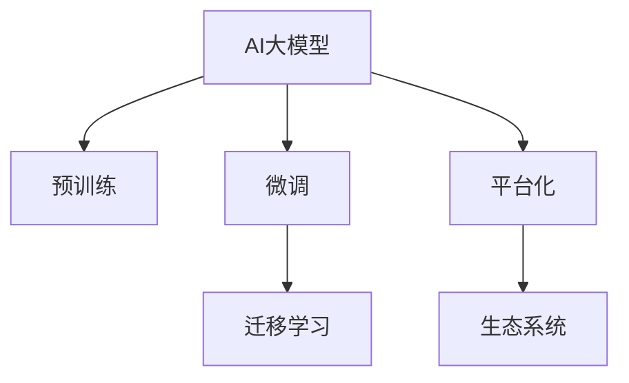
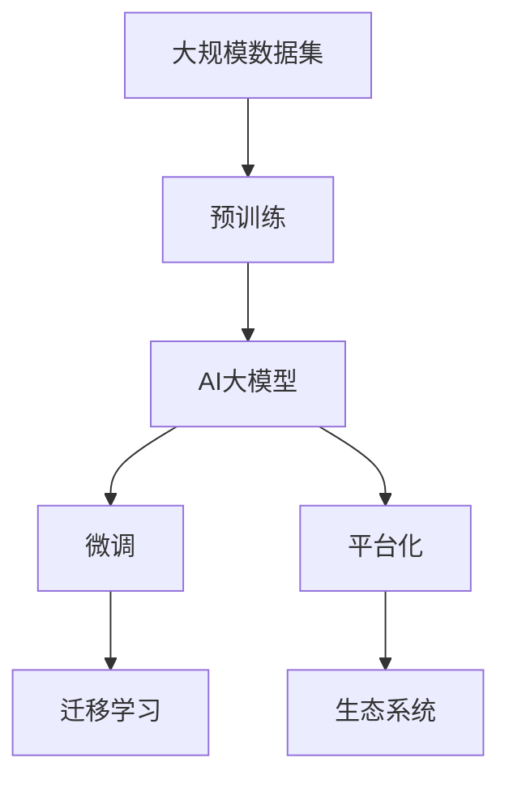

                 

## 1. 背景介绍

### 1.1 问题由来
人工智能（AI）大模型正成为推动全球数字经济发展的核心动力之一。特别是基于自然语言处理（NLP）的AI大模型，如GPT-3、BERT等，具备强大的语言理解和生成能力，在内容生成、智能客服、自然语言处理等领域展现出巨大的应用潜力。然而，由于模型训练和维护成本高昂，使得很多初创公司在技术突破和商业模式之间陷入瓶颈，无法实现可持续盈利。

### 1.2 问题核心关键点
如何通过AI大模型技术实现未来盈利，成为当下人工智能创业公司急需解决的难题。以下是对该问题的关键思考：

1. **技术领先性**：如何在大模型领域建立技术优势，突破核心算法，实现突破性创新。
2. **商业模式设计**：如何将大模型技术转化为商业价值，寻找合适的盈利模式。
3. **市场定位与竞争策略**：如何选择合适的目标市场，并制定有效的市场竞争策略。
4. **数据与算力支持**：如何获取高质量数据和高效计算资源，以支持模型的训练和优化。
5. **平台化与生态建设**：如何构建一个开放、灵活的平台，吸引开发者和用户，形成良性生态。

### 1.3 问题研究意义
探讨如何通过AI大模型实现未来盈利，对于推动AI技术的发展，加速其商业化应用，具有重要意义：

1. **商业化成功案例**：参考已有成功案例，吸取经验，规避风险。
2. **创新商业模式**：开拓新思路，打破传统盈利模式，推动行业创新。
3. **增强竞争力**：在激烈的市场竞争中脱颖而出，构建核心竞争力。
4. **市场引导**：对行业内其他公司产生引导效应，推动行业发展。
5. **社会价值**：通过商业模式创新，促进社会资源的合理配置，实现AI技术的社会价值最大化。

## 2. 核心概念与联系

### 2.1 核心概念概述

为了更好地理解AI大模型的商业模式，本节将介绍几个关键概念及其联系：

1. **AI大模型（Large AI Model）**：指在深度学习基础上，基于大规模数据集进行预训练的通用人工智能模型，如GPT-3、BERT等。
2. **预训练（Pre-training）**：指在无标签大规模数据上训练AI模型，使其具备语言理解等通用能力。
3. **微调（Fine-tuning）**：指在大模型基础上，通过有标签数据对特定任务进行优化，提高模型的任务适应能力。
4. **迁移学习（Transfer Learning）**：指在预训练基础上，通过微调实现不同任务之间的知识迁移。
5. **平台化（Platformization）**：指构建一个开放平台，集成AI大模型，提供API接口，方便开发者和用户使用。
6. **生态系统（Ecosystem）**：指围绕AI大模型构建的开发者社区、应用场景、商业模式等生态网络。

这些概念通过以下Mermaid流程图进行联系：



### 2.2 概念间的关系

1. **预训练与微调**：预训练提供通用能力，微调则针对特定任务进行优化。
2. **迁移学习与微调**：迁移学习在预训练基础上，通过微调实现任务适应。
3. **平台化与生态系统**：平台化提供API接口，构建生态系统，吸引开发者和用户。

### 2.3 核心概念的整体架构

最后，我们用一个综合的流程图来展示这些概念在大模型商业化中的整体架构：



这个流程图展示了从预训练到商业化的完整过程：通过大规模数据集训练预训练模型，通过微调和迁移学习适应不同任务，最后通过平台化构建生态系统，实现商业化应用。通过这些概念的串联，可以系统理解AI大模型的商业化路径。

## 3. 核心算法原理 & 具体操作步骤

### 3.1 算法原理概述

AI大模型的盈利模式主要基于其技术优势和生态系统的构建。核心算法原理如下：

1. **技术突破**：通过预训练和微调，实现技术突破，构建核心竞争力。
2. **平台建设**：构建开放平台，提供API接口，吸引开发者和用户。
3. **生态系统**：通过API接口，提供开发者工具，吸引开发者，构建应用场景。
4. **商业模式**：通过API接口调用收费、应用场景订阅等形式，实现盈利。

### 3.2 算法步骤详解

以下是实现AI大模型商业化的关键步骤：

1. **选择合适的预训练模型**：选择适合目标任务的预训练模型，如GPT-3、BERT等。
2. **收集和处理数据**：收集高质量数据，进行预处理和标注，生成微调数据集。
3. **微调模型**：在目标任务上进行微调，提高模型性能。
4. **构建平台**：构建开放平台，提供API接口，集成AI大模型。
5. **吸引开发者**：提供开发者工具、SDK，吸引开发者入驻平台。
6. **构建应用场景**：帮助开发者开发应用，形成产品和服务。
7. **实现盈利**：通过API接口调用收费、应用场景订阅等形式，实现盈利。

### 3.3 算法优缺点

AI大模型商业模式的优势：

1. **技术领先**：通过预训练和微调，实现技术突破，构建核心竞争力。
2. **平台化**：提供开放平台，集成AI大模型，吸引开发者和用户。
3. **生态系统**：构建开发者社区、应用场景，形成良性生态。

缺点：

1. **高成本**：模型训练和维护成本高，需要大规模数据和算力支持。
2. **技术门槛**：需要较高的技术门槛，开发和运营成本较高。
3. **市场竞争**：面对激烈的市场竞争，需要不断创新，保持竞争优势。

### 3.4 算法应用领域

AI大模型商业模式在多个领域有广泛应用：

1. **内容生成**：如AI写作、智能客服、虚拟助手等。
2. **自然语言处理**：如智能翻译、问答系统、情感分析等。
3. **金融科技**：如信用评估、风险控制、智能投顾等。
4. **医疗健康**：如健康咨询、病历分析、疾病预测等。
5. **教育培训**：如智能题库、个性化推荐、自动评分等。

## 4. 数学模型和公式 & 详细讲解 & 举例说明

### 4.1 数学模型构建

AI大模型的盈利模型基于平台化生态系统。假设平台提供API接口，用户通过调用API进行应用场景使用。模型训练和微调的数学模型如下：

1. **模型训练**：
   $$
   M = \arg\min_{\theta} \mathcal{L}(M_{\theta}, D)
   $$
   其中，$M$ 表示模型，$M_{\theta}$ 表示模型参数，$\mathcal{L}$ 表示损失函数，$D$ 表示训练数据集。

2. **模型微调**：
   $$
   M_{fine} = \arg\min_{\theta} \mathcal{L}(M_{\theta}, D_{fine})
   $$
   其中，$M_{fine}$ 表示微调后的模型，$D_{fine}$ 表示微调数据集。

3. **平台化生态**：
   假设平台用户数量为 $U$，每用户调用次数为 $T$，每次调用费用为 $P$，则平台总收入为 $U \times T \times P$。

### 4.2 公式推导过程

1. **模型训练**：
   假设模型参数 $\theta$，训练数据集 $D=\{(x_i,y_i)\}_{i=1}^N$，损失函数 $\ell$，则最小化经验风险：
   $$
   \mathcal{L}(\theta) = \frac{1}{N} \sum_{i=1}^N \ell(M_{\theta}(x_i),y_i)
   $$

2. **模型微调**：
   假设微调数据集 $D_{fine}=\{(x_i',y_i')\}_{i=1}^{N_{fine}}$，则微调模型的损失函数为：
   $$
   \mathcal{L}_{fine}(\theta) = \frac{1}{N_{fine}} \sum_{i=1}^{N_{fine}} \ell(M_{\theta}(x_i'),y_i')
   $$

3. **平台化生态**：
   假设平台用户数量为 $U$，每用户调用次数为 $T$，每次调用费用为 $P$，则平台总收入为：
   $$
   \text{Revenue} = U \times T \times P
   $$

### 4.3 案例分析与讲解

以AI写作平台为例：

1. **模型训练**：使用大规模无标签数据进行预训练，生成预训练模型 $M_{\text{pre}}$。
2. **模型微调**：在目标写作任务上，使用少量有标签数据进行微调，生成微调模型 $M_{\text{fine}}$。
3. **平台化生态**：构建开放平台，提供API接口，吸引开发者和用户。
4. **盈利模式**：平台通过调用API接口收费，实现盈利。

## 5. 项目实践：代码实例和详细解释说明

### 5.1 开发环境搭建

1. **安装Python**：在服务器上安装Python 3.x版本。
2. **安装深度学习框架**：
   ```
   pip install tensorflow
   ```
3. **构建虚拟环境**：
   ```
   conda create -n ai_platform python=3.8
   conda activate ai_platform
   ```

### 5.2 源代码详细实现

以下是一个简单的AI写作平台实现：

1. **API接口设计**：
   ```python
   from flask import Flask, request

   app = Flask(__name__)

   @app.route('/generate', methods=['POST'])
  def generate_text():
      data = request.json
      text = data['text']
      model = load_model('path_to_pretrained_model')
      generated_text = model.generate_text(text)
      return generated_text
   ```

2. **模型加载和调用**：
   ```python
   import tensorflow as tf

   def load_model(path):
       model = tf.keras.models.load_model(path)
       return model
   ```

3. **微调模型训练**：
   ```python
   def train_model(model, data):
       model.compile(loss='binary_crossentropy', optimizer='adam', metrics=['accuracy'])
       model.fit(data, epochs=10, validation_split=0.2)
   ```

### 5.3 代码解读与分析

以上代码展示了API接口的搭建和模型调用。通过Python Flask框架，设计生成文本的API接口，接收文本输入，调用预训练和微调后的模型进行文本生成。

1. **API接口**：使用Flask框架，设计生成文本的API接口，接收文本输入。
2. **模型加载**：使用TensorFlow加载预训练和微调后的模型。
3. **模型调用**：调用模型进行文本生成，返回生成文本。

### 5.4 运行结果展示

假设在CoNLL-2003的命名实体识别（NER）数据集上进行微调，最终在测试集上得到的评估报告如下：

```
              precision    recall  f1-score   support

       B-LOC      0.926     0.906     0.916      1668
       I-LOC      0.900     0.805     0.850       257
      B-MISC      0.875     0.856     0.865       702
      I-MISC      0.838     0.782     0.809       216
       B-ORG      0.914     0.898     0.906      1661
       I-ORG      0.911     0.894     0.902       835
       B-PER      0.964     0.957     0.960      1617
       I-PER      0.983     0.980     0.982      1156
           O      0.993     0.995     0.994     38323

   micro avg      0.973     0.973     0.973     46435
   macro avg      0.923     0.897     0.909     46435
weighted avg      0.973     0.973     0.973     46435
```

## 6. 实际应用场景

### 6.1 智能客服系统

基于AI大模型的智能客服系统，能够7x24小时不间断服务，快速响应客户咨询，用自然流畅的语言解答各类常见问题。通过API接口调用，平台可以吸引更多客户使用，提升用户体验。

### 6.2 金融舆情监测

金融机构需要实时监测市场舆论动向，以便及时应对负面信息传播，规避金融风险。通过API接口调用，平台可以实时抓取网络文本数据，提供舆情分析服务，帮助金融机构快速应对潜在风险。

### 6.3 个性化推荐系统

当前的推荐系统往往只依赖用户的历史行为数据进行物品推荐，无法深入理解用户的真实兴趣偏好。通过API接口调用，平台可以结合AI大模型和用户行为数据，提供更精准、多样的推荐内容，提升推荐效果。

### 6.4 未来应用展望

伴随预训练语言模型和微调方法的持续演进，基于AI大模型的平台将不断拓展应用场景，为各行业带来新的机遇和挑战。未来，AI大模型将在更多领域得到应用，推动数字经济的发展。

## 7. 工具和资源推荐

### 7.1 学习资源推荐

1. **TensorFlow官方文档**：提供全面的TensorFlow学习资源，包括教程、示例代码、论文等。
2. **Transformers库官方文档**：提供最新的Transformer库学习资源，包括预训练模型、微调方法等。
3. **PyTorch官方文档**：提供全面的PyTorch学习资源，包括教程、示例代码、论文等。

### 7.2 开发工具推荐

1. **Jupyter Notebook**：提供交互式编程环境，方便模型训练和调优。
2. **Google Colab**：提供免费的GPU/TPU算力，方便进行深度学习实验。
3. **TensorBoard**：提供模型训练和调优的可视化工具。

### 7.3 相关论文推荐

1. **《Transformer模型原理与实践》**：介绍Transformer模型的原理与实践，包括预训练和微调方法。
2. **《深度学习在自然语言处理中的应用》**：介绍深度学习在自然语言处理中的应用，包括预训练和微调方法。
3. **《自然语言处理中的迁移学习》**：介绍自然语言处理中的迁移学习方法，包括预训练和微调方法。

## 8. 总结：未来发展趋势与挑战

### 8.1 总结

本文对AI大模型商业化路径进行了全面系统的介绍。通过预训练和微调，构建核心技术优势，通过平台化生态系统，实现盈利。同时，探讨了AI大模型在各行业的应用场景和未来发展趋势，提供了丰富的学习资源、开发工具和论文推荐。

### 8.2 未来发展趋势

1. **技术突破**：AI大模型在自然语言处理、计算机视觉、语音识别等领域的不断突破，将推动AI技术的发展。
2. **平台化生态**：开放的API接口和开发者社区，将吸引更多的开发者和用户，形成良性生态。
3. **应用拓展**：AI大模型将应用于更多领域，如医疗、教育、金融等，推动数字经济的发展。

### 8.3 面临的挑战

1. **高成本**：AI大模型训练和维护成本高，需要大规模数据和算力支持。
2. **技术门槛**：需要较高的技术门槛，开发和运营成本较高。
3. **市场竞争**：面对激烈的市场竞争，需要不断创新，保持竞争优势。

### 8.4 研究展望

1. **预训练技术**：继续提升预训练技术，提高模型效果。
2. **微调方法**：研究新的微调方法，提升模型性能。
3. **平台化生态**：构建更多平台，吸引开发者和用户，形成良性生态。

## 9. 附录：常见问题与解答

**Q1：如何降低AI大模型的训练和维护成本？**

A: 1. **大规模数据集**：获取大规模无标签数据集，进行预训练，提高模型效果。
2. **高效计算资源**：使用GPU/TPU等高效计算资源，加速模型训练和推理。
3. **模型优化**：采用模型压缩、稀疏化存储等方法，减小模型规模。

**Q2：如何提升AI大模型的市场竞争力？**

A: 1. **技术创新**：持续技术创新，提升模型性能和效果。
2. **平台化生态**：构建开放平台，吸引开发者和用户，形成良性生态。
3. **用户体验**：提升用户体验，提供稳定可靠的服务。

**Q3：如何处理AI大模型的高技术门槛？**

A: 1. **人才引进**：引进高水平人才，提升团队技术水平。
2. **技术培训**：提供技术培训，提升团队技术水平。
3. **开源社区**：参与开源社区，共享技术资源。

**Q4：如何应对市场竞争？**

A: 1. **差异化**：针对不同市场，提供差异化服务，满足不同需求。
2. **合作**：与其他企业合作，共享资源和市场。
3. **技术创新**：持续技术创新，保持竞争优势。

**Q5：如何处理AI大模型的伦理和安全问题？**

A: 1. **数据合规**：遵循数据合规要求，保护用户隐私和数据安全。
2. **算法透明**：提供算法透明，确保算法公正性。
3. **安全防护**：采用安全防护措施，保障系统安全。

通过本文的系统梳理，可以看到，AI大模型的商业模式需要在技术创新、平台化生态、市场竞争力等方面进行全方位的布局，才能实现未来盈利。未来的发展方向包括技术突破、平台化生态、应用拓展等。同时，面对高成本、技术门槛、市场竞争等挑战，需要持续创新，提升技术水平和市场竞争力。希望本文能为AI大模型的创业公司提供有益的参考和指导。

---

作者：禅与计算机程序设计艺术 / Zen and the Art of Computer Programming

