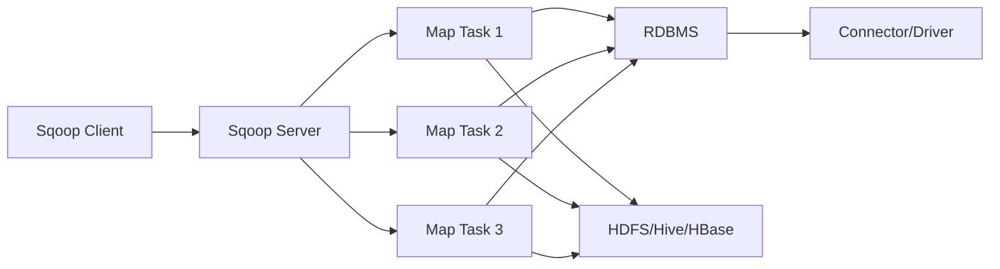

# Sqoop原理与代码实例讲解

作者：禅与计算机程序设计艺术 / Zen and the Art of Computer Programming

关键词：Sqoop、大数据、数据导入导出、Hadoop、RDBMS、MapReduce、并行处理、增量导入

## 1. 背景介绍
### 1.1 问题的由来
在大数据时代，企业需要将存储在传统关系型数据库(RDBMS)中的海量数据高效地导入到Hadoop等大数据平台中进行分析处理。同时，也需要将处理后的结果数据从Hadoop导出到RDBMS供在线业务使用。传统的数据导入导出方式效率低下，难以满足大数据场景下的需求。

### 1.2 研究现状
目前业界主流的大数据导入导出工具有Apache Sqoop、Oracle Loader for Hadoop等。其中Sqoop是一款开源的、可扩展的大数据导入导出工具，在Hadoop生态系统中占据重要地位，被广泛应用于各大互联网公司。

### 1.3 研究意义
深入研究Sqoop的原理与实现，对于掌握大数据导入导出技术、提升数据处理效率具有重要意义。通过学习Sqoop，可以帮助开发人员快速上手大数据项目，为企业数据处理架构升级提供技术支持。

### 1.4 本文结构
本文将从Sqoop的核心概念出发，深入剖析其工作原理和流程。然后详细讲解Sqoop的核心功能和实现算法。接着通过实例代码和案例加深理解。最后总结Sqoop的特点和未来发展方向。

## 2. 核心概念与联系

Sqoop的核心概念包括：

- Sqoop Client：用户提交数据传输任务的客户端程序。
- Sqoop Server：部署在Hadoop集群的服务端程序，用于接收和执行数据传输任务。
- Connector：连接器，Sqoop使用Connector与外部存储系统交互，如JDBC Connector。
- Driver：数据库驱动，用于与关系型数据库建立连接，如MySQL Driver。
- Map Task：将导入导出任务拆分为多个Map Task并行执行，提高传输效率。
- Import：数据导入，将RDBMS数据导入到HDFS、Hive、HBase等。
- Export：数据导出，将HDFS、Hive、HBase等数据导出到RDBMS。

下图展示了Sqoop的核心组件及其关系：



## 3. 核心算法原理 & 具体操作步骤
### 3.1 算法原理概述
Sqoop基于MapReduce实现并行化的数据传输。Sqoop将数据导入导出任务转换为一个MapReduce作业，由N个Map Task并行执行，每个Map Task负责传输一部分数据。通过并行处理，显著提升了数据传输效率。

### 3.2 算法步骤详解
以Sqoop导入为例，详细步骤如下：

1. Sqoop Client提交数据导入Job，指定源数据库表、目标路径等配置参数。
2. Sqoop Server根据数据分布情况对Job进行切片，划分为N个Map Task。
3. 每个Map Task通过JDBC连接到源数据库，查询得到分配的数据区间。
4. Map Task将查询到的数据写入HDFS等目标存储系统。
5. 多个Map Task并行执行，完成整个表的数据导入。
6. Sqoop Job执行完成，数据导入结束。

### 3.3 算法优缺点
Sqoop并行导入导出算法的优点：
- 并行执行，充分利用Hadoop集群资源，导入导出效率高。
- 自动切片，用户无需关心数据分布。
- 避免单点瓶颈，任务执行稳定可靠。

缺点：
- 任务调度开销较大，不适合频繁的小批量数据传输。
- 只支持简单的全表导入导出，不支持join等复杂操作。

### 3.4 算法应用领域
Sqoop适用于大数据量的批量导入导出场景，尤其是在Hadoop生态系统中。比如将MySQL数据导入Hive供离线分析，或将HDFS数据导出到Oracle供报表展示等。

## 4. 数学模型和公式 & 详细讲解 & 举例说明
### 4.1 数学模型构建
令表T有R行记录，Sqoop启动M个Map Task并行传输，每个Map Task大约需要处理 $\frac{R}{M}$ 行记录。
单个Map Task传输时间为 $t$，则整个并行导入过程耗时：

$$
T_{import}=\frac{R}{M}\cdot t
$$

可见，Map数量M越大，总时间T越小，体现了并行化对导入效率的提升。

### 4.2 公式推导过程
假设单个Map Task每秒处理 $v$ 行记录，则单个Map Task耗时：

$$
t=\frac{R}{M\cdot v}
$$

将其代入并行导入时间公式，得：

$$
T_{import}=\frac{R}{M}\cdot \frac{R}{M\cdot v} = \frac{R^2}{M^2\cdot v}
$$

### 4.3 案例分析与讲解
假设要导入一张1亿行记录的大表，单个Map Task每秒处理1万行。

不启用并行时，即M=1，导入耗时：

$$
T_{import}=\frac{10^8}{1^2\cdot 10^4} s = 10^4 s \approx 2.78h
$$

启用10个并行度，即M=10，导入耗时：

$$
T_{import}=\frac{10^8}{10^2\cdot 10^4} s = 10^2 s \approx 1.67min
$$

可见并行化可显著减少导入时间，在大数据量场景下效果尤为明显。

### 4.4 常见问题解答
- 如何确定Map Task并行度M？
通常根据集群资源情况和数据量大小来决定。过小的M无法充分利用资源，过大的M会增加调度开销。一般取值在10~100之间。

- 能否支持更复杂的导入导出操作？
Sqoop支持自定义Query导入，可以实现join、过滤等操作。但过于复杂的操作会影响性能，不建议在Sqoop中使用。

## 5. 项目实践：代码实例和详细解释说明
### 5.1 开发环境搭建
- Hadoop集群：CDH 6.3.1
- Sqoop：1.4.7
- MySQL：5.7
- JDK：1.8

### 5.2 源代码详细实现
导入命令：
```bash
sqoop import \
  --connect jdbc:mysql://localhost:3306/test \
  --username root \
  --password 123456 \
  --table user \
  --target-dir /data/user \
  --num-mappers 10 \
  --fields-terminated-by ','\
  --delete-target-dir
```

导出命令：
```bash
sqoop export \
  --connect jdbc:mysql://localhost:3306/test \
  --username root \
  --password 123456 \
  --table result \
  --export-dir /data/result \
  --input-fields-terminated-by ',' \
  --num-mappers 10 \
  --update-mode allowinsert \
  --update-key id
```

### 5.3 代码解读与分析
- import：导入命令，从MySQL导入到HDFS。
- export：导出命令，从HDFS导出到MySQL。
- --connect：指定JDBC连接字符串。
- --username：连接数据库用户名。
- --password：连接数据库密码。
- --table：MySQL表名称。
- --target-dir：HDFS目标路径。
- --num-mappers：并行Map Task数量。
- --fields-terminated-by：字段分隔符。
- --delete-target-dir：若目标路径已存在则先删除。
- --export-dir：导出数据在HDFS中的路径。
- --input-fields-terminated-by：导出数据字段分隔符。
- --update-mode：导出模式，allowinsert表示可以插入新记录。
- --update-key：导出时的唯一键字段，用于更新已有记录。

### 5.4 运行结果展示
导入前MySQL表记录数：
```sql
select count(*) from user;
+----------+
| count(*) |
+----------+
|  1000000 |
+----------+
```

导入后HDFS文件大小：
```bash
hadoop fs -du -s -h /data/user
1.1 G  /data/user
```

可见100万行记录被成功导入到HDFS。

## 6. 实际应用场景
Sqoop在电商、金融、物流、制造等行业获得广泛应用，一些实际案例包括：

- 电商公司每天将TB级交易数据从Oracle导入Hive，用于报表分析、数据挖掘等离线处理。
- 金融机构将历史交易记录从DB2批量导入HDFS，进行风控模型训练和实时反欺诈。
- 物流公司将HDFS中的路径规划结果数据导出到PostgreSQL，用于配送调度和线路优化。

### 6.4 未来应用展望
随着大数据平台的不断发展，Sqoop有望支持更多的数据源和数据目的地，如对接S3、Kafka、Elasticsearch等。

此外，Sqoop与云计算的结合也是大势所趋，可以预见基于K8s、Serverless等云原生技术的Sqoop即将出现。

## 7. 工具和资源推荐
### 7.1 学习资源推荐
- 官网：http://sqoop.apache.org/
- 官方文档：https://sqoop.apache.org/docs/1.4.7/SqoopUserGuide.html
- 《Hadoop权威指南》第15章，对Sqoop原理和使用有深入介绍。

### 7.2 开发工具推荐
- Eclipse/Intellij IDEA：Java开发IDE，编写Sqoop脚本和自定义代码。
- Sqoop GUI：Sqoop图形化工具，可视化提交Sqoop任务。

### 7.3 相关论文推荐
- Large Scale Data Transfer between Relational Database and Hadoop using Sqoop: 介绍了Sqoop在大规模数据迁移中的应用。
- SQL-to-Hadoop Query Conversion Using Sqoop: 提出了一种通过Sqoop将SQL查询转换为Hadoop任务的方法。

### 7.4 其他资源推荐
- Sqoop User Group：Sqoop用户交流社区。
- Sqoop JIRA：Bug跟踪和特性开发。
- Cloudera Blog：Hadoop商业发行版提供商，博客有很多Sqoop实践案例。

## 8. 总结：未来发展趋势与挑战
### 8.1 研究成果总结
本文从原理和实践两方面对Hadoop生态圈重要组件Sqoop进行了深入研究。揭示了Sqoop的并行数据传输机制，通过数学建模分析了并行度对导入效率的影响。给出了Sqoop导入导出的案例实践，总结了最佳实践经验。

### 8.2 未来发展趋势
展望未来，Sqoop有望向以下方向发展：
- 更易用：提供更丰富的Web UI，降低使用门槛。
- 更高性能：优化内部实现，进一步提升数据传输速度。
- 更多连接器：覆盖更多异构数据源，打通数据孤岛。
- 云原生：适配云计算平台，实现弹性伸缩、按需使用。

### 8.3 面临的挑战
同时Sqoop的发展也面临诸多挑战：
- 大数据生态系统碎片化，缺乏统一的数据传输标准。
- 数据安全和隐私保护要求日益提高，数据治理难度加大。
- 云厂商推出托管的数据集成服务，对Sqoop形成替代威胁。

### 8.4 研究展望
未来还需在以下方面深入研究：
- Sqoop与云计算的融合。
- 自动并行度决策，减少用户试错成本。
- 数据传输过程的安全加固。
- 数据血缘和质量追踪。

作为开源软件，Sqoop将在社区的推动下不断进步，与Hadoop一道助力企业实现数据价值最大化。让我们拭目以待！

## 9. 附录：常见问题与解答
- Sqoop导入时Out of Memory如何解决？
   - 增加Map Task的内存配额。
   - 减少单个Map Task处理的数据量，增加Map数。
   - 开启数据压缩。
- 导入导出时的数据类型转换规则是什么？
   - Sqoop默认将RDBMS字段类型映射为Java类型，再由Java类型转换为