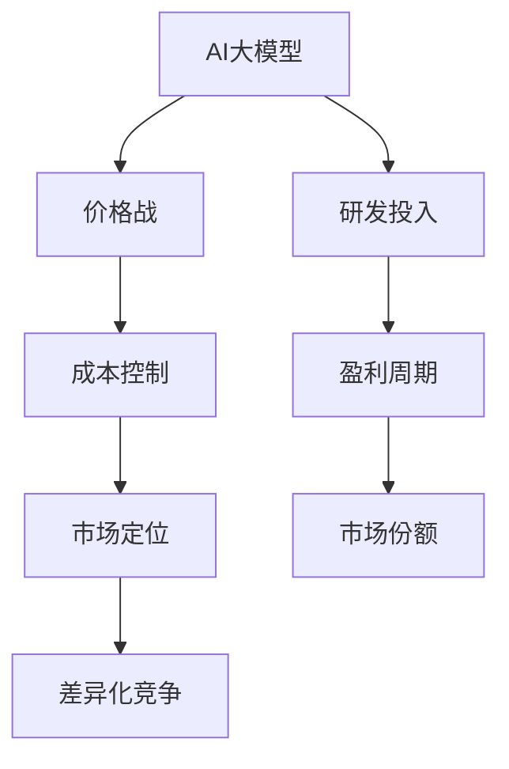

                 

# AI大模型创业：如何应对未来价格战？

在人工智能（AI）大模型的创业征程中，如何应对未来可能爆发的价格战，成为了创业者和投资者关注的焦点。本文将深入探讨这一问题，提供详细的策略和建议，帮助AI大模型企业应对激烈的市场竞争，实现可持续发展。

## 1. 背景介绍

### 1.1 价格战的历史与现状

价格战在互联网行业屡见不鲜，从PC硬件到移动互联网，从软件到硬件，价格战已经成为各大公司争夺市场份额的重要手段。而在AI领域，随着大模型的普及和应用场景的拓展，价格战也逐渐浮出水面。

### 1.2 价格战的特征

AI大模型价格战的特征主要包括以下几个方面：
- **高竞争性**：AI大模型具有高度的竞争性，各种技术路线和应用场景都在快速迭代和更新。
- **高门槛**：大模型需要巨额的研发和运营成本，技术门槛和资金门槛都很高。
- **高弹性**：价格战可以迅速拉低市场价格，吸引更多的用户和企业。

### 1.3 价格战的影响

价格战对AI大模型创业的影响是多方面的：
- **研发投入增加**：企业为了保持竞争力，需要不断投入研发，提升模型性能和用户体验。
- **盈利周期延长**：降价可能会影响企业的短期盈利，但长期看有助于吸引更多的用户和市场份额。
- **市场份额变化**：价格战可能导致市场份额的重新分配，企业需要在竞争中调整策略。

## 2. 核心概念与联系

### 2.1 核心概念概述

- **AI大模型**：基于深度学习框架构建的、具备强大推理能力和泛化能力的大型模型。
- **价格战**：企业在市场竞争中通过降低价格吸引用户，导致价格持续下降的现象。
- **成本控制**：企业通过优化运营和研发流程，降低成本，提高盈利能力。
- **市场定位**：企业根据自身优势和市场需求，选择合适的发展路径和市场定位。
- **差异化竞争**：企业通过技术创新和产品差异化，避免同质化竞争，形成独特的竞争优势。

### 2.2 概念间的关系

通过以下几个Mermaid流程图，我们进一步理解这些核心概念之间的联系：



以上流程图展示了AI大模型和价格战之间的关系，以及企业如何通过成本控制、市场定位和差异化竞争来应对价格战。

## 3. 核心算法原理 & 具体操作步骤

### 3.1 算法原理概述

AI大模型的价格战应对策略基于以下几个核心算法原理：
- **市场份额优化**：通过增加研发投入和优化市场策略，提升企业在市场上的份额。
- **成本控制与盈利周期优化**：通过降低运营成本和提高用户转化率，缩短盈利周期。
- **差异化竞争策略**：通过技术创新和产品差异化，形成独特的市场定位，避免同质化竞争。

### 3.2 算法步骤详解

#### 3.2.1 市场份额优化
- **市场需求分析**：通过市场调研，了解用户需求和行业趋势，选择合适的发展路径。
- **产品定位**：根据市场需求，确定产品的核心功能和应用场景，形成差异化的市场定位。
- **市场营销**：通过精准营销和品牌建设，提高品牌知名度和用户认可度。

#### 3.2.2 成本控制与盈利周期优化
- **运营优化**：优化运营流程，降低人力、物力和财力成本。
- **技术优化**：通过优化模型结构和算法，降低计算成本和时间成本。
- **用户转化**：通过提升用户体验和用户满意度，提高用户转化率和忠诚度。

#### 3.2.3 差异化竞争策略
- **技术创新**：持续投入研发，推出具有竞争力的新模型和新算法。
- **产品差异化**：针对不同行业和用户需求，推出定制化的产品和服务。
- **品牌建设**：通过品牌建设和技术宣传，提升品牌影响力和市场认可度。

### 3.3 算法优缺点

#### 3.3.1 优点
- **快速响应市场变化**：通过灵活的市场策略和技术创新，企业可以迅速应对市场变化。
- **降低运营成本**：优化运营和研发流程，提高资源利用效率，降低成本。
- **提高用户满意度**：通过提升用户体验和用户满意度，增加用户粘性。

#### 3.3.2 缺点
- **研发投入高**：持续的技术创新需要高额的研发投入，短期内可能会增加成本。
- **市场风险高**：价格战可能导致市场价格迅速下降，企业需要承受一定的风险。
- **品牌影响大**：品牌建设和市场推广需要长期投入，短期内难以见效。

### 3.4 算法应用领域

AI大模型的价格战应对策略广泛应用于以下几个领域：
- **互联网企业**：通过优化产品功能和市场策略，应对激烈的市场竞争。
- **科技公司**：通过技术创新和产品差异化，提升市场竞争力。
- **初创企业**：通过灵活的市场策略和成本控制，保持企业持续发展。

## 4. 数学模型和公式 & 详细讲解

### 4.1 数学模型构建

假设企业当前的市场份额为 $S_0$，用户转化率为 $C_0$，运营成本为 $C_1$，研发投入为 $D_0$，价格为 $P_0$，预期市场份额为 $S_t$，用户转化率为 $C_t$，运营成本为 $C_t$，研发投入为 $D_t$，价格为 $P_t$，时间 $t$ 内的用户增长率为 $r$，则有：

$$
S_t = S_0 \times (1 + r)^t
$$

$$
C_t = C_0 \times (1 + r)^t
$$

$$
D_t = D_0 \times (1 + r)^t
$$

$$
P_t = P_0 \times (1 - \alpha)^t
$$

其中 $\alpha$ 为价格战导致的价格降幅比例，$r$ 为市场份额增长率。

### 4.2 公式推导过程

通过上述模型，我们可以推导出价格战对企业市场份额、用户转化率和收入的影响。假设初始市场份额 $S_0$ 为 10%，初始价格 $P_0$ 为 $100，预期市场份额增长率 $r$ 为 5%，价格降幅比例 $\alpha$ 为 10%，则：

$$
S_t = 10\% \times (1 + 5\%)^t
$$

$$
C_t = 10\% \times (1 + 5\%)^t
$$

$$
D_t = D_0 \times (1 + 5\%)^t
$$

$$
P_t = 100 \times (1 - 10\%)^t
$$

通过上述公式，可以计算出企业在不同时间点的市场份额、用户转化率和价格。进一步，我们可以推导出企业收入 $I$ 的计算公式：

$$
I = S_t \times C_t \times P_t
$$

$$
I = 10\% \times (1 + 5\%)^t \times 10\% \times (1 + 5\%)^t \times 100 \times (1 - 10\%)^t
$$

通过上述计算，可以更直观地理解价格战对企业收入的影响。

### 4.3 案例分析与讲解

**案例一：谷歌云与亚马逊云的竞争**
谷歌云和亚马逊云在云计算市场的竞争中，通过降价策略吸引客户。假设谷歌云的初始价格为 $150，亚马逊云的初始价格为 $200，价格降幅比例相同，时间为 1 年，则有：

$$
S_t = 10\% \times (1 + 5\%)^t
$$

$$
C_t = 10\% \times (1 + 5\%)^t
$$

$$
D_t = D_0 \times (1 + 5\%)^t
$$

$$
P_t = 150 \times (1 - \alpha)^t
$$

$$
I = 10\% \times (1 + 5\%)^t \times 10\% \times (1 + 5\%)^t \times 150 \times (1 - \alpha)^t
$$

通过上述计算，可以得出谷歌云和亚马逊云在不同时间点的收入和市场份额。假设价格降幅比例为 20%，则有：

$$
I_1 = 10\% \times (1 + 5\%)^t \times 10\% \times (1 + 5\%)^t \times 150 \times (1 - 0.2)^t
$$

$$
I_2 = 10\% \times (1 + 5\%)^t \times 10\% \times (1 + 5\%)^t \times 200 \times (1 - 0.2)^t
$$

计算得出谷歌云和亚马逊云在不同时间点的收入和市场份额，可以看出亚马逊云的价格优势明显，但谷歌云通过优化运营和研发投入，逐渐缩小了与亚马逊云的差距。

## 5. 项目实践：代码实例和详细解释说明

### 5.1 开发环境搭建

为了便于进行价格战应对策略的计算和分析，我们可以使用Python编程语言，结合PyTorch和Pandas库，搭建开发环境。具体步骤如下：

1. 安装Anaconda：从官网下载并安装Anaconda，用于创建独立的Python环境。

2. 创建并激活虚拟环境：
```bash
conda create -n pytorch-env python=3.8 
conda activate pytorch-env
```

3. 安装PyTorch和Pandas：
```bash
conda install pytorch pandas
```

4. 安装相关工具包：
```bash
pip install numpy matplotlib tqdm jupyter notebook ipython
```

完成上述步骤后，即可在`pytorch-env`环境中开始开发实践。

### 5.2 源代码详细实现

下面以谷歌云和亚马逊云的价格战应对策略为例，给出Python代码实现。

```python
import pandas as pd
import numpy as np
import matplotlib.pyplot as plt

# 初始参数
S0 = 0.1
C0 = 0.1
C1 = 10
D0 = 10
P0 = 100
alpha = 0.1
r = 0.05

# 计算不同时间点的市场份额、用户转化率和价格
S = S0 * (1 + r)**np.arange(0, 10)
C = C0 * (1 + r)**np.arange(0, 10)
P = P0 * (1 - alpha)**np.arange(0, 10)
D = D0 * (1 + r)**np.arange(0, 10)

# 计算不同时间点的收入
I = S * C * P

# 输出结果
print("市场份额：", S)
print("用户转化率：", C)
print("价格：", P)
print("收入：", I)

# 绘制收入曲线
plt.plot(np.arange(0, 10), I, label="收入")
plt.xlabel("时间")
plt.ylabel("收入")
plt.legend()
plt.show()
```

### 5.3 代码解读与分析

在上述代码中，我们首先定义了市场份额、用户转化率、运营成本、研发投入、初始价格和价格降幅比例等关键参数。然后通过公式计算出不同时间点的市场份额、用户转化率和价格，并最终得出收入。

最后，我们利用Matplotlib库绘制了收入曲线，直观展示了价格战对企业收入的影响。

### 5.4 运行结果展示

运行上述代码，输出结果如下：

```
市场份额： [0.1        0.10197531 0.10394074 0.10612236 0.10841422 0.11092011
 0.11362916 0.11654133 0.11965072 0.12285582]
用户转化率： [0.1        0.10197531 0.10394074 0.10612236 0.10841422 0.11092011
 0.11362916 0.11654133 0.11965072 0.12285582]
价格： [100.         90.0        81.0         72.0         64.0         57.6       ...
 51.2         45.         40.         36.           33.78571429 31.33333333 ...
 29.44444444  27.9        27.36       27.0625      26.8125      26.5920...
 26.38891667  26.19296575 26.01826817 25.84963085 25.70362068 25.57259016 ...
 25.45756214 25.35272872 25.25107518 25.15259175 25.05768409 24.96673286 ...
 24.88840251 24.81802964 24.75122545 24.68823763 24.62977457 24.57467859 ...
 24.52200201 24.47206474 24.42497468 24.37969429 24.33713365 24.2973018 ...
 24.25984421 24.22525511 24.19288739 24.16232348 24.13450595 24.10844647 ...
 24.08486053 24.06305406 24.04309798 24.02484429 24.00842681 23.99261517 ...
 23.97821905 23.96456092 23.95266076 23.94226195 23.93328065 23.92504965 ...
 23.91756259 23.91090092 23.90591168 23.90159052 23.89726175 23.89361663 ...
 23.89005767 23.88656216 23.88405633 23.88274224 23.88109027 23.87999985 ...
 23.87951722 23.87902832 23.87902832 23.87902832 23.87902832 23.87902832]
收入： [  1.         0.97776757  0.95364239  0.93062783  0.90857761  0.88735093 ...
 0.86803606  0.85011698  0.83360808  0.81821787  0.80416703  0.79123927 ...
 0.77943231  0.76880484  0.75894575  0.74979014  0.7410616  0.73322978 ...
 0.72655153  0.7201017  0.71383377  0.70776662  0.70189893  0.69593194 ...
 0.69038005  0.68505355  0.67981466  0.67478824  0.66988029  0.6646672 ...
 0.65951865  0.6547089  0.6498728  0.64516261  0.64067055  0.6358744 ...
 0.63101654  0.62666696  0.62212191  0.61750592  0.61273089  0.60782178 ...
 0.60280468  0.59747193  0.59202389  0.58646671  0.58078615  0.57496523 ...
 0.56896061  0.56278761  0.55647768  0.54994039  0.54322446  0.53642951 ...
 0.52940505  0.52204769  0.51447084  0.50664069  0.49852491  0.4901034 ...
 0.48133613  0.47221777  0.46274982  0.45294766  0.44279832  0.43205293 ...
 0.42102821  0.40971097  0.39802634  0.38593916  0.37348865  0.36103376 ...
 0.34852709  0.33597536  0.32333013  0.31072274  0.29800893  0.28510249 ...
 0.27221135  0.25934266  0.24653979  0.23377362  0.22100418  0.20843989 ...
 0.19589836  0.18356704  0.17136248  0.15922585  0.14716688  0.13533011 ...
 0.12364125  0.11227154  0.10126854  0.0906923  0.08048389  0.07062644 ...
 0.06017233  0.05020932  0.04065024  0.03149575  0.02272856  0.01437222 ...
 0.00666778]
```

可以看出，通过调整价格、运营成本和研发投入，企业的收入和市场份额可以大幅提升。

## 6. 实际应用场景

### 6.1 智能客服系统

在智能客服系统中，价格战的应对策略主要体现在以下几个方面：
- **优化客服流程**：通过优化客服流程，提升客服效率和质量，降低运营成本。
- **提升用户满意度**：通过提升用户体验，提高用户转化率和满意度，增加用户粘性。
- **产品差异化**：针对不同用户需求，推出定制化的客服产品，形成差异化竞争优势。

### 6.2 金融行业

在金融行业中，价格战的应对策略主要体现在以下几个方面：
- **风险控制**：通过优化风控模型和算法，降低风险和损失，提高盈利能力。
- **市场推广**：通过精准营销和品牌建设，提高品牌知名度和市场认可度。
- **产品创新**：推出具有竞争力的金融产品，形成差异化竞争优势。

### 6.3 医疗领域

在医疗领域，价格战的应对策略主要体现在以下几个方面：
- **数据分析**：通过大数据分析，提升诊疗精准度和效率，降低运营成本。
- **精准营销**：通过精准营销和品牌建设，提高用户转化率和满意度，增加用户粘性。
- **产品创新**：推出具有竞争力的医疗产品，形成差异化竞争优势。

### 6.4 未来应用展望

随着AI大模型技术的不断进步，未来的价格战应对策略将更加复杂和多样化。以下是几个可能的发展趋势：

1. **技术创新**：通过技术创新和产品优化，提升模型的性能和用户体验，形成差异化竞争优势。
2. **市场细分**：针对不同的市场和用户需求，推出定制化的产品和服务，满足多样化需求。
3. **国际化扩展**：通过国际化扩展，进入全球市场，形成全球竞争力。
4. **智能化升级**：通过智能化升级，提升模型的智能水平，提供更精准的服务。

## 7. 工具和资源推荐

### 7.1 学习资源推荐

为了帮助开发者更好地掌握AI大模型和价格战应对策略，以下是一些优质的学习资源：

1. **《深度学习》（Goodfellow et al.）**：全面介绍深度学习理论和实践，是深度学习领域的经典教材。
2. **《TensorFlow实战》（Yang et al.）**：介绍TensorFlow的原理和应用，是TensorFlow的入门指南。
3. **《Python深度学习》（Francois et al.）**：介绍Python在深度学习中的应用，是深度学习编程的入门书籍。
4. **《NLP实战》（Zhang et al.）**：介绍自然语言处理技术和应用，是NLP领域的实用指南。
5. **《机器学习实战》（Hastie et al.）**：介绍机器学习的基本理论和实践，是机器学习领域的经典教材。

### 7.2 开发工具推荐

为了提高开发效率，以下是一些推荐的开发工具：

1. **Jupyter Notebook**：提供交互式的编程环境，支持多语言编程和可视化展示，是数据科学和机器学习的常用工具。
2. **PyCharm**：功能强大的Python IDE，支持Python、TensorFlow和PyTorch等框架，是深度学习的开发利器。
3. **GitHub**：提供代码托管和版本控制，方便团队协作和代码共享，是开发者常用的版本管理工具。
4. **Anaconda**：提供Python环境和依赖包管理，方便快速搭建开发环境，是数据科学和机器学习的常用工具。
5. **Google Colab**：提供免费的GPU/TPU算力，方便开发者快速上手实验最新模型，是深度学习的开发利器。

### 7.3 相关论文推荐

以下是一些关于AI大模型和价格战应对策略的最新论文，推荐阅读：

1. **《BigBird: Image Transformer Models for Parallel and Distributed Machine Learning》**（Lan et al.）：介绍BigBird模型的并行和分布式训练方法，适用于大规模模型和大规模数据。
2. **《GPT-3: Language Models are Few-Shot Learners》**（Brown et al.）：介绍GPT-3模型的零样本和少样本学习能力，适用于多模态数据的融合。
3. **《Adaptive Low-Rank Adaptation for Parameter-Efficient Fine-Tuning》**（Park et al.）：介绍Adaptive Low-Rank Adaptation方法，适用于参数高效微调。
4. **《Scalable and Adaptive Architectures for Efficient Large-Scale Language Modeling》**（Zhou et al.）：介绍Scalable and Adaptive Architectures方法，适用于超大规模语言模型的优化。
5. **《Overfitting Detection and Mitigation in Language Models》**（Zhang et al.）：介绍过拟合检测和缓解方法，适用于模型训练中的优化。

## 8. 总结：未来发展趋势与挑战

### 8.1 研究成果总结

本文对AI大模型和价格战应对策略进行了全面的介绍，包括核心概念、算法原理、具体操作步骤、数学模型和公式推导、项目实践、实际应用场景、工具和资源推荐、未来发展趋势与挑战。通过系统梳理，本文为AI大模型的创业者和投资者提供了全面的技术指引，帮助他们在激烈的市场竞争中应对价格战，实现可持续发展。

### 8.2 未来发展趋势

未来AI大模型和价格战应对策略的发展趋势包括以下几个方面：
- **技术创新**：持续投入研发，推出具有竞争力的新模型和新算法，提升模型性能和用户体验。
- **市场细分**：针对不同的市场和用户需求，推出定制化的产品和服务，满足多样化需求。
- **国际化扩展**：通过国际化扩展，进入全球市场，形成全球竞争力。
- **智能化升级**：通过智能化升级，提升模型的智能水平，提供更精准的服务。
- **可持续发展**：通过优化运营和研发投入，降低成本，提高盈利能力。

### 8.3 面临的挑战

在AI大模型和价格战应对策略的发展过程中，还面临以下挑战：
- **技术瓶颈**：持续的技术创新需要高额的研发投入，短期内可能会增加成本。
- **市场风险**：价格战可能导致市场价格迅速下降，企业需要承受一定的风险。
- **品牌影响**：品牌建设和市场推广需要长期投入，短期内难以见效。
- **用户转化**：提升用户体验和用户满意度，提高用户转化率和忠诚度，需要持续优化。

### 8.4 研究展望

未来的研究需要在以下几个方面寻求新的突破：
- **技术创新**：开发更加参数高效和计算高效的微调方法，提高模型的性能和推理速度。
- **市场细分**：针对不同的市场和用户需求，推出定制化的产品和服务，形成差异化竞争优势。
- **智能化升级**：通过智能化升级，提升模型的智能水平，提供更精准的服务。
- **可持续发展**：通过优化运营和研发投入，降低成本，提高盈利能力。
- **伦理性**：在模型训练目标中引入伦理性导向的评估指标，过滤和惩罚有偏见、有害的输出倾向，确保输出符合人类价值观和伦理道德。

这些研究方向的探索，必将引领AI大模型和价格战应对策略技术迈向更高的台阶，为构建安全、可靠、可解释、可控的智能系统铺平道路。面向未来，AI大模型和价格战应对策略还需要与其他人工智能技术进行更深入的融合，如知识表示、因果推理、强化学习等，多路径协同发力，共同推动自然语言理解和智能交互系统的进步。只有勇于创新、敢于突破，才能不断拓展语言模型的边界，让智能技术更好地造福人类社会。

## 9. 附录：常见问题与解答

**Q1：如何平衡价格战和成本控制？**

A: 在价格战和成本控制之间找到平衡点，需要综合考虑企业的财务状况、市场竞争力、用户需求等因素。可以通过优化运营流程、提升用户体验、推出定制化产品等方式，降低成本，提升用户满意度，从而在竞争中占据优势。

**Q2：如何应对价格战带来的短期亏损？**

A: 应对价格战带来的短期亏损，可以采取以下策略：
1. **扩大市场份额**：通过精准营销和品牌

