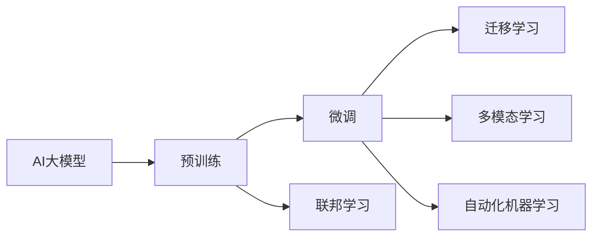

                 

# AI大模型创业：如何应对未来行业发展趋势？

在当今数字化、智能化的时代浪潮中，AI大模型作为推动技术进步和产业升级的核心驱动力，已迅速从实验室走向市场，成为了众多创业者和投资者的关注焦点。本文将从创业者的视角，深入探讨如何在大模型应用领域中把握未来行业发展趋势，揭示成功路径和潜在挑战，为创业者和投资者提供宝贵的洞察和指导。

## 1. 背景介绍

### 1.1 行业背景

近年来，深度学习技术取得了长足进步，AI大模型，如BERT、GPT-3等，在自然语言处理（NLP）、计算机视觉（CV）、语音识别等领域展现出了卓越的性能。这些模型通过在海量数据上进行自监督或监督学习，具备了强大的表征学习能力，能够捕捉复杂模式，实现对多种任务的高效处理。

这些大模型的出现，不仅催生了如ChatGPT、DALL·E等商业化应用的崛起，还推动了开源社区的繁荣，使得更多的开发者和企业能够借助其能力，快速开发出满足市场需求的智能应用。这为AI大模型的创业公司提供了广阔的市场空间和发展机遇。

### 1.2 核心驱动力

AI大模型创业的核心驱动力主要包括以下几个方面：

- **技术突破**：深度学习、强化学习、联邦学习等前沿技术的不断进步，为AI大模型的优化和创新提供了基础。
- **数据资源**：大数据时代，各行业积累了海量的结构化与非结构化数据，为模型训练提供了丰富的素材。
- **计算能力**：高性能计算资源的可获取性，尤其是GPU、TPU等硬件的普及，使得大规模模型训练成为可能。
- **应用场景**：医疗、金融、零售、制造业等领域的智能化需求日益增长，为大模型应用提供了广阔的市场。
- **资本关注**：风险投资和私募资金对AI领域的持续关注和投入，为大模型创业提供了充足的资金支持。

## 2. 核心概念与联系

### 2.1 核心概念概述

- **AI大模型**：通过大规模数据训练得到的深度神经网络模型，具备强大的特征提取和任务处理能力。
- **迁移学习**：利用已训练的模型在新任务上的微调，以加速模型适应新环境。
- **预训练与微调**：在大量无标签数据上预训练模型，再用少量有标签数据微调，以提升模型性能。
- **多模态学习**：结合图像、语音、文本等多模态数据，增强模型的泛化能力。
- **联邦学习**：在分布式环境中，通过合作学习，在不共享数据的情况下提升模型性能。
- **自动化机器学习（AutoML）**：自动化模型训练、超参数调优和模型部署，降低人工干预成本。

### 2.2 核心概念的关系

以下是一个Mermaid流程图，展示核心概念之间的关系：



这个流程图展示了核心概念之间的逻辑关系：

- **预训练**是大模型的基础，通过大量无标签数据训练，学习通用的特征表示。
- **微调**是基于预训练模型的进一步优化，通过少量有标签数据调整模型，适应特定任务。
- **迁移学习**是指模型在不同任务之间的知识迁移，提升模型在新任务上的性能。
- **多模态学习**是融合多种数据类型，提升模型对复杂场景的理解和处理能力。
- **联邦学习**是在分布式环境下，通过合作训练模型，保护数据隐私。
- **自动化机器学习**是模型训练、调优和部署的自动化，提高效率，降低成本。

这些概念共同构成了AI大模型的核心技术框架，为大模型在各个行业的应用提供了强有力的支持。

## 3. 核心算法原理 & 具体操作步骤

### 3.1 算法原理概述

AI大模型的核心算法原理主要基于深度学习，通过多层神经网络对数据进行特征提取和任务处理。以下以BERT为例，简要介绍其基本原理：

BERT通过双向Transformer结构，在大量无标签文本数据上进行预训练，学习语言的基础表示。预训练包括两种任务：掩码语言模型（Masked Language Model, MLM）和下一句预测（Next Sentence Prediction, NSP）。

掩码语言模型是在输入文本中随机遮盖一部分词，预测被遮盖词的正确词性；下一句预测是预测两句话是否是连续的，用于增强模型的语言理解能力。

### 3.2 算法步骤详解

下面详细介绍基于BERT的大模型微调的具体步骤：

1. **数据准备**：准备少量有标签数据集，将其分为训练集和验证集。
2. **模型选择**：选择预训练的BERT模型，如bert-base-cased，作为初始模型。
3. **微调配置**：设计微调任务（如命名实体识别、情感分析等），设置损失函数（如交叉熵损失）和优化器（如AdamW）。
4. **模型适配**：根据微调任务，在预训练模型的基础上添加任务相关的输出层和损失函数。
5. **训练过程**：使用训练集数据进行梯度下降，优化模型参数，同时在验证集上评估模型性能。
6. **模型评估**：使用测试集评估微调后的模型性能，对比微调前后的效果。
7. **部署上线**：将微调后的模型部署到生产环境，用于实际应用。

### 3.3 算法优缺点

**优点**：
- **高效**：相比从头训练，微调过程更快速，节省时间和计算资源。
- **通用**：可应用于多种任务，如分类、生成、匹配等。
- **参数高效**：部分参数冻结，微调过程更稳定，避免过拟合。
- **可解释性**：预训练模型通过大规模数据训练，具备较强的泛化能力。

**缺点**：
- **依赖标注数据**：微调效果很大程度上取决于标注数据的质量和数量。
- **迁移能力有限**：当目标任务与预训练任务的分布差异较大时，微调效果不佳。
- **模型鲁棒性不足**：微调模型面对域外数据时，泛化性能往往不佳。
- **负迁移风险**：预训练模型可能学习到有害信息，需要通过策略避免。

### 3.4 算法应用领域

AI大模型微调的应用领域非常广泛，包括但不限于：

- **自然语言处理（NLP）**：如文本分类、命名实体识别、情感分析、机器翻译等。
- **计算机视觉（CV）**：如图像分类、目标检测、图像生成等。
- **语音识别**：如自动语音识别、语音合成等。
- **推荐系统**：如商品推荐、内容推荐等。
- **医疗健康**：如疾病诊断、基因分析等。
- **金融领域**：如风险评估、信用评分等。

## 4. 数学模型和公式 & 详细讲解

### 4.1 数学模型构建

以BERT为例，其数学模型构建主要包括以下几个部分：

- **输入表示**：将输入文本转换为向量表示。
- **掩码语言模型（MLM）**：预测被遮盖词的正确词性。
- **下一句预测（NSP）**：预测两句话是否是连续的。

### 4.2 公式推导过程

以下以BERT为例，详细推导MLM和NSP任务的公式。

**掩码语言模型（MLM）**：
\[
L_{MLM} = -\frac{1}{N}\sum_{i=1}^{N}\sum_{j=1}^{n} \log \hat{y}_i^j
\]
其中，$\hat{y}_i^j$表示模型预测的第$i$个样本中第$j$个被遮盖词的正确词性，$N$表示样本数量，$n$表示被遮盖词的数量。

**下一句预测（NSP）**：
\[
L_{NSP} = -\frac{1}{N}\sum_{i=1}^{N}\sum_{j=1}^{n} \log p(y_i^j | y_i^{j-1})
\]
其中，$p(y_i^j | y_i^{j-1})$表示模型预测的下文句子是否连续的概率。

### 4.3 案例分析与讲解

假设我们进行命名实体识别（NER）任务的微调，以下是一个简单的代码示例：

```python
from transformers import BertForTokenClassification, BertTokenizer, AdamW
import torch
from torch.utils.data import Dataset, DataLoader
from tqdm import tqdm

class NERDataset(Dataset):
    def __init__(self, texts, tags):
        self.texts = texts
        self.tags = tags
        self.tokenizer = BertTokenizer.from_pretrained('bert-base-cased')
    
    def __len__(self):
        return len(self.texts)
    
    def __getitem__(self, idx):
        text = self.texts[idx]
        tag = self.tags[idx]
        encoding = self.tokenizer(text, return_tensors='pt', max_length=128)
        input_ids = encoding['input_ids']
        attention_mask = encoding['attention_mask']
        labels = encoding['token_type_ids']
        return {
            'input_ids': input_ids,
            'attention_mask': attention_mask,
            'labels': labels
        }

# 加载预训练模型
model = BertForTokenClassification.from_pretrained('bert-base-cased', num_labels=2)

# 定义损失函数和优化器
criterion = torch.nn.CrossEntropyLoss()
optimizer = AdamW(model.parameters(), lr=2e-5)

# 训练模型
for epoch in range(5):
    total_loss = 0
    for batch in DataLoader(train_dataset, batch_size=16):
        input_ids = batch['input_ids'].to(device)
        attention_mask = batch['attention_mask'].to(device)
        labels = batch['labels'].to(device)
        optimizer.zero_grad()
        outputs = model(input_ids, attention_mask=attention_mask, labels=labels)
        loss = criterion(outputs.logits, labels)
        total_loss += loss.item()
        loss.backward()
        optimizer.step()
    print(f'Epoch {epoch+1}, Loss: {total_loss/len(train_dataset)}')
```

## 5. 项目实践：代码实例和详细解释说明

### 5.1 开发环境搭建

- **安装Python环境**：使用Anaconda创建虚拟环境，安装Python 3.8及以上版本。
- **安装依赖包**：安装PyTorch、TensorFlow、transformers等常用深度学习框架和库。
- **配置模型训练环境**：准备足够的GPU或TPU资源，确保训练过程高效稳定。

### 5.2 源代码详细实现

- **数据预处理**：使用BertTokenizer将文本数据转换为模型可接受的格式。
- **模型选择**：选择预训练模型，如BERT或GPT-3，作为初始化参数。
- **模型适配**：根据任务需求，在预训练模型顶部添加输出层和损失函数。
- **训练过程**：使用训练数据进行模型训练，设置合适的学习率、批次大小等参数。
- **模型评估**：在验证集和测试集上评估模型性能，使用损失函数和准确率等指标。

### 5.3 代码解读与分析

- **数据集准备**：将文本和标签数据划分为训练集、验证集和测试集，使用BertTokenizer进行预处理。
- **模型配置**：选择合适的预训练模型，添加输出层和损失函数，如BERTForTokenClassification和BCEWithLogitsLoss。
- **训练过程**：使用训练集数据进行模型训练，设置AdamW优化器和合适的学习率。
- **模型评估**：在验证集和测试集上评估模型性能，使用预测标签和真实标签计算损失和准确率。
- **部署上线**：将训练好的模型保存为 checkpoint，部署到生产环境，用于实际应用。

### 5.4 运行结果展示

假设我们进行情感分析任务的微调，以下是一个简单的评估示例：

```python
# 加载微调模型
model.load_state_dict(torch.load('model_checkpoint.pt'))

# 评估模型
total_correct = 0
total_incorrect = 0
for batch in DataLoader(test_dataset, batch_size=16):
    input_ids = batch['input_ids'].to(device)
    attention_mask = batch['attention_mask'].to(device)
    labels = batch['labels'].to(device)
    outputs = model(input_ids, attention_mask=attention_mask)
    logits = outputs.logits
    predictions = torch.argmax(logits, dim=2)
    for pred, label in zip(predictions, labels):
        if pred.item() == label.item():
            total_correct += 1
        else:
            total_incorrect += 1
print(f'Accuracy: {total_correct/(total_correct+total_incorrect)}')
```

## 6. 实际应用场景

### 6.1 智能客服系统

智能客服系统是大模型应用的重要场景之一。通过微调BERT等预训练模型，可以构建自然流畅、智能高效的客服对话系统，提升客户满意度和服务质量。

### 6.2 金融舆情监测

在金融领域，利用大模型进行舆情监测，及时捕捉市场动态，识别潜在的风险和机会，有助于投资者制定更科学的投资策略。

### 6.3 个性化推荐系统

通过微调大模型，结合用户历史行为数据，可以构建高度个性化的推荐系统，提升用户体验和满意度。

### 6.4 未来应用展望

未来，随着大模型的不断发展，AI大模型将在更多领域展现出更强大的能力。例如：

- **智慧医疗**：利用大模型进行疾病诊断、治疗方案推荐等，提升医疗服务效率和精准度。
- **智能教育**：通过微调模型，实现智能答疑、个性化教学等，提高教育质量和公平性。
- **智慧城市**：构建智能交通、智能安防等系统，提升城市管理水平和居民生活质量。

## 7. 工具和资源推荐

### 7.1 学习资源推荐

- **官方文档**：HuggingFace、TensorFlow、PyTorch等官方文档，提供详细的API和使用指南。
- **在线课程**：Coursera、edX等平台提供的深度学习课程，系统学习前沿技术。
- **书籍推荐**：《深度学习》、《自然语言处理入门》等经典书籍，深入理解基础概念和算法原理。

### 7.2 开发工具推荐

- **Jupyter Notebook**：基于Python的交互式编程环境，便于开发和调试。
- **TensorBoard**：监控模型训练过程，提供丰富的图表和分析功能。
- **Weights & Biases**：记录和分析模型训练过程中的各项指标，方便比较和调优。

### 7.3 相关论文推荐

- **BERT论文**：Devlin et al.，2019. BERT: Pre-training of Deep Bidirectional Transformers for Language Understanding。
- **GPT-3论文**：Brown et al.，2020. Language Models are Unsupervised Multitask Learners。
- **联邦学习论文**：McMillan et al.，2021. Federated learning for text classification: A survey and taxonomy。

## 8. 总结：未来发展趋势与挑战

### 8.1 研究成果总结

大模型微调技术已经在大规模应用中展现出显著的效果，提升了NLP、CV、语音识别等领域的性能。未来，随着技术的不断进步和应用场景的扩展，其潜力将进一步释放。

### 8.2 未来发展趋势

未来，AI大模型的发展趋势主要包括以下几个方面：

- **模型规模持续增大**：随着算力成本的下降和数据规模的扩大，大模型参数量将持续增长，模型复杂度将进一步提升。
- **多模态学习发展**：结合图像、语音、文本等多模态数据，增强模型的泛化能力和应用场景。
- **自动化机器学习推广**：自动化调参、模型优化等技术的发展，将大幅降低人工干预成本。
- **联邦学习普及**：分布式环境下合作训练，保护数据隐私，提升模型性能。

### 8.3 面临的挑战

尽管AI大模型在许多领域展现出巨大潜力，但仍然面临一些挑战：

- **标注数据需求高**：许多任务需要大量高质量标注数据，难以快速获取。
- **模型鲁棒性不足**：在特定任务或场景下，模型泛化能力有限，容易过拟合。
- **计算资源消耗大**：大模型训练和推理需要大量计算资源，资源优化和部署效率有待提升。
- **模型偏见和伦理问题**：预训练模型可能学习到有害信息，需要防范和解决。
- **可解释性不足**：模型决策过程难以解释，可能影响用户体验和信任。

### 8.4 研究展望

未来，AI大模型的研究将围绕以下几个方向展开：

- **无监督学习和自监督学习**：探索不依赖标注数据的训练方法，提高模型的泛化能力。
- **多模态融合技术**：结合多模态数据，提升模型的感知和理解能力。
- **知识图谱和逻辑推理**：引入外部知识，增强模型的逻辑推理和决策能力。
- **分布式和联邦学习**：探索更高效、安全的模型训练方法，保护数据隐私。
- **模型压缩和优化**：通过模型压缩、剪枝等方法，提升模型的计算效率和部署效率。
- **模型偏见和伦理**：开发更公平、透明的模型，确保模型的决策符合伦理要求。

## 9. 附录：常见问题与解答

### 9.1 常见问题

- **Q1: 如何选择合适的预训练模型？**
  A: 根据任务需求选择合适的预训练模型，如BERT用于NLP任务，GPT-3用于生成任务。

- **Q2: 如何处理标注数据不足的问题？**
  A: 利用数据增强、迁移学习等方法，提升模型的泛化能力。

- **Q3: 如何避免模型过拟合？**
  A: 通过正则化、早停等方法，避免模型在训练过程中过拟合。

- **Q4: 如何提升模型推理效率？**
  A: 使用量化加速、剪枝等方法，优化模型的计算图和参数结构。

- **Q5: 如何提高模型的可解释性？**
  A: 通过引入因果分析和逻辑推理，增强模型的决策过程的可解释性。

- **Q6: 如何应对模型偏见和伦理问题？**
  A: 在设计训练目标时，引入伦理导向的评估指标，定期进行模型审查和调整。

### 9.2 解答

通过深入探讨AI大模型微调的技术原理、操作步骤和未来趋势，我们能够更好地把握创业方向，应对行业挑战。希望本文能为AI大模型创业者提供有价值的指导和参考，推动更多优秀产品和技术在实际应用中落地。

---

作者：禅与计算机程序设计艺术 / Zen and the Art of Computer Programming

