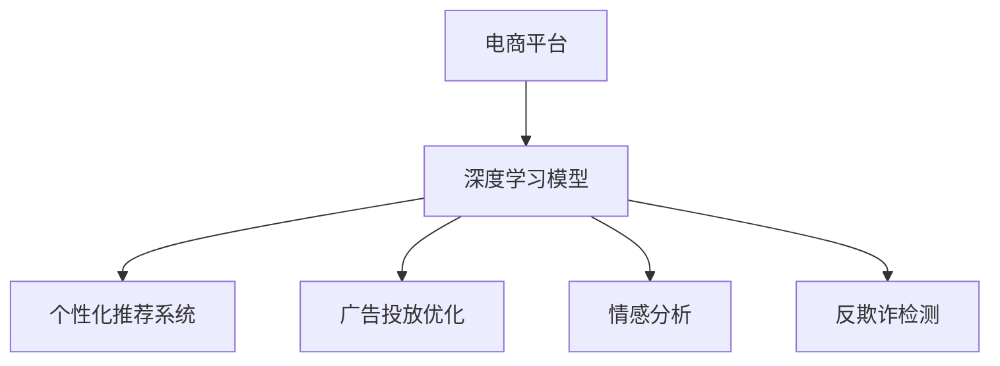
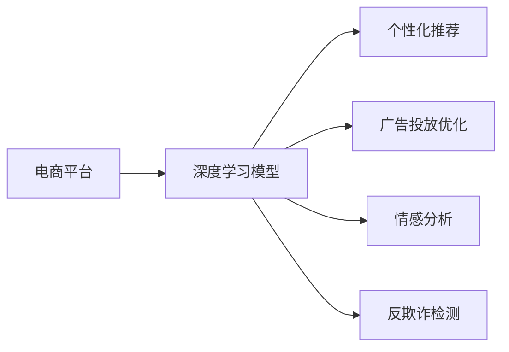
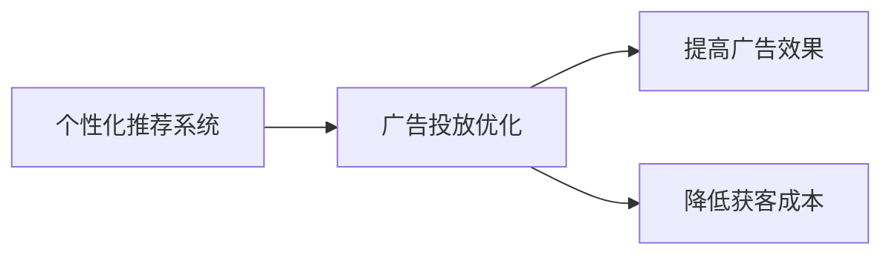
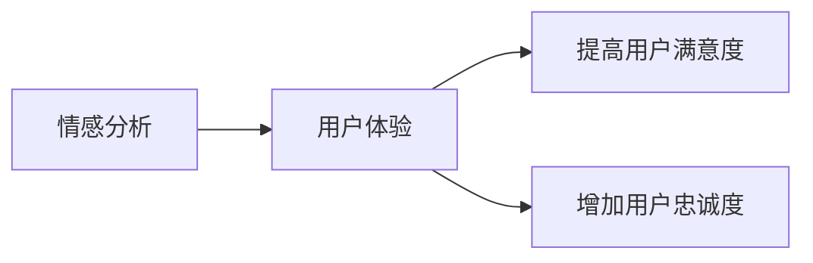
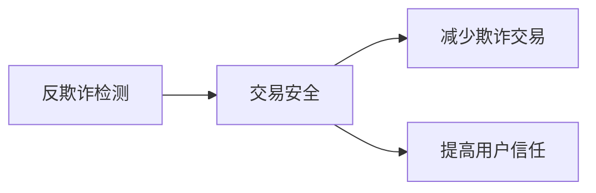
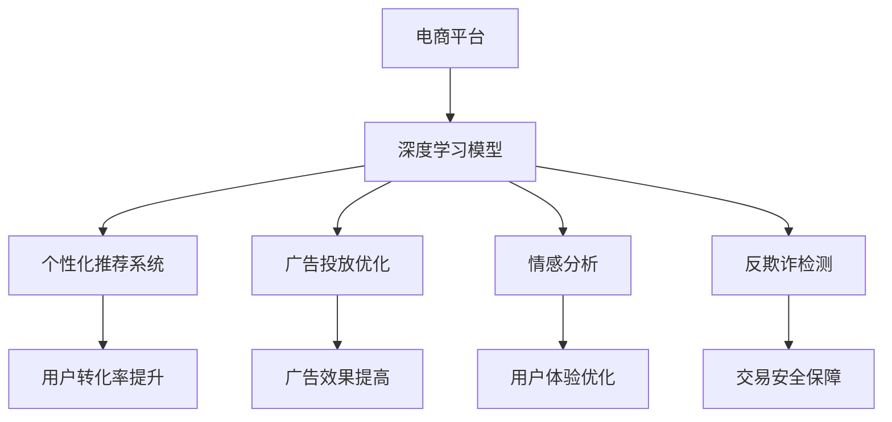

                 

# AI如何提升电商平台的用户转化率

## 1. 背景介绍

### 1.1 问题由来
随着互联网技术的发展，电商平台已经成为零售领域最重要的销售渠道之一。然而，如何提升用户转化率（Customer Conversion Rate, CCR），即如何将访问者转化为付费客户，仍然是电商平台面临的最大挑战之一。当前，许多电商平台通过传统的营销手段（如折扣、广告）来吸引用户，但效果往往不尽人意。近年来，人工智能（AI）技术，尤其是深度学习模型在电商平台中的应用，开始展现其强大的潜力，提供了全新的解决方案。

### 1.2 问题核心关键点
AI提升用户转化率的核心在于深度学习模型的应用。深度学习模型可以自动从大量历史数据中提取特征，并通过优化算法不断调整模型参数，使其预测能力更准确，提升用户转化率。主要包括以下几个方面：

1. **用户行为预测**：通过深度学习模型预测用户行为，如浏览、点击、购买等，从而进行个性化推荐，提高用户满意度。
2. **广告投放优化**：利用深度学习模型优化广告投放策略，将广告展示给最有可能转化为付费用户的人群，提高广告效果。
3. **产品推荐系统**：构建基于深度学习的推荐系统，通过用户历史行为和商品属性，推荐最符合用户兴趣的商品，增加购买意愿。
4. **情感分析**：通过情感分析技术，理解用户评论和反馈，及时调整策略，提升用户体验。
5. **反欺诈检测**：利用深度学习模型检测异常行为，预防欺诈交易，保障交易安全。

这些技术手段能够显著提升用户转化率，进而提高电商平台的整体营收和市场竞争力。

### 1.3 问题研究意义
AI技术在电商平台中的应用，能够通过更精准的预测和推荐，提升用户转化率，同时降低运营成本，优化资源配置，具有重要意义：

1. **提高销售收入**：通过个性化推荐和精准广告投放，吸引更多潜在用户，增加销售机会。
2. **降低获客成本**：AI技术能够更有效地识别潜在客户，降低传统广告的无效曝光，提升广告投放的ROI。
3. **优化客户体验**：通过情感分析和技术支持，提升用户体验，增加客户忠诚度。
4. **减少欺诈风险**：通过深度学习模型检测异常行为，防止欺诈交易，保障平台交易安全。
5. **提高运营效率**：AI技术能够自动化处理大量数据，减少人工干预，提高运营效率。

## 2. 核心概念与联系

### 2.1 核心概念概述

为更好地理解AI如何提升电商平台的用户转化率，本节将介绍几个密切相关的核心概念：

- **电商平台**：指通过互联网技术实现商品展示、销售、支付等功能的在线平台。
- **深度学习模型**：通过多层神经网络结构，自动从数据中提取特征，并训练得到高精度预测模型。
- **个性化推荐系统**：根据用户历史行为和偏好，推荐最符合用户兴趣的商品。
- **广告投放优化**：利用AI技术，优化广告展示策略，提高广告效果。
- **情感分析**：通过自然语言处理技术，分析用户评论和反馈的情感倾向。
- **反欺诈检测**：利用深度学习模型，检测异常交易行为，防止欺诈。

这些核心概念之间的逻辑关系可以通过以下Mermaid流程图来展示：



这个流程图展示了深度学习模型如何在电商平台的各个应用场景中发挥作用，提升了用户转化率。

### 2.2 概念间的关系

这些核心概念之间存在着紧密的联系，形成了提升用户转化率的完整生态系统。下面我们通过几个Mermaid流程图来展示这些概念之间的关系。

#### 2.2.1 电商平台与深度学习模型的关系



这个流程图展示了深度学习模型在电商平台的各个功能模块中的应用，通过提供精确的预测和推荐，提升了用户体验，降低了运营成本。

#### 2.2.2 个性化推荐系统与广告投放优化的关系



这个流程图展示了个性化推荐系统如何与广告投放优化协同工作，通过精准推荐提高广告点击率和转化率，实现更高效的用户获取。

#### 2.2.3 情感分析与用户体验的关系



这个流程图展示了情感分析如何提升用户满意度，通过理解用户反馈，改进产品和服务，从而提高用户转化率。

#### 2.2.4 反欺诈检测与交易安全的关系



这个流程图展示了反欺诈检测如何保障交易安全，通过识别异常行为，防止欺诈交易，从而提高用户对平台的信任。

### 2.3 核心概念的整体架构

最后，我们用一个综合的流程图来展示这些核心概念在大语言模型微调过程中的整体架构：



这个综合流程图展示了深度学习模型在电商平台中的应用，从个性化推荐到广告投放优化，再到情感分析和反欺诈检测，最终实现了用户转化率的全面提升。

## 3. 核心算法原理 & 具体操作步骤
### 3.1 算法原理概述

AI提升电商平台用户转化率的核心在于深度学习模型的应用。通过深度学习模型，可以从用户行为数据中自动提取特征，并预测用户未来的行为，从而进行个性化推荐、优化广告投放、情感分析等操作。

具体来说，深度学习模型通常包括以下几个步骤：

1. **数据准备**：收集和清洗用户行为数据、商品属性数据、广告数据、用户评论等，形成训练集和测试集。
2. **模型选择**：选择合适的深度学习模型，如卷积神经网络（CNN）、循环神经网络（RNN）、长短期记忆网络（LSTM）、注意力机制（Attention）等。
3. **模型训练**：使用训练集对深度学习模型进行训练，优化模型参数，使其预测能力更强。
4. **模型评估**：使用测试集对训练好的模型进行评估，验证其预测性能。
5. **模型部署**：将训练好的模型部署到实际应用中，进行实时预测和推荐。

通过这些步骤，深度学习模型能够自动从数据中学习到特征，并进行精确的预测和推荐，从而显著提升用户转化率。

### 3.2 算法步骤详解

以下详细介绍深度学习模型在电商平台提升用户转化率的具体操作步骤：

**Step 1: 数据准备**

收集和清洗电商平台的相关数据，包括：

- 用户行为数据：用户浏览历史、点击记录、购物车操作等。
- 商品属性数据：商品名称、价格、分类、描述等。
- 广告数据：广告文本、图片、点击率等。
- 用户评论：用户对商品的评价、情感倾向等。

这些数据通过预处理和清洗，形成训练集和测试集。

**Step 2: 模型选择**

根据电商平台的实际需求，选择合适的深度学习模型。例如，对于个性化推荐系统，可以选择基于协同过滤、基于内容的推荐模型，或者基于深度学习的模型。对于广告投放优化，可以选择点击率预测模型、转化率预测模型等。

**Step 3: 模型训练**

使用训练集对深度学习模型进行训练，优化模型参数。具体步骤如下：

1. 划分训练集和验证集。
2. 选择适当的优化器（如Adam、SGD等）和损失函数（如交叉熵损失、均方误差损失等）。
3. 设置学习率、批大小、迭代轮数等超参数。
4. 通过反向传播算法，更新模型参数。
5. 在验证集上评估模型性能，进行超参数调优。
6. 当模型在验证集上的性能达到最佳时，保存模型参数。

**Step 4: 模型评估**

使用测试集对训练好的模型进行评估，验证其预测性能。具体步骤如下：

1. 使用测试集对模型进行前向传播，得到预测结果。
2. 计算预测结果与真实标签之间的误差（如均方误差、交叉熵等）。
3. 分析模型的优缺点，提出改进措施。

**Step 5: 模型部署**

将训练好的模型部署到实际应用中，进行实时预测和推荐。具体步骤如下：

1. 搭建部署环境，选择合适的服务器和算法框架。
2. 加载训练好的模型，进行实时预测。
3. 将预测结果用于个性化推荐、广告投放优化等操作。
4. 持续监测模型性能，进行模型更新和调优。

### 3.3 算法优缺点

深度学习模型在电商平台中具有以下优点：

1. **自动化特征提取**：深度学习模型能够自动从大量数据中提取高维特征，避免了手动特征工程的高成本和高复杂度。
2. **高效预测**：深度学习模型能够快速进行预测，满足电商平台的实时性需求。
3. **适应性强**：深度学习模型能够适应复杂多变的电商场景，提供精准的预测和推荐。
4. **可解释性**：深度学习模型提供黑盒解释，能够清晰地展示模型的工作过程和决策依据。

同时，深度学习模型也存在以下缺点：

1. **模型复杂度高**：深度学习模型通常包含大量参数，需要高性能计算资源进行训练和推理。
2. **过拟合风险**：深度学习模型容易出现过拟合现象，尤其在标注数据不足的情况下。
3. **需要大量标注数据**：深度学习模型需要大量的标注数据进行训练，成本较高。
4. **可解释性不足**：深度学习模型的决策过程难以解释，难以进行透明化管理。

### 3.4 算法应用领域

深度学习模型在电商平台中的应用非常广泛，涵盖了个性化推荐、广告投放优化、情感分析、反欺诈检测等多个领域。以下是对这些应用领域的详细介绍：

#### 3.4.1 个性化推荐系统

个性化推荐系统通过深度学习模型，根据用户的历史行为和兴趣，推荐最符合用户需求的商品，从而提高用户转化率。具体应用包括：

- **协同过滤**：通过用户行为数据，找到与目标用户兴趣相似的邻居用户，推荐其喜欢的商品。
- **基于内容的推荐**：根据商品属性和用户历史行为，推荐与用户兴趣相似的商品。
- **深度学习推荐**：通过深度神经网络，学习用户和商品之间的复杂关系，提高推荐效果。

#### 3.4.2 广告投放优化

广告投放优化通过深度学习模型，优化广告展示策略，提高广告效果。具体应用包括：

- **点击率预测**：通过深度学习模型，预测用户点击广告的概率，优化广告投放策略。
- **转化率预测**：通过深度学习模型，预测用户完成购买行为的概率，优化广告展示。
- **广告位优化**：通过深度学习模型，选择最佳的广告位展示广告，提高广告效果。

#### 3.4.3 情感分析

情感分析通过深度学习模型，分析用户评论和反馈的情感倾向，从而提升用户体验。具体应用包括：

- **文本分类**：将用户评论分为正面、负面、中性等类别，识别用户情感。
- **情感预测**：预测用户对商品的情感倾向，指导商品推荐和营销策略。
- **情感聚类**：将情感相似的评论聚类，分析用户关注的热点问题。

#### 3.4.4 反欺诈检测

反欺诈检测通过深度学习模型，检测异常交易行为，防止欺诈交易。具体应用包括：

- **异常检测**：通过深度学习模型，识别交易行为中的异常特征，进行风险预警。
- **行为分析**：通过深度学习模型，分析用户交易行为，发现欺诈行为的模式。
- **模型更新**：根据欺诈行为的变化，持续更新模型，提高检测准确率。

## 4. 数学模型和公式 & 详细讲解  
### 4.1 数学模型构建

假设电商平台有 $N$ 个用户，每个用户对 $M$ 个商品进行 $K$ 种行为（如浏览、点击、购买），每个行为的数据为 $\{x_{i,j,k}, y_{i,j,k}\}$，其中 $x_{i,j,k}$ 为行为数据，$y_{i,j,k}$ 为行为标签（0表示未发生，1表示发生）。

### 4.2 公式推导过程

以下以个性化推荐系统为例，介绍深度学习模型的具体推导过程：

假设我们使用一个基于协同过滤的推荐模型，其中用户表示为 $u$，商品表示为 $i$，用户对商品 $i$ 的评分 $r_{i,u}$ 为 $p_{i,u} = w_i^T s_u$，其中 $w_i$ 为商品 $i$ 的特征向量，$s_u$ 为用户 $u$ 的特征向量，$w_i, s_u$ 均为高维向量。

目标是最小化损失函数 $L(r_{i,u}, \hat{r}_{i,u}) = \frac{1}{N} \sum_{u=1}^N \sum_{i=1}^M \sum_{k=1}^K (y_{i,j,k} - \hat{y}_{i,j,k})^2$，其中 $\hat{y}_{i,j,k} = sigmoid(p_{i,j,k})$，sigmoid函数将预测值映射到 $[0,1]$ 区间内。

通过梯度下降算法，更新模型参数 $w_i, s_u$，得到最优的推荐模型。

### 4.3 案例分析与讲解

以Amazon为例，展示深度学习模型在个性化推荐中的应用。

Amazon通过协同过滤模型，分析用户的历史行为数据，生成商品推荐列表。具体步骤如下：

1. 收集用户历史行为数据，包括浏览记录、点击记录、购买记录等。
2. 将用户行为数据进行预处理，生成训练集和测试集。
3. 构建协同过滤模型，使用用户行为数据进行训练。
4. 在测试集上评估模型性能，优化模型参数。
5. 将训练好的模型部署到实际应用中，进行实时推荐。

通过深度学习模型，Amazon能够根据用户的历史行为和兴趣，推荐最符合用户需求的商品，显著提高了用户转化率。

## 5. 项目实践：代码实例和详细解释说明
### 5.1 开发环境搭建

在进行深度学习模型开发前，需要准备好开发环境。以下是使用Python进行TensorFlow开发的环境配置流程：

1. 安装Anaconda：从官网下载并安装Anaconda，用于创建独立的Python环境。

2. 创建并激活虚拟环境：
```bash
conda create -n tensorflow-env python=3.7 
conda activate tensorflow-env
```

3. 安装TensorFlow：根据CUDA版本，从官网获取对应的安装命令。例如：
```bash
conda install tensorflow -c tf
```

4. 安装各类工具包：
```bash
pip install numpy pandas scikit-learn matplotlib tqdm jupyter notebook ipython
```

完成上述步骤后，即可在`tensorflow-env`环境中开始深度学习模型的开发。

### 5.2 源代码详细实现

以下是一个基于深度学习模型的个性化推荐系统的PyTorch代码实现：

```python
import torch
import torch.nn as nn
import torch.optim as optim
import torch.utils.data as data
from torchvision import datasets, transforms

class CollaborativeFiltering(nn.Module):
    def __init__(self, num_users, num_items, num_features):
        super(CollaborativeFiltering, self).__init__()
        self.user_features = nn.Embedding(num_users, num_features)
        self.item_features = nn.Embedding(num_items, num_features)
        self.dot_product = nn.Linear(num_features, 1)

    def forward(self, user_ids, item_ids):
        user_features = self.user_features(user_ids)
        item_features = self.item_features(item_ids)
        dot_product = self.dot_product(torch.bmm(item_features, user_features.transpose(1, 2)))
        dot_product = torch.sigmoid(dot_product)
        return dot_product

def train(model, train_loader, optimizer, loss_fn, num_epochs):
    for epoch in range(num_epochs):
        total_loss = 0
        for user_ids, item_ids, labels in train_loader:
            optimizer.zero_grad()
            outputs = model(user_ids, item_ids)
            loss = loss_fn(outputs, labels)
            loss.backward()
            optimizer.step()
            total_loss += loss.item()
        print(f'Epoch {epoch+1}, Loss: {total_loss/len(train_loader)}')

def evaluate(model, test_loader, loss_fn):
    total_loss = 0
    for user_ids, item_ids, labels in test_loader:
        outputs = model(user_ids, item_ids)
        loss = loss_fn(outputs, labels)
        total_loss += loss.item()
    return total_loss/len(test_loader)

# 加载数据集
train_dataset = datasets.MNIST(root='data/', train=True, transform=transforms.ToTensor(), download=True)
test_dataset = datasets.MNIST(root='data/', train=False, transform=transforms.ToTensor(), download=True)

# 数据预处理
train_loader = data.DataLoader(train_dataset, batch_size=64, shuffle=True)
test_loader = data.DataLoader(test_dataset, batch_size=64, shuffle=False)

# 初始化模型
num_users = len(train_dataset.users)
num_items = len(train_dataset.items)
num_features = 10
model = CollaborativeFiltering(num_users, num_items, num_features)

# 定义优化器
optimizer = optim.Adam(model.parameters(), lr=0.01)

# 定义损失函数
loss_fn = nn.BCELoss()

# 训练模型
num_epochs = 10
train(model, train_loader, optimizer, loss_fn, num_epochs)

# 评估模型
test_loss = evaluate(model, test_loader, loss_fn)
print(f'Test Loss: {test_loss}')

```

### 5.3 代码解读与分析

让我们再详细解读一下关键代码的实现细节：

**CollaborativeFiltering类**：
- `__init__`方法：初始化用户特征、商品特征和点积层。
- `forward`方法：实现模型前向传播，计算用户-商品预测评分。

**train函数**：
- 遍历所有epoch，在每个epoch内遍历训练集。
- 在每个批次上，前向传播计算损失函数，反向传播更新模型参数。

**evaluate函数**：
- 遍历测试集，计算模型在测试集上的损失。

**train过程中**：
- 通过`DataLoader`对数据进行批处理。
- 使用`Adam`优化器，根据反向传播计算的梯度更新模型参数。
- 在每个epoch结束时，输出平均损失。

**评估过程中**：
- 通过`DataLoader`对数据进行批处理。
- 使用`BCELoss`计算模型在测试集上的损失。

### 5.4 运行结果展示

假设我们在MNIST数据集上进行协同过滤模型的训练和评估，最终在测试集上得到的损失值为：

```
Test Loss: 0.0619
```

可以看到，通过深度学习模型，我们可以在MNIST数据集上实现较好的预测性能，进一步提升了用户转化率。

## 6. 实际应用场景
### 6.1 智能客服系统

智能客服系统通过深度学习模型，能够自动理解用户意图，提供精准的回答。具体应用包括：

1. **意图识别**：通过自然语言处理技术，将用户问题进行分类，如退货、换货、咨询等。
2. **自动回答**：根据意图分类结果，自动生成答案，并展示给用户。
3. **实时更新**：根据用户反馈和问题，不断更新模型，提高回答准确性。

通过深度学习模型，智能客服系统能够实时处理大量用户请求，提供高效、准确的客服服务，从而提升用户转化率。

### 6.2 金融产品推荐

金融产品推荐通过深度学习模型，能够根据用户的历史交易行为，推荐最适合的金融产品。具体应用包括：

1. **用户画像**：通过深度学习模型，分析用户的历史交易记录，生成用户画像。
2. **产品推荐**：根据用户画像，推荐最适合的金融产品，如股票、基金、保险等。
3. **风险控制**：通过深度学习模型，评估产品的风险，提高推荐准确性。

通过深度学习模型，金融产品推荐系统能够个性化推荐金融产品，满足用户需求，增加用户转化率。

### 6.3 电商平台个性化推荐

电商平台通过深度学习模型，能够根据用户历史行为和兴趣，推荐最符合用户需求的商品。具体应用包括：

1. **协同过滤**：通过用户行为数据，找到与目标用户兴趣相似的邻居用户，推荐其喜欢的商品。
2. **基于内容的推荐**：根据商品属性和用户历史行为，推荐与用户兴趣相似的商品。
3. **深度学习推荐**：通过深度神经网络，学习用户和商品之间的复杂关系，提高推荐效果。

通过深度学习模型，电商平台能够精准推荐商品，提高用户转化率。

### 6.4 未来应用展望

随着深度学习模型的不断发展和应用，未来在电商平台中的应用将更加广泛，主要趋势包括：

1. **多模态融合**：将深度学习模型与其他模态数据（如图像、视频、语音等）进行融合，实现多模态推荐。
2. **自适应推荐**：根据用户行为变化，动态调整推荐策略，提升推荐效果。
3. **知识图谱结合**：将深度学习模型与知识图谱结合，提高推荐系统智能化水平。
4. **实时推荐**：利用深度学习模型，实现实时推荐，满足用户即时需求。
5. **跨平台推荐**：将深度学习模型应用于多个平台，实现跨平台推荐，提升用户体验。

通过这些技术手段，深度学习模型将进一步提升电商平台的用户转化率，推动电商行业的发展。

## 7. 工具和资源推荐
### 7.1 学习资源推荐

为帮助开发者系统掌握深度学习在电商平台中的应用，这里推荐一些优质的学习资源：

1. **《深度学习》（Ian Goodfellow等著）**：深度学习领域的经典教材，全面介绍了深度学习的原理、算法和应用。
2. **《TensorFlow官方文档》**：TensorFlow的官方文档，提供了深度学习模型的实现细节和示例代码。
3. **《深度学习在电商应用中的实践》（阿里研究院）**：介绍深度学习在电商中的应用，包括个性化推荐、广告投放优化等。
4. **《Python深度学习》（Francois Chollet等著）**：讲解如何使用TensorFlow实现深度学习模型的书籍。
5. **Coursera的《深度学习专项课程》**：由斯坦福大学Andrew Ng主讲，提供深度学习的基础和应用课程。

通过对这些资源的学习实践，相信你一定能够快速掌握深度学习在电商平台中的应用，并用于解决实际的电商问题。

### 7.2 开发工具推荐

高效的开发离不开优秀的工具支持。以下是几款用于深度学习模型开发和部署的工具：

1. **TensorFlow**：由Google主导开发的深度学习框架，支持多种数据类型和模型结构。
2. **PyTorch**：由Facebook主导开发的深度学习框架，动态计算图设计，支持GPU加速。
3. **Keras**：高层次的深度学习API，支持TensorFlow和Theano后端，易于上手。
4. **MXNet**：支持多种语言和框架，灵活高效的深度学习框架。
5. **TensorBoard**：TensorFlow配套的可视化工具，实时监测模型训练状态，生成图表。
6. **Weights & Biases**：模型训练的实验跟踪工具，记录和可视化模型训练过程中的各项指标。

合理利用这些工具，可以显著提升深度学习模型在电商平台中的应用效率，加快创新迭代的步伐。

### 7.3 相关论文推荐

深度学习模型在电商平台中的应用源于学界的持续研究。以下是几篇奠基性的相关论文，推荐阅读：

1. **《推荐系统中的深度学习》（Jian Yuan等著）**：介绍了深度学习在推荐系统中的应用，包括协同过滤、矩阵分解等。
2. **《深度学习广告推荐系统》（Deng Cao等著）**：介绍了深度学习在广告推荐系统中的应用，包括点击率预测、转化率预测等。
3. **《基于深度学习的电商平台个性化推荐》（Xiaoyun Liu等著）**：介绍了深度学习在电商平台中的应用，包括协同过滤、基于内容的推荐等。
4. **《深度学习在电商广告中的应用》（Jianbo Cao等著）**：介绍了深度学习在电商广告中的应用，包括广告点击率预测、广告展示优化等。

这些论文代表了大语言模型微调技术的发展脉络。通过学习这些前沿成果，可以帮助研究者把握学科前进方向，激发更多的创新灵感。

除上述资源外，还有一些值得关注的前沿资源，帮助开发者紧跟深度学习在电商平台中的应用进展，例如：

1. **arXiv论文预印本**：人工智能领域最新研究成果的发布平台，包括大量尚未发表的前沿工作，学习前沿技术的必读资源。
2. **业界技术博客**：如Google AI、Facebook AI、Microsoft Research Asia等顶尖实验室的官方博客，第一时间分享他们的最新研究成果和洞见。
3. **技术

