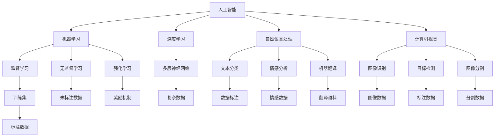
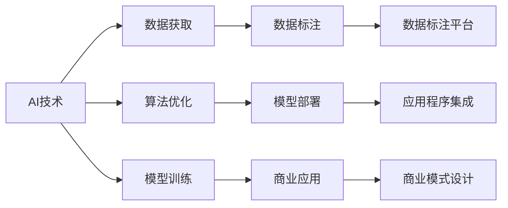
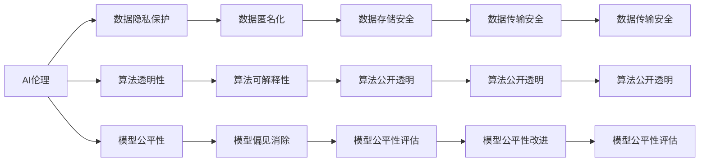

                 

## 1. 背景介绍

### 1.1 问题由来
人工智能(AI)技术的发展在过去几年取得了突飞猛进的进展。从深度学习到强化学习，从自然语言处理到计算机视觉，AI技术正在深刻地改变着各个行业。然而，AI技术如何转化为实际商业价值，一直是一个值得深思的问题。特别是在当前商业竞争激烈的环境下，如何将AI技术与商业模式创新相结合，实现技术商业化和可持续增长，成为了行业内外广泛关注的话题。

### 1.2 问题核心关键点
AI技术在商业化应用中面临着诸多挑战，其中最为关键的包括：
- **数据获取与标注**：高质量的数据是AI模型训练的基础，但数据的获取和标注成本高昂，如何降低数据获取成本，提高数据标注质量，是AI商业化的首要难题。
- **算法优化与模型训练**：模型训练需要大量的计算资源和时间，如何在资源受限的情况下，快速训练出高性能的模型，是AI商业化的核心问题。
- **模型部署与集成**：如何将训练好的模型部署到实际应用中，并与现有系统无缝集成，是AI技术商业化的重要环节。
- **商业模式设计**：如何设计合理的商业模式，将AI技术转化为可持续的收入流，是AI商业化的终极目标。

### 1.3 问题研究意义
研究AI技术与商业模式的创新，对于推动AI技术的落地应用、优化商业模式设计、加速产业数字化转型具有重要意义：

1. **加速AI技术的落地应用**：通过优化数据获取、算法优化和模型部署，可以大幅降低AI技术的商业化门槛，加速AI技术在各行业中的推广和应用。
2. **优化商业模式设计**：通过设计合理的商业模式，可以最大化AI技术的商业价值，实现技术商业化和可持续增长。
3. **推动产业数字化转型**：AI技术在商业化应用中，可以帮助企业提升效率、降低成本、增强竞争优势，从而推动整个行业的数字化转型和升级。

## 2. 核心概念与联系

### 2.1 核心概念概述

为更好地理解AI技术与商业模式的创新，本节将介绍几个关键概念：

- **人工智能(AI)**：基于数据和算法，使计算机能够模拟和扩展人类智能的技术，包括但不限于机器学习、深度学习、自然语言处理等。
- **机器学习(ML)**：利用数据和算法，使计算机能够自动学习和改进的技术，包括监督学习、无监督学习、强化学习等。
- **深度学习(Deep Learning)**：一种特殊类型的机器学习，通过多层神经网络结构，实现对复杂数据的高级抽象和建模。
- **自然语言处理(NLP)**：使计算机能够理解、处理和生成自然语言的技术，包括文本分类、情感分析、机器翻译等。
- **计算机视觉(CV)**：使计算机能够理解、分析和处理图像和视频数据的技术，包括图像识别、目标检测、图像分割等。
- **推荐系统(Recommendation System)**：通过分析用户行为和偏好，向用户推荐感兴趣的商品、内容或服务的技术。
- **决策支持系统(DSS)**：利用AI技术辅助决策，帮助管理者在复杂环境中做出明智决策的系统。
- **AI伦理**：在AI技术应用中，如何平衡技术进步与伦理道德，保护用户隐私、确保数据安全、避免算法偏见等问题。

这些核心概念之间的逻辑关系可以通过以下Mermaid流程图来展示：



这个流程图展示了一些核心概念之间的关系：

1. 人工智能是机器学习、深度学习、自然语言处理和计算机视觉等技术的基础。
2. 机器学习包括监督学习、无监督学习和强化学习三种主要范式。
3. 深度学习采用多层神经网络结构，处理复杂数据。
4. 自然语言处理包括文本分类、情感分析、机器翻译等任务。
5. 计算机视觉包括图像识别、目标检测、图像分割等任务。

这些概念共同构成了AI技术的核心框架，为其在商业化应用中提供了强大的技术支持。

### 2.2 概念间的关系

这些核心概念之间存在着紧密的联系，形成了AI技术与商业模式创新的完整生态系统。下面我们通过几个Mermaid流程图来展示这些概念之间的关系。

#### 2.2.1 AI技术与商业模式的结合



这个流程图展示了AI技术在商业化应用中的主要流程：

1. 通过数据获取和标注，收集高质量的数据。
2. 利用算法优化和模型训练，构建高性能的AI模型。
3. 将训练好的模型部署到应用程序中，并与现有系统无缝集成。
4. 设计合理的商业模式，将AI技术转化为可持续的收入流。

#### 2.2.2 AI伦理与商业模式的结合



这个流程图展示了AI伦理在商业模式中的重要角色：

1. 数据隐私保护、算法透明性和模型公平性是AI伦理的关键方面。
2. 数据匿名化、数据存储安全和数据传输安全等技术手段，保护用户隐私和数据安全。
3. 算法公开透明、算法可解释性和模型公平性评估等措施，确保算法的透明性和公平性。
4. 模型公平性改进和模型偏见消除等技术手段，避免算法偏见和歧视。

## 3. 核心算法原理 & 具体操作步骤

### 3.1 算法原理概述

AI技术与商业模式的创新，本质上是一个将AI技术转化为商业价值的流程。这一过程涉及到数据获取、算法优化、模型训练、模型部署和商业模式设计等多个环节。其中，监督学习和深度学习是两个最为核心的算法原理。

#### 3.1.1 监督学习

监督学习是利用已有标注数据，通过训练模型，使其能够预测新数据的标签或类别。其基本流程如下：

1. **数据准备**：收集和处理数据，包括清洗、归一化、标注等。
2. **模型选择**：选择适合的算法模型，如线性回归、决策树、支持向量机等。
3. **模型训练**：利用标注数据训练模型，优化模型参数，使其最小化预测误差。
4. **模型评估**：使用验证集或测试集评估模型性能，如准确率、召回率、F1分数等。
5. **模型部署**：将训练好的模型部署到实际应用中，进行实时预测或推荐。

#### 3.1.2 深度学习

深度学习是一种特殊的监督学习，通过多层神经网络结构，实现对复杂数据的高级抽象和建模。其基本流程如下：

1. **数据准备**：收集和处理数据，包括清洗、归一化、标注等。
2. **模型设计**：设计多层神经网络结构，选择合适的激活函数、损失函数等。
3. **模型训练**：利用标注数据训练模型，反向传播更新模型参数，最小化预测误差。
4. **模型评估**：使用验证集或测试集评估模型性能，如交叉熵、均方误差等。
5. **模型部署**：将训练好的模型部署到实际应用中，进行实时预测或推荐。

### 3.2 算法步骤详解

#### 3.2.1 数据获取与标注

数据获取与标注是AI技术与商业模式创新的第一步。以下是详细的步骤：

1. **数据收集**：从公开数据集、在线平台、合作伙伴等渠道收集数据。
2. **数据清洗**：去除噪声、重复、异常数据，确保数据质量。
3. **数据标注**：对数据进行标注，包括分类、标注、排序等。
4. **数据增强**：通过数据增强技术，扩充数据集，如旋转、缩放、裁剪等。
5. **数据划分**：将数据集划分为训练集、验证集和测试集。

#### 3.2.2 算法优化与模型训练

算法优化与模型训练是AI技术与商业模式创新的核心步骤。以下是详细的步骤：

1. **算法选择**：选择合适的算法，如回归、分类、聚类等。
2. **模型设计**：设计模型结构，选择合适的层数、激活函数、正则化等。
3. **超参数调优**：调整学习率、批大小、迭代轮数等超参数，优化模型性能。
4. **模型训练**：利用训练集训练模型，优化模型参数，最小化预测误差。
5. **模型评估**：使用验证集或测试集评估模型性能，如准确率、召回率、F1分数等。

#### 3.2.3 模型部署与集成

模型部署与集成是AI技术与商业模式创新的最后一步。以下是详细的步骤：

1. **模型部署**：将训练好的模型部署到实际应用中，进行实时预测或推荐。
2. **模型集成**：将模型与现有系统无缝集成，如API接口、微服务、中台等。
3. **系统优化**：优化系统性能，如缓存、负载均衡、弹性伸缩等。
4. **用户反馈**：收集用户反馈，不断优化模型和系统。

#### 3.2.4 商业模式设计

商业模式设计是AI技术与商业模式创新的关键步骤。以下是详细的步骤：

1. **市场分析**：分析市场需求和竞争环境，确定商业目标。
2. **产品设计**：设计符合市场需求的产品，包括功能、界面、用户体验等。
3. **定价策略**：确定产品的定价策略，如免费、订阅、按需付费等。
4. **营销策略**：制定营销策略，推广产品，吸引用户。
5. **收益模式**：设计收益模式，实现商业化和可持续增长。

### 3.3 算法优缺点

AI技术与商业模式创新的算法具有以下优点：

1. **高精度**：深度学习算法在处理复杂数据时，通常能够取得较高的精度。
2. **自适应性强**：深度学习算法能够根据数据变化进行自我调整，适应新的业务场景。
3. **可扩展性强**：深度学习算法可以轻易地扩展到更大的数据集和更复杂的网络结构。

同时，AI技术与商业模式创新的算法也存在一些缺点：

1. **计算资源要求高**：深度学习算法需要大量的计算资源和时间，成本较高。
2. **数据依赖性强**：深度学习算法的性能高度依赖于数据质量和数据量，数据获取成本较高。
3. **可解释性差**：深度学习算法的决策过程通常缺乏可解释性，难以理解和调试。

### 3.4 算法应用领域

AI技术与商业模式创新的算法在多个领域得到了广泛应用，以下是一些主要的应用领域：

1. **金融领域**：利用AI技术进行风险控制、信用评估、投资策略等。
2. **医疗领域**：利用AI技术进行疾病预测、医学影像分析、药物研发等。
3. **零售领域**：利用AI技术进行客户行为分析、个性化推荐、库存管理等。
4. **制造业**：利用AI技术进行生产调度、质量检测、供应链管理等。
5. **智能交通**：利用AI技术进行交通流量预测、自动驾驶、智能监控等。
6. **智能家居**：利用AI技术进行智能控制、环境监测、安全防范等。
7. **能源领域**：利用AI技术进行能源管理、智能电网、能源预测等。

## 4. 数学模型和公式 & 详细讲解 & 举例说明

### 4.1 数学模型构建

在AI技术与商业模式创新的过程中，数学模型是核心工具之一。以下是一些常用的数学模型：

1. **线性回归模型**：
   $$
   y = \beta_0 + \beta_1 x_1 + \beta_2 x_2 + ... + \beta_n x_n + \epsilon
   $$
   其中，$y$为预测值，$x_i$为自变量，$\beta_i$为系数，$\epsilon$为误差项。

2. **决策树模型**：
   $$
   T = \{r, \{t_l, t_r\} | t_l, t_r \in T, r \in \mathcal{R}\}
   $$
   其中，$T$为决策树，$r$为节点，$t_l, t_r$为子节点，$\mathcal{R}$为属性集合。

3. **支持向量机模型**：
   $$
   \min_{\beta, \xi} \frac{1}{2}\beta^T \beta + C\sum_{i=1}^n \xi_i \\
   \text{subject to} \quad y_i(\beta^T \varphi(x_i) + b) \geq 1 - \xi_i \\
   \xi_i \geq 0
   $$
   其中，$\beta$为权重向量，$\xi$为松弛变量，$C$为惩罚系数。

4. **深度学习模型**：
   $$
   y = \sigma(Wx + b)
   $$
   其中，$y$为输出，$x$为输入，$W$为权重矩阵，$b$为偏置向量，$\sigma$为激活函数。

### 4.2 公式推导过程

#### 4.2.1 线性回归模型推导

线性回归模型是一种简单的监督学习模型，用于预测连续值。其基本思想是，利用训练集中的数据，拟合出一条线性方程，预测新的输入数据。以下是推导过程：

1. **最小二乘法**：
   $$
   \min_{\beta} \sum_{i=1}^n (y_i - \beta_0 - \beta_1 x_{i1} - \beta_2 x_{i2} - ... - \beta_n x_{in})^2
   $$
   其中，$y_i$为观测值，$x_{ij}$为自变量，$\beta_j$为系数。

2. **求解系数**：
   $$
   \beta = (X^T X)^{-1} X^T y
   $$
   其中，$X$为自变量矩阵，$y$为观测值向量。

#### 4.2.2 决策树模型推导

决策树模型是一种分类模型，用于预测离散值。其基本思想是，通过划分数据集，生成一棵决策树，预测新的输入数据。以下是推导过程：

1. **信息熵**：
   $$
   H(y) = -\sum_{i=1}^n p_i \log p_i
   $$
   其中，$y$为预测值，$p_i$为概率。

2. **信息增益**：
   $$
   \text{Gain}(D, A) = H(y) - \sum_{i=1}^n \frac{|D_i|}{|D|} H(y|A=i)
   $$
   其中，$D$为数据集，$A$为属性，$D_i$为属性值为$i$的数据子集，$H(y|A=i)$为条件熵。

3. **信息增益比**：
   $$
   \text{IG}(D, A) = \frac{\text{Gain}(D, A)}{\text{IV}(A)}
   $$
   其中，$\text{IV}(A)$为属性$A$的信息增益率。

#### 4.2.3 支持向量机模型推导

支持向量机模型是一种分类模型，用于预测离散值。其基本思想是，通过构造最优的超平面，将数据分为两类。以下是推导过程：

1. **拉格朗日乘子**：
   $$
   \alpha = [\alpha_1, \alpha_2, ..., \alpha_n]
   $$
   其中，$\alpha_i$为拉格朗日乘子。

2. **拉格朗日函数**：
   $$
   L(\alpha, y, x, \beta, b) = \sum_{i=1}^n \alpha_i (y_i (\beta^T \varphi(x_i) + b) - 1) + \frac{1}{2} \beta^T \beta
   $$

3. **对偶问题**：
   $$
   \min_{\alpha} \frac{1}{2} \alpha^T Q \alpha + \sum_{i=1}^n \alpha_i - \sum_{i=1}^n y_i (\beta^T \varphi(x_i) + b) + \sum_{i=1}^n \alpha_{mi} (\beta^T \varphi(x_i) + b - y_i)^2
   $$
   其中，$Q$为矩阵，$\beta$为权重向量，$b$为偏置向量，$y_i$为标签。

#### 4.2.4 深度学习模型推导

深度学习模型是一种特殊的监督学习模型，用于预测离散或连续值。其基本思想是，通过多层神经网络结构，对数据进行高级抽象和建模。以下是推导过程：

1. **前向传播**：
   $$
   z_l = \sum_{i=1}^n w_{li} x_i + b_l
   $$
   $$
   a_l = \sigma(z_l)
   $$
   其中，$z_l$为线性变换，$a_l$为激活函数。

2. **反向传播**：
   $$
   \frac{\partial L}{\partial w_{ij}} = \frac{\partial L}{\partial z_j} \frac{\partial z_j}{\partial w_{ij}} = \frac{\partial L}{\partial z_j} a_{j-1}^T
   $$
   $$
   \frac{\partial L}{\partial b_i} = \frac{\partial L}{\partial z_i}
   $$
   其中，$L$为损失函数，$w_{ij}$为权重，$b_i$为偏置，$a_{j-1}$为激活函数。

### 4.3 案例分析与讲解

#### 4.3.1 金融领域

在金融领域，利用AI技术进行风险控制、信用评估、投资策略等。以下是具体案例：

1. **风险控制**：利用决策树模型预测客户的信用风险，从而制定相应的风险控制策略。

2. **信用评估**：利用线性回归模型预测客户的违约概率，从而进行信用评估和贷款审批。

3. **投资策略**：利用深度学习模型预测股票价格，从而进行投资决策。

#### 4.3.2 医疗领域

在医疗领域，利用AI技术进行疾病预测、医学影像分析、药物研发等。以下是具体案例：

1. **疾病预测**：利用支持向量机模型预测患者的疾病风险，从而进行早期诊断和治疗。

2. **医学影像分析**：利用卷积神经网络模型分析医学影像，从而进行疾病诊断和病变分析。

3. **药物研发**：利用深度学习模型预测药物的疗效和副作用，从而进行药物研发和临床试验。

#### 4.3.3 零售领域

在零售领域，利用AI技术进行客户行为分析、个性化推荐、库存管理等。以下是具体案例：

1. **客户行为分析**：利用决策树模型分析客户的购买行为，从而进行个性化推荐。

2. **个性化推荐**：利用协同过滤算法推荐商品，从而提高客户满意度和销售额。

3. **库存管理**：利用线性回归模型预测商品的需求量，从而进行库存管理和补货决策。

## 5. 项目实践：代码实例和详细解释说明

### 5.1 开发环境搭建

在进行AI技术与商业模式创新的项目实践前，我们需要准备好开发环境。以下是使用Python进行TensorFlow开发的环境配置流程：

1. 安装Anaconda：从官网下载并安装Anaconda，用于创建独立的Python环境。

2. 创建并激活虚拟环境：
```bash
conda create -n tf-env python=3.8 
conda activate tf-env
```

3. 安装TensorFlow：根据CUDA版本，从官网获取对应的安装命令。例如：
```bash
conda install tensorflow -c tf -c conda-forge
```

4. 安装各类工具包：
```bash
pip install numpy pandas scikit-learn matplotlib tqdm jupyter notebook ipython
```

完成上述步骤后，即可在`tf-env`环境中开始项目实践。

### 5.2 源代码详细实现

这里我们以一个简单的分类任务为例，使用TensorFlow对线性回归模型进行训练和预测。

```python
import tensorflow as tf
import numpy as np

# 准备数据
X = np.array([[1.0, 2.0], [2.0, 3.0], [3.0, 4.0], [4.0, 5.0]])
y = np.array([1.0, 2.0, 3.0, 4.0])

# 定义模型
model = tf.keras.Sequential([
    tf.keras.layers.Dense(units=1, input_shape=[2])
])

# 编译模型
model.compile(optimizer=tf.keras.optimizers.Adam(), loss='mse')

# 训练模型
model.fit(X, y, epochs=100, verbose=0)

# 预测结果
print(model.predict([[5.0, 6.0]]))
```

### 5.3 代码解读与分析

让我们再详细解读一下关键代码的实现细节：

1. **准备数据**：
   - 使用Numpy库准备训练数据`X`和标签`y`。
2. **定义模型**：
   - 使用`Sequential`模型，定义一个包含一个全连接层的神经网络。
   - 指定输入维度为2，输出维度为1，激活函数为None。
3. **编译模型**：
   - 使用`Adam`优化器，损失函数为均方误差损失函数`mse`。
4. **训练模型**：
   - 使用`fit`方法，指定训练数据和标签，迭代轮数为100，不输出日志。
5. **预测结果**：
   - 使用`predict`方法，对新的输入数据进行预测，并输出预测结果。

## 6. 实际应用场景

### 6.1 金融领域

在金融领域，AI技术被广泛应用于风险控制、信用评估、投资策略等。以下是具体应用场景：

1. **风险控制**：利用决策树模型预测客户的信用风险，从而制定相应的风险控制策略。
2. **信用评估**：利用线性回归模型预测客户的违约概率，从而进行信用评估和贷款审批。
3. **投资策略**：利用深度学习模型预测股票价格，从而进行投资决策。

### 6.2 医疗领域

在医疗领域，AI技术被广泛应用于疾病预测、医学影像分析、药物研发等。以下是具体应用场景：

1. **疾病预测**：利用支持向量机模型预测患者的疾病风险，从而进行早期诊断和治疗。
2. **医学影像分析**：利用卷积神经网络模型分析医学影像，从而进行疾病诊断和病变分析。
3. **药物研发**：利用深度学习模型预测药物的疗效和副作用，从而进行药物研发和临床试验。

### 6.3 零售领域

在零售领域，AI技术被广泛应用于客户行为分析、个性化推荐、库存管理等。以下是具体应用场景：

1. **客户行为分析**：利用决策树模型分析客户的购买行为，从而进行个性化推荐。
2. **个性化推荐**：利用协同过滤算法推荐商品，从而提高客户满意度和销售额。
3. **库存管理**：利用线性回归模型预测商品的需求量，从而进行库存管理和补货决策。

### 6.4 未来应用展望

随着AI技术与商业模式创新的不断深入，未来将有以下几个主要发展趋势：

1. **AI与大数据结合**：利用大数据技术，进一步提高AI模型的训练效果和预测能力。
2. **AI与物联网结合**：利用物联网技术，实现对实时数据的采集和处理，提升AI系统的实时性和智能化。
3. **AI与区块链结合**：利用区块链技术，确保AI模型的透明性和可信度，保护用户隐私和数据安全。
4. **AI与云计算结合**：利用云计算技术，实现AI模型的分布式训练和部署，提升计算效率和扩展性。
5. **AI与自动化结合**：利用自动化技术，提升AI系统的自动化程度，降低人工干预的复杂性和成本。

## 7. 工具和资源推荐

### 7.1 学习资源推荐

为了帮助开发者系统掌握AI技术与商业模式的创新，这里推荐一些优质的学习资源：

1. **《深度学习》（Ian Goodfellow等著）**：深度学习领域的

