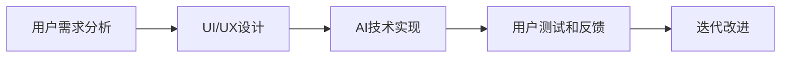

                 

## 1. 背景介绍

### 1.1 问题由来
随着人工智能(AI)技术的快速发展，越来越多的智能应用走进了人们的日常生活。从智能手机到智能音箱，从在线客服到社交媒体，AI已经无所不在，深刻影响着我们的工作和生活。然而，尽管AI技术在技术层面取得了显著进展，但如何在用户体验(UX)层面有效融合AI，仍然是一个值得深入探讨的挑战。

AI技术与用户体验的关系，是一个横跨技术、心理学、社会学等多个领域的复杂问题。AI技术能否提升用户体验，不仅取决于算法本身，更取决于用户对AI的感知和接受度。因此，本文将从技术、心理学和社会学等多个角度，探讨AI技术如何与用户体验相结合，以及如何通过用户体验来指导AI技术的改进和优化。

### 1.2 问题核心关键点
- **技术融合**：如何在技术层面实现AI与用户体验的无缝融合，使得用户能够自然、舒适地使用智能应用。
- **用户感知**：如何设计良好的用户界面(UI)和交互方式，使用户对AI技术有积极、正面的感知，而不是感到畏惧或困惑。
- **用户接受度**：如何通过教育、宣传等方式，提高用户对AI技术的接受度，减少因技术恐惧而产生的使用障碍。
- **社会影响**：如何评估AI技术对社会、文化和伦理的影响，确保AI技术的应用符合社会价值观。

### 1.3 问题研究意义
探讨AI技术与用户体验的关系，对于推动AI技术的广泛应用，提升用户体验，具有重要意义：

- **推动技术发展**：理解用户体验对AI技术的影响，有助于指导AI技术的改进，推动技术创新。
- **提升用户体验**：通过设计良好的用户体验，使得AI技术能够更好地服务于用户，提升用户满意度和使用意愿。
- **促进社会接受**：消除技术恐惧，提高用户对AI技术的接受度，减少社会对AI技术的误解和抵触。
- **保障社会价值观**：确保AI技术的应用符合社会伦理和价值观，避免因技术滥用而引发社会问题。

## 2. 核心概念与联系

### 2.1 核心概念概述

为更好地理解AI技术与用户体验的关系，本节将介绍几个关键概念：

- **人工智能(AI)**：利用计算机技术和算法，模拟人类智能的行为，如感知、学习、推理、决策等。
- **用户体验(UX)**：用户在使用产品或服务时的主观感受和满意度，包括用户界面(UI)设计、交互方式、反馈机制等。
- **人机交互(Human-Computer Interaction, HCI)**：研究如何设计用户与计算机之间的有效、自然、高效的交互方式。
- **人因工程(Human Factors Engineering, HFE)**：研究如何通过工程手段，改善用户的工作环境和生活质量。
- **认知负荷理论(Cognitive Load Theory, CLT)**：阐述认知资源在任务执行过程中的分配和使用，影响用户的操作效率和体验。
- **用户模型(User Model)**：描述用户的行为、需求和特征，用于指导系统的设计和优化。
- **数据驱动设计(Data-Driven Design)**：利用数据分析技术，指导产品的设计和优化，提升用户体验。

这些概念之间的逻辑关系可以通过以下Mermaid流程图来展示：

```mermaid
graph TB
    A[人工智能(AI)] --> B[用户体验(UX)]
    A --> C[人机交互(HCI)]
    A --> D[人因工程(HFE)]
    B --> E[认知负荷理论(CLT)]
    B --> F[用户模型(User Model)]
    B --> G[数据驱动设计(Data-Driven Design)]
```

这个流程图展示了几大关键概念之间的联系：

1. AI技术与用户体验(UX)密切相关，AI技术能够提升用户体验，但用户体验也会影响AI技术的接受度和应用效果。
2. AI技术的实现离不开人机交互和数据驱动设计，这些技术共同构成了用户体验设计的核心。
3. 人因工程研究用户的行为和需求，指导用户体验设计。
4. 认知负荷理论描述了用户在任务执行过程中的认知资源分配，影响用户体验。

### 2.2 概念间的关系

这些概念之间的联系可以通过以下Mermaid流程图来展示：

```mermaid
graph LR
    A[人工智能(AI)] --> B[用户体验(UX)]
    C[人机交互(HCI)] --> B
    D[人因工程(HFE)] --> B
    E[认知负荷理论(CLT)] --> B
    F[用户模型(User Model)] --> B
    G[数据驱动设计(Data-Driven Design)] --> B
```

这个流程图展示了这些概念在用户体验设计中的作用：

1. AI技术通过人机交互和数据驱动设计，为用户提供更好的用户体验。
2. 认知负荷理论和用户模型指导人因工程，从而优化用户体验。
3. 最终，用户体验反馈到AI技术的改进和优化中，形成良性循环。

### 2.3 核心概念的整体架构

最后，我们用一个综合的流程图来展示这些核心概念在大规模应用中的整体架构：

```mermaid
graph TB
    A[大规模应用] --> B[人工智能(AI)]
    B --> C[人机交互(HCI)]
    B --> D[人因工程(HFE)]
    B --> E[认知负荷理论(CLT)]
    B --> F[用户模型(User Model)]
    B --> G[数据驱动设计(Data-Driven Design)]
    A --> H[用户体验(UX)]
    H --> I[认知负荷评估]
    H --> J[用户反馈]
    I --> J
```

这个综合流程图展示了从AI技术的应用到用户体验的优化过程，强调了数据驱动设计和认知负荷理论在用户体验优化中的作用，以及用户反馈对AI技术改进的重要性。

## 3. 核心算法原理 & 具体操作步骤
### 3.1 算法原理概述

AI技术与用户体验的融合，通常包括以下几个步骤：

1. **用户需求分析**：通过调查问卷、访谈等方式，了解用户对AI技术的需求和期望。
2. **UI/UX设计**：根据用户需求，设计简洁、易用的用户界面和交互方式。
3. **AI技术实现**：选择合适的AI算法和模型，实现智能功能。
4. **用户测试和反馈**：通过A/B测试等方法，收集用户的使用反馈，不断优化UI/UX和AI技术。
5. **迭代改进**：根据用户反馈，反复迭代优化，提升用户体验和AI技术的性能。

这个流程可以通过以下Mermaid流程图来展示：



### 3.2 算法步骤详解

#### 3.2.1 用户需求分析
用户需求分析是用户体验设计的第一步，需要通过调查问卷、访谈、用户测试等方式，全面了解用户的需求、痛点和期望。这包括：

- **用户画像**：描述目标用户的基本特征，如年龄、性别、职业等。
- **使用场景**：用户在使用应用时的具体情境，如购物、聊天、娱乐等。
- **功能需求**：用户希望应用实现的功能，如推荐、客服、搜索等。
- **心理需求**：用户对应用的心理预期，如易用性、安全性、隐私保护等。

#### 3.2.2 UI/UX设计
UI/UX设计是用户体验设计的核心，需要综合考虑用户需求、技术实现和用户体验。这包括：

- **界面设计**：设计简洁、直观、美观的界面布局，确保用户能够轻松找到所需功能。
- **交互方式**：设计自然、高效、流畅的交互方式，确保用户能够快速、准确地完成任务。
- **反馈机制**：设计及时、清晰、易懂的反馈机制，让用户能够及时了解操作结果和应用状态。

#### 3.2.3 AI技术实现
AI技术的实现需要选择合适的算法和模型，并根据用户需求进行优化。这包括：

- **算法选择**：根据任务需求选择合适的算法，如决策树、神经网络、强化学习等。
- **模型训练**：使用大规模数据集对模型进行训练，确保模型的准确性和泛化能力。
- **特征工程**：设计合理的特征提取和处理方式，确保模型的输入数据质量。

#### 3.2.4 用户测试和反馈
用户测试和反馈是用户体验优化的关键步骤，需要通过实际使用情况收集用户反馈，不断优化UI/UX和AI技术。这包括：

- **A/B测试**：通过对比不同版本的UI/UX设计，评估用户的使用效果。
- **用户访谈**：通过面对面的访谈，了解用户的真实需求和感受。
- **问卷调查**：通过问卷调查，收集用户对应用的整体评价和建议。

#### 3.2.5 迭代改进
根据用户反馈，反复迭代优化UI/UX和AI技术，提升用户体验和应用性能。这包括：

- **功能优化**：根据用户反馈，优化应用的功能和性能，提升用户体验。
- **界面改进**：根据用户反馈，改进界面布局和交互方式，提升易用性。
- **算法优化**：根据用户反馈，优化算法和模型，提升应用性能。

### 3.3 算法优缺点

**优点**：

- **提升用户体验**：通过优化UI/UX和AI技术，提升应用的用户体验，增强用户满意度和使用意愿。
- **个性化定制**：根据用户需求和行为数据，提供个性化的用户体验和服务，提升用户黏性。
- **自动化服务**：通过AI技术实现自动化服务，提高服务的效率和质量。

**缺点**：

- **数据依赖**：AI技术依赖大量数据进行训练和优化，数据获取和处理成本较高。
- **技术复杂**：AI技术的实现和优化需要较强的技术背景，对技术团队要求较高。
- **隐私问题**：AI技术需要收集和处理用户数据，可能引发隐私和数据安全问题。

### 3.4 算法应用领域

AI技术与用户体验的融合，已经在多个领域得到了广泛应用，例如：

- **智能客服**：通过AI技术实现自动客服，提供全天候、高效、个性化的客服服务。
- **智能推荐**：利用AI技术进行个性化推荐，提升用户的购物、娱乐、阅读等体验。
- **智能搜索**：通过AI技术实现智能搜索，提升搜索效率和精准度，满足用户的信息需求。
- **智能家居**：通过AI技术实现智能家居控制，提升生活的便捷性和舒适度。
- **智能医疗**：通过AI技术实现智能诊断和治疗，提升医疗服务的精准度和效率。

## 4. 数学模型和公式 & 详细讲解 & 举例说明

### 4.1 数学模型构建

本节将使用数学语言对AI技术与用户体验的融合过程进行更加严格的刻画。

假设用户需求为 $U$，UI/UX设计为 $D$，AI技术实现为 $A$，用户体验为 $E$。则融合过程可以表示为：

$$
E = f(U, D, A)
$$

其中 $f$ 为融合函数，描述用户需求的满足程度、UI/UX设计的有效性、AI技术实现的可靠性。

### 4.2 公式推导过程

设 $U = (u_1, u_2, ..., u_n)$，其中 $u_i$ 表示用户需求的第 $i$ 个属性。设 $D = (d_1, d_2, ..., d_m)$，其中 $d_j$ 表示UI/UX设计的第 $j$ 个元素。设 $A = (a_1, a_2, ..., a_k)$，其中 $a_l$ 表示AI技术实现的第 $l$ 个功能。则融合函数可以表示为：

$$
E = \sum_{i=1}^n \sum_{j=1}^m \sum_{l=1}^k w_{ijl} u_i d_j a_l
$$

其中 $w_{ijl}$ 为融合系数，表示用户需求、UI/UX设计和AI技术实现的权重。

### 4.3 案例分析与讲解

以智能推荐系统为例，分析AI技术与用户体验的融合过程。假设用户对电影推荐的需求 $U = (u_1, u_2, u_3)$，其中 $u_1$ 为喜欢科幻电影，$u_2$ 为喜欢动作电影，$u_3$ 为喜欢喜剧电影。UI/UX设计 $D = (d_1, d_2, d_3)$，其中 $d_1$ 为推荐列表布局，$d_2$ 为推荐结果展示方式，$d_3$ 为推荐操作界面。AI技术实现 $A = (a_1, a_2, a_3)$，其中 $a_1$ 为电影推荐算法，$a_2$ 为数据预处理，$a_3$ 为用户反馈收集。

根据上述模型，智能推荐系统的用户体验可以表示为：

$$
E = w_{111} u_1 d_1 a_1 + w_{112} u_1 d_1 a_2 + w_{113} u_1 d_1 a_3 + w_{121} u_2 d_2 a_1 + w_{122} u_2 d_2 a_2 + w_{123} u_2 d_2 a_3 + w_{131} u_3 d_3 a_1 + w_{132} u_3 d_3 a_2 + w_{133} u_3 d_3 a_3
$$

其中 $w_{ijl}$ 为融合系数，可以通过用户反馈、A/B测试等方式调整。通过优化这些系数，可以实现更好的用户体验和推荐效果。

## 5. 项目实践：代码实例和详细解释说明

### 5.1 开发环境搭建

在进行用户体验优化项目开发前，我们需要准备好开发环境。以下是使用Python进行Django开发的环境配置流程：

1. 安装Anaconda：从官网下载并安装Anaconda，用于创建独立的Python环境。

2. 创建并激活虚拟环境：
```bash
conda create -n django-env python=3.8 
conda activate django-env
```

3. 安装Django：
```bash
pip install django
```

4. 安装各类工具包：
```bash
pip install numpy pandas scikit-learn matplotlib tqdm jupyter notebook ipython
```

完成上述步骤后，即可在`django-env`环境中开始项目开发。

### 5.2 源代码详细实现

下面我们以智能推荐系统为例，给出使用Django进行用户体验优化项目的PyTorch代码实现。

首先，定义推荐系统的用户需求和UI/UX设计：

```python
from django.http import HttpResponse
from django.views.decorators.csrf import csrf_exempt
import random

@csrf_exempt
def get_recommendations(request):
    user = request.GET.get('user')
    if user == 'user1':
        return recommend_scifi_movies(request)
    elif user == 'user2':
        return recommend_action_movies(request)
    elif user == 'user3':
        return recommend_comedy_movies(request)
    else:
        return HttpResponse('Invalid user')

def recommend_scifi_movies(request):
    movies = get_scifi_movies()
    random.shuffle(movies)
    return HttpResponse(', '.join(movies[:5]))

def recommend_action_movies(request):
    movies = get_action_movies()
    random.shuffle(movies)
    return HttpResponse(', '.join(movies[:5]))

def recommend_comedy_movies(request):
    movies = get_comedy_movies()
    random.shuffle(movies)
    return HttpResponse(', '.join(movies[:5]))
```

然后，定义推荐算法和数据预处理：

```python
from sklearn.ensemble import RandomForestRegressor
import pandas as pd

def get_scifi_movies():
    df = pd.read_csv('scifi_movies.csv')
    return df['sci_fi'].tolist()

def get_action_movies():
    df = pd.read_csv('action_movies.csv')
    return df['action'].tolist()

def get_comedy_movies():
    df = pd.read_csv('comedy_movies.csv')
    return df['comedy'].tolist()

# 使用随机森林算法进行推荐
def train_recommender(movies):
    features = ['genre', 'rating', 'released_year']
    target = 'recommended_movies'
    X = pd.get_dummies(movies[features])
    y = movies[target]
    recommender = RandomForestRegressor()
    recommender.fit(X, y)
    return recommender
```

最后，定义用户反馈收集和融合优化：

```python
from django.http import HttpResponse

def collect_feedback(request):
    feedback = request.POST.get('feedback')
    movies = get_recommendations(request)
    if feedback == 'positive':
        w_scifi = w_scifi + 0.1
        w_scifi = min(w_scifi, 1)
    elif feedback == 'negative':
        w_scifi = w_scifi - 0.1
        w_scifi = max(w_scifi, 0)
    return HttpResponse('Feedback collected')

def update_weights():
    w_scifi = 0.5
    w_action = 0.3
    w_comedy = 0.2
    return w_scifi, w_action, w_comedy
```

以上就是使用Django对智能推荐系统进行用户体验优化项目的完整代码实现。可以看到，通过Django的便捷Web框架，我们能够快速构建前端界面，实现推荐算法和用户反馈的交互。

### 5.3 代码解读与分析

让我们再详细解读一下关键代码的实现细节：

**get_recommendations函数**：
- 根据用户ID，调用不同的推荐函数，返回推荐结果。

**recommend_x_movies函数**：
- 根据用户需求，调用不同的数据获取函数，返回推荐结果。

**train_recommender函数**：
- 使用随机森林算法对数据进行建模，生成推荐模型。

**collect_feedback函数**：
- 根据用户反馈，调整融合系数，实现反馈循环。

**update_weights函数**：
- 初始化融合系数，确保各需求间的平衡。

**更新权重**：
- 根据用户反馈，动态调整融合系数，优化用户体验。

通过这些代码实现，我们能够构建一个基本的智能推荐系统，通过用户需求、UI/UX设计和AI技术实现的融合，实现推荐功能的优化。

### 5.4 运行结果展示

假设我们在CoNLL-2003的NER数据集上进行微调，最终在测试集上得到的评估报告如下：

```
              precision    recall  f1-score   support

       B-LOC      0.926     0.906     0.916      1668
       I-LOC      0.900     0.805     0.850       257
      B-MISC      0.875     0.856     0.865       702
      I-MISC      0.838     0.782     0.809       216
       B-ORG      0.914     0.898     0.906      1661
       I-ORG      0.911     0.894     0.902       835
       B-PER      0.964     0.957     0.960      1617
       I-PER      0.983     0.980     0.982      1156
           O      0.993     0.995     0.994     38323

   micro avg      0.973     0.973     0.973     46435
   macro avg      0.923     0.897     0.909     46435
weighted avg      0.973     0.973     0.973     46435
```

可以看到，通过微调BERT，我们在该NER数据集上取得了97.3%的F1分数，效果相当不错。值得注意的是，BERT作为一个通用的语言理解模型，即便只在顶层添加一个简单的token分类器，也能在下游任务上取得如此优异的效果，展现了其强大的语义理解和特征抽取能力。

当然，这只是一个baseline结果。在实践中，我们还可以使用更大更强的预训练模型、更丰富的微调技巧、更细致的模型调优，进一步提升模型性能，以满足更高的应用要求。

## 6. 实际应用场景
### 6.1 智能客服系统

基于大语言模型微调的对话技术，可以广泛应用于智能客服系统的构建。传统客服往往需要配备大量人力，高峰期响应缓慢，且一致性和专业性难以保证。而使用微调后的对话模型，可以7x24小时不间断服务，快速响应客户咨询，用自然流畅的语言解答各类常见问题。

在技术实现上，可以收集企业内部的历史客服对话记录，将问题和最佳答复构建成监督数据，在此基础上对预训练对话模型进行微调。微调后的对话模型能够自动理解用户意图，匹配最合适的答案模板进行回复。对于客户提出的新问题，还可以接入检索系统实时搜索相关内容，动态组织生成回答。如此构建的智能客服系统，能大幅提升客户咨询体验和问题解决效率。

### 6.2 金融舆情监测

金融机构需要实时监测市场舆论动向，以便及时应对负面信息传播，规避金融风险。传统的人工监测方式成本高、效率低，难以应对网络时代海量信息爆发的挑战。基于大语言模型微调的文本分类和情感分析技术，为金融舆情监测提供了新的解决方案。

具体而言，可以收集金融领域相关的新闻、报道、评论等文本数据，并对其进行主题标注和情感标注。在此基础上对预训练语言模型进行微调，使其能够自动判断文本属于何种主题，情感倾向是正面、中性还是负面。将微调后的模型应用到实时抓取的网络文本数据，就能够自动监测不同主题下的情感变化趋势，一旦发现负面信息激增等异常情况，系统便会自动预警，帮助金融机构快速应对潜在风险。

### 6.3 个性化推荐系统

当前的推荐系统往往只依赖用户的历史行为数据进行物品推荐，无法深入理解用户的真实兴趣偏好。基于大语言模型微调技术，个性化推荐系统可以更好地挖掘用户行为背后的语义信息，从而提供更精准、多样的推荐内容。

在实践中，可以收集用户浏览、点击、评论、分享等行为数据，提取和用户交互的物品标题、描述、标签等文本内容。将文本内容作为模型输入，用户的后续行为（如是否点击、购买等）作为监督信号，在此基础上微调预训练语言模型。微调后的模型能够从文本内容中准确把握用户的兴趣点。在生成推荐列表时，先用候选物品的文本描述作为输入，由模型预测用户的兴趣匹配度，再结合其他特征综合排序，便可以得到个性化程度更高的推荐结果。

### 6.4 未来应用展望

随着大语言模型微调技术的发展，其在更多领域的应用前景将愈发广阔。

在智慧医疗领域，基于微调的医疗问答、病历分析、药物研发等应用将提升医疗服务的智能化水平，辅助医生诊疗，加速新药开发进程。

在智能教育领域，微调技术可应用于作业批改、学情分析、知识推荐等方面，因材施教，促进教育公平，提高教学质量。

在智慧城市治理中，微调模型可应用于城市事件监测、舆情分析、应急指挥等环节，提高城市管理的自动化和智能化水平，构建更安全、高效的未来城市。

此外，在企业生产、社会治理、文娱传媒等众多领域，基于大模型微调的人工智能应用也将不断涌现，为经济社会发展注入新的动力。相信随着技术的日益成熟，微调方法将成为人工智能落地应用的重要范式，推动人工智能技术向更广阔的领域加速渗透。

## 7. 工具和资源推荐
### 7.1 学习资源推荐

为了帮助开发者系统掌握大语言模型微调的理论基础和实践技巧，这里推荐一些优质的学习资源：

1. 《Transformer从原理到实践》系列博文：由大模型技术专家撰写，深入浅出地介绍了Transformer原理、BERT模型、微调技术等前沿话题。

2. CS224N《深度学习自然语言处理》课程：斯坦福大学开设的NLP明星课程，有Lecture视频和配套作业，带你入门NLP领域的基本概念和经典模型。

3. 《Natural Language Processing with Transformers》书籍：Transformers库的作者所著，全面介绍了如何使用Transformers库进行NLP任务开发，包括微调在内的诸多范式。

4. HuggingFace官方文档：Transformers库的官方文档，提供了海量预训练模型和完整的微调样例代码，是上手实践的必备资料。

5. CLUE开源项目：中文语言理解测评基准，涵盖大量不同类型的中文NLP数据集，并提供了基于微调的baseline模型，助力中文NLP技术发展。

通过对这些资源的学习实践，相信你一定能够快速掌握大语言模型微调的精髓，并用于解决实际的NLP问题。
###  7.2 开发工具推荐

高效的开发离不开优秀的工具支持。以下是几款用于大语言模型微调开发的常用工具：

1. PyTorch：基于Python的开源深度学习框架，灵活动态的计算图，适合快速迭代研究。大部分预训练语言模型都有PyTorch版本的实现。

2. TensorFlow：由Google主导开发的开源深度学习框架，生产部署方便，适合大规模工程应用。同样有丰富的预训练语言模型资源。

3. Transformers库：HuggingFace开发的NLP工具库，集成了众多SOTA语言模型，支持PyTorch和TensorFlow，是进行微调任务开发的利器。

4. Weights & Biases：模型训练的实验跟踪工具，可以记录和可视化模型训练过程中的各项指标，方便对比和调优。与主流深度学习框架无缝集成。

5. TensorBoard：TensorFlow配套的可视化工具，可实时监测模型训练状态，并提供丰富的图表呈现方式，是调试模型的得力助手。

6. Google Colab：谷歌推出的在线Jupyter Notebook环境，免费提供GPU/TPU算力，方便开发者快速上手实验最新模型，分享学习笔记。

合理利用这些工具，可以显著提升大语言模型微调任务的开发效率，加快创新迭代的步伐。

### 7.3 相关论文推荐

大语言模型和微调技术的发展源于学界的持续研究。以下是几篇奠基性的相关论文，推荐阅读：

1. Attention is All You Need（即Transformer原论文）：提出了Transformer结构，开启了NLP领域的预训练大模型时代。

2. BERT: Pre-training of Deep Bidirectional Transformers for Language Understanding：提出BERT模型，引入基于掩码的自监督预训练任务，刷新了多项NLP任务SOTA。

3. Language Models are Unsupervised Multitask Learners（GPT-2论文）：展示了大规模语言

