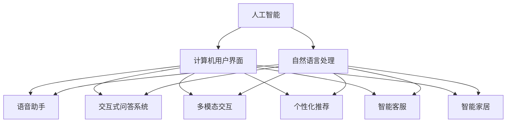
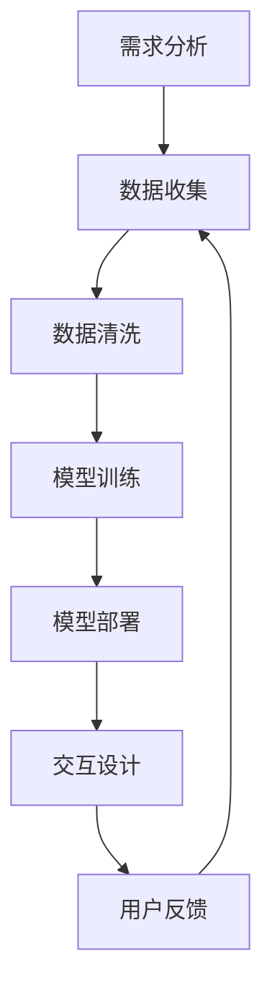
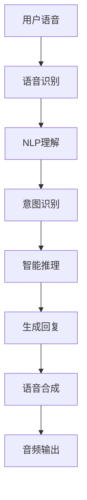
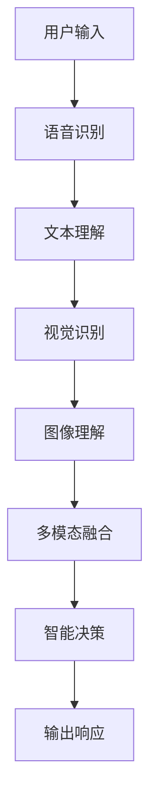
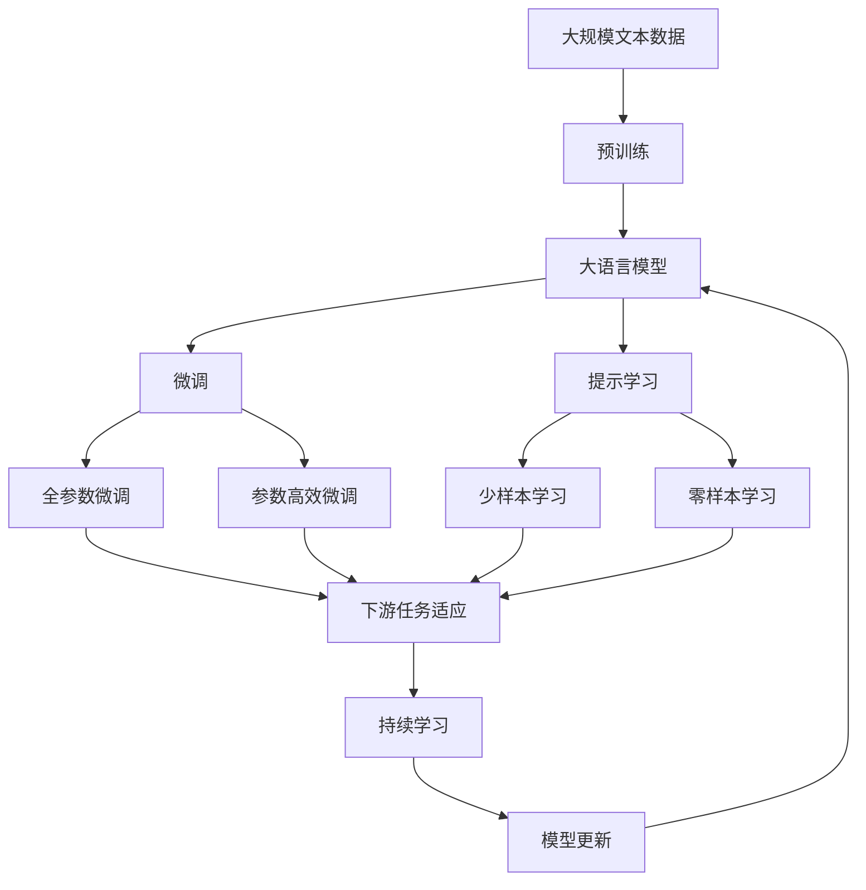

                 

# AI技术推动CUI在数字产品中的应用

> 关键词：
> - 人工智能 (AI) 
> - 自然语言处理 (NLP)
> - 计算机用户界面 (CUI)
> - 语音助手 (Voice Assistants)
> - 交互式问答系统 (Q&A Systems)
> - 多模态交互 (Multimodal Interaction)
> - 个性化推荐 (Personalized Recommendation)
> - 智能客服 (AI Customer Service)
> - 智能家居 (Smart Home)
> - 人机交互 (Human-Computer Interaction)
> - 虚拟助手 (Virtual Assistants)

## 1. 背景介绍

### 1.1 问题由来

随着人工智能技术的发展，数字产品中正快速引入更智能、更自然的用户界面 (UI)，即计算机用户界面 (CUI)。CUI能够更加高效地响应用户需求，提供更个性化的交互体验。语音助手、交互式问答系统、智能客服等数字化产品正逐渐成为用户生活中不可或缺的一部分。AI技术，尤其是自然语言处理 (NLP) 和语音识别技术，已成为CUI开发的核心引擎。

### 1.2 问题核心关键点

当前，AI技术在CUI中的应用主要集中在以下几个关键点：

- 自然语言理解：通过NLP技术，识别用户输入的自然语言，理解其意图和需求。
- 语音识别：通过语音识别技术，将用户的语音转化为文本输入。
- 语音合成：通过文本到语音 (TTS) 技术，将机器生成的文本转化为自然流畅的语音输出。
- 交互设计：通过人机交互 (HCI) 技术，设计直观易用的交互界面。
- 数据驱动：通过大数据分析技术，精准推荐个性化的内容和功能。

这些核心技术共同构成了CUI在AI技术推动下的飞速发展，使其能更好地理解用户、提供帮助、改善用户体验。

### 1.3 问题研究意义

研究AI技术在CUI中的应用，对于提升数字化产品的智能化水平，改善用户体验，加速智能化应用的普及，具有重要意义：

1. 降低开发成本：AI技术可以自动抽取、分析用户数据，减少人工干预，降低开发成本。
2. 提升用户体验：AI技术能够提供个性化、自然流畅的交互体验，增强用户满意度。
3. 加速应用落地：AI技术能够快速适应各种应用场景，加速数字化产品在各行业的落地。
4. 增强竞争力：AI技术的应用可以提供独特的用户体验，提升产品的市场竞争力。
5. 拓展应用范围：AI技术使CUI能够覆盖更多应用领域，如智能家居、金融服务、健康医疗等。

## 2. 核心概念与联系

### 2.1 核心概念概述

为更好地理解AI技术在CUI中的应用，本节将介绍几个密切相关的核心概念：

- 人工智能 (AI)：通过机器学习、深度学习等技术，使机器具备类人智能能力，能够自主学习和决策。
- 自然语言处理 (NLP)：使机器能够理解、处理和生成自然语言。NLP是AI在语言理解上的重要分支。
- 计算机用户界面 (CUI)：提供人与计算机之间自然、直观的交互方式，如语音助手、交互式问答系统等。
- 语音助手 (Voice Assistants)：通过语音交互，帮助用户完成操作，提供即时响应。
- 交互式问答系统 (Q&A Systems)：通过自动问答技术，快速响应用户的问题，提供准确的信息。
- 多模态交互 (Multimodal Interaction)：结合语音、文本、图像、视频等多种输入方式，提供更自然、丰富的交互体验。
- 个性化推荐 (Personalized Recommendation)：通过数据分析，向用户推荐个性化的内容和服务。
- 智能客服 (AI Customer Service)：利用AI技术，自动解答用户问题，提供24小时不间断的服务。
- 智能家居 (Smart Home)：利用AI技术，自动化管理家庭设备，提供智能化的生活环境。
- 人机交互 (Human-Computer Interaction)：研究如何让机器更好地理解和响应用户的交互意图。

这些核心概念之间的逻辑关系可以通过以下Mermaid流程图来展示：



这个流程图展示了大语言模型微调过程中各个核心概念的关系和作用：

1. 人工智能是CUI的基础，提供了自主学习和决策能力。
2. 自然语言处理使机器能够理解自然语言，是CUI的核心技术。
3. 计算机用户界面提供了直观的自然交互方式，包括语音助手、问答系统等。
4. 多模态交互、个性化推荐、智能客服、智能家居等具体应用，通过NLP等技术实现，提升了用户体验。

### 2.2 概念间的关系

这些核心概念之间存在着紧密的联系，形成了CUI的完整生态系统。下面我们通过几个Mermaid流程图来展示这些概念之间的关系。

#### 2.2.1 CUI的构建过程



这个流程图展示了CUI构建的一般流程：

1. 需求分析，确定产品功能和目标用户。
2. 数据收集，获取用户交互数据和环境数据。
3. 数据清洗，处理和整理数据，去除噪声和冗余信息。
4. 模型训练，选择合适的AI模型，如NLP、语音识别等，进行训练。
5. 模型部署，将训练好的模型嵌入到CUI中。
6. 交互设计，设计自然直观的交互界面和体验。
7. 用户反馈，收集用户使用数据，优化模型和交互设计。

#### 2.2.2 语音助手的技术栈



这个流程图展示了语音助手的技术实现过程：

1. 用户语音输入。
2. 语音识别，将语音转化为文本。
3. NLP理解，解析文本，理解用户意图。
4. 意图识别，确定用户具体需求。
5. 智能推理，调用API或查询数据库，生成回答。
6. 生成回复，将回答转化为自然语言。
7. 语音合成，将回答转化为语音输出。

#### 2.2.3 多模态交互的实现



这个流程图展示了多模态交互的技术实现过程：

1. 用户通过多种方式输入信息，包括语音、文本、图像等。
2. 语音识别，将语音转化为文本。
3. 文本理解，解析文本，理解用户意图。
4. 视觉识别，解析图像，提取信息。
5. 多模态融合，整合不同输入方式的信息。
6. 智能决策，结合多模态信息，生成决策。
7. 输出响应，通过文本、语音等方式输出。

### 2.3 核心概念的整体架构

最后，我们用一个综合的流程图来展示这些核心概念在大语言模型微调过程中的整体架构：



这个综合流程图展示了从预训练到微调，再到持续学习的完整过程。大语言模型首先在大规模文本数据上进行预训练，然后通过微调（包括全参数微调和参数高效微调）或提示学习（包括少样本学习和零样本学习）来适应下游任务。最后，通过持续学习技术，模型可以不断更新和适应新的任务和数据。 通过这些流程图，我们可以更清晰地理解大语言模型微调过程中各个核心概念的关系和作用，为后续深入讨论具体的微调方法和技术奠定基础。

## 3. 核心算法原理 & 具体操作步骤
### 3.1 算法原理概述

基于AI技术，CUI的核心算法原理主要围绕着自然语言处理 (NLP) 展开。NLP技术通过训练大语言模型，使其能够理解、处理和生成自然语言，从而在CUI中实现高效的人机交互。

形式化地，假设一个自然语言处理任务 $T$，其输入为文本 $x$，输出为标签 $y$，其中 $x$ 为自然语言文本，$y$ 为任务对应的输出标签。常见的任务包括文本分类、命名实体识别、情感分析等。训练一个NLP模型的目标是最小化经验风险：

$$
\mathcal{L}(\theta) = \frac{1}{N} \sum_{i=1}^N \ell(M_{\theta}(x_i),y_i)
$$

其中 $\ell$ 为损失函数，如交叉熵损失函数。$M_{\theta}$ 为训练得到的模型，$\theta$ 为模型参数。

### 3.2 算法步骤详解

基于AI技术，CUI的微调过程主要包括以下几个关键步骤：

**Step 1: 准备预训练模型和数据集**
- 选择合适的预训练语言模型 $M_{\theta}$ 作为初始化参数，如BERT、GPT等。
- 准备下游任务 $T$ 的标注数据集 $D=\{(x_i,y_i)\}_{i=1}^N$，划分为训练集、验证集和测试集。一般要求标注数据与预训练数据的分布不要差异过大。

**Step 2: 添加任务适配层**
- 根据任务类型，在预训练模型顶层设计合适的输出层和损失函数。
- 对于分类任务，通常在顶层添加线性分类器和交叉熵损失函数。
- 对于生成任务，通常使用语言模型的解码器输出概率分布，并以负对数似然为损失函数。

**Step 3: 设置微调超参数**
- 选择合适的优化算法及其参数，如 AdamW、SGD 等，设置学习率、批大小、迭代轮数等。
- 设置正则化技术及强度，包括权重衰减、Dropout、Early Stopping 等。
- 确定冻结预训练参数的策略，如仅微调顶层，或全部参数都参与微调。

**Step 4: 执行梯度训练**
- 将训练集数据分批次输入模型，前向传播计算损失函数。
- 反向传播计算参数梯度，根据设定的优化算法和学习率更新模型参数。
- 周期性在验证集上评估模型性能，根据性能指标决定是否触发 Early Stopping。
- 重复上述步骤直到满足预设的迭代轮数或 Early Stopping 条件。

**Step 5: 测试和部署**
- 在测试集上评估微调后模型 $M_{\hat{\theta}}$ 的性能，对比微调前后的精度提升。
- 使用微调后的模型对新样本进行推理预测，集成到实际的应用系统中。
- 持续收集新的数据，定期重新微调模型，以适应数据分布的变化。

以上是基于AI技术的大语言模型微调的一般流程。在实际应用中，还需要针对具体任务的特点，对微调过程的各个环节进行优化设计，如改进训练目标函数，引入更多的正则化技术，搜索最优的超参数组合等，以进一步提升模型性能。

### 3.3 算法优缺点

基于AI技术的大语言模型微调方法具有以下优点：

1. 高效适配任务。大语言模型通过预训练学习到通用语言知识，可以较快地适应特定任务，并在少量标注数据下取得良好效果。
2. 参数可解释性强。预训练模型中的参数更新易于理解，便于调试和优化。
3. 模型可迁移性高。通过微调，模型能够从一个领域迁移到另一个领域，扩大了应用范围。
4. 数据需求较少。微调方法可以在小规模标注数据下训练，减少了数据收集和标注的成本。

同时，该方法也存在以下局限性：

1. 依赖标注数据。微调的效果很大程度上取决于标注数据的质量和数量，获取高质量标注数据的成本较高。
2. 迁移能力有限。当目标任务与预训练数据的分布差异较大时，微调的性能提升有限。
3. 负面效果传递。预训练模型的固有偏见、有害信息等，可能通过微调传递到下游任务，造成负面影响。
4. 可解释性不足。微调模型的决策过程通常缺乏可解释性，难以对其推理逻辑进行分析和调试。

尽管存在这些局限性，但就目前而言，基于AI技术的微调方法仍是大语言模型应用的主流范式。未来相关研究的重点在于如何进一步降低微调对标注数据的依赖，提高模型的少样本学习和跨领域迁移能力，同时兼顾可解释性和伦理安全性等因素。

### 3.4 算法应用领域

基于AI技术的大语言模型微调方法在NLP领域已经得到了广泛的应用，覆盖了几乎所有常见任务，例如：

- 文本分类：如情感分析、主题分类、意图识别等。通过微调使模型学习文本-标签映射。
- 命名实体识别：识别文本中的人名、地名、机构名等特定实体。通过微调使模型掌握实体边界和类型。
- 关系抽取：从文本中抽取实体之间的语义关系。通过微调使模型学习实体-关系三元组。
- 问答系统：对自然语言问题给出答案。将问题-答案对作为微调数据，训练模型学习匹配答案。
- 机器翻译：将源语言文本翻译成目标语言。通过微调使模型学习语言-语言映射。
- 文本摘要：将长文本压缩成简短摘要。将文章-摘要对作为微调数据，使模型学习抓取要点。
- 对话系统：使机器能够与人自然对话。将多轮对话历史作为上下文，微调模型进行回复生成。

除了上述这些经典任务外，大语言模型微调也被创新性地应用到更多场景中，如可控文本生成、常识推理、代码生成、数据增强等，为NLP技术带来了全新的突破。随着预训练模型和微调方法的不断进步，相信NLP技术将在更广阔的应用领域大放异彩。

## 4. 数学模型和公式 & 详细讲解  
### 4.1 数学模型构建

本节将使用数学语言对基于AI技术的大语言模型微调过程进行更加严格的刻画。

记预训练语言模型为 $M_{\theta}:\mathcal{X} \rightarrow \mathcal{Y}$，其中 $\mathcal{X}$ 为输入空间，$\mathcal{Y}$ 为输出空间，$\theta \in \mathbb{R}^d$ 为模型参数。假设微调任务的训练集为 $D=\{(x_i,y_i)\}_{i=1}^N, x_i \in \mathcal{X}, y_i \in \mathcal{Y}$。

定义模型 $M_{\theta}$ 在数据样本 $(x,y)$ 上的损失函数为 $\ell(M_{\theta}(x),y)$，则在数据集 $D$ 上的经验风险为：

$$
\mathcal{L}(\theta) = \frac{1}{N} \sum_{i=1}^N \ell(M_{\theta}(x_i),y_i)
$$

微调的优化目标是最小化经验风险，即找到最优参数：

$$
\theta^* = \mathop{\arg\min}_{\theta} \mathcal{L}(\theta)
$$

在实践中，我们通常使用基于梯度的优化算法（如SGD、Adam等）来近似求解上述最优化问题。设 $\eta$ 为学习率，$\lambda$ 为正则化系数，则参数的更新公式为：

$$
\theta \leftarrow \theta - \eta \nabla_{\theta}\mathcal{L}(\theta) - \eta\lambda\theta
$$

其中 $\nabla_{\theta}\mathcal{L}(\theta)$ 为损失函数对参数 $\theta$ 的梯度，可通过反向传播算法高效计算。

### 4.2 公式推导过程

以下我们以二分类任务为例，推导交叉熵损失函数及其梯度的计算公式。

假设模型 $M_{\theta}$ 在输入 $x$ 上的输出为 $\hat{y}=M_{\theta}(x) \in [0,1]$，表示样本属于正类的概率。真实标签 $y \in \{0,1\}$。则二分类交叉熵损失函数定义为：

$$
\ell(M_{\theta}(x),y) = -[y\log \hat{y} + (1-y)\log (1-\hat{y})]
$$

将其代入经验风险公式，得：

$$
\mathcal{L}(\theta) = -\frac{1}{N}\sum_{i=1}^N [y_i\log M_{\theta}(x_i)+(1-y_i)\log(1-M_{\theta}(x_i))]
$$

根据链式法则，损失函数对参数 $\theta_k$ 的梯度为：

$$
\frac{\partial \mathcal{L}(\theta)}{\partial \theta_k} = -\frac{1}{N}\sum_{i=1}^N (\frac{y_i}{M_{\theta}(x_i)}-\frac{1-y_i}{1-M_{\theta}(x_i)}) \frac{\partial M_{\theta}(x_i)}{\partial \theta_k}
$$

其中 $\frac{\partial M_{\theta}(x_i)}{\partial \theta_k}$ 可进一步递归展开，利用自动微分技术完成计算。

在得到损失函数的梯度后，即可带入参数更新公式，完成模型的迭代优化。重复上述过程直至收敛，最终得到适应下游任务的最优模型参数 $\theta^*$。

## 5. 项目实践：代码实例和详细解释说明
### 5.1 开发环境搭建

在进行微调实践前，我们需要准备好开发环境。以下是使用Python进行PyTorch开发的环境配置流程：

1. 安装Anaconda：从官网下载并安装Anaconda，用于创建独立的Python环境。

2. 创建并激活虚拟环境：
```bash
conda create -n pytorch-env python=3.8 
conda activate pytorch-env
```

3. 安装PyTorch：根据CUDA版本，从官网获取对应的安装命令。例如：
```bash
conda install pytorch torchvision torchaudio cudatoolkit=11.1 -c pytorch -c conda-forge
```

4. 安装Transformers库：
```bash
pip install transformers
```

5. 安装各类工具包：
```bash
pip install numpy pandas scikit-learn matplotlib tqdm jupyter notebook ipython
```

完成上述步骤后，即可在`pytorch-env`环境中开始微调实践。

### 5.2 源代码详细实现

下面我们以命名实体识别(NER)任务为例，给出使用Transformers库对BERT模型进行微调的PyTorch代码实现。

首先，定义NER任务的数据处理函数：

```python
from transformers import BertTokenizer
from torch.utils.data import Dataset
import torch

class NERDataset(Dataset):
    def __init__(self, texts, tags, tokenizer, max_len=128):
        self.texts = texts
        self.tags = tags
        self.tokenizer = tokenizer
        self.max_len = max_len
        
    def __len__(self):
        return len(self.texts)
    
    def __getitem__(self, item):
        text = self.texts[item]
        tags = self.tags[item]
        
        encoding = self.tokenizer(text, return_tensors='pt', max_length=self.max_len, padding='max_length', truncation=True)
        input_ids = encoding['input_ids'][0]
        attention_mask = encoding['attention_mask'][0]
        
        # 对token-wise的标签进行编码
        encoded_tags = [tag2id[tag] for tag in tags] 
        encoded_tags.extend([tag2id['O']] * (self.max_len - len(encoded_tags)))
        labels = torch.tensor(encoded_tags, dtype=torch.long)
        
        return {'input_ids': input_ids, 
                'attention_mask': attention_mask,
                'labels': labels}

# 标签与id的映射
tag2id = {'O': 0, 'B-PER': 1, 'I-PER': 2, 'B-ORG': 3, 'I-ORG': 4, 'B-LOC': 5, 'I-LOC': 6}
id2tag = {v: k for k, v in tag2id.items()}

# 创建dataset
tokenizer = BertTokenizer.from_pretrained('bert-base-cased')

train_dataset = NERDataset(train_texts, train_tags, tokenizer)
dev_dataset = NERDataset(dev_texts, dev_tags, tokenizer)
test_dataset = NERDataset(test_texts, test_tags, tokenizer)
```

然后，定义模型和优化器：

```python
from transformers import BertForTokenClassification, AdamW

model = BertForTokenClassification.from_pretrained('bert-base-cased', num_labels=len(tag2id))

optimizer = AdamW(model.parameters(), lr=2e-5)
```

接着，定义训练和评估函数：

```python
from torch.utils.data import DataLoader
from tqdm import tqdm
from sklearn.metrics import classification_report

device = torch.device('cuda') if torch.cuda.is_available() else torch.device('cpu')
model.to(device)

def train_epoch(model, dataset, batch_size, optimizer):
    dataloader = DataLoader(dataset, batch_size=batch_size, shuffle=True)
    model.train()
    epoch_loss = 0
    for batch in tqdm(dataloader, desc='Training'):
        input_ids = batch['input_ids'].to(device)
        attention_mask = batch['attention_mask'].to(device)
        labels = batch['labels'].to(device)
        model.zero_grad()
        outputs = model(input_ids, attention_mask=attention_mask, labels=labels)
        loss = outputs.loss
        epoch_loss += loss.item()
        loss.backward()
        optimizer.step()
    return epoch_loss / len(dataloader)

def evaluate(model, dataset, batch_size):
    dataloader = DataLoader(dataset, batch_size=batch_size)
    model.eval()
    preds, labels = [], []
    with torch.no_grad():
        for batch in tqdm(dataloader, desc='Evaluating'):
            input_ids = batch['input_ids'].to(device)
            attention_mask = batch['attention_mask'].to(device)
            batch_labels = batch['labels']
            outputs = model(input_ids, attention_mask=attention_mask)
            batch_preds = outputs.logits.argmax(dim=2).to('cpu').tolist()
            batch_labels = batch_labels.to('cpu').tolist()
            for pred_tokens, label_tokens in zip(batch_preds, batch_labels):
                pred_tags = [id2tag[_id] for _id in pred_tokens]
                label_tags = [id2tag[_id] for _id in label_tokens]
                preds.append(pred_tags[:len(label_tags)])
                labels.append(label_tags)
                
    print(classification_report(labels, preds))
```

最后，启动训练流程并在测试集上评估：

```python
epochs = 5
batch_size = 16

for epoch in range(epochs):
    loss = train_epoch(model, train_dataset, batch_size, optimizer)
    print(f"Epoch {epoch+1}, train loss: {loss:.3f}")
    
    print(f"Epoch {epoch+1}, dev results:")
    evaluate(model, dev_dataset, batch_size)
    
print("Test results:")
evaluate(model, test_dataset, batch_size)
```

以上就是使用PyTorch对BERT进行命名实体识别任务微调的完整代码实现。可以看到，得益于Transformers库的强大封装，我们可以用相对简洁的代码完成BERT模型的加载和微调。

### 5.3 代码解读与分析

让我们再详细解读一下关键代码的实现细节：

**NERDataset类**：
- `__init__`方法：初始化文本、标签、分词器等关键组件。
- `__len__`方法：返回数据集的样本数量。
- `__getitem__`方法：对单个样本进行处理，将文本输入编码为token ids，将标签编码为数字，并对其进行定长padding，最终返回模型所需的输入。

**tag2id和id2tag字典**：
- 定义了标签与数字id之间的映射关系，用于将token-wise的预测结果解码回真实的标签。

**训练和评估函数**：
- 使用PyTorch的DataLoader对数据集进行批次化加载，供模型训练和推理使用。
- 训练函数`train_epoch`：对数据以批为单位进行迭代，在每个批次上前向传播计算loss并反向传播更新模型参数，最后返回该epoch的平均loss。
- 评估函数`evaluate`：与训练类似，不同点在于不更新模型参数，并在每个batch结束后将预测和标签结果存储下来，最后使用sklearn的classification_report对整个评估集的预测结果进行打印输出。

**训练流程**：

