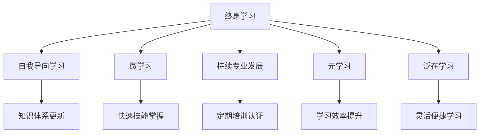
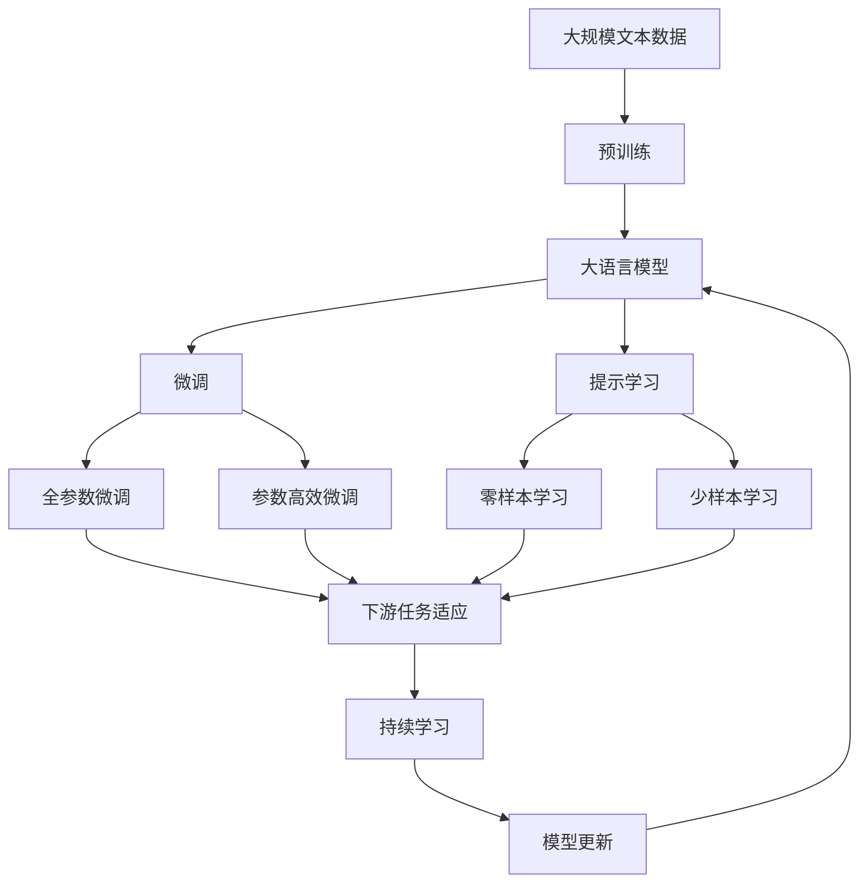

                 

# AI时代的终身学习策略

## 1. 背景介绍

### 1.1 问题由来
在人工智能(AI)迅猛发展的今天，技术的更迭换代速度之快让人目不暇接。从机器学习到深度学习，从传统AI到生成对抗网络(GANs)，从单一任务到多模态融合，每一个领域都在不断推陈出新。在这样的技术背景下，终身学习成为一种迫切需求。终身学习不仅适用于计算机科学领域，对于从事AI研究和应用的各类专业人士而言，其重要性不言而喻。无论是科研人员、工程师还是数据分析师，都需要不断更新知识体系，掌握最新技术，以保持竞争力和技术领先。

### 1.2 问题核心关键点
终身学习是一种持续获取新知识、提升技能的过程，以适应快速变化的技术环境。在AI时代，终身学习体现在以下几个方面：
- **知识体系的动态更新**：AI技术更新快，需要定期更新专业知识，如了解最新的深度学习框架、算法、模型等。
- **技能习得的持续性**：从编程语言到数据处理技巧，从模型调学到应用部署，技能提升贯穿整个职业生涯。
- **跨学科的广泛性**：AI不仅涵盖计算机科学，还涉及数学、统计学、心理学等多个学科，终身学习也需跨学科学习。
- **解决问题的能力**：面对不断变化的实际问题，终身学习者需要不断提升问题解决能力，从理论到实践全面提升。
- **伦理与社会责任**：AI的发展也带来了伦理和社会问题，终身学习者需关注这些方面，确保技术应用的安全性、公正性和可持续性。

### 1.3 问题研究意义
在AI时代，终身学习对于个人职业发展和组织竞争力提升具有重要意义：
1. **职业发展**：终身学习能帮助个人不断适应技术变革，把握新机会，实现职业突破。
2. **组织创新**：终身学习有利于组织内部知识共享和创新，保持技术领先。
3. **社会价值**：终身学习有助于提升AI技术的社会应用水平，促进技术造福社会。
4. **伦理与安全**：终身学习有助于提升AI系统的伦理责任，确保技术的健康发展。

## 2. 核心概念与联系

### 2.1 核心概念概述

为更好地理解终身学习策略，本节将介绍几个关键概念：

- **终身学习（Lifelong Learning）**：指个体在其整个职业生涯中不断获取新知识和技能的过程，以适应技术环境的快速变化。
- **自我导向学习（Self-Directed Learning）**：个人自主选择学习内容和方法，实现自我提升。
- **微学习（Microlearning）**：通过短时间内的高密度学习内容，实现快速的知识掌握。
- **持续专业发展（CPD）**：通过定期培训和认证，持续提升专业能力。
- **元学习（Meta-Learning）**：学习如何快速学习，即学习如何学习，提升学习效率。
- **泛在学习（Ubiquitous Learning）**：利用各种环境和设备进行学习，增强学习的便捷性和灵活性。

### 2.2 概念间的关系

这些核心概念之间的逻辑关系可以通过以下Mermaid流程图来展示：



这个流程图展示了终身学习过程中几个关键活动之间的关系：

1. 终身学习涵盖自我导向学习、微学习、持续专业发展、元学习和泛学习等多种形式。
2. 自我导向学习帮助个人选择适合自己的学习内容和路径。
3. 微学习通过短时间内的高密度学习内容实现快速掌握新知识。
4. 持续专业发展通过定期培训和认证提升专业能力。
5. 元学习提升学习效率，帮助个体更高效地学习新技能。
6. 泛学习利用各种环境和设备，增强学习的便捷性和灵活性。

这些概念共同构成了终身学习的完整生态系统，为个体提供了全面提升技术水平和职业竞争力的路径。

### 2.3 核心概念的整体架构

最后，我们用一个综合的流程图来展示这些核心概念在大语言模型微调过程中的整体架构：



这个综合流程图展示了从预训练到微调，再到持续学习的完整过程。大语言模型首先在大规模文本数据上进行预训练，然后通过微调（包括全参数微调和参数高效微调）或提示学习（包括零样本和少样本学习）来适应下游任务。最后，通过持续学习技术，模型可以不断更新和适应新的任务和数据。 通过这些流程图，我们可以更清晰地理解终身学习过程中各个关键环节的作用和关系。

## 3. 核心算法原理 & 具体操作步骤
### 3.1 算法原理概述

终身学习的核心原理是，通过不断学习新的知识，更新已有知识体系，以适应不断变化的环境和技术需求。其核心思想可以概括为：

- **知识的获取与更新**：通过各种渠道获取新知识，更新已有知识体系。
- **技能的习得与提升**：通过反复练习和应用，提升技能的熟练度。
- **学习效率的提升**：通过高效的学习方法和策略，提升学习效率。
- **跨学科的融合**：通过多学科知识的学习，提升解决复杂问题的能力。
- **持续评估与反馈**：通过不断的自我评估和反馈，优化学习策略。

### 3.2 算法步骤详解

终身学习的具体实施步骤如下：

**Step 1: 自我评估与目标设定**
- 评估当前的知识和技能水平。
- 设定短期和长期的职业发展目标。

**Step 2: 选择学习资源**
- 从书籍、在线课程、技术博客、专业社区等渠道获取学习资源。
- 选择适合自己的学习方式，如视频教程、文本资料、实践项目等。

**Step 3: 制定学习计划**
- 根据目标和资源制定详细的学习计划。
- 设定每天/每周的学习时间和任务。

**Step 4: 实践与反馈**
- 通过实践项目、实验和编程任务应用所学知识。
- 定期进行自我评估，调整学习策略。

**Step 5: 持续学习与复用**
- 定期复习已有知识，保持记忆新鲜度。
- 将所学技能应用到实际项目中，提升能力。

### 3.3 算法优缺点

终身学习的优点包括：
1. **灵活性高**：根据个人兴趣和需求自由选择学习内容和路径。
2. **持续进步**：通过不断学习，保持技术和知识的领先。
3. **应用广泛**：适用于各种职业和学科领域，适用范围广。

其缺点包括：
1. **学习成本高**：终身学习需要大量时间和资源投入。
2. **自我驱动要求高**：需要极高的自我管理和自律能力。
3. **效果不易量化**：学习效果难以用具体指标衡量。

### 3.4 算法应用领域

终身学习在多个领域都有广泛应用，具体包括：

- **学术研究**：研究人员需要不断学习新的理论和方法，保持技术前沿。
- **企业培训**：企业通过持续培训提升员工技能，提升企业竞争力。
- **职业发展**：专业人士通过终身学习不断提升职业能力和竞争力。
- **教育体系**：终身学习理念应用于教育体系，实现终身教育。
- **技术普及**：通过技术博客、在线课程等普及AI技术，提升公众素养。

## 4. 数学模型和公式 & 详细讲解 & 举例说明（备注：数学公式请使用latex格式，latex嵌入文中独立段落使用 $$，段落内使用 $)
### 4.1 数学模型构建

终身学习的数学模型可以表述为：
$$
L = \sum_{t=1}^{T} g_t
$$
其中，$L$ 表示终身学习过程中的总收益，$g_t$ 表示在第 $t$ 个时间点上学习新知识的收益。

假设学习收益由两个部分组成：新知识的掌握收益 $b_t$ 和已有知识的复用收益 $r_t$。则：
$$
g_t = b_t + r_t
$$

**新知识的掌握收益 $b_t$**：通过学习新知识，提升解决复杂问题的能力。

**已有知识的复用收益 $r_t$**：通过已有知识的更新，提升解决简单问题的效率。

### 4.2 公式推导过程

根据上述模型，我们可以通过最大化终身学习的总收益 $L$ 来指导学习过程：
$$
\max_{\{b_t\}} \sum_{t=1}^{T} b_t
$$

这个优化问题可以通过以下步骤求解：
1. 选择学习内容 $x_t$。
2. 评估学习内容的影响 $b_t$。
3. 更新已有知识 $r_t$。
4. 迭代优化终身学习总收益 $L$。

### 4.3 案例分析与讲解

假设我们学习深度学习框架PyTorch。步骤如下：
1. 选择学习内容：从在线教程、书籍、论文中选择PyTorch相关内容。
2. 评估学习内容的影响：通过实践项目，评估PyTorch的掌握程度。
3. 更新已有知识：将PyTorch应用到实际项目中，提升解决问题的能力。
4. 迭代优化：持续评估和反馈，调整学习策略，优化学习效果。

## 5. 项目实践：代码实例和详细解释说明
### 5.1 开发环境搭建

在进行终身学习策略的实践前，我们需要准备好开发环境。以下是使用Python进行PyTorch开发的环境配置流程：

1. 安装Anaconda：从官网下载并安装Anaconda，用于创建独立的Python环境。

2. 创建并激活虚拟环境：
```bash
conda create -n pytorch-env python=3.8 
conda activate pytorch-env
```

3. 安装PyTorch：根据CUDA版本，从官网获取对应的安装命令。例如：
```bash
conda install pytorch torchvision torchaudio cudatoolkit=11.1 -c pytorch -c conda-forge
```

4. 安装各类工具包：
```bash
pip install numpy pandas scikit-learn matplotlib tqdm jupyter notebook ipython
```

完成上述步骤后，即可在`pytorch-env`环境中开始终身学习实践。

### 5.2 源代码详细实现

下面我们以学习深度学习框架PyTorch为例，给出详细的代码实现。

首先，定义学习任务和评估函数：

```python
from torch import nn, optim
from sklearn.metrics import accuracy_score

# 定义学习任务
class PyTorchLearningTask:
    def __init__(self):
        self.model = nn.Linear(1, 1)

    def train(self, train_data, learn_rate=0.01, epochs=10):
        criterion = nn.MSELoss()
        optimizer = optim.SGD(self.model.parameters(), lr=learn_rate)
        for epoch in range(epochs):
            loss = 0
            for x, y in train_data:
                optimizer.zero_grad()
                output = self.model(x)
                loss += criterion(output, y)
                loss.backward()
                optimizer.step()
            print(f'Epoch {epoch+1}, loss: {loss.item()}')
        return self.model

    def evaluate(self, test_data):
        correct = 0
        total = 0
        with torch.no_grad():
            for x, y in test_data:
                output = self.model(x)
                _, predicted = torch.max(output.data, 1)
                total += y.size(0)
                correct += (predicted == y).sum().item()
        print(f'Accuracy: {correct/total * 100}%')
        return accuracy_score(test_data.targets.numpy(), self.model(torch.from_numpy(test_data.features)).numpy() > 0.5)

# 定义评估函数
def evaluate_task(task, test_data):
    return task.evaluate(test_data)
```

然后，编写学习计划的实现：

```python
# 学习计划实现
def create_learning_plan(learning_task, data_train, data_test):
    task = learning_task()
    model = task.train(data_train)
    print(f'Model trained, accuracy: {evaluate_task(task, data_test)}%')
    return model
```

最后，启动学习计划并持续评估：

```python
# 启动学习计划
data_train = ...
data_test = ...

plan = create_learning_plan(PyTorchLearningTask(), data_train, data_test)

# 持续评估
for epoch in range(20):
    evaluation = evaluate_task(plan, data_test)
    print(f'Epoch {epoch+1}, evaluation: {evaluation}%')
```

以上就是学习深度学习框架PyTorch的完整代码实现。可以看到，通过PyTorch的强大封装，我们可以用相对简洁的代码完成模型的加载、训练和评估。

### 5.3 代码解读与分析

让我们再详细解读一下关键代码的实现细节：

**PyTorchLearningTask类**：
- `__init__`方法：初始化模型，定义一个线性层。
- `train`方法：在训练集上训练模型，使用SGD优化器，损失函数为均方误差。
- `evaluate`方法：在测试集上评估模型，计算准确率。

**accuracy_score函数**：
- 使用scikit-learn库计算准确率，用于评估模型性能。

**create_learning_plan函数**：
- 创建学习任务对象，训练模型，并在测试集上评估，最后返回训练好的模型。

**启动学习计划**：
- 定义训练数据和测试数据，调用create_learning_plan函数创建学习计划。
- 在循环中持续评估模型性能，输出评估结果。

可以看到，PyTorch的库函数和代码结构使得模型训练和评估变得简洁高效。开发者可以将更多精力放在数据处理、模型改进等高层逻辑上，而不必过多关注底层的实现细节。

## 6. 实际应用场景
### 6.1 学术研究

在学术研究中，终身学习是科研人员保持技术前沿的重要手段。研究者需要不断学习新的理论和方法，参与前沿研究项目，发表高水平论文。

### 6.2 企业培训

企业通过持续培训提升员工技能，如使用Python、R、SQL等技术。通过微学习、线上课程、实战项目等形式，帮助员工掌握新技能，提升工作效率。

### 6.3 职业发展

职业人士通过终身学习不断提升职业能力和竞争力。从编程语言到数据分析，从深度学习到机器视觉，通过不断学习，实现职业突破和晋升。

### 6.4 教育体系

教育体系中引入终身学习理念，实现终身教育。从幼儿园到大学，从职业教育到成人教育，通过多样化、灵活化的学习方式，实现持续教育。

### 6.5 技术普及

通过技术博客、在线课程等形式，普及AI技术，提升公众素养。让更多人了解AI的应用和前景，参与到AI技术的发展中。

## 7. 工具和资源推荐
### 7.1 学习资源推荐

为了帮助开发者系统掌握终身学习策略的理论基础和实践技巧，这里推荐一些优质的学习资源：

1. Coursera《机器学习》课程：斯坦福大学的经典课程，涵盖机器学习的基本概念和算法，适合初学者入门。
2. DeepLearning.ai深度学习专项课程：由Andrew Ng领导的专项课程，涵盖深度学习框架、模型训练、项目实践等。
3. Udacity《人工智能工程师纳米学位》：综合性纳米学位课程，覆盖AI技术栈，涵盖从基础到高级的多个模块。
4. arXiv论文预印本：人工智能领域最新研究成果的发布平台，学习前沿技术的必读资源。
5. GitHub开源项目：在GitHub上Star、Fork数最多的AI相关项目，往往代表了该技术领域的发展趋势和最佳实践，学习前沿技术的必读资源。

通过对这些资源的学习实践，相信你一定能够快速掌握终身学习策略的精髓，并用于解决实际的AI问题。

### 7.2 开发工具推荐

高效的开发离不开优秀的工具支持。以下是几款用于终身学习实践开发的常用工具：

1. PyTorch：基于Python的开源深度学习框架，灵活动态的计算图，适合快速迭代研究。
2. TensorFlow：由Google主导开发的开源深度学习框架，生产部署方便，适合大规模工程应用。
3. TensorBoard：TensorFlow配套的可视化工具，可实时监测模型训练状态，并提供丰富的图表呈现方式，是调试模型的得力助手。
4. Weights & Biases：模型训练的实验跟踪工具，可以记录和可视化模型训练过程中的各项指标，方便对比和调优。
5. GitHub：代码托管平台，提供版本控制和协作功能，方便项目管理和分享。

合理利用这些工具，可以显著提升终身学习策略的开发效率，加快创新迭代的步伐。

### 7.3 相关论文推荐

终身学习策略的发展源于学界的持续研究。以下是几篇奠基性的相关论文，推荐阅读：

1. The Learning Brain: Neural, Adaptive and Metacognitive (2021)：通过神经科学视角研究学习机制，提出元学习理论。
2. Learning to Learn (2016)：回顾学习机制，提出元学习框架，通过学习如何学习，提升学习效率。
3. Meta-Learning as Fast Adaptation (2010)：提出元学习模型，通过快速适应新任务，提升学习速度和效果。
4. Lifelong Learning with Human-in-the-Loop Model Adaptation (2017)：提出人机协作的终身学习模型，通过反馈循环提升学习效果。
5. Online Learning of Online Systems (2004)：提出在线学习算法，通过不断更新模型参数，适应新数据。

这些论文代表了大语言模型微调技术的发展脉络。通过学习这些前沿成果，可以帮助研究者把握学科前进方向，激发更多的创新灵感。

除上述资源外，还有一些值得关注的前沿资源，帮助开发者紧跟终身学习策略的最新进展，例如：

1. arXiv论文预印本：人工智能领域最新研究成果的发布平台，包括大量尚未发表的前沿工作，学习前沿技术的必读资源。
2. 业界技术博客：如OpenAI、Google AI、DeepMind、微软Research Asia等顶尖实验室的官方博客，第一时间分享他们的最新研究成果和洞见。
3. 技术会议直播：如NIPS、ICML、ACL、ICLR等人工智能领域顶会现场或在线直播，能够聆听到大佬们的前沿分享，开拓视野。
4. GitHub热门项目：在GitHub上Star、Fork数最多的AI相关项目，往往代表了该技术领域的发展趋势和最佳实践，学习前沿技术的必读资源。
5. 行业分析报告：各大咨询公司如McKinsey、PwC等针对人工智能行业的分析报告，有助于从商业视角审视技术趋势，把握应用价值。

总之，对于终身学习策略的学习和实践，需要开发者保持开放的心态和持续学习的意愿。多关注前沿资讯，多动手实践，多思考总结，必将收获满满的成长收益。

## 8. 总结：未来发展趋势与挑战
### 8.1 总结

本文对终身学习策略进行了全面系统的介绍。首先阐述了终身学习的背景和重要性，明确了终身学习在AI时代的关键作用。其次，从原理到实践，详细讲解了终身学习的数学模型和操作步骤，给出了学习任务的代码实现示例。同时，本文还探讨了终身学习在学术研究、企业培训、职业发展、教育体系和技术普及等多个领域的应用前景，展示了终身学习策略的广泛适用性。

通过本文的系统梳理，可以看到，终身学习策略对于提升个人和组织的技术水平、保持竞争力和实现职业突破具有重要意义。未来，随着AI技术的持续发展和知识体系的不断更新，终身学习将成为个体和组织应对技术变革的重要工具。

### 8.2 未来发展趋势

展望未来，终身学习策略将呈现以下几个发展趋势：

1. **个性化学习**：通过数据分析，推荐适合个人特点的学习内容，提高学习效率。
2. **智能化学习**：利用AI技术，自动推荐学习路径，个性化学习体验。
3. **场景化学习**：结合实际应用场景，进行针对性学习和培训，提升实践能力。
4. **跨领域学习**：通过多学科知识的学习，提升解决复杂问题的能力。
5. **持续专业发展**：定期培训和认证，持续提升专业能力，保持技术领先。
6. **技术融合**：终身学习与教育技术、虚拟现实等新兴技术的融合，提升学习效果。

这些趋势凸显了终身学习策略的广阔前景。这些方向的探索发展，必将进一步提升学习效果，帮助个体和组织实现全面发展。

### 8.3 面临的挑战

尽管终身学习策略已经取得了一定的成就，但在迈向更加智能化、普适化应用的过程中，它仍面临诸多挑战：

1. **学习资源的不均衡**：不同地区的教育资源和培训机会不均衡，影响了终身学习的普及。
2. **学习内容的泛泛化**：一些课程和培训过于泛泛，难以与实际应用场景结合。
3. **学习过程的个性化**：个性化推荐技术仍有待提升，难以精准推荐适合的学习内容。
4. **学习效率的提升**：传统的学习方式难以满足快速变化的技术环境需求。
5. **学习效果的评估**：缺乏客观、有效的学习效果评估方法，难以量化学习成果。

### 8.4 研究展望

面对终身学习策略面临的挑战，未来的研究需要在以下几个方面寻求新的突破：

1. **学习资源的整合**：建立全国性或全球性的学习资源平台，提供丰富的、高质量的课程和培训。
2. **学习内容的针对化**：开发针对性强的学习内容，结合实际应用场景，提升学习效果。
3. **个性化推荐的优化**：利用大数据和AI技术，提高个性化推荐的准确性和效果。
4. **学习效率的提升**：探索高效的学习方法和策略，提升学习效率。
5. **学习效果的评估**：开发客观、有效的学习效果评估方法，量化学习成果。

这些研究方向的探索，必将引领终身学习策略走向更高的台阶，为个体和组织提供更加高效、精准的学习体验，促进AI技术的发展与应用。

## 9. 附录：常见问题与解答

**Q1: 终身学习如何平衡工作和学习时间？**

A: 终身学习需要合理安排时间，可以通过以下几个方法平衡工作和学习：
1. 制定合理的学习计划，每天抽出固定时间段学习，如早晨或晚上。
2. 利用碎片时间进行学习，如上下班途中、午休等。
3. 选择灵活的学习方式，如在线课程、视频教程等，节省通勤时间。
4. 利用学习工具和资源，提升学习效率，减少学习时间。

**Q2: 终身学习如何提高学习效率？**

A: 提高学习效率的方法包括：
1. 设定明确的学习目标，有针对性地选择学习内容。
2. 使用高效的学习方法，如主动学习、间隔重复、深度理解等。
3. 多做实战项目，将所学知识应用到实际问题中，提升实践能力。
4. 定期评估学习效果，及时调整学习策略。
5. 利用技术工具，如编程框架、学习平台等，提升学习效率。

**Q3: 终身学习如何保证学习效果？**

A: 保证学习效果的方法包括：
1. 选择高质量的学习资源，避免低质量内容浪费时间和精力。
2. 定期复习已有知识，保持记忆新鲜度。
3. 结合实际应用场景，进行针对性学习和实践。
4. 建立学习反馈机制，及时调整学习策略。
5. 利用技术手段，如自动化评估工具，量化学习成果。

**Q4: 终身学习如何应对新技术的快速迭代？**

A: 应对新技术快速迭代的方法包括：
1. 关注技术博客、行业报告、技术会议等，及时了解最新技术动态。
2. 参加技术培训班、线上课程、技术交流会等，提升技术水平。
3. 实践新技术，通过项目实战，掌握新技术的应用。
4. 建立技术社区，与同行交流，分享学习心得。
5. 利用开源项目和资源，快速掌握新技术。

通过不断探索和实践，相信我们可以找到平衡工作与学习、提高学习效率、保证学习效果的方法，成为终身学习的受益者。

---

作者：禅与计算机程序设计艺术 / Zen and the Art of Computer Programming

