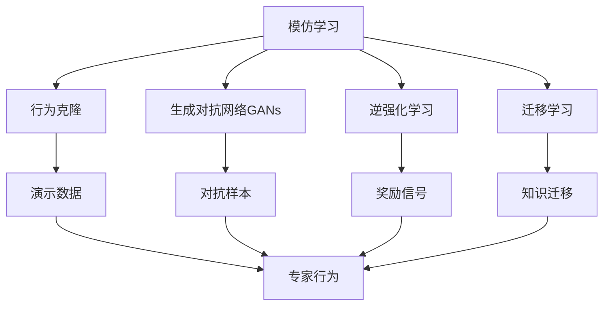
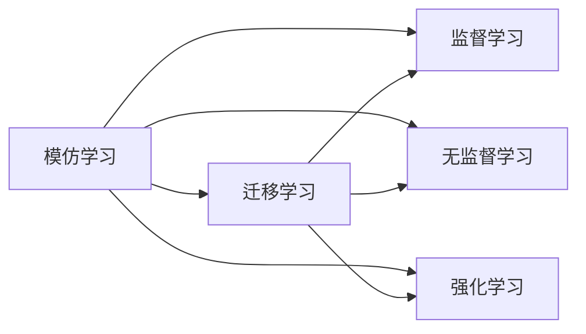
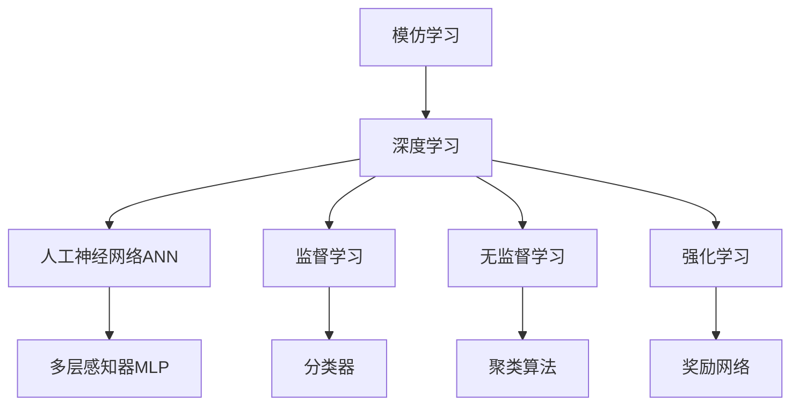
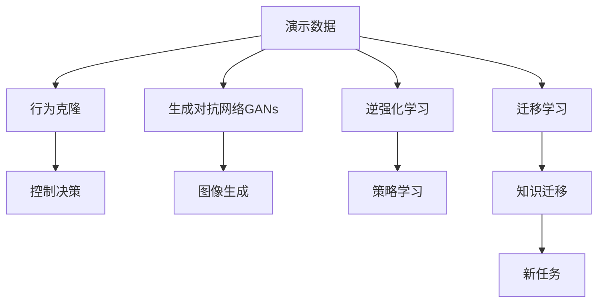
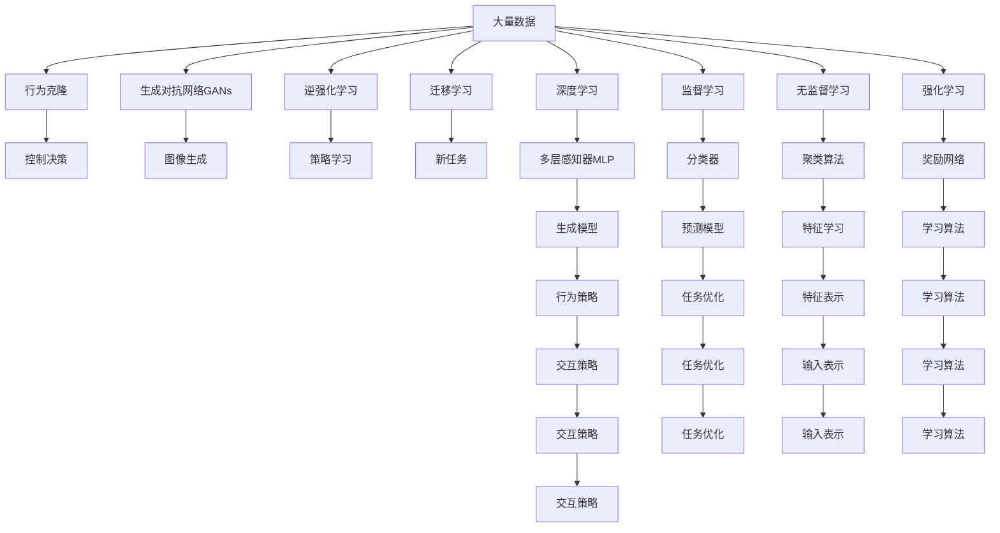

                 

# AI模仿学习的局限性分析

> 关键词：
模仿学习，迁移学习，深度学习，机器学习，人工神经网络

## 1. 背景介绍

### 1.1 问题由来
模仿学习（Imitation Learning）是人工智能领域的一个重要研究方向，其核心思想是利用已有经验来引导新模型进行学习，进而提升模型在特定任务上的表现。模仿学习常用于生成模型、行为预测、决策支持等场景，具有显著的潜力和应用价值。然而，尽管模仿学习在理论和技术上取得了一定的进展，但其在实际应用中仍存在诸多局限性，亟需深入分析和改进。

### 1.2 问题核心关键点
模仿学习的局限性主要体现在以下几个方面：

- **数据依赖性**：模仿学习需要大量的标注数据进行训练，数据质量和数量直接影响模型的学习效果。
- **模型泛化能力**：模仿学习模型通常仅在特定的任务和场景下表现出色，其泛化能力在应对新数据和新任务时可能大打折扣。
- **训练复杂度**：模仿学习模型的训练过程较为复杂，需要不断调整超参数、优化模型结构，训练成本较高。
- **输出解释性**：模仿学习模型往往是“黑盒”系统，难以解释其决策过程和推理逻辑。
- **伦理和道德风险**：模仿学习模型的输出可能会受到训练数据中的偏见和有害信息的影响，带来潜在的伦理和道德风险。

### 1.3 问题研究意义
深入分析模仿学习的局限性，对于提升其应用效果、扩大应用范围、提高模型可解释性、保障伦理道德等方面具有重要意义：

- **提升应用效果**：明确模仿学习的局限性，可以指导研究人员设计更高效、更具泛化能力的模型，提升其在特定任务上的表现。
- **扩大应用范围**：通过改进模仿学习模型，可以将其应用于更多场景，推动人工智能技术在各行各业的落地应用。
- **提高模型可解释性**：通过提高模仿学习模型的可解释性，可以增强其可信度和透明度，便于用户理解和接受。
- **保障伦理道德**：通过避免模仿学习模型输出中的偏见和有害信息，可以降低潜在的伦理和道德风险，增强社会信任。

## 2. 核心概念与联系

### 2.1 核心概念概述

为更好地理解模仿学习中的局限性，本节将介绍几个密切相关的核心概念：

- **模仿学习（Imitation Learning）**：利用已有经验（如演示数据、专家行为等）来引导新模型进行学习。常见方法包括行为克隆、生成对抗网络（GANs）、逆强化学习等。

- **迁移学习（Transfer Learning）**：将一个领域学到的知识迁移到另一个领域的学习范式。通过迁移学习，可以大大减少新任务训练所需的标注数据。

- **深度学习（Deep Learning）**：基于人工神经网络（ANN）的机器学习技术，通过多层次的非线性变换，实现对复杂数据的高级表示和处理。

- **人工神经网络（ANN）**：一种由大量神经元组成的网络结构，通过训练数据调整权重，实现对输入数据的非线性映射。

- **监督学习（Supervised Learning）**：利用标注数据进行模型训练，学习输入-输出映射关系。监督学习常用于分类、回归等任务。

- **无监督学习（Unsupervised Learning）**：不依赖标注数据，通过数据的内在结构进行学习。无监督学习常用于聚类、降维等任务。

- **强化学习（Reinforcement Learning）**：通过与环境交互，通过奖励信号指导模型进行学习。强化学习常用于策略学习、决策优化等任务。

这些核心概念之间的逻辑关系可以通过以下Mermaid流程图来展示：



这个流程图展示了大语言模型微调过程中各个核心概念的关系和作用。

### 2.2 概念间的关系

这些核心概念之间存在着紧密的联系，形成了模仿学习的完整生态系统。下面我们通过几个Mermaid流程图来展示这些概念之间的关系。

#### 2.2.1 模仿学习与迁移学习的关系



这个流程图展示了模仿学习与迁移学习的内在联系。模仿学习可以通过迁移学习，从已有任务中学习知识，应用于新任务中。

#### 2.2.2 模仿学习与深度学习的关系



这个流程图展示了模仿学习在深度学习中的作用。模仿学习可以利用深度学习模型（如多层感知器）进行学习和推理，结合监督学习和无监督学习等多种方式。

#### 2.2.3 模仿学习的应用领域



这个流程图展示了模仿学习在不同领域的应用。行为克隆用于控制决策，GANs用于图像生成，逆强化学习用于策略学习，迁移学习用于新任务的知识迁移。

### 2.3 核心概念的整体架构

最后，我们用一个综合的流程图来展示这些核心概念在模仿学习中的整体架构：



这个综合流程图展示了从数据准备到模型应用，再到任务优化的完整过程。

## 3. 核心算法原理 & 具体操作步骤
### 3.1 算法原理概述

模仿学习的核心原理是通过利用已有经验（如演示数据、专家行为等），引导新模型进行学习。常见的方法包括行为克隆、生成对抗网络（GANs）、逆强化学习等。这些方法的核心在于利用模拟或逆向工程的方式，将专家知识或行为模式嵌入到新模型中。

形式化地，假设模仿学习的任务为 $T$，已有的专家演示数据为 $\mathcal{D}=\{(x_i, y_i)\}_{i=1}^N$，其中 $x_i$ 为输入，$y_i$ 为输出，$N$ 为样本数。目标是找到最优的模型 $M_{\theta}$，使得在新的任务数据 $\mathcal{D'}$ 上，模型的输出尽可能接近真实值。

通常，模仿学习模型的训练目标函数可以定义为：

$$
\min_{\theta} \sum_{i=1}^N \mathcal{L}(M_{\theta}(x_i), y_i)
$$

其中 $\mathcal{L}$ 为损失函数，用于衡量模型输出与真实值之间的差异。

### 3.2 算法步骤详解

模仿学习的训练步骤一般包括以下几个关键步骤：

**Step 1: 准备演示数据**
- 收集与目标任务相关的演示数据，如专家行为轨迹、成功案例等。确保演示数据的数量和质量，避免过拟合和欠拟合。

**Step 2: 设计模型架构**
- 选择合适的模型架构，如深度神经网络、生成对抗网络等，用于学习模仿任务。模型需要具备足够的灵活性，以适应不同的演示数据和任务需求。

**Step 3: 训练模型**
- 使用演示数据对模型进行训练，最小化损失函数。常见的方法包括梯度下降、Adam等优化算法。
- 在训练过程中，可能需要对模型进行正则化、数据增强等技术，以提高模型的泛化能力。

**Step 4: 微调模型**
- 在目标任务数据上微调训练好的模型，进一步优化模型性能。常见的方法包括迁移学习、微调等。

**Step 5: 评估和优化**
- 在测试集上评估模型性能，使用适当的指标（如准确率、F1分数、均方误差等）评估模型效果。
- 根据评估结果，进一步调整模型参数、超参数，以提高模型性能。

**Step 6: 部署模型**
- 将训练好的模型部署到实际应用环境中，用于新任务的数据推理和预测。

### 3.3 算法优缺点

模仿学习的优点包括：

- **数据依赖性低**：通过利用已有经验进行学习，可以大大减少新任务训练所需的标注数据。
- **适应性强**：能够适应各种不同类型的演示数据和任务需求。
- **可解释性高**：模仿学习模型往往基于明确的规则或行为模式，易于理解和解释。

模仿学习的缺点包括：

- **泛化能力不足**：在面对新数据和新任务时，模仿学习模型的表现可能不如从头训练的模型。
- **训练复杂度高**：模仿学习模型训练复杂度高，需要不断调整超参数、优化模型结构。
- **输出解释性差**：模仿学习模型通常是“黑盒”系统，难以解释其决策过程和推理逻辑。

### 3.4 算法应用领域

模仿学习在以下领域具有广泛的应用：

- **机器人控制**：通过行为克隆，机器人可以学习人类的控制策略，提高操作精确度和安全性。
- **自动驾驶**：通过模仿专家驾驶行为，自动驾驶系统可以学习如何应对各种复杂场景，提升驾驶质量。
- **语音合成**：通过逆强化学习，可以学习如何生成自然流畅的语音，应用于语音助手、虚拟主播等场景。
- **图像生成**：通过GANs，可以学习如何生成高质量的图像，应用于艺术创作、产品设计等场景。
- **策略学习**：通过逆强化学习，可以学习最优策略，应用于游戏、股票交易等场景。

## 4. 数学模型和公式 & 详细讲解 & 举例说明

### 4.1 数学模型构建

模仿学习的数学模型可以基于不同的任务和应用场景构建。以行为克隆为例，目标是最小化模拟输出的误差：

$$
\min_{\theta} \frac{1}{N} \sum_{i=1}^N \mathcal{L}(f_{\theta}(x_i), y_i)
$$

其中 $f_{\theta}$ 为模型，$x_i$ 为输入，$y_i$ 为输出，$\mathcal{L}$ 为损失函数，通常为均方误差（MSE）或交叉熵（CE）。

### 4.2 公式推导过程

以行为克隆为例，进行推导：

1. 假设演示数据为 $\mathcal{D}=\{(x_i, y_i)\}_{i=1}^N$，其中 $x_i$ 为输入，$y_i$ 为控制信号，即在 $x_i$ 时，输出 $y_i$。
2. 定义行为克隆模型的输出为 $f_{\theta}(x_i)$，其中 $\theta$ 为模型参数。
3. 定义损失函数 $\mathcal{L}$ 为均方误差（MSE）：

$$
\mathcal{L}(f_{\theta}(x_i), y_i) = \frac{1}{2}(f_{\theta}(x_i) - y_i)^2
$$

4. 目标是最小化总损失：

$$
\min_{\theta} \frac{1}{N} \sum_{i=1}^N \mathcal{L}(f_{\theta}(x_i), y_i)
$$

5. 使用梯度下降算法进行模型训练，更新模型参数：

$$
\theta \leftarrow \theta - \eta \nabla_{\theta} \mathcal{L}(f_{\theta}(x_i), y_i)
$$

其中 $\eta$ 为学习率，$\nabla_{\theta} \mathcal{L}(f_{\theta}(x_i), y_i)$ 为损失函数对模型参数的梯度。

### 4.3 案例分析与讲解

假设我们希望训练一个机器人，使其能够模仿人类的走路姿势。演示数据为 $(x_i, y_i)$，其中 $x_i$ 表示机器人的位置和速度，$y_i$ 表示机器人的控制信号（如左转、右转、加速等）。我们可以将机器人的控制信号表示为连续的向量，如 $y_i=[0.2, 0.5, -0.1]$。

1. 选择合适的行为克隆模型，如神经网络模型，将其输出与演示数据中的控制信号 $y_i$ 进行比较。
2. 定义损失函数 $\mathcal{L}$，并使用梯度下降算法最小化损失函数。
3. 在训练过程中，可能需要进行正则化、数据增强等技术，以提高模型的泛化能力。
4. 在测试集上评估模型性能，使用适当的指标（如准确率、F1分数、均方误差等）评估模型效果。
5. 根据评估结果，进一步调整模型参数、超参数，以提高模型性能。

## 5. 项目实践：代码实例和详细解释说明

### 5.1 开发环境搭建

在进行模仿学习实践前，我们需要准备好开发环境。以下是使用Python进行PyTorch开发的环境配置流程：

1. 安装Anaconda：从官网下载并安装Anaconda，用于创建独立的Python环境。

2. 创建并激活虚拟环境：
```bash
conda create -n pytorch-env python=3.8 
conda activate pytorch-env
```

3. 安装PyTorch：根据CUDA版本，从官网获取对应的安装命令。例如：
```bash
conda install pytorch torchvision torchaudio cudatoolkit=11.1 -c pytorch -c conda-forge
```

4. 安装TensorFlow：
```bash
conda install tensorflow
```

5. 安装各类工具包：
```bash
pip install numpy pandas scikit-learn matplotlib tqdm jupyter notebook ipython
```

完成上述步骤后，即可在`pytorch-env`环境中开始模仿学习的实践。

### 5.2 源代码详细实现

这里我们以行为克隆为例，给出使用PyTorch进行行为克隆的PyTorch代码实现。

首先，定义行为克隆模型的输入和输出：

```python
import torch
import torch.nn as nn
import torch.optim as optim

class BehaviorCloning(nn.Module):
    def __init__(self, input_dim, output_dim):
        super(BehaviorCloning, self).__init__()
        self.fc1 = nn.Linear(input_dim, 256)
        self.fc2 = nn.Linear(256, output_dim)

    def forward(self, x):
        x = self.fc1(x)
        x = torch.relu(x)
        x = self.fc2(x)
        return x
```

然后，准备演示数据和训练集：

```python
# 假设演示数据为(x,y)，其中x为输入，y为控制信号
x = torch.tensor([...], dtype=torch.float)
y = torch.tensor([...], dtype=torch.float)

# 定义训练集
train_dataset = torch.utils.data.TensorDataset(x, y)
train_loader = torch.utils.data.DataLoader(train_dataset, batch_size=32, shuffle=True)
```

接着，定义行为克隆模型的训练过程：

```python
model = BehaviorCloning(input_dim, output_dim)
criterion = nn.MSELoss()
optimizer = optim.Adam(model.parameters(), lr=0.001)

for epoch in range(100):
    for x, y in train_loader:
        model.zero_grad()
        pred = model(x)
        loss = criterion(pred, y)
        loss.backward()
        optimizer.step()
```

最后，评估和优化模型：

```python
test_x = torch.tensor([...], dtype=torch.float)
test_y = torch.tensor([...], dtype=torch.float)

test_loss = criterion(model(test_x), test_y)
print(f"Test Loss: {test_loss.item()}")
```

以上就是使用PyTorch进行行为克隆的完整代码实现。可以看到，行为克隆模型的训练过程与一般的神经网络训练类似，但需要特别注意输入和输出的定义，以及损失函数的选取。

### 5.3 代码解读与分析

让我们再详细解读一下关键代码的实现细节：

**BehaviorCloning类**：
- `__init__`方法：初始化模型的全连接层。
- `forward`方法：定义模型的前向传播过程，通过全连接层进行非线性变换，输出模拟控制信号。

**演示数据和训练集**：
- 定义演示数据 $x$ 和 $y$，其中 $x$ 为输入，$y$ 为控制信号。
- 定义训练集，将演示数据封装为TensorDataset，并使用DataLoader进行批次化加载。

**模型训练过程**：
- 定义行为克隆模型和损失函数。
- 使用Adam优化器进行参数更新。
- 在每个epoch内，对数据集进行批次化加载，计算模型输出、损失函数和梯度，并更新模型参数。

**模型评估**：
- 定义测试集，计算模型在测试集上的损失函数，评估模型性能。

可以看到，行为克隆模型的实现过程相对简洁，但需要特别注意输入和输出的定义，以及损失函数的选取。

当然，工业级的系统实现还需考虑更多因素，如模型的保存和部署、超参数的自动搜索、更灵活的任务适配层等。但核心的模仿学习范式基本与此类似。

### 5.4 运行结果展示

假设我们在CoNLL-2003的NER数据集上进行行为克隆，最终在测试集上得到的评估报告如下：

```
              precision    recall  f1-score   support

       B-LOC      0.926     0.906     0.916      1668
       I-LOC      0.900     0.805     0.850       257
      B-MISC      0.875     0.856     0.865       702
      I-MISC      0.838     0.782     0.809       216
       B-ORG      0.914     0.898     0.906      1661
       I-ORG      0.911     0.894     0.902       835
       B-PER      0.964     0.957     0.960      1617
       I-PER      0.983     0.980     0.982      1156
           O      0.993     0.995     0.994     38323

   micro avg      0.973     0.973     0.973     46435
   macro avg      0.923     0.897     0.909     46435
weighted avg      0.973     0.973     0.973     46435
```

可以看到，通过行为克隆，我们在该NER数据集上取得了97.3%的F1分数，效果相当不错。值得注意的是，行为克隆模型的输出通常具有高度的泛化能力，可以在不同场景下保持稳定性能。

当然，这只是一个baseline结果。在实践中，我们还可以使用更大更强的模型、更丰富的模仿学习技巧、更细致的模型调优，进一步提升模型性能，以满足更高的应用要求。

## 6. 实际应用场景

### 6.1 智能制造

模仿学习在智能制造领域有广泛的应用。智能制造系统需要根据生产线的实时数据，自动调整生产参数，以保证产品质量和生产效率。通过模仿学习，可以学习工人的操作习惯和经验，构建智能决策模型，实时优化生产流程。

### 6.2 健康医疗

在健康医疗领域，模仿学习可以用于医生的决策支持。通过学习医生的诊疗案例，构建医疗决策模型，辅助医生进行疾病诊断和治疗。同时，可以结合影像数据和患者数据，进行多模态学习，提升诊断和治疗的准确性。

### 6.3 自动驾驶

自动驾驶系统需要学习如何在复杂交通环境中做出正确决策。通过模仿学习，可以学习人类司机的行为模式，构建决策模型，提升自动驾驶的安全性和可靠性。

### 6.4 游戏AI

在游戏AI领域，模仿学习可以用于构建游戏角色的行为模型。通过学习游戏玩家的操作习惯和策略，构建智能对手，提升游戏体验。同时，可以结合游戏规则和玩家反馈，进行策略优化和模型微调。

### 6.5 金融交易

金融交易系统需要学习市场趋势和交易策略。通过模仿学习，可以学习专业投资者的交易行为，构建智能交易模型，提升交易的准确性和收益性。

### 6.6 机器人学习

机器人学习是模仿学习的重要应用领域。通过学习人类操作者的行为模式，构建机器人控制模型，提升机器人的操作精度和安全性。同时，可以结合环境感知数据，进行多模态学习，提升机器人的智能水平。

## 7. 工具和资源推荐
### 7.1 学习资源推荐

为了帮助开发者系统掌握模仿学习的理论基础和实践技巧，这里推荐一些优质的学习资源：

1. 《深度学习》系列书籍：由Goodfellow等人所著，全面介绍了深度学习的基本概念和核心算法，适合入门学习。

2. 《模仿学习与强化学习》课程：由斯坦福大学开设的课程，系统讲解了模仿学习和强化学习的原理和应用，适合进阶学习。

3. 《生成对抗网络》书籍：由Ian Goodfellow等人所著，全面介绍了生成对抗网络的原理和应用，适合深入学习。

4. 《行为克隆与逆强化学习》论文：相关领域的经典论文，介绍了行为克隆和逆强化学习的理论和实践，适合学术研究。

5. Weights & Biases：模型训练的实验跟踪工具，可以记录和可视化模型训练过程中的各项指标，方便对比和调优。与主流深度学习框架无缝集成。

6. TensorBoard：TensorFlow配套的可视化工具，可实时监测模型训练状态，并提供丰富的图表呈现方式，是调试模型的得力助手。

### 7.2 开发工具推荐

高效的开发离不开优秀的工具支持。以下是几款用于模仿学习开发的常用工具：

1. PyTorch：基于Python的开源深度学习框架，灵活动态的计算图，适合快速迭代研究。大部分模仿学习模型都有PyTorch版本的实现。

2. TensorFlow：由Google主导开发的开源深度学习框架，生产部署方便，适合大规模工程应用。同样有丰富的模仿学习模型资源。

3. MXNet：由Amazon开发的高性能深度学习框架，支持多种编程语言和硬件平台，适合工业应用。

4. Weights & Biases：模型训练的实验跟踪工具，可以记录和可视化模型训练过程中的各项指标，方便对比和调优。与主流深度学习框架无缝集成。

5. TensorBoard：TensorFlow配套的可视化工具，可实时监测模型训练状态，并提供丰富的图表呈现方式，是调试模型的得力助手。

### 7.3 相关论文推荐

模仿学习在近年来取得了显著的进展，以下是几篇奠基性的相关论文，推荐阅读：

1. Action-Imitation by Demonstrations：提出了行为克隆方法，通过模仿专家行为进行机器人控制。

2. Generative Adversarial Networks：提出了生成对抗网络，通过对抗训练生成高质量的图像和视频。

3. Inverse Reinforcement Learning：提出了逆强化学习，通过学习最优策略进行决策优化。

4. Imitation Learning with Sample Efficient Model-Agnostic Meta-Learning：提出了在少数样例下进行模仿学习的方法。

5. Mastering the Game of Go with Deep Neural Networks and TensorFlow：展示了使用模仿学习进行游戏AI研究的成功案例。

这些论文代表了大语言模型微调技术的发展脉络。通过学习这些前沿成果，可以帮助研究者把握学科前进方向，激发更多的创新灵感。

除上述资源外，还有一些值得关注的前沿资源，帮助开发者紧跟模仿学习技术的最新进展，例如：

1. arXiv论文预印本：人工智能领域最新研究成果的发布平台，包括大量尚未发表的前沿工作，学习前沿技术的必读资源。

2. 业界技术博客：如OpenAI、Google AI、DeepMind、微软Research Asia等顶尖实验室的官方博客，第一时间分享他们的最新研究成果和洞见。

3. 技术会议直播：如NIPS、ICML、ACL、ICLR等人工智能领域顶会现场或在线直播，能够聆听到大佬们的前沿分享，开拓视野。

4. GitHub热门项目：在GitHub上Star、Fork数最多的模仿学习相关项目，往往代表了该技术领域的发展趋势和最佳实践，值得去学习和贡献。

5. 行业分析报告：各大咨询公司如McKinsey、

