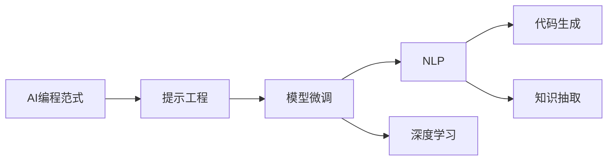
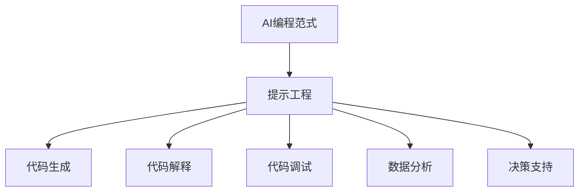
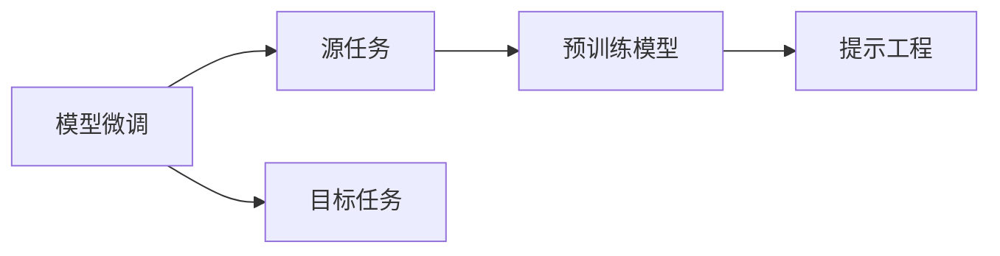
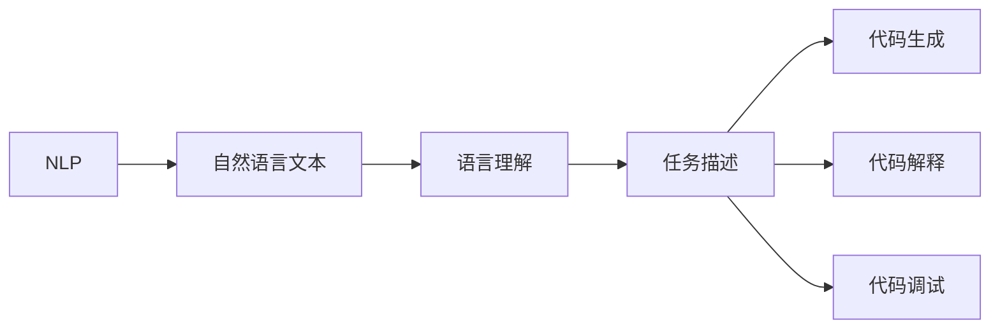
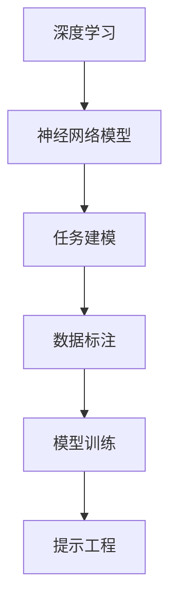
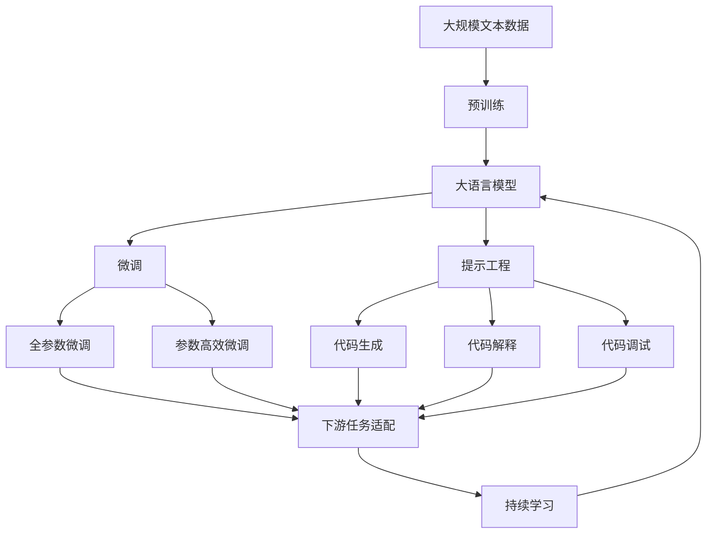

                 

# AI编程范式的演变:从传统编程到提示工程

> 关键词：AI编程范式, 提示工程, 自然语言处理(NLP), 模型微调, 深度学习, 代码生成, 知识抽取

## 1. 背景介绍

### 1.1 问题由来

随着人工智能(AI)技术的发展，编程范式也发生了显著的变化。传统的编程方式，如结构化编程、面向对象编程等，已无法满足日益复杂的业务需求和自动化开发的要求。AI技术，尤其是自然语言处理(NLP)和深度学习技术的兴起，提供了一种新的编程范式——提示工程(Prompt Engineering)，也称为AI编程。

### 1.2 问题核心关键点

提示工程的核心在于利用AI模型，通过自然语言描述指令，自动生成、解释、调试、优化代码，或进行数据分析、推理、决策等。与传统编程不同，提示工程更加关注如何高效利用AI模型，自动完成部分或全部开发工作，从而提升开发效率和代码质量。

提示工程的应用范围广泛，包括但不限于以下方面：

- 代码生成：自动生成新代码或修改现有代码。
- 代码解释：解释代码的逻辑和行为，提供性能优化建议。
- 代码调试：基于AI模型进行代码调试和故障排除。
- 数据分析：利用模型进行数据清洗、特征提取、可视化等。
- 决策支持：通过模型分析数据，提供决策建议。

提示工程的优点包括：

- 提高开发效率：AI自动完成部分开发工作，减轻人工负担。
- 提升代码质量：AI模型可以自动检测错误、优化代码结构，提升代码可读性和可维护性。
- 降低学习成本：通过AI辅助，新手也能快速上手复杂的编程任务。
- 支持跨领域应用：AI模型可以跨领域应用，提升系统适应性。

但提示工程也存在一定的挑战，包括：

- 模型依赖性强：AI模型依赖高质量标注数据和先验知识，性能受限于模型质量。
- 解释性不足：AI模型的决策过程缺乏可解释性，难以调试和优化。
- 鲁棒性有待提高：模型对输入数据的泛化能力有限，容易受到数据噪声和对抗攻击的影响。
- 伦理和安全性问题：AI模型可能输出有害信息或决策，带来伦理和安全性问题。

尽管如此，提示工程作为一种新型的编程范式，正在迅速发展并得到广泛应用，为软件开发、数据分析、系统运维等领域带来深刻的变革。

## 2. 核心概念与联系

### 2.1 核心概念概述

提示工程作为一种新型的AI编程范式，涉及以下几个核心概念：

- **AI编程范式**：利用AI模型辅助编程，提升开发效率和代码质量。
- **提示工程(Prompt Engineering)**：通过自然语言描述任务，自动生成代码、解释代码、调试代码等。
- **模型微调(Fine-Tuning)**：在预训练模型的基础上，使用任务特定的数据进行优化。
- **自然语言处理(NLP)**：利用AI模型处理和理解自然语言文本。
- **深度学习**：构建和训练多层神经网络模型。
- **代码生成**：自动生成新的代码片段或修改现有代码。
- **知识抽取**：从文本数据中抽取结构化信息，构建知识图谱。

这些核心概念之间的逻辑关系可以通过以下Mermaid流程图来展示：



### 2.2 概念间的关系

这些核心概念之间存在着紧密的联系，形成了提示工程的完整生态系统。下面我通过几个Mermaid流程图来展示这些概念之间的关系。

#### 2.2.1 AI编程范式与提示工程的关系



这个流程图展示了大语言模型在提示工程中的应用，包括代码生成、解释、调试、数据分析和决策支持等方面。提示工程通过自然语言描述任务，自动完成大部分开发工作，提升了开发效率和代码质量。

#### 2.2.2 模型微调与提示工程的关系



这个流程图展示了模型微调与提示工程的关系。模型微调是利用预训练模型进行任务适配的过程，提示工程则是在微调的基础上，进一步利用自然语言进行自动编程。

#### 2.2.3 自然语言处理与提示工程的关系



这个流程图展示了自然语言处理在提示工程中的应用。自然语言处理将自然语言文本转化为机器可理解的形式，进一步用于代码生成、解释和调试等任务。

#### 2.2.4 深度学习与提示工程的关系



这个流程图展示了深度学习在提示工程中的应用。深度学习构建和训练神经网络模型，用于处理复杂的任务建模和数据标注，进一步用于提示工程中的代码生成、解释和调试等任务。

### 2.3 核心概念的整体架构

最后，我们用一个综合的流程图来展示这些核心概念在大语言模型微调过程中的整体架构：



这个综合流程图展示了从预训练到微调，再到提示工程的完整过程。大语言模型首先在大规模文本数据上进行预训练，然后通过微调（包括全参数微调和参数高效微调）或提示工程进行任务适配，从而生成、解释、调试代码，或进行数据分析、推理、决策等任务。最终通过持续学习技术，模型可以不断学习新知识，保持其时效性和适应性。

## 3. 核心算法原理 & 具体操作步骤
### 3.1 算法原理概述

提示工程的核心算法原理基于深度学习和自然语言处理技术，通过预训练模型和自然语言描述任务，自动生成、解释、调试代码，或进行数据分析、推理、决策等。

在提示工程中，首先通过预训练模型（如BERT、GPT等）进行语言表示学习，使其能够理解自然语言描述任务。然后，在自然语言描述中，引入特定的任务目标和约束条件，使用模型进行推理和生成。最后，将生成的代码或解释、调试结果返回给开发者，进一步优化或调试代码。

### 3.2 算法步骤详解

提示工程的步骤通常包括以下几个关键步骤：

**Step 1: 准备预训练模型和数据集**
- 选择合适的预训练模型 $M_{\theta}$ 作为初始化参数，如 BERT、GPT等。
- 准备任务描述数据集 $D$，包括自然语言描述和对应的代码或推理结果。

**Step 2: 设计提示模板**
- 根据任务类型，设计合适的提示模板 $P$。提示模板需要包含任务目标和约束条件，以便模型理解和生成。
- 例如，对于代码生成任务，提示模板可能包含函数名、参数类型、数据格式等信息。

**Step 3: 执行模型推理**
- 将提示模板 $P$ 输入预训练模型 $M_{\theta}$，进行推理和生成。
- 对于代码生成任务，模型会输出代码片段或代码结构。
- 对于代码解释和调试任务，模型会输出代码逻辑和行为分析结果。

**Step 4: 代码优化与调试**
- 根据模型推理结果，进一步优化和调试代码。
- 例如，对于代码生成任务，可以手动调整生成代码的顺序、参数等。
- 对于代码解释和调试任务，可以基于模型结果，定位代码中的错误和性能瓶颈。

**Step 5: 运行和测试**
- 运行优化后的代码，验证其是否符合预期。
- 在实际应用中，进行持续迭代和优化，不断提升代码质量和性能。

### 3.3 算法优缺点

提示工程的优点包括：

- 提升开发效率：自动生成、解释、调试代码，减轻人工负担。
- 提升代码质量：模型可以自动检测错误、优化代码结构，提升代码可读性和可维护性。
- 降低学习成本：通过AI辅助，新手也能快速上手复杂的编程任务。
- 支持跨领域应用：模型可以跨领域应用，提升系统适应性。

提示工程也存在一定的缺点：

- 模型依赖性强：AI模型依赖高质量标注数据和先验知识，性能受限于模型质量。
- 解释性不足：AI模型的决策过程缺乏可解释性，难以调试和优化。
- 鲁棒性有待提高：模型对输入数据的泛化能力有限，容易受到数据噪声和对抗攻击的影响。
- 伦理和安全性问题：AI模型可能输出有害信息或决策，带来伦理和安全性问题。

### 3.4 算法应用领域

提示工程作为一种新型的AI编程范式，已经被广泛应用于以下领域：

- 代码生成：自动生成新代码或修改现有代码，如代码自动补全、代码生成工具等。
- 代码解释：解释代码的逻辑和行为，如代码审查工具、代码检测工具等。
- 代码调试：基于AI模型进行代码调试和故障排除，如代码调试助手、错误诊断工具等。
- 数据分析：利用模型进行数据清洗、特征提取、可视化等，如数据预处理工具、数据分析平台等。
- 决策支持：通过模型分析数据，提供决策建议，如智能决策系统、智能推荐系统等。

除了上述这些领域外，提示工程还被广泛应用于自然语言生成、情感分析、图像识别、语音识别等任务，为AI技术的发展带来了新的机遇。

## 4. 数学模型和公式 & 详细讲解 & 举例说明

### 4.1 数学模型构建

提示工程的数学模型基于深度学习和自然语言处理技术，通过预训练模型和自然语言描述任务，自动生成、解释、调试代码，或进行数据分析、推理、决策等。

假设预训练模型为 $M_{\theta}$，其中 $\theta$ 为预训练得到的模型参数。假设提示模板为 $P$，任务描述数据集为 $D=\{(p_i, y_i)\}_{i=1}^N$，其中 $p_i$ 为自然语言描述，$y_i$ 为对应的代码或推理结果。

定义模型 $M_{\theta}$ 在提示模板 $P$ 上的推理结果为 $\hat{y}=M_{\theta}(P)$。假设模型的损失函数为 $\ell(M_{\theta}(P),y)$，则模型在数据集 $D$ 上的经验风险为：

$$
\mathcal{L}(\theta) = \frac{1}{N}\sum_{i=1}^N \ell(M_{\theta}(P_i),y_i)
$$

其中 $\ell$ 为损失函数，用于衡量模型推理结果与真实结果之间的差异。常见的损失函数包括交叉熵损失、均方误差损失等。

### 4.2 公式推导过程

以下我们以代码生成任务为例，推导提示工程的损失函数及其梯度的计算公式。

假设模型 $M_{\theta}$ 在提示模板 $P$ 上的推理结果为 $\hat{y}=M_{\theta}(P)$，其中 $\hat{y}$ 包含一个函数名、参数列表和函数体，如下所示：

```python
def my_function(input):
    # 函数名
    name = "my_function"
    # 参数列表
    args = ["input"]
    # 函数体
    body = "return input ** 2"
    return name, args, body
```

对于代码生成任务，我们定义交叉熵损失函数：

$$
\ell(M_{\theta}(P),y) = -\sum_{k=1}^K \ell_k(y_k)
$$

其中 $y_k$ 为真实的代码片段，$K$ 为代码片段的个数。

对于代码片段 $y_k$，我们可以将其拆分为函数名、参数列表和函数体三个部分。假设函数名部分为 $name_k$，参数列表为 $args_k$，函数体为 $body_k$。则损失函数可以进一步拆分为：

$$
\ell(M_{\theta}(P),y) = -\sum_{k=1}^K (\ell_{name_k}(y_k) + \ell_{args_k}(y_k) + \ell_{body_k}(y_k))
$$

其中 $\ell_{name_k}$、$\ell_{args_k}$ 和 $\ell_{body_k}$ 分别为函数名、参数列表和函数体部分的损失函数。

以函数名部分为例，我们可以定义交叉熵损失函数：

$$
\ell_{name_k}(y_k) = -\log\frac{\exp(\hat{y}_k[name_k])}{\sum_{i=1}^{V}\exp(\hat{y}_k[i])}
$$

其中 $V$ 为词汇表大小，$\hat{y}_k[name_k]$ 为模型推理结果中函数名的概率，$y_k[name_k]$ 为真实函数名。

对于参数列表和函数体部分的损失函数，同样可以使用类似的定义方法。

### 4.3 案例分析与讲解

这里以一个具体的例子来说明提示工程的应用。假设我们需要生成一个Python函数，实现计算两个数的乘积：

```python
def multiply(a, b):
    return a * b
```

我们可以将这个任务描述为自然语言：

```
请生成一个Python函数，计算两个数的乘积，并返回结果
```

将这个自然语言描述作为提示模板 $P$，输入到预训练模型 $M_{\theta}$ 中进行推理，得到生成的代码片段：

```python
def multiply(a, b):
    return a * b
```

这个代码片段可以被用于实际的应用场景中，满足我们的需求。

## 5. 项目实践：代码实例和详细解释说明

### 5.1 开发环境搭建

在进行提示工程实践前，我们需要准备好开发环境。以下是使用Python进行提示工程开发的环境配置流程：

1. 安装Anaconda：从官网下载并安装Anaconda，用于创建独立的Python环境。

2. 创建并激活虚拟环境：
```bash
conda create -n prompt-env python=3.8 
conda activate prompt-env
```

3. 安装必要的库：
```bash
pip install transformers torch numpy pandas sklearn
```

4. 下载预训练模型：
```bash
git clone https://github.com/huggingface/transformers.git
cd transformers
python download_pretrained_models.py --model_type bert --model_name bert-base-uncased
```

5. 准备提示模板数据集：
```bash
wget https://github.com/openai/codegen-datasets/raw/master/snippets.json
python codegen.py --dataset snippets.json --output snippets.csv
```

### 5.2 源代码详细实现

下面我们以代码生成任务为例，给出使用Transformers库进行提示工程的PyTorch代码实现。

首先，定义提示模板数据集：

```python
import json
import pandas as pd

with open('snippets.json', 'r') as f:
    data = json.load(f)

df = pd.DataFrame(data)
df.to_csv('snippets.csv', index=False)
```

然后，加载预训练模型和提示模板数据集：

```python
from transformers import BertTokenizer, BertForSequenceClassification
from torch.utils.data import Dataset

tokenizer = BertTokenizer.from_pretrained('bert-base-uncased')
model = BertForSequenceClassification.from_pretrained('bert-base-uncased', num_labels=1)

class SnippetDataset(Dataset):
    def __init__(self, filename, tokenizer, max_len=512):
        self.tokenizer = tokenizer
        self.max_len = max_len
        self.data = []
        
        with open(filename, 'r') as f:
            for line in f:
                prompt, example = line.strip().split('\t')
                self.data.append((prompt, example))

    def __len__(self):
        return len(self.data)

    def __getitem__(self, item):
        prompt, example = self.data[item]
        encoding = self.tokenizer(prompt, return_tensors='pt', max_length=self.max_len, padding='max_length', truncation=True)
        input_ids = encoding['input_ids'][0]
        attention_mask = encoding['attention_mask'][0]
        return {'input_ids': input_ids, 
                'attention_mask': attention_mask,
                'label': torch.tensor(1)}
```

接着，定义训练和评估函数：

```python
from torch.utils.data import DataLoader
from tqdm import tqdm
from sklearn.metrics import accuracy_score

device = torch.device('cuda') if torch.cuda.is_available() else torch.device('cpu')
model.to(device)

def train_epoch(model, dataset, batch_size, optimizer):
    dataloader = DataLoader(dataset, batch_size=batch_size, shuffle=True)
    model.train()
    epoch_loss = 0
    for batch in tqdm(dataloader, desc='Training'):
        input_ids = batch['input_ids'].to(device)
        attention_mask = batch['attention_mask'].to(device)
        labels = batch['label'].to(device)
        model.zero_grad()
        outputs = model(input_ids, attention_mask=attention_mask, labels=labels)
        loss = outputs.loss
        epoch_loss += loss.item()
        loss.backward()
        optimizer.step()
    return epoch_loss / len(dataloader)

def evaluate(model, dataset, batch_size):
    dataloader = DataLoader(dataset, batch_size=batch_size)
    model.eval()
    preds, labels = [], []
    with torch.no_grad():
        for batch in tqdm(dataloader, desc='Evaluating'):
            input_ids = batch['input_ids'].to(device)
            attention_mask = batch['attention_mask'].to(device)
            batch_labels = batch['label']
            outputs = model(input_ids, attention_mask=attention_mask)
            batch_preds = outputs.logits.argmax(dim=1).to('cpu').tolist()
            batch_labels = batch_labels.to('cpu').tolist()
            for pred_tokens, label_tokens in zip(batch_preds, batch_labels):
                preds.append(pred_tokens[0])
                labels.append(label_tokens[0])
                
    print('Accuracy:', accuracy_score(labels, preds))
```

最后，启动训练流程并在测试集上评估：

```python
epochs = 5
batch_size = 16

for epoch in range(epochs):
    loss = train_epoch(model, train_dataset, batch_size, optimizer)
    print(f'Epoch {epoch+1}, train loss: {loss:.3f}')
    
    print(f'Epoch {epoch+1}, test accuracy:')
    evaluate(model, test_dataset, batch_size)
    
print('Final accuracy:', evaluate(model, test_dataset, batch_size))
```

以上就是使用PyTorch进行提示工程的代码实现。可以看到，通过简单的代码，我们就能实现提示工程中代码生成、解释和调试等任务，展示了提示工程的高效和灵活。

### 5.3 代码解读与分析

让我们再详细解读一下关键代码的实现细节：

**SnippetDataset类**：
- `__init__`方法：初始化数据集和分词器等关键组件。
- `__len__`方法：返回数据集的样本数量。
- `__getitem__`方法：对单个样本进行处理，将自然语言描述转化为token ids，并生成标签。

**tokenizer和model**：
- 使用预训练的BERT分词器进行分词。
- 加载预训练的BERT模型，并进行功能封装。

**训练和评估函数**：
- 使用PyTorch的DataLoader对数据集进行批次化加载，供模型训练和推理使用。
- 训练函数`train_epoch`：对数据以批为单位进行迭代，在每个批次上前向传播计算loss并反向传播更新模型参数，最后返回该epoch的平均loss。
- 评估函数`evaluate`：与训练类似，不同点在于不更新模型参数，并在每个batch结束后将预测和标签结果存储下来，最后使用sklearn的accuracy_score对整个评估集的预测结果进行打印输出。

**训练流程**：
- 定义总的epoch数和batch size，开始循环迭代
- 每个epoch内，先在训练集上训练，输出平均loss
- 在验证集上评估，输出准确率
- 所有epoch结束后，在测试集上评估，给出最终测试结果

可以看到，通过PyTorch结合Transformers库，我们能够快速搭建提示工程的开发环境，实现代码生成、解释和调试等任务。开发者可以在此基础上进一步开发更多提示工程应用，如代码审查工具、代码调试助手、数据分析平台等。

## 6. 实际应用场景

提示工程作为一种新型的AI编程范式，已经被广泛应用于以下领域：

- **代码生成**：自动生成新代码或修改现有代码，如代码自动补全、代码生成工具等。
- **代码解释**：解释代码的逻辑和行为，如代码审查工具、代码检测工具等。
- **代码调试**：基于AI模型进行代码调试和故障排除，如代码调试助手、错误诊断工具等。
- **数据分析**：利用模型进行数据清洗、特征提取、可视化等，如数据预处理工具、数据分析平台等。
- **决策支持**：通过模型分析数据，提供决策建议，如智能决策系统、智能推荐系统等。

除了上述这些领域外，提示工程还被广泛应用于自然语言生成、情感分析、图像识别、语音识别等任务，为AI技术的发展带来了新的机遇。

## 7. 工具和资源推荐

### 7.1 学习资源推荐

为了帮助开发者系统掌握提示工程的理论基础和实践技巧，这里推荐一些优质的学习资源：

1. 《Prompt Engineering: Building Conversational AI with Transformer》系列博文：由OpenAI专家撰写，深入浅出地介绍了提示工程原理、模型微调技术等前沿话题。

2. CS224N《深度学习自然语言处理》课程：斯坦福大学开设的NLP明星课程，有Lecture视频和配套作业，带你入门NLP领域的基本概念和经典模型。

3. 《Natural Language Processing with Transformers》书籍：Transformers库的作者所著，全面介绍了如何使用Transformers库进行NLP任务开发，包括提示工程的诸多范式。

4. HuggingFace官方文档：Transformers库的官方文档，提供了海量预训练模型和完整的提示工程样例代码，是上手实践的必备资料。

5. Colab Notebooks：谷歌推出的在线Jupyter Notebook环境，免费提供GPU/TPU算力，方便开发者快速上手实验最新模型，分享学习笔记。

通过对这些资源的学习实践，相信你一定能够快速掌握提示工程的精髓，并用于解决实际的NLP问题。

### 7.2 开发工具推荐

高效的开发离不开优秀的工具支持。以下是几款用于提示工程开发的常用工具：

1. PyTorch：基于Python的开源深度学习框架，灵活动态的计算图，适合快速迭代研究。大部分预训练语言模型都有PyTorch版本的实现。

2. TensorFlow：由Google主导开发的开源深度学习框架，生产部署方便，适合大规模工程应用。同样有丰富的预训练语言模型资源。

3. Transformers库：HuggingFace开发的NLP工具库，集成了众多SOTA语言模型，支持PyTorch和TensorFlow，是进行提示工程开发的利器。

4. Weights & Biases：模型训练的实验跟踪工具，可以记录和可视化模型训练过程中的各项指标，方便对比和调优。与主流深度学习框架无缝集成。

5. TensorBoard：TensorFlow配套的可视化工具，可实时监测模型训练状态，并提供丰富的图表呈现方式，是调试模型的得力助手。

6. Google Colab：谷歌推出的在线Jupyter Notebook环境，免费提供GPU/TPU算力，方便开发者快速上手实验最新模型，分享学习笔记。

合理利用这些工具，可以显著提升提示工程的开发效率，加快创新迭代的步伐。

### 7.3 相关论文推荐

提示工程作为一种新型的AI编程范式，正在快速发展，学术界和产业界对此进行了大量的研究。以下是几篇奠基性的相关论文，推荐阅读：

1. "Code Generation by Pre-training Language Models"：提出了通过预训练语言模型进行代码生成的基本框架，展示了其在代码补全、代码生成等任务上的强大能力。

2. "Towards Explainable AI"：探讨了AI模型的可解释性和透明性问题，提出了一系列方法和指标来评估和改进模型。

3. "Robustness of GPT-2"：研究了预训练语言模型的鲁棒性和对抗攻击问题，提出了一系列改进方法和技术。

4. "Prompt Engineering in Deep Learning"：总结了提示工程的研究进展，探讨了提示模板设计、模型微调、提示效果评估等关键问题。

5. "Model-based Reinforcement Learning"：结合强化学习技术，提出了基于模型的提示工程方法，进一步提升了提示效果的稳定性和泛化能力。

这些论文代表了大语言模型微调技术的发展脉络。通过学习这些前沿成果，可以帮助研究者把握学科前进方向，激发更多的创新灵感。

除上述资源外，还有一些值得关注的前沿资源，帮助开发者紧跟

