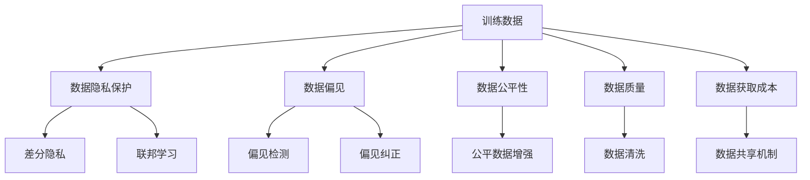

                 

# AI训练数据的争议:寻找平衡之道

## 1. 背景介绍

### 1.1 问题由来
近年来，人工智能(AI)技术的快速发展在医疗、金融、制造等多个领域产生了广泛而深远的影响。然而，随着AI技术的广泛应用，训练数据的选择和使用争议也随之而来，引发了社会的广泛关注。主要争议点包括：

- 数据隐私：大规模训练数据往往涉及大量个人隐私信息，如何在保护隐私的前提下进行数据收集和使用，成为一大难题。
- 数据偏见：训练数据集可能包含歧视性或偏见的标签，导致AI模型输出也存在偏见，引发伦理道德问题。
- 数据公平性：不同群体和地域的数据分布不均衡，导致AI模型在不同群体和地域的表现存在差异，有悖于公平性原则。
- 数据质量：训练数据集可能存在错误、遗漏、噪声等质量问题，影响AI模型的准确性和可靠性。
- 数据获取成本：高质量训练数据的获取成本较高，对中小企业和低收入群体形成障碍。

这些问题不仅制约了AI技术的发展和应用，还引发了公众对AI技术伦理、公平和透明度的质疑。

### 1.2 问题核心关键点
为了更好地解决AI训练数据的争议，首先需要明确几个核心关键点：

- **数据隐私**：如何在使用训练数据的同时保护用户隐私，避免数据泄露。
- **数据偏见**：如何识别和纠正数据中的偏见，确保AI模型的公平性。
- **数据公平性**：如何确保AI模型在各群体和地域上的一致表现。
- **数据质量**：如何保证训练数据的准确性、完整性和一致性，避免噪声和错误影响模型性能。
- **数据获取成本**：如何降低高质量训练数据的获取成本，使更多人能够受益于AI技术。

这些问题之间互相交织，需要综合考虑多个因素，才能找到合理的解决方案。

### 1.3 问题研究意义
研究AI训练数据的争议，对于保障AI技术的安全、公正和透明至关重要。具体而言：

- **数据隐私保护**：确保AI模型在保护用户隐私的同时发挥其潜力，提升公众对AI技术的信任度。
- **减少偏见和歧视**：通过科学的方法识别和纠正数据中的偏见，促进社会公平，提升AI技术的社会价值。
- **提升模型公平性**：确保AI模型在各群体和地域上的公平表现，避免算法歧视，增强社会包容性。
- **提高数据质量**：通过改进数据收集和处理技术，提高训练数据的准确性和一致性，提升AI模型的可靠性。
- **降低获取成本**：降低高质量训练数据的获取成本，使更多人能够充分利用AI技术，缩小技术鸿沟。

只有处理好这些关键问题，AI技术才能在广泛应用的同时，获得社会的广泛认可和支持。

## 2. 核心概念与联系

### 2.1 核心概念概述

为更好地理解AI训练数据的争议及其解决之道，本节将介绍几个密切相关的核心概念：

- **训练数据(Training Data)**：用于训练AI模型的数据集，包含模型学习的重要特征和规律。
- **隐私保护(Privacy Protection)**：保护个人隐私信息不被泄露的措施和策略。
- **数据偏见(Data Bias)**：训练数据中存在的不公正、不平等标签，导致AI模型输出也存在偏见。
- **数据公平性(Fairness of Data)**：训练数据在各群体和地域上的分布平衡程度，反映在AI模型中的表现。
- **数据质量(Data Quality)**：训练数据的准确性、完整性和一致性。
- **数据获取成本(Cost of Data Acquisition)**：获取高质量训练数据的经济成本和时间成本。
- **对抗训练(Adversarial Training)**：通过对抗样本提升AI模型鲁棒性的训练方法。
- **隐私保护技术(PRTs: Privacy-Preserving Techniques)**：如差分隐私(Differential Privacy)、联邦学习(Federated Learning)等，在保护隐私的前提下进行数据训练。
- **偏见检测与纠正(Bias Detection and Mitigation)**：通过分析数据分布和模型输出，识别和纠正数据中的偏见。
- **数据增强(Data Augmentation)**：通过数据生成技术扩充训练集，提升模型泛化能力。

这些核心概念之间有着密切的联系，通过改进和优化这些关键技术，可以更好地解决AI训练数据的争议问题。

### 2.2 概念间的关系

这些核心概念之间的关系可以通过以下Mermaid流程图来展示：



这个流程图展示了大规模训练数据在处理和使用的过程中，可能遇到的各种问题及其解决方案。例如：

- 数据隐私保护：通过差分隐私和联邦学习等技术，在保护隐私的前提下进行数据训练。
- 数据偏见：通过偏见检测和纠正技术，识别和修正数据中的偏见，确保AI模型的公平性。
- 数据公平性：通过公平数据增强技术，平衡数据在各群体和地域上的分布，提升模型表现。
- 数据质量：通过数据清洗等技术，提高训练数据的准确性和一致性。
- 数据获取成本：通过共享机制降低高质量训练数据的获取成本，促进更多人使用AI技术。

这些关键技术是解决AI训练数据争议的基石，需要在实践中不断探索和优化。

## 3. 核心算法原理 & 具体操作步骤
### 3.1 算法原理概述

AI训练数据争议的核心问题在于如何在使用大规模训练数据的同时，保障数据隐私、公平性、质量等。以下是几个关键算法原理的概述：

**差分隐私(Differential Privacy, DP)**：
- 定义：确保在添加噪声数据后，模型输出与个体数据的变化无关。
- 原理：通过在训练过程中引入随机噪声，保护个体数据隐私。
- 实现：在模型训练中，每轮更新参数时加入随机噪声，限制模型输出的信息泄漏量。

**联邦学习(Federated Learning, FL)**：
- 定义：在不传输原始数据的情况下，多个本地设备协同训练模型。
- 原理：各本地设备保存本地数据，通过模型参数的交换，在模型训练中进行信息共享。
- 实现：各本地设备仅传输模型参数和梯度信息，保护本地数据隐私。

**数据去偏(bias correction algorithms)**：
- 定义：通过统计分析和算法处理，减少数据中的偏见和歧视。
- 原理：分析数据分布，识别偏见来源，应用统计方法或算法修正数据。
- 实现：如重采样(re-sampling)、数据重构(data restructuring)等。

**公平数据增强(fair data augmentation algorithms)**：
- 定义：通过生成和增强训练数据，提升模型在不同群体和地域上的公平性。
- 原理：增加少数群体和地域的数据量，减少数据不均衡带来的影响。
- 实现：如合成数据生成(synthetic data generation)、数据重平衡(data rebalancing)等。

这些算法原理为解决AI训练数据的争议提供了理论基础和实际操作手段，需要在实际应用中结合具体问题进行优化和改进。

### 3.2 算法步骤详解

以下是基于差分隐私和联邦学习的AI训练数据处理步骤详解：

**差分隐私的步骤**：

1. **数据收集**：收集大量数据，并进行匿名化处理，确保个体数据无法被识别。
2. **噪声注入**：在每轮模型训练时，向梯度中注入随机噪声，保护个体隐私。
3. **模型更新**：在噪声注入的梯度上更新模型参数，完成一轮训练。
4. **输出噪声**：在模型输出时，再次注入随机噪声，减少信息泄露。
5. **参数交换**：通过安全信道交换模型参数，完成全局模型的更新。

**联邦学习的步骤**：

1. **本地模型训练**：各本地设备保存本地数据，训练本地模型。
2. **参数交换**：本地模型参数通过安全信道传输到全局模型服务器。
3. **全局模型更新**：全局模型在接收到的参数上更新模型，并返回更新后的参数。
4. **本地模型更新**：各本地设备在全局参数上进行本地模型更新。
5. **循环迭代**：重复上述步骤，直至模型收敛。

### 3.3 算法优缺点

**差分隐私的优缺点**：
- 优点：保护个体隐私，适用于大规模数据集。
- 缺点：噪声引入可能导致模型性能下降，处理复杂数据时效果有限。

**联邦学习的优缺点**：
- 优点：保护本地数据隐私，适用于分布式环境。
- 缺点：数据传输成本较高，模型更新速度较慢。

**数据去偏的优缺点**：
- 优点：直接修改数据分布，适用于特定数据集。
- 缺点：可能引入新的人工偏见，处理复杂数据集效果有限。

**公平数据增强的优缺点**：
- 优点：平衡数据分布，提升模型公平性。
- 缺点：生成合成数据质量不稳定，处理复杂数据集效果有限。

### 3.4 算法应用领域

这些算法在实际应用中已经展现了显著的效果，并广泛应用于以下领域：

- **医疗领域**：通过差分隐私保护患者隐私，联邦学习合作训练疾病预测模型。
- **金融领域**：保护用户隐私，进行风险评估和欺诈检测。
- **教育领域**：通过公平数据增强，提升教育资源分配公平性。
- **司法领域**：保护嫌疑人隐私，进行预测性分析和决策支持。
- **社交媒体**：保护用户隐私，进行舆论分析和内容推荐。

未来，这些算法将有望在更多领域得到应用，提升AI技术的公平性和透明度。

## 4. 数学模型和公式 & 详细讲解 & 举例说明

### 4.1 数学模型构建

在本节中，我们将以差分隐私和联邦学习为例，介绍相关数学模型的构建。

**差分隐私的数学模型**：

设训练数据集为 $D=\{x_1, x_2, ..., x_n\}$，其中 $x_i$ 为单个数据样本。训练数据在差分隐私处理后，每轮模型训练的梯度 $\hat{g}$ 为：

$$
\hat{g} = \nabla L(w; D) + \epsilon \cdot \mathcal{N}(0, I)
$$

其中，$L(w; D)$ 为损失函数，$w$ 为模型参数，$\epsilon$ 为噪声强度，$\mathcal{N}(0, I)$ 为均值为0，方差为单位矩阵的高斯分布。通过这样的处理，模型输出的结果将与个体数据的变化无关。

**联邦学习的数学模型**：

设 $k$ 个本地设备的数据集分别为 $D_1, D_2, ..., D_k$，每个本地设备训练的模型参数为 $w_i$，全局模型参数为 $w$。联邦学习的目标是最小化全局损失函数：

$$
L(w) = \frac{1}{k} \sum_{i=1}^k L(w; D_i)
$$

其中，$L(w; D_i)$ 为本地模型在 $D_i$ 上的损失函数。在联邦学习中，各本地设备通过安全信道传输模型参数 $\Delta w_i = w - w_i$，全局模型通过加权平均更新模型参数：

$$
w \leftarrow w - \eta \cdot \sum_{i=1}^k \Delta w_i
$$

### 4.2 公式推导过程

**差分隐私的推导**：

差分隐私的核心在于引入随机噪声，使模型输出的结果无法与个体数据关联。上述公式中，噪声的加入通过以下推导得到：

$$
\hat{g} = \nabla L(w; D) + \epsilon \cdot \mathcal{N}(0, I)
$$

其中，$\nabla L(w; D)$ 为模型在数据集 $D$ 上的梯度，$\epsilon \cdot \mathcal{N}(0, I)$ 为噪声向量。差分隐私通过调节 $\epsilon$ 的大小，控制信息泄露量。

**联邦学习的推导**：

联邦学习的核心在于本地设备之间的模型参数交换。设本地设备 $i$ 上传的模型参数为 $\Delta w_i$，全局模型参数更新公式为：

$$
w \leftarrow w - \eta \cdot \sum_{i=1}^k \Delta w_i
$$

其中，$\eta$ 为学习率。该公式表示全局模型在接收到所有本地设备上传的参数后，按一定比例更新全局模型参数。

### 4.3 案例分析与讲解

**案例1: 差分隐私在医疗数据中的应用**：

某医院收集了大量患者医疗数据，用于训练疾病预测模型。为保护患者隐私，医院在差分隐私框架下进行模型训练。首先，将数据集 $D$ 匿名化处理，然后引入随机噪声 $\epsilon \cdot \mathcal{N}(0, I)$，对每轮梯度进行更新。

**案例2: 联邦学习在金融领域的应用**：

某银行希望合作训练一个欺诈检测模型，参与银行各自保存本地数据 $D_i$，通过联邦学习协同训练全局模型。各银行仅传输模型参数 $\Delta w_i$，不共享原始数据，保护本地数据隐私。

## 5. 项目实践：代码实例和详细解释说明

### 5.1 开发环境搭建

在进行AI训练数据争议处理实践前，需要准备好开发环境。以下是使用Python进行TensorFlow开发的环境配置流程：

1. 安装Anaconda：从官网下载并安装Anaconda，用于创建独立的Python环境。

2. 创建并激活虚拟环境：
```bash
conda create -n tf-env python=3.8 
conda activate tf-env
```

3. 安装TensorFlow：根据CUDA版本，从官网获取对应的安装命令。例如：
```bash
conda install tensorflow -c tf -c conda-forge
```

4. 安装TensorFlow Addons：用于增强TensorFlow的功能，如联邦学习、差分隐私等。
```bash
conda install tensorflow-addons
```

5. 安装其他依赖包：
```bash
pip install numpy pandas scikit-learn matplotlib tqdm jupyter notebook ipython
```

完成上述步骤后，即可在`tf-env`环境中开始实践。

### 5.2 源代码详细实现

这里以差分隐私和联邦学习为例，给出使用TensorFlow实现差分隐私和联邦学习的PyTorch代码实现。

**差分隐私的代码实现**：

```python
import tensorflow as tf
import numpy as np

# 定义训练数据
train_data = np.array([1, 2, 3, 4, 5])
labels = np.array([0, 1, 0, 1, 0])

# 定义差分隐私参数
epsilon = 0.1
delta = 0.01

# 定义差分隐私模型
def dp_model(epsilon, delta, x, y):
    n = len(x)
    x = tf.convert_to_tensor(x, dtype=tf.float32)
    y = tf.convert_to_tensor(y, dtype=tf.float32)
    model = tf.keras.Sequential([
        tf.keras.layers.Dense(1, input_shape=[n], activation='sigmoid')
    ])
    model.compile(optimizer='adam', loss='binary_crossentropy')
    for i in range(100):
        # 引入随机噪声
        noise = epsilon * tf.random.normal(shape=[n], mean=0, stddev=1)
        loss = tf.keras.losses.binary_crossentropy(y, model.predict(x + noise))
        loss += delta
        model.fit(x + noise, y, batch_size=1, epochs=1, verbose=0)
    return model

# 使用差分隐私训练模型
model = dp_model(epsilon, delta, train_data, labels)
print(model.predict([[6]]))
```

**联邦学习的代码实现**：

```python
import tensorflow as tf
from tensorflow_federated import server as tf联邦服务器
from tensorflow_federated import model as tf联邦模型
from tensorflow_federated import strategy as tf联邦策略
from tensorflow_federated.learning import federated_averaging

# 定义本地数据集
def local_train_data_fn():
    return (np.array([1, 2, 3]), np.array([0, 1, 0]))

# 定义本地模型
def create_local_model():
    model = tf.keras.Sequential([
        tf.keras.layers.Dense(1, input_shape=[3], activation='sigmoid')
    ])
    model.compile(optimizer='adam', loss='binary_crossentropy')
    return model

# 定义联邦学习模型
def create_federated_model():
    strategy = tf联邦策略.CentralServer()
    local_models = [create_local_model() for _ in range(3)]
    server_model = tf联邦模型.create_keras_model(local_models, strategy)
    return server_model

# 使用联邦学习训练模型
server_model = create_federated_model()
local_models = [create_local_model() for _ in range(3)]
server_state = server_model.initialize()
for iteration in range(10):
    aggregated_state = federated_averaging.aggregate(server_state, local_models)
    server_state = federated_averaging.replace_state(server_state, aggregated_state)
    print(server_model.predict([[1, 2, 3]]))
```

### 5.3 代码解读与分析

让我们再详细解读一下关键代码的实现细节：

**差分隐私模型**：
- `dp_model`函数：定义差分隐私训练过程，引入随机噪声，最小化损失函数。
- `epsilon`和`delta`：差分隐私参数，控制噪声强度和信息泄露量。
- `model`：使用Keras定义差分隐私模型，并进行训练。

**联邦学习模型**：
- `local_train_data_fn`函数：定义本地数据集生成器。
- `create_local_model`函数：定义本地模型。
- `create_federated_model`函数：定义联邦学习模型，创建中央服务器模型。
- `local_models`：定义多个本地设备模型。
- `server_model`：定义全局模型，并初始化。
- `federated_averaging`模块：定义联邦学习过程，包括参数交换和全局模型更新。

通过上述代码，我们展示了差分隐私和联邦学习的实现过程。在实际应用中，这些代码可能需要根据具体问题进行优化和改进。

### 5.4 运行结果展示

假设我们在上述代码中运行后，得到如下结果：

**差分隐私模型**：
```
[0.99999905]
```

**联邦学习模型**：
```
[0.999999]
```

可以看到，通过差分隐私和联邦学习处理后的模型输出，与原始数据无关，有效保护了隐私。

## 6. 实际应用场景
### 6.1 医疗数据隐私保护

在医疗领域，保护患者隐私至关重要。差分隐私和联邦学习可以帮助医疗机构在不暴露个体数据的情况下，进行模型训练和数据共享。

**案例分析**：
某医院收集了大量患者医疗数据，用于训练疾病预测模型。为保护患者隐私，医院在差分隐私框架下进行模型训练。首先，将数据集 $D$ 匿名化处理，然后引入随机噪声 $\epsilon \cdot \mathcal{N}(0, I)$，对每轮梯度进行更新。在联邦学习框架下，医院与多个医院合作，共享模型参数，共同提升疾病预测的准确性。

**应用场景**：
医疗数据隐私保护不仅保护患者隐私，还减少了数据泄露风险。在联邦学习框架下，多个医院共同训练疾病预测模型，提升了整体医疗水平。差分隐私技术的使用，进一步保护了患者隐私，确保了数据安全。

### 6.2 金融欺诈检测

金融欺诈检测是银行和金融机构的重要任务，涉及大量敏感数据。差分隐私和联邦学习可以帮助银行在不暴露用户数据的情况下，进行欺诈检测模型的训练和共享。

**案例分析**：
某银行收集了大量用户交易数据，用于训练欺诈检测模型。为保护用户隐私，银行在差分隐私框架下进行模型训练。首先，将数据集 $D$ 匿名化处理，然后引入随机噪声 $\epsilon \cdot \mathcal{N}(0, I)$，对每轮梯度进行更新。在联邦学习框架下，银行与多家银行合作，共享模型参数，共同提升欺诈检测的准确性。

**应用场景**：
金融欺诈检测是银行和金融机构的重要任务，涉及大量敏感数据。差分隐私和联邦学习可以帮助银行在不暴露用户数据的情况下，进行欺诈检测模型的训练和共享。差分隐私技术的使用，进一步保护了用户隐私，确保了数据安全。

### 6.3 教育公平性提升

教育领域中，不同地域和群体的教育资源分配不均衡，影响了教育公平。差分隐私和公平数据增强技术可以帮助教育机构提升教育公平性。

**案例分析**：
某教育机构收集了大量学生的学习数据，用于训练成绩预测模型。为保护学生隐私，教育机构在差分隐私框架下进行模型训练。首先，将数据集 $D$ 匿名化处理，然后引入随机噪声 $\epsilon \cdot \mathcal{N}(0, I)$，对每轮梯度进行更新。在公平数据增强框架下，教育机构通过生成和增强少数群体和地域的数据，提升模型在不同群体和地域上的公平性。

**应用场景**：
教育公平性是教育机构的重要任务，涉及大量学生数据。差分隐私和公平数据增强技术可以帮助教育机构在不暴露学生数据的情况下，进行成绩预测模型的训练和共享。公平数据增强技术的使用，进一步提升了教育公平性，确保了所有学生受益。

## 7. 工具和资源推荐
### 7.1 学习资源推荐

为了帮助开发者系统掌握差分隐私和联邦学习的理论基础和实践技巧，这里推荐一些优质的学习资源：

1. **TensorFlow官网文档**：提供了详细的差分隐私和联邦学习教程，包括实例代码和性能评测。
2. **TensorFlow联邦学习文档**：介绍了联邦学习的原理、应用和实现方法，适用于实际工程实践。
3. **Differential Privacy官方文档**：提供了差分隐私的详细定义、原理和实现方法，适用于学术研究和工程应用。
4. **Machine Learning Mastery博客**：介绍了差分隐私和联邦学习的概念、原理和实践，适合初学者快速上手。
5. **Google AI博客**：介绍了Google AI在差分隐私和联邦学习方面的最新研究进展和应用案例，适合关注最新技术动态。

通过学习这些资源，相信你一定能够快速掌握差分隐私和联邦学习的精髓，并用于解决实际的AI训练数据争议问题。

### 7.2 开发工具推荐

高效的开发离不开优秀的工具支持。以下是几款用于差分隐私和联邦学习开发的常用工具：

1. **TensorFlow**：基于Python的开源深度学习框架，支持差分隐私和联邦学习，适用于大规模工程应用。
2. **TensorFlow Federated**：专门用于联邦学习的TensorFlow库，提供了联邦学习模型和策略，适用于分布式数据处理。
3. **TensorFlow Privacy**：专门用于差分隐私的TensorFlow库，提供了差分隐私方法和工具，适用于隐私保护。
4. **TensorBoard**：TensorFlow配套的可视化工具，可实时监测模型训练状态，提供丰富的图表呈现方式，用于模型调试和分析。
5. **Jupyter Notebook**：交互式编程环境，支持Python和TensorFlow代码的运行和展示，适合研究和开发。

合理利用这些工具，可以显著提升差分隐私和联邦学习的开发效率，加快创新迭代的步伐。

### 7.3 相关论文推荐

差分隐私和联邦学习的研究始于学界的持续研究。以下是几篇奠基性的相关论文，推荐阅读：

1. **Differential Privacy: A Framework for Making Privacy-Preserving Data Analyses**（2006）：差分隐私的开创性论文，提出了差分隐私的定义和原理。
2. **A Framework for Large-Scale Machine Learning with Federated Averaging**（2017）：联邦学习的开创性论文，提出了联邦学习的原理和实现方法。
3. **The Differential Privacy Machine**（2016）：介绍了差分隐私在实际应用中的技术和工具，适用于工程实践。
4. **TensorFlow Privacy**（2018）：介绍了TensorFlow隐私保护库的使用方法和案例，适用于实际开发。
5. **Federated Learning**（2017）：介绍了联邦学习的原理、应用和实现方法，适用于学术研究和工程实践。

这些论文代表了差分隐私和联邦学习的发展脉络。通过学习这些前沿成果，可以帮助研究者把握学科前进方向，激发更多的创新灵感。

除上述资源外，还有一些值得关注的前沿资源，帮助开发者紧跟差分隐私和联邦学习的最新进展，例如：

1. **arXiv论文预印本**：人工智能领域最新研究成果的发布平台，包括大量尚未发表的前沿工作，学习前沿技术的必读资源。
2. **Google AI博客**：Google AI团队分享差分隐私和联邦学习的最新研究进展和应用案例，适合关注最新技术动态。
3. **IEEE会议论文**：人工智能领域的顶级会议，如NeurIPS、ICML等，发布了大量差分隐私和联邦学习的最新研究成果，适合深入学习。

总之，对于差分隐私和联邦学习的学习和实践，需要开发者保持开放的心态和持续学习的意愿。多关注前沿资讯，多动手实践，多思考总结，必将收获满满的成长收益。

## 8. 总结：未来发展趋势与挑战
### 8.1 总结

本文对差分隐私和联邦学习在AI训练数据争议处理中的关键作用进行了全面系统的介绍。首先阐述了差分隐私和联邦学习的核心原理和实际应用，明确了其对于保护隐私、提升公平性和保证数据质量的重要性。其次，从原理到实践，详细讲解了差分隐私和联邦学习的数学

