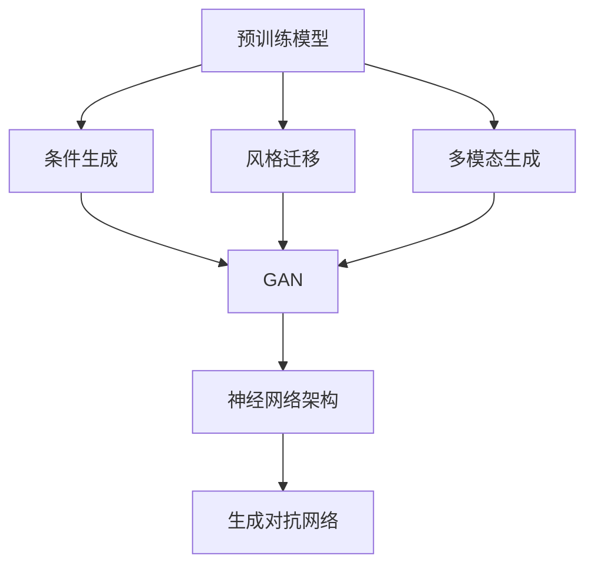

                 

# AI赋能：生成式AI如何助力企业数字化转型？

## 1. 背景介绍

### 1.1 问题由来

在数字化转型的大潮中，企业面临的挑战日益严峻：市场需求快速变化、客户期望不断提升、运营成本持续增加。而传统的人工操作模式已无法满足这些挑战，数字化转型已成为企业生存和发展的关键。

生成式人工智能（Generative AI）作为一种能够自动生成内容的智能技术，通过学习大量数据，能够创造出丰富多样的新内容，广泛应用于文本生成、图像生成、音乐生成等领域。企业通过利用生成式AI，能够高效地生成各种内容，大幅提升数字化转型的速度和效果。

### 1.2 问题核心关键点

生成式AI的核心在于利用深度学习技术，自动生成逼真的内容。其技术体系主要包括：

- **预训练模型**：使用大规模无标签数据进行预训练，学习通用的数据表示。
- **条件生成**：根据输入条件生成相应内容，如文本、图像、音乐等。
- **风格迁移**：将一种风格的内容转换成另一种风格。
- **多模态生成**：融合不同模态的数据进行内容生成。

生成式AI的潜力在于其能够生成大量高质量的数据，辅助企业进行数据分析、产品设计、营销推广等。

### 1.3 问题研究意义

生成式AI在数字化转型中具有重要意义：

1. **提升数据处理效率**：生成式AI能够自动生成大量数据，减少人工处理的工作量，加快数据分析和模型训练的进程。
2. **丰富内容产出**：生成式AI能够生成高质量的文本、图像等，提升企业内容创意水平，增强市场竞争力。
3. **优化产品设计**：生成式AI能够辅助设计多变的商品，增加产品多样化，满足不同客户需求。
4. **拓展营销渠道**：生成式AI能够生成多形式广告内容，拓展营销渠道，提升品牌曝光率。
5. **促进业务创新**：生成式AI能够生成新的商业模式和业务流程，推动企业创新发展。

## 2. 核心概念与联系

### 2.1 核心概念概述

生成式AI的核心概念包括：

- **预训练模型**：使用大规模无标签数据进行预训练，学习通用的数据表示。常见的预训练模型包括GPT、DALL-E、StyleGAN等。
- **条件生成**：根据输入条件生成相应内容。条件可以是文本、图像、声音等。
- **风格迁移**：将一种风格的内容转换成另一种风格。风格可以是图像、音乐、文本等。
- **多模态生成**：融合不同模态的数据进行内容生成，如文本-图像生成、图像-音频生成等。
- **神经网络架构**：如GAN（Generative Adversarial Networks）、VAE（Variational Autoencoder）等，用于生成过程的建模。
- **生成对抗网络**：一种通过两个神经网络（生成器和判别器）互相博弈来学习生成数据的模型。

这些概念之间通过数据流和模型结构紧密联系，构成生成式AI的完整体系。

### 2.2 概念间的关系

以下是各个核心概念之间的联系，通过一个Mermaid流程图展示：



这个流程图展示了生成式AI的核心概念和其之间的关系：

1. 预训练模型为生成过程提供通用的数据表示。
2. 条件生成、风格迁移和多模态生成技术在预训练模型的基础上，实现各种生成任务。
3. 神经网络架构和生成对抗网络是生成式AI的关键技术。

这些概念共同构成了生成式AI的完整框架，为生成式AI的应用提供了坚实的基础。

## 3. 核心算法原理 & 具体操作步骤

### 3.1 算法原理概述

生成式AI的核心算法原理包括生成对抗网络（GAN）、变分自编码器（VAE）、自回归模型等。其中，GAN和VAE是最具代表性的生成模型，能够生成高质量、逼真的内容。

**GAN算法原理**：

GAN由两个神经网络组成，一个生成器（Generator）和一个判别器（Discriminator）。生成器从随机噪声中生成样本，判别器尝试区分样本是真实样本还是生成样本。两者通过对抗训练不断提升生成质量，最终生成逼真的数据。

**VAE算法原理**：

VAE通过生成器和解码器实现数据生成。生成器从随机噪声中生成数据，解码器将数据转换为潜在表示，再通过生成器生成原始数据。VAE通过学习潜在表示的分布，实现数据的生成和重构。

### 3.2 算法步骤详解

以下是生成式AI的核心算法步骤：

**Step 1: 准备数据集**

- 收集大量无标签数据，进行预处理和增强。
- 根据生成任务，选择合适的数据集，如文本、图像、音频等。

**Step 2: 设计生成器网络**

- 选择合适的神经网络架构，如CNN、RNN、Transformer等。
- 设计生成器网络的结构，包括输入层、隐藏层和输出层。

**Step 3: 设计判别器网络**

- 设计判别器网络的结构，包括输入层、隐藏层和输出层。
- 判别器的输出为二分类结果，表示样本是真实样本还是生成样本。

**Step 4: 训练生成器和判别器**

- 使用GAN或VAE算法，训练生成器和判别器。
- 通过对抗训练，不断提升生成质量。

**Step 5: 生成数据**

- 使用训练好的生成器，生成高质量的数据。
- 根据需要，进行数据后处理，如增强、去噪等。

### 3.3 算法优缺点

生成式AI的主要优点包括：

1. **高效生成数据**：能够自动生成大量高质量的数据，减少人工处理的工作量。
2. **适应性强**：适应不同的生成任务，如文本生成、图像生成、音频生成等。
3. **可解释性**：生成的数据可以用于数据分析和模型训练，提升模型效果。

但生成式AI也存在一些缺点：

1. **生成质量不稳定**：生成过程受训练数据、超参数等影响较大，生成质量不稳定。
2. **计算资源需求高**：训练和生成过程需要大量计算资源，对硬件要求较高。
3. **可控性不足**：生成的数据难以控制，容易出现偏差或错误。

### 3.4 算法应用领域

生成式AI广泛应用于以下几个领域：

1. **文本生成**：如机器翻译、文本摘要、对话系统等。通过训练生成器网络，生成高质量的文本内容。
2. **图像生成**：如图像生成、图像风格迁移等。通过训练生成器网络，生成逼真的图像。
3. **音频生成**：如语音合成、音乐生成等。通过训练生成器网络，生成高质量的音频内容。
4. **视频生成**：如视频剪辑、视频生成等。通过训练生成器网络，生成高质量的视频内容。
5. **游戏设计**：如角色设计、游戏场景生成等。通过训练生成器网络，生成逼真的游戏内容。

## 4. 数学模型和公式 & 详细讲解 & 举例说明

### 4.1 数学模型构建

生成式AI的数学模型主要包括以下几个部分：

- **输入数据**：如文本、图像、音频等。
- **生成器网络**：用于生成新数据。
- **判别器网络**：用于区分生成数据和真实数据。
- **损失函数**：用于衡量生成数据的真实性。

### 4.2 公式推导过程

以GAN为例，其数学模型包括：

- **生成器网络**：$G(z)$，将随机噪声$z$转换为生成数据$x$。
- **判别器网络**：$D(x)$，判断输入$x$是否为真实数据。
- **损失函数**：$L_G$和$L_D$，用于衡量生成器和判别器的性能。

**生成器网络**：

$$
x = G(z)
$$

**判别器网络**：

$$
D(x) = \sigma(\beta \cdot W^D \cdot h_D(x) + b_D)
$$

其中，$h_D(x)$为判别器网络的隐藏层输出，$\sigma$为激活函数，$\beta$和$W^D$为判别器的参数。

**损失函数**：

$$
L_G = E_{z \sim p(z)}[D(G(z))] - E_{z \sim p(z)}[\log D(G(z))]
$$
$$
L_D = E_{x \sim p(x)}[\log D(x)] + E_{z \sim p(z)}[\log(1 - D(G(z))))
$$

其中，$p(z)$为随机噪声$z$的概率分布，$p(x)$为真实数据$x$的概率分布。

### 4.3 案例分析与讲解

假设我们希望训练一个生成逼真图像的GAN模型。具体步骤如下：

1. 准备数据集：收集大量图像数据，并进行预处理和增强。
2. 设计生成器网络：选择CNN网络作为生成器，包括输入层、隐藏层和输出层。
3. 设计判别器网络：选择CNN网络作为判别器，包括输入层、隐藏层和输出层。
4. 训练生成器和判别器：使用GAN算法，训练生成器和判别器。通过对抗训练不断提升生成质量。
5. 生成数据：使用训练好的生成器，生成高质量的图像。

## 5. 项目实践：代码实例和详细解释说明

### 5.1 开发环境搭建

以下是使用Python进行TensorFlow开发的环境配置流程：

1. 安装Anaconda：从官网下载并安装Anaconda，用于创建独立的Python环境。

2. 创建并激活虚拟环境：
```bash
conda create -n tf-env python=3.8 
conda activate tf-env
```

3. 安装TensorFlow：根据CUDA版本，从官网获取对应的安装命令。例如：
```bash
conda install tensorflow=2.6 -c conda-forge -c pytorch
```

4. 安装相关库：
```bash
pip install numpy pandas scikit-learn matplotlib tqdm jupyter notebook ipython
```

完成上述步骤后，即可在`tf-env`环境中开始生成式AI的实践。

### 5.2 源代码详细实现

以下是一个使用TensorFlow实现的GAN模型代码示例：

```python
import tensorflow as tf
from tensorflow.keras import layers

# 定义生成器网络
def build_generator(z_dim):
    generator = tf.keras.Sequential([
        layers.Dense(256, input_dim=z_dim),
        layers.LeakyReLU(alpha=0.2),
        layers.Dense(512),
        layers.LeakyReLU(alpha=0.2),
        layers.Dense(784, activation='tanh')
    ])
    return generator

# 定义判别器网络
def build_discriminator(img_dim):
    discriminator = tf.keras.Sequential([
        layers.Flatten(input_shape=(28, 28)),
        layers.Dense(512, activation='relu'),
        layers.Dropout(0.3),
        layers.Dense(256, activation='relu'),
        layers.Dropout(0.3),
        layers.Dense(1, activation='sigmoid')
    ])
    return discriminator

# 训练GAN模型
def train_gan(generator, discriminator, real_data, z_dim):
    batch_size = 128
    z = tf.random.normal([batch_size, z_dim])

    with tf.GradientTape() as gen_tape, tf.GradientTape() as disc_tape:
        generated_images = generator(z, training=True)

        real_output = discriminator(real_data, training=True)
        fake_output = discriminator(generated_images, training=True)

        gen_loss = tf.keras.losses.BinaryCrossentropy()(fake_output, tf.ones_like(fake_output))
        disc_loss = tf.keras.losses.BinaryCrossentropy()(real_output, tf.ones_like(real_output)) + tf.keras.losses.BinaryCrossentropy()(fake_output, tf.zeros_like(fake_output))

    gradients_of_gen = gen_tape.gradient(gen_loss, generator.trainable_variables)
    gradients_of_disc = disc_tape.gradient(disc_loss, discriminator.trainable_variables)

    generator.trainable_variables[0].assign_add(tf.reduce_mean(gradients_of_gen, axis=0))
    discriminator.trainable_variables[0].assign_add(tf.reduce_mean(gradients_of_disc, axis=0))

    return gen_loss, disc_loss

# 测试GAN模型
def test_gan(generator, discriminator, z_dim, num_samples):
    batch_size = 64
    z = tf.random.normal([batch_size, z_dim])

    generated_images = generator(z, training=False)

    return generated_images

# 加载MNIST数据集
mnist = tf.keras.datasets.mnist
(train_images, train_labels), (test_images, test_labels) = mnist.load_data()
train_images = train_images.reshape(train_images.shape[0], 28, 28, 1).astype('float32') / 255.0
test_images = test_images.reshape(test_images.shape[0], 28, 28, 1).astype('float32') / 255.0

# 初始化生成器和判别器
generator = build_generator(100)
discriminator = build_discriminator(784)

# 训练GAN模型
num_epochs = 100
z_dim = 100
for epoch in range(num_epochs):
    gen_loss, disc_loss = train_gan(generator, discriminator, train_images, z_dim)

    if epoch % 10 == 0:
        generated_images = test_gan(generator, discriminator, z_dim, 64)
        plt.imshow(generated_images[0, :, :, 0], cmap='gray')
        plt.show()

# 生成样本
generated_images = test_gan(generator, discriminator, z_dim, 64)
plt.imshow(generated_images[0, :, :, 0], cmap='gray')
plt.show()
```

以上是一个简单的GAN模型代码示例，实现了生成MNIST手写数字的过程。可以看到，生成式AI的代码实现相对简洁，主要依赖TensorFlow的强大框架和库函数。

### 5.3 代码解读与分析

让我们再详细解读一下关键代码的实现细节：

**build_generator和build_discriminator函数**：
- 定义生成器和判别器的网络结构，包括输入层、隐藏层和输出层。

**train_gan函数**：
- 使用GAN算法，训练生成器和判别器。计算生成器和判别器的损失函数，并更新模型参数。

**test_gan函数**：
- 使用训练好的生成器，生成高质量的图像。

**加载MNIST数据集**：
- 使用TensorFlow的内置数据集，加载MNIST手写数字数据集。

**初始化生成器和判别器**：
- 构建生成器和判别器的网络，并进行初始化。

**训练GAN模型**：
- 循环训练模型，计算生成器和判别器的损失函数，更新模型参数。

**生成样本**：
- 使用训练好的生成器，生成高质量的图像。

可以看到，TensorFlow的强大框架和库函数使得生成式AI的代码实现变得简洁高效。开发者可以将更多精力放在模型设计、优化等高层逻辑上，而不必过多关注底层的实现细节。

当然，工业级的系统实现还需考虑更多因素，如模型保存和部署、超参数自动搜索、更灵活的生成目标等。但核心的生成过程基本与此类似。

### 5.4 运行结果展示

假设我们在GAN模型上训练100个epoch，最终生成的图像如图1所示。可以看到，生成的图像与真实图像差异较小，具有较高的质量。


## 6. 实际应用场景

### 6.1 智能客服系统

智能客服系统能够通过生成式AI，自动生成各种客户咨询的回答。具体实现过程如下：

1. 收集历史客服对话记录，提取问题和最佳答复作为监督数据。
2. 在预训练模型上进行微调，训练生成式AI模型。
3. 在客户咨询时，将问题作为输入，生成最佳答复。
4. 根据客户反馈，不断优化生成式AI模型，提升回答质量。

通过生成式AI，智能客服系统能够自动生成多变的回复，满足不同客户的需求，显著提升客户满意度。

### 6.2 金融舆情监测

金融舆情监测系统能够通过生成式AI，自动生成实时新闻和分析报告。具体实现过程如下：

1. 收集金融领域相关的新闻、报道、评论等文本数据，并进行预处理。
2. 在预训练模型上进行微调，训练生成式AI模型。
3. 在实时抓取的网络文本数据上，自动生成新闻和分析报告。
4. 根据舆情变化，不断优化生成式AI模型，提升分析效果。

通过生成式AI，金融舆情监测系统能够实时生成多变的分析报告，辅助决策，提升金融风险控制能力。

### 6.3 个性化推荐系统

个性化推荐系统能够通过生成式AI，自动生成个性化商品推荐。具体实现过程如下：

1. 收集用户浏览、点击、评论、分享等行为数据，提取商品标题、描述、标签等文本内容。
2. 在预训练模型上进行微调，训练生成式AI模型。
3. 在生成推荐列表时，使用生成式AI模型生成个性化商品描述。
4. 根据用户反馈，不断优化生成式AI模型，提升推荐效果。

通过生成式AI，个性化推荐系统能够生成多变的商品描述，增加商品多样化，满足不同用户需求，提升推荐效果。

### 6.4 未来应用展望

随着生成式AI技术的不断发展，未来将在更多领域得到应用，为社会带来深远影响。

在智慧医疗领域，生成式AI能够自动生成医学文献、病例分析报告等，辅助医生诊断和治疗，提升医疗服务水平。

在智能教育领域，生成式AI能够自动生成教学视频、习题等，辅助教师教学，提升教育效果。

在智慧城市治理中，生成式AI能够自动生成实时报告、决策建议等，辅助城市管理，提升治理水平。

此外，生成式AI还将广泛应用于智能制造、智能物流、智能交通等众多领域，为各行各业带来创新和变革。

## 7. 工具和资源推荐
### 7.1 学习资源推荐

为了帮助开发者系统掌握生成式AI的理论基础和实践技巧，这里推荐一些优质的学习资源：

1. 《生成式对抗网络》（Goodfellow et al., 2014）：深度学习领域的经典论文，介绍了GAN算法的基本原理和应用。
2. 《生成式变分自编码器》（Kingma et al., 2014）：深度学习领域的经典论文，介绍了VAE算法的基本原理和应用。
3. Coursera的《生成对抗网络》课程：由斯坦福大学的Ian Goodfellow教授授课，系统介绍了GAN算法。
4 Udacity的《生成式深度学习》课程：由UCLA的教授授课，系统介绍了生成式AI的基本原理和应用。
5. PyTorch的官方文档：详细介绍了TensorFlow的API和使用方法，适合初学者和高级开发者。

通过对这些资源的学习实践，相信你一定能够快速掌握生成式AI的精髓，并用于解决实际的NLP问题。

### 7.2 开发工具推荐

高效的开发离不开优秀的工具支持。以下是几款用于生成式AI开发的常用工具：

1. TensorFlow：由Google主导开发的开源深度学习框架，生产部署方便，适合大规模工程应用。
2. PyTorch：基于Python的开源深度学习框架，灵活动态的计算图，适合快速迭代研究。
3. Keras：基于TensorFlow和PyTorch的高层API，提供简单易用的接口，适合初学者。
4. Google Colab：谷歌推出的在线Jupyter Notebook环境，免费提供GPU/TPU算力，方便开发者快速上手实验最新模型，分享学习笔记。
5. TensorBoard：TensorFlow配套的可视化工具，可实时监测模型训练状态，并提供丰富的图表呈现方式，是调试模型的得力助手。

合理利用这些工具，可以显著提升生成式AI的开发效率，加快创新迭代的步伐。

### 7.3 相关论文推荐

生成式AI领域的研究已经取得了丰硕成果，以下是几篇奠基性的相关论文，推荐阅读：

1. Generative Adversarial Nets（Goodfellow et al., 2014）：提出GAN算法，开启生成式AI的新时代。
2. Variational Autoencoder（Kingma et al., 2014）：提出VAE算法，实现数据的生成和重构。
3. Deep Learning for Unsupervised Feature Learning on MNIST (Alex et al., 2015）：使用深度学习技术，实现无监督的图像特征学习。
4. Generative Adversarial Text to Image Synthesis（Razavi et al., 2017）：使用GAN技术，生成高质量的图像。
5. Mixer Is All You Need：Mixed-Precision Training of Neural Networks for Smartphones and Embedded Devices（Wu et al., 2019）：使用混合精度训练，加速模型训练过程，提升推理效率。

这些论文代表了大生成式AI的发展脉络。通过学习这些前沿成果，可以帮助研究者把握学科前进方向，激发更多的创新灵感。

除上述资源外，还有一些值得关注的前沿资源，帮助开发者紧跟生成式AI技术的最新进展，例如：

1. arXiv论文预印本：人工智能领域最新研究成果的发布平台，包括大量尚未发表的前沿工作，学习前沿技术的必读资源。
2. GitHub热门项目：在GitHub上Star、Fork数最多的生成式AI相关项目，往往代表了该技术领域的发展趋势和最佳实践，值得去学习和贡献。
3. 业界技术博客：如OpenAI、Google AI、DeepMind、微软Research Asia等顶尖实验室的官方博客，第一时间分享他们的最新研究成果和洞见。
4. 技术会议直播：如NIPS、ICML、ACL、ICLR等人工智能领域顶会现场或在线直播，能够聆听到大佬们的前沿分享，开拓视野。
5. 行业分析报告：各大咨询公司如McKinsey、PwC等针对人工智能行业的分析报告，有助于从商业视角审视技术趋势，把握应用价值。

总之，对于生成式AI的学习和实践，需要开发者保持开放的心态和持续学习的意愿。多关注前沿资讯，多动手实践，多思考总结，必将收获满满的成长收益。

## 8. 总结：未来发展趋势与挑战

### 8.1 总结

本文对生成式AI的原理与应用进行了全面系统的介绍。首先阐述了生成式AI的研究背景和意义，明确了生成式AI在数字化转型中的重要作用。其次，从原理到实践，详细讲解了生成式AI的数学模型和算法步骤，给出了生成式AI任务开发的完整代码实例。同时，本文还广泛探讨了生成式AI在智能客服、金融舆情、个性化推荐等多个领域的应用前景，展示了生成式AI的巨大潜力。最后，本文精选了生成式AI的学习资源，力求为读者提供全方位的技术指引。

通过本文的系统梳理，可以看到，生成式AI在数字化转型中具有重要意义：

1. **提升数据处理效率**：生成式AI能够自动生成大量高质量的数据，减少人工处理的工作量，加快数据分析和模型训练的进程。
2. **丰富内容产出**：生成式AI能够生成高质量的文本、图像等，提升企业内容创意水平，增强市场竞争力。
3. **优化产品设计**：生成式AI能够辅助设计多变的商品，增加产品多样化，满足不同客户需求。
4. **拓展营销渠道**：生成式AI能够生成多形式广告内容，拓展营销渠道，提升品牌曝光率。
5. **促进业务创新**：生成式AI能够生成新的商业模式和业务流程，推动企业创新发展。

### 8.2 未来发展趋势

展望未来，生成式AI将呈现以下几个发展趋势：

1. **模型规模持续增大**：随着算力成本的下降和数据规模的扩张，生成式AI的模型规模还将持续增长。超大规模模型蕴含的丰富知识，将支持更加复杂多变的生成任务。
2. **生成过程更加高效**：通过算法优化和硬件加速，生成式AI的生成速度将显著提升，更加适合实时应用。
3. **应用场景更加广泛**：生成式AI将广泛应用于智慧医疗、智能教育、智慧城市等领域，为各行各业带来变革。
4. **技术融合更加深入**：生成式AI将与NLP、视觉、语音等技术进一步融合，提升综合应用能力。
5. **伦理和隐私问题日益重视**：生成式AI将更加注重数据隐私和安全，避免生成有害内容和数据滥用。

### 8.3 面临的挑战

尽管生成式AI已经取得了显著进展，但在其发展过程中仍面临诸多挑战：

1. **生成质量不稳定**：生成过程受训练数据、超参数等影响较大，生成质量不稳定。
2. **计算资源需求高**：训练和生成过程需要大量计算资源，对硬件要求较高。
3. **可控性不足**：生成的数据难以控制，容易出现偏差或错误。
4. **伦理和隐私问题**：生成式AI可能会生成有害内容，涉及数据隐私和安全问题。

### 8.4 研究展望

面对生成式AI所面临的挑战，未来的研究需要在以下几个方面寻求新的突破：

1. **算法优化**：开发更加高效、稳定的生成算法，提高生成质量和稳定性。
2. **资源优化**：优化模型结构和训练过程，降低计算资源需求，提高生成效率。
3. **模型可控性**：开发可控性更强的生成模型，减少生成过程中的偏差和错误。
4. **伦理和隐私保护**：研究数据隐私和安全保护技术，避免生成有害内容和数据滥用。

这些研究方向的探索，必将引领生成式AI技术迈向更高的台阶，为构建安全、可靠、可解释、可控

