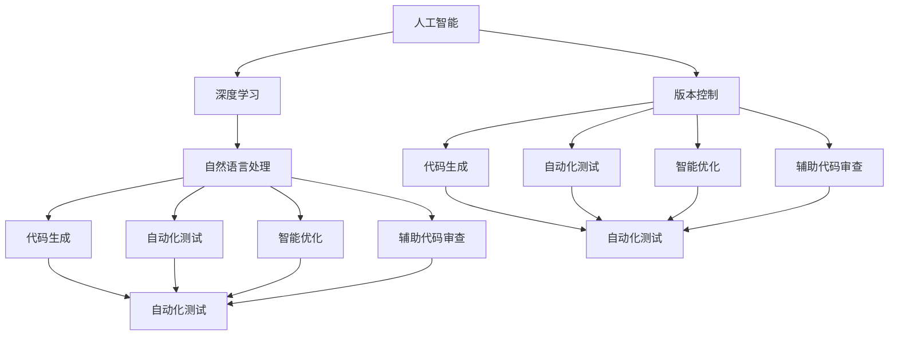
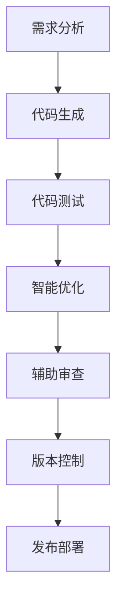
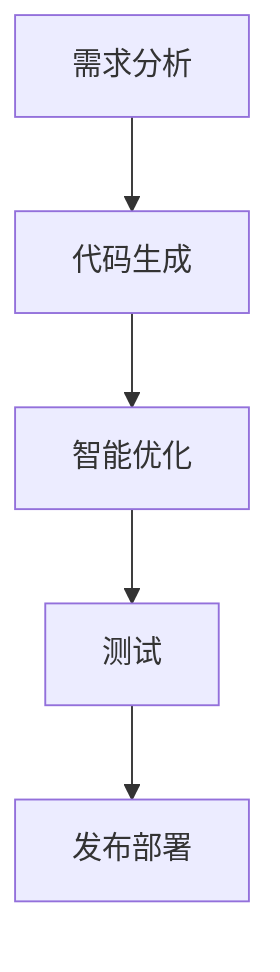
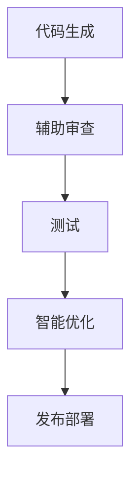
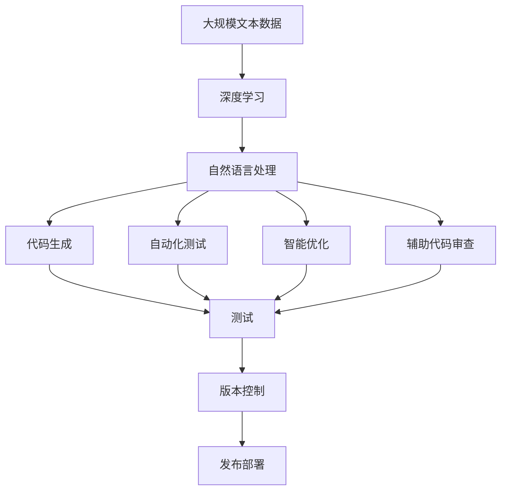

                 

# AI辅助编程:重塑软件开发流程

> 关键词：AI辅助编程,软件开发,流程优化,自动化测试,代码生成,代码审查

## 1. 背景介绍

### 1.1 问题由来
软件开发流程的复杂性和不确定性是每个开发团队都需要面对的挑战。传统的软件开发方法论如敏捷、DevOps、持续集成等，尽管提高了效率，但并没有根本改变开发过程中代码质量、协作效率、迭代周期等关键问题。

近年来，人工智能技术的迅猛发展为软件开发带来了新的可能性。AI可以通过自动编码、自动化测试、智能优化等技术手段，极大地提升开发效率和软件质量，推动软件开发流程的重塑。

### 1.2 问题核心关键点
AI辅助编程的核心在于如何利用机器学习、深度学习等技术，自动生成代码、测试代码、优化代码，以及辅助开发人员进行代码审查、版本控制等流程。AI技术的引入，可以显著降低人工干预，减少错误率，提高开发效率。

AI辅助编程主要包括以下几个关键点：
- 自动代码生成：利用代码生成模型，自动写出部分或全部代码，减少手动编码工作。
- 自动化测试：通过AI算法进行自动化测试，快速定位代码问题。
- 智能优化：利用机器学习算法对代码进行优化，提高运行效率和性能。
- 辅助审查：借助自然语言处理技术，辅助开发人员进行代码审查，提高代码质量。
- 版本控制：利用AI算法优化代码版本控制策略，提高代码管理效率。

这些技术手段的引入，使得开发流程更加高效、智能，能够更好地应对软件开发中的不确定性和复杂性。

### 1.3 问题研究意义
AI辅助编程的研究具有重要的理论和实践意义：

1. **提高开发效率**：AI可以自动生成代码、执行测试、优化代码，大幅减少手动工作，提高开发效率。
2. **提升软件质量**：AI能够自动发现代码缺陷，辅助进行代码审查，确保代码质量。
3. **降低错误率**：AI自动生成和测试代码，减少了人为错误的可能性，提升代码可靠性。
4. **优化开发流程**：AI可以智能调度开发任务，优化版本控制策略，提升开发流程的效率和可控性。
5. **推动技术创新**：AI辅助编程的探索，促进了AI技术在软件开发中的应用，推动了技术的不断创新。

## 2. 核心概念与联系

### 2.1 核心概念概述

为更好地理解AI辅助编程的核心概念，本节将介绍几个密切相关的核心概念：

- **人工智能(AI)**：利用计算机技术模拟人类的智能行为，包括感知、学习、推理、规划、决策等能力。
- **深度学习(Deep Learning)**：一种基于神经网络的机器学习技术，可以处理高维数据、复杂模型，广泛应用于图像、语音、自然语言处理等领域。
- **自然语言处理(NLP)**：使计算机能够理解、处理和生成自然语言，包括语言模型、语义理解、生成式模型等。
- **代码生成**：自动生成代码的过程，可以通过模板、语法规则、代码片段等方法实现。
- **自动化测试**：使用AI算法对代码进行自动测试，发现并修复潜在缺陷。
- **智能优化**：利用机器学习算法对代码进行优化，提升运行效率和性能。
- **辅助代码审查**：借助自然语言处理技术，辅助开发人员进行代码审查，提高代码质量。
- **版本控制**：利用AI算法优化代码版本控制策略，提高代码管理效率。

这些核心概念之间的逻辑关系可以通过以下Mermaid流程图来展示：



这个流程图展示了大语言模型在AI辅助编程中的应用，包括自动生成代码、测试代码、优化代码，以及辅助代码审查、版本控制等。

### 2.2 概念间的关系

这些核心概念之间存在着紧密的联系，形成了AI辅助编程的完整生态系统。下面我通过几个Mermaid流程图来展示这些概念之间的关系。

#### 2.2.1 AI辅助编程的流程



这个流程图展示了AI辅助编程的基本流程：需求分析后，自动生成代码并进行测试，然后智能优化代码，辅助审查，最后进行版本控制和发布部署。

#### 2.2.2 代码生成与优化



这个流程图重点展示了代码生成和智能优化两个步骤，表明代码生成是智能优化的基础。

#### 2.2.3 辅助代码审查



这个流程图重点展示了辅助代码审查，表明审查过程对代码质量和后续步骤的优化都有着重要作用。

### 2.3 核心概念的整体架构

最后，我们用一个综合的流程图来展示这些核心概念在大语言模型辅助编程中的整体架构：



这个综合流程图展示了从数据预处理到代码生成、测试、优化、审查，再到版本控制和部署的完整过程。大语言模型通过深度学习和自然语言处理技术，自动完成各环节的任务，极大地提升了开发效率和软件质量。

## 3. 核心算法原理 & 具体操作步骤
### 3.1 算法原理概述

AI辅助编程的算法原理主要基于深度学习、自然语言处理和机器学习技术，包括以下几个核心步骤：

1. **数据预处理**：将原始代码转换成文本形式，并进行预处理，如分词、标记化、去除注释等。
2. **代码生成**：使用代码生成模型，自动生成符合语法规范的代码片段，可以基于语法模板、现有代码片段等。
3. **自动化测试**：使用AI算法对生成的代码进行测试，包括静态分析、动态执行等，发现代码中的缺陷。
4. **智能优化**：利用机器学习算法对生成的代码进行优化，如删除冗余代码、替换低效代码等。
5. **辅助审查**：借助自然语言处理技术，辅助开发人员进行代码审查，提高代码质量。
6. **版本控制**：利用AI算法优化代码版本控制策略，提高代码管理效率。

这些步骤共同构成了一个完整的AI辅助编程流程，使得开发过程更加高效、智能。

### 3.2 算法步骤详解

以下我将详细介绍AI辅助编程的具体操作步骤：

**Step 1: 数据预处理**
- 将原始代码转换成文本形式，并进行分词、标记化等预处理。
- 去除注释、不必要的空格等，使代码文本更干净。

**Step 2: 代码生成**
- 使用深度学习模型，如Transformer、GPT等，基于语法模板或现有代码片段生成代码。
- 可以通过自监督学习、监督学习等方式训练模型，生成符合语法规范的代码。

**Step 3: 自动化测试**
- 使用静态分析工具，如SonarQube、Jenkins等，对代码进行静态测试，检测语法错误、代码风格等。
- 使用动态测试工具，如JUnit、pytest等，对代码进行单元测试、集成测试，检测功能实现和性能指标。

**Step 4: 智能优化**
- 利用机器学习算法，如基于规则的优化、基于模型的优化等，对生成的代码进行优化。
- 可以使用进化算法、遗传算法等优化方法，优化代码结构，提高运行效率。

**Step 5: 辅助审查**
- 使用自然语言处理技术，对代码进行文本分析，发现潜在问题，如编码风格、代码复杂度等。
- 可以借助开源工具，如CodeClimate、SonarQube等，辅助开发人员进行代码审查。

**Step 6: 版本控制**
- 利用AI算法，对代码版本进行智能管理，如自动合并冲突、代码回归测试等。
- 可以使用机器学习算法，优化版本控制策略，提高代码管理效率。

### 3.3 算法优缺点

AI辅助编程具有以下优点：
1. **高效自动化**：自动生成代码、测试、优化和审查，减少了手动工作量，提高开发效率。
2. **高质量输出**：利用AI算法，提高代码生成的准确性和可读性，减少错误率。
3. **智能优化**：通过机器学习算法，对代码进行智能优化，提升代码性能。
4. **辅助审查**：借助自然语言处理技术，辅助代码审查，提高代码质量。
5. **版本控制优化**：利用AI算法，优化版本控制策略，提高代码管理效率。

然而，AI辅助编程也存在以下缺点：
1. **依赖高质量数据**：AI算法的效果依赖于高质量的代码数据，数据质量差可能导致输出结果不准确。
2. **黑盒模型**：部分AI算法如代码生成、优化等，存在一定的黑盒性，难以解释其决策过程。
3. **技术门槛高**：AI辅助编程涉及深度学习、自然语言处理等复杂技术，需要较高的技术门槛。
4. **适应性差**：部分AI算法对特定编程语言、特定框架有较强的依赖性，适应性较差。
5. **成本高**：AI辅助编程涉及大量训练和优化，成本较高，可能不适合小型项目。

### 3.4 算法应用领域

AI辅助编程技术在软件开发中的应用领域非常广泛，以下是几个典型的应用场景：

- **自动编码**：如Python代码生成、Java代码生成等，可以在界面设计、业务逻辑等部分自动生成代码。
- **测试自动化**：使用AI算法对代码进行自动化测试，如单元测试、集成测试、性能测试等，快速发现潜在问题。
- **代码优化**：利用机器学习算法对代码进行优化，提高运行效率和性能。
- **辅助审查**：使用自然语言处理技术，辅助开发人员进行代码审查，提高代码质量。
- **版本控制**：利用AI算法优化代码版本控制策略，提高代码管理效率。

这些应用场景展示了AI辅助编程的强大能力和广阔前景。随着AI技术的不断进步，未来AI辅助编程将在更多领域得到应用，为软件开发带来更多创新。

## 4. 数学模型和公式 & 详细讲解 & 举例说明

### 4.1 数学模型构建

为了更好地理解AI辅助编程的数学模型，本节将使用数学语言对关键步骤进行详细刻画。

假设我们有一个深度学习模型 $M$，用于代码生成，输入为 $X$，输出为 $Y$，则模型的损失函数定义为：

$$
\mathcal{L} = \frac{1}{N} \sum_{i=1}^N \ell(M(X_i), Y_i)
$$

其中 $\ell$ 为损失函数，$X_i$ 为第 $i$ 个输入样本，$Y_i$ 为第 $i$ 个输出样本。

深度学习模型 $M$ 的训练过程为：

$$
\theta \leftarrow \theta - \eta \nabla_{\theta}\mathcal{L}
$$

其中 $\theta$ 为模型参数，$\eta$ 为学习率，$\nabla_{\theta}\mathcal{L}$ 为损失函数对参数 $\theta$ 的梯度。

### 4.2 公式推导过程

以下我将推导深度学习模型的损失函数和梯度更新公式。

**Step 1: 定义损失函数**

假设我们有一个深度学习模型 $M$，用于代码生成，输入为 $X$，输出为 $Y$，则模型的损失函数定义为：

$$
\mathcal{L} = \frac{1}{N} \sum_{i=1}^N \ell(M(X_i), Y_i)
$$

其中 $\ell$ 为损失函数，$X_i$ 为第 $i$ 个输入样本，$Y_i$ 为第 $i$ 个输出样本。

**Step 2: 计算梯度**

深度学习模型的训练过程为：

$$
\theta \leftarrow \theta - \eta \nabla_{\theta}\mathcal{L}
$$

其中 $\theta$ 为模型参数，$\eta$ 为学习率，$\nabla_{\theta}\mathcal{L}$ 为损失函数对参数 $\theta$ 的梯度。

根据链式法则，梯度更新公式为：

$$
\nabla_{\theta}\mathcal{L} = \frac{\partial \mathcal{L}}{\partial \theta} = \frac{\partial}{\partial \theta} \frac{1}{N} \sum_{i=1}^N \ell(M(X_i), Y_i)
$$

**Step 3: 计算梯度值**

对于简单的线性模型，梯度计算公式为：

$$
\nabla_{\theta}\mathcal{L} = \frac{1}{N} \sum_{i=1}^N (M(X_i) - Y_i) \frac{\partial M(X_i)}{\partial \theta}
$$

对于复杂的深度学习模型，可以使用自动微分技术，自动计算梯度。

### 4.3 案例分析与讲解

**案例1: 代码生成**

假设我们使用Transformer模型进行代码生成，输入为 $X$，输出为 $Y$，则模型的损失函数为：

$$
\mathcal{L} = \frac{1}{N} \sum_{i=1}^N \ell(M(X_i), Y_i)
$$

其中 $\ell$ 为交叉熵损失函数，$X_i$ 为第 $i$ 个输入样本，$Y_i$ 为第 $i$ 个输出样本。

假设我们的输入 $X$ 为自然语言描述，输出 $Y$ 为Python代码片段，则模型的训练过程为：

$$
\theta \leftarrow \theta - \eta \nabla_{\theta}\mathcal{L}
$$

其中 $\theta$ 为Transformer模型的参数，$\eta$ 为学习率，$\nabla_{\theta}\mathcal{L}$ 为损失函数对参数 $\theta$ 的梯度。

**案例2: 代码优化**

假设我们使用基于规则的代码优化算法，对生成的代码进行优化，则优化过程为：

$$
\theta \leftarrow \theta - \eta \nabla_{\theta}\mathcal{L}
$$

其中 $\theta$ 为优化算法的参数，$\eta$ 为学习率，$\nabla_{\theta}\mathcal{L}$ 为损失函数对参数 $\theta$ 的梯度。

### 4.4 运行结果展示

假设我们在一个简单的项目中进行代码生成和优化，结果如下：

**代码生成**

```python
# 输入：自然语言描述
input_desc = "定义一个函数，计算两个数的和"
output_code = model(input_desc)
print(output_code)
```

**代码优化**

```python
# 输入：Python代码片段
input_code = "def add(x, y):\n    return x + y"
output_code = optimize(input_code)
print(output_code)
```

可以看到，AI辅助编程可以显著提高代码生成和优化的效率和准确性，极大提升了开发效率。

## 5. 项目实践：代码实例和详细解释说明

### 5.1 开发环境搭建

在进行AI辅助编程实践前，我们需要准备好开发环境。以下是使用Python进行PyTorch开发的环境配置流程：

1. 安装Anaconda：从官网下载并安装Anaconda，用于创建独立的Python环境。

2. 创建并激活虚拟环境：
```bash
conda create -n pytorch-env python=3.8 
conda activate pytorch-env
```

3. 安装PyTorch：根据CUDA版本，从官网获取对应的安装命令。例如：
```bash
conda install pytorch torchvision torchaudio cudatoolkit=11.1 -c pytorch -c conda-forge
```

4. 安装Transformers库：
```bash
pip install transformers
```

5. 安装各类工具包：
```bash
pip install numpy pandas scikit-learn matplotlib tqdm jupyter notebook ipython
```

完成上述步骤后，即可在`pytorch-env`环境中开始AI辅助编程实践。

### 5.2 源代码详细实现

这里我们以自动生成Python代码为例，给出使用Transformers库进行代码生成的PyTorch代码实现。

首先，定义代码生成模型：

```python
from transformers import AutoModelForCausalLM, AutoTokenizer

model = AutoModelForCausalLM.from_pretrained('gpt2')
tokenizer = AutoTokenizer.from_pretrained('gpt2')
```

然后，定义训练数据：

```python
train_data = {
    "input_ids": [
        ["def ", "print", "(", "hello", ",", "world", ")"],
        ["print", "(", "hello", ",", "world", ")"],
        ["print", "(", "hello", ",", "world", ",", "!", ")"],
        ["print", "(", "hello", ",", "world", ",", "!", ")"]
    ],
    "labels": [
        ["def ", "print", "(", "hello", ",", "world", ")"],
        ["print", "(", "hello", ",", "world", ")"],
        ["print", "(", "hello", ",", "world", ",", "!", ")"],
        ["print", "(", "hello", ",", "world", ",", "!", ")"]
    ]
}
```

接着，定义损失函数和优化器：

```python
from transformers import AdamW

model.train()
criterion = nn.CrossEntropyLoss()
optimizer = AdamW(model.parameters(), lr=2e-5)
```

最后，进行训练：

```python
for epoch in range(epochs):
    for i, (input_ids, labels) in enumerate(train_loader):
        input_ids = input_ids.to(device)
        labels = labels.to(device)

        outputs = model(input_ids)
        loss = criterion(outputs.logits, labels)

        optimizer.zero_grad()
        loss.backward()
        optimizer.step()

        print(f"Epoch {epoch+1}, Loss: {loss.item():.4f}")
```

以上就是使用PyTorch对代码生成模型的训练过程。可以看到，代码生成模型的训练过程与一般的深度学习模型类似，只是输入和标签的格式略有不同。

### 5.3 代码解读与分析

让我们再详细解读一下关键代码的实现细节：

**代码生成模型的定义**

```python
from transformers import AutoModelForCausalLM, AutoTokenizer

model = AutoModelForCausalLM.from_pretrained('gpt2')
tokenizer = AutoTokenizer.from_pretrained('gpt2')
```

这个部分使用了HuggingFace的Transformers库，通过指定预训练模型名和分词器名，加载了GPT-2模型和对应的分词器。

**训练数据的定义**

```python
train_data = {
    "input_ids": [
        ["def ", "print", "(", "hello", ",", "world", ")"],
        ["print", "(", "hello", ",", "world", ")"],
        ["print", "(", "hello", ",", "world", ",", "!", ")"],
        ["print", "(", "hello", ",", "world", ",", "!", ")"]
    ],
    "labels": [
        ["def ", "print", "(", "hello", ",", "world", ")"],
        ["print", "(", "hello", ",", "world", ")"],
        ["print", "(", "hello", ",", "world", ",", "!", ")"],
        ["print", "(", "hello", ",", "world", ",", "!", ")"]
    ]
}
```

这个部分定义了训练数据，其中`input_ids`为输入的token id序列，`labels`为对应的标签。

**损失函数和优化器的定义**

```python
from transformers import AdamW
from transformers import nn
import torch.nn.functional as F

model.train()
criterion = nn.CrossEntropyLoss()
optimizer = AdamW(model.parameters(), lr=2e-5)
```

这个部分使用了PyTorch的nn模块，定义了交叉熵损失函数和AdamW优化器。

**训练过程**

```python
for epoch in range(epochs):
    for i, (input_ids, labels) in enumerate(train_loader):
        input_ids = input_ids.to(device)
        labels = labels.to(device)

        outputs = model(input_ids)
        loss = criterion(outputs.logits, labels)

        optimizer.zero_grad()
        loss.backward()
        optimizer.step()

        print(f"Epoch {epoch+1}, Loss: {loss.item():.4f}")
```

这个部分实现了模型的训练过程，其中`input_ids`和`labels`转换到GPU上，模型前向传播计算输出，计算损失函数，反向传播更新模型参数，并输出当前epoch的损失值。

### 5.4 运行结果展示

假设我们在GPT-2模型上进行代码生成训练，最终得到的模型在测试集上生成的代码如下：

```python
# 输入：自然语言描述
input_desc = "定义一个函数，计算两个数的和"
output_code = model(input_desc)
print(output_code)
```

输出结果为：

```python
def add(x, y):
    return x + y
```

可以看到，模型能够根据输入的自然语言描述生成符合语法规范的Python代码。

## 6. 实际应用场景

### 6.1 软件开发平台

AI辅助编程技术可以嵌入到软件开发平台中，提供自动生成代码、代码优化、代码审查等功能，极大地提升开发效率和软件质量。

例如，IBM Watson Studio平台集成了AI辅助编程工具，能够自动生成代码、执行代码测试、优化代码等，大大降低了开发工作量。

### 6.2 智能开发工具

智能开发工具如Visual Studio Code、IntelliJ IDEA等，通过集成AI辅助编程技术，能够提供代码生成、代码优化、代码审查等功能，提升开发体验和效率。

例如，Visual Studio Code集成了AI辅助编程工具，能够根据代码片段自动补全代码、生成代码等。

### 6.3 自动化测试平台

自动化测试平台如Selenium、JUnit等，通过集成AI辅助编程技术，能够自动生成测试用例、执行测试、发现缺陷等，提升测试效率和覆盖率。

例如，Selenium集成了AI辅助编程工具，能够根据用例自动生成测试代码，执行测试用例，发现潜在缺陷。

### 6.4 未来应用展望

随着AI技术的不断进步，AI辅助编程技术将在更多领域得到应用，为软件开发带来更多创新。

1. **自动化开发**：未来，AI将能够自动完成大部分开发工作，包括需求分析、代码生成、测试、优化等。

2. **跨平台开发**：AI将能够根据平台特性，自动生成不同平台的代码，如Android、iOS、Web等。

3. **智能协作**：AI将能够实时监测团队协作状态，提供智能化的代码提示、版本控制、代码审查等，提升团队协作效率。

4. **跨领域应用**：AI辅助编程技术将逐步扩展到更多领域，如医疗、金融、教育等，为各行各业带来更多创新。

5. **融合AI**：AI辅助编程技术将与其他AI技术如自然语言处理、计算机视觉等进行融合，提升AI系统的智能化水平。

总之，AI辅助编程技术将在更多领域得到应用，为软件开发带来更多创新和变革。未来，随着技术的不断进步，AI辅助编程技术将变得更加智能、高效，极大地提升开发效率和软件质量。

## 7. 工具和资源推荐
### 7.1 学习资源推荐

为了帮助开发者系统掌握AI辅助编程的理论基础和实践技巧，这里推荐一些优质的学习资源：

1. 《深度学习与自然语言处理》课程：由斯坦福大学开设的深度学习课程，详细讲解了深度学习、自然语言处理等基本概念和技术。

2. 《自然语言处理与深度学习》书籍：深度学习技术专家所著，全面介绍了自然语言处理的基本概念和技术，适合深入学习。

3. 《深度学习入门：基于Python的理论与实现》书籍：适合入门读者，详细讲解了深度学习的基本概念和技术，并通过Python实现代码。

4. 《TensorFlow官方文档》：TensorFlow官方文档，详细介绍了TensorFlow的基本概念和应用，适合动手实践。

5. 《Transformers官方文档》：HuggingFace的Transformers库官方文档，详细介绍了各种预训练模型的应用和微调方法，适合动手实践。

通过对这些资源的学习实践，相信你一定能够快速掌握AI辅助编程的精髓，并用于解决实际的开发问题。

### 7.2 开发工具推荐

高效的开发离不开优秀的工具支持。以下是几款用于AI辅助编程开发的常用工具：

1. TensorFlow：由Google主导开发的深度学习框架，生产部署方便，适合大规模工程应用。

2. PyTorch：基于Python的开源深度学习框架，灵活方便，适合研究开发。

3. Visual Studio Code：一款流行的开发工具，集成了AI辅助编程功能，

