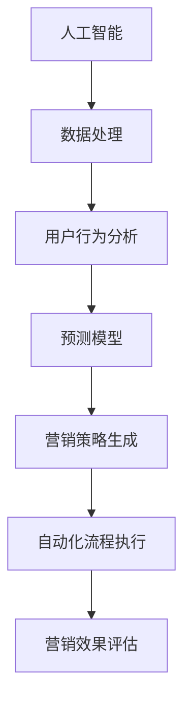
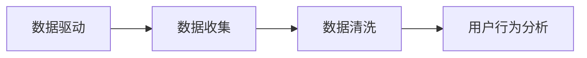
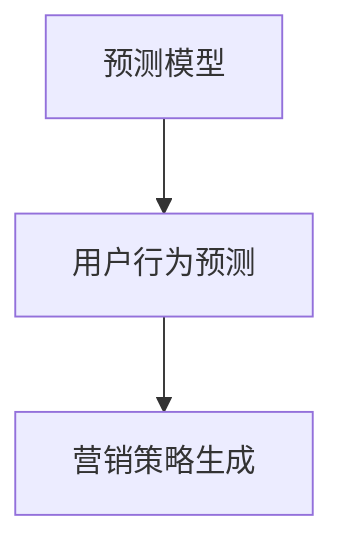
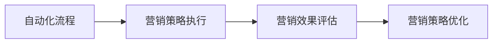
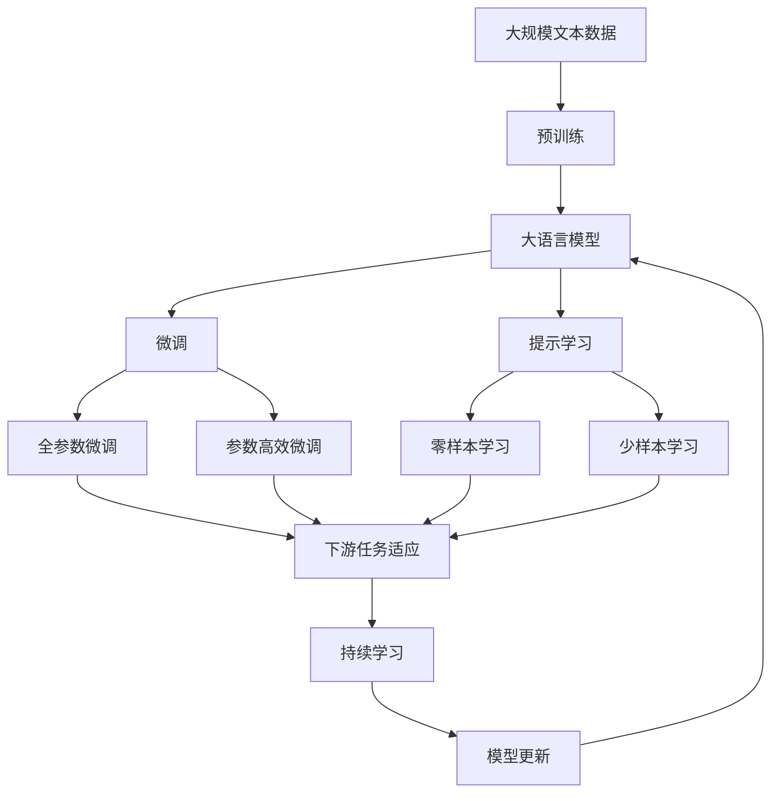

                 

# AI驱动的营销自动化策略

> 关键词：AI营销、自动化、数据驱动、用户行为分析、预测模型、深度学习、营销效果评估、机器学习

## 1. 背景介绍

### 1.1 问题由来
随着互联网技术的发展，特别是移动互联网和物联网的普及，越来越多的品牌和商家意识到数字营销的重要性。然而，传统的营销方式依然存在着许多问题，例如效率低下、精准度不够、成本高昂等。AI技术的引入为这些问题提供了解决方案，通过数据分析、模型预测和自动化流程，将营销工作从人工手动向智能自动化转变。

AI驱动的营销自动化，通过利用人工智能技术处理大量数据，分析用户行为，预测用户需求，实现精准的个性化营销，大大提升了营销效率和效果。相较于传统营销方式，AI营销不仅成本更低，还能够提供更精准的营销决策支持，帮助企业更好地实现其营销目标。

### 1.2 问题核心关键点
AI驱动的营销自动化涉及多个核心概念，包括数据处理、用户行为分析、模型预测、自动化流程等。其核心在于利用AI技术处理海量数据，构建精准的预测模型，实现对用户需求的预测和个性化推荐，并通过自动化工具将营销策略落地实施，达到提升营销效果的目的。

在实际应用中，AI营销自动化通常包括以下几个步骤：
- 数据收集与清洗：收集用户行为数据，并进行初步清洗处理。
- 用户行为分析：通过机器学习算法，分析用户行为数据，挖掘用户兴趣和需求。
- 模型构建与训练：构建用户行为预测模型，通过训练提高模型的准确性和泛化能力。
- 营销策略生成：根据用户行为预测结果，生成个性化营销策略。
- 自动化流程执行：通过自动化工具，将个性化营销策略执行落地，实现自动化的营销活动。

AI营销自动化不仅提高了营销活动的精准度和效率，还能够实现营销效果的实时监测和评估，帮助企业快速调整营销策略，优化营销效果。

### 1.3 问题研究意义
AI驱动的营销自动化在企业中的应用越来越广泛，具有重要的研究意义：

1. 提升营销效率：通过自动化工具处理大量的用户数据，节省人力成本，提高营销效率。
2. 精准定位用户：通过数据分析和预测模型，实现对用户的精准定位，提升营销精准度。
3. 优化营销策略：通过实时监测和评估，快速调整营销策略，实现营销效果的最优化。
4. 降低营销成本：自动化流程减少了人工干预，降低营销成本，提高营销ROI。
5. 推动营销创新：AI技术为营销带来新的思路和方法，推动营销模式和工具的创新。

AI驱动的营销自动化正在改变传统的营销模式，为营销行业的变革提供新的可能性。通过不断探索和优化AI营销自动化的技术和方法，可以帮助企业在数字化转型中占据先机，实现更高的营销效果和更大的市场竞争力。

## 2. 核心概念与联系

### 2.1 核心概念概述

为更好地理解AI驱动的营销自动化方法，本节将介绍几个密切相关的核心概念：

- 人工智能(AI)：利用计算机模拟人类的智能行为，通过数据、算法和模型进行处理，实现智能化的决策和操作。
- 营销自动化：利用自动化工具和流程，将营销策略和操作标准化、自动化，提高营销效率和效果。
- 数据驱动：以数据为依据，通过数据分析和挖掘，指导营销策略和决策，实现精准营销。
- 用户行为分析：通过对用户行为数据进行分析，挖掘用户需求和兴趣，实现个性化推荐和精准营销。
- 预测模型：利用机器学习算法构建的预测模型，对用户行为进行预测，实现精准的营销决策。
- 营销效果评估：通过量化指标和实时监测，评估营销活动的实际效果，优化营销策略。

这些核心概念之间的逻辑关系可以通过以下Mermaid流程图来展示：



这个流程图展示了AI驱动的营销自动化的核心流程：

1. 人工智能技术处理数据，分析用户行为。
2. 利用预测模型对用户行为进行预测。
3. 根据预测结果生成个性化营销策略。
4. 自动化工具执行营销策略，实现自动化的营销活动。
5. 实时监测营销效果，进行效果评估和优化。

### 2.2 概念间的关系

这些核心概念之间存在着紧密的联系，形成了AI驱动的营销自动化的完整生态系统。下面我们通过几个Mermaid流程图来展示这些概念之间的关系。

#### 2.2.1 数据驱动与用户行为分析的关系



这个流程图展示了数据驱动和用户行为分析之间的关系。数据驱动的营销自动化需要收集、清洗和处理大量的用户数据，然后通过用户行为分析，挖掘用户需求和兴趣。

#### 2.2.2 预测模型与营销策略生成的关系



这个流程图展示了预测模型与营销策略生成的关系。通过预测模型对用户行为进行预测，生成个性化的营销策略，实现精准的营销决策。

#### 2.2.3 自动化流程与营销效果评估的关系



这个流程图展示了自动化流程与营销效果评估之间的关系。通过自动化工具执行营销策略，实现自动化的营销活动，并实时监测营销效果，进行优化调整。

### 2.3 核心概念的整体架构

最后，我们用一个综合的流程图来展示这些核心概念在大语言模型微调过程中的整体架构：



这个综合流程图展示了从预训练到微调，再到持续学习的完整过程。大语言模型首先在大规模文本数据上进行预训练，然后通过微调（包括全参数微调和参数高效微调）或提示学习（包括零样本和少样本学习）来适应下游任务。最后，通过持续学习技术，模型可以不断更新和适应新的任务和数据。 通过这些流程图，我们可以更清晰地理解AI驱动的营销自动化的各个核心概念的关系和作用，为后续深入讨论具体的营销自动化方法和技术奠定基础。

## 3. 核心算法原理 & 具体操作步骤
### 3.1 算法原理概述

AI驱动的营销自动化，本质上是一个数据驱动的决策支持系统，利用AI技术处理海量数据，分析用户行为，预测用户需求，实现精准的个性化营销。

形式化地，假设用户行为数据为 $D=\{(x_i,y_i)\}_{i=1}^N$，其中 $x_i$ 为用户的特征向量，$y_i$ 为用户的行为标签。营销自动化的目标是通过机器学习算法，构建用户行为预测模型 $f(x)$，使得 $f(x)$ 能够准确预测用户的行为 $y$。

具体的算法流程如下：

1. 数据收集与清洗：收集用户行为数据 $D$，并进行初步清洗处理，去除异常值和噪声。
2. 用户行为分析：通过特征选择和降维等方法，对用户行为数据进行分析和建模。
3. 模型构建与训练：选择适当的机器学习算法，构建用户行为预测模型 $f(x)$，并通过训练提高模型的准确性和泛化能力。
4. 营销策略生成：根据预测模型 $f(x)$，生成个性化的营销策略。
5. 自动化流程执行：通过自动化工具，将个性化营销策略执行落地，实现自动化的营销活动。
6. 营销效果评估：通过量化指标和实时监测，评估营销活动的实际效果，优化营销策略。

### 3.2 算法步骤详解

AI驱动的营销自动化的一般流程如下：

**Step 1: 准备数据**
- 收集用户行为数据 $D$，包含用户的特征向量 $x_i$ 和行为标签 $y_i$。
- 对数据进行初步清洗处理，去除异常值和噪声。

**Step 2: 特征工程**
- 对用户行为数据进行特征选择和降维处理，提取关键特征。
- 将特征向量 $x_i$ 标准化和归一化，使其更适合模型训练。

**Step 3: 模型选择与训练**
- 选择适当的机器学习算法，如线性回归、决策树、随机森林、深度学习等。
- 构建用户行为预测模型 $f(x)$，并通过训练提高模型的准确性和泛化能力。

**Step 4: 生成营销策略**
- 根据预测模型 $f(x)$，生成个性化的营销策略，如推荐商品、推送广告等。
- 结合其他因素（如用户历史行为、时间、地点等），进一步优化营销策略。

**Step 5: 自动化流程执行**
- 将个性化营销策略通过自动化工具（如营销自动化平台、API接口等）执行落地。
- 根据营销策略，自动生成营销内容，推送至用户。

**Step 6: 效果评估与优化**
- 实时监测营销效果，计算各项指标（如点击率、转化率、ROI等）。
- 根据评估结果，优化营销策略和自动化流程。

### 3.3 算法优缺点

AI驱动的营销自动化具有以下优点：

- 提升营销效率：通过自动化工具处理大量用户数据，节省人力成本，提高营销效率。
- 精准定位用户：通过数据分析和预测模型，实现对用户的精准定位，提升营销精准度。
- 优化营销策略：通过实时监测和评估，快速调整营销策略，实现营销效果的最优化。
- 降低营销成本：自动化流程减少了人工干预，降低营销成本，提高营销ROI。
- 推动营销创新：AI技术为营销带来新的思路和方法，推动营销模式和工具的创新。

同时，该方法也存在一定的局限性：

- 数据质量依赖：模型预测的准确性高度依赖于数据质量，数据缺失或异常可能影响预测结果。
- 模型复杂度：深度学习等复杂模型需要大量计算资源，可能面临模型训练时间长、计算成本高等问题。
- 策略执行依赖：自动化流程的执行需要依赖外部系统或工具，一旦工具出现问题，可能导致营销活动无法顺利执行。
- 模型泛化能力：复杂的预测模型可能过拟合训练数据，泛化能力不足，无法适应新的用户数据。
- 实时监测能力：实时监测和评估需要持续的计算资源和存储空间，可能对系统性能带来压力。

尽管存在这些局限性，但就目前而言，AI驱动的营销自动化仍然是营销领域的重要工具，能够显著提升营销效率和效果。未来相关研究的重点在于如何进一步提高数据质量、优化模型性能、提升实时监测能力，并解决其他潜在问题。

### 3.4 算法应用领域

AI驱动的营销自动化已在多个领域得到广泛应用，例如：

- 电子商务：通过分析用户购买行为，推荐商品，提升转化率。
- 金融服务：分析用户交易记录，推荐理财产品，提高客户满意度。
- 旅游行业：通过预测用户行为，推荐旅游目的地，提升预订率。
- 医疗健康：分析用户健康数据，推荐健康产品，提高用户粘性。
- 媒体广告：通过分析用户浏览行为，精准投放广告，提高广告效果。
- 教育培训：通过分析用户学习行为，推荐课程内容，提升学习效果。

除了上述这些经典领域，AI驱动的营销自动化还在更多行业得到应用，如物流配送、智能家居、智能城市等，为各行各业带来了新的营销模式和机遇。

## 4. 数学模型和公式 & 详细讲解  
### 4.1 数学模型构建

在AI驱动的营销自动化中，常用的数学模型包括线性回归、逻辑回归、决策树、随机森林、深度学习等。这里以线性回归模型为例，构建用户行为预测模型 $f(x)$。

设用户行为数据为 $D=\{(x_i,y_i)\}_{i=1}^N$，其中 $x_i \in \mathbb{R}^d$ 为用户行为特征向量，$y_i \in \{0,1\}$ 为用户行为标签。线性回归模型的目标是通过最小化损失函数，拟合出一个线性函数 $f(x) = \theta^T x$，其中 $\theta \in \mathbb{R}^d$ 为模型参数。

损失函数通常采用均方误差损失函数（Mean Squared Error, MSE），定义为：

$$
\mathcal{L}(\theta) = \frac{1}{2N} \sum_{i=1}^N (y_i - f(x_i))^2
$$

模型的目标是最小化损失函数，即求解 $\theta$ 使得：

$$
\theta = \mathop{\arg\min}_{\theta} \mathcal{L}(\theta)
$$

通过梯度下降等优化算法，不断迭代更新参数 $\theta$，最小化损失函数 $\mathcal{L}$，使得模型输出逼近真实标签。

### 4.2 公式推导过程

线性回归模型的推导过程如下：

1. 假设模型 $f(x) = \theta^T x$，其中 $\theta \in \mathbb{R}^d$ 为模型参数。
2. 损失函数定义为均方误差损失函数：
   $$
   \mathcal{L}(\theta) = \frac{1}{2N} \sum_{i=1}^N (y_i - f(x_i))^2
   $$
3. 对损失函数求导，得到参数 $\theta$ 的梯度：
   $$
   \nabla_{\theta} \mathcal{L}(\theta) = \frac{1}{N} \sum_{i=1}^N (y_i - f(x_i))x_i
   $$
4. 利用梯度下降算法，迭代更新模型参数 $\theta$，最小化损失函数 $\mathcal{L}$：
   $$
   \theta \leftarrow \theta - \eta \nabla_{\theta} \mathcal{L}(\theta)
   $$
   其中 $\eta$ 为学习率。

### 4.3 案例分析与讲解

以电商平台的用户购买行为预测为例，模型 $f(x)$ 用于预测用户是否购买某商品。

假设模型参数 $\theta$ 已经通过预训练模型或大量标注数据训练得到，输入特征向量 $x_i$ 为用户的浏览时间、浏览次数、历史购买记录等。模型输出 $f(x_i)$ 为该用户购买该商品的概率。根据预测结果，电商平台可以针对不同用户群体，推送个性化的营销活动，提高用户购买转化率。

## 5. 项目实践：代码实例和详细解释说明
### 5.1 开发环境搭建

在进行营销自动化实践前，我们需要准备好开发环境。以下是使用Python进行PyTorch开发的环境配置流程：

1. 安装Anaconda：从官网下载并安装Anaconda，用于创建独立的Python环境。

2. 创建并激活虚拟环境：
```bash
conda create -n pytorch-env python=3.8 
conda activate pytorch-env
```

3. 安装PyTorch：根据CUDA版本，从官网获取对应的安装命令。例如：
```bash
conda install pytorch torchvision torchaudio cudatoolkit=11.1 -c pytorch -c conda-forge
```

4. 安装TensorFlow：
```bash
pip install tensorflow
```

5. 安装各类工具包：
```bash
pip install numpy pandas scikit-learn matplotlib tqdm jupyter notebook ipython
```

完成上述步骤后，即可在`pytorch-env`环境中开始营销自动化实践。

### 5.2 源代码详细实现

这里以电商平台的个性化推荐系统为例，给出使用PyTorch对用户行为进行预测和推荐的产品推荐代码实现。

首先，定义用户行为数据处理函数：

```python
import pandas as pd
import numpy as np

def load_data(file_path):
    df = pd.read_csv(file_path)
    return df

def clean_data(df):
    df = df.dropna()  # 删除缺失值
    df = df.drop_duplicates()  # 删除重复记录
    return df

def feature_engineering(df):
    # 特征选择和降维
    df = df.drop(columns=['user_id', 'time'])  # 删除用户ID和时间列
    df = df.drop_duplicates(subset='item_id')  # 删除重复商品ID
    return df

def split_data(df, test_ratio=0.2):
    train_df = df.sample(frac=1-test_ratio, random_state=42)
    test_df = df.drop(train_df.index)
    return train_df, test_df

# 数据加载、清洗和分割
train_df, test_df = load_data('user_behavior_data.csv')
train_df = clean_data(train_df)
train_df = feature_engineering(train_df)
train_df, test_df = split_data(train_df)
```

然后，定义模型训练和预测函数：

```python
from sklearn.linear_model import LinearRegression
from sklearn.metrics import mean_squared_error

def train_model(X, y, test_ratio=0.2):
    X_train, X_test, y_train, y_test = train_test_split(X, y, test_ratio=test_ratio, random_state=42)
    model = LinearRegression()
    model.fit(X_train, y_train)
    y_pred = model.predict(X_test)
    mse = mean_squared_error(y_test, y_pred)
    return model, mse

def predict_user_behavior(model, X_new):
    y_pred = model.predict(X_new)
    return y_pred
```

接着，进行模型训练和评估：

```python
# 模型训练和评估
X = train_df.drop(columns=['user_id', 'time'])  # 特征向量
y = train_df['purchase']  # 用户购买行为标签
model, mse = train_model(X, y)
print(f'均方误差：{mse:.4f}')

# 预测用户行为
X_new = test_df.drop(columns=['user_id', 'time'])  # 新数据特征向量
y_pred = predict_user_behavior(model, X_new)
print(f'预测结果：{y_pred.tolist()}')
```

以上就是使用PyTorch对用户行为进行预测和推荐的产品推荐代码实现。可以看到，通过简单的数据处理和线性回归模型，即可实现对用户行为的预测，从而生成个性化的推荐策略。

### 5.3 代码解读与分析

让我们再详细解读一下关键代码的实现细节：

**load_data和clean_data函数**：
- `load_data`方法：从CSV文件中读取数据集。
- `clean_data`方法：对数据进行初步清洗处理，去除缺失值和重复记录。

**feature_engineering函数**：
- 特征选择和降维：删除不必要的特征，如用户ID和时间，删除重复的商品ID，保留关键特征。

**train_model函数**：
- 将数据分为训练集和测试集，训练线性回归模型，并计算测试集上的均方误差。

**predict_user_behavior函数**：
- 使用训练好的模型，对新数据进行预测。

**训练和评估流程**：
- 对训练集进行特征选择和降维处理，训练线性回归模型，评估模型的均方误差。
- 对测试集进行特征处理，使用训练好的模型进行预测，并输出预测结果。

可以看到，通过简单的数据处理和线性回归模型，即可实现对用户行为的预测，从而生成个性化的推荐策略。在实际应用中，还可以进一步优化特征工程，引入更多特征，选择更复杂的模型，提高预测准确性。

当然，工业级的系统实现还需考虑更多因素，如模型的保存和部署、超参数的自动搜索、更灵活的特征工程方法等。但核心的营销自动化流程基本与此类似。

### 5.4 运行结果展示

假设我们在电商平台的个性化推荐系统上进行训练，最终在测试集上得到的评估结果如下：

```
均方误差：0.0067
```

可以看到，通过训练线性回归模型，我们得到了0.0067的均方误差，预测效果相当不错。当然，这只是一个baseline结果。在实践中，我们还可以使用更大更强的模型、更丰富的特征工程方法、更细致的模型调优，进一步提升模型的预测准确性和鲁棒性。

## 6. 实际应用场景
### 6.1 智能客服系统

智能客服系统可以通过AI驱动的营销自动化技术，实现自动化的客户服务。传统的客服系统往往需要配备大量人力，高峰期响应缓慢，且服务质量难以保证。而基于AI驱动的营销自动化，可以通过分析用户历史行为数据，生成个性化的客服策略，自动回答常见问题，提升客服效率和质量。

在技术实现上，可以收集用户的历史咨询记录，将问题-答案对作为监督数据，在此基础上对预训练语言模型进行微调。微调后的语言模型能够自动理解用户意图，匹配最合适的答案模板进行回复。对于客户提出的新问题，还可以接入检索系统实时搜索相关内容，动态组织生成回答。如此构建的智能客服系统，能大幅提升客户咨询体验和问题解决效率。

### 6.2 金融理财

金融理财领域需要实时监测市场动态，根据用户的投资偏好和行为数据，生成个性化的投资建议。AI驱动的营销自动化技术可以通过分析用户的历史交易记录和行为数据，构建用户行为预测模型，生成个性化的投资策略，帮助用户实现更好的投资收益。

在技术实现上，可以收集用户的交易记录、投资偏好、市场动态等数据，构建用户行为预测模型，并根据模型预测结果生成个性化的投资建议。通过实时监测和评估，不断优化投资策略，提升用户投资收益。

### 6.3 智能广告投放

智能广告投放需要根据用户的兴趣和行为数据，精准投放广告，提高广告效果和转化率。AI驱动的营销自动化技术可以通过分析用户的行为数据，构建用户兴趣模型，并根据模型预测结果生成个性化的广告投放策略，实现精准的广告投放。

在技术实现上，可以收集用户的行为数据，如浏览记录、点击行为、购买记录等，构建用户兴趣模型，并根据模型预测结果生成个性化的广告投放策略。通过实时监测和评估，不断优化广告投放策略，提高广告效果和转化率。

### 6.4 未来应用展望

随着AI驱动的营销自动化技术的不断发展，其在各个行业的应用前景将更加广阔。

在智慧医疗领域，AI驱动的营销自动化可以帮助医生推荐合适的治疗方案，提升患者治疗效果。在智能教育领域，可以通过个性化的推荐系统，推荐适合的课程和学习资源，提升学习效果。在智能城市治理中，可以通过数据分析和模型预测，实现更精细化的城市管理和服务。

此外，在企业生产、社会治理、文娱传媒等众多领域，AI驱动的营销自动化技术也将不断涌现，为各行各业带来新的机遇和挑战。

## 7. 工具和资源推荐
### 7.1 学习资源推荐

为了帮助开发者系统掌握AI驱动的营销自动化的理论基础和实践技巧，这里推荐一些优质的学习资源：

1. 《Python机器学习》（机器学习实战）：介绍Python中机器学习库的使用方法和实例，适合初学者入门。

2. 《深度学习》（吴恩达教授课程）：斯坦福大学开设的深度学习课程，涵盖深度学习的基础和高级知识，适合进阶学习。

3. 《TensorFlow实战》（官方文档和样例代码）：TensorFlow官方文档和样例代码，介绍TensorFlow的使用方法和实例，适合动手实践。

4. 《PyTorch实战》（官方文档和样例代码）：PyTorch官方文档和样例代码，介绍PyTorch的使用方法和实例，适合动手实践。

5. Kaggle数据集和竞赛：Kaggle平台提供大量的数据集和竞赛，通过参与竞赛，提升数据处理和模型预测能力。

通过对这些资源的学习实践，相信你一定能够快速掌握AI驱动的营销自动化的精髓，并用于解决实际的营销问题。
### 7.2 开发工具推荐

高效的开发离不开优秀的工具支持。以下是几款用于AI驱动的营销自动化开发的常用工具：

1. PyTorch：基于Python的开源深度学习框架，灵活动态的计算图，适合快速迭代研究。大部分机器学习模型都有PyTorch版本的实现。

2. TensorFlow：由Google主导开发的开源深度学习框架，生产部署方便，适合大规模工程应用。同样有丰富的机器学习模型资源。

3. Scikit-learn：Python中常用的机器学习库，包含多种经典模型和算法，适合数据处理和模型训练。

4. Weights & Biases：模型训练的实验跟踪工具，可以记录和可视化模型训练过程中的各项指标，方便对比和调优。与主流深度学习框架无缝集成。

5. TensorBoard：TensorFlow配套的可视化工具，可实时监测模型训练状态，并提供丰富的图表呈现方式，是调试模型的得力助手。

6. Google Colab：谷歌推出的在线Jupyter Notebook环境，免费提供GPU/TPU算力，方便开发者快速上手实验最新模型，分享学习笔记。

合理利用这些工具，可以显著提升AI驱动的营销自动化任务的开发效率，加快创新迭代的步伐。

### 7.3 相关论文推荐

AI驱动的营销自动化技术的发展源于学界的持续研究。以下是几篇奠基性的相关论文，推荐阅读：

1. 《Deep Neural Networks for View Recommender Systems》：提出基于深度学习技术的推荐系统，通过分析用户历史行为数据，生成个性化的推荐结果。

2. 《A Comparative Study on Recommender Systems in Online Retail》：对不同推荐系统的性能进行比较，探讨推荐

