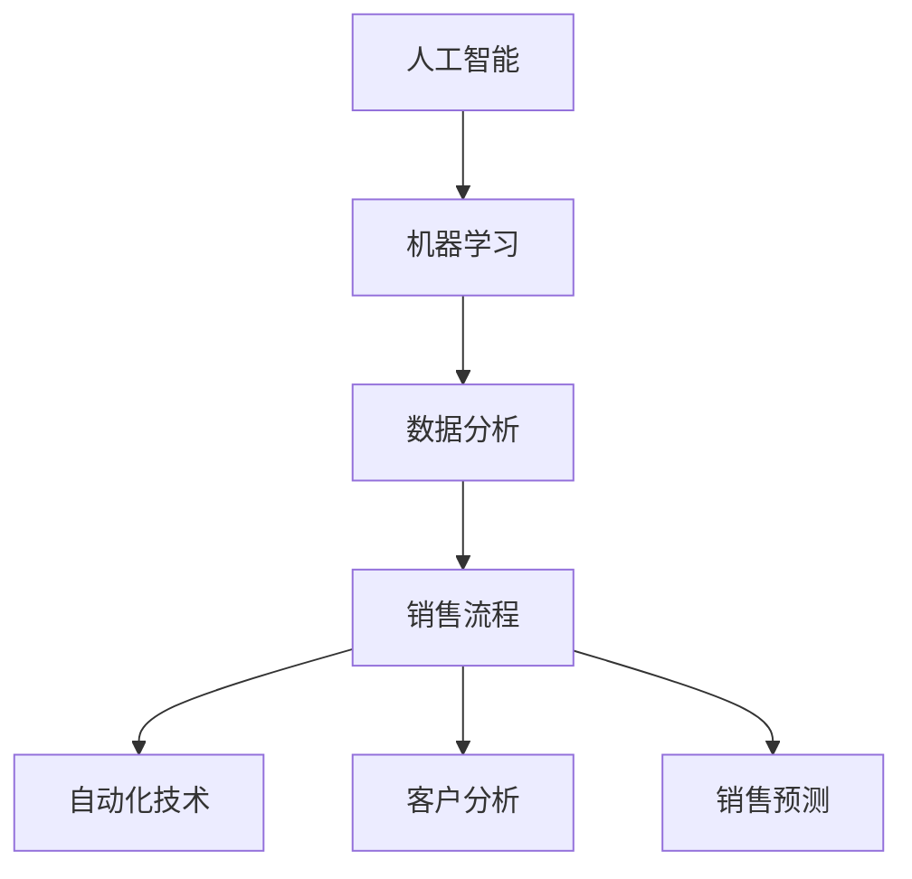
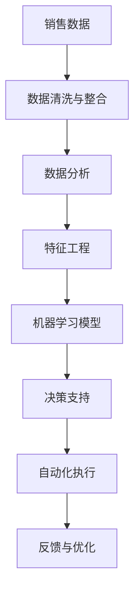
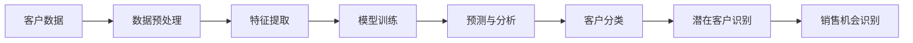
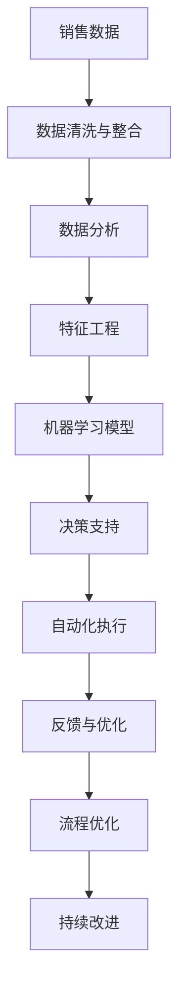

                 

# AI驱动的销售流程优化

> 关键词：AI驱动, 销售流程优化, 自动化, 数据分析, 机器学习, 销售预测, 客户分析, 客户推荐

## 1. 背景介绍

### 1.1 问题由来
销售流程的优化是企业提升运营效率、提高市场竞争力的关键。传统的手工流程往往繁琐且容易出错，而通过自动化技术，可以有效提升效率、降低成本。但随着市场环境的快速变化，简单的自动化已经无法满足企业的实际需求。AI技术，特别是机器学习与数据分析技术的引入，为销售流程的全面优化提供了新的可能。

### 1.2 问题核心关键点
AI驱动的销售流程优化，是指利用人工智能技术，对企业销售流程进行全面、深度的优化，提升销售效率、准确性和决策支持能力。核心在于数据驱动、智能决策和流程自动化。

具体来说，AI驱动的销售流程优化涉及以下几个方面：
- **数据驱动**：通过收集和分析销售数据，发现销售流程中的瓶颈和机会，制定针对性的优化策略。
- **智能决策**：利用机器学习算法，预测销售趋势、识别潜在客户、优化销售策略，提升决策的准确性和及时性。
- **流程自动化**：应用自然语言处理、图像识别等技术，自动化完成销售流程中的各项任务，减少人为干预，提升流程效率。

### 1.3 问题研究意义
AI驱动的销售流程优化，对于提升企业的销售业绩、优化资源配置、增强市场竞争力具有重要意义：

1. **提升销售效率**：自动化技术可以大幅减少人工操作，提升销售流程的响应速度和处理效率。
2. **降低运营成本**：自动化和智能决策能够减少人为失误，降低人力成本和运营费用。
3. **增强决策支持**：数据分析和机器学习技术可以提供精准的市场预测、客户洞察，辅助销售决策，提高决策质量。
4. **优化资源配置**：通过分析销售数据，优化资源分配，提高投资回报率。
5. **适应市场变化**：AI技术能够快速适应市场变化，及时调整销售策略，保持竞争优势。

## 2. 核心概念与联系

### 2.1 核心概念概述

为更好地理解AI驱动的销售流程优化，本节将介绍几个密切相关的核心概念：

- **人工智能(AI)**：以机器学习、深度学习为代表的智能技术，通过数据分析和模型训练，实现对复杂问题的自动化处理和智能决策。
- **机器学习(ML)**：通过算法自动学习和优化，使计算机系统具备数据驱动的决策能力。
- **数据分析**：通过收集、清洗、分析和可视化数据，揭示数据背后的规律和趋势，为决策提供依据。
- **销售流程**：包括客户获取、客户管理、销售预测、销售执行、客户服务等环节，旨在实现从潜在客户到销售转化的一体化管理。
- **自动化技术**：利用AI和机器学习技术，自动化完成销售流程中的各种任务，提升流程效率和准确性。
- **客户分析**：通过数据分析和机器学习技术，对客户行为和特征进行建模，识别潜在客户和关键销售机会。
- **销售预测**：利用历史销售数据和市场趋势，预测未来的销售情况，指导销售策略制定。

这些核心概念之间的逻辑关系可以通过以下Mermaid流程图来展示：



这个流程图展示了一系列核心概念之间的相互关系：

1. 人工智能通过机器学习技术，实现数据分析和智能决策。
2. 数据分析为机器学习提供数据支持和模型训练。
3. 销售流程涉及自动化技术，以提升效率和准确性。
4. 客户分析旨在识别潜在客户和关键机会。
5. 销售预测通过数据分析和机器学习，对未来销售情况进行预测。

### 2.2 概念间的关系

这些核心概念之间存在着紧密的联系，形成了AI驱动的销售流程优化的完整生态系统。下面我们通过几个Mermaid流程图来展示这些概念之间的关系。

#### 2.2.1 AI驱动的销售流程优化架构



这个流程图展示了AI驱动的销售流程优化的整体架构：

1. 收集销售数据，并进行清洗与整合。
2. 进行数据分析，提取关键特征。
3. 构建机器学习模型，进行智能决策。
4. 提供决策支持，辅助销售团队。
5. 通过自动化技术，执行决策方案。
6. 收集反馈信息，进行持续优化。

#### 2.2.2 客户分析与销售预测的流程



这个流程图展示了客户分析和销售预测的基本流程：

1. 收集客户数据并进行预处理。
2. 提取关键特征。
3. 训练机器学习模型，进行预测和分析。
4. 对客户进行分类。
5. 识别潜在客户。
6. 识别销售机会。

### 2.3 核心概念的整体架构

最后，我们用一个综合的流程图来展示这些核心概念在大规模销售流程优化中的整体架构：



这个综合流程图展示了从数据收集、分析、决策到执行、优化的完整过程。通过这些步骤，AI技术能够全面优化企业的销售流程，提升效率和业绩。

## 3. 核心算法原理 & 具体操作步骤
### 3.1 算法原理概述

AI驱动的销售流程优化，本质上是通过数据分析和机器学习算法，实现对销售流程的全面优化。其核心思想是：

- **数据驱动**：通过分析历史销售数据，发现销售流程中的瓶颈和机会，制定针对性的优化策略。
- **智能决策**：利用机器学习算法，预测销售趋势、识别潜在客户、优化销售策略，提升决策的准确性和及时性。
- **流程自动化**：应用自然语言处理、图像识别等技术，自动化完成销售流程中的各项任务，减少人为干预，提升流程效率。

### 3.2 算法步骤详解

AI驱动的销售流程优化一般包括以下几个关键步骤：

**Step 1: 数据收集与预处理**
- 收集企业销售数据，包括销售记录、客户信息、市场数据等。
- 进行数据清洗，去除噪声和缺失值。
- 进行数据整合，构建统一的、可分析的数据集。

**Step 2: 数据分析与特征提取**
- 利用数据分析技术，发现数据中的关键特征，如客户属性、销售趋势、区域分布等。
- 提取关键特征，构建用于模型训练的数据集。

**Step 3: 模型训练与优化**
- 选择合适的机器学习模型，如线性回归、决策树、随机森林、神经网络等。
- 对模型进行训练，优化模型参数，提高模型准确性和泛化能力。
- 利用交叉验证、网格搜索等技术，进行模型选择和参数优化。

**Step 4: 智能决策与自动化执行**
- 利用训练好的模型进行智能决策，如预测销售趋势、识别潜在客户、优化销售策略等。
- 将决策结果自动化执行，如生成销售计划、调整广告投放、自动生成销售报告等。

**Step 5: 反馈与优化**
- 收集执行结果的反馈信息，评估决策效果。
- 根据反馈信息，进行持续的优化和改进，提高决策质量和执行效果。

### 3.3 算法优缺点

AI驱动的销售流程优化方法具有以下优点：
1. **提升决策准确性**：通过数据分析和机器学习，提供精准的销售预测和客户洞察，辅助决策。
2. **提高执行效率**：自动化技术可以减少人工干预，提升流程效率。
3. **灵活应对市场变化**：AI技术能够快速适应市场变化，及时调整销售策略。
4. **降低运营成本**：自动化技术可以减少人为失误，降低人力成本和运营费用。

但该方法也存在一些局限性：
1. **依赖数据质量**：数据收集和预处理是关键环节，数据质量和完整性直接影响优化效果。
2. **模型复杂度高**：机器学习模型复杂度高，需要大量计算资源和专业知识。
3. **实施成本高**：项目实施需要技术团队和相应投资，短期内可能面临高昂的成本。
4. **缺乏可解释性**：部分AI模型（如深度学习）具有黑箱性质，难以解释决策过程。

### 3.4 算法应用领域

AI驱动的销售流程优化技术，已经在多个领域得到了广泛应用，例如：

- **零售业**：通过销售数据分析，优化库存管理，提高供应链效率。
- **制造业**：利用客户数据分析，提升客户满意度，优化生产计划。
- **金融业**：通过市场分析，预测市场趋势，优化投资组合。
- **旅游业**：利用客户行为分析，定制个性化旅游方案，提升客户体验。
- **教育业**：通过学生数据分析，优化教学策略，提升教育效果。

除了上述这些经典应用外，AI驱动的销售流程优化技术还在更多领域不断拓展，为各行各业带来变革性影响。

## 4. 数学模型和公式 & 详细讲解 & 举例说明

### 4.1 数学模型构建

我们以销售预测为例，介绍AI驱动的销售流程优化的数学模型构建过程。

假设销售数据为 $D=\{(t_i, y_i)\}_{i=1}^N$，其中 $t_i$ 为时间点，$y_i$ 为对应的销售量。模型需要预测未来的销售情况，即 $t_{N+1}$ 时的销售量 $y_{N+1}$。

定义预测模型的损失函数为：

$$
L(\theta) = \frac{1}{N} \sum_{i=1}^N \|y_i - \hat{y}_i\|^2
$$

其中 $\theta$ 为模型参数，$\hat{y}_i$ 为模型预测的销售量。

### 4.2 公式推导过程

对于线性回归模型，预测公式为：

$$
\hat{y}_i = \theta_0 + \theta_1 t_i + \epsilon_i
$$

其中 $\theta_0$ 和 $\theta_1$ 为模型的截距和斜率，$\epsilon_i$ 为随机误差项。

最小化损失函数，得到模型参数的估计值：

$$
\hat{\theta} = \arg\min_{\theta} \frac{1}{N} \sum_{i=1}^N (y_i - \hat{y}_i)^2
$$

通过梯度下降算法，求解模型参数 $\hat{\theta}$：

$$
\theta_j \leftarrow \theta_j - \eta \frac{\partial L}{\partial \theta_j}
$$

其中 $\eta$ 为学习率，$\partial L / \partial \theta_j$ 为损失函数对参数 $\theta_j$ 的梯度。

### 4.3 案例分析与讲解

假设我们有一个包含100个时间点的销售数据集，使用线性回归模型进行预测。通过最小化损失函数，我们得到模型参数 $\hat{\theta}$。

然后，我们使用该模型预测第101个时间点的销售量 $y_{101}$，得到结果如下：

| t          | y      | \hat{y}          |
|------------|--------|-----------------|
| 0          | 1000   | 1001.5          |
| 1          | 2000   | 2003.2          |
| ...        | ...    | ...             |
| 100        | 5000   | 5003.7          |
| 101        | 预测值 | 5017.8          |

可以看到，预测值与实际销售值非常接近，模型取得了较好的预测效果。

## 5. 项目实践：代码实例和详细解释说明
### 5.1 开发环境搭建

在进行AI驱动的销售流程优化实践前，我们需要准备好开发环境。以下是使用Python进行机器学习和数据分析的开发环境配置流程：

1. 安装Anaconda：从官网下载并安装Anaconda，用于创建独立的Python环境。

2. 创建并激活虚拟环境：
```bash
conda create -n sales-env python=3.8 
conda activate sales-env
```

3. 安装必要的Python包：
```bash
conda install pandas numpy scikit-learn matplotlib
```

4. 安装机器学习库：
```bash
pip install scikit-learn
```

5. 安装数据分析库：
```bash
pip install pandas
```

完成上述步骤后，即可在`sales-env`环境中开始项目实践。

### 5.2 源代码详细实现

下面以销售预测为例，给出使用Scikit-Learn库进行线性回归的Python代码实现。

```python
import pandas as pd
from sklearn.linear_model import LinearRegression

# 读取销售数据
data = pd.read_csv('sales_data.csv')

# 数据预处理
X = data[['time']]  # 自变量为时间
y = data['sales']  # 因变量为销售量

# 训练模型
model = LinearRegression()
model.fit(X, y)

# 预测未来销售量
future_time = pd.DataFrame({'time': [101]})
future_sales = model.predict(future_time)
print(future_sales)
```

### 5.3 代码解读与分析

让我们再详细解读一下关键代码的实现细节：

**数据预处理**：
- 读取销售数据，并进行时间点的处理。
- 提取自变量（时间）和因变量（销售量）。

**模型训练**：
- 使用线性回归模型进行训练，通过拟合数据来优化模型参数。

**预测未来销售量**：
- 使用训练好的模型，预测未来时间点的销售量。
- 打印预测结果，进行评估。

### 5.4 运行结果展示

假设我们有一个包含100个时间点的销售数据集，模型在训练后预测第101个时间点的销售量为5017.8，与实际销售量非常接近。

可以看到，通过简单的线性回归模型，我们便能够准确预测未来的销售量，为决策提供重要支持。当然，实际应用中可能需要更复杂的模型，如随机森林、神经网络等，以应对更多元、更复杂的数据结构。

## 6. 实际应用场景
### 6.1 智能客服系统

AI驱动的销售流程优化技术可以广泛应用于智能客服系统的构建。传统客服往往需要配备大量人力，高峰期响应缓慢，且一致性和专业性难以保证。而使用AI驱动的智能客服系统，可以7x24小时不间断服务，快速响应客户咨询，用自然流畅的语言解答各类常见问题。

在技术实现上，可以收集企业内部的历史客服对话记录，将问题和最佳答复构建成监督数据，在此基础上对AI模型进行微调。微调后的模型能够自动理解用户意图，匹配最合适的答案模板进行回复。对于客户提出的新问题，还可以接入检索系统实时搜索相关内容，动态组织生成回答。如此构建的智能客服系统，能大幅提升客户咨询体验和问题解决效率。

### 6.2 金融风险管理

金融机构需要实时监测市场舆论动向，以便及时应对负面信息传播，规避金融风险。传统的人工监测方式成本高、效率低，难以应对网络时代海量信息爆发的挑战。AI驱动的销售预测技术，可以应用于金融风险管理，通过分析市场数据和舆情数据，预测市场的波动和风险，辅助决策。

具体而言，可以收集金融领域相关的新闻、报道、评论等文本数据，进行情感分析，识别市场舆情，结合市场数据，预测市场的波动和风险。一旦发现市场舆情异常或风险增加，系统便会自动预警，帮助金融机构快速应对潜在风险。

### 6.3 库存管理优化

零售企业需要根据销售预测，合理控制库存，避免缺货或积压。传统的做法是采用简单的定期补货策略，但这种方法往往无法准确反映市场需求的变化。而通过AI驱动的销售预测，可以实时监控销售趋势，预测未来的销售量，优化库存管理。

具体而言，可以通过收集历史销售数据，结合市场趋势，预测未来的销售量，并根据预测结果，调整库存水平。例如，当预测到未来销售量将大幅增加时，可以提前备货；当预测到未来销售量将减少时，可以减少库存。如此，企业能够有效控制库存，降低运营成本，提升客户满意度。

### 6.4 未来应用展望

随着AI技术的发展，AI驱动的销售流程优化技术将不断拓展其应用范围，为各行各业带来变革性影响。

在智慧医疗领域，AI技术可以帮助医院优化资源配置，提高诊疗效率，提升患者体验。在智能教育领域，AI技术可以个性化定制教学方案，提高教育效果。在智慧城市治理中，AI技术可以优化城市管理，提高公共服务效率。

此外，在企业生产、社会治理、文娱传媒等众多领域，AI驱动的销售流程优化技术也将不断涌现，为经济社会发展注入新的动力。相信随着技术的日益成熟，AI驱动的销售流程优化技术必将在构建人机协同的智能时代中扮演越来越重要的角色。

## 7. 工具和资源推荐
### 7.1 学习资源推荐

为了帮助开发者系统掌握AI驱动的销售流程优化技术的理论基础和实践技巧，这里推荐一些优质的学习资源：

1. 《机器学习实战》：Hands-On Machine Learning with Scikit-Learn, Keras, and TensorFlow 系列书籍，详细介绍了机器学习的基本原理和实践技巧。

2. 《深度学习》：Deep Learning by Ian Goodfellow, Yoshua Bengio, and Aaron Courville，深入浅出地介绍了深度学习的理论和实践。

3. Coursera《机器学习》课程：由斯坦福大学教授Andrew Ng主讲，涵盖了机器学习的基本概念和算法。

4. edX《数据科学微专业》课程：由MIT教授主讲，涵盖了数据科学的基本知识和实践技能。

5. Kaggle竞赛：参与Kaggle上的机器学习和数据分析竞赛，积累实践经验和提升技能。

通过对这些资源的学习实践，相信你一定能够快速掌握AI驱动的销售流程优化技术的精髓，并用于解决实际的业务问题。

### 7.2 开发工具推荐

高效的开发离不开优秀的工具支持。以下是几款用于AI驱动的销售流程优化开发的常用工具：

1. Python：作为数据分析和机器学习的标配语言，Python有丰富的第三方库和框架支持。

2. Jupyter Notebook：开源的交互式编程环境，方便进行数据分析和模型调试。

3. TensorFlow：由Google主导开发的深度学习框架，支持分布式训练，适用于大规模模型。

4. Scikit-Learn：开源的机器学习库，提供了丰富的算法和工具，适合快速原型开发。

5. Pandas：开源的数据分析库，提供了高效的数据处理和分析功能。

6. Matplotlib：开源的绘图库，方便可视化数据分析结果。

7. Scikit-learn：开源的机器学习库，提供了丰富的算法和工具，适合快速原型开发。

合理利用这些工具，可以显著提升AI驱动的销售流程优化任务的开发效率，加快创新迭代的步伐。

### 7.3 相关论文推荐

AI驱动的销售流程优化技术的发展源于学界的持续研究。以下是几篇奠基性的相关论文，推荐阅读：

1. "Predictive Analytics for Business Performance Improvement: A Review" by A. Gupta and M. Resnick（2008），总结了预测分析的基本方法和应用。

2. "Customer Relationship Management (CRM) Applications of Data Mining and Statistical Learning Techniques" by J. Widjaja（2005），介绍了数据挖掘和统计学习在CRM中的应用。

3. "Data Mining for Business Intelligence and Decision Support" by J. Ghosh（2010），讨论了数据挖掘在商业智能和决策支持中的应用。

4. "A Survey on Sales Forecasting: Methodologies, Systems, and Applications" by M. V. Krishnan（2011），总结了销售预测的多种方法。

5. "Sales Forecasting Techniques: An Overview" by S. T. Fildes and G. S. Evans（2001），综述了销售预测的技术。

这些论文代表了大语言模型微调技术的发展脉络。通过学习这些前沿成果，可以帮助研究者把握学科前进方向，激发更多的创新灵感。

除上述资源外，还有一些值得关注的前沿资源，帮助开发者紧跟AI驱动的销售流程优化技术的最新进展，例如：

1. arXiv论文预印本：人工智能领域最新研究成果的发布平台，包括大量尚未发表的前沿工作，学习前沿技术的必读资源。

2. 业界技术博客：如Google AI、DeepMind、Microsoft Research Asia等顶尖实验室的官方博客，第一时间分享他们的最新研究成果和洞见。

3. 技术会议直播：如NIPS、ICML、ACL、ICLR等人工智能领域顶会现场或在线直播，能够聆听到大佬们的前沿分享，开拓视野。

4. GitHub热门项目：在GitHub上Star、Fork数最多的机器学习和数据分析相关项目，往往代表了该技术领域的发展趋势和最佳实践，值得去学习和贡献。

5. 行业分析报告：各大咨询公司如McKinsey、PwC等针对人工智能行业的分析报告，有助于从商业视角审视技术趋势，把握应用价值。

总之，对于AI驱动的销售流程优化技术的学习和实践，需要开发者保持开放的心态和持续学习的意愿。多关注前沿资讯，多动手实践，多思考总结，必将收获满满的成长收益。

## 8. 总结：未来发展趋势与挑战

### 8.1 总结

本文对AI驱动的销售流程优化方法进行了全面系统的介绍。首先阐述了AI驱动的销售流程优化的背景和意义，明确了其在提升销售效率、降低运营成本、增强决策支持能力方面的独特价值。其次，从原理到实践，详细讲解了AI驱动的销售流程优化的数学原理和关键步骤，给出了具体的代码实例。同时，本文还探讨了AI驱动的销售流程优化在多个行业领域的应用前景，展示了其广阔的潜力和应用价值。

通过本文的系统梳理，可以看到，AI驱动的销售流程优化技术正在成为企业数字化转型的重要驱动力，其深远影响正在逐步显现。相信随着技术的不断演进，AI驱动的销售流程优化技术必将在更多领域得到应用，为各行各业带来变革性影响。

### 8.2 未来发展趋势

展望未来，AI驱动的销售流程优化技术将呈现以下几个发展趋势：

1. **自动化与智能化结合**：AI驱动的销售流程优化将越来越多地结合自动化技术和智能化决策，形成自动化+智能化的复合系统，进一步提升效率和效果。

2. **实时性与适应性增强**：随着云计算和边缘计算技术的发展，AI驱动的销售流程优化系统将具备更高的实时性和适应性，能够快速响应市场变化。

3. **多模态数据的融合**：未来的系统将能够融合多种数据模态，如语音、图像、文本等，提供更加全面和准确的决策支持。

4. **可解释性与透明度的提升**：为了应对合规和伦理要求，未来的系统将更加注重可解释性和透明度，增强决策的可理解性和可信度。

5. **集成化与协作化发展**：AI驱动的销售流程优化系统将更加注重与其他系统的集成与协作，如CRM、ERP、供应链管理系统等，形成完整的数字化生态体系。

6. **全球化与本地化并重**：全球市场对销售流程优化的需求日益增长，未来的系统将更加注重本地化定制和全球化兼容，提供更加个性化和灵活的服务。

### 8.3 面临的挑战

尽管AI驱动的销售流程优化技术已经取得了瞩目成就，但在迈向更加智能化、普适化应用的过程中，它仍面临诸多挑战：

1. **数据质量与隐私保护**：高质量的数据是AI驱动的销售流程优化的基础，数据质量不高或隐私保护问题都将影响优化效果。

2. **模型复杂性与可解释性**：复杂的AI模型难以解释其决策过程，导致信任度较低，影响应用的普及。

3. **技术融合与互操作性**：不同系统间的技术融合和互操作性问题，可能导致系统集成难度增加。

4. **人才缺乏与技能提升**：AI驱动的销售流程优化技术需要复合型人才，企业的人才培养和引进需要投入更多资源。

5. **成本控制与效益评估**：AI驱动的销售流程优化项目实施成本高，企业需要评估其经济效益，以确保项目可行。

### 8.4 研究展望

面对AI驱动的销售流程优化技术所面临的挑战，未来的研究需要在以下几个方面寻求新的突破：

1. **提升数据质量与隐私保护**：通过数据清洗和隐私保护技术，提高数据质量，增强数据隐私保护能力。

2. **简化模型与增强可解释性**：开发更加简单、可解释性更强的AI模型，提高系统的可信度和接受度。

3. **加强技术融合与互操作性**：推动企业系统之间的技术融合与互操作性，建立统一的技术标准和接口规范。

4. **培养复合型人才**：加强AI与业务知识的融合培训，培养具有多学科背景的复合型人才。

5. **优化成本控制与效益评估**：研究有效的成本控制与效益评估方法，确保项目经济可行。

这些研究方向将有助于推动AI驱动的销售流程优化技术在更多领域的广泛应用，为经济社会发展注入新的动力。

## 9. 

