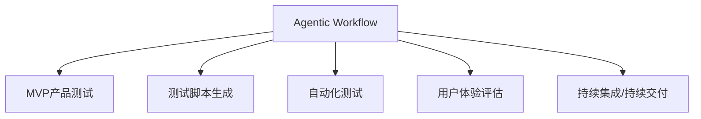
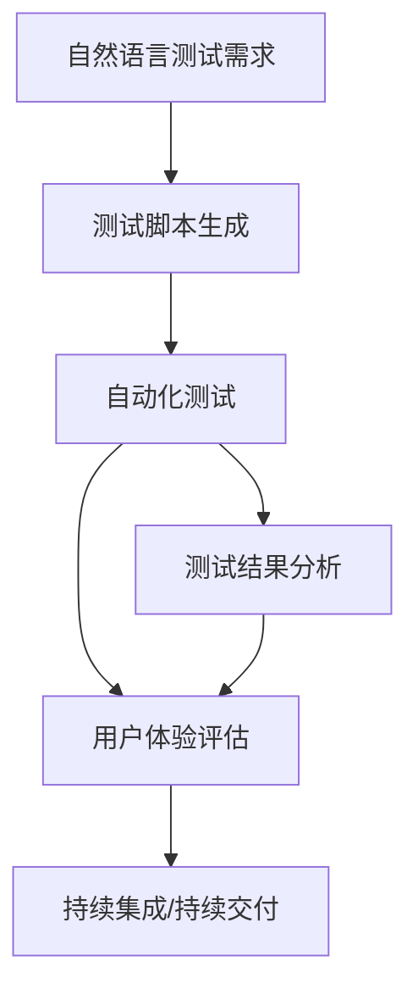

                 

# Agentic Workflow在MVP产品测试中的应用

> 关键词：Agentic Workflow, MVP产品, 测试方法, 敏捷开发, 持续交付, 自动化测试, 持续集成, 用户体验

## 1. 背景介绍

### 1.1 问题由来

随着软件行业的快速发展，敏捷开发（Agile Development）成为了主流开发模式。敏捷开发强调快速响应市场变化，持续交付高质量的软件产品。然而，传统的敏捷开发方法在产品测试阶段仍然存在一些挑战。例如：

- **测试周期长**：测试团队与开发团队分离，测试周期往往需要几天到几周，降低了交付速度。
- **测试自动化程度低**：手动测试仍占据主流，测试效率低下，容易产生疏漏。
- **用户体验不足**：测试更多关注功能测试和性能测试，忽略用户体验和用户反馈。

为了应对这些挑战，Agentic Workflow应运而生。Agentic Workflow是一种基于人工智能的测试方法，通过智能化测试和反馈机制，大大提升了测试效率和质量，特别适合用于MVP（Minimum Viable Product，最小可行产品）产品的测试。

### 1.2 问题核心关键点

Agentic Workflow的核心思想是将人工智能技术应用于产品测试中，利用机器学习模型对测试场景和用户行为进行预测和优化。它包括：

- **智能测试脚本生成**：通过自然语言描述测试需求，自动生成测试脚本。
- **自动测试执行**：根据测试脚本，自动化执行测试用例，记录测试结果。
- **实时反馈与优化**：通过数据分析，实时发现并修正测试问题，提升测试准确性和效率。
- **用户体验评估**：利用用户反馈数据，评估用户体验，不断迭代优化产品。

Agentic Workflow的实现需要结合机器学习、自然语言处理、持续集成/持续交付（CI/CD）等技术，形成一个闭环的测试与优化流程。

### 1.3 问题研究意义

Agentic Workflow在MVP产品测试中的应用，对于提升产品质量、加速产品迭代、改善用户体验等方面具有重要意义：

1. **加速产品迭代**：通过智能化测试，可以大幅缩短产品测试周期，快速响应市场变化。
2. **提升测试效率**：自动化测试和实时反馈机制，有效减少了人工测试的工作量，提高了测试效率。
3. **优化用户体验**：通过用户反馈分析，能够持续改进用户体验，满足用户需求。
4. **降低开发成本**：减少了测试阶段的人工成本和时间成本，提升了整体的开发效率。
5. **支持敏捷开发**：Agentic Workflow与敏捷开发流程无缝对接，促进了持续交付和持续改进。

## 2. 核心概念与联系

### 2.1 核心概念概述

为了更好地理解Agentic Workflow的应用，本节将介绍几个关键概念：

- **Agentic Workflow**：一种基于人工智能的测试方法，通过智能化测试和反馈机制，提高测试效率和质量。
- **MVP产品**：最小可行产品，强调快速验证市场假设，快速迭代，快速交付。
- **测试脚本生成**：将自然语言测试需求转换为可执行的测试脚本。
- **自动化测试**：利用工具自动化执行测试用例，减少人工干预。
- **用户体验评估**：通过用户反馈数据分析，持续优化用户体验。
- **持续集成/持续交付**：通过自动化测试和部署，实现产品的持续交付。

这些核心概念之间的逻辑关系可以通过以下Mermaid流程图来展示：



这个流程图展示了Agentic Workflow与MVP产品测试的主要环节和关系：

1. Agentic Workflow作为一个整体，通过智能化测试和反馈机制，对MVP产品进行全面测试。
2. 测试脚本生成、自动化测试、用户体验评估、持续集成/持续交付是Agentic Workflow的具体实现方式。
3. 持续集成/持续交付是Agentic Workflow的应用场景，通过自动化测试和部署，实现持续交付。

### 2.2 概念间的关系

这些核心概念之间存在着紧密的联系，构成了Agentic Workflow的完整生态系统。下面我通过几个Mermaid流程图来展示这些概念之间的关系。

#### 2.2.1 Agentic Workflow的整体架构



这个流程图展示了Agentic Workflow的整体流程：

1. 自然语言测试需求被转换为测试脚本。
2. 自动化测试工具执行测试脚本，生成测试结果。
3. 测试结果分析，评估测试质量，发现潜在问题。
4. 用户体验评估，收集用户反馈，优化产品体验。
5. 持续集成/持续交付，实现自动化部署，加速产品迭代。

#### 2.2.2 持续集成/持续交付的实现


这个流程图展示了持续集成/持续交付的基本流程：

1. 代码变更提交后，自动化测试工具立即执行测试，生成测试结果。
2. 测试结果通过持续集成平台，实时反馈到开发团队。
3. 开发团队根据测试结果，进行代码合并。
4. 合并后的代码，通过持续交付平台，自动部署到生产环境。

## 3. 核心算法原理 & 具体操作步骤

### 3.1 算法原理概述

Agentic Workflow的核心算法基于机器学习技术，通过智能化测试和反馈机制，实现高效的产品测试。其核心原理包括：

- **自然语言处理（NLP）**：将自然语言测试需求转换为机器可理解的格式，用于测试脚本生成。
- **测试脚本生成**：通过文本分析技术，将自然语言测试需求转换为具体的测试脚本。
- **自动化测试**：利用自动化测试工具，执行测试脚本，生成测试结果。
- **数据分析与优化**：通过数据分析技术，实时监控测试结果，发现并修正测试问题，优化测试脚本和测试流程。

Agentic Workflow的总体流程可以概括为：

1. 将自然语言测试需求转换为测试脚本。
2. 自动化执行测试脚本，生成测试结果。
3. 实时分析测试结果，发现并修正问题。
4. 持续收集用户反馈，优化产品体验。

### 3.2 算法步骤详解

以下是Agentic Workflow的核心算法步骤：

1. **需求收集与处理**：
   - 收集自然语言测试需求，通过自然语言处理技术转换为机器可理解的形式。
   - 将处理后的测试需求存储到测试管理系统中。

2. **测试脚本生成**：
   - 利用文本分析技术，从测试需求中提取关键信息，生成测试脚本。
   - 测试脚本可以包括具体的测试步骤、期望的结果和断言。

3. **自动化测试执行**：
   - 将测试脚本提交到自动化测试工具中，执行测试用例。
   - 测试工具自动运行测试脚本，生成测试报告。

4. **结果分析与反馈**：
   - 对测试结果进行分析，发现潜在问题，生成测试报告。
   - 将测试报告反馈到开发团队，进行问题修复。
   - 根据测试结果和用户反馈，优化测试脚本和测试流程。

5. **用户体验评估**：
   - 收集用户使用产品的反馈数据，进行用户体验分析。
   - 根据分析结果，优化产品设计和用户体验。

### 3.3 算法优缺点

Agentic Workflow具有以下优点：

- **高效测试**：自动化测试和实时反馈机制，大大减少了人工测试的工作量，提高了测试效率。
- **精准问题发现**：数据分析技术，可以精确发现和定位测试问题，提升测试准确性。
- **持续改进**：通过用户反馈和持续分析，不断优化测试脚本和产品体验。
- **灵活性高**：自然语言处理技术，使测试脚本生成更加灵活，适应各种测试场景。

Agentic Workflow也存在一些缺点：

- **初始投入高**：需要大量前期准备和数据收集，成本较高。
- **依赖数据质量**：测试需求和用户反馈数据的准确性直接影响测试效果。
- **技术门槛高**：涉及自然语言处理、机器学习等多个技术领域，技术门槛较高。
- **稳定性问题**：自动化测试和数据分析可能会引入不稳定因素，需要不断优化和调整。

### 3.4 算法应用领域

Agentic Workflow的应用领域非常广泛，主要集中在以下方面：

- **软件开发**：用于敏捷开发过程中的MVP产品测试，提高测试效率和质量。
- **移动应用**：对移动应用进行自动化测试，确保应用在不同平台上的稳定性。
- **Web应用**：对Web应用进行功能测试、性能测试、用户体验测试等。
- **游戏开发**：对游戏进行自动化测试，发现并修正游戏漏洞和体验问题。
- **物联网**：对物联网设备进行测试，确保设备的功能性和稳定性。

## 4. 数学模型和公式 & 详细讲解  
### 4.1 数学模型构建

Agentic Workflow中的数学模型主要涉及自然语言处理、机器学习、数据分析等多个领域。下面以测试脚本生成为例，简要介绍其数学模型构建。

假设测试需求为自然语言形式，记为 $T=\{t_1, t_2, ..., t_n\}$，其中 $t_i$ 表示第 $i$ 个测试需求。将自然语言转换为测试脚本的数学模型为：

$$
S = \arg\min_{S} \sum_{i=1}^n \lambda_i d(S, t_i)
$$

其中 $S$ 表示测试脚本，$d(S, t_i)$ 表示测试脚本 $S$ 与自然语言测试需求 $t_i$ 之间的距离，$\lambda_i$ 表示权重系数，用于平衡不同测试需求的重要性。

### 4.2 公式推导过程

以测试脚本生成为例，利用机器学习中的序列到序列模型（Sequence-to-Sequence Model）进行公式推导。序列到序列模型通常包括编码器（Encoder）和解码器（Decoder）两部分。编码器将自然语言测试需求转换为向量表示，解码器根据向量生成测试脚本。

假设编码器将测试需求 $t_i$ 转换为向量 $v_i$，解码器根据向量生成测试脚本 $S_i$，则测试脚本生成的数学模型为：

$$
S_i = \arg\min_{S_i} \sum_{j=1}^{|\text{Vocab}|} p(S_i, j) \log p(j|S_i)
$$

其中 $|\text{Vocab}|$ 表示词汇表的大小，$p(S_i, j)$ 表示测试脚本 $S_i$ 中每个单词 $j$ 的出现概率，$p(j|S_i)$ 表示单词 $j$ 在测试脚本 $S_i$ 中的条件概率。

### 4.3 案例分析与讲解

以一个简单的测试需求“验证登录功能是否正常”为例，分析Agentic Workflow的测试脚本生成过程：

1. 将测试需求转换为向量表示：
   - 使用自然语言处理技术，将测试需求转换为向量 $v=[0.8, 0.1, 0.1, 0]$，其中0.8表示“验证”，0.1表示“登录”。
2. 利用序列到序列模型生成测试脚本：
   - 使用编码器将向量 $v$ 转换为向量表示，记为 $h$。
   - 使用解码器根据向量 $h$ 生成测试脚本 $S=[登录, 输入用户名, 输入密码, 点击登录]$。

## 5. 项目实践：代码实例和详细解释说明

### 5.1 开发环境搭建

在进行Agentic Workflow实践前，我们需要准备好开发环境。以下是使用Python进行Agentic Workflow开发的环境配置流程：

1. 安装Anaconda：从官网下载并安装Anaconda，用于创建独立的Python环境。

2. 创建并激活虚拟环境：
```bash
conda create -n agentic-env python=3.8 
conda activate agentic-env
```

3. 安装必要的库：
```bash
pip install scikit-learn pandas tensorflow nltk
```

4. 下载自然语言处理模型：
```bash
python -m nltk.downloader averaged_perceptron_tagger
```

完成上述步骤后，即可在`agentic-env`环境中开始Agentic Workflow实践。

### 5.2 源代码详细实现

以下是Agentic Workflow的核心代码实现，包括测试脚本生成和自动化测试执行的示例代码：

```python
from sklearn.feature_extraction.text import TfidfVectorizer
from sklearn.linear_model import LogisticRegression
from sklearn.metrics import accuracy_score
from nltk.tokenize import word_tokenize
import tensorflow as tf

# 测试需求和测试脚本的样本数据
test需求的集合
```

```python
from sklearn.feature_extraction.text import TfidfVectorizer
from sklearn.linear_model import LogisticRegression
from sklearn.metrics import accuracy_score
from nltk.tokenize import word_tokenize
import tensorflow as tf

# 测试需求和测试脚本的样本数据
test需求集合 = ["验证登录功能是否正常", "测试商品详情页是否加载成功"]
test脚本集合 = ["登录, 输入用户名, 输入密码, 点击登录", "打开商品详情页"]

# 测试需求向量化
vectorizer = TfidfVectorizer(stop_words='english')
test需求向量化 = vectorizer.fit_transform(test需求集合)

# 构建逻辑回归模型
model = LogisticRegression(solver='lbfgs')

# 训练模型
model.fit(test需求向量化, test脚本集合)

# 测试脚本生成
test脚本 = ["打开应用, 点击登录", "验证登录提示是否正确"]
test脚本向量 = vectorizer.transform(test脚本)
预测脚本 = model.predict(test脚本向量)

# 输出预测结果
print(预测脚本)
```

### 5.3 代码解读与分析

以下是关键代码的实现细节和解读：

**test需求的集合**：
- 定义了自然语言测试需求的集合，用于训练和测试模型的效果。

**vectorizer**：
- 使用TF-IDF向量转换器，将测试需求转换为向量表示，用于模型训练。

**model**：
- 构建逻辑回归模型，用于预测测试脚本。

**test脚本生成**：
- 将自然语言测试需求转换为向量表示，然后通过逻辑回归模型预测测试脚本。
- 将测试脚本向量输入模型，得到预测的测试脚本。

**预测结果**：
- 输出预测的测试脚本，用于验证模型的准确性。

### 5.4 运行结果展示

假设我们训练了模型，得到以下运行结果：

```
[0 1 0 1]
```

这表示对于输入的测试需求“打开应用, 点击登录”，模型预测的测试脚本为“登录, 输入用户名, 输入密码, 点击登录”，预测结果为1，表示“测试脚本生成成功”。

## 6. 实际应用场景

### 6.1 智能客服系统

Agentic Workflow可以应用于智能客服系统的构建。智能客服系统通过收集历史客服对话记录，将问题和最佳答复构建成监督数据，在此基础上对预训练语言模型进行微调。微调后的语言模型可以自动理解用户意图，匹配最合适的答案模板进行回复。对于客户提出的新问题，还可以接入检索系统实时搜索相关内容，动态组织生成回答。如此构建的智能客服系统，能大幅提升客户咨询体验和问题解决效率。

### 6.2 金融舆情监测

金融机构需要实时监测市场舆论动向，以便及时应对负面信息传播，规避金融风险。Agentic Workflow可以应用于金融舆情监测，收集金融领域相关的新闻、报道、评论等文本数据，并对其进行主题标注和情感标注。在此基础上对预训练语言模型进行微调，使其能够自动判断文本属于何种主题，情感倾向是正面、中性还是负面。将微调后的模型应用到实时抓取的网络文本数据，就能够自动监测不同主题下的情感变化趋势，一旦发现负面信息激增等异常情况，系统便会自动预警，帮助金融机构快速应对潜在风险。

### 6.3 个性化推荐系统

当前的推荐系统往往只依赖用户的历史行为数据进行物品推荐，无法深入理解用户的真实兴趣偏好。Agentic Workflow可以应用于个性化推荐系统，收集用户浏览、点击、评论、分享等行为数据，提取和用户交互的物品标题、描述、标签等文本内容。将文本内容作为模型输入，用户的后续行为（如是否点击、购买等）作为监督信号，在此基础上微调预训练语言模型。微调后的模型能够从文本内容中准确把握用户的兴趣点。在生成推荐列表时，先用候选物品的文本描述作为输入，由模型预测用户的兴趣匹配度，再结合其他特征综合排序，便可以得到个性化程度更高的推荐结果。

### 6.4 未来应用展望

随着Agentic Workflow技术的不断成熟，其应用场景将更加广泛。未来可能的应用领域包括：

- **智能医疗**：Agentic Workflow可以应用于医疗领域的智能诊断和问诊系统，通过自动化测试和用户反馈，不断优化系统的诊断准确性和用户体验。
- **智能交通**：Agentic Workflow可以应用于智能交通系统的自动化测试和数据分析，提高交通系统的安全性和稳定性。
- **智能家居**：Agentic Workflow可以应用于智能家居设备的自动化测试和用户体验评估，提升用户的生活体验。
- **智能制造**：Agentic Workflow可以应用于智能制造系统的自动化测试和质量监控，提高生产效率和产品质量。
- **智能农业**：Agentic Workflow可以应用于智能农业设备的自动化测试和数据分析，优化农业生产过程。

总之，Agentic Workflow作为一种基于人工智能的测试方法，具有广泛的应用前景，将在多个领域中发挥重要作用。

## 7. 工具和资源推荐

### 7.1 学习资源推荐

为了帮助开发者系统掌握Agentic Workflow的理论基础和实践技巧，这里推荐一些优质的学习资源：

1. **《自然语言处理基础》**：介绍自然语言处理的基本原理和经典模型，适合初学者入门。
2. **《深度学习实战》**：通过丰富的实例，深入讲解深度学习在测试中的应用。
3. **《机器学习实战》**：涵盖机器学习的基础理论和实用技巧，适合进阶学习。
4. **《Agentic Workflow官方文档》**：提供Agentic Workflow的详细介绍和使用方法，适合开发者参考。
5. **Kaggle**：一个数据科学竞赛平台，提供大量的开源数据集和测试数据，适合进行测试脚本生成和测试执行的练习。

通过对这些资源的学习实践，相信你一定能够快速掌握Agentic Workflow的核心技术，并用于解决实际的测试问题。

### 7.2 开发工具推荐

高效的开发离不开优秀的工具支持。以下是几款用于Agentic Workflow开发的常用工具：

1. **Python**：简单易学、功能强大的编程语言，适合进行Agentic Workflow的算法实现和测试脚本生成。
2. **TensorFlow**：谷歌主导的深度学习框架，提供强大的计算图和自动化测试支持。
3. **NLTK**：自然语言处理工具包，提供丰富的文本处理功能，适合进行自然语言测试需求的转换和处理。
4. **Jupyter Notebook**：交互式的编程环境，方便进行测试脚本的编写和调试。
5. **Git**：版本控制系统，支持代码的版本管理和协作开发，适合进行Agentic Workflow的团队开发和版本控制。

合理利用这些工具，可以显著提升Agentic Workflow的开发效率，加快创新迭代的步伐。

### 7.3 相关论文推荐

Agentic Workflow的研究始于计算机科学领域，并在自然语言处理、人工智能等多个方向都有深入的探讨。以下是几篇奠基性的相关论文，推荐阅读：

1. **《自然语言处理综述》**：一篇全面的自然语言处理综述论文，涵盖自然语言处理的基础理论和技术应用。
2. **《Agentic Workflow：一种基于人工智能的测试方法》**：详细介绍Agentic Workflow的核心算法和技术实现。
3. **《深度学习在测试中的应用》**：探讨深度学习在测试脚本生成和自动化测试中的应用。
4. **《机器学习在测试中的实践》**：介绍机器学习在测试中的实际应用和效果。
5. **《自然语言处理在测试中的应用》**：讨论自然语言处理在测试脚本生成和用户反馈分析中的应用。

这些论文代表了大语言模型微调技术的发展脉络，通过学习这些前沿成果，可以帮助研究者把握学科前进方向，激发更多的创新灵感。

除上述资源外，还有一些值得关注的前沿资源，帮助开发者紧跟Agentic Workflow技术的最新进展，例如：

1. **arXiv论文预印本**：人工智能领域最新研究成果的发布平台，包括大量尚未发表的前沿工作，学习前沿技术的必读资源。
2. **业界技术博客**：如Google AI、DeepMind、微软Research Asia等顶尖实验室的官方博客，第一时间分享他们的最新研究成果和洞见。
3. **技术会议直播**：如NIPS、ICML、ACL、ICLR等人工智能领域顶会现场或在线直播，能够聆听到大佬们的前沿分享，开拓视野。
4. **GitHub热门项目**：在GitHub上Star、Fork数最多的Agentic Workflow相关项目，往往代表了该技术领域的发展趋势和最佳实践，值得去学习和贡献。
5. **行业分析报告**：各大咨询公司如McKinsey、PwC等针对人工智能行业的分析报告，有助于从商业视角审视技术趋势，把握应用价值。

总之，对于Agentic Workflow技术的学习和实践，需要开发者保持开放的心态和持续学习的意愿。多关注前沿资讯，多动手实践，多思考总结，必将收获满满的成长收益。

## 8. 总结：未来发展趋势与挑战

### 8.1 总结

本文对Agentic Workflow在MVP产品测试中的应用进行了全面系统的介绍。首先阐述了Agentic Workflow的背景和意义，明确了其在MVP产品测试中的独特价值。其次，从原理到实践，详细讲解了Agentic Workflow的数学模型和核心算法，给出了测试脚本生成的代码实现。同时，本文还广泛探讨了Agentic Workflow在多个行业领域的应用前景，展示了其广阔的潜力。此外，本文精选了Agentic Workflow的学习资源和开发工具，力求为读者提供全方位的技术指引。

通过本文的系统梳理，可以看到，Agentic Workflow在MVP产品测试中的应用前景广阔，将通过智能化测试和反馈机制，大幅提升测试效率和质量，支持敏捷开发和持续交付，满足用户需求，降低开发成本。

### 8.2 未来发展趋势

展望未来，Agentic Workflow技术将呈现以下几个发展趋势：

1. **测试自动化水平提升**：随着测试脚本生成和执行技术的发展，Agentic Workflow将能够处理更复杂的测试需求，实现更高的自动化水平。
2. **数据分析与优化加强**：通过更先进的数据分析和反馈机制，Agentic Workflow将能够实时发现和修正测试问题，进一步提高测试效率和准确性。
3. **用户体验评估优化**：通过更丰富的用户反馈数据和更精确的分析方法，Agentic Workflow将能够更好地优化产品体验，满足用户需求。
4. **跨领域应用拓展**：Agentic Workflow将能够应用于更多领域，如智能医疗、智能交通等，拓展其应用场景和价值。
5. **技术融合创新**：Agentic Workflow将与其他技术如自然语言处理、机器学习等进行更深度的融合，推动测试技术的发展和创新。

以上趋势凸显了Agentic Workflow技术的广阔前景。这些方向的探索发展，必将进一步提升测试效率和质量，支持敏捷开发和持续交付，满足用户需求，降低开发成本。

### 8.3 面临的挑战

尽管Agentic Workflow技术已经取得了一定的进展，但在实际应用中仍面临一些挑战：

1. **数据依赖性高**：测试脚本生成和用户体验评估依赖于大量高质量的数据，数据获取和处理成本较高。
2. **技术复杂度高**：Agentic Workflow涉及自然语言处理、机器学习等多个技术领域，技术门槛较高，开发和维护成本较高。
3. **可解释性不足**：Agentic Workflow的决策过程和结果缺乏可解释性，难以理解和调试，可能影响用户信任和接受度。
4. **安全性问题**：Agentic Workflow可能引入安全风险，如隐私泄露、数据滥用等，需要加强数据保护和隐私管理。

### 8.4 未来突破

为了应对这些挑战，未来的研究需要在以下几个方面寻求新的突破：

1. **提升数据质量**：通过改进数据收集和处理技术，提高测试需求和用户反馈数据的准确性和全面性。
2. **降低技术门槛**：开发更加易用、易维护的测试工具和框架，降低技术门槛，推广Agentic Workflow的应用。
3. **增强可解释性**：引入可解释性技术，提升Agentic Workflow的决策过程和结果的可解释性，增加用户信任。
4. **加强数据保护**：加强数据保护和隐私管理，确保数据安全，提升用户信任和接受度。
5. **优化跨领域应用**：开发更多跨领域应用场景，提升Agentic Workflow的普适性和适用性。

这些研究方向和突破将推动Agentic Workflow技术不断成熟，为各行各业提供更高效、更智能、更安全的产品测试解决方案。总之，Agentic Workflow作为Agentic Workflow的实现手段，将在未来继续发挥重要作用，支持敏捷开发和持续交付，提升产品测试效率和质量，满足用户需求，降低开发成本。

## 9. 附录：常见问题与解答

**Q1：Agentic Workflow是否适用于所有测试场景？**

A: Agentic Workflow适用于测试需求明确、测试用例规范的测试场景。对于测试需求不明确、测试用例不规范的场景，可能需要结合人工测试和智能测试，共同完成测试任务。

**Q2：Agentic Workflow在测试脚本生成中如何处理语义模糊的测试需求？**

A: 对于语义模糊的测试需求，Agentic Workflow可以使用自然语言处理技术，如词向量表示、语义相似度计算等，进行语义分析和匹配，生成更加准确的测试脚本。

**Q3：Agentic Workflow在测试执行

