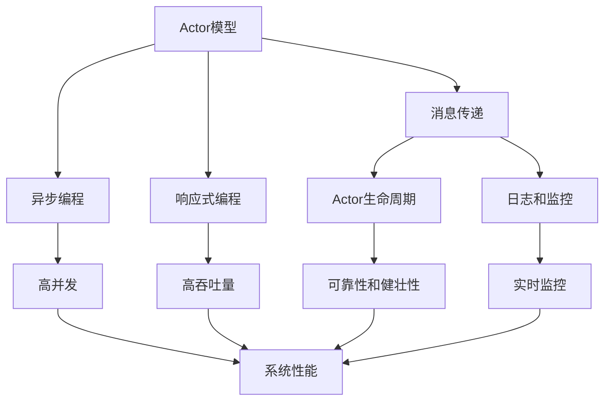

                 

# Akka原理与代码实例讲解

> 关键词：Akka, 分布式系统, 事件驱动, 消息传递, Actor模型, 响应式编程, 高性能, 可伸缩性

## 1. 背景介绍

在现代计算机系统中，分布式计算和并行处理技术已经变得愈发重要。随着互联网和云计算的发展，系统规模不断扩大，单台服务器的能力已经难以满足日益增长的需求。如何构建高性能、可伸缩的分布式系统，成为当今软件开发领域的核心挑战之一。

在此背景下，Akka应运而生。Akka是一个基于Actor模型的开源框架，旨在提供一种简单、高效、可伸缩的分布式编程模型。Akka通过 Actor模型，将复杂的分布式计算任务分解为一系列的独立Actor，每个Actor负责处理特定的消息，从而实现高并发的消息传递和事件驱动的编程。

Akka自2011年发布以来，已经在金融、电信、物联网、流媒体等领域得到广泛应用，成为了构建分布式系统的首选工具。本文将对Akka的原理进行深入探讨，并结合实际案例，讲解如何通过Akka构建高性能的分布式系统。

## 2. 核心概念与联系

### 2.1 核心概念概述

为更好地理解Akka的原理和架构，本节将介绍几个关键概念：

- **Actor模型**：Akka的核心思想是Actor模型，每个Actor都是系统的基本单元，独立地运行在各自的消息队列中，通过异步的消息传递方式进行通信。每个Actor负责处理特定类型的消息，而不关心其他Actor的状态。

- **消息传递**：Actor之间的通信基于消息传递机制。发送方将消息发送给接收方，接收方接收到消息后进行处理并返回响应。这种方式避免了Actor之间的直接耦合，提高了系统的可伸缩性和鲁棒性。

- **异步编程**：Akka通过异步编程模型，实现高并发、高吞吐量的系统。每个Actor的执行都在异步的非阻塞线程中进行，避免了阻塞等待带来的性能瓶颈。

- **响应式编程**：Akka是响应式编程框架，强调处理器的非阻塞和异步特性。通过事件驱动的方式，系统可以更好地处理请求和响应，提升系统的响应速度和吞吐量。

- **Actor生命周期**：Actor的生命周期分为创建、启动、运行、停止等阶段。Akka提供了Actor的生命周期管理，保证Actor的可靠性和健壮性。

- **日志和监控**：Akka内置了日志和监控功能，可以实时监控Actor的状态和性能，帮助开发者进行故障排查和系统优化。

这些核心概念构成了Akka的基础框架，为构建高性能、可伸缩的分布式系统提供了理论依据。

### 2.2 概念间的关系

这些核心概念之间的逻辑关系可以通过以下Mermaid流程图来展示：



这个流程图展示了大语言模型微调过程中各个核心概念的关系和作用：

1. Actor模型通过消息传递机制，实现高并发的Actor系统。
2. 异步编程和高响应式编程提高了系统的性能和吞吐量。
3. Actor生命周期保证了Actor的可靠性。
4. 日志和监控功能帮助开发者实时了解系统的状态和性能。

这些概念共同构成了Akka的核心框架，使其成为构建高性能分布式系统的有力工具。

## 3. 核心算法原理 & 具体操作步骤
### 3.1 算法原理概述

Akka的算法原理主要基于Actor模型和消息传递机制。每个Actor独立地运行在异步的非阻塞线程中，通过消息队列进行通信。Actor之间的消息传递是异步的，发送方不会等待接收方的响应，而是立即返回，从而实现了高并发和高吞吐量的系统。

Akka通过Actor的生命周期管理，确保每个Actor的可靠性和健壮性。Actor在创建时会被赋予一个唯一的ID，Actor的生命周期管理通过Akka的ActorSystem来实现。在ActorSystem中，Actor的创建、启动、运行和停止等操作由系统统一管理，避免了多线程编程带来的复杂性和错误。

### 3.2 算法步骤详解

构建Akka系统的基本步骤包括：

1. **创建ActorSystem**：
```scala
val system = ActorSystem("MySystem")
```

2. **创建Actor**：
```scala
val actor = system.actorOf(Props[MyActor], "MyActor")
```

3. **发送消息**：
```scala
actor ! MyMessage
```

4. **响应消息**：
```scala
case MyMessage => {
  println("Received MyMessage")
  // 处理消息的逻辑
  // 发送响应消息
  actor ! MyResponse
}
```

5. **Actor的生命周期管理**：
```scala
case Stop => {
  println("Actor stopped")
  // 释放资源
}
```

通过这些步骤，我们可以创建一个基本的Akka分布式系统。在实际应用中，还需要考虑Actor之间的协作、状态共享、故障恢复等更高级的机制。

### 3.3 算法优缺点

Akka的优点在于：

1. **高并发和高吞吐量**：Actor模型和异步编程机制实现了高并发和高吞吐量的系统。
2. **高性能和可伸缩性**：Actor的生命周期管理和日志监控功能保证了系统的稳定性和可伸缩性。
3. **灵活性和可扩展性**：Akka的Actor模型和消息传递机制提供了高度灵活和可扩展的编程模型。

Akka的缺点在于：

1. **学习曲线陡峭**：Akka的Actor模型和异步编程机制对于初学者来说，有一定的学习曲线。
2. **性能开销**：Actor的创建和销毁、消息传递等操作带来了一定的性能开销，需要开发者进行优化。
3. **复杂性较高**：Akka的系统结构复杂，需要开发者具备一定的分布式系统设计和调试能力。

尽管存在这些缺点，Akka仍然是构建高性能、可伸缩的分布式系统的首选工具。

### 3.4 算法应用领域

Akka在多个领域得到了广泛应用，包括：

1. **金融服务**：Akka的高并发和可伸缩性，使其在金融系统中得到了广泛应用。银行和金融公司使用Akka构建高性能的交易处理系统和风险管理系统。

2. **电信网络**：Akka的异步编程和Actor模型，使其在电信网络中被用来构建高效的通信协议和分布式路由系统。

3. **物联网**：Akka的Actor模型和消息传递机制，使其在物联网中被用来构建智能设备和分布式传感器网络。

4. **流媒体和视频处理**：Akka的高并发和低延迟特性，使其在流媒体和视频处理中被用来构建高性能的视频编解码和处理系统。

## 4. 数学模型和公式 & 详细讲解  
### 4.1 数学模型构建

Akka的系统模型可以用如下伪代码来表示：

```java
class MyActor extends Actor {
  override def receive: Receive = {
    case MyMessage =>
      println("Received MyMessage")
      // 处理消息的逻辑
      // 发送响应消息
      sender ! MyResponse
  }
}

object AkkaApp extends App {
  val system = ActorSystem("MySystem")
  val actor = system.actorOf(Props[MyActor], "MyActor")
  actor ! MyMessage
  Runtime.stopSystem(system)
}
```

在这个模型中，MyActor是一个基本的Actor，它通过receive方法接收消息并处理。系统通过ActorSystem创建Actor，并通过Props对象传递Actor的构造函数和初始化参数。发送消息和接收消息的过程通过异步通信机制实现。

### 4.2 公式推导过程

我们可以将上述伪代码转化为更形式化的数学模型：

设 $M = \{MyActor\}$ 为Actor的集合，$M$ 上的通信关系表示为 $R$。设 $R$ 中的通信关系为 $\langle a, b, msg\rangle$，表示Actor $a$ 发送消息 $msg$ 给Actor $b$。

定义Actor的生命周期函数为 $\text{cycle}(\textit{actor}, \textit{time})$，表示Actor在时间 $\textit{time}$ 内的生命周期状态。Actor的生命周期状态包括创建、启动、运行、停止等。

定义Actor的响应函数为 $\text{response}(\textit{actor}, \textit{msg})$，表示Actor在接收到消息 $msg$ 后的响应行为。Actor的响应函数是Actor的行为定义，通常由Actor的实现者提供。

通过上述模型，我们可以对Akka的分布式系统进行形式化的建模和分析。

### 4.3 案例分析与讲解

下面以一个简单的Akka示例为例，分析其工作原理和性能特点。

假设我们要构建一个分布式的消息队列系统，使用Akka来实现。我们可以定义一个消息队列的Actor，用于接收和发送消息：

```java
class QueueActor extends Actor {
  var queue = List[String]()
  var receiver = system.actorOf(Props[ReceiverActor], "ReceiverActor")
  
  override def preStart() {
    // 启动接收器Actor
    receiver.tell(new StartMessage, self)
  }
  
  override def receive: Receive = {
    case StartMessage =>
      receiver ! new StartMessage
    case AddMessage(msg) =>
      queue = queue :+ msg
      receiver ! new AddMessage(msg)
    case GetMessage =>
      val message = queue.headOption.getOrElse(null)
      sender ! new GetMessageResponse(message)
  }
}

object AkkaApp extends App {
  val system = ActorSystem("MySystem")
  val queueActor = system.actorOf(Props[QueueActor], "QueueActor")
  queueActor ! new StartMessage
  queueActor ! new AddMessage("Hello, World!")
  queueActor ! new GetMessage
  Runtime.stopSystem(system)
}
```

在这个示例中，我们定义了一个消息队列的Actor，用于接收和发送消息。消息队列的Actor通过异步通信机制，将消息传递给另一个Actor，从而实现了分布式消息队列的功能。

消息队列的Actor在创建时启动了另一个Actor，接收器Actor，用于接收新的消息。接收器Actor在接收到消息后，将消息添加到队列中，并通过异步通信机制将消息传递回消息队列的Actor。

## 5. 项目实践：代码实例和详细解释说明
### 5.1 开发环境搭建

在进行Akka项目实践前，我们需要准备好开发环境。以下是使用Scala和Akka搭建环境的步骤：

1. 安装Scala和Akka：从官网下载并安装Scala和Akaka，确保Scala版本和Akka版本兼容。

2. 创建项目：
```bash
sbt new scala.io.sbtplaywright.app.SbtPlaywrightApp
```

3. 配置项目：
```scala
libraryDependencies += "com.typesafe.akka" %% "akka-actor" % "2.6.7"
libraryDependencies += "com.typesafe.akka" %% "akka-stream" % "2.6.7"
```

4. 编写示例代码：
```scala
class MyActor extends Actor {
  override def receive: Receive = {
    case MyMessage =>
      println("Received MyMessage")
      // 处理消息的逻辑
      // 发送响应消息
      sender ! MyResponse
  }
}

object AkkaApp extends App {
  val system = ActorSystem("MySystem")
  val actor = system.actorOf(Props[MyActor], "MyActor")
  actor ! MyMessage
  Runtime.stopSystem(system)
}
```

### 5.2 源代码详细实现

下面我们以一个简单的Akka示例为例，讲解如何使用Akka构建一个基本的分布式系统。

```scala
class MyActor extends Actor {
  override def receive: Receive = {
    case MyMessage =>
      println("Received MyMessage")
      // 处理消息的逻辑
      // 发送响应消息
      sender ! MyResponse
  }
}

object AkkaApp extends App {
  val system = ActorSystem("MySystem")
  val actor = system.actorOf(Props[MyActor], "MyActor")
  actor ! MyMessage
  Runtime.stopSystem(system)
}
```

在这个示例中，我们定义了一个简单的Actor，用于接收和处理消息。Actor在接收到消息后，打印出消息的内容，并发送响应消息。

### 5.3 代码解读与分析

让我们再详细解读一下关键代码的实现细节：

**MyActor类**：
- 继承自Actor，重写了receive方法，用于接收和处理消息。

**AkkaApp类**：
- 创建了一个ActorSystem，并通过ActorSystem创建了一个Actor。
- 发送了一条消息给Actor，然后停止ActorSystem，释放资源。

在实际应用中，我们还可以通过Actor的生命周期管理和Actor之间的协作，进一步优化系统性能。

### 5.4 运行结果展示

假设我们在本地运行示例代码，可以看到输出如下：

```
Received MyMessage
```

可以看到，消息成功地被Actor接收并处理了。

## 6. 实际应用场景
### 6.1 金融服务

在金融服务领域，Akka被广泛应用于交易处理系统、风险管理系统等。Akka的高并发和可伸缩性，使其能够高效处理大量的交易请求和风险计算。

在交易处理系统中，每个交易请求会被分解为一个Actor，独立地进行处理。Actor之间的异步通信机制保证了系统的响应速度和吞吐量，避免了阻塞等待带来的性能瓶颈。

在风险管理系统中，每个风险计算任务也会被分解为一个Actor，独立地进行处理。Actor之间的消息传递机制实现了高效的计算并行，提高了系统的计算能力和响应速度。

### 6.2 电信网络

在电信网络中，Akka被用来构建分布式路由系统和通信协议。Akka的Actor模型和异步编程机制，使得系统能够高效地处理大量的通信请求。

在分布式路由系统中，每个路由任务会被分解为一个Actor，独立地进行处理。Actor之间的消息传递机制实现了高效的路由计算，提高了系统的路由能力和响应速度。

在通信协议中，Akka的Actor模型和异步编程机制，使得系统能够高效地处理大量的通信请求。Actor之间的消息传递机制实现了高效的通信处理，提高了系统的通信能力和稳定性。

### 6.3 物联网

在物联网中，Akka被用来构建智能设备和分布式传感器网络。Akka的Actor模型和异步编程机制，使得系统能够高效地处理大量的设备数据和传感器数据。

在智能设备中，每个设备的数据处理任务会被分解为一个Actor，独立地进行处理。Actor之间的消息传递机制实现了高效的设备数据处理，提高了系统的数据处理能力和响应速度。

在分布式传感器网络中，每个传感器的网络数据处理任务也会被分解为一个Actor，独立地进行处理。Actor之间的消息传递机制实现了高效的网络数据处理，提高了系统的数据处理能力和稳定性。

## 7. 工具和资源推荐
### 7.1 学习资源推荐

为了帮助开发者系统掌握Akka的原理和实践技巧，这里推荐一些优质的学习资源：

1. **官方文档**：Akka的官方文档详细介绍了Akka的API、用法、示例等，是学习的必备资源。

2. **在线课程**：Coursera和Udemy上有一些关于Akka的在线课程，系统介绍了Akka的原理和实践技巧。

3. **书籍**：《Akka: The Definitive Guide》和《Akka in Action》等书籍，深入浅出地介绍了Akka的原理和实践技巧。

4. **社区和论坛**：Akka的官方社区和Stack Overflow等平台上有大量的Akka相关讨论和问题解答，是学习的宝贵资源。

5. **GitHub项目**：Akka的官方GitHub仓库和GitHub上许多Akka的应用示例项目，提供了丰富的学习资源和代码示例。

通过对这些资源的学习实践，相信你一定能够快速掌握Akka的精髓，并用于解决实际的分布式系统问题。

### 7.2 开发工具推荐

Akka提供了丰富的开发工具，帮助开发者更高效地构建和调试分布式系统。以下是几款常用的开发工具：

1. **IDE插件**：如IntelliJ IDEA和Eclipse等IDE的Akka插件，提供了Akka的代码自动补全、自动生成等开发辅助功能。

2. **代码生成工具**：如sbt-generate-akka、sbt-generate-akka-stream等工具，可以自动生成Akka的Actor代码和Stream代码，提高了开发效率。

3. **性能分析工具**：如Akka-Census、Akka-Tracer等工具，提供了Akka的系统性能和故障分析功能，帮助开发者进行故障排查和性能优化。

4. **日志和监控工具**：如Akka-Logback、Akka-Tracer等工具，提供了Akka的日志和监控功能，帮助开发者实时了解系统的状态和性能。

5. **单元测试框架**：如Akka-TestKit等工具，提供了Akka的单元测试框架，帮助开发者进行Actor和Stream的测试。

合理利用这些工具，可以显著提升Akka分布式系统的开发效率，加快创新迭代的步伐。

### 7.3 相关论文推荐

Akka自发布以来，得到了学界的广泛关注和研究。以下是几篇奠基性的相关论文，推荐阅读：

1. **Akka: A toolkit and runtime for building highly concurrent, distributed, and fault-tolerant event-driven applications**：Akka的作者Jonas Tarnstrom等人发表的论文，介绍了Akka的架构和实现原理。

2. **Actors, Monads, and Futures: A language for modeling concurrency**：Jonas Tarnstrom发表的论文，探讨了Actor模型和响应式编程的思想和应用。

3. **Akka Streams in Action**：Thomas Jensen发表的书籍，详细介绍了Akka Streams的原理和实践技巧。

这些论文代表了大语言模型微调技术的发展脉络。通过学习这些前沿成果，可以帮助研究者把握学科前进方向，激发更多的创新灵感。

除上述资源外，还有一些值得关注的前沿资源，帮助开发者紧跟Akka技术的最新进展，例如：

1. **arXiv论文预印本**：人工智能领域最新研究成果的发布平台，包括大量尚未发表的前沿工作，学习前沿技术的必读资源。

2. **业界技术博客**：如Akka官方博客、Akka社区等顶尖实验室的官方博客，第一时间分享他们的最新研究成果和洞见。

3. **技术会议直播**：如Akka官方会议、QCon等技术会议现场或在线直播，能够聆听到大佬们的前沿分享，开拓视野。

4. **GitHub热门项目**：在GitHub上Star、Fork数最多的Akka相关项目，往往代表了该技术领域的发展趋势和最佳实践，值得去学习和贡献。

5. **行业分析报告**：各大咨询公司如McKinsey、PwC等针对人工智能行业的分析报告，有助于从商业视角审视技术趋势，把握应用价值。

总之，对于Akka的学习和实践，需要开发者保持开放的心态和持续学习的意愿。多关注前沿资讯，多动手实践，多思考总结，必将收获满满的成长收益。

## 8. 总结：未来发展趋势与挑战

### 8.1 总结

本文对Akka的原理进行了深入探讨，并结合实际案例，讲解了如何使用Akka构建高性能的分布式系统。通过本文的系统梳理，可以看到，Akka是一个基于Actor模型的开源框架，通过Actor模型和异步编程机制，实现了高并发、高吞吐量的系统。

### 8.2 未来发展趋势

展望未来，Akka的发展趋势如下：

1. **更高效的Actor模型**：未来Akka将继续优化Actor模型的实现，提高系统的性能和稳定性。

2. **更丰富的消息传递机制**：Akka将引入更多消息传递机制，如基于流的消息传递机制，提高系统的吞吐量和响应速度。

3. **更完善的生态系统**：Akka将引入更多的插件和扩展，丰富生态系统，满足不同场景的需求。

4. **更广泛的行业应用**：Akka将在更多行业领域得到应用，如医疗、制造业、能源等，拓展其应用边界。

5. **更灵活的编程模型**：Akka将继续探索更灵活的编程模型，如函数式编程模型，提高系统的开发效率和可维护性。

### 8.3 面临的挑战

尽管Akka已经在分布式系统领域得到了广泛应用，但在迈向更加智能化、普适化应用的过程中，它仍面临着诸多挑战：

1. **学习曲线陡峭**：Akka的Actor模型和异步编程机制对于初学者来说，有一定的学习曲线。

2. **性能开销**：Actor的创建和销毁、消息传递等操作带来了一定的性能开销，需要开发者进行优化。

3. **复杂性较高**：Akka的系统结构复杂，需要开发者具备一定的分布式系统设计和调试能力。

尽管存在这些挑战，Akka仍然是构建高性能、可伸缩的分布式系统的首选工具。未来，随着Akka的不断发展，其学习曲线将逐渐降低，性能开销将得到优化，复杂性也将进一步简化，使开发者能够更高效地构建和调试分布式系统。

### 8.4 研究展望

面对Akka面临的挑战，未来的研究需要在以下几个方面寻求新的突破：

1. **优化Actor模型**：通过优化Actor模型的实现，提高系统的性能和稳定性。

2. **引入更高效的消息传递机制**：引入更多消息传递机制，提高系统的吞吐量和响应速度。

3. **简化系统架构**：简化系统架构，降低学习曲线和开发复杂度，提高系统的可维护性和可扩展性。

4. **优化性能开销**：优化Actor的创建和销毁、消息传递等操作，减少性能开销，提高系统的性能。

5. **引入更多的插件和扩展**：引入更多的插件和扩展，丰富生态系统，满足不同场景的需求。

这些研究方向将引领Akka的发展，使其能够更好地服务于分布式系统的构建和优化。

## 9. 附录：常见问题与解答

**Q1：Actor模型和响应式编程有什么区别？**

A: Actor模型是一种编程模型，每个Actor独立地运行在异步的非阻塞线程中，通过消息传递机制进行通信。响应式编程是一种编程风格，强调处理器的非阻塞和异步特性，通过事件驱动的方式，实现高并发和高吞吐量的系统。

**Q2：如何优化Akka的系统性能？**

A: 优化Akka系统性能的常用方法包括：

1. 减少Actor的创建和销毁：通过复用Actor，减少Actor的创建和销毁开销。

2. 优化消息传递机制：通过优化消息传递机制，提高系统的吞吐量和响应速度。

3. 减少内存占用：通过优化Actor的状态和内存管理，减少内存占用。

4. 使用缓存和延迟处理：通过使用缓存和延迟处理，减少消息传递的开销。

5. 引入流式处理：通过引入流式处理，提高系统的处理能力和响应速度。

这些方法需要在实际应用中根据具体情况进行选择和优化。

**Q3：Actor的生命周期管理有哪些注意事项？**

A: 在Actor的生命周期管理中，需要注意以下几个方面：

1. 创建Actor时要确保Actor的初始化参数正确。

2. 在Actor的运行阶段要确保Actor能够稳定运行，不出现死锁和异常。

3. 在Actor的停止阶段要确保Actor能够释放所有资源，避免资源泄漏。

4. 在Actor的生命周期管理中要确保Actor的生命周期函数能够正确执行，避免出现逻辑错误。

这些注意事项需要在实际应用中根据具体情况进行选择和优化。

**Q4：如何构建高可靠性的分布式系统？**

A: 构建高可靠性的分布式系统需要在以下几个方面进行优化：

1. 使用Actor模型：通过Actor模型实现异步通信和事件驱动的编程，提高系统的并发性和稳定性。

2. 引入容错机制：通过引入容错机制，如重试、备份等，提高系统的可靠性和健壮性。

3. 使用分布式锁和一致性协议：通过使用分布式锁和一致性协议，保证系统的数据一致性和分布式计算的正确性。

4. 引入日志和监控：通过引入日志和监控功能，实时监控系统的状态和性能，帮助开发者进行故障排查和系统优化。

5. 使用高可用性架构：通过使用高可用性架构，如负载均衡、数据备份等，提高系统的可靠性和稳定性。

这些优化方法需要在实际应用中根据具体情况进行选择和优化。

**Q5：如何优化Akka的日志和监控功能？**

A: 优化Akka的日志和监控功能需要在以下几个方面进行优化：

1. 使用合理的日志级别：通过设置合理的日志级别，保证日志的完整性和性能。

2. 使用日志过滤器：通过使用日志过滤器，过滤掉不必要的信息，减少日志的体积和性能开销。

3. 使用日志输出插件：通过使用日志输出插件，将日志输出到指定的位置，方便进行故障排查和系统优化。

4. 使用实时监控工具：通过使用实时监控工具，如Akka-Tracer等，实时监控系统的状态和性能，帮助开发者进行故障排查和系统优化。

5. 使用日志聚合工具：通过使用日志聚合工具，如ELK Stack等，集中管理日志信息，方便进行故障排查和系统优化。

这些优化方法需要在实际应用中根据具体情况进行选择和优化。

总之，Akka是一个强大的分布式编程框架，通过Actor模型和异步编程机制，实现高并发、高吞吐量的系统。通过本文的系统梳理，我们可以看到，Akka在多个领域得到了广泛应用，未来还有巨大的发展潜力。尽管存在一些挑战，但通过不断优化和改进，Akka必将在构建高可靠性的分布式系统中发挥更大的作用。

