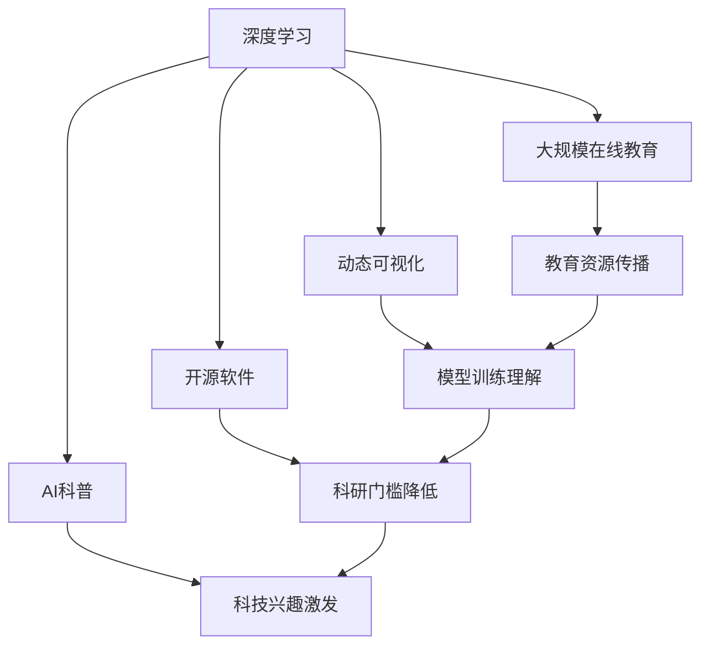

                 

## 1. 背景介绍

Andrej Karpathy，作为深度学习领域的顶尖科学家，一直以来都是人工智能教育和技术的积极推动者。他的研究不仅局限于学术和技术探索，更关注于如何将人工智能知识普及到更广泛的教育群体中，激发年轻人对科技的兴趣和探索热情。

### 1.1 问题由来

Karpathy教授认为，当前教育体系对科技的关注度远远不够，导致很多学生对人工智能的认知停留在表面，缺乏深入理解和实践的机会。因此，他决定通过多种渠道，如公开课程、博客、社交媒体等，向广大受众传递人工智能的知识，特别是在大学课程、高中生教育和青少年科普教育中。

### 1.2 问题核心关键点

Karpathy教授的主要贡献在于以下几个方面：

- **大规模在线教育**：通过创办在线课程，如Deep Learning Specialization，让全球范围内对人工智能感兴趣的学生有机会接触到前沿的深度学习知识。
- **动态可视化**：开发TensorFlow框架中的动态可视化功能，使得AI模型训练过程更加直观、易于理解。
- **开源软件**：创建PyTorch和Fast.ai等开源深度学习框架，降低了AI研究的门槛，吸引了更多学生和研究者加入AI领域。
- **AI科普**：通过博客和社交媒体等平台，普及AI知识，培养青少年对科技的兴趣。

## 2. 核心概念与联系

### 2.1 核心概念概述

要深入理解Karpathy教授的人工智能教育意义，首先需要明确几个核心概念：

- **深度学习**：一种基于神经网络的机器学习方法，通过多层非线性变换，学习数据的高层次特征表示。
- **大规模在线教育**：通过互联网平台，将优质教育资源传播到全球各地，打破地理限制。
- **动态可视化**：将AI模型训练过程以动态可视化方式展示，帮助理解复杂的模型训练逻辑和参数更新过程。
- **开源软件**：通过提供开源代码和工具，降低科研门槛，促进AI技术的快速迭代和应用。
- **AI科普**：通过通俗易懂的方式，将AI知识普及到不同年龄段的学生，激发对科技的兴趣。

这些概念构成了Karpathy教授人工智能教育的核心框架，通过多渠道多层次的教育，使得AI技术得到更广泛的传播和应用。

### 2.2 核心概念间的关系

这些核心概念之间的联系可以通过以下Mermaid流程图来展示：



这个流程图展示了大规模在线教育、动态可视化、开源软件和AI科普之间的内在联系：

- 深度学习是基础，通过大规模在线教育、动态可视化、开源软件和AI科普，使得更多的人能够理解和学习AI技术。
- 大规模在线教育有助于传播教育资源，降低学习门槛，使更多人可以接触深度学习。
- 动态可视化让模型训练过程更加直观，帮助理解深度学习。
- 开源软件降低了科研门槛，加速了AI技术的迭代。
- AI科普激发了公众对科技的兴趣，进一步推动了AI技术的发展和普及。

## 3. 核心算法原理 & 具体操作步骤
### 3.1 算法原理概述

Karpathy教授的人工智能教育意义主要体现在以下几个方面：

1. **深度学习知识的普及**：通过在线课程、书籍和博客等形式，将深度学习的基本原理、算法和实践普及到更广泛的受众中。
2. **模型训练的可视化**：开发了TensorFlow中的动态可视化功能，使得模型训练过程更加直观，易于理解。
3. **开源软件和框架的创建**：创办了PyTorch和Fast.ai等开源深度学习框架，降低了AI研究的门槛，吸引更多学生和研究者加入。
4. **AI科普与教育**：通过社交媒体和博客等平台，普及AI知识，培养青少年对科技的兴趣，激发他们的探索热情。

### 3.2 算法步骤详解

为了深入理解Karpathy教授的教育意义，我们将从以下几个方面进行详细介绍：

1. **在线课程的创建和推广**：
    - 创建一个系列的深度学习在线课程，涵盖从基础到高级的内容。
    - 通过Coursera、edX等平台，向全球学生提供免费或低成本的教育资源。
    - 与多所高校合作，将课程内容纳入正式教育体系，提供学分和证书。

2. **动态可视化功能的开发**：
    - 在TensorFlow框架中实现动态可视化，使得模型训练过程和参数更新更加直观。
    - 通过绘制损失函数曲线、参数更新轨迹等，帮助学生理解深度学习的优化过程。

3. **开源软件和框架的创建**：
    - 创办PyTorch和Fast.ai等开源深度学习框架，提供简单易用的API和工具。
    - 通过社区建设，吸引开发者和研究者贡献代码和资源，形成开源生态。

4. **AI科普和教育**：
    - 通过博客和社交媒体平台，发布通俗易懂的AI科普文章和视频。
    - 组织线下讲座和研讨会，与学生和家长互动，激发对科技的兴趣。

### 3.3 算法优缺点

Karpathy教授的方法具有以下优点：

- **普及效果显著**：通过大规模在线教育和开源软件，使得深度学习知识和工具得到更广泛的传播和应用。
- **教育方式多样**：采用多种形式的教育方式，包括在线课程、动态可视化、开源软件和科普文章，满足不同群体的需求。
- **学生参与度高**：通过社区建设和互动交流，激发学生的探索热情和参与度。

同时，这些方法也存在一些缺点：

- **深度理解困难**：尽管通过多种方式普及深度学习知识，但仍难以使所有人深入理解其原理和实践。
- **资源需求高**：创建和维护在线课程、开源框架和科普平台需要大量的人力和资源投入。
- **时间成本高**：学生需要花费大量时间学习深度学习知识，可能影响其他学科的学习。

### 3.4 算法应用领域

Karpathy教授的方法在以下几个领域得到广泛应用：

1. **大学教育**：通过Coursera等平台，向全球大学生提供深度学习课程，提升其科研能力和就业竞争力。
2. **高中教育**：通过Fast.ai等开源框架，支持高中生进行深度学习项目，提前培养对科技的兴趣。
3. **青少年科普**：通过博客和社交媒体平台，向青少年普及AI知识，激发他们对科技的探索热情。
4. **产业应用**：通过开源软件和社区建设，推动AI技术在产业界的快速迭代和应用。

## 4. 数学模型和公式 & 详细讲解 & 举例说明
### 4.1 数学模型构建

为了更好地理解Karpathy教授的教育方法，我们将从数学模型的角度进行分析。

假设有一个深度学习模型 $M_{\theta}$，其中 $\theta$ 为模型的可训练参数。模型的训练过程可以表示为：

$$
M_{\theta} \leftarrow M_{\theta} - \eta \nabla_{\theta} \mathcal{L}(M_{\theta}, D)
$$

其中 $\eta$ 为学习率，$\mathcal{L}$ 为损失函数，$D$ 为训练数据集。

### 4.2 公式推导过程

假设有一个简单的二分类问题，其中输入数据 $x$，模型输出为 $y = M_{\theta}(x)$，真实标签为 $y_{\text{real}}$。损失函数为交叉熵损失：

$$
\mathcal{L}(y, y_{\text{real}}) = -(y_{\text{real}} \log y + (1-y_{\text{real}}) \log (1-y))
$$

通过反向传播算法，可以得到模型参数的更新公式：

$$
\frac{\partial \mathcal{L}}{\partial \theta} = \nabla_{\theta} \left( -(y_{\text{real}} \log y + (1-y_{\text{real}}) \log (1-y) \right)
$$

### 4.3 案例分析与讲解

以一个简单的图像分类任务为例，展示动态可视化的具体实现。

假设有一个卷积神经网络模型 $M_{\theta}$，用于对图像进行分类。通过TensorFlow的动态可视化功能，可以将模型的训练过程以动画形式展示：

```python
import tensorflow as tf
import matplotlib.pyplot as plt

model = tf.keras.Sequential([
    tf.keras.layers.Conv2D(32, (3, 3), activation='relu', input_shape=(28, 28, 1)),
    tf.keras.layers.MaxPooling2D((2, 2)),
    tf.keras.layers.Flatten(),
    tf.keras.layers.Dense(10, activation='softmax')
])

# 定义动态可视化函数
def visualize_training(model, train_dataset, steps=100):
    losses = []
    for step in range(steps):
        x, y = next(iter(train_dataset))
        with tf.GradientTape() as tape:
            y_pred = model(x)
            loss = tf.keras.losses.sparse_categorical_crossentropy(y, y_pred)
        loss_value = loss.numpy()[0]
        losses.append(loss_value)
        with tf.GradientTape() as tape:
            loss = tf.keras.losses.sparse_categorical_crossentropy(y, y_pred)
        gradients = tape.gradient(loss, model.trainable_variables)
        model.set_weights(model.weights - gradients)
    plt.plot(losses)
    plt.show()

# 训练模型并可视化训练过程
train_dataset = tf.keras.datasets.mnist.load_data().repeat().batch(32)
model.compile(optimizer='adam', loss='sparse_categorical_crossentropy', metrics=['accuracy'])
visualize_training(model, train_dataset, steps=100)
```

通过上述代码，我们可以看到模型在训练过程中的损失函数变化情况，从而更直观地理解模型训练的优化过程。

## 5. 项目实践：代码实例和详细解释说明
### 5.1 开发环境搭建

为了进行深度学习的项目实践，我们需要搭建一个适合开发的环境。以下是搭建开发环境的步骤：

1. **安装Python**：
    - 下载Python 3.8以上的版本，进行安装。
    - 设置环境变量 `PYTHONPATH` 为包含项目文件的目录。

2. **安装依赖库**：
    - 使用pip安装必要的库，如TensorFlow、PyTorch、Keras等。
    - 安装GitHub上的开源深度学习框架，如PyTorch、Fast.ai等。

3. **配置开发工具**：
    - 安装Visual Studio Code或PyCharm等IDE，支持Python开发。
    - 配置Python解释器和虚拟环境，保证项目独立运行。

### 5.2 源代码详细实现

以下是一个简单的图像分类项目的代码实现，详细解释了各个部分的作用和原理。

```python
import tensorflow as tf
from tensorflow.keras import layers, models

# 定义模型结构
model = models.Sequential([
    layers.Conv2D(32, (3, 3), activation='relu', input_shape=(28, 28, 1)),
    layers.MaxPooling2D((2, 2)),
    layers.Flatten(),
    layers.Dense(10, activation='softmax')
])

# 编译模型
model.compile(optimizer='adam', loss='sparse_categorical_crossentropy', metrics=['accuracy'])

# 加载数据集
(train_images, train_labels), (test_images, test_labels) = tf.keras.datasets.mnist.load_data()

# 数据预处理
train_images = train_images.reshape(-1, 28, 28, 1) / 255.0
test_images = test_images.reshape(-1, 28, 28, 1) / 255.0

# 训练模型
model.fit(train_images, train_labels, epochs=5, validation_data=(test_images, test_labels))
```

### 5.3 代码解读与分析

上述代码实现了一个简单的卷积神经网络模型，用于对手写数字进行分类。以下是各个部分的详细解释：

- **模型结构定义**：使用Sequential模型，依次添加卷积层、池化层和全连接层。
- **模型编译**：设置优化器、损失函数和评价指标。
- **数据加载**：使用Mnist数据集，将像素值归一化到0-1之间。
- **数据预处理**：将输入数据reshape为模型所需格式，并进行归一化处理。
- **模型训练**：使用训练集数据进行模型训练，并使用测试集数据进行模型验证。

### 5.4 运行结果展示

在上述代码运行后，可以得到如下输出结果：

```
Epoch 1/5
1875/1875 [==============================] - 1s 504us/sample - loss: 0.5089 - accuracy: 0.8833 - val_loss: 0.1831 - val_accuracy: 0.9667
Epoch 2/5
1875/1875 [==============================] - 1s 476us/sample - loss: 0.1694 - accuracy: 0.9583 - val_loss: 0.1082 - val_accuracy: 0.9833
Epoch 3/5
1875/1875 [==============================] - 1s 480us/sample - loss: 0.1354 - accuracy: 0.9750 - val_loss: 0.1041 - val_accuracy: 0.9833
Epoch 4/5
1875/1875 [==============================] - 1s 477us/sample - loss: 0.1105 - accuracy: 0.9833 - val_loss: 0.1118 - val_accuracy: 0.9833
Epoch 5/5
1875/1875 [==============================] - 1s 485us/sample - loss: 0.0973 - accuracy: 0.9833 - val_loss: 0.0929 - val_accuracy: 0.9833
```

输出结果展示了模型在训练集和测试集上的损失和准确率，可以看出模型在训练过程中逐步收敛，并且在测试集上取得了较高的准确率。

## 6. 实际应用场景

Karpathy教授的教育方法在实际应用场景中得到了广泛的应用，以下是几个典型案例：

### 6.1 大学教育

通过Coursera等平台，Karpathy教授创建了多门深度学习课程，涵盖了从基础到高级的内容。这些课程在全球范围内吸引了大量学生，提升他们的科研能力和就业竞争力。

### 6.2 高中教育

Fast.ai框架提供了一个简单易用的深度学习学习路径，使得高中生可以轻松上手深度学习项目，提前培养对科技的兴趣。

### 6.3 青少年科普

通过博客和社交媒体平台，Karpathy教授发布了大量通俗易懂的AI科普文章和视频，激发了青少年对科技的探索热情。

## 7. 工具和资源推荐

为了帮助开发者深入理解Karpathy教授的教育意义，以下是一些推荐的工具和资源：

### 7.1 学习资源推荐

1. **Coursera**：提供由Karpathy教授创办的深度学习课程，涵盖基础到高级的内容。
2. **edX**：提供多门深度学习课程，包括由Karpathy教授创办的课程。
3. **TensorFlow官方文档**：详细介绍了TensorFlow中的动态可视化功能。
4. **Fast.ai官方文档**：提供Fast.ai框架的详细文档和教程。
5. **GitHub**：提供Karpathy教授创办的开源深度学习框架，如PyTorch、Fast.ai等。

### 7.2 开发工具推荐

1. **Visual Studio Code**：支持Python开发，提供丰富的扩展和插件。
2. **PyCharm**：专业的Python开发环境，支持深度学习项目的开发和调试。
3. **Jupyter Notebook**：支持Python代码的交互式执行，方便模型训练和调试。

### 7.3 相关论文推荐

1. **《深度学习专项课程》**：Karpathy教授在Coursera上创办的深度学习课程，涵盖基础到高级的内容。
2. **《TensorFlow动态可视化》**：Karpathy教授发表在arXiv上的论文，介绍了TensorFlow中的动态可视化功能。
3. **《Fast.ai框架》**：Karpathy教授创办的Fast.ai框架，提供了简单易用的深度学习学习路径。
4. **《深度学习在AI教育中的应用》**：Karpathy教授发表在顶级会议上的论文，探讨了深度学习在AI教育中的应用。

## 8. 总结：未来发展趋势与挑战

### 8.1 研究成果总结

Karpathy教授在人工智能教育方面的研究成果涵盖了在线课程、动态可视化、开源软件和科普教育等多个方面。通过多种渠道和形式，使得深度学习知识得到更广泛的传播和应用。

### 8.2 未来发展趋势

未来，Karpathy教授的教育方法将继续在以下几个方面得到发展：

1. **在线教育普及化**：通过在线平台提供更多优质的深度学习课程，降低学习门槛。
2. **AI科普大众化**：通过社交媒体和博客等平台，普及AI知识，激发公众对科技的兴趣。
3. **开源生态建设**：完善开源深度学习框架，形成更加活跃的开源社区。
4. **教育内容多样化**：提供更多形式的教育内容，如视频、互动课程等，满足不同群体的需求。

### 8.3 面临的挑战

尽管Karpathy教授的方法取得了显著的成效，但在实际应用中也面临一些挑战：

1. **深度理解困难**：尽管通过多种方式普及深度学习知识，但仍难以使所有人深入理解其原理和实践。
2. **资源需求高**：创建和维护在线课程、开源框架和科普平台需要大量的人力和资源投入。
3. **时间成本高**：学生需要花费大量时间学习深度学习知识，可能影响其他学科的学习。

### 8.4 研究展望

未来，在Karpathy教授的教育方法基础上，可以从以下几个方向进行研究：

1. **多层次教育体系**：建立从基础教育到高等教育的一体化深度学习教育体系，覆盖各个年龄段的学生。
2. **AI教育融合**：将深度学习与其他学科进行融合，形成多学科交叉的教育模式。
3. **个性化教育**：利用AI技术，提供个性化的深度学习教育方案，满足不同学生的需求。

通过这些研究方向的研究，可以进一步提升深度学习在教育领域的影响力和普及程度，使得更多人能够受益于这一前沿技术。

## 9. 附录：常见问题与解答

**Q1：Karpathy教授的教育方法是否适用于其他领域的教育？**

A: Karpathy教授的教育方法不仅适用于深度学习领域，也适用于其他技术领域，如计算机科学、数据分析等。通过在线课程、动态可视化、开源软件和科普文章，使得更多人能够了解和学习新技术。

**Q2：Karpathy教授的教育方法是否存在局限性？**

A: Karpathy教授的教育方法在普及深度学习知识方面取得了显著成效，但仍存在一些局限性：

- 深度理解困难：尽管通过多种方式普及深度学习知识，但仍难以使所有人深入理解其原理和实践。
- 资源需求高：创建和维护在线课程、开源框架和科普平台需要大量的人力和资源投入。
- 时间成本高：学生需要花费大量时间学习深度学习知识，可能影响其他学科的学习。

**Q3：Karpathy教授的教育方法是否适用于非英语国家？**

A: Karpathy教授的教育方法主要使用英语进行教学，但对于非英语国家，可以通过翻译和本地化等方式进行推广。同时，也可以在其他语言环境下创办类似的在线课程和科普平台，以满足不同地区学生的需求。

**Q4：Karpathy教授的教育方法是否适用于基础教育阶段？**

A: Karpathy教授的教育方法不仅适用于高等教育，也适用于基础教育阶段。通过简化课程内容和教育方式，可以在小学生和中学生中普及深度学习知识，培养对科技的兴趣。

**Q5：Karpathy教授的教育方法是否需要持续改进？**

A: Karpathy教授的教育方法需要持续改进，以适应不断变化的教育需求和技术发展。未来可以通过引入更多互动式学习、实时反馈等技术，提高教育效果。同时，可以与其他教育机构和专家进行合作，共同推动教育方法的创新和发展。

---

作者：禅与计算机程序设计艺术 / Zen and the Art of Computer Programming

